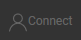
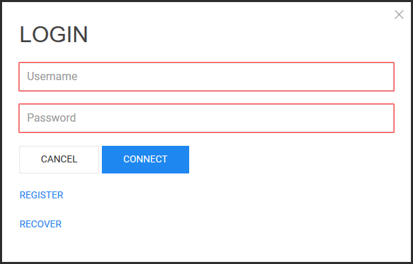

# User account

## Table Of Contents

- [Introduction](#Introduction)
- [How to create an account](#How-to-create-an-account)
- [How to login](#How-to-login)
- [How to recover password](#How-to-recover-password)

## Introduction

Hotmaps allows the user to create an account to import/upload his own data.

Each user has a certain storage capacity to import his data. The disk usage is shown on the profile page. 

Everybody can register using an email address. 

To create an account click on  to open the login popup.

<code><ins>**[To Top](#table-of-contents)**</ins></code>

## How to create an account

To create an account click on **REGISTER**.

Fill in the form and click on **CREATE ACCOUNT**.

You should receive an email[^1] for validation few minutes after. 

Click the link in the email to validate you account. 

You will be redirected to the Hotmaps toolbox.

You can now login.

<code><ins>**[To Top](#table-of-contents)**</ins></code>

## How to login

To login on the platform, enter your username and password.

Click on **CONNECT**.

<code><ins>**[To Top](#table-of-contents)**</ins></code>

## How to recover password

If you don't remember your password you can still ask for a new one. 

Fill the email field and click **RECOVER PASSWORD**.

You will receive an email[^1].

Follow the instructions to get a new password.

<code><ins>**[To Top](#table-of-contents)**</ins></code>

[^1]: Please make sure you also checked your spam folder if you don't see the email in you mailbox.