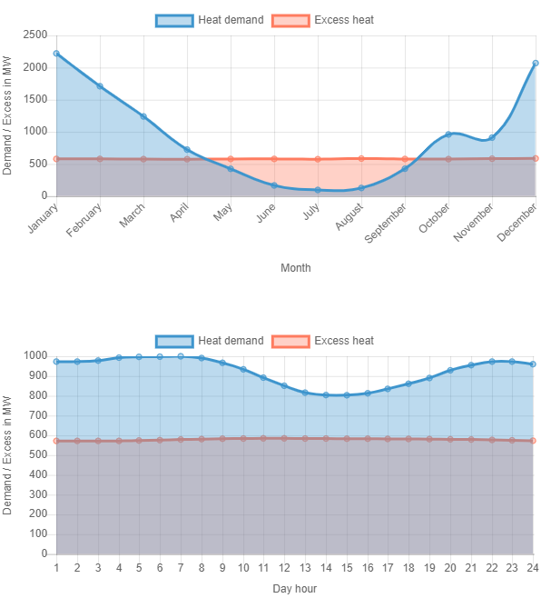

<h1><a class="anchor" id="cm-excess-heat-transport-potential" href="#cm-excess-heat-transport-potential"><i class="fa fa-link"></i></a>CM Излишен потенциал за пренос на топлина</h1><h2><a class="anchor" id="table-of-contents" href="#table-of-contents"><i class="fa fa-link"></i></a> Съдържание</h2><ul><li> <a href="#in-a-glance">С един поглед</a></li><li> <a href="#introduction">Въведение</a></li><li> <a href="#inputs-and-outputs">Входове и изходи</a><ul><li> <a href="#inputs-and-outputs_input-layers-and-parameters">Входни слоеве и параметри</a></li><li> <a href="#inputs-and-outputs_output">Изход</a></li></ul></li><li> <a href="#method">Метод</a><ul><li> <a href="#method_overview">Общ преглед</a></li><li> <a href="#method_details">Подробности</a></li><li> <a href="#method_implementation">Изпълнение</a></li></ul></li><li> <a href="#github-repository-of-this-calculation-module">Хранилище на GitHub на този модул за изчисление</a></li><li> <a href="#quick-start">Бърз старт</a></li><li> <a href="#troubleshooting">Отстраняване на неизправности</a></li><li> <a href="#sample-run">Пробен старт</a></li><li> <a href="#how-to-cite">Как да цитирам</a></li><li> <a href="#authors-and-reviewers">Автори и рецензенти</a></li><li> <a href="#license">Разрешително</a></li><li> <a href="#acknowledgement">Признание</a></li></ul><h2><a class="anchor" id="in-a-glance" href="#in-a-glance"><i class="fa fa-link"></i></a> С един поглед</h2>
 Този модул изчислява потока и разходите за пренос на топлина от потенциални излишни източници на топлина, разположени извън потенциалните зони на централно отопление до района на топлофикация. Входните данни са часови профили на натоварване на излишния топлинен поток и потребността от централно отопление, местоположението на излишния източник на топлина и потенциалната система за централно отопление, инвестиционни разходи в топлообменници и преносни линии и прагови стойности за разстоянието и разходите за пренос.

 <a href="#table-of-contents"><strong><code>To Top</code></strong></a>
<h2><a class="anchor" id="introduction" href="#introduction"><i class="fa fa-link"></i></a> Въведение</h2>
 Модулът за изчисление „Потенциал за пренос на излишна топлина“ ще помогне на потребителя да идентифицира потенциала за интегриране на излишната топлина в топлофикационните мрежи. Потенциалите се базират на <a href="https://wiki.hotmaps.hevs.ch/en/CM-District-heating-potential-areas-user-defined-thresholds">CM - потенциал за централно отопление</a> . Тази КМ идентифицира райони с благоприятни условия за топлофикационни мрежи и показва колко топлина би могла да бъде покрита от индустриална излишна топлина в тези райони. Това обаче не означава, че в този регион вече съществува топлофикационна мрежа.

 Следните данни и методи са комбинирани за предишната задача.

 Данни:
<ul><li>
 Изисквания за отопление за близките райони с благоприятни условия за топлофикационни мрежи, които се разтварят на час (от <a href="https://wiki.hotmaps.hevs.ch/en/CM-District-heating-potential-areas-user-defined-thresholds">CM - потенциал за централно отопление</a> ).
</li><li>
 Данни за излишните количества топлинна енергия на индустриалните компании в района, които също се решават на час (от базата данни индустриална база данни).
</li><li>
 Предположения относно разходите за топлообменници, помпи и тръбопроводи, както и топлинните загуби за тръбопроводи за централно отопление.
</li></ul>
 Метод (опростен):
<ul><li> Проектиране на тръбопроводи въз основа на разработена евристика, която представлява проблема с проектирането като проблем на мрежовия поток.</li></ul>
 Целта на метода е да представи възможно най-големия излишен топлинен поток с не много и следователно твърде дълги тръбопроводи до възможните потребители на централно отопление чрез генериране на мрежи с максимални потоци. Въпреки това, особено неефективните транспортни линии (с ниски топлинни потоци и следователно високи специфични разходи за транспорт на топлина) не се разглеждат в крайната мрежа. Прагът за икономическа ефективност на отделните транспортни линии може да бъде определен от потребителя (вж. Прага на преносната линия).

 Основният фон на подхода е следният: ако има само няколко източника на излишна топлина, винаги може да се вземе предвид един тръбопровод на източник за транспортиране на топлината до близкия район с благоприятни условия за централно отопление. Ако обаче има няколко излишни източника на топлина, които трябва да текат в една и съща зона, би имало смисъл да се събира топлината и да се транспортира до зоната в по-общ общ тръбопровод. Подходът с една тръба на източник има тенденция да надценява усилията за тръбопроводите.

 За да се противодейства на горното, проблемът с планирането на тръбопровода беше приближен, като се приеме проблем с мрежовия поток. За решаване на проблема се използва евристичен метод, при който излишната топлина може да бъде обединена и транспортирана до възможните потребители. Конкретният методичен дизайн на решението с подхода на дървото с минимален диапазон е описан в съответната методическа част. Следователно проектът на тръбопровода, определен в предишния контекст, не представлява подробно планиране или реални насоки по маршрута, а се използва само за приблизителното определяне на разходите за разпределение на излишните количества топлина в близките райони с благоприятни условия за топлофикационни мрежи (вж. <a href="https://wiki.hotmaps.hevs.ch/en/CM-District-heating-potential-areas-user-defined-thresholds">CM - Потенциал за централно отопление</a> , кохерентни области на ключовите думи). По този начин това сближаване на разходите се отнася до цялата мрежа.

 След това резултатите трябва първо да се интерпретират по следния начин: ако регистрираните излишни количества топлина трябва да бъдат транспортирани заедно до посочените близки райони, тогава разходите за разпределение на топлина биха могли да бъдат в порядъка на величината, както е посочено от инструмента (вж. Изравнена цена на топлоснабдяването). Като правило стойностите за цялата мрежа също са добър начален индикатор за отделни тръбопроводи. Следователно целта на резултатите е да предостави на разработчика или планиращия проект порядък за възможни разходи за разпространение.

 <a href="#table-of-contents"><strong><code>To Top</code></strong></a>
<h2><a class="anchor" id="inputs-and-outputs" href="#inputs-and-outputs"><i class="fa fa-link"></i></a> Входове и изходи</h2><h3><a class="anchor" id="input-layers-and-parameters" href="#input-layers-and-parameters"><i class="fa fa-link"></i></a> Входни слоеве и параметри</h3><h4><a class="anchor" id="provided-by-toolbox" href="#provided-by-toolbox"><i class="fa fa-link"></i></a> Предоставено от Toolbox</h4><ul><li>
 Площи за централно отопление (за сега пряко предоставени от потенциала за централно отопление CM)
</li><li>
 Индустриална база данни (по подразбиране се предоставя от инструментариума)
</li><li>
 Профили на натоварване за промишлеността
</li><li>
 Натоварващи профили за отопление на жилища и битова топла вода
</li></ul><h4><a class="anchor" id="provided-by-the-user" href="#provided-by-the-user"><i class="fa fa-link"></i></a> Предоставено от потребителя</h4><ul><li>
 Мин. търсене на топлина на хектар

 Вижте <a href="https://wiki.hotmaps.hevs.ch/en/CM-District-heating-potential-areas-user-defined-thresholds">CM - Потенциал за централно отопление</a> .
</li><li>
 Мин. потребление на топлина в зона за отопление

 Вижте <a href="https://wiki.hotmaps.hevs.ch/en/CM-District-heating-potential-areas-user-defined-thresholds">CM - Потенциал за централно отопление</a> .
</li><li>
 Живот на оборудването в години

 Изравнените разходи за топлинна енергия са във връзка с този период от време.
</li><li>
 Дисконтов процент в%

 Лихвен процент за кредит, необходим за изграждане на мрежата.
</li><li>
 Фактор на разходите

 Фактор за адаптиране на мрежовите разходи в случай, че стойностите по подразбиране не представляват точно разходите. Инвестициите, необходими за мрежата, се умножават с този фактор. Разходите по подразбиране могат да бъдат намерени в раздела <a href="en-CM-Excess-heat-transport-potential#computation-of-costs">Изчисляване на разходите</a> .
</li><li>
 Експлоатационни разходи в%

 Оперативни разходи на мрежата годишно. В процент от инвестициите, необходими за мрежата.
</li><li>
 Прагова стойност за далекопроводи в ct / kWh

 Максималните изравнени разходи за топлина на всяка отделна преносна линия. Този параметър може да се използва за контрол на изравнените разходи за топлина за цялата мрежа. По-ниската стойност се равнява на по-ниски изравнени разходи за топлина, но също и намаляване на излишната използвана топлина и обратно.
</li></ul><h4><a class="anchor" id="performance-parameters" href="#performance-parameters"><i class="fa fa-link"></i></a> Параметри на производителността</h4><ul><li>
 Разделителна способност по време

 Задава интервала между изчисленията на мрежовия поток през цялата година. Може да бъде една от следните стойности: (час, ден, седмица, месец, година)
</li></ul>
 <a href="#table-of-contents"><strong><code>To Top</code></strong></a>
<h3><a class="anchor" id="output" href="#output"><i class="fa fa-link"></i></a> Изход</h3><h4><a class="anchor" id="layers" href="#layers"><i class="fa fa-link"></i></a> Слоеве</h4><ul><li>
 Предавателни линии

 Shapefile, показващ предложените преносни линии с тяхната температура, годишен топлинен поток и цена. Подробности можете да намерите тук.
</li></ul><h4><a class="anchor" id="indicators" href="#indicators"><i class="fa fa-link"></i></a> Индикатори</h4><ul><li>
 Общо излишък на топлина в избраната зона в GWh

 Общо налично излишно количество топлина на промишлени инсталации в избрана зона и близост.
</li><li>
 Излишната топлина е свързана в GWh

 Общо излишък на топлина на разположение на промишлени инсталации, свързани към мрежа.
</li><li>
 Излишната топлина, използвана в GWh

 Действително излишна топлина, използвана за отопление.
</li><li>
 Инвестиции, необходими за мрежата в €

 Инвестиции, необходими за изграждането на мрежата.
</li><li>
 Годишни разходи за мрежата в € / година

 Разходи, причинени от анюитета и оперативните разходи на мрежата годишно.
</li><li>
 Изравнени разходи за топлоснабдяване в ct / kWh

 изравнени разходи за топлина на цялата мрежа.
</li></ul><h4><a class="anchor" id="graphics" href="#graphics"><i class="fa fa-link"></i></a> Графика</h4><ul><li>
 DH потенциал и излишна топлина

 Графика, показваща DH потенциала, общата излишна топлина, свързаната излишна топлина и използваната излишна топлина Подробности можете да намерите <a href="en-CM-Excess-heat-transport-potential#dh-potential-and-excess-heat">тук</a> .
</li><li>
 Използвана излишна топлина и необходими инвестиции

 Графика показва годишно доставяната излишна топлина към инвестицията, необходима за мрежата. Подробности можете да намерите <a href="en-CM-Excess-heat-transport-potential#excess-heat-used-and-investment-necessary">тук</a> .
</li><li>
 Криви на натоварване

 Графика, показваща месечните нужди от топлина и излишък. Подробности можете да намерите <a href="en-CM-Excess-heat-transport-potential#load-curves">тук</a> .
</li><li>
 Криви на натоварване

 Графика, показваща среднодневните нужди от топлина и излишък. Подробности можете да намерите <a href="en-CM-Excess-heat-transport-potential#load-curves">тук</a> .
</li></ul><h4><a class="anchor" id="examples-of-layer" href="#examples-of-layer"><i class="fa fa-link"></i></a> Примери за слой</h4><h5><a class="anchor" id="transmission-lines" href="#transmission-lines"><i class="fa fa-link"></i></a> Предавателни линии</h5><figcaption> <i> Пример за преносна линия, показана в кутията с инструменти</i></figcaption>
 С щракване върху преносната линия ще се появи допълнителна информация.
<h4><a class="anchor" id="examples-of-graphics" href="#examples-of-graphics"><i class="fa fa-link"></i></a> Примери за графика</h4><h5><a class="anchor" id="dh-potential-and-excess-heat" href="#dh-potential-and-excess-heat"><i class="fa fa-link"></i></a> DH потенциал и излишна топлина</h5>
 <em>Тази графика сравнява DH потенциала, общата излишна топлина, свързаната излишна топлина и използваната излишна топлина.</em>

 Повече информация за годишното потребление на топлина и потенциала за отопление може да намерите <a href="CM-District-heating-potential-areas-user-defined-thresholds">тук</a> . Излишната топлина, свързана с излишната топлина и използваната излишна топлина, са същите като техните еднакво назовани индикатори в раздела <a href="en-CM-Excess-heat-transport-potential#inputs-and-outputs_input-layers-and-parameters">Вход и изход</a> .
<h5><a class="anchor" id="load-curves" href="#load-curves"><i class="fa fa-link"></i></a> Криви на натоварване</h5><figure><figcaption><i> </i>
 <i>Тази графика показва общия поток през мрежата през цялата година. Долната графика представлява средния ден.</i>
</figcaption></figure>
 Оста x представлява времето и мощността на оста y. Сините криви представляват нуждата от топлина в зоните за отопление, а червените - наличната излишна топлина. Пресичането на двете криви представлява действителния общ поток от топлина. Горната графика показва потока през годината, а долната - потока на средния ден. Имайте предвид, че <a href="en-CM-Excess-heat-transport-potential#performance-parameters">разделителната способност по време</a> трябва да бъде зададена поне на &quot;месец&quot; за горната и &quot;час&quot; за долната графика, за да бъде представителна.

 <a href="#table-of-contents"><strong><code>To Top</code></strong></a>
<h2><a class="anchor" id="method" href="#method"><i class="fa fa-link"></i></a> Метод</h2><h3><a class="anchor" id="overview" href="#overview"><i class="fa fa-link"></i></a> Общ преглед</h3>
 Ключовият елемент на модула за излишна топлина е използваният модел източник на мивка. Той изгражда преносна мрежа с минимална дължина и изчислява потока за всеки час от годината въз основа на профили на натоварване на жилищно отопление с разделителна способност NUTS 2 и индустриални натоварвания с разделителна способност NUTS 0. Въз основа на осреднени пикови потоци през годината могат да бъдат изчислени разходите за всяка преносна линия и топлообменник от страната на източника и мивката.

 <a href="#table-of-contents"><strong><code>To Top</code></strong></a>
<h3><a class="anchor" id="details" href="#details"><i class="fa fa-link"></i></a> Подробности</h3><h4><a class="anchor" id="modeling-of-sources" href="#modeling-of-sources"><i class="fa fa-link"></i></a> Моделиране на източници</h4>
 На базата на NUTS 0 ID и индустриалния сектор на всеки източник се присвоява ежегоден разрешен профил на натоварване.
<h4><a class="anchor" id="modeling-of-sinks" href="#modeling-of-sinks"><i class="fa fa-link"></i></a> Моделиране на мивки</h4>
 Въз основа на модула за изчисляване на потенциала за централно отопление се създават равностойни входни точки в кохерентните зони. В зависимост от NUTS 2 ID на входните точки се задава профил на натоварване.
<h4><a class="anchor" id="fixed-radius-search" href="#fixed-radius-search"><i class="fa fa-link"></i></a> Търсене с фиксиран радиус</h4>
 В рамките на предварително зададен радиус се проверява кои източници са в обхвата един на друг, кои мивки са в обхвата един на друг и кои мивки са в обхвата на източниците. Това може да бъде представено чрез графика с източници и мивки, образуващи върховете и върховете в обхвата, свързани с ръб.
<h4><a class="anchor" id="reduction-to-minimum-length-network" href="#reduction-to-minimum-length-network"><i class="fa fa-link"></i></a> Намаляване до мрежа с минимална дължина</h4>
 Изчислява се минимално обхващащо дърво с разстоянието на ръбовете като тежести. Това води до графика, запазваща своята свързаност, като същевременно има минимална обща дължина на ръбовете. Имайте предвид, че входните точки на кохерентни зони са свързани безплатно вътрешно, тъй като те формират собствена дистрибуторска мрежа.
<h4><a class="anchor" id="flow-computation" href="#flow-computation"><i class="fa fa-link"></i></a> Изчисляване на потока</h4>
 Максималният поток от източниците към мивките се изчислява за всеки час от годината.
<h4><a class="anchor" id="cost-determination" href="#cost-determination"><i class="fa fa-link"></i></a> Определяне на разходите</h4>
 Пиковият поток на годината, усреднен за 3 часа, определя необходимия капацитет за преносните линии и топлообменниците. Разходите за преносните линии зависят от дължината и капацитета, докато разходите за топлообменниците се влияят само от капацитета. От страна на източника се приема топлообменник въздух към течност с вградена помпа за преносната линия, а от страната на мивката топлообменник течност към течност.
<h4><a class="anchor" id="variation-of-network" href="#variation-of-network"><i class="fa fa-link"></i></a> Вариация на мрежата</h4>
 Тъй като цената и дебитът на всяка преносна линия са известни, линиите с най-високо съотношение цена-поток могат да бъдат премахнати и потокът да се преизчисли, докато се постигне желаната цена на поток.

 <a href="#table-of-contents"><strong><code>To Top</code></strong></a>
<h3><a class="anchor" id="implementation" href="#implementation"><i class="fa fa-link"></i></a> Изпълнение</h3><h4><a class="anchor" id="fixed-radius-search" href="#fixed-radius-search"><i class="fa fa-link"></i></a> Търсене с фиксиран радиус</h4>
 За изчисляване на разстоянието между две точки се използва апроксимация с малък ъгъл на дължината на локсодрома. Въпреки че има и точна реализация на ортодромното разстояние, повишената точност няма реална полза поради малките разстояния, които са предимно по-ниски от 20 км, и несигурността на реалната дължина на преносната линия поради много фактори като топология. Ако две точки са в обхвата на радиуса, той се съхранява в списък за съседство. Създаването на такива списъци за съседство се извършва между източници и източници, мивки и мивки и източници и мивки. Причината за разделянето се крие в гъвкавостта при добавяне на определени температурни изисквания за източници или мивки.
<figure><figcaption> <i> Пример за търсене с фиксиран радиус. Червените върхове представляват източници, а сините потъват. Числата представляват разстоянието между точките. Чертежът не е в мащаб.</i></figcaption></figure><h4><a class="anchor" id="networkgraph-class" href="#networkgraph-class"><i class="fa fa-link"></i></a> Клас NetworkGraph</h4>
 Въз основа на библиотеката igraph се реализира клас NetworkGraph с цялата функционалност, необходима за модула за изчисление. Въпреки че igraph е слабо документиран, той предлага много по-добра производителност от чистите модули на python като NetworkX и по-широка поддръжка на платформа извън Linux, за разлика от графичния инструмент. Класът NetworkGraph описва само една мрежа на повърхността, но съдържа 3 различни графики. Първо, графиката, описваща мрежата, както е дефинирана от трите списъка на съседство. На второ място, графиката на съответствието, вътрешно свързваща мивка на една и съща кохерентна площ и издържа графика на максималния поток, използвана за изчисляване на максималния поток.
<h5><a class="anchor" id="graph" href="#graph"><i class="fa fa-link"></i></a> Графика</h5>
 Съдържа само реалните източници и мивки като върхове.
<figure><figcaption> <i> Пример за графика. Червените върхове представляват източници, а сините потъват.</i></figcaption></figure><h5><a class="anchor" id="correspondence-graph" href="#correspondence-graph"><i class="fa fa-link"></i></a> Графика за кореспонденция</h5>
 Всяка мивка се нуждае от идентификационен номер за кореспонденция, който показва дали е вътрешно свързан от вече съществуваща мрежа, като в кохерентни области. Мивките със същия идентификатор на съответствие са свързани към нов връх с ръбове с нулеви тегла. Това е от решаващо значение за изчисляването на минимално обхващащо дърво и причината, поради която се използва графиката за съответствие. Тази функция също е внедрена за източници, но не се използва.
<figure><figcaption><i> </i>
 <i>Пример за графика на съответствие. Червените върхове представляват източници, а сините потъват. Трите мивки вдясно са кохерентно свързани чрез допълнителен по-голям връх</i>
</figcaption></figure><h5><a class="anchor" id="maximum-flow-graph" href="#maximum-flow-graph"><i class="fa fa-link"></i></a> Графика на максималния поток</h5>
 Тъй като igraph не поддържа множество източници и потъва в своята функция за максимален поток, е необходима помощна графика. Той въвежда безкраен източник и потъващ връх. Всеки реален източник е свързан с безкрайния източник и всяка истинска мивка е свързана с безкрайната мивка чрез ръб. Имайте предвид, че ако мивката е свързана към съответстващ връх, този връх ще бъде свързан, а не самата мивка.
<figure><figcaption><i> </i>
 <i>Пример за графика на максимален поток.</i>
</figcaption></figure><h5><a class="anchor" id="minimum-spanning-tree-computation" href="#minimum-spanning-tree-computation"><i class="fa fa-link"></i></a> Изчисляване на минимално обхващащо дърво</h5>
 Въз основа на графиката на съответствието се изчислява минималното обхващащо дърво. Ръбовете, свързващи кохерентните мивки, винаги имат теглото 0, така че винаги ще останат част от минималното обхващащо дърво.
<figure><figcaption><i> </i>
 <i>Пример за графика на съответствие с тежестите на всеки ръб и неговото минимално обхващащо дърво.</i>
</figcaption></figure><h5><a class="anchor" id="maximum-flow-computation" href="#maximum-flow-computation"><i class="fa fa-link"></i></a> Изчисляване на максималния поток</h5>
 Потокът през ръбовете, свързващи реалните източници или потъващи съответно с безкрайния източник или мивка, се ограничава до реалния капацитет на всеки източник или мивка. По числени причини капацитетите се нормализират, така че най-големият капацитет е 1. Потокът през подмножеството от ръбове, съдържащ се в графиката на съответствието, е ограничен до 1000, което би трябвало да предлага неограничен поток за всички интензивни цели. След това се изчислява максималният поток от безкрайния източник към безкрайната мивка и потокът се мащабира до първоначалния си размер. Тъй като кохерентните мивки не са пряко свързани с безкрайния връх на мивката, а от съответния връх, потокът през него е ограничен до сумата от всички кохерентни мивки.
<figure><figcaption><i> </i>
 <i>Пример за графика на максималния поток и капацитета на всеки източник и мивка. Графиката вдясно показва максималния дебит, разрешен през всеки ръб след нормализирането. Имайте предвид, че максималният поток, разрешен през ръбовете със символ за безкрайност, в действителност е ограничен до 1000 в изпълнението.</i>
</figcaption></figure>
 Внедряването на функцията за максимален поток igraph използва алгоритъма Push-relabel. Този тип алгоритъм не е чувствителен към разходите и не винаги може да намери най-краткия начин за маршрутизиране на потока. Чувствителен към разходи алгоритъм не е наличен в igraph и производителността вероятно ще бъде ниска, за да може да разреши почасово базиран поток през цялата година. Но поради предварителното свеждане до минимално обхващащо дърво случаите, в които е избрано неидеално решение, са много ограничени и малко вероятни. Алгоритъмът Push-relabel също има тенденцията да насочва потока през най-малкото количество ръбове. Изпълнението на igraph изглежда детерминирано в реда на разпределение на потока, ако графиките са най-малко автоморфизми, което е важно за изчисляването на потока на база час, тъй като всяко изкуствено въведено трептене на потока между ръбовете е нежелателно.
<figure><figcaption> <i> Поток, изчислен от алгоритъма за максимален поток и преоразмеряване до първоначалния размер.</i></figcaption></figure><h4><a class="anchor" id="heat-sources" href="#heat-sources"><i class="fa fa-link"></i></a> Източници на топлина</h4>
 Източниците на топлина са взети от <strong><a href="https://gitlab.com/hotmaps/industrial_sites/industrial_sites_Industrial_Database">индустриалната база данни.</a></strong> Въз основа на излишната им топлина, Nuts0 ID и индустриалния сектор се създава профил на натоварване, покриващ всеки час от годината за всеки обект. Предвидено е персонализирано добавяне на сайтове.
<h4><a class="anchor" id="heat-sinks" href="#heat-sinks"><i class="fa fa-link"></i></a> Радиатори</h4>
 Радиаторите се базират на кохерентни зони с известни нужди от топлина. Кохерентните области образуват маска за решетка, върху която са поставени равноудалечени точки като входни точки. В зависимост от избрания NUTS 2 ID на мивките се задава профил за отопление на жилищата. Предвидено е персонализирано добавяне на входни точки и мивки.
<figure><figcaption> <i> Пример за кохерентна зона и нейните генерирани входни точки.</i></figcaption></figure><h4><a class="anchor" id="load-profiles" href="#load-profiles"><i class="fa fa-link"></i></a> Заредете профили</h4>
 Споменатите профили на натоварване се състоят от 8760 точки, които представляват натоварването за всеки час от 365 дни. Допълнителна информация за <strong><a href="https://gitlab.com/hotmaps/load_profile">профилите</a></strong> на <strong><a href="https://gitlab.com/hotmaps/load_profile">натоварване можете да намерите тук.</a></strong>
<h4><a class="anchor" id="computation-of-costs" href="#computation-of-costs"><i class="fa fa-link"></i></a> Изчисляване на разходите</h4>
 Тъй като системите за централно отопление имат голям топлинен капацитет, пикът на потока не означава, че преносните линии трябва да доставят мигновено този кратък пик на топлина. Следователно необходимите мощности на преносните линии и топлообменниците се определят от средното върхово натоварване. По-конкретно, функцията на numpy convolution се използва за осредняване на потока през последните три часа чрез сгъване с постоянна функция. В зависимост от тази стойност се избира предавателна линия от следващата таблица.

 <em>Специфични разходи за използваните далекопроводи</em>

 | Мощност в MW | Разходи в € / m | Температура в ° C | | ------------- |: -------------: | -----: | | 0,2 | 195 | &lt;150 | | 0,3 | 206 | &lt;150 | | 0,6 | 220 | &lt;150 | | 1.2 | 240 | &lt;150 | | 1.9 | 261 | &lt;150 | | 3.6 | 288 | &lt;150 | | 6.1 | 323 | &lt;150 | | 9,8 | 357 | &lt;150 | | 20 | 426 | &lt;150 | | 45 | 564 | &lt;150 | | 75 | 701 | &lt;150 | | 125 | 839 | &lt;150 | | 190 | 976 | &lt;150 | | &gt; 190 | 976 | &lt;150 |

 Изчисляват се разходите за топлообменника от страната на източника, което се приема като въздух към течност

 C HS Източник (en-P) = P пик * 15 000 € / MW.

 Разходите за топлообменника течност към течност от страната на мивката се определят с

 C HS поток (en-P) = P пик * 265 000 € / MW, ако P пик &lt;1MW или

 C HS потъване (en-P) = P пик * 100 000 € / MW друго.
<h4><a class="anchor" id="removal-of-transmission-lines" href="#removal-of-transmission-lines"><i class="fa fa-link"></i></a> Премахване на далекопроводи</h4>
 С прага на разходите за потока за преносните линии те могат да бъдат премахнати, ако се надвишат, за да се подобри съотношението между потока и разходите. След отстраняването на ръбовете потокът трябва да се преизчисли, тъй като непрекъснатостта на потока в графиката вече не е гарантирана. Съотношението цена / поток може също да се увеличи за други ръбове сега, така че този процес се повтаря, докато сумата от всички потоци вече не се промени.
<h4><a class="anchor" id="description-of-the-complete-routine" href="#description-of-the-complete-routine"><i class="fa fa-link"></i></a> Описание на пълната рутина</h4>
 Първо, източниците на топлина и мивките се зареждат с техните профили на натоварване. След това се извършва търсене с фиксиран радиус и мрежата се инициализира. След това мрежата се намалява до своето минимално обхващащо дърво и максималният поток се изчислява за всеки час от годината. Въз основа на потока се изчисляват разходите за всеки топлообменник, помпа и преносна линия. Ако е дефинирано прагово съотношение цена-поток, се изпълнява процедурата за премахване на преносната линия. В крайна сметка се връща общата цена и общият поток на мрежата и оформлението на мрежата.

 <a href="#table-of-contents"><strong><code>To Top</code></strong></a>
<h2><a class="anchor" id="github-repository-of-this-calculation-module" href="#github-repository-of-this-calculation-module"><i class="fa fa-link"></i></a> Хранилище на GitHub на този модул за изчисление</h2>
 <a href="https://github.com/HotMaps/excess_heat_cm/tree/develop">Тук</a> ще получите най-новата разработка за този модул за изчисление.

 <a href="#table-of-contents"><strong><code>To Top</code></strong></a>
<h2><a class="anchor" id="quick-start" href="#quick-start"><i class="fa fa-link"></i></a> Бърз старт</h2>
 Настоящият ПОТЕНЦИАЛ НА ТРАНСПОРТНОТО ТОПЛИНА CM има за цел да помогне на потребителя да идентифицира потенциала за интегриране на излишната топлина в топлофикационните мрежи. Въпреки че са дадени множество функции за анализ, за да не се ограничава потребителят, трябва изрично да се посочи, че това не е подробно техническо планиране. Потенциалите се базират на <a href="https://wiki.hotmaps.hevs.ch/en/CM-District-heating-potential-areas-user-defined-thresholds">CM - потенциал за централно отопление</a> . Този CM определя райони с благоприятни условия за топлофикационни мрежи. По този начин той показва колко топлина може да бъде покрита от промишлената излишна топлина в тези области. Това обаче не означава, че в този регион вече съществува топлофикационна мрежа. Следователно ориентираното към приложения използване на инструмента за практикуващи може да изглежда по следния начин:
<ul><li>
 Ако е необходимо, добавете свои собствени данни за компаниите, предоставящи излишна топлина в региона, с <a href="https://wiki.hotmaps.hevs.ch/en/CM-Add-industry-plant">инсталацията</a> за <a href="https://wiki.hotmaps.hevs.ch/en/CM-Add-industry-plant">добавяне на индустрия</a> CM
</li><li>
 Включете &quot;Промишлени обекти излишна топлина&quot;
</li><li>
 Изпълнете CM - ИЗЛИШЕН ПОТЕНЦИАЛ ЗА ТРАНСПОРТ.
</li><li>
 Стойността
</li></ul><figure><figcaption> <i>Тази графика сравнява DH потенциала, общата излишна топлина, свързаната излишна топлина и използваната излишна топлина.</i></figcaption></figure>
 Тази графика показва колко топлина може да бъде покрита от излишната топлина в изследваната зона.
<ul><li> Стойност</li></ul><figure><figcaption> <i>Индикатори Необходими инвестиции, Годишни разходи и изравнени разходи за топлинна енергия</i></figcaption></figure>
 Тази графика показва специфичните разходи за производство на топлина за цялата мрежа. Забележка: показаните разходи са оценени по опростен подход. Тези разходи не се отнасят за отделни тръбопроводи. Показаните разходи обаче могат да се използват като опростено начално предположение като транспортни разходи за интегриране на излишната топлина в евентуално близка топлофикационна мрежа.

 От горното може да се използва следната йерархия на работата:
<ol><li>
 Проверете дали съществува мрежа за централно отопление или е планирана в разглеждания регион.
</li><li>
 Показаните тръби съдържат потоци. Там можете да видите колко излишна топлина се транспортира от съответните източници. Вече може да се установи контакт със засегнатите компании. Вероятно първо компаниите с големи количества.
</li></ol><figure><figcaption> <i>Предавателна линия и нейният поток</i></figcaption></figure><ol start="3"><li> Ако операторът на топлофикационната мрежа и производителят на излишната топлинна енергия са заинтересовани от сътрудничество, могат да бъдат поръчани по-подробни проучвания за осъществимост. В най-добрия случай показаните данни ще помогнат за иницииране на реални проекти.</li></ol>
 <a href="#table-of-contents"><strong><code>To Top</code></strong></a>
<h2><a class="anchor" id="troubleshooting" href="#troubleshooting"><i class="fa fa-link"></i></a> Отстраняване на неизправности</h2><h3><a class="anchor" id="cm-does-not-finish" href="#cm-does-not-finish"><i class="fa fa-link"></i></a> CM не завършва</h3><ul><li> Намалете пространствената разделителна способност</li><li> Намалете разделителната способност на времето</li><li> Изберете по-малка площ</li><li> Повторно пускане по-късно</li></ul><h3><a class="anchor" id="cm-crashes-without-a-message" href="#cm-crashes-without-a-message"><i class="fa fa-link"></i></a> CM се срива без съобщение</h3><ul><li> Повторно пускане по-късно</li><li> Свържете се с разработчика на CM</li></ul><h3><a class="anchor" id="error--"no-dh-area-in-selection."" href="#error--"no-dh-area-in-selection.""><i class="fa fa-link"></i></a> Грешка: „Няма избрана област за DH.“</h3>
 Проверете <a href="https://wiki.hotmaps.hevs.ch/en/CM-District-heating-potential-areas-user-defined-thresholds">DH Potential CM, за</a> да адаптирате входовете така, че да се създаде DH зона.
<h3><a class="anchor" id="error--"no-industrial-sites-in-the-selected-area."" href="#error--"no-industrial-sites-in-the-selected-area.""><i class="fa fa-link"></i></a> Грешка: „В избраната област няма промишлени обекти.“</h3>
 Проверете слоя &quot;промишлени обекти&quot; в потребителския избор.
<h3><a class="anchor" id="error--"no-entry-points-in-selected-area."" href="#error--"no-entry-points-in-selected-area.""><i class="fa fa-link"></i></a> Грешка: „В избраната област няма входни точки.“</h3>
 Проверете <a href="#troubleshooting_warning-no-industry-profiles-available-for">предупреждението</a> .
<h3><a class="anchor" id="error--"no-industrial-sites-in-range."" href="#error--"no-industrial-sites-in-range.""><i class="fa fa-link"></i></a> Грешка: „В обхвата няма промишлени обекти.“</h3>
 Изберете по-голяма област, в която ще намерите поне един индустриален обект въз основа на набора от индустриални данни по подразбиране, наличен в инструментариума Hotmaps.
<h3><a class="anchor" id="error--"no-excess-heat-used."" href="#error--"no-excess-heat-used.""><i class="fa fa-link"></i></a> Грешка: „Не се използва излишна топлина.“</h3>
 Увеличете <a href="#inputs-and-outputs_input-layers-and-parameters_provided-by-the-user">прага</a> на <a href="#inputs-and-outputs_input-layers-and-parameters_provided-by-the-user">преносната линия</a>
<h3><a class="anchor" id="warning--"no-industry-profiles-available-for-..."" href="#warning--"no-industry-profiles-available-for-...""><i class="fa fa-link"></i></a> Предупреждение: „Няма налични индустриални профили за ...“</h3>
 Проверете държавата и подсектора на качените индустриални сайтове.
<h3><a class="anchor" id="warning--"no-residential-heating-profile-available-for-..."" href="#warning--"no-residential-heating-profile-available-for-...""><i class="fa fa-link"></i></a> Предупреждение: „Няма наличен профил за отопление на жилища за ...“</h3>
 CM няма достъп до данните за профила за отопление на жилищата, които да бъдат изпълнени в тази област.

 <a href="#table-of-contents"><strong><code>To Top</code></strong></a>
<h2><a class="anchor" id="sample-run" href="#sample-run"><i class="fa fa-link"></i></a> Пробен старт</h2>
 Примерен старт в PL22 с параметри по подразбиране. Препоръчително е да включите местата за излишна топлина в раздела слоеве.
<figure><figcaption> <i>Пробен старт в PL22. Розовите зони представляват топлофикацията. Оранжевото кръжи източника на топлина, а оранжевото огражда преносните линии на мрежата.</i></figcaption></figure><figure><figcaption> <i> Тази графика показва общия поток през мрежата през цялата година. Долната графика представлява средния ден. Тъй като разделителната способност по подразбиране е настроена на &quot;седмица&quot;, в този случай тя е постоянна.</i></figcaption></figure>
 <a href="#table-of-contents"><strong><code>To Top</code></strong></a>
<h2><a class="anchor" id="how-to-cite" href="#how-to-cite"><i class="fa fa-link"></i></a> Как да цитирам</h2>
 Али Айдемир и Дейвид Шилинг, в Hotmaps Wiki, CM Превишение на потенциала за пренос на топлина (септември 2020 г.)

 <a href="#table-of-contents"><strong><code>To Top</code></strong></a>
<h2><a class="anchor" id="authors-and-reviewers" href="#authors-and-reviewers"><i class="fa fa-link"></i></a> Автори и рецензенти</h2>
 Тази страница е написана от Али Айдемир и Дейвид Шилинг ( <strong><a href="https://isi.fraunhofer.de/">Fraunhofer ISI</a></strong> ).

 ☑ Тази страница е прегледана от Тобиас Флейтер ( <strong><a href="https://isi.fraunhofer.de/">Fraunhofer ISI</a></strong> ).

 <a href="#table-of-contents"><strong><code>To Top</code></strong></a>
<h2><a class="anchor" id="license" href="#license"><i class="fa fa-link"></i></a> Разрешително</h2>
 Copyright © 2016-2020: Али Айдемир и Дейвид Шилинг

 Creative Commons Attribution 4.0 International License

 Това произведение е лицензирано под Creative Commons CC BY 4.0 International License.

 Идентификатор на SPDX-лиценз: CC-BY-4.0

 Лиценз-текст: https://spdx.org/licenses/CC-BY-4.0.html

 <a href="#table-of-contents"><strong><code>To Top</code></strong></a>
<h2><a class="anchor" id="acknowledgement" href="#acknowledgement"><i class="fa fa-link"></i></a> Признание</h2>
 Бихме искали да <a href="https://www.hotmaps-project.eu">изразим</a> най-дълбоката си благодарност към проекта „Хоризонти 2020“ на „Хоризонт 2020 <a href="https://www.hotmaps-project.eu">“</a> (Споразумение за безвъзмездна помощ № 723677), който осигури финансирането за извършване на настоящото разследване.

 <a href="#table-of-contents"><strong><code>To Top</code></strong></a>

<!--- THIS IS A SUPER UNIQUE IDENTIFIER -->

This page was automatically translated. View in another language:

[English](../en/CM-Excess-heat-transport-potential) (original)  [Czech](../cs/CM-Excess-heat-transport-potential)\* [Danish](../da/CM-Excess-heat-transport-potential)\* [German](../de/CM-Excess-heat-transport-potential)\* [Greek](../el/CM-Excess-heat-transport-potential)\* [Spanish](../es/CM-Excess-heat-transport-potential)\* [Estonian](../et/CM-Excess-heat-transport-potential)\* [Finnish](../fi/CM-Excess-heat-transport-potential)\* [French](../fr/CM-Excess-heat-transport-potential)\* [Irish](../ga/CM-Excess-heat-transport-potential)\* [Croatian](../hr/CM-Excess-heat-transport-potential)\* [Hungarian](../hu/CM-Excess-heat-transport-potential)\* [Italian](../it/CM-Excess-heat-transport-potential)\* [Lithuanian](../lt/CM-Excess-heat-transport-potential)\* [Latvian](../lv/CM-Excess-heat-transport-potential)\* [Maltese](../mt/CM-Excess-heat-transport-potential)\* [Dutch](../nl/CM-Excess-heat-transport-potential)\* [Polish](../pl/CM-Excess-heat-transport-potential)\* [Portuguese (Portugal, Brazil)](../pt/CM-Excess-heat-transport-potential)\* [Romanian](../ro/CM-Excess-heat-transport-potential)\* [Slovak](../sk/CM-Excess-heat-transport-potential)\* [Slovenian](../sl/CM-Excess-heat-transport-potential)\* [Swedish](../sv/CM-Excess-heat-transport-potential)\* 

\* machine translated
