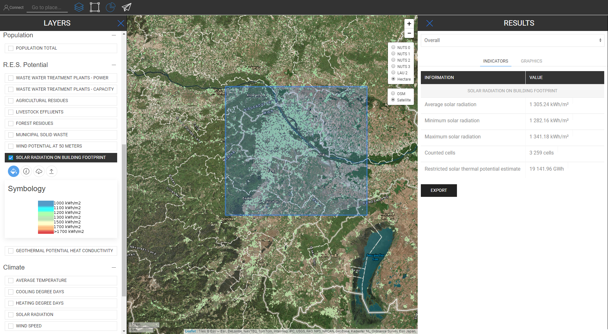
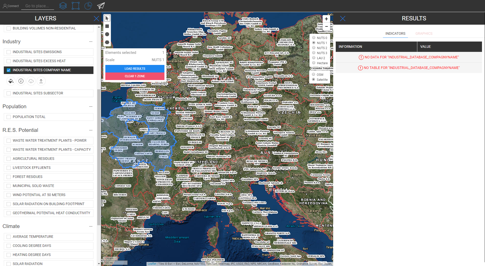
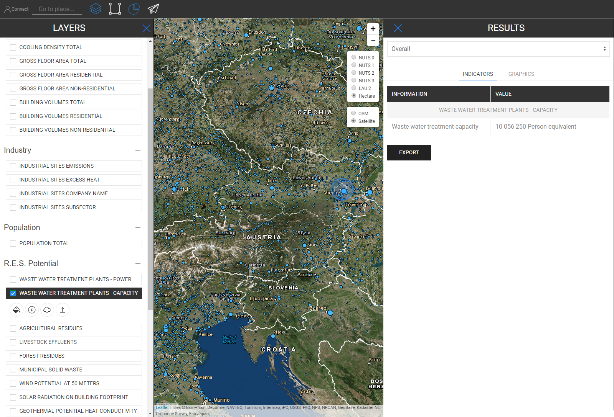
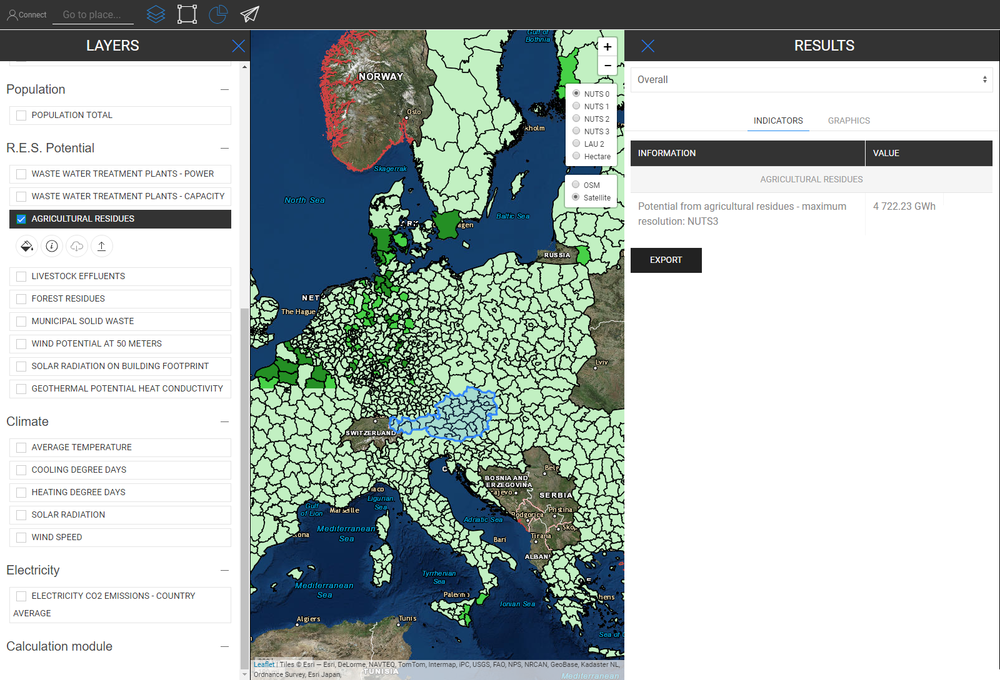

<h1><a class="anchor" id="retrieve-indicators-of-a-selected-area" href="#retrieve-indicators-of-a-selected-area"><i class="fa fa-link"></i></a>Извличане на индикатори за избрана област</h1><h2><a class="anchor" id="table-of-contents" href="#table-of-contents"><i class="fa fa-link"></i></a> Съдържание</h2><ul><li> <a href="#introduction">Въведение</a></li><li> <a href="#indicators-for-raster-layers">Индикатори за растерни слоеве</a><ul><li> <a href="#indicators-for-raster-layers_buildings">Сгради</a></li><li> <a href="#indicators-for-raster-layers_population">Население</a></li><li> <a href="#indicators-for-raster-layers_renewable-energy-source-potentials">Възобновяеми енергийни източници</a></li></ul></li><li> <a href="#indicators-for-vector-layers">Индикатори за векторни слоеве</a><ul><li> <a href="#indicators-for-vector-layers_industry">Промишленост</a></li><li> <a href="#indicators-for-vector-layers_renewable-energy-source-potentials">Възобновяеми енергийни източници</a></li><li> <a href="#indicators-for-vector-layers_electricity">Електричество</a></li></ul></li><li> <a href="#example">Пример</a></li><li> <a href="#how-to-cite">Как да цитирам</a></li><li> <a href="#authors-and-reviewers">Автори и рецензенти</a></li><li> <a href="#license">Разрешително</a></li><li> <a href="#acknowledgement">Признание</a></li></ul><h2><a class="anchor" id="introduction" href="#introduction"><i class="fa fa-link"></i></a> Въведение</h2>
 В зависимост от слоевете и региона, които сте избрали, индикаторите за вашата конфигурация се показват в странична лента вдясно на екрана

 <a href="#table-of-contents"><strong><code>To Top</code></strong></a>

 По-нататък разглеждаме показателите, които се показват за растерни и векторни слоеве.
<h2><a class="anchor" id="indicators-for-raster-layers" href="#indicators-for-raster-layers"><i class="fa fa-link"></i></a> Индикатори за растерни слоеве</h2>
 Индикаторите на растерните слоеве се различават от векторните слоеве. С различни имаме предвид по отношение на агрегиране и дезагрегиране. Това различно поведение идва от териториалните резолюции.

 Растерните слоеве обикновено имат много по-висока резолюция, докато векторните слоеве имат само атрибути в точки или полигони.

 Това означава, от една страна, например, че ако изберете векторен слой, който е дефиниран от полигони NUTS3 и искате например да изберете LAU регион, тогава стойността NUTS3 няма да бъде дезагрегирана до ниво LAU, вместо това, индикаторът NUTS3, където това Локализираният регион LAU ще бъде показан в страничната лента с резултати.

 От друга страна, растерните слоеве се агрегират и дезагрегират „произволно“ *

 * от съдържащите клетки в избрания от вас регион (естествено в рамките на самата растерна резолюция)

 <a href="#table-of-contents"><strong><code>To Top</code></strong></a>
<h3><a class="anchor" id="buildings" href="#buildings"><i class="fa fa-link"></i></a> Сгради</h3>
 <strong>Карта на плътността на топлината</strong>

 <strong>Допълнителна функция</strong>

 Когато едновременно изберете слоя на топлинната плътност и слоя население, се показва допълнителен индикатор (вижте снимката по-долу)

 <a href="#table-of-contents"><strong><code>To Top</code></strong></a>
<h3><a class="anchor" id="in-general-" href="#in-general-"><i class="fa fa-link"></i></a> Общо взето:</h3>
 Когато едновременно се избере един от слоевете на сградата и населения слой, ще се покаже допълнителен индикатор, както е описано по-горе

<ins> <code><strong><a href="#indicators-for-raster-layers">To Chapter</a></strong></code></ins>

 <strong>Карта на плътността на охлаждане</strong>

<ins> <code><strong><a href="#indicators-for-raster-layers">To Chapter</a></strong></code></ins>

 <strong>Изграждане на томове</strong>

<ins> <code><strong><a href="#indicators-for-raster-layers">To Chapter</a></strong></code></ins>

 <strong>Брутна подова площ</strong>

<ins> <code><strong><a href="#indicators-for-raster-layers">To Chapter</a></strong></code></ins> <a href="#table-of-contents"><strong><code>To Top</code></strong></a>
<h3><a class="anchor" id="population" href="#population"><i class="fa fa-link"></i></a> Население</h3>

<ins> <code><strong><a href="#indicators-for-raster-layers">To Chapter</a></strong></code></ins> <a href="#table-of-contents"><strong><code>To Top</code></strong></a>
<h3><a class="anchor" id="climate" href="#climate"><i class="fa fa-link"></i></a> Климат</h3>
 <strong>Температура</strong>

<ins> <code><strong><a href="#indicators-for-raster-layers">To Chapter</a></strong></code></ins>

 <strong>Дни на степента на охлаждане</strong>

<ins> <code><strong><a href="#indicators-for-raster-layers">To Chapter</a></strong></code></ins>

 <strong>Дни на степента на отопление</strong>

<ins> <code><strong><a href="#indicators-for-raster-layers">To Chapter</a></strong></code></ins>

 <strong>Слънчева радиация</strong>

<ins> <code><strong><a href="#indicators-for-raster-layers">To Chapter</a></strong></code></ins>

 <strong>Скоростта на вятъра</strong>

<ins> <code><strong><a href="#indicators-for-raster-layers">To Chapter</a></strong></code></ins> <a href="#table-of-contents"><strong><code>To Top</code></strong></a>
<h3><a class="anchor" id="renewable-energy-source-potentials" href="#renewable-energy-source-potentials"><i class="fa fa-link"></i></a> Възобновяеми енергийни източници</h3>
 <strong>Слънчева радиация върху строителния отпечатък</strong>

<ins> <code><strong><a href="#indicators-for-raster-layers">To Chapter</a></strong></code></ins>

 <strong>Потенциал на вятъра на 50м</strong>

<ins> <code><strong><a href="#indicators-for-raster-layers">To Chapter</a></strong></code></ins>

 <strong>Горски остатъци</strong>

<ins> <code><strong><a href="#indicators-for-raster-layers">To Chapter</a></strong></code></ins> <a href="#table-of-contents"><strong><code>To Top</code></strong></a>
<h2><a class="anchor" id="indicators-for-vector-layers" href="#indicators-for-vector-layers"><i class="fa fa-link"></i></a> Индикатори за векторни слоеве</h2><h3><a class="anchor" id="industry" href="#industry"><i class="fa fa-link"></i></a> Промишленост</h3>
 <strong>Емисии от промишлени обекти</strong>

<ins> <code><strong><a href="#indicators-for-vector-layers">To Chapter</a></strong></code></ins>

 <strong>Индустриална излишна топлина</strong>

<ins> <code><strong><a href="#indicators-for-vector-layers">To Chapter</a></strong></code></ins>

 <strong>Име на компанията в индустриалния обект</strong>

<ins> <code><strong><a href="#indicators-for-vector-layers">To Chapter</a></strong></code></ins>

 <strong>Подсектор на индустриален обект</strong>

<ins> <code><strong><a href="#indicators-for-vector-layers">To Chapter</a></strong></code></ins> <a href="#table-of-contents"><strong><code>To Top</code></strong></a>
<h3><a class="anchor" id="renewable-energy-source-potentials" href="#renewable-energy-source-potentials"><i class="fa fa-link"></i></a> Възобновяеми енергийни източници</h3>
 <strong>Пречиствателни станции за отпадъчни води Мощност</strong>

<ins> <code><strong><a href="#indicators-for-vector-layers">To Chapter</a></strong></code></ins>

 <strong>Капацитет на пречиствателните станции за отпадъчни води</strong>

<ins> <code><strong><a href="#indicators-for-vector-layers">To Chapter</a></strong></code></ins>

 <strong>Селскостопански остатъци</strong>

<ins> <code><strong><a href="#indicators-for-vector-layers">To Chapter</a></strong></code></ins>

 <strong>Отпадъчни води от добитъка</strong>

<ins> <code><strong><a href="#indicators-for-vector-layers">To Chapter</a></strong></code></ins>

 <strong>Общински твърди отпадъци</strong>

<ins> <code><strong><a href="#indicators-for-vector-layers">To Chapter</a></strong></code></ins>

 <strong>Геотермална потенциална топлопроводимост</strong>

<ins> <code><strong><a href="#indicators-for-vector-layers">To Chapter</a></strong></code></ins> <a href="#table-of-contents"><strong><code>To Top</code></strong></a>
<h3><a class="anchor" id="electricity" href="#electricity"><i class="fa fa-link"></i></a> Електричество</h3>
 <strong>Електричество C02 Емисии</strong>

<ins> <code><strong><a href="#indicators-for-vector-layers">To Chapter</a></strong></code></ins> <a href="#table-of-contents"><strong><code>To Top</code></strong></a>
<h2><a class="anchor" id="example" href="#example"><i class="fa fa-link"></i></a> Пример</h2>
 На снимката по-долу можете да видите как изглежда, когато се визуализират всички слоеве (тук е избрана Австрия като NUTS0)

 Въпреки че на пръв поглед тази карта може да изглежда малко объркваща, показателите й са илюстрирани направо напред. Вижте по-долу всички показатели, които са описани в страничната лента с резултатите, когато изберете всички слоеве за Австрия (NUTS0)

 <a href="#table-of-contents"><strong><code>To Top</code></strong></a>
<h2><a class="anchor" id="how-to-cite" href="#how-to-cite"><i class="fa fa-link"></i></a> Как да цитирам</h2>
 Джетон Хасани, в Hotmaps-Wiki, Извличане на индикатори на избрана зона (април 2019 г.)

 <a href="#table-of-contents"><strong><code>To Top</code></strong></a>
<h2><a class="anchor" id="authors-and-reviewers" href="#authors-and-reviewers"><i class="fa fa-link"></i></a> Автори и рецензенти</h2>
 Тази страница е написана от Jeton Hasani <strong><a href="https://eeg.tuwien.ac.at/">EEG - TU Wien</a></strong> .

 ☑ Тази страница е прегледана от Мостафа Фалахнежад <strong><a href="https://eeg.tuwien.ac.at/">ЕЕГ - TU Wien</a></strong> .

 <a href="#table-of-contents"><strong><code>To Top</code></strong></a>
<h2><a class="anchor" id="license" href="#license"><i class="fa fa-link"></i></a> Разрешително</h2>
 Copyright © 2016-2020: Jeton Hasani

 Creative Commons Attribution 4.0 International License

 Това произведение е лицензирано под Creative Commons CC BY 4.0 International License.

 Идентификатор на SPDX-лиценз: CC-BY-4.0

 Лиценз-текст: https://spdx.org/licenses/CC-BY-4.0.html

 <a href="#table-of-contents"><strong><code>To Top</code></strong></a>
<h2><a class="anchor" id="acknowledgement" href="#acknowledgement"><i class="fa fa-link"></i></a> Признание</h2>
 Бихме искали да <a href="https://www.hotmaps-project.eu">изразим</a> най-дълбоката си благодарност към проекта „Хоризонти 2020“ на „Хоризонт 2020 <a href="https://www.hotmaps-project.eu">“</a> (Споразумение за безвъзмездна помощ № 723677), който осигури финансирането за извършване на настоящото разследване.

 <a href="#table-of-contents"><strong><code>To Top</code></strong></a> <code><a href="Indicator-Section/_edit">Review this page</a></code>

<!--- THIS IS A SUPER UNIQUE IDENTIFIER -->

This page was automatically translated. View in another language:

[English](../en/Retrieve-indicators-of-a-selected-area) (original)  [Czech](../cs/Retrieve-indicators-of-a-selected-area)\* [Danish](../da/Retrieve-indicators-of-a-selected-area)\* [German](../de/Retrieve-indicators-of-a-selected-area)\* [Greek](../el/Retrieve-indicators-of-a-selected-area)\* [Spanish](../es/Retrieve-indicators-of-a-selected-area)\* [Estonian](../et/Retrieve-indicators-of-a-selected-area)\* [Finnish](../fi/Retrieve-indicators-of-a-selected-area)\* [French](../fr/Retrieve-indicators-of-a-selected-area)\* [Irish](../ga/Retrieve-indicators-of-a-selected-area)\* [Croatian](../hr/Retrieve-indicators-of-a-selected-area)\* [Hungarian](../hu/Retrieve-indicators-of-a-selected-area)\* [Italian](../it/Retrieve-indicators-of-a-selected-area)\* [Lithuanian](../lt/Retrieve-indicators-of-a-selected-area)\* [Latvian](../lv/Retrieve-indicators-of-a-selected-area)\* [Maltese](../mt/Retrieve-indicators-of-a-selected-area)\* [Dutch](../nl/Retrieve-indicators-of-a-selected-area)\* [Polish](../pl/Retrieve-indicators-of-a-selected-area)\* [Portuguese (Portugal, Brazil)](../pt/Retrieve-indicators-of-a-selected-area)\* [Romanian](../ro/Retrieve-indicators-of-a-selected-area)\* [Slovak](../sk/Retrieve-indicators-of-a-selected-area)\* [Slovenian](../sl/Retrieve-indicators-of-a-selected-area)\* [Swedish](../sv/Retrieve-indicators-of-a-selected-area)\* 

\* machine translated
