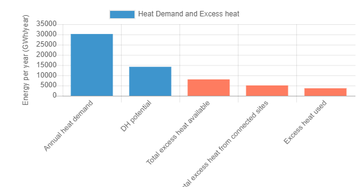
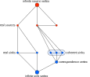

<h1><a class="anchor" id="cm-excess-heat-transport-potential" href="#cm-excess-heat-transport-potential"><i class="fa fa-link"></i></a>CM Nadměrný potenciál přenosu tepla</h1><h2><a class="anchor" id="table-of-contents" href="#table-of-contents"><i class="fa fa-link"></i></a> Obsah</h2><ul><li> <a href="#in-a-glance">Na první pohled</a></li><li> <a href="#introduction">Úvod</a></li><li> <a href="#inputs-and-outputs">Vstupy a výstupy</a><ul><li> <a href="#inputs-and-outputs_input-layers-and-parameters">Vstupní vrstvy a parametry</a></li><li> <a href="#inputs-and-outputs_output">Výstup</a></li></ul></li><li> <a href="#method">Metoda</a><ul><li> <a href="#method_overview">Přehled</a></li><li> <a href="#method_details">Detaily</a></li><li> <a href="#method_implementation">Implementace</a></li></ul></li><li> <a href="#github-repository-of-this-calculation-module">Úložiště GitHub tohoto výpočetního modulu</a></li><li> <a href="#quick-start">Rychlý start</a></li><li> <a href="#troubleshooting">Odstraňování problémů</a></li><li> <a href="#sample-run">Ukázkový běh</a></li><li> <a href="#how-to-cite">Jak citovat</a></li><li> <a href="#authors-and-reviewers">Autoři a recenzenti</a></li><li> <a href="#license">Licence</a></li><li> <a href="#acknowledgement">Potvrzení</a></li></ul><h2><a class="anchor" id="in-a-glance" href="#in-a-glance"><i class="fa fa-link"></i></a> Na první pohled</h2>
 Tento modul počítá tok a náklady na přenos tepla z potenciálních přebytečných zdrojů tepla umístěných mimo potenciální oblasti dálkového vytápění do oblasti dálkového vytápění. Vstupy jsou hodinové zátěžové profily toku přebytečného tepla a potřeby dálkového vytápění, umístění zdroje přebytečného tepla a potenciálního systému dálkového vytápění, investiční náklady do tepelných výměníků a přenosových vedení a prahové hodnoty pro vzdálenost a náklady na přenos.

 <a href="#table-of-contents"><strong><code>To Top</code></strong></a>
<h2><a class="anchor" id="introduction" href="#introduction"><i class="fa fa-link"></i></a> Úvod</h2>
 Výpočtový modul „Potenciál přenosu přebytečného tepla“ pomůže uživateli identifikovat integrační potenciály přebytečného tepla v sítích dálkového vytápění. Potenciály jsou založeny na potenciálu <a href="https://wiki.hotmaps.hevs.ch/en/CM-District-heating-potential-areas-user-defined-thresholds">CM - dálkového vytápění</a> . Tento CM identifikuje oblasti s příznivými podmínkami pro sítě dálkového vytápění a ukazuje, kolik tepla by mohlo být potenciálně pokryto průmyslovým přebytečným teplem v těchto oblastech. To však neznamená, že v tomto regionu již existuje síť dálkového vytápění.

 Následující data a metody jsou kombinovány pro předchozí úkol.

 Data:
<ul><li>
 Požadavky na vytápění pro blízké oblasti s příznivými podmínkami pro sítě dálkového vytápění, které jsou každou hodinu rozpuštěny (z <a href="https://wiki.hotmaps.hevs.ch/en/CM-District-heating-potential-areas-user-defined-thresholds">CM - Potenciál</a> dálkového vytápění).
</li><li>
 Údaje o množství přebytečného tepla průmyslových podniků v oblasti, které jsou také řešeny každou hodinu (z průmyslové databáze datových souborů).
</li><li>
 Předpoklady o nákladech na tepelné výměníky, čerpadla a potrubí a tepelné ztráty pro potrubí dálkového vytápění.
</li></ul>
 Metoda (zjednodušená):
<ul><li> Návrh potrubí na základě rozvinuté heuristiky, která představuje problém návrhu jako problém toku sítě.</li></ul>
 Cílem metody je představit největší možný přebytek tepelného toku s ne příliš velkým a tedy příliš dlouhým potrubím pro možné uživatele dálkového vytápění generováním sítí s maximálními průtoky. Obzvláště neefektivní dopravní linky (s nízkými tepelnými toky a tedy vysokými specifickými náklady na dopravu tepla) však nejsou v konečné síti zohledněny. Prah pro ekonomickou efektivnost jednotlivých dopravních linek může určit uživatel (viz prahová hodnota pro přenosové vedení).

 Základní pozadí přístupu je následující: pokud existuje pouze několik zdrojů přebytečného tepla, lze vždy vzít v úvahu jeden plynovod na zdroj pro přepravu tepla do blízké oblasti s příznivými podmínkami pro dálkové vytápění. Pokud však do stejné oblasti má proudit několik přebytečných zdrojů tepla, mělo by smysl teplo shromažďovat a přepravovat do oblasti větším společným potrubím. Přístup s jedním kanálem na zdroj má tendenci nadhodnocovat úsilí o potrubí.

 Aby se vyrovnalo výše uvedené, problém plánování potrubí byl aproximován předpokládáním problému toku sítě. K vyřešení problému se používá heuristická metoda, při které lze přebytečné teplo svazovat a přepravovat možným uživatelům. Konkrétní metodický návrh řešení s přístupem stromu minimálního rozpětí je popsán v odpovídající metodické části. Návrh potrubí stanovený v předchozím kontextu proto nepředstavuje podrobné plánování ani skutečné vedení trasy, ale slouží pouze k aproximaci nákladů na distribuci přebytečného množství tepla v blízkých oblastech s příznivými podmínkami pro sítě dálkového vytápění. (viz <a href="https://wiki.hotmaps.hevs.ch/en/CM-District-heating-potential-areas-user-defined-thresholds">CM - Potenciál dálkového vytápění</a> , koherentní oblasti klíčových slov). Tato aproximace nákladů se tedy vztahuje na celou síť.

 Výsledky by pak měly být nejprve interpretovány následovně: pokud by se zaznamenané přebytečné množství tepla mělo přepravovat společně do označených blízkých oblastí, pak by náklady na distribuci tepla mohly být v řádu, jak ukazuje nástroj (srov. Vyrovnané náklady dodávky tepla). Hodnoty pro celou síť jsou zpravidla také dobrým výchozím indikátorem pro jednotlivé kanály. Účelem výsledků je proto poskytnout vývojáři nebo plánovači projektu řádově možné distribuční náklady.

 <a href="#table-of-contents"><strong><code>To Top</code></strong></a>
<h2><a class="anchor" id="inputs-and-outputs" href="#inputs-and-outputs"><i class="fa fa-link"></i></a> Vstupy a výstupy</h2><h3><a class="anchor" id="input-layers-and-parameters" href="#input-layers-and-parameters"><i class="fa fa-link"></i></a> Vstupní vrstvy a parametry</h3><h4><a class="anchor" id="provided-by-toolbox" href="#provided-by-toolbox"><i class="fa fa-link"></i></a> Poskytuje Toolbox</h4><ul><li>
 Oblasti dálkového vytápění (nyní přímo zajišťované potenciálem dálkového vytápění CM)
</li><li>
 Průmyslová databáze (ve výchozím nastavení poskytuje sada nástrojů)
</li><li>
 Profily zatížení pro průmysl
</li><li>
 Profily zatížení pro vytápění obytných budov a teplou užitkovou vodu
</li></ul><h4><a class="anchor" id="provided-by-the-user" href="#provided-by-the-user"><i class="fa fa-link"></i></a> Poskytnuto uživatelem</h4><ul><li>
 Min. potřeba tepla na hektar

 Viz <a href="https://wiki.hotmaps.hevs.ch/en/CM-District-heating-potential-areas-user-defined-thresholds">CM - Potenciál dálkového vytápění</a> .
</li><li>
 Min. potřeba tepla v oblasti CZT

 Viz <a href="https://wiki.hotmaps.hevs.ch/en/CM-District-heating-potential-areas-user-defined-thresholds">CM - Potenciál dálkového vytápění</a> .
</li><li>
 Životnost zařízení v letech

 Srovnané náklady na teplo se vztahují k tomuto časovému období.
</li><li>
 Diskontní sazba v%

 Úroková sazba pro úvěr potřebný k vybudování sítě.
</li><li>
 Faktor nákladů

 Faktor pro přizpůsobení síťových nákladů v případě, že výchozí hodnoty přesně nepředstavují náklady. Tímto faktorem se znásobí investice potřebné pro síť. Výchozí náklady najdete v části <a href="en-CM-Excess-heat-transport-potential#computation-of-costs">Výpočet nákladů</a> .
</li><li>
 Provozní náklady v%

 Provozní náklady na síť za rok. V procentech investic nezbytných pro síť.
</li><li>
 Prahová hodnota pro přenosová vedení v ct / kWh

 Maximální vyrovnané náklady na teplo každé jednotlivé přenosové linky. Tento parametr lze použít k řízení vyrovnaných nákladů na teplo pro celou síť. Nižší hodnota se rovná nižším vyrovnaným nákladům na teplo, ale také snížení použitého přebytečného tepla a naopak.
</li></ul><h4><a class="anchor" id="performance-parameters" href="#performance-parameters"><i class="fa fa-link"></i></a> Parametry výkonu</h4><ul><li>
 Časové rozlišení

 Nastavuje interval mezi výpočty toku sítě po celý rok. Může být jedna z těchto hodnot: (hodina, den, týden, měsíc, rok)
</li></ul>
 <a href="#table-of-contents"><strong><code>To Top</code></strong></a>
<h3><a class="anchor" id="output" href="#output"><i class="fa fa-link"></i></a> Výstup</h3><h4><a class="anchor" id="layers" href="#layers"><i class="fa fa-link"></i></a> Vrstvy</h4><ul><li>
 Přenosová vedení

 Tvarový soubor zobrazující navrhovaná přenosová vedení s jejich teplotou, ročním tepelným tokem a náklady. Podrobnosti najdete zde.
</li></ul><h4><a class="anchor" id="indicators" href="#indicators"><i class="fa fa-link"></i></a> Indikátory</h4><ul><li>
 Celkové přebytečné teplo ve vybrané oblasti v GWh

 Celkové dostupné přebytečné teplo průmyslových zařízení ve vybrané oblasti a blízkosti.
</li><li>
 Přebytečné teplo připojené v GWh

 Celkové dostupné přebytečné teplo průmyslových zařízení připojených k síti.
</li><li>
 Přebytečné teplo použité v GWh

 Skutečné přebytečné teplo použité pro DH.
</li><li>
 Investice nutné pro síť v €

 Investice potřebné k vybudování sítě.
</li><li>
 Roční náklady na síť v EUR / rok

 Náklady způsobené anuitou a provozními náklady sítě ročně.
</li><li>
 Vyrovnané náklady na dodávku tepla v ct / kWh

 vyrovnané náklady na teplo celé sítě.
</li></ul><h4><a class="anchor" id="graphics" href="#graphics"><i class="fa fa-link"></i></a> Grafika</h4><ul><li>
 Potenciál DH a přebytečné teplo

 Grafika zobrazující potenciál DH, celkové přebytečné teplo, připojené přebytečné teplo a použité přebytečné teplo. Podrobnosti najdete <a href="en-CM-Excess-heat-transport-potential#dh-potential-and-excess-heat">zde</a> .
</li><li>
 Využito přebytečné teplo a investice nutná

 Graficky znázorňující roční dodané přebytečné teplo na investice nezbytné pro síť. Podrobnosti najdete <a href="en-CM-Excess-heat-transport-potential#excess-heat-used-and-investment-necessary">zde</a> .
</li><li>
 Zatěžovací křivky

 Graf ukazuje měsíční potřebu tepla a přebytek. Podrobnosti najdete <a href="en-CM-Excess-heat-transport-potential#load-curves">zde</a> .
</li><li>
 Zatěžovací křivky

 Graficky znázorňující průměrnou denní potřebu tepla a přebytek. Podrobnosti najdete <a href="en-CM-Excess-heat-transport-potential#load-curves">zde</a> .
</li></ul><h4><a class="anchor" id="examples-of-layer" href="#examples-of-layer"><i class="fa fa-link"></i></a> Příklady vrstvy</h4><h5><a class="anchor" id="transmission-lines" href="#transmission-lines"><i class="fa fa-link"></i></a> Přenosová vedení</h5><figcaption> <i> Příklad přenosové linky zobrazené na panelu nástrojů</i></figcaption>
 Kliknutím na přenosovou linku se zobrazí další informace.
<h4><a class="anchor" id="examples-of-graphics" href="#examples-of-graphics"><i class="fa fa-link"></i></a> Příklady grafiky</h4><h5><a class="anchor" id="dh-potential-and-excess-heat" href="#dh-potential-and-excess-heat"><i class="fa fa-link"></i></a> Potenciál DH a přebytečné teplo</h5>
 <em>Tato grafika porovnává potenciál DH, celkové přebytečné teplo, připojené přebytečné teplo a použité přebytečné teplo.</em>

 Více informací o roční potřebě tepla a potenciálu CZT najdete <a href="CM-District-heating-potential-areas-user-defined-thresholds">zde</a> . Přebytečné teplo spojené s přebytečným teplem a použité přebytečné teplo jsou stejné jako jejich rovnoměrně pojmenované indikátory v části <a href="en-CM-Excess-heat-transport-potential#inputs-and-outputs_input-layers-and-parameters">Vstup a výstup</a> .
<h5><a class="anchor" id="load-curves" href="#load-curves"><i class="fa fa-link"></i></a> Zatěžovací křivky</h5><figure><figcaption><i> </i>
 <i>Tato grafika ukazuje celkový tok sítí po celý rok. Dolní grafika představuje průměrný den.</i>
</figcaption></figure>
 Osa x představuje čas a sílu osy y. Modré křivky představují potřebu tepla v oblastech DH a červené dostupné přebytečné teplo. Průsečík obou křivek představuje skutečný celkový tok tepla. Horní grafika ukazuje tok za rok a spodní tok průměrného dne. Všimněte si, že <a href="en-CM-Excess-heat-transport-potential#performance-parameters">časové rozlišení</a> je třeba nastavit alespoň na „měsíc“ pro horní a „hodinu“ pro dolní grafiku, aby byla reprezentativní.

 <a href="#table-of-contents"><strong><code>To Top</code></strong></a>
<h2><a class="anchor" id="method" href="#method"><i class="fa fa-link"></i></a> Metoda</h2><h3><a class="anchor" id="overview" href="#overview"><i class="fa fa-link"></i></a> Přehled</h3>
 Klíčovým prvkem modulu přebytečného tepla je použitý model zdroj-dřez. Vytváří přenosovou síť o minimální délce a vypočítává průtok pro každou hodinu roku na základě profilů vytápění obytných budov s rozlišením NUTS 2 a profilů zatížení průmyslu s rozlišením NUTS 0. Na základě průměrných špičkových toků po celý rok lze vypočítat náklady na každé přenosové vedení a výměník tepla na straně zdroje a jímky.

 <a href="#table-of-contents"><strong><code>To Top</code></strong></a>
<h3><a class="anchor" id="details" href="#details"><i class="fa fa-link"></i></a> Detaily</h3><h4><a class="anchor" id="modeling-of-sources" href="#modeling-of-sources"><i class="fa fa-link"></i></a> Modelování zdrojů</h4>
 Na základě ID NUTS 0 a průmyslového sektoru je každému zdroji přiřazen celoroční hodinový profil zatížení.
<h4><a class="anchor" id="modeling-of-sinks" href="#modeling-of-sinks"><i class="fa fa-link"></i></a> Modelování dřezů</h4>
 Na základě modulu pro výpočet potenciálu dálkového vytápění jsou v koherentních oblastech vytvořeny stejně vzdálené vstupní body. V závislosti na ID NUTS 2 vstupních bodů je přiřazen profil zatížení.
<h4><a class="anchor" id="fixed-radius-search" href="#fixed-radius-search"><i class="fa fa-link"></i></a> Vyhledávání s pevným poloměrem</h4>
 V rámci přednastaveného poloměru se kontroluje, které zdroje jsou v vzájemném dosahu, které výlevky jsou v vzájemném dosahu a které výlevky jsou v dosahu zdrojů. To může být reprezentováno grafem se zdroji a propady tvořícími vrcholy a vrcholy v rozsahu spojenými hranou.
<h4><a class="anchor" id="reduction-to-minimum-length-network" href="#reduction-to-minimum-length-network"><i class="fa fa-link"></i></a> Redukce na minimální délku sítě</h4>
 Minimální kostra se vypočítá se vzdáleností okrajů jako váhy. To má za následek, že si graf zachová svoji konektivitu a zároveň bude mít minimální celkovou délku hran. Všimněte si, že vstupní body koherentních oblastí jsou interně propojeny zdarma, protože tvoří vlastní distribuční síť.
<h4><a class="anchor" id="flow-computation" href="#flow-computation"><i class="fa fa-link"></i></a> Výpočet průtoku</h4>
 Maximální průtok ze zdrojů do jímek se počítá pro každou hodinu roku.
<h4><a class="anchor" id="cost-determination" href="#cost-determination"><i class="fa fa-link"></i></a> Stanovení nákladů</h4>
 Špičkový roční průtok v průměru za 3 hodiny určuje požadovanou kapacitu pro přenosová vedení a výměníky tepla. Náklady na přenosová vedení závisí na délce a kapacitě, zatímco náklady na tepelné výměníky jsou ovlivněny pouze kapacitou. Na straně zdroje se předpokládá výměník tepla vzduch-kapalina s integrovaným čerpadlem pro přenosové vedení a na straně dřezu výměník tepla kapalina-kapalina.
<h4><a class="anchor" id="variation-of-network" href="#variation-of-network"><i class="fa fa-link"></i></a> Variace sítě</h4>
 Jelikož jsou známy náklady a tok každého přenosového vedení, mohou být vedení s nejvyšším poměrem nákladů k toku odstraněna a tok přepočítán, dokud není dosaženo požadované ceny za tok.

 <a href="#table-of-contents"><strong><code>To Top</code></strong></a>
<h3><a class="anchor" id="implementation" href="#implementation"><i class="fa fa-link"></i></a> Implementace</h3><h4><a class="anchor" id="fixed-radius-search" href="#fixed-radius-search"><i class="fa fa-link"></i></a> Vyhledávání s pevným poloměrem</h4>
 Pro výpočet vzdálenosti mezi dvěma body se používá malá úhlová aproximace délky loxodromu. I když existuje také přesná implementace vzdálenosti ortodromu, zvýšená přesnost nemá žádný skutečný přínos kvůli malým vzdálenostem většinou menším než 20 km a nejistotě skutečné délky přenosové linky kvůli mnoha faktorům, jako je topologie. Pokud jsou dva body v rozsahu poloměru, uloží se do seznamu sousedů. Vytváření takových seznamů sousedství se provádí mezi zdroji a zdroji, výlevkami a výlevkami a zdroji a výlevkami. Důvod oddělení spočívá ve flexibilitě přidat určité požadavky na teplotu pro zdroje nebo propady.
<figure><figcaption> <i> Příklad hledání s pevným poloměrem. Červené vrcholy představují zdroje a modré klesají. Čísla představují vzdálenost mezi body. Kresba není v měřítku.</i></figcaption></figure><h4><a class="anchor" id="networkgraph-class" href="#networkgraph-class"><i class="fa fa-link"></i></a> Třída NetworkGraph</h4>
 Na základě knihovny igraph je implementována třída NetworkGraph se všemi funkcemi potřebnými pro výpočetní modul. I když je igraph špatně zdokumentován, nabízí mnohem lepší výkon než čisté pythonové moduly, jako je NetworkX a podpora širší platformy než Linux, na rozdíl od grafického nástroje. Třída NetworkGraph popisuje pouze jednu síť na povrchu, ale obsahuje 3 různé grafy. Za prvé, graf popisující síť, jak je definována třemi seznamy sousedství. Zadruhé, korespondenční graf interně spojující výlevky stejné koherentní oblasti a poslední graf maximálního průtoku použitý pro výpočet maximálního průtoku.
<h5><a class="anchor" id="graph" href="#graph"><i class="fa fa-link"></i></a> Graf</h5>
 Obsahuje pouze skutečné zdroje a propady jako vrcholy.
<figure><figcaption> <i> Příklad grafu. Červené vrcholy představují zdroje a modré klesají.</i></figcaption></figure><h5><a class="anchor" id="correspondence-graph" href="#correspondence-graph"><i class="fa fa-link"></i></a> Korespondenční graf</h5>
 Každý dřez potřebuje identifikační číslo, které označuje, zda je interně propojeno již existující sítí, jako v koherentních oblastech. Dřezy se stejným identifikačním číslem jsou spojeny s novým vrcholem s hranami s nulovou hmotností. To je zásadní pro výpočet minimálního kostry a důvodu, proč se pro ni používá korespondenční graf. Tato funkce je také implementována pro zdroje, ale nepoužívá se.
<figure><figcaption><i> </i>
 <i>Příklad korespondenčního grafu. Červené vrcholy představují zdroje a modré klesají. Tři umyvadla vpravo jsou souvisle propojena dalším větším vrcholem</i>
</figcaption></figure><h5><a class="anchor" id="maximum-flow-graph" href="#maximum-flow-graph"><i class="fa fa-link"></i></a> Graf maximálního průtoku</h5>
 Vzhledem k tomu, že igraph nepodporuje více zdrojů a klesá ve své funkci maximálního toku, je nutný pomocný graf. Zavádí nekonečný zdroj a vrchol jímky. Každý skutečný zdroj je spojen s nekonečným zdrojem a každý skutečný dřez je spojen s nekonečným dřezem hranou. Všimněte si, že pokud je jímka spojena s vrcholem korespondence, bude tento vrchol připojen spíše než samotný jímka.
<figure><figcaption><i> </i>
 <i>Příklad grafu maximálního toku.</i>
</figcaption></figure><h5><a class="anchor" id="minimum-spanning-tree-computation" href="#minimum-spanning-tree-computation"><i class="fa fa-link"></i></a> Minimální výpočet překlenovacího stromu</h5>
 Na základě korespondenčního grafu je vypočítán minimální kostra. Okraje spojující koherentní výlevky mají vždy váhu 0, takže vždy zůstanou součástí minimálního rozpětí stromu.
<figure><figcaption><i> </i>
 <i>Příklad korespondenčního grafu s váhami každé hrany a jejím minimálním kostrou.</i>
</figcaption></figure><h5><a class="anchor" id="maximum-flow-computation" href="#maximum-flow-computation"><i class="fa fa-link"></i></a> Výpočet maximálního průtoku</h5>
 Tok přes okraje spojující skutečné zdroje nebo jímky s nekonečným zdrojem nebo jímkou je omezen na skutečnou kapacitu každého zdroje nebo jímky. Z numerických důvodů jsou kapacity normalizovány tak, že největší kapacita je 1. Průtok podmnožinou hran obsažených v korespondenčním grafu je omezen na 1 000, což by mělo pro všechny intenzivní a účely nabízet neomezený tok. Poté se vypočítá maximální tok z nekonečného zdroje do nekonečného umyvadla a tok se změní na původní velikost. Protože koherentní výlevky nejsou přímo spojeny s vrcholem nekonečného výlevky, ale vrcholem korespondence, tok skrz ni je omezen na součet všech soudržných výlevek.
<figure><figcaption><i> </i>
 <i>Příklad grafu maximálního průtoku a kapacit každého zdroje a jímky. Pravý graf ukazuje maximální povolený průtok každou hranou po normalizaci. Všimněte si, že maximální průtok povolený hranami se symbolem nekonečna je ve skutečnosti v implementaci omezen na 1000.</i>
</figcaption></figure>
 Implementace funkce maximálního toku igrafu využívá algoritmus Push-relabel. Tento typ algoritmu není nákladově citlivý a nemusí vždy najít nejkratší způsob směrování toku. Algoritmus citlivý na náklady není v igrafu k dispozici a výkon by pravděpodobně klesl, aby bylo možné vyřešit hodinový tok po celý rok. Ale z důvodu předchozí redukce na minimální kostru jsou případy, kdy je zvoleno neideální řešení, velmi omezené a nepravděpodobné. Algoritmus Push-relabel má také tendenci směrovat tok přes nejmenší množství hran. Implementace igrafu se zdá být deterministická v pořadí alokace toku, pokud jsou grafy přinejmenším automorfismy, což je důležité pro hodinový výpočet toku, protože jakákoli uměle zavedená oscilace toku mezi hranami je nežádoucí.
<figure><figcaption> <i> Tok vypočítaný algoritmem maximálního toku a změnou velikosti na původní velikost.</i></figcaption></figure><h4><a class="anchor" id="heat-sources" href="#heat-sources"><i class="fa fa-link"></i></a> Zdroje tepla</h4>
 Zdroje tepla jsou převzaty z <strong><a href="https://gitlab.com/hotmaps/industrial_sites/industrial_sites_Industrial_Database">průmyslové databáze.</a></strong> Na základě jejich přebytečného tepla, Nuts0 ID a průmyslového sektoru je pro každý závod vytvořen zátěžový profil pokrývající každou hodinu roku. Je plánováno vlastní přidání webů.
<h4><a class="anchor" id="heat-sinks" href="#heat-sinks"><i class="fa fa-link"></i></a> Chladiče</h4>
 Chladiče jsou založeny na souvislých oblastech se známou potřebou tepla. Soudržné oblasti tvoří masku pro mřížku, na které jsou jako vstupní body umístěny ekvidistantní body. V závislosti na vybraném ID NUTS 2 je k dřezům přiřazen profil vytápění. Je plánováno vlastní přidání vstupních bodů a umyvadel.
<figure><figcaption> <i> Příklad koherentní oblasti a jejích vygenerovaných vstupních bodů.</i></figcaption></figure><h4><a class="anchor" id="load-profiles" href="#load-profiles"><i class="fa fa-link"></i></a> Načíst profily</h4>
 Uvedené profily zatížení se skládají z 8760 bodů, které představují zatížení za každou hodinu 365 dnů. Další informace o <strong><a href="https://gitlab.com/hotmaps/load_profile">profilech zatížení naleznete zde.</a></strong>
<h4><a class="anchor" id="computation-of-costs" href="#computation-of-costs"><i class="fa fa-link"></i></a> Výpočet nákladů</h4>
 Vzhledem k tomu, že systémy dálkového vytápění mají velkou tepelnou kapacitu, špička v průtoku neznamená, že přenosová vedení musí okamžitě dodat tento krátký hrot tepla. Proto jsou požadované kapacity přenosových vedení a výměníků tepla určovány zprůměrovaným špičkovým zatížením. Konkrétně se funkce numpy konvoluce používá k průměrování průtoku za poslední tři hodiny konvolucí s konstantní funkcí. V závislosti na této hodnotě je vybráno přenosové vedení z následující tabulky.

 <em>Specifické náklady na použité přenosové linky</em>

 | Výkon v MW | Náklady v EUR / mil Teplota ve ° C | | ------------- |: -------------: | -----: | | 0,2 | 195 | &lt;150 | | 0,3 | 206 | &lt;150 | | 0,6 | 220 | &lt;150 | | 1.2 | 240 | &lt;150 | | 1.9 | 261 | &lt;150 | | 3.6 | 288 | &lt;150 | | 6.1 | 323 | &lt;150 | | 9,8 | 357 | &lt;150 | | 20 | 426 | &lt;150 | | 45 | 564 | &lt;150 | | 75 | 701 | &lt;150 | | 125 | 839 | &lt;150 | | 190 | 976 | &lt;150 | | &gt; 190 | 976 | &lt;150 |

 Počítají se náklady na výměník tepla na straně zdroje, který se předpokládá jako vzduch ke kapalině

 C HSource (en-P) = P peak * 15 000 € / MW.

 Náklady na výměník tepla kapalina-kapalina na straně dřezu jsou určeny pomocí

 C HSink (en-P) = P peak * 265 000 € / MW, pokud P peak &lt;1MW nebo

 C HSink (en-P) = P peak * 100 000 € / MW jinak.
<h4><a class="anchor" id="removal-of-transmission-lines" href="#removal-of-transmission-lines"><i class="fa fa-link"></i></a> Odstranění přenosových vedení</h4>
 S prahovou hodnotou nákladů na tok pro přenosová vedení je lze odstranit, pokud ji překročíte, aby se zlepšil poměr toku k nákladům. Po odstranění okrajů musí být tok přepočítán, protože kontinuita toku v grafu již není zaručena. Poměr nákladů k toku se nyní může také zvýšit u dalších hran, takže se tento proces opakuje, dokud se součet všech toků již nezmění.
<h4><a class="anchor" id="description-of-the-complete-routine" href="#description-of-the-complete-routine"><i class="fa fa-link"></i></a> Popis celé rutiny</h4>
 Nejprve se načtou tepelné zdroje a jímky jejich zátěžovými profily. Poté se provede vyhledávání s pevným poloměrem a inicializuje se síť. Poté se síť sníží na svůj minimální kostru a maximální tok se vypočítá pro každou hodinu roku. Na základě průtoku se vypočítají náklady na každý výměník tepla, čerpadlo a přenosové vedení. Pokud je definován prahový poměr cena / tok, provede se odstranění procedury přenosového vedení. Nakonec se vrátí celkové náklady a celkový tok sítě a rozložení sítě.

 <a href="#table-of-contents"><strong><code>To Top</code></strong></a>
<h2><a class="anchor" id="github-repository-of-this-calculation-module" href="#github-repository-of-this-calculation-module"><i class="fa fa-link"></i></a> Úložiště GitHub tohoto výpočetního modulu</h2>
 <a href="https://github.com/HotMaps/excess_heat_cm/tree/develop">Zde</a> získáte špičkový vývoj pro tento výpočetní modul.

 <a href="#table-of-contents"><strong><code>To Top</code></strong></a>
<h2><a class="anchor" id="quick-start" href="#quick-start"><i class="fa fa-link"></i></a> Rychlý start</h2>
 Současný potenciál CM - PŘEKROČENÍ TEPELNÉ DOPRAVY má uživateli pomoci identifikovat integrační potenciály přebytečného tepla v sítích dálkového vytápění. Ačkoli jsou uvedeny četné analytické funkce, aby neomezovaly uživatele, je třeba výslovně zdůraznit, že se nejedná o podrobné technické plánování. Potenciály jsou založeny na potenciálu <a href="https://wiki.hotmaps.hevs.ch/en/CM-District-heating-potential-areas-user-defined-thresholds">CM - dálkového vytápění</a> . Tento CM identifikuje oblasti s příznivými podmínkami pro sítě dálkového vytápění. Ukazuje tedy, kolik tepla by mohlo být pokryto průmyslovým přebytečným teplem v těchto oblastech. To však neznamená, že v tomto regionu již existuje síť dálkového vytápění. Aplikačně orientované použití nástroje pro odborníky by proto mohlo vypadat takto:
<ul><li>
 V případě potřeby přidejte vlastní data o společnostech poskytujících přebytečné teplo v regionu s <a href="https://wiki.hotmaps.hevs.ch/en/CM-Add-industry-plant">průmyslovým závodem</a> CM.
</li><li>
 Zapněte „Přebytečné teplo průmyslových areálů“
</li><li>
 Proveďte CM - POTENCIÁL PŘEBYTKU TEPELNÉ DOPRAVY.
</li><li>
 Hodnota
</li></ul><figure><figcaption> <i>Tato grafika porovnává potenciál DH, celkové přebytečné teplo, připojené přebytečné teplo a použité přebytečné teplo.</i></figcaption></figure>
 Tato grafika ukazuje, kolik tepla může být ve zkoumané oblasti pokryto přebytečným teplem.
<ul><li> Hodnota</li></ul><figure><figcaption> <i>Ukazatele Nutné investice, roční náklady a vyrovnané náklady na teplo</i></figcaption></figure>
 Tato grafika ukazuje konkrétní náklady na výrobu tepla pro celou síť. Poznámka: zobrazené náklady byly odhadnuty pomocí zjednodušeného přístupu. Tyto náklady se nevztahují na jednotlivá potrubí. Zobrazené náklady však lze použít jako zjednodušený výchozí předpoklad jako náklady na dopravu pro integraci přebytečného tepla do případně blízké sítě dálkového vytápění.

 Z výše uvedeného lze použít následující pracovní hierarchii:
<ol><li>
 Zkontrolujte, zda v uvažovaném regionu existuje nebo je plánována síť dálkového vytápění.
</li><li>
 Zobrazené trubky obsahují toky. Zde vidíte, kolik přebytečného tepla je transportováno z příslušných zdrojů. Nyní je možné kontaktovat dotčené společnosti. Pravděpodobně nejdříve společnosti s velkým množstvím.
</li></ol><figure><figcaption> <i>Přenosové vedení a jeho tok</i></figcaption></figure><ol start="3"><li> Pokud by provozovatel sítě dálkového vytápění a výrobce přebytečného tepla měli zájem o spolupráci, mohly by být zadány podrobnější studie proveditelnosti. V nejlepším případě pomohou zobrazené údaje zahájit skutečné projekty.</li></ol>
 <a href="#table-of-contents"><strong><code>To Top</code></strong></a>
<h2><a class="anchor" id="troubleshooting" href="#troubleshooting"><i class="fa fa-link"></i></a> Odstraňování problémů</h2><h3><a class="anchor" id="cm-does-not-finish" href="#cm-does-not-finish"><i class="fa fa-link"></i></a> CM nedokončí</h3><ul><li> Snižte prostorové rozlišení</li><li> Snižte časové rozlišení</li><li> Vyberte menší oblast</li><li> Opakujte akci později</li></ul><h3><a class="anchor" id="cm-crashes-without-a-message" href="#cm-crashes-without-a-message"><i class="fa fa-link"></i></a> CM spadne bez zprávy</h3><ul><li> Opakujte akci později</li><li> Kontaktujte vývojáře CM</li></ul><h3><a class="anchor" id="error--"no-dh-area-in-selection."" href="#error--"no-dh-area-in-selection.""><i class="fa fa-link"></i></a> Chyba: „Žádná oblast DH ve výběru.“</h3>
 Zaškrtnutím <a href="https://wiki.hotmaps.hevs.ch/en/CM-District-heating-potential-areas-user-defined-thresholds">Potenciál DH</a> přizpůsobte vstupy tak, aby byla vytvořena oblast DH.
<h3><a class="anchor" id="error--"no-industrial-sites-in-the-selected-area."" href="#error--"no-industrial-sites-in-the-selected-area.""><i class="fa fa-link"></i></a> Chyba: „Ve vybrané oblasti nejsou žádné průmyslové závody.“</h3>
 Ve výběru uživatele zkontrolujte vrstvu „průmyslové weby“.
<h3><a class="anchor" id="error--"no-entry-points-in-selected-area."" href="#error--"no-entry-points-in-selected-area.""><i class="fa fa-link"></i></a> Chyba: „Ve vybrané oblasti nejsou žádné vstupní body.“</h3>
 Zkontrolujte <a href="#troubleshooting_warning-no-industry-profiles-available-for">varování</a> .
<h3><a class="anchor" id="error--"no-industrial-sites-in-range."" href="#error--"no-industrial-sites-in-range.""><i class="fa fa-link"></i></a> Chyba: „V dosahu nejsou žádné průmyslové závody.“</h3>
 Vyberte větší oblast, ve které najdete alespoň jednu průmyslovou lokalitu na základě výchozí sady průmyslových dat dostupné v sadě nástrojů Hotmaps.
<h3><a class="anchor" id="error--"no-excess-heat-used."" href="#error--"no-excess-heat-used.""><i class="fa fa-link"></i></a> Chyba: „Není použito žádné přebytečné teplo.“</h3>
 Zvyšte <a href="#inputs-and-outputs_input-layers-and-parameters_provided-by-the-user">prahovou hodnotu přenosového vedení</a>
<h3><a class="anchor" id="warning--"no-industry-profiles-available-for-..."" href="#warning--"no-industry-profiles-available-for-...""><i class="fa fa-link"></i></a> Varování: „Pro ... nejsou k dispozici žádné průmyslové profily.“</h3>
 Zkontrolujte zemi a subsektor nahraných průmyslových webů.
<h3><a class="anchor" id="warning--"no-residential-heating-profile-available-for-..."" href="#warning--"no-residential-heating-profile-available-for-...""><i class="fa fa-link"></i></a> Varování: „Pro ... není k dispozici žádný profil vytápění obytných prostor</h3>
 CM nemá přístup k údajům o profilu vytápění bytů, které mají být v této oblasti provedeny.

 <a href="#table-of-contents"><strong><code>To Top</code></strong></a>
<h2><a class="anchor" id="sample-run" href="#sample-run"><i class="fa fa-link"></i></a> Ukázkový běh</h2>
 Ukázkový běh v PL22 s výchozími parametry. Doporučuje se zapnout místa přebytečného tepla na kartě vrstev.
<figure><figcaption> <i>Ukázkový běh v PL22. Růžové oblasti představují dálkové vytápění. Oranžová obepíná zdroj tepla a oranžová lemuje přenosová vedení v síti.</i></figcaption></figure><figure><figcaption> <i> Tato grafika ukazuje celkový tok sítí po celý rok. Dolní grafika představuje průměrný den. Protože výchozí časové rozlišení je nastaveno na „týden“, je v tomto případě konstantní.</i></figcaption></figure>
 <a href="#table-of-contents"><strong><code>To Top</code></strong></a>
<h2><a class="anchor" id="how-to-cite" href="#how-to-cite"><i class="fa fa-link"></i></a> Jak citovat</h2>
 Ali Aydemir a David Schilling, v Hotmaps Wiki, CM Přebytek potenciálu přenosu tepla (září 2020)

 <a href="#table-of-contents"><strong><code>To Top</code></strong></a>
<h2><a class="anchor" id="authors-and-reviewers" href="#authors-and-reviewers"><i class="fa fa-link"></i></a> Autoři a recenzenti</h2>
 Tuto stránku napsali Ali Aydemir a David Schilling ( <strong><a href="https://isi.fraunhofer.de/">Fraunhofer ISI</a></strong> ).

 ☑ Tuto stránku zkontroloval Tobias Fleiter ( <strong><a href="https://isi.fraunhofer.de/">Fraunhofer ISI</a></strong> ).

 <a href="#table-of-contents"><strong><code>To Top</code></strong></a>
<h2><a class="anchor" id="license" href="#license"><i class="fa fa-link"></i></a> Licence</h2>
 Copyright © 2016-2020: Ali Aydemir a David Schilling

 Mezinárodní licence Creative Commons Attribution 4.0

 Tato práce podléhá licenci na základě mezinárodní licence Creative Commons CC BY 4.0.

 SPDX-identifikátor licence: CC-BY-4.0

 Text licence: https://spdx.org/licenses/CC-BY-4.0.html

 <a href="#table-of-contents"><strong><code>To Top</code></strong></a>
<h2><a class="anchor" id="acknowledgement" href="#acknowledgement"><i class="fa fa-link"></i></a> Potvrzení</h2>
 Rádi bychom <a href="https://www.hotmaps-project.eu">vyjádřili</a> své nejhlubší uznání projektu Horizont 2020 <a href="https://www.hotmaps-project.eu">Hotmaps</a> (Grant Agreement number 723677), který poskytl finanční prostředky na provedení tohoto šetření.

 <a href="#table-of-contents"><strong><code>To Top</code></strong></a>

<!--- THIS IS A SUPER UNIQUE IDENTIFIER -->

This page was automatically translated. View in another language:

[English](../en/CM-Excess-heat-transport-potential) (original) [Bulgarian](../bg/CM-Excess-heat-transport-potential)\*  [Danish](../da/CM-Excess-heat-transport-potential)\* [German](../de/CM-Excess-heat-transport-potential)\* [Greek](../el/CM-Excess-heat-transport-potential)\* [Spanish](../es/CM-Excess-heat-transport-potential)\* [Estonian](../et/CM-Excess-heat-transport-potential)\* [Finnish](../fi/CM-Excess-heat-transport-potential)\* [French](../fr/CM-Excess-heat-transport-potential)\* [Irish](../ga/CM-Excess-heat-transport-potential)\* [Croatian](../hr/CM-Excess-heat-transport-potential)\* [Hungarian](../hu/CM-Excess-heat-transport-potential)\* [Italian](../it/CM-Excess-heat-transport-potential)\* [Lithuanian](../lt/CM-Excess-heat-transport-potential)\* [Latvian](../lv/CM-Excess-heat-transport-potential)\* [Maltese](../mt/CM-Excess-heat-transport-potential)\* [Dutch](../nl/CM-Excess-heat-transport-potential)\* [Polish](../pl/CM-Excess-heat-transport-potential)\* [Portuguese (Portugal, Brazil)](../pt/CM-Excess-heat-transport-potential)\* [Romanian](../ro/CM-Excess-heat-transport-potential)\* [Slovak](../sk/CM-Excess-heat-transport-potential)\* [Slovenian](../sl/CM-Excess-heat-transport-potential)\* [Swedish](../sv/CM-Excess-heat-transport-potential)\* 

\* machine translated
