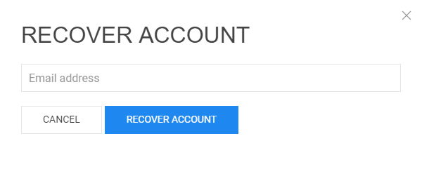
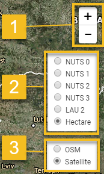

<h1><a class="anchor" id="introduction-to-user-interface" href="#introduction-to-user-interface"><i class="fa fa-link"></i></a>Úvod do uživatelského rozhraní</h1><h2><a class="anchor" id="table-of-contents" href="#table-of-contents"><i class="fa fa-link"></i></a> Obsah</h2><ul><li>
 <a href="#introduction-page">Úvodní stránka</a>
</li><li>
 <a href="#upper-toolbar">Horní panel nástrojů</a>
<ul><li> <a href="#upper-toolbar_connect">Připojit</a><ul><li> <a href="#upper-toolbar_connect_login">Přihlásit se</a></li><li> <a href="#upper-toolbar_connect_register">Registrovat</a></li><li> <a href="#upper-toolbar_connect_recover">Uzdravit se</a></li></ul></li><li> <a href="#upper-toolbar_go-to-place">Přejít na místo</a></li><li> <a href="#upper-toolbar_layers">Vrstvy</a></li><li> <a href="#upper-toolbar_selection-tools">Nástroje pro výběr</a></li><li> <a href="#upper-toolbar_show-result">Zobrazit výsledek</a></li><li> <a href="#upper-toolbar_feedback">Zpětná vazba</a></li><li> <a href="#upper-toolbar_save-session">Uložit relaci</a></li><li> <a href="#upper-toolbar_save-session-folder">Uložit složku relace</a></li></ul></li><li>
 <a href="#tiles">Dlaždice</a>
</li><li>
 <a href="#how-to-cite">Jak citovat</a>
</li><li>
 <a href="#authors-and-reviewers">Autoři a recenzenti</a>
</li><li>
 <a href="#license">Licence</a>
</li><li>
 <a href="#acknowledgement">Potvrzení</a>
</li></ul><h2><a class="anchor" id="introduction-page" href="#introduction-page"><i class="fa fa-link"></i></a> Úvodní stránka</h2>
 Po otevření panelu nástrojů se zobrazí stránka odmítnutí odpovědnosti. Kromě zprávy o vyloučení odpovědnosti jsou poskytnuty další informace týkající se podporovaných prohlížečů, cílů projektu Hotmaps, odkazu na web projektu Hotmaps a datových úložišť.

 <em>Obr. 1 Krátký úvod do sady nástrojů Hotmaps</em>

 Hotmaps GUI je rozhraní založené na GIS. Zavřením stránky s odmítnutím odpovědnosti se uživateli zobrazí mapa Evropy. Ve výchozím nastavení je zobrazena mapa hustoty požadavku na teplo zemí EU-28 a hranice NUTS 2. Kromě těchto dvou map lze v grafickém uživatelském rozhraní zobrazit některé nástroje a tlačítka. Tyto nástroje jsou znázorněny na následujícím obrázku.

 <em>Obr. 2 Úvodní stránka</em>

 Zde si na první pohled všimnete 3 částí uživatelského rozhraní:
<ol><li> <a href="#upper-toolbar">panel nástrojů vlevo nahoře</a> ,</li><li> samotná mapa,</li><li> <a href="#tiles">některé nástroje pro změnu stylu mapy</a> .</li><li> dva odkazy vpravo nahoře: na tuto <a href="https://wiki.hotmaps.eu/">Hotmaps Wiki</a> a na <a href="https://www.hotmaps-project.eu/">web Hotmaps Project</a> .</li></ol>
 V následujících kapitolách jsou první 3 body podrobně vysvětleny.

 <a href="#table-of-contents"><strong><code>To Top</code></strong></a>
<h2><a class="anchor" id="upper-toolbar" href="#upper-toolbar"><i class="fa fa-link"></i></a> Horní panel nástrojů</h2>

 Pomocí tohoto panelu nástrojů můžete:
<ol><li> <a href="#upper-toolbar_connect"><em>Připojit:</em></a> zaregistrujte se a přihlaste se do webové aplikace, abyste ušetřili práci,</li><li> <a href="#upper-toolbar_go-to-place"><em>Přejít na místo:</em></a> přiblížit konkrétní oblast zadáním názvu,</li><li> <a href="#upper-toolbar_layers"><em>Vrstvy:</em></a> zobrazit postranní panel vrstvy,</li><li> <a href="#upper-toolbar_selection-tools"><em>Nástroje pro výběr</em> :</a> povolte nebo zakažte nástroje pro výběr,</li><li> <a href="#upper-toolbar_show-result"><em>Zobrazit výsledek:</em></a> zobrazí postranní panel s výsledky vybraných oblastí,</li><li> <a href="#upper-toolbar_feedback"><em>Zpětná vazba:</em></a> poskytněte nám zpětnou vazbu týkající se nástroje,</li><li> <a href="#upper-toolbar_save-session"><em>Uložit relaci:</em></a> můžete uložit vybrané vrstvy a úroveň přiblížení a později si je vyvolat,</li><li> <a href="#upper-toolbar_save-session-folder"><em>Save Session Folder:</em></a> kde můžete vidět seznam všech uložených relací.</li></ol>
 <a href="#table-of-contents"><strong><code>To Top</code></strong></a>
<h3><a class="anchor" id="connect" href="#connect"><i class="fa fa-link"></i></a> Připojit</h3>
 Tady můžete:
<ul><li> Vytvořit účet</li><li> Chcete-li uložit svůj postup, přihlaste se ke svému účtu</li><li> Nebo si heslo resetujte, pokud jej zapomenete</li></ul>
 <a href="#table-of-contents"><strong><code>To Top</code></strong></a>
<h4><a class="anchor" id="login" href="#login"><i class="fa fa-link"></i></a> Přihlásit se</h4>
 Po <a href="#register">registraci</a> a aktivaci účtu byste měli být schopni se přihlásit pomocí svého e-mailu a hesla (viz <a href="#fig4">obr.4</a> níže).

 <em>Obr.4: Přihlašovací formulář</em>

 <a href="#table-of-contents"><strong><code>To Top</code></strong></a>
<h4><a class="anchor" id="register" href="#register"><i class="fa fa-link"></i></a> Registrovat</h4>
 Zde si můžete vytvořit účet pro web <em>hotmaps</em> . Po odeslání <a href="#fig5">formuláře</a> obdržíte e-mail k aktivaci účtu. S vaším účtem budete moci uložit svůj postup.

 <em>Obr.5 .: Registrační formulář</em>

 <a href="#table-of-contents"><strong><code>To Top</code></strong></a>
<h4><a class="anchor" id="recover" href="#recover"><i class="fa fa-link"></i></a> Uzdravit se</h4>
 Pokud jste někdy své heslo zapomněli, můžete je obnovit v této nabídce (viz <a href="#fig6">obr. 6</a> níže). Poté prosím nastavte nové heslo.

 <em>Obr.6 .: Obnovit formulář</em>

 <a href="#table-of-contents"><strong><code>To Top</code></strong></a>
<h3><a class="anchor" id="go-to-place" href="#go-to-place"><i class="fa fa-link"></i></a> Přejít na místo</h3>
 Zadanou oblast můžete přiblížit zadáním jejího názvu (viz animace níže)

 <a href="#table-of-contents"><strong><code>To Top</code></strong></a>
<h3><a class="anchor" id="layers" href="#layers"><i class="fa fa-link"></i></a> Vrstvy</h3>
 Stisknutím tohoto tlačítka se vlevo zobrazí boční panel s různými druhy vrstev.

 Následující vrstvy lze najít a vizualizovat:

 <a href="#table-of-contents"><strong><code>To Top</code></strong></a>
<h3><a class="anchor" id="selection-tools" href="#selection-tools"><i class="fa fa-link"></i></a> Nástroje pro výběr</h3>
 Stisknutím tohoto tlačítka se nástroje pro výběr zobrazí v levé části obrazovky

 Obrázek níže ukazuje vzhled nástrojů:

<ol><li> Nástroj pro výběr regionů</li><li> Vytvořte vlastní čtvercovou oblast</li><li> Vytvořte vlastní oblast kruhu</li><li> Vytvořte vlastní oblast mnohoúhelníku</li><li> Chcete-li použít výběr vlastní oblasti, nahrajte objekt GeoJSON</li></ol><ol type="A"><li> ukazuje, kolik regionů jste vybrali</li><li> zobrazuje celkovou plochu nejmenšího obdélníku, který může pokrýt vybranou oblast</li><li> zobrazuje měřítko, které jste vybrali z pravého panelu nástrojů</li></ol><ol type="a"><li> tlačítko pro načtení výsledků vybrané oblasti a vybraných vrstev</li><li> tlačítko pro odstranění vybrané oblasti</li></ol>
 <a href="#table-of-contents"><strong><code>To Top</code></strong></a>
<h3><a class="anchor" id="show-result" href="#show-result"><i class="fa fa-link"></i></a> Zobrazit výsledek</h3>
 V závislosti na vrstvách a oblasti, které jste vybrali, se výsledky pro vaši konfiguraci zobrazují na postranním panelu v pravé části obrazovky

 <a href="#table-of-contents"><strong><code>To Top</code></strong></a>
<h3><a class="anchor" id="feedback" href="#feedback"><i class="fa fa-link"></i></a> Zpětná vazba</h3>
 Máte nějaké návrhy, jak tento nástroj vylepšit? Všimli jste si nějaké chyby? Prosím, dejte nám vědět! Poskytnutím zpětné vazby nám pomůžete vylepšit sadu nástrojů!

 Vyplňte prosím následující <a href="#Fig7">formulář</a> :

 <a href="#table-of-contents"><strong><code>To Top</code></strong></a>

 můžete si vybrat z následujících typů:

 a nastavit prioritu:

 <a href="#table-of-contents"><strong><code>To Top</code></strong></a>
<h3><a class="anchor" id="save-session" href="#save-session"><i class="fa fa-link"></i></a> Uložit relaci</h3>
 stisknutím tohoto tlačítka můžete vytvořit snímek své práce (vybrané oblasti a vrstvy, úrovně přiblížení atd.). Můžete také definovat název a popis snímku.
<h3><a class="anchor" id="save-session-folder" href="#save-session-folder"><i class="fa fa-link"></i></a> Uložit složku relace</h3>
 Zde vidíte všechny své snímky s jejich názvy a popisem. Když vyberete jednu, načtou se vybrané vrstvy, oblasti, úroveň přiblížení a další konfigurace.
<h2><a class="anchor" id="tiles" href="#tiles"><i class="fa fa-link"></i></a> Dlaždice</h2>
 Můžete si vybrat územní měřítko, které chcete analyzovat (regiony NUTS nebo úroveň hektarů) a nastavit dlaždici mapy

 Jsou možné následující konfigurace

<ol><li> Přiblížit a oddálit mapu</li><li> Ukažte hranice NUTS a vyberte konkrétní regiony NUTS nebo použijte hektar k přizpůsobení svého <a href="#upper-toolbar_selection-tools">výběru</a></li><li> Použijte dlaždici OpenStreetMap nebo dlaždici Satelitní</li></ol>
 <a href="#table-of-contents"><strong><code>To Top</code></strong></a>
<h2><a class="anchor" id="how-to-cite" href="#how-to-cite"><i class="fa fa-link"></i></a> Jak citovat</h2>
 Jeton Hasani, v Hotmaps-Wiki, Úvod do uživatelského rozhraní (duben 2019)

 <a href="#table-of-contents"><strong><code>To Top</code></strong></a>
<h2><a class="anchor" id="authors-and-reviewers" href="#authors-and-reviewers"><i class="fa fa-link"></i></a> Autoři a recenzenti</h2>
 Tuto stránku napsal Jeton Hasani <strong><a href="https://eeg.tuwien.ac.at/">EEG - TU Wien</a></strong> .

 ☑ Tuto stránku zkontroloval Mostafa Fallahnejad <strong><a href="https://eeg.tuwien.ac.at/">EEG - TU Wien</a></strong> .

 <a href="#table-of-contents"><strong><code>To Top</code></strong></a>
<h2><a class="anchor" id="license" href="#license"><i class="fa fa-link"></i></a> Licence</h2>
 Copyright © 2016-2020: Jeton Hasani

 Mezinárodní licence Creative Commons Attribution 4.0

 Tato práce podléhá licenci na základě mezinárodní licence Creative Commons CC BY 4.0.

 SPDX-identifikátor licence: CC-BY-4.0

 Text licence: https://spdx.org/licenses/CC-BY-4.0.html

 <a href="#table-of-contents"><strong><code>To Top</code></strong></a>
<h2><a class="anchor" id="acknowledgement" href="#acknowledgement"><i class="fa fa-link"></i></a> Potvrzení</h2>
 Rádi bychom <a href="https://www.hotmaps-project.eu">vyjádřili</a> své nejhlubší uznání projektu Horizont 2020 <a href="https://www.hotmaps-project.eu">Hotmaps</a> (Grant Agreement number 723677), který poskytl finanční prostředky na provedení tohoto šetření.

 <a href="#table-of-contents"><strong><code>To Top</code></strong></a>

<!--- THIS IS A SUPER UNIQUE IDENTIFIER -->

This page was automatically translated. View in another language:

[English](../en/Introduction-to-user-interface) (original) [Bulgarian](../bg/Introduction-to-user-interface)\*  [Danish](../da/Introduction-to-user-interface)\* [German](../de/Introduction-to-user-interface)\* [Greek](../el/Introduction-to-user-interface)\* [Spanish](../es/Introduction-to-user-interface)\* [Estonian](../et/Introduction-to-user-interface)\* [Finnish](../fi/Introduction-to-user-interface)\* [French](../fr/Introduction-to-user-interface)\* [Irish](../ga/Introduction-to-user-interface)\* [Croatian](../hr/Introduction-to-user-interface)\* [Hungarian](../hu/Introduction-to-user-interface)\* [Italian](../it/Introduction-to-user-interface)\* [Lithuanian](../lt/Introduction-to-user-interface)\* [Latvian](../lv/Introduction-to-user-interface)\* [Maltese](../mt/Introduction-to-user-interface)\* [Dutch](../nl/Introduction-to-user-interface)\* [Polish](../pl/Introduction-to-user-interface)\* [Portuguese (Portugal, Brazil)](../pt/Introduction-to-user-interface)\* [Romanian](../ro/Introduction-to-user-interface)\* [Slovak](../sk/Introduction-to-user-interface)\* [Slovenian](../sl/Introduction-to-user-interface)\* [Swedish](../sv/Introduction-to-user-interface)\* 

\* machine translated
