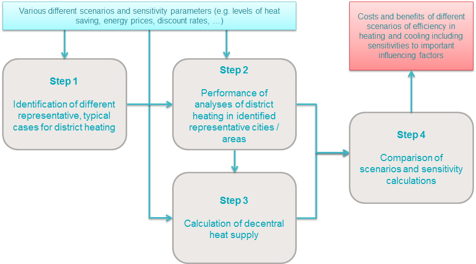

<h1><a class="anchor" id="guidelines-for-using-the-hotmaps-toolbox-for-analyses-at-national-level" href="#guidelines-for-using-the-hotmaps-toolbox-for-analyses-at-national-level"><i class="fa fa-link"></i></a>Pokyny pro používání sady nástrojů Hotmaps pro analýzy na národní úrovni</h1><h2><a class="anchor" id="table-of-contents" href="#table-of-contents"><i class="fa fa-link"></i></a> Obsah</h2><ul><li> <a href="#introduction">Úvod</a></li><li> <a href="#part-i-overview-of-heating-and-cooling">Část I: Přehled vytápění a chlazení</a></li><li> <a href="#part-iii-analysis-of-the-economic-potential-for-efficiency-in-heating-and-cooling">Část III: Analýza ekonomického potenciálu účinnosti vytápění a chlazení</a><ul><li> <a href="#part-iii-analysis-of-the-economic-potential-for-efficiency-in-heating-and-cooling_overview-of-the-hotmaps-approach">Přehled přístupu Hotmaps</a></li><li> <a href="#part-iii-analysis-of-the-economic-potential-for-efficiency-in-heating-and-cooling_different-steps">Různé kroky</a></li></ul></li><li> <a href="#how-to-cite">Jak citovat</a></li><li> <a href="#authors-and-reviewers">Autoři a recenzenti</a></li><li> <a href="#license">Licence</a></li><li> <a href="#acknowledgement">Potvrzení</a></li></ul><h2><a class="anchor" id="introduction" href="#introduction"><i class="fa fa-link"></i></a> Úvod</h2>
 Tyto pokyny popisují, jak lze sadu nástrojů Hotmaps použít k analýze nákladů a potenciálů pro efektivní a obnovitelné vytápění a chlazení na národní úrovni. <em><strong>Příručka je zaměřena zejména na vývoj výsledků podle komplexního posouzení vnitrostátních potenciálů vytápění a chlazení uvedených v čl.14 odst.1 směrnice o energetické účinnosti (EED) v jejím aktuálním znění a zohledňuje doporučení Komise (EU ) 2019/1659 o tomto postupu.</strong></em>

<ins> <code><strong><a href="#table-of-contents">To Top</a></strong></code></ins>
<h2><a class="anchor" id="part-i--overview-of-heating-and-cooling" href="#part-i--overview-of-heating-and-cooling"><i class="fa fa-link"></i></a> Část I: Přehled vytápění a chlazení</h2>
 Datové sady a sada nástrojů Hotmaps poskytují dva různé vstupy do této části: za prvé, datové sady Hotmaps poskytují výchozí data pro několik údajů potřebných k zahrnutí do této části I komplexního posouzení. Zadruhé, sada nástrojů Hotmaps je v podstatě nástrojem pro mapování, který umožňuje nejen geografické znázornění výchozích dat v sadě nástrojů; ale také data nahraná uživatelem do uživatelského účtu v sadě nástrojů. V následujícím textu popisujeme různé výchozí datové formuláře Hotmaps a odkazujeme na popisy použití funkce nahrávání v sadě nástrojů Hotmaps.

 V databázi Hotmaps jsou k dispozici následující údaje týkající se části I přílohy VIII:
<ul><li> Bod 2: aktuální dodávka topení a chlazení<ul><li> b) v) průmyslová zařízení:<ul><li> <a href="https://gitlab.com/hotmaps/industrial_sites/industrial_sites_industryBenchmarks">Průmyslová zařízení přebytečné teplo</a></li><li> <a href="https://gitlab.com/hotmaps/industrial_sites/industrial_sites_Industrial_Database">Názvy společností na průmyslových zařízeních</a></li><li> <a href="https://gitlab.com/hotmaps/industrial_sites/industrial_sites_industryBenchmarks">Subsektor průmyslových areálů</a></li></ul></li><li> Vše ostatní:<ul><li> Pro odběrná místa nejsou obsažena žádná výchozí data, lze však nahrát a zobrazit vlastní data</li><li> <a href="https://wiki.hotmaps.eu/en/Introduction-to-user-interface">Jak vytvořit účet</a></li><li> <a href="https://wiki.hotmaps.eu/en/Data-upload-functionalities">Jak nahrát vlastní data do panelu nástrojů</a></li></ul></li></ul></li><li> Bod 3: mapa pokrývající celé území státu<ul><li> a) Oblasti poptávky po vytápění a chlazení (nikoli pro průmyslovou poptávku)<ul><li> <a href="https://gitlab.com/hotmaps/heat/heat_res_curr_density">Hustota tepla pro bydlení</a></li><li> <a href="https://gitlab.com/hotmaps/heat/heat_nonres_curr_density">Hustota tepla nebytový</a></li><li> <a href="https://gitlab.com/hotmaps/heat/heat_tot_curr_density">Celková hustota tepla</a></li></ul></li><li> b) + c) Stávající a plánovaná odběrná místa<ul><li> Pro odběrná místa nejsou obsažena žádná výchozí data, lze však nahrát a zobrazit vlastní data</li><li> <a href="https://wiki.hotmaps.eu/en/Introduction-to-user-interface">Jak vytvořit účet</a></li><li> <a href="https://wiki.hotmaps.eu/en/Data-upload-functionalities">Jak nahrát vlastní data do panelu nástrojů</a></li></ul></li></ul></li><li> Bod 4: Předpověď vývoje poptávky po vytápění a chlazení<ul><li> Výchozí scénáře pro všechny členské státy EU28 jsou k dispozici v projektu H2020 <a href="http://www.cheetah-project.eu/">CHEETAH</a></li><li> Tato data jsou také integrována do <a href="https://wiki.hotmaps.eu/en/CM-Demand-projection">projekce CM - Demand</a> a používají se pro výpočty v tomto modulu</li></ul></li></ul>
<ins> <code><strong><a href="#table-of-contents">To Top</a></strong></code></ins>
<h2><a class="anchor" id="part-iii--analysis-of-the-economic-potential-for-efficiency-in-heating-and-cooling" href="#part-iii--analysis-of-the-economic-potential-for-efficiency-in-heating-and-cooling"><i class="fa fa-link"></i></a> Část III: Analýza ekonomického potenciálu účinnosti vytápění a chlazení</h2>
 Sada nástrojů Hotmaps obsahuje řadu výpočtových modulů (CM), které lze použít k analýze ekonomického potenciálu účinnosti vytápění a chlazení. V následujícím textu je popsán možný přístup ke generování výsledků pro komplexní posouzení pomocí sady nástrojů Hotmaps také s odkazem na příslušné výchozí datové a výpočetní moduly.
<h3><a class="anchor" id="overview-of-the-hotmaps-approach" href="#overview-of-the-hotmaps-approach"><i class="fa fa-link"></i></a> Přehled přístupu Hotmaps</h3>
 Pro posouzení ekonomického potenciálu pro účinnost vytápění a chlazení je důležité rozlišovat mezi oblastmi, které jsou potenciálně zásobovány dálkovým vytápěním, a oblastmi, kde bude s největší pravděpodobností ekonomicky efektivnější decentralizovaná dodávka. <strong>Přístup Hotmaps je tedy silně postaven na následujících čtyřech krocích</strong> :
<ol><li>
 Určete různé reprezentativní, typické případy dálkového vytápění v zemi / regionu, který je předmětem šetření;
</li><li>
 Provést analýzy výstavby / expanze sítě dálkového vytápění a dodávky tepla pro identifikované reprezentativní případy;
</li><li>
 Vypočítejte ukazatele decentrálního zásobování teplem;
</li><li>
 Porovnejte různé scénáře dálkového vytápění a decentralizovaného zásobování teplem a výpočty citlivosti.
</li></ol>
 Následující obrázek ukazuje tento přístup graficky. Jednotlivé kroky budou podrobněji vysvětleny v následujících kapitolách těchto pokynů.

 <em>Obrázek: Přístup hotmaps k analýze ekonomického potenciálu účinnosti vytápění a chlazení ve smyslu článku 14 směrnice o energetické účinnosti (EED)</em>

 Ve všech těchto krocích <strong>je třeba vzít v úvahu různé scénáře a citlivost</strong> :
<ul><li> Různé úrovně úspor tepla (implementováno v krocích 1, 2 a 3)</li><li> Různé úrovně podílů dálkového vytápění na celkové dodávce tepla (implementováno v kroku 2)</li><li> Různé budoucí ceny energie (implementovány v kroku 2 a 3)</li><li> Různé doby amortizace a diskontní sazby (socioekonomické vs. soukromé-ekonomické výpočty) (implementováno v kroku 2 a 3)</li></ul>
 Z <strong>výsledkových modulů</strong> Hotmaps (CM) <strong>lze načíst</strong> následující výsledné <strong>indikátory</strong> :
<ul><li> Ekonomický potenciál:<ul><li> Vyrovnané náklady na teplo (LCOH) [EUR / MWh]:<ul><li> <a href="https://wiki.hotmaps.eu/en/CM-District-heating-supply-dispatch">CM - expedice dodávky dálkového tepla</a> pro náklady na dodávku tepla do dálkového vytápění</li><li> <a href="https://wiki.hotmaps.eu/en/CM-Decentral-heating-supply">CM - Decentrální dodávka tepla</a> pro náklady na decentrální dodávku tepla</li><li> <a href="https://wiki.hotmaps.eu/en/CM-Excess-heat-transport-potential">CM - Potenciál</a> přenosu přebytečného tepla pro náklady na přepravu přebytečného tepla do potenciálních sítí dálkového vytápění</li></ul></li><li> Specifické náklady na síť dálkového vytápění (rozšíření a / nebo nová výstavba) [EUR / MWh]:<ul><li> <a href="https://wiki.hotmaps.eu/en/CM-District-heating-potential-economic-assessment">CM - Potenciál dálkového vytápění: ekonomické hodnocení</a></li></ul></li></ul></li><li> Emise skleníkových plynů:<ul><li> Emise CO2 [kt]:<ul><li> <a href="https://wiki.hotmaps.eu/en/CM-District-heating-supply-dispatch">CM - dodávka dálkového vytápění</a> pro emise CO2 z dodávky tepla do dálkového vytápění</li><li> <a href="https://wiki.hotmaps.eu/en/CM-Decentral-heating-supply">CM - Decentrální dodávka tepla</a> pro emise CO2 z decentralizované dodávky tepla</li></ul></li></ul></li><li> Dopad na podíl OZE lze vypočítat na základě výsledků následujících CM:<ul><li> <a href="https://wiki.hotmaps.eu/en/CM-District-heating-supply-dispatch">CM - odeslání dodávky dálkového tepla</a> pro podíl OZE z dodávky tepla na dálkové vytápění</li><li> <a href="https://wiki.hotmaps.eu/en/CM-Decentral-heating-supply">CM - Decentrální dodávka tepla</a> pro podíl OZE z decentralizované dodávky tepla</li></ul></li></ul>
<ins> <code><strong><a href="#table-of-contents">To Top</a></strong></code></ins>
<h3><a class="anchor" id="different-steps" href="#different-steps"><i class="fa fa-link"></i></a> Různé kroky</h3><ul><li> <a href="https://wiki.hotmaps.eu/en/Step-1-Identification-of-different-representative-cases-for-district-heating">Krok 1: Identifikace různých reprezentativních případů pro dálkové vytápění</a><ul><li> Výpočet budoucí potřeby tepla a mapy hustoty podlahové plochy budovy</li><li> Identifikace oblastí potenciálně zajímavých pro dálkové vytápění</li><li> Identifikace reprezentativních, typických oblastí dálkového vytápění pro další analýzu</li></ul></li><li> <a href="https://wiki.hotmaps.eu/en/Step-2-Costs-and-potentials-for-district-heating-in-representative-regions-or-cities">Krok 2: Náklady a potenciál pro dálkové vytápění v reprezentativních regionech nebo městech</a><ul><li> Ekonomické posouzení potenciálu dálkového vytápění</li><li> Odhad nákladů na dopravu přebytečného tepla do oblastí dálkového vytápění</li><li> Vývoj budoucích profilů tepelného zatížení</li><li> Výpočet nákladů a emisí dodávky tepla při dálkovém vytápění</li></ul></li><li> <a href="https://wiki.hotmaps.eu/en/Step-3-Calculation-of-decentral-heat-supply">Krok 3: Výpočet decentralizovaného zásobování teplem</a></li><li> <a href="https://wiki.hotmaps.eu/en/Step-4-Comparison-of-results-for-different-scenarios">Krok 4: Porovnání výsledků pro různé scénáře</a></li></ul>
<ins> <code><strong><a href="#table-of-contents">To Top</a></strong></code></ins>
<h2><a class="anchor" id="how-to-cite" href="#how-to-cite"><i class="fa fa-link"></i></a> Jak citovat</h2>
 Marcus Hummel, Giulia Conforto, v Hotmaps-Wiki, Pokyny pro používání sady nástrojů Hotmaps pro analýzy na národní úrovni (říjen 2020)

<ins> <code><strong><a href="#table-of-contents">To Top</a></strong></code></ins>
<h2><a class="anchor" id="authors-and-reviewers" href="#authors-and-reviewers"><i class="fa fa-link"></i></a> Autoři a recenzenti</h2>
 Tuto stránku napsali Marcus Hummel a Giulia Conforto ( <strong><a href="https://e-think.ac.at">e-think</a></strong> ).

 ☑ Tuto stránku zkontroloval Mostafa Fallahnejad ( <strong><a href="https://eeg.tuwien.ac.at/">EEG - TU Wien</a></strong> ).

 <a href="#table-of-contents"><strong><code>To Top</code></strong></a>
<h2><a class="anchor" id="license" href="#license"><i class="fa fa-link"></i></a> Licence</h2>
 Copyright © 2016-2020: Marcus Hummel, Giulia Conforto

 Mezinárodní licence Creative Commons Attribution 4.0

 Tato práce podléhá licenci na základě mezinárodní licence Creative Commons CC BY 4.0.

 SPDX-identifikátor licence: CC-BY-4.0

 Text licence: https://spdx.org/licenses/CC-BY-4.0.html

<ins> <code><strong><a href="#table-of-contents">To Top</a></strong></code></ins>
<h2><a class="anchor" id="acknowledgement" href="#acknowledgement"><i class="fa fa-link"></i></a> Potvrzení</h2>
 Rádi bychom <a href="https://www.hotmaps-project.eu">vyjádřili</a> své nejhlubší uznání projektu Horizont 2020 <a href="https://www.hotmaps-project.eu">Hotmaps</a> (Grant Agreement number 723677), který poskytl finanční prostředky na provedení tohoto šetření.

<ins> <code><strong><a href="#table-of-contents">To Top</a></strong></code></ins>

<!--- THIS IS A SUPER UNIQUE IDENTIFIER -->

This page was automatically translated. View in another language:

[English](../en/guide-national-level-comprehensive-assessment-eed) (original) [Bulgarian](../bg/guide-national-level-comprehensive-assessment-eed)\*  [Danish](../da/guide-national-level-comprehensive-assessment-eed)\* [German](../de/guide-national-level-comprehensive-assessment-eed)\* [Greek](../el/guide-national-level-comprehensive-assessment-eed)\* [Spanish](../es/guide-national-level-comprehensive-assessment-eed)\* [Estonian](../et/guide-national-level-comprehensive-assessment-eed)\* [Finnish](../fi/guide-national-level-comprehensive-assessment-eed)\* [French](../fr/guide-national-level-comprehensive-assessment-eed)\* [Irish](../ga/guide-national-level-comprehensive-assessment-eed)\* [Croatian](../hr/guide-national-level-comprehensive-assessment-eed)\* [Hungarian](../hu/guide-national-level-comprehensive-assessment-eed)\* [Italian](../it/guide-national-level-comprehensive-assessment-eed)\* [Lithuanian](../lt/guide-national-level-comprehensive-assessment-eed)\* [Latvian](../lv/guide-national-level-comprehensive-assessment-eed)\* [Maltese](../mt/guide-national-level-comprehensive-assessment-eed)\* [Dutch](../nl/guide-national-level-comprehensive-assessment-eed)\* [Polish](../pl/guide-national-level-comprehensive-assessment-eed)\* [Portuguese (Portugal, Brazil)](../pt/guide-national-level-comprehensive-assessment-eed)\* [Romanian](../ro/guide-national-level-comprehensive-assessment-eed)\* [Slovak](../sk/guide-national-level-comprehensive-assessment-eed)\* [Slovenian](../sl/guide-national-level-comprehensive-assessment-eed)\* [Swedish](../sv/guide-national-level-comprehensive-assessment-eed)\* 

\* machine translated
