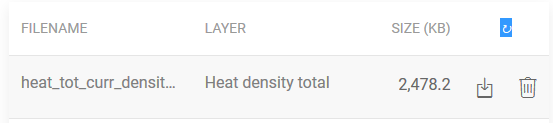

<h2> Indholdsfortegnelse </h2><ul><li> <a href="#Introduction">Introduktion</a> </li><li> <a href="#How-to-upload-a-layer-with-custom-data">Sådan uploades et lag med brugerdefinerede data</a> </li><li> <a href="#How-to-display-an-uploaded-layer">Sådan vises et uploadet lag</a> </li><li> <a href="#Offline-mode">Offline-tilstand</a> </li><li> <a href="#Data-security-and-privacy">Datasikkerhed og privatliv</a> </li><li> <a href="#References">Referencer</a> </li><li> <a href="#How-to-cite">Sådan citeres</a> </li><li> <a href="#Authors-and-reviewers">Forfattere og korrekturlæsere</a> </li><li> <a href="#Acknowledgement">Anerkendelse</a> </li></ul><h2> Introduktion </h2>
 Platformen giver mulighed for at uploade nogle tilpassede data fra din computer til Hotmaps. Denne del er tæt knyttet til <a href="Data-export-functionalities">eksportfunktionen</a> , da det endelige mål med disse to funktioner er at eksportere nogle data, foretage nogle redigeringer til det og visualisere dem på værktøjskassen senere ved at importere disse data tilbage. Bemærk, at dine uploadede data kun kan visualiseres, ingen beregningsmoduler kan udføres på dem i øjeblikket. 

 Denne handling <strong>kræver en brugerkonto</strong> . Registrerings- og loginprocesserne forklares på følgende side: <a href="Introduction-to-user-interface#Connect">Brugerkonto</a> . 

 For at uploade et datasæt uden problemer. Brug først <a href="Data-export-functionalities">eksportfunktionen</a> til det område, du vil importere (da-se <a href="Data-export-functionalities">Dataeksport</a> side). 

<ins> <code><strong><a href="#table-of-contents">To Top</a></strong></code> </ins> 
<h2> Sådan uploades et lag med brugerdefinerede data </h2>
 Ved at trykke på  knappen øverst til venstre på siden. Dette bringer profilsiden foran. 

 På profilsiden: 
<ol><li> valg af type datasæt </li><li> valg af fil, der skal uploades (.tif eller .csv) </li><li> upload ved at klikke på ikonet &quot;+&quot; </li></ol>

 Valg af type datasæt bruges for at få den rigtige symbologi. Hvis dit datasæt ikke stemmer overens med lagets symbologi, vises det ikke korrekt. 

 Når dette er gjort, vises en succesmeddelelse, og laget vises på listen over lag på profilsiden. 

 Hver bruger har en begrænset diskplads, når brugeren ikke har nok plads, kan den ikke tilføje flere filer, du kan visualisere din venstre plads med cirkeldiagrammet i feltet Brugerdiskum. 

 Før serveren kan vise laget på kortet, har serveren brug for nogen tid (op til flere minutter) efter succesmeddelelsen for at importere datasættet korrekt. Datasættet kan vises, når dets størrelse ikke længere er 0. 

 Laget kan nu vises på kortet ved at aktivere det på lagpanelet. 

<ins> <code><strong><a href="#table-of-contents">To Top</a></strong></code> </ins> 
<h2> Sådan vises et uploadet lag </h2>
 Det er muligt at vise et lag, der tidligere er blevet uploadet fra lagpanelet ved at klikke på  knap. 

 Listen over uploadede lag vises i afsnittet &quot;Personlige lag&quot; øverst på venstre panel. 

 Et lag kan vises ved at aktivere det på det venstre panel. 

<ins> <code><strong><a href="#table-of-contents">To Top</a></strong></code> </ins> 
<h2> Offline-tilstand </h2>
 Hvis du er logget ud, kan du ikke få adgang til nogen af dine personlige lag, men de er stadig tilgængelige, når du logger ind igen. 

<ins> <code><strong><a href="#table-of-contents">To Top</a></strong></code> </ins> 
<h2> Datasikkerhed og privatliv </h2>
 Hotmaps-værktøjskasse giver sikkerhed for brugere, der opretter en konto på platformen. Almindelige sikkerhedsforanstaltninger er blevet implementeret: HTTPS-protokol, hashing-adgangskode / saltning og så videre. Bemærk dog, at de uploadede datasæt i øjeblikket ikke er krypterede, når de gemmes på serveren, så undgå at uploade følsomme data. 

<ins> <code><strong><a href="#table-of-contents">To Top</a></strong></code> </ins> 
<h2> Referencer </h2>
<ins> <code><strong><a href="#table-of-contents">To Top</a></strong></code> </ins> 
<h2> Sådan citeres </h2>
<ins> <code><strong><a href="#table-of-contents">To Top</a></strong></code> </ins> 
<h2> Forfattere og korrekturlæsere </h2>
 Forfattere: 
<ul><li> Daniel Hunacek </li><li> Lucien Zuber </li></ul>
 anmeldere: 

<ins> <code><strong><a href="#table-of-contents">To Top</a></strong></code> </ins> 
<h2> Anerkendelse </h2>
 Vi vil gerne overbringe vores dybeste forståelse til Horizon 2020 <a href="https://www.hotmaps-project.eu">Hotmaps-projektet</a> (tilskudsaftale nr. 723677), som gav finansieringen til at gennemføre den nuværende undersøgelse 

<ins> <code><strong><a href="#table-of-contents">To Top</a></strong></code> </ins> 

This page was automatically translated. View in another language:

[English](en-Data-upload-functionalities) (original) [Bulgarian](bg-Data-upload-functionalities)\* [Croatian](hr-Data-upload-functionalities)\* [Czech](cs-Data-upload-functionalities)\*  [Dutch](nl-Data-upload-functionalities)\* [Estonian](et-Data-upload-functionalities)\* [Finnish](fi-Data-upload-functionalities)\* [French](fr-Data-upload-functionalities)\* [German](de-Data-upload-functionalities)\* [Greek](el-Data-upload-functionalities)\* [Hungarian](hu-Data-upload-functionalities)\* [Irish](ga-Data-upload-functionalities)\* [Italian](it-Data-upload-functionalities)\* [Latvian](lv-Data-upload-functionalities)\* [Lithuanian](lt-Data-upload-functionalities)\* [Maltese](mt-Data-upload-functionalities)\* [Polish](pl-Data-upload-functionalities)\* [Portuguese (Portugal, Brazil)](pt-Data-upload-functionalities)\* [Romanian](ro-Data-upload-functionalities)\* [Slovak](sk-Data-upload-functionalities)\* [Slovenian](sl-Data-upload-functionalities)\* [Spanish](es-Data-upload-functionalities)\* [Swedish](sv-Data-upload-functionalities)\* 

\*: machine translated
