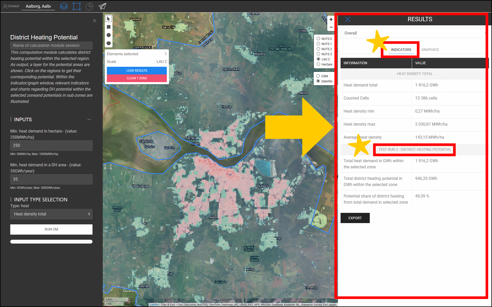

<h1><a class="anchor" id="cm-district-heating-potential-areas-user-defined-thresholds" href="#cm-district-heating-potential-areas-user-defined-thresholds"><i class="fa fa-link"></i></a>CM Fjernvarmepotentiale områder brugerdefinerede tærskler</h1><h2><a class="anchor" id="table-of-contents" href="#table-of-contents"><i class="fa fa-link"></i></a> Indholdsfortegnelse</h2><ul><li> <a href="#in-a-glance">På et øjeblik</a></li><li> <a href="#introduction">Introduktion</a></li><li> <a href="#inputs-and-outputs">Ind- og udgange</a></li><li> <a href="#method">Metode</a></li><li> <a href="#github-repository-of-this-calculation-module">GitHub-arkiv for dette beregningsmodul</a></li><li> <a href="#sample-run">Prøvekørsel</a><ul><li> <a href="#sample-run_test-run-1-default-input-values">Testkørsel 1: standard inputværdier</a></li><li> <a href="#sample-run_test-run-2-modified-input-values">Testkørsel 2: ændrede inputværdier</a></li></ul></li><li> <a href="#how-to-cite">Hvordan man citerer</a></li><li> <a href="#authors-and-reviewers">Forfattere og korrekturlæsere</a></li><li> <a href="#license">Licens</a></li><li> <a href="#acknowledgement">Anerkendelse</a></li></ul><h2><a class="anchor" id="in-a-glance" href="#in-a-glance"><i class="fa fa-link"></i></a> På et øjeblik</h2>
 Dette beregningsmodul beregner fjernvarmepotentialet inden for det valgte område ved hjælp af 2 tærskelværdier: 1) Minimumsvarmebehov i hver hektar, 2) Minimumsvarmebehov i et DH-område. Områder inden for den valgte region, der opfylder disse betingelser, returneres som DH-områder. Desuden er varmebehovet i disse regioner afkast i form af indikatorer som DH-potentiale.

 <a href="#table-of-contents"><strong><code>To Top</code></strong></a>
<h2><a class="anchor" id="introduction" href="#introduction"><i class="fa fa-link"></i></a> Introduktion</h2>
 Varmebehovet spiller en vigtig rolle i bestemmelsen af potentielle fjernvarmeområder (DH). For eksempel er implementeringen af fjernvarme i områder med lavt varmebehov ikke økonomisk bæredygtig. På den anden side kan det også være unøjagtigt at definere ethvert område med høj tæthed for varmebehov som et potentielt DH-område. En høj tæthed for varmebehov i et område kan skyldes tilstedeværelsen af nogle få forbrugere med et meget stort varmebehov inden for dette område. Tværtimod kan en lav gennemsnitlig varmebehovstæthed være et tegn på zoner med et meget lavt varmebehov inden for det valgte område. Formålet med beregningsmodulet &quot;CM - POTENTIELT OMRÅDE FOR VARMEVARME: BRUGERDEFINERET TÆRKE&quot; er at tilvejebringe en rimelig balance mellem varmebehovstætheden i et område og dets sammensatte zoner.

 &quot;CM - DISTRIKT VARMEPOTENTIELT OMRÅDE: BRUGEREDEFINERET TÆRKE&quot; bestemmer DH-områderne og deres tilsvarende DH-potentiale baseret på varmebehovstætheder. Varmebehovstæthederne opnås fra et input GIS-lag. Hotmaps-værktøjskassen og databasen indeholder et <strong><a href="https://gitlab.com/hotmaps/heat/heat_tot_curr_density">standardvarmetæthedskort,</a></strong> der kan bruges i dette beregningsmodul. Hotmaps-kortet for varmetæthed er i rasterformat og har en opløsning på en hektar og Coordinate Reference System (CRS) under &quot; <em><em>ETRS89 / LAEA Europe - EPSG 3035</em></em> &quot;. Cellerne på kortet viser varmetætheden i <em><strong>MWh / ha</strong></em> . Udover dette standardkort kan også kort genereret af brugeren uploades til værktøjskassen og bruges i denne CM.

 Som output præsenteres et GIS-lag, tre indikatorer og to diagrammer. Disse output forklares detaljeret i afsnittet <a href="#sample-run">Prøvekørsel</a> . Outputlaget viser de potentielle DH-områder. Ved at klikke på hvert område på kortet dukker et vindue op, og DH-potentialet, der svarer til dette område, vises. Inden for INDIKATORER / GRAFIK-vinduerne i sektionen RESULTATER i værktøjskassen illustreres relevante indikatorer og diagrammer vedrørende DH-potentiale inden for den valgte zone og potentialer i underzoner.

 <a href="#table-of-contents"><strong><code>To Top</code></strong></a>
<h2><a class="anchor" id="inputs-and-outputs" href="#inputs-and-outputs"><i class="fa fa-link"></i></a> Ind- og udgange</h2>
 Inputparametrene og lagene samt outputlagene og parametrene er som følger.

 <strong>Inputlag og parametre er:</strong>
<ul><li> Minimumsvarmebehov i hver hektar [ <em><strong>MWh / ha</strong></em> ]: en værdi mellem <em><em>0</em></em> og <em><em>1000</em></em></li><li> Minimumsvarmebehov i et DH-område [ <em><strong>GWh / år</strong></em> ]: en værdi mellem <em><em>0</em></em> og <em><em>500</em></em></li><li> Kort over varmetæthed: et standardkort findes i værktøjskassen; egne uploadede kort kan også bruges i CM<ul><li> i rasterformat (* .tif)</li><li> med 1 hektar opløsning</li><li> efterspørgselstætheder i <em><strong>MWh / ha</strong></em></li></ul></li></ul>
 <strong>Outputlag og parametre er:</strong>
<ul><li> DH-områder i raster- og shapefile-formater</li><li> DH-potentiale i hvert DH-område [ <em><strong>GWh / år</strong></em> ] (klik på kortet)</li><li> Samlet varmebehov i GWh inden for den valgte zone</li><li> Samlet fjernvarmepotentiale i GWh inden for den valgte zone</li><li> Potentiel andel af fjernvarme fra det samlede behov i den valgte zone</li></ul>
 <a href="#table-of-contents"><strong><code>To Top</code></strong></a>
<h2><a class="anchor" id="method" href="#method"><i class="fa fa-link"></i></a> Metode</h2>
 Potentialet for DH i en bestemt region kan defineres af det samlede varmebehov og dets geografiske fordeling. I Hotmaps-værktøjskassen er varmebehovet repræsenteret i form af et rasterkort. For korrekt at definere potentielle DH-områder skal både varmebehovet i hver celle og også i et område nå et bestemt niveau. Som udgangspunkt foreslår Hotmaps-værktøjskassen standardværdier for disse to parametre. Afhængig af fordelingen af varmebehov og også de lokale forhold kan Hotmaps-brugeren ændre disse værdier.

 Bestemmelsen af DH-områder udføres i to trin:

 I det første trin filtreres alle celler med varmebehov under inputparameteren &quot;Minimumsvarmebehov i hektar&quot;. Ved at fjerne disse celler fra kortet får vi grupper af celler, der er knyttet til hinanden. Hvert sæt af disse vedhæftede celler udgør små zoner, der her kaldes &quot;sammenhængende områder&quot;. I det andet trin beregnes det samlede varmebehov i hvert sammenhængende område. Hvis det samlede varmebehov er højere end inputparameteren &quot;Minimum varmebehov i et DH-område&quot;, betragtes det som et potentielt DH-område for hvert sammenhængende område.

 Endelig beregnes og præsenteres potentialet for DH-områderne i form af et GIS-lag, som kan ses i værktøjskassen.

 <a href="#table-of-contents"><strong><code>To Top</code></strong></a>
<h2><a class="anchor" id="github-repository-of-this-calculation-module" href="#github-repository-of-this-calculation-module"><i class="fa fa-link"></i></a> GitHub-lager af dette beregningsmodul</h2>
 <a href="https://github.com/HotMaps/dh_potential/tree/develop">Her</a> får du banebrydende udvikling for dette beregningsmodul.

 <a href="#table-of-contents"><strong><code>To Top</code></strong></a>
<h2><a class="anchor" id="sample-run" href="#sample-run"><i class="fa fa-link"></i></a> Prøvekørsel</h2>
 Her køres beregningsmodulet til casestudiet af Aalborg i Danmark.
<ul><li> Brug først &quot;Gå til sted&quot; -linjen til at navigere til Aalborg og vælge byen.</li></ul><ul><li>
 Følg trinene som vist i nedenstående figur:
<ul><li> Klik på knappen &quot;Lag&quot; for at åbne vinduet &quot;Lag&quot;:</li><li> Klik på fanen &quot;BEREGNINGSMODULER&quot;.</li><li> Klik på knappen &quot;CM-DISTRICT HEATING POTENTIAL AREAS: USER-DEFINED THRESHOLDS&quot; -knappen.</li></ul></li><li>
 Nu åbner beregningsmodulet &quot;CM-DISTRICT OPVARMNING POTENTIELLE OMRÅDER: BRUGEREDEFINEREDE TÆRKER&quot; og er klar til at køre.
</li></ul>
 <a href="#table-of-contents"><strong><code>To Top</code></strong></a>
<h3><a class="anchor" id="test-run-1--default-input-values" href="#test-run-1--default-input-values"><i class="fa fa-link"></i></a> Testkørsel 1: standard inputværdier</h3>
 Standardindgangsværdierne viser de generelle betingelser, hvorunder et område kan betragtes som et potentielt DH-område. Disse værdier skal kun betragtes som udgangspunkt. Du skal muligvis indstille værdier under eller over standardværdierne i værktøjskassen i betragtning af yderligere lokale forhold. Derfor skal brugeren tilpasse disse værdier for at finde den bedste kombination af tærskler til hans eller hendes casestudie.

 Følg de næste trin for at køre beregningsmodulet:
<ul><li> Tildel et navn til kørselssessionen (valgfri - her valgte vi &quot;Testkørsel 1&quot;) og indstil inputparametrene (her blev standardværdier brugt).</li></ul><ul><li> Tryk på knappen &quot;KØR CM&quot; nederst til venstre.</li><li> Vent, indtil processen er afsluttet.</li></ul>
 <strong><code>Note: If you wish to change your input parameters, you can press &quot;STOP CM&quot;, modify your input parameters and re-run the CM</code></strong>
<ul><li> Som output vises indikatorer og diagrammer i afsnittet &quot;RESULTATER&quot; på højre side af værktøjskassen. Indikatorerne viser:<ul><li> det samlede varmebehov i <em><em>GWh</em></em> inden for den valgte zone</li><li> samlet DH-potentiale i <em><em>GWh</em></em> inden for den valgte zone,</li><li> andelen af DH-potentiale fra den samlede efterspørgsel, som opnås ved at opdele DH-potentialet efter det samlede varmebehov i regionen.</li></ul></li></ul>
 Derudover genereres også to diagrammer. Den første viser DH-potentialet i hvert DH-område. De tilsvarende etiketter kan også findes på kortet. Det andet diagram illustrerer det samlede DH-potentiale sammenlignet med det samlede varmebehov i det valgte område.
<ul><li> Der tilføjes også et nyt lag til lærredet, der viser DH-områder. Dette lag føjes til listen over lag under kategorien &quot;Beregningsmodul&quot; i bunden af lagafsnittet. Kørselsnavnet adskiller output fra denne kørsel fra andre.</li></ul>
 Ved at følge disse trin får du et indtryk af inputværdierne og potentielle DH-områder.

 <a href="#table-of-contents"><strong><code>To Top</code></strong></a>
<h3><a class="anchor" id="test-run-2--modified-input-values" href="#test-run-2--modified-input-values"><i class="fa fa-link"></i></a> Testkørsel 2: ændrede inputværdier</h3>
 Afhængigt af din erfaring og lokal viden kan du øge eller formindske inputværdierne for at opnå bedre resultater. For eksempel i Aalborg ved du måske, at varmebehovet i de ydre byområder er relativt tæt på den centrale del af byen, og DH-systemet er også muligt i disse områder. Derfor kan du beslutte at reducere det minimale varmebehov i celler, der er en del af et DH-område; for at garantere tilstrækkeligt varmebehov kan du dog øge det mindste varmebehov i et DH-område. Her kører du beregningsmodulerne igen med nye inputparametre.
<ul><li> Tildel et navn til kørselssessionen (valgfrit - her valgte vi &quot;Testkørsel 2&quot;) og indstil inputparametrene ( <em><em>250 MWh / ha</em></em> i min. Varmebehov i hektar og <em><em>35 GWh / år</em></em> for minimumsbehov i DH-område) .</li></ul><ul><li> Tryk på knappen &quot;KØR CM&quot; nederst til venstre.</li><li> Vent, indtil processen er afsluttet.</li><li> Som output vises indikatorer og diagrammer i afsnittet &quot;RESULTATER&quot; på højre side af værktøjskassen. Indikatorerne viser:<ul><li> det samlede varmebehov i <em><em>GWh</em></em> inden for den valgte zone</li><li> samlet DH-potentiale i <em><em>GWh</em></em> inden for den valgte zone,</li><li> andelen af DH-potentiale fra den samlede efterspørgsel, som opnås ved at opdele DH-potentialet med det samlede varmebehov i regionen.</li></ul></li></ul>
 Derudover genereres også to diagrammer. Den første viser DH-potentialet i hvert DH-område. De tilsvarende etiketter kan også findes på kortet. Det andet diagram illustrerer det samlede DH-potentiale sammenlignet med det samlede varmebehov i det valgte område.
<ul><li> Der tilføjes også et nyt lag til lærredet, der viser DH-områder. Dette lag føjes til listen over lag under kategorien &quot;Beregningsmodul&quot;. Kørselsnavnet adskiller output fra denne kørsel fra andre.</li></ul>
 <a href="#table-of-contents"><strong><code>To Top</code></strong></a>
<h2><a class="anchor" id="how-to-cite" href="#how-to-cite"><i class="fa fa-link"></i></a> Hvordan man citerer</h2>
 Mostafa Fallahnejad, i Hotmaps-Wiki, CM-Fjernvarmepotentiale-områder: brugerdefinerede-tærskler (april 2019)

 <a href="#table-of-contents"><strong><code>To Top</code></strong></a>
<h2><a class="anchor" id="authors-and-reviewers" href="#authors-and-reviewers"><i class="fa fa-link"></i></a> Forfattere og korrekturlæsere</h2>
 Denne side blev skrevet af Mostafa Fallahnejad ( <strong><a href="https://eeg.tuwien.ac.at/">EEG - TU Wien</a></strong> ).

 ☑ Denne side blev gennemgået af Marcul Hummel ( <strong><a href="https://e-think.ac.at">e-think</a></strong> ).

 <a href="#table-of-contents"><strong><code>To Top</code></strong></a>
<h2><a class="anchor" id="license" href="#license"><i class="fa fa-link"></i></a> Licens</h2>
 Ophavsret © 2016-2020: Mostafa Fallahnejad

 Creative Commons Attribution 4.0 International licens

 Dette arbejde er licenseret under en Creative Commons CC BY 4.0 International licens.

 SPDX-licensidentifikator: CC-BY-4.0

 Licens-tekst: https://spdx.org/licenses/CC-BY-4.0.html

 <a href="#table-of-contents"><strong><code>To Top</code></strong></a>
<h2><a class="anchor" id="acknowledgement" href="#acknowledgement"><i class="fa fa-link"></i></a> Anerkendelse</h2>
 Vi vil gerne formidle vores dybeste påskønnelse til Horizon 2020 <a href="https://www.hotmaps-project.eu">Hotmaps-projektet</a> (tilskudsaftale nummer 723677), som gav finansieringen til at gennemføre den nuværende undersøgelse.

 <a href="#table-of-contents"><strong><code>To Top</code></strong></a>

<!--- THIS IS A SUPER UNIQUE IDENTIFIER -->

This page was automatically translated. View in another language:

[English](../en/CM-District-heating-potential-areas-user-defined-thresholds) (original) [Bulgarian](../bg/CM-District-heating-potential-areas-user-defined-thresholds)\* [Czech](../cs/CM-District-heating-potential-areas-user-defined-thresholds)\*  [German](../de/CM-District-heating-potential-areas-user-defined-thresholds)\* [Greek](../el/CM-District-heating-potential-areas-user-defined-thresholds)\* [Spanish](../es/CM-District-heating-potential-areas-user-defined-thresholds)\* [Estonian](../et/CM-District-heating-potential-areas-user-defined-thresholds)\* [Finnish](../fi/CM-District-heating-potential-areas-user-defined-thresholds)\* [French](../fr/CM-District-heating-potential-areas-user-defined-thresholds)\* [Irish](../ga/CM-District-heating-potential-areas-user-defined-thresholds)\* [Croatian](../hr/CM-District-heating-potential-areas-user-defined-thresholds)\* [Hungarian](../hu/CM-District-heating-potential-areas-user-defined-thresholds)\* [Italian](../it/CM-District-heating-potential-areas-user-defined-thresholds)\* [Lithuanian](../lt/CM-District-heating-potential-areas-user-defined-thresholds)\* [Latvian](../lv/CM-District-heating-potential-areas-user-defined-thresholds)\* [Maltese](../mt/CM-District-heating-potential-areas-user-defined-thresholds)\* [Dutch](../nl/CM-District-heating-potential-areas-user-defined-thresholds)\* [Polish](../pl/CM-District-heating-potential-areas-user-defined-thresholds)\* [Portuguese (Portugal, Brazil)](../pt/CM-District-heating-potential-areas-user-defined-thresholds)\* [Romanian](../ro/CM-District-heating-potential-areas-user-defined-thresholds)\* [Slovak](../sk/CM-District-heating-potential-areas-user-defined-thresholds)\* [Slovenian](../sl/CM-District-heating-potential-areas-user-defined-thresholds)\* [Swedish](../sv/CM-District-heating-potential-areas-user-defined-thresholds)\* 

\* machine translated
