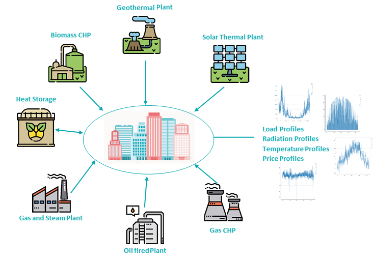

<h1><a class="anchor" id="cm-district-heating-supply-dispatch" href="#cm-district-heating-supply-dispatch"><i class="fa fa-link"></i></a>CM fjernforsyning til fjernvarme</h1><h2><a class="anchor" id="table-of-contents" href="#table-of-contents"><i class="fa fa-link"></i></a> Indholdsfortegnelse</h2><ul><li> <a href="#in-a-glance">På et øjeblik</a></li><li> <a href="#introduction">Introduktion</a></li><li> <a href="#inputs-and-outputs">Ind- og udgange</a></li><li> <a href="#method">Metode</a></li><li> <a href="#github-repository-of-this-calculation-module">GitHub-arkiv for dette beregningsmodul</a></li><li> <a href="#sample-run">Prøvekørsel</a></li><li> <a href="#how-to-cite">Hvordan man citerer</a></li><li> <a href="#authors-and-reviewers">Forfattere og korrekturlæsere</a></li><li> <a href="#license">Licens</a></li><li> <a href="#acknowledgement">Anerkendelse</a></li></ul><h2><a class="anchor" id="in-a-glance" href="#in-a-glance"><i class="fa fa-link"></i></a> På et øjeblik</h2>
 Dette modul kan køres i to tilstande: 1) forsendelse, 2) investere. I afsendelsestilstand beregner den den minimale drift af en portefølje af varmeforsyningsteknologier i et defineret fjernvarmesystem for hver time på året. Indgangene til modulet er timeprofiler for varmebehovet i netværket, for den potentielle varmeforsyning fra forskellige kilder og for energibærerpriser. Desuden kræves omkostnings- og effektivitetsparametre for hver teknologi. Modulet giver omkostningerne til varmeforsyning, andelen af anvendte energibærere og de underforståede CO2-emissioner. I investeringstilstand optimerer modulet kapaciteten af installerede varmeforsyningsteknologier til at dække varmebehovet.

 <a href="#table-of-contents"><strong><code>To Top</code></strong></a>
<h2><a class="anchor" id="introduction" href="#introduction"><i class="fa fa-link"></i></a> Introduktion</h2>
 Dette modul kan køres i to tilstande: 1) forsendelse, 2) investere. I afsendelsestilstand beregner den den minimale drift af en portefølje af varmeforsyningsteknologier i et defineret fjernvarmesystem for hver time af året. Indgangene til modulet er timeprofiler for varmebehovet i netværket, for den potentielle varmeforsyning fra forskellige kilder og for energibærerpriser. Desuden kræves omkostnings- og effektivitetsparametre for hver teknologi. Modulet giver omkostningerne til varmeforsyning, andelen af anvendte energibærere og de implicitte CO2-emissioner. I investeringstilstand optimerer modulet kapaciteten af installerede varmeforsyningsteknologier til at dække varmebehovet.

 Fjernvarmeforsyningsmodulet er en forsendelsesmodel, der forsøger at finde en omkostningsoptimal løsning til dækning af varmebehovet hver årstime.

 Metoden beskrevet her skal forstås som et første koncept og kan afvige fra den faktiske implementering (modelkompleksitet, input og output osv. Skal ses fra dette synspunkt). Denne wiki-side forklarer den version af beregningsmodul, der er integreret i værktøjskassen. En <strong>enkeltstående version</strong> af beregningsmodulet er meget mere omfattende og kan downloades fra <strong><a href="https://github.com/tuw-eeg/hotmapsDispatch">HER</a></strong> . Denne version kræver dog grundlæggende viden om python-programmering. <strong>Dokumentationen</strong> for den enkeltstående version kan findes <strong><a href="https://hotmapsdispatch.readthedocs.io/en/latest/">HER</a></strong> .

 <a href="#table-of-contents"><strong><code>To Top</code></strong></a>
<h2><a class="anchor" id="inputs-and-outputs" href="#inputs-and-outputs"><i class="fa fa-link"></i></a> Ind- og udgange</h2><h3><a class="anchor" id="main-inputs" href="#main-inputs"><i class="fa fa-link"></i></a> Hovedindgange</h3>
 Modulet kræver en lang række inputparametre. De vigtigste inputparametre er dog:
<ol><li> Varmebehov i nettet (valgt region)</li><li> Installeret kapacitet til varmegeneratorer / lager</li><li> Tekniske (effektivitetsgevinster) og økonomiske parametre (opex, capex, levetid) for varmegeneratorer / -lagre</li><li> Profiler (tidsserier for varmebehov, solstråling, temperatur, elpriser osv.)</li></ol><h3><a class="anchor" id="main-outputs" href="#main-outputs"><i class="fa fa-link"></i></a> Hovedudgange</h3>
 De vigtigste outputindikatorer for beregningsmodulet er:
<ul><li> Omkostninger til varmeproduktion</li><li> Investerings-, drifts- og brændstofomkostninger</li><li> Varmeproduktionsblanding pr. Varmegenerator</li><li> CO2-udledning</li><li> Fuld belastning timer,</li></ul>
 <strong>VIGTIG BEMÆRKNING</strong> I Hotmaps antages biomasseemissioner ikke som nul, fordi Hotmaps er et værktøj, der har til formål at understøtte den igangværende energiomstilling. At betragte biomasse som en kulstofneutral energikilde indebærer, at afbrænding af biomasse reducerer den nuværende samlede emission sammenlignet med forbrænding af fossile brændstoffer, hvilket ikke er sandt. Opbevaring af kuldioxid i træer sker over årtier, mens dens frigivelse i atmosfæren finder sted på én gang. Derfor er netto-kulstofbalancen i biomasse nul på lang sigt, men ikke på kort sigt, og klimaforandringsbegrænsende foranstaltninger er nødvendige for at bringe resultater til at reducere kulstofemissioner på kort sigt.

 <a href="#table-of-contents"><strong><code>To Top</code></strong></a>
<h2><a class="anchor" id="method" href="#method"><i class="fa fa-link"></i></a> Metode</h2>
 Modulet er implementeret som et lineært program og kan på den ene side bruges som en ren forsendelsesmodel og på den anden side til investeringsplanlægning til at dække en belastningsprofil. Den objektive funktion forsøger at finde minimumsforskellen fra omkostningerne til at levere varme og indtægter fra elproduktion.
<h3><a class="anchor" id="equation-fragments-of-the-linear-program-" href="#equation-fragments-of-the-linear-program-"><i class="fa fa-link"></i></a> Ligningsfragmenter af det lineære program:</h3>

<h4> <a class="anchor" id="the-total-costs-<code>ctotal<-sub><-code>-yield-from-the-sum-of-" href="#the-total-costs-<code>ctotal<-sub><-code>-yield-from-the-sum-of-"><i class="fa fa-link"></i></a> De samlede omkostninger <code>c total</code> udbytte fra summen af:</h4><h5> <a class="anchor" id="investment-costs-<code>ic<-code>-installed-capacities-multiplied-by-the-annuities-of-the-specific-investment-costs" href="#investment-costs-<code>ic<-code>-installed-capacities-multiplied-by-the-annuities-of-the-specific-investment-costs"><i class="fa fa-link"></i></a> investeringsomkostninger <code>IC</code> (installeret kapacitet ganget med annuiteterne for de specifikke investeringsomkostninger)</h5>

<h5> <a class="anchor" id="captial-costs-<code>cc<-code>--" href="#captial-costs-<code>cc<-code>--"><i class="fa fa-link"></i></a> fangenskabsomkostninger <code>CC</code> :</h5>

<h5> <a class="anchor" id="the-variable-costs-<code>opex<-code>--" href="#the-variable-costs-<code>opex<-code>--"><i class="fa fa-link"></i></a> de variable omkostninger <code>OPEX</code> :</h5>

<h5><a class="anchor" id="ramp-costs-of-chp-and-waste-incineration-plants-rough-estimation--" href="#ramp-costs-of-chp-and-waste-incineration-plants-rough-estimation--"><i class="fa fa-link"></i></a> rampeomkostninger for kraftvarmeværker og affaldsforbrændingsanlæg (grov estimering):</h5>

<h5><a class="anchor" id="assumed-costs-for-the-peak-electrical-load-in-the-winter-time-rough-estimation-" href="#assumed-costs-for-the-peak-electrical-load-in-the-winter-time-rough-estimation-"><i class="fa fa-link"></i></a> antagne omkostninger for den maksimale elektriske belastning om vinteren (grov skøn):</h5>

<h4> <a class="anchor" id="the-total-revenues-<code>revtotal<-sub><-code>-yield-from--" href="#the-total-revenues-<code>revtotal<-sub><-code>-yield-from--"><i class="fa fa-link"></i></a> De samlede indtægter <code>rev total</code> udbytte fra ::</h4><h5><a class="anchor" id="the-sale-of-electricity-for-example-from-chp-plants-and-waste-incineration-plants.-" href="#the-sale-of-electricity-for-example-from-chp-plants-and-waste-incineration-plants.-"><i class="fa fa-link"></i></a> salg af elektricitet (f.eks. fra kraftvarmeværker og affaldsforbrændingsanlæg) .:</h5>

 <a href="#table-of-contents"><strong><code>To Top</code></strong></a>
<h4><a class="anchor" id="legend" href="#legend"><i class="fa fa-link"></i></a> Legende</h4>

 <a href="#table-of-contents"><strong><code>To Top</code></strong></a>
<h2><a class="anchor" id="github-repository-of-this-calculation-module" href="#github-repository-of-this-calculation-module"><i class="fa fa-link"></i></a> GitHub-lager af dette beregningsmodul</h2>
 <a href="https://github.com/HotMaps/dispatch_module/tree/develop">Her</a> får du banebrydende udvikling for dette beregningsmodul.

 <a href="#table-of-contents"><strong><code>To Top</code></strong></a>
<h2><a class="anchor" id="sample-run" href="#sample-run"><i class="fa fa-link"></i></a> Prøvekørsel</h2>
 Når du har valgt en region og ikke foretager ændringer i standardparametrene, kører modellen i investeringstilstand. Dette betyder, at de installerede kapaciteter også er optimeret til den optimale omkostningsdækning af varmebehovet.

 Nedenfor kan du se alle inputparametre, der kan ændres
<h4><a class="anchor" id="output-indicators" href="#output-indicators"><i class="fa fa-link"></i></a> Outputindikatorer</h4><h4><a class="anchor" id="output-charts" href="#output-charts"><i class="fa fa-link"></i></a> Output-diagrammer</h4>
 <a href="#table-of-contents"><strong><code>To Top</code></strong></a>
<h2><a class="anchor" id="how-to-cite" href="#how-to-cite"><i class="fa fa-link"></i></a> Hvordan man citerer</h2>
 Jeton Hasani, i Hotmaps Wiki, CM Fjernvarmeforsyning (september 2020)

 <a href="#table-of-contents"><strong><code>To Top</code></strong></a>
<h2><a class="anchor" id="authors-and-reviewers" href="#authors-and-reviewers"><i class="fa fa-link"></i></a> Forfattere og korrekturlæsere</h2>
 Denne side er skrevet af Jeton Hasani ( <strong><a href="https://eeg.tuwien.ac.at/">EEG - TU Wien</a></strong> ).

 ☑ Denne side blev gennemgået af Mostafa Fallahnejad ( <strong><a href="https://eeg.tuwien.ac.at/">EEG - TU Wien</a></strong> ).

 <a href="#table-of-contents"><strong><code>To Top</code></strong></a>
<h2><a class="anchor" id="license" href="#license"><i class="fa fa-link"></i></a> Licens</h2>
 Ophavsret © 2016-2020: Jeton Hasani

 Creative Commons Attribution 4.0 International licens

 Dette arbejde er licenseret under en Creative Commons CC BY 4.0 International licens.

 SPDX-licensidentifikator: CC-BY-4.0

 Licens-tekst: https://spdx.org/licenses/CC-BY-4.0.html

 <a href="#table-of-contents"><strong><code>To Top</code></strong></a>
<h2><a class="anchor" id="acknowledgement" href="#acknowledgement"><i class="fa fa-link"></i></a> Anerkendelse</h2>
 Vi vil gerne formidle vores dybeste påskønnelse til Horizon 2020 <a href="https://www.hotmaps-project.eu">Hotmaps-projektet</a> (tilskudsaftale nummer 723677), som gav finansieringen til at gennemføre den nuværende undersøgelse.

 <a href="#table-of-contents"><strong><code>To Top</code></strong></a>

<!--- THIS IS A SUPER UNIQUE IDENTIFIER -->

This page was automatically translated. View in another language:

[English](../en/CM-District-heating-supply-dispatch) (original) [Bulgarian](../bg/CM-District-heating-supply-dispatch)\* [Czech](../cs/CM-District-heating-supply-dispatch)\*  [German](../de/CM-District-heating-supply-dispatch)\* [Greek](../el/CM-District-heating-supply-dispatch)\* [Spanish](../es/CM-District-heating-supply-dispatch)\* [Estonian](../et/CM-District-heating-supply-dispatch)\* [Finnish](../fi/CM-District-heating-supply-dispatch)\* [French](../fr/CM-District-heating-supply-dispatch)\* [Irish](../ga/CM-District-heating-supply-dispatch)\* [Croatian](../hr/CM-District-heating-supply-dispatch)\* [Hungarian](../hu/CM-District-heating-supply-dispatch)\* [Italian](../it/CM-District-heating-supply-dispatch)\* [Lithuanian](../lt/CM-District-heating-supply-dispatch)\* [Latvian](../lv/CM-District-heating-supply-dispatch)\* [Maltese](../mt/CM-District-heating-supply-dispatch)\* [Dutch](../nl/CM-District-heating-supply-dispatch)\* [Polish](../pl/CM-District-heating-supply-dispatch)\* [Portuguese (Portugal, Brazil)](../pt/CM-District-heating-supply-dispatch)\* [Romanian](../ro/CM-District-heating-supply-dispatch)\* [Slovak](../sk/CM-District-heating-supply-dispatch)\* [Slovenian](../sl/CM-District-heating-supply-dispatch)\* [Swedish](../sv/CM-District-heating-supply-dispatch)\* 

\* machine translated
