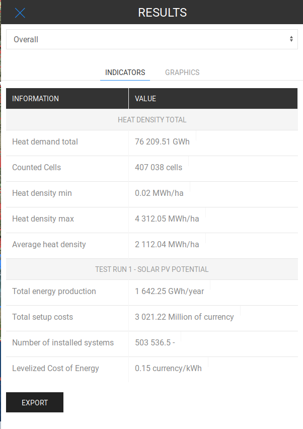

<h1><a class="anchor" id="cm-solar-thermal-and-pv-potential" href="#cm-solar-thermal-and-pv-potential"><i class="fa fa-link"></i></a>CM Solar termisk og PV potentiale</h1><h2><a class="anchor" id="table-of-contents" href="#table-of-contents"><i class="fa fa-link"></i></a> Indholdsfortegnelse</h2><ul><li> <a href="#in-a-glance">På et øjeblik</a></li><li> <a href="#introduction">Introduktion</a></li><li> <a href="#inputs-and-outputs">Ind- og udgange</a></li><li> <a href="#method">Metode</a><ul><li> <a href="#method_example">Eksempel</a></li></ul></li><li> <a href="#github-repository-of-this-calculation-module">GitHub-lager af dette beregningsmodul</a></li><li> <a href="#sample-run">Prøvekørsel</a><ul><li> <a href="#sample-run_test-run-1-default-input-values">Testkørsel 1: standard inputværdier</a></li><li> <a href="#sample-run_test-run-2-modified-input-values">Testkørsel 2: ændrede inputværdier</a></li></ul></li><li> <a href="#how-to-cite">Hvordan man citerer</a></li><li> <a href="#authors-and-reviewers">Forfattere og korrekturlæsere</a></li><li> <a href="#license">Licens</a></li><li> <a href="#acknowledgement">Anerkendelse</a></li></ul><h2><a class="anchor" id="in-a-glance" href="#in-a-glance"><i class="fa fa-link"></i></a> På et øjeblik</h2>
 Dette modul beregner energiforsyningspotentialet og relaterede omkostninger til taginstallerede solvarme- og solcelleanlæg i et defineret område. Indgangene til modulet er rasterfiler med bygningsfodaftryk og solbestråling, omkostninger og effektivitet for reference solvarme og solcelleanlæg og brøkdelene af et brugbart tagområde, hvor der er installeret solvarme og solcelleanlæg.

 <a href="#table-of-contents"><strong><code>To Top</code></strong></a>
<h2><a class="anchor" id="introduction" href="#introduction"><i class="fa fa-link"></i></a> Introduktion</h2>
 Beregningsmodulet sigter mod at beregne solvarmepotentialet og det fotovoltaiske energipotentiale og den økonomiske gennemførlighed af et valgt område ved at overveje:
<ul><li> installation af nye solvarme / solcelleanlæg på en procentdel af de tilgængelige arealer (standardområdet er bygningens fodaftryk)</li><li> vurdere den økonomiske gennemførlighed af nye anlæg.</li></ul>
 <a href="#table-of-contents"><strong><code>To Top</code></strong></a>
<h2><a class="anchor" id="inputs-and-outputs" href="#inputs-and-outputs"><i class="fa fa-link"></i></a> Ind- og udgange</h2>
 Inputparametrene og lagene samt outputlagene og parametrene er som følger.

 <strong>Inputlag og parametre er:</strong>
<ul><li> rasterfil:<ul><li> gennemsnitlig årlig solbestråling [kWh / m 2 ],</li><li> med det tilgængelige område til solenergiudnyttelse. Standardrasteren bruger rasterfilen til bygningens fodaftryk [m 2 ],</li></ul></li><li> procentdel af tilgængeligt areal, der kan dækkes med solpaneler [%],</li><li> referenceanlægsparametre:<ul><li> gennemsnitlig installeret spidseffekt pr. anlæg [kW_p],</li><li> systemeffektivitet, værdi mellem 0 og 1 [-],</li><li> solstrålingen ved standard testbetingelse er lig med 1 kW / m 2 ,</li><li> moduleffektivitet ved standard testbetingelser [kW m 2 ].</li></ul></li></ul>
 <strong>Outputlag og parametre er:</strong>
<ul><li> Samlede omkostninger ved at dække det valgte område med solcellepaneler [valuta]</li><li> Samlet årlig energiproduktion [MWh / år]</li><li> Udjævnede energiomkostninger [€ / kWh]</li><li> Rasterfil med de mest egnede områder til PV-energiproduktion</li></ul>
 <a href="#table-of-contents"><strong><code>To Top</code></strong></a>
<h2><a class="anchor" id="method" href="#method"><i class="fa fa-link"></i></a> Metode</h2>
 Med udgangspunkt i det tilgængelige område og typen PV-teknologi beregner modulet PV-energiproduktionen under følgende antagelser:
<ul><li> Optimal hældning af solcelleanlægget</li><li> Arealet af solcellemodulerne svarer til den procentdel af bygningens fodaftryk, som brugeren har valgt;</li><li> Unik valgt teknologi til alle installerede solcelleanlæg;</li><li> Standard systemeffektivitet lig med 0,75.</li></ul>
 Disse antagelser er gjort for at overveje en planlægningsfase for en region og ikke designet af et specifikt solcelleanlæg.

 Den årlige energiproduktion stammer fra den rumlige fordeling af årlig solstråling på bygningens fodaftryk. Produktion af solcelleanlæg beregnes for et enkelt repræsentativt anlæg. Den mest repræsentative installerede spidseffekt til et PV-system er en indgang fra modulet. Derfor beregnes overfladen, der er dækket af en enkelt plante, og det samlede antal planter.

 Endelig beregnes det mest egnede område ved at overveje tagene med højere energiproduktion. Energiproduktionen for hver pixel overvejer kun at dække en brøkdel af tagene lig med f_oft. Integralet af energiproduktionen i det mest egnede område er lig med den samlede energiproduktion i det valgte område.

 <a href="#table-of-contents"><strong><code>To Top</code></strong></a>
<h3><a class="anchor" id="example" href="#example"><i class="fa fa-link"></i></a> Eksempel</h3>
 For at give et praktisk eksempel anvendes CM-logikken / -metoden til et foruddefineret område. Som standard er det inputområde, vi bruger, bygningernes fodaftryk. Så for eksempel byen Bolzano (Italien), da en stor del af byen er det historiske centrum (hvor det ikke er muligt at installere solpaneler), kan vi estimere, at kun 1 tag hver 5. kan bruges til at opsamle solenergi (~ 20%). I stedet for, hvis du angiver et område, som det er tilgængeligt til at implementere noget solfelt, kan du indstille 100% af det område, der kan bruges til solsystemet.

 Hvilket areal på de 20% af tagene i Bolzano kan dækkes af solcellepaneler? Dækning af hele taget er ikke realistisk, da en del af taget ikke har passende retning. Da bygningen generelt har 4 sider, kan vi forestille os, at omkring 25% af taget har en god retning (i det mindste i Bolzano, hvor de fleste af tagene ikke er plane og har 2 eller 4 taghældninger). Ikke desto mindre har vi skyggeeffekter fra de omkringliggende træer, bygninger, bjerge osv., Og generelt efterlader vi noget plads tæt på taggrænsen, så lad os forestille os, at 50% af det godt orienterede tag kan bruges af PV (25 % * 50% = 12,5%), standardværdien er lidt mere optimistisk (15%).

 I tilfælde af et solfelt optager PV-strengen generelt omkring 40-50% af arealet for at undgå skyggeeffekten mellem PV-strenge.

 <a href="#table-of-contents"><strong><code>To Top</code></strong></a>
<h4><a class="anchor" id="example-with-a-pv-system-on-a-building-footprint" href="#example-with-a-pv-system-on-a-building-footprint"><i class="fa fa-link"></i></a> Eksempel med et solcelleanlæg på et bygnings fodaftryk</h4>
 For eksempel forklarer vi metoden for en enkelt pixel (1 hektar areal). CM anvender den samme logik for hver pixel i det område, som brugeren har valgt. Standardlaget (bygningens fodaftryk) har en pixeldimension på 100x100m, derfor har vi en tilgængelig overflade på 10000 m². Forestil dig for dette eksempel, at der kun er 3000 m² tag til rådighed i pixlen, den anden manglende del af overfladen er overflade dedikeret til ruter, grønne områder, flod osv. Logikken implementeret af CM er:
<ul><li> anvende den første procentdel for kun at få tagene, som jeg kan være vært for systemet: <code>available_surface = 3000 [m²] * 20% = 600 [m²]</code></li><li> Overfladen, der virkelig kan dækkes af solcelleanlæg, anslås til at være 12,5%, derfor: <code>available_pv_surface = 600 [m²] * 12.5% = 75 [m²]</code></li><li> Derefter bruger vi oplysningerne om solcelleeffektivitet (som standard 0,15) til at beregne den overflade, der kræves for at have et enkelt solcelleanlæg (som standard 3 kWp) <code>single_pv_surface = 3 [kWp] / 0.15 = 20 [m²]</code></li><li> så beregner vi antallet af solcelleanlæg, der kan installeres i pixlen, der er: <code>n_pv_plants = 75 [m²] // 20 [m²] = 3</code> og derfor har vi 3 anlæg på 3 KWp installeret på pixlen 100 ved 100 m (så 9 kWp), og derefter multiplicerer vi denne værdi med den energi, der produceres med 1 kWp og ganges med effektiviteten af solcelleanlæggene (inverter og transmission, som standard: 0,85) for at opnå den samlede energi produceret af pixlen: <code>pv_energy = solar_radiation [kWh/kWp/year] * 9 [kWp] * 0.85</code></li></ul>
 <a href="#table-of-contents"><strong><code>To Top</code></strong></a>
<h4><a class="anchor" id="example-with-a-solar-pv-field" href="#example-with-a-solar-pv-field"><i class="fa fa-link"></i></a> Eksempel med et solcelleanlæg</h4>
 Nu har vi en pixel på 100x100m, som den er tilgængelig til et PV-feltsystem:
<ul><li> som sagt før er den første procentdel 100%, da hele området kan være vært for PV-systemet: <code>available_surface = (100 x 100) [m²] * 100% = 10000 [m²]</code></li><li> Overfladen, der kan dækkes af solcelleanlæg, er: <code>available_pv_surface = 10000 m² * 50% = 5000 m²</code></li><li> Derefter bruger vi oplysningerne om solcelleeffektivitet (som standard 0,15) til at beregne den overflade, der kræves for at have et enkelt solcelleanlæg (som standard 3 kWp) <code>single_pv_surface = 3 [kWp] / 0.15 = 20 [m²]</code></li><li> så beregner vi antallet af systemer, der kan installeres i pixlen, der er: <code>n_pv_plants = 5000 // 20 = 250</code> og derfor har vi 250 anlæg på 3 KWp installeret på pixlen 100 x 100 m (så 750 kWp), og så multiplicerer vi denne værdi med timenergien produceret med 1 kWp og ganget med effektiviteten af solcelleanlæggene (inverter og transmission, som standard: 0,85) for at opnå den samlede energi produceret af pixlen: <code>pv_energy = solar_radiation [kWh/kWp/year] * 750 kWp * 0.85</code></li></ul>
 <a href="#table-of-contents"><strong><code>To Top</code></strong></a>
<h4><a class="anchor" id="example-with-a-pv-&amp;-st-system-on-a-building-footprint" href="#example-with-a-pv-&amp;-st-system-on-a-building-footprint"><i class="fa fa-link"></i></a> Eksempel med et PV &amp; ST-system på et bygnings fodaftryk</h4>
 Bygningsoverfladen, der kan bruges, er en begrænset ressource. Derfor er det ikke muligt at bruge den samme overflade til at opsamle solenergi med et solcelleanlæg og samtidig bruge et solvarmesystem. Når vi husker det foregående eksempel, har vi allerede 75 m² overflade dedikeret til solceller, vi vurderede, at det godt orienterede tag tegner sig for 25% af den samlede overflade, og derfor har vi stadig andre 75 [m²] til rådighed. Vi kan kun bruge en brøkdel, lad os sige, at 7,5%. Dette betyder, at hvis vi før vi overvejer en 25% af taget med en god udstilling, overvejer vi, at 12,5% er dedikeret til solceller og 7,5 er dedikeret til ST, og derfor bruger vi 20% af de 25%.

 Så for at give et praktisk eksempel:
<ul><li> anvende den første procentdel for kun at få tagene, som jeg kan være vært for systemet: <code>available_surface = 3000 [m²] * 20% = 600 [m²]</code></li><li> Overfladen, der virkelig kan dækkes af ST-systemer, er: 600 m² * 7,5% = 67,5 m² <code>available_st_surface = 600 [m²] * 7.5% = 45 [m²]</code> bemærk, at <code>75 + 45 = 120 [m²]</code> at den er mindre end estimeret overflade, der kan have en god eksponering ( <code>available_surface * 25% = 150 [m²]</code> ).</li><li> Derefter bruger vi oplysningerne om ST-overfladen, der kræves af et ST-system (som standard 5 m²) til at beregne antallet af ST-planter: <code>n_st_plants = 45 [m²] // 5 [m²] = 9</code></li><li> derefter beregner vi den installerede overflade af ST-planter: st_surface = 9 * 5 m² = 45 [m²] `</li><li> og nu anvender vi den globale solstråling (kWh / m²) af den overdækkede overflade af effektiviteten af ST-panelerne (som standard 0,85): <code>solar_radiation [kWh/m²] * 45 [m²] * 0.85</code></li></ul>
 <a href="#table-of-contents"><strong><code>To Top</code></strong></a>
<h2><a class="anchor" id="github-repository-of-this-calculation-module" href="#github-repository-of-this-calculation-module"><i class="fa fa-link"></i></a> GitHub-lager af dette beregningsmodul</h2>
 <a href="https://github.com/HotMaps/solar_potential/tree/develop">Her</a> får du banebrydende udvikling for dette beregningsmodul.

 <a href="#table-of-contents"><strong><code>To Top</code></strong></a>
<h2><a class="anchor" id="test-run-1" href="#test-run-1"><i class="fa fa-link"></i></a> Testkørsel 1</h2>
 Her køres beregningsmodulet for Lombardiet-regionen i Italien (NUTS2).
<ul><li> Vælg først Nuts2 og det valgte område.</li></ul> Fig. 1: Vælg en region<ul><li>
 Følg trinene som vist i nedenstående figur:
<ul><li> Klik på knappen &quot;Lag&quot; for at åbne vinduet &quot;Lag&quot;:</li><li> Klik på fanen &quot;BEREGNINGSMODUL&quot;.</li><li> Klik på knappen &quot;SOLAR PV POTENTIAL&quot;.</li></ul></li><li>
 Nu åbner &quot;Solar PV Potential&quot; og er klar til at køre.
</li></ul>
 <a href="#table-of-contents"><strong><code>To Top</code></strong></a>
<h2><a class="anchor" id="sample-run" href="#sample-run"><i class="fa fa-link"></i></a> Prøvekørsel</h2><h3><a class="anchor" id="test-run-1--default-input-values" href="#test-run-1--default-input-values"><i class="fa fa-link"></i></a> Testkørsel 1: standard inputværdier</h3>
 Standardindgangsværdierne overvejer muligheden for at installere tagmonterede solcellepaneler på bygninger. Disse værdier henviser til et anlæg på 3 kWp. Du skal muligvis indstille værdier under eller under standardværdier i betragtning af yderligere lokale overvejelser og omkostninger. Derfor bør brugeren tilpasse disse værdier for at finde den bedste kombination af tærskler til hans / hendes casestudie.

 Følg de næste trin for at køre beregningsmodulet:
<ul><li> Tildel et navn til kørselssessionen (valgfri - her valgte vi &quot;Testkørsel 1&quot;) og indstil inputparametrene (her blev standardværdier brugt).</li></ul><ul><li> Vent, indtil processen er afsluttet.</li><li> Som output vises indikatorer og diagrammer i vinduet &quot;RESULTATER&quot;. Indikatorerne viser:<ul><li> Samlet energiproduktion,</li><li> Samlede installationsomkostninger,</li><li> Antal installerede systemer</li><li> Udjævnede energiomkostninger.</li></ul></li></ul><ul><li> Der tilføjes også et nyt lag til lærredet, der viser bygninger med højere energipotentiale. Dette lag føjes til listen over lag under kategorien &quot;Beregningsmodul&quot;. Kørssessionsnavnet adskiller output fra denne kørsel fra andre. Hvis du fravælger standardlagene og vælger TEST KØR 1, kan du visualisere de mest egnede områder til installationer af solcelleanlæg.</li></ul>
 <a href="#table-of-contents"><strong><code>To Top</code></strong></a>
<h3><a class="anchor" id="test-run-2--modified-input-values" href="#test-run-2--modified-input-values"><i class="fa fa-link"></i></a> Testkørsel 2: ændrede inputværdier</h3>
 Afhængigt af din erfaring og lokal viden kan du øge eller formindske inputværdierne for at opnå bedre resultater. Du kan beslutte at øge bygningens overflade, der er velegnet til solcelleanlæg.
<ul><li>
 Tildel et navn til kørselssessionen (valgfrit - her valgte vi &quot;Testkørsel 2&quot;), og indstil inputparametrene Procentdel af bygninger med solpaneler svarende til 50. Det betyder, at vi dækker 50% af de tilgængelige bygningstage. Bemærk, at da hver pixel kan repræsentere mere end en bygning, og vi ikke dækker hele taget med solcelleanlæg, kan brugeren også indstille effektiv brugsfaktor for bygningstage. Standardværdien er indstillet til 0,15. Dette betyder, at kun 15% af tagoverfladen i en pixel er dækket af solcellepaneler.
</li><li>
 Vent, indtil processen er afsluttet.
</li><li>
 Som output vises indikatorer og diagrammer i vinduet &quot;RESULTATER&quot;. Indikatorerne viser:
<ul><li> Samlet energiproduktion,</li><li> Samlede installationsomkostninger,</li><li> Antal installerede systemer</li><li> Udjævnede energiomkostninger.</li></ul></li></ul>
 <a href="#table-of-contents"><strong><code>To Top</code></strong></a>
<h2><a class="anchor" id="how-to-cite" href="#how-to-cite"><i class="fa fa-link"></i></a> Hvordan man citerer</h2>
 Giulia Garegnani, i Hotmaps-Wiki, CM-Solar-PV-potentiale (april 2019)

 <a href="#table-of-contents"><strong><code>To Top</code></strong></a>
<h2><a class="anchor" id="authors-and-reviewers" href="#authors-and-reviewers"><i class="fa fa-link"></i></a> Forfattere og korrekturlæsere</h2>
 Denne side er skrevet af Giulia Garegnani ( <strong><a href="http://www.eurac.edu">EURAC</a></strong> ).

 ☑ Denne side blev gennemgået af Mostafa Fallahnejad ( <strong><a href="https://eeg.tuwien.ac.at/">EEG - TU Wien</a></strong> ).

 <a href="#table-of-contents"><strong><code>To Top</code></strong></a>
<h2><a class="anchor" id="license" href="#license"><i class="fa fa-link"></i></a> Licens</h2>
 Ophavsret © 2016-2020: Giulia Garegnani

 Creative Commons Attribution 4.0 International licens

 Dette arbejde er licenseret under en Creative Commons CC BY 4.0 International licens.

 SPDX-licensidentifikator: CC-BY-4.0

 Licens-tekst: https://spdx.org/licenses/CC-BY-4.0.html

 <a href="#table-of-contents"><strong><code>To Top</code></strong></a>
<h2><a class="anchor" id="acknowledgement" href="#acknowledgement"><i class="fa fa-link"></i></a> Anerkendelse</h2>
 Vi vil gerne formidle vores dybeste påskønnelse til Horizon 2020 <a href="https://www.hotmaps-project.eu">Hotmaps-projektet</a> (tilskudsaftale nummer 723677), som gav finansieringen til at gennemføre den nuværende undersøgelse.

 <a href="#table-of-contents"><strong><code>To Top</code></strong></a>

<!--- THIS IS A SUPER UNIQUE IDENTIFIER -->

This page was automatically translated. View in another language:

[English](../en/CM-Solar-thermal-and-PV-potential) (original) [Bulgarian](../bg/CM-Solar-thermal-and-PV-potential)\* [Czech](../cs/CM-Solar-thermal-and-PV-potential)\*  [German](../de/CM-Solar-thermal-and-PV-potential)\* [Greek](../el/CM-Solar-thermal-and-PV-potential)\* [Spanish](../es/CM-Solar-thermal-and-PV-potential)\* [Estonian](../et/CM-Solar-thermal-and-PV-potential)\* [Finnish](../fi/CM-Solar-thermal-and-PV-potential)\* [French](../fr/CM-Solar-thermal-and-PV-potential)\* [Irish](../ga/CM-Solar-thermal-and-PV-potential)\* [Croatian](../hr/CM-Solar-thermal-and-PV-potential)\* [Hungarian](../hu/CM-Solar-thermal-and-PV-potential)\* [Italian](../it/CM-Solar-thermal-and-PV-potential)\* [Lithuanian](../lt/CM-Solar-thermal-and-PV-potential)\* [Latvian](../lv/CM-Solar-thermal-and-PV-potential)\* [Maltese](../mt/CM-Solar-thermal-and-PV-potential)\* [Dutch](../nl/CM-Solar-thermal-and-PV-potential)\* [Polish](../pl/CM-Solar-thermal-and-PV-potential)\* [Portuguese (Portugal, Brazil)](../pt/CM-Solar-thermal-and-PV-potential)\* [Romanian](../ro/CM-Solar-thermal-and-PV-potential)\* [Slovak](../sk/CM-Solar-thermal-and-PV-potential)\* [Slovenian](../sl/CM-Solar-thermal-and-PV-potential)\* [Swedish](../sv/CM-Solar-thermal-and-PV-potential)\* 

\* machine translated
