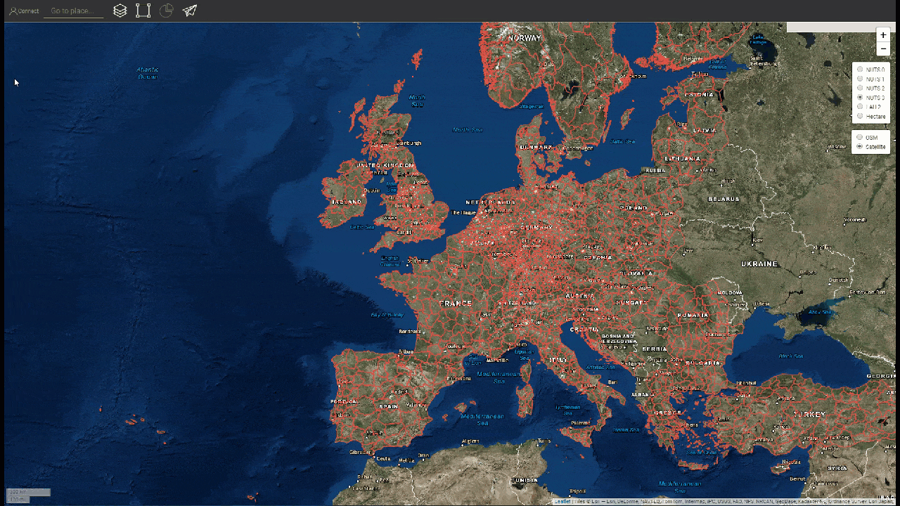

<h1><a class="anchor" id="introduction-to-user-interface" href="#introduction-to-user-interface"><i class="fa fa-link"></i></a>Introduktion til brugergrænseflade</h1><h2><a class="anchor" id="table-of-contents" href="#table-of-contents"><i class="fa fa-link"></i></a> Indholdsfortegnelse</h2><ul><li>
 <a href="#introduction-page">Introduktionsside</a>
</li><li>
 <a href="#upper-toolbar">Øvre værktøjslinje</a>
<ul><li> <a href="#upper-toolbar_connect">Opret forbindelse</a><ul><li> <a href="#upper-toolbar_connect_login">Log på</a></li><li> <a href="#upper-toolbar_connect_register">Tilmeld</a></li><li> <a href="#upper-toolbar_connect_recover">Gendanne</a></li></ul></li><li> <a href="#upper-toolbar_go-to-place">Gå til sted</a></li><li> <a href="#upper-toolbar_layers">Lag</a></li><li> <a href="#upper-toolbar_selection-tools">Markeringsværktøjer</a></li><li> <a href="#upper-toolbar_show-result">Vis resultat</a></li><li> <a href="#upper-toolbar_feedback">Feedback</a></li><li> <a href="#upper-toolbar_save-session">Gem session</a></li><li> <a href="#upper-toolbar_save-session-folder">Gem sessionsmappe</a></li></ul></li><li>
 <a href="#tiles">Fliser</a>
</li><li>
 <a href="#how-to-cite">Hvordan man citerer</a>
</li><li>
 <a href="#authors-and-reviewers">Forfattere og korrekturlæsere</a>
</li><li>
 <a href="#license">Licens</a>
</li><li>
 <a href="#acknowledgement">Anerkendelse</a>
</li></ul><h2><a class="anchor" id="introduction-page" href="#introduction-page"><i class="fa fa-link"></i></a> Introduktionsside</h2>
 Når værktøjskassen er åbnet, vises ansvarsfraskrivelsessiden. Udover ansvarsfraskrivelsesmeddelelsen gives yderligere oplysninger om understøttede browsere, målene for Hotmaps-projektet, linket til Hotmaps-projektets websted og datalagre.

 <em>Fig. 1 Kort introduktion til Hotmaps værktøjskasse</em>

 Hotmaps GUI er en GIS-baseret grænseflade. Ved at lukke ansvarsfraskrivelsessiden ser brugeren kortet over Europa. Som standard er varmebehovstæthedskortet over EU-28-lande og NUTS 2-grænser vist. Ud over disse to kort kan nogle værktøjer og knapper ses i GUI. Disse værktøjer er illustreret i den følgende figur.

 <em>Fig. 2 Indledende side</em>

 Her kan du ved første øjekast se 3 dele af brugergrænsefladen:
<ol><li> <a href="#upper-toolbar">en værktøjslinje øverst til venstre</a> ,</li><li> selve kortet,</li><li> <a href="#tiles">nogle værktøjer til at ændre kortets stil</a> .</li><li> to links øverst til højre: til denne <a href="https://wiki.hotmaps.eu/">Hotmaps Wiki</a> og til <a href="https://www.hotmaps-project.eu/">Hotmaps Project-webstedet</a> .</li></ol>
 I de følgende kapitler forklares de første 3 punkter detaljeret.

 <a href="#table-of-contents"><strong><code>To Top</code></strong></a>
<h2><a class="anchor" id="upper-toolbar" href="#upper-toolbar"><i class="fa fa-link"></i></a> Øvre værktøjslinje</h2>

 Med denne værktøjslinje kan du:
<ol><li> <a href="#upper-toolbar_connect"><em>Opret forbindelse:</em></a> registrer dig og log ind på webapplikationen for at gemme dit arbejde,</li><li> <a href="#upper-toolbar_go-to-place"><em>Gå til sted:</em></a> zoom ind på en bestemt region ved at skrive navnet,</li><li> <a href="#upper-toolbar_layers"><em>Lag:</em></a> Vis sidebjælken for laget,</li><li> <a href="#upper-toolbar_selection-tools"><em>Markeringsværktøjer</em> :</a> aktiver eller deaktiver markeringsværktøjerne,</li><li> <a href="#upper-toolbar_show-result"><em>Vis resultat:</em></a> vis resultatsidebjælken for dine valgte regioner,</li><li> <a href="#upper-toolbar_feedback"><em>Feedback:</em></a> Giv os feedback om værktøjet,</li><li> <a href="#upper-toolbar_save-session"><em>Gem session:</em></a> du kan gemme valgte lag og zoomniveau og huske dem senere et,</li><li> <a href="#upper-toolbar_save-session-folder"><em>Gem sessionsmappe:</em></a> hvor du kan se listen over alle gemte sessioner.</li></ol>
 <a href="#table-of-contents"><strong><code>To Top</code></strong></a>
<h3><a class="anchor" id="connect" href="#connect"><i class="fa fa-link"></i></a> Opret forbindelse</h3>
 Her kan du:
<ul><li> Opret en konto</li><li> Log ind på din konto for at gemme dine fremskridt</li><li> Eller nulstil din adgangskode, hvis du glemmer den</li></ul>
 <a href="#table-of-contents"><strong><code>To Top</code></strong></a>
<h4><a class="anchor" id="login" href="#login"><i class="fa fa-link"></i></a> Log på</h4>
 Efter <a href="#register">registrering</a> og aktivering af din konto skal du kunne logge ind med din e-mail og adgangskode (se <a href="#fig4">figur 4</a> nedenfor).

 <em>Fig.4 .: Loginformular</em>

 <a href="#table-of-contents"><strong><code>To Top</code></strong></a>
<h4><a class="anchor" id="register" href="#register"><i class="fa fa-link"></i></a> Tilmeld</h4>
 Her kan du oprette en konto til <em>hotmaps-</em> webstedet. Efter indsendelse af <a href="#fig5">formularen</a> modtager du en e-mail til aktivering af din konto. Med din konto kan du gemme dine fremskridt.

 <em>Fig.5 .: Registreringsformular</em>

 <a href="#table-of-contents"><strong><code>To Top</code></strong></a>
<h4><a class="anchor" id="recover" href="#recover"><i class="fa fa-link"></i></a> Gendanne</h4>
 Hvis du nogensinde glemmer din adgangskode, kan du gendanne den under denne menu (se <a href="#fig6">figur 6</a> nedenfor). Vær opmærksom på at indstille en ny adgangskode bagefter.

 <em>Fig.6 .: Gendan form</em>

 <a href="#table-of-contents"><strong><code>To Top</code></strong></a>
<h3><a class="anchor" id="go-to-place" href="#go-to-place"><i class="fa fa-link"></i></a> Gå til sted</h3>
 Du kan zoome til et bestemt område ved at skrive dets navn (se animation nedenfor)

 <a href="#table-of-contents"><strong><code>To Top</code></strong></a>
<h3><a class="anchor" id="layers" href="#layers"><i class="fa fa-link"></i></a> Lag</h3>
 Ved at trykke på denne knap vises et sidebjælke med forskellige slags lag til venstre.

 Følgende lag kan findes og visualiseres:

 <a href="#table-of-contents"><strong><code>To Top</code></strong></a>
<h3><a class="anchor" id="selection-tools" href="#selection-tools"><i class="fa fa-link"></i></a> Markeringsværktøjer</h3>
 Ved at trykke på denne knap vises markeringsværktøjerne til venstre på skærmen

 Figuren nedenfor viser udseendet af værktøjerne:

<ol><li> Værktøj til valg af regioner</li><li> Opret en brugerdefineret firkantet region</li><li> Opret en tilpasset cirkelregion</li><li> Opret en brugerdefineret polygonregion</li><li> Upload et GeoJSON-objekt for at bruge et tilpasset områdevalg</li></ol><ol type="A"><li> viser, hvor mange regioner du har valgt</li><li> viser den samlede overflade af den mindste rektangule, der kan dække det valgte område</li><li> viser skalaen, du valgte fra højre værktøjslinje</li></ol><ol type="a"><li> knap til at indlæse resultaterne af din valgte region og valgte lag</li><li> knap til sletning af en valgt region</li></ol>
 <a href="#table-of-contents"><strong><code>To Top</code></strong></a>
<h3><a class="anchor" id="show-result" href="#show-result"><i class="fa fa-link"></i></a> Vis resultat</h3>
 Afhængigt af de lag og region, du har valgt, vises resultaterne til din konfiguration i et sidebjælke til højre på din skærm

 <a href="#table-of-contents"><strong><code>To Top</code></strong></a>
<h3><a class="anchor" id="feedback" href="#feedback"><i class="fa fa-link"></i></a> Feedback</h3>
 Har du nogle forslag til, hvordan du forbedrer værktøjet? Har du bemærket nogen fejl? Vær venlig at informere os! Ved at give os feedback kan du hjælpe os med at forbedre værktøjskassen!

 Udfyld nedenstående <a href="#Fig7">formular</a> :

 <a href="#table-of-contents"><strong><code>To Top</code></strong></a>

 du kan vælge mellem følgende typer:

 og sæt en prioritet:

 <a href="#table-of-contents"><strong><code>To Top</code></strong></a>
<h3><a class="anchor" id="save-session" href="#save-session"><i class="fa fa-link"></i></a> Gem session</h3>
 du kan lave et øjebliksbillede af dit arbejde (udvalgte områder og lag, zoomniveauer osv.) ved at trykke på denne knap. Du kan også definere et navn og en beskrivelse af snapshotet.
<h3><a class="anchor" id="save-session-folder" href="#save-session-folder"><i class="fa fa-link"></i></a> Gem sessionsmappe</h3>
 Her ser du alle dine snapshots med deres navne og beskrivelse. Når du vælger et, indlæses de valgte lag, områder, zoomniveau og anden konfiguration.
<h2><a class="anchor" id="tiles" href="#tiles"><i class="fa fa-link"></i></a> Fliser</h2>
 Du kan vælge den territoriale skala, som du vil analysere (NUTS-regioner eller hektarniveau) og indstille flisen på kortet

 Der er følgende konfigurationer mulige

<ol><li> Zoom ind og zoom ud på kortet</li><li> Vis NUTS-grænserne for at vælge bestemte NUTS-regioner, eller brug hektar til at tilpasse dit <a href="#upper-toolbar_selection-tools">valg</a></li><li> Brug OpenStreetMap-fliser eller Satelite-fliser</li></ol>
 <a href="#table-of-contents"><strong><code>To Top</code></strong></a>
<h2><a class="anchor" id="how-to-cite" href="#how-to-cite"><i class="fa fa-link"></i></a> Hvordan man citerer</h2>
 Jeton Hasani, i Hotmaps-Wiki, Introduktion til brugergrænseflade (april 2019)

 <a href="#table-of-contents"><strong><code>To Top</code></strong></a>
<h2><a class="anchor" id="authors-and-reviewers" href="#authors-and-reviewers"><i class="fa fa-link"></i></a> Forfattere og korrekturlæsere</h2>
 Denne side er skrevet af Jeton Hasani <strong><a href="https://eeg.tuwien.ac.at/">EEG - TU Wien</a></strong> .

 ☑ Denne side blev gennemgået af Mostafa Fallahnejad <strong><a href="https://eeg.tuwien.ac.at/">EEG - TU Wien</a></strong> .

 <a href="#table-of-contents"><strong><code>To Top</code></strong></a>
<h2><a class="anchor" id="license" href="#license"><i class="fa fa-link"></i></a> Licens</h2>
 Ophavsret © 2016-2020: Jeton Hasani

 Creative Commons Attribution 4.0 International licens

 Dette arbejde er licenseret under en Creative Commons CC BY 4.0 International licens.

 SPDX-licensidentifikator: CC-BY-4.0

 Licens-tekst: https://spdx.org/licenses/CC-BY-4.0.html

 <a href="#table-of-contents"><strong><code>To Top</code></strong></a>
<h2><a class="anchor" id="acknowledgement" href="#acknowledgement"><i class="fa fa-link"></i></a> Anerkendelse</h2>
 Vi vil gerne formidle vores dybeste påskønnelse til Horizon 2020 <a href="https://www.hotmaps-project.eu">Hotmaps-projektet</a> (tilskudsaftale nummer 723677), som gav finansieringen til at gennemføre den nuværende undersøgelse.

 <a href="#table-of-contents"><strong><code>To Top</code></strong></a>

<!--- THIS IS A SUPER UNIQUE IDENTIFIER -->

This page was automatically translated. View in another language:

[English](../en/Introduction-to-user-interface) (original) [Bulgarian](../bg/Introduction-to-user-interface)\* [Czech](../cs/Introduction-to-user-interface)\*  [German](../de/Introduction-to-user-interface)\* [Greek](../el/Introduction-to-user-interface)\* [Spanish](../es/Introduction-to-user-interface)\* [Estonian](../et/Introduction-to-user-interface)\* [Finnish](../fi/Introduction-to-user-interface)\* [French](../fr/Introduction-to-user-interface)\* [Irish](../ga/Introduction-to-user-interface)\* [Croatian](../hr/Introduction-to-user-interface)\* [Hungarian](../hu/Introduction-to-user-interface)\* [Italian](../it/Introduction-to-user-interface)\* [Lithuanian](../lt/Introduction-to-user-interface)\* [Latvian](../lv/Introduction-to-user-interface)\* [Maltese](../mt/Introduction-to-user-interface)\* [Dutch](../nl/Introduction-to-user-interface)\* [Polish](../pl/Introduction-to-user-interface)\* [Portuguese (Portugal, Brazil)](../pt/Introduction-to-user-interface)\* [Romanian](../ro/Introduction-to-user-interface)\* [Slovak](../sk/Introduction-to-user-interface)\* [Slovenian](../sl/Introduction-to-user-interface)\* [Swedish](../sv/Introduction-to-user-interface)\* 

\* machine translated
