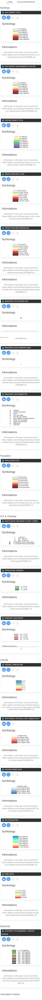

<h1><a class="anchor" id="layers-section-in-the-hotmaps-toolbox" href="#layers-section-in-the-hotmaps-toolbox"><i class="fa fa-link"></i></a>Lagafsnit i Hotmaps-værktøjskassen</h1><h2><a class="anchor" id="table-of-contents" href="#table-of-contents"><i class="fa fa-link"></i></a> Indholdsfortegnelse</h2><ul><li> <a href="#introduction">Introduktion</a></li><li> <a href="#layers">Lag</a></li><li> <a href="#raster-layers">Rasterlag</a></li><li> <a href="#vector-layers">Vektor lag</a></li><li> <a href="#calculation-module-layers">Beregningsmodullag</a></li><li> <a href="#how-to-cite">Hvordan man citerer</a></li><li> <a href="#authors-and-reviewers">Forfattere og korrekturlæsere</a></li><li> <a href="#license">Licens</a></li><li> <a href="#acknowledgement">Anerkendelse</a></li></ul><h2><a class="anchor" id="introduction" href="#introduction"><i class="fa fa-link"></i></a> Introduktion</h2>
 Ved at trykke på Knap et sidebjælke med forskellige slags lag vises til venstre på skærmen.

 <strong>Hvert lag har et sæt værktøjer som vist nedenfor</strong>

<ol><li> Viser lagets symbologisektion (forklaring)</li><li> Viser informationsafsnittet (primært et link til GitLab-arkivet, det anbefales stærkt at se efter mere information om dataene i <a href="https://gitlab.com/hotmaps">GitLab-arkivet</a> )</li><li> Download standarddatasættet</li><li> Download lag til valg af lag</li></ol>
 <a href="#table-of-contents"><strong><code>To Top</code></strong></a>
<h2><a class="anchor" id="layers" href="#layers"><i class="fa fa-link"></i></a> Lag</h2>
 Der er <a href="https://www.gislounge.com/geodatabases-explored-vector-and-raster-data">to kategorier af lag</a> :
<ol><li> Vektor lag</li><li> Rasterlag</li></ol>
 Følgende lag kan findes og visualiseres (du kan også se forklaringen og også informationsafsnittet for hvert lag):

 <a href="#table-of-contents"><strong><code>To Top</code></strong></a>
<h2><a class="anchor" id="raster-layers" href="#raster-layers"><i class="fa fa-link"></i></a> Rasterlag</h2>
 Følgende rasterlag visualiseres:
<ol><li>
 <strong>17 x bygningslag:</strong>
<ul><li> Kort over varmetæthed (samlet / bolig / ikke-bolig)</li><li> Kort over køletæthed (total / bolig / ikke-bolig)</li><li> Bruttoareal (samlet / bolig / ikke-bolig)</li><li> Bygningsmængder (i alt / bolig / ikke-bolig)</li></ul></li><li>
 <strong>1 x Befolkningslag</strong>
<ul><li> Befolkning i alt</li></ul></li><li>
 <strong>3 x vedvarende energikilder Potentielle lag:</strong>
<ul><li> Solstråling på bygningens fodaftryk</li><li> Vindpotentiale ved 50m</li><li> Skovrester</li></ul></li><li>
 <strong>5 x klimalag:</strong>
<ul><li> Temperatur</li><li> Køledagsdage</li><li> Opvarmningsgrad dage</li><li> Solstråling</li><li> Vindhastighed</li></ul></li></ol>
 <a href="#table-of-contents"><strong><code>To Top</code></strong></a>
<h2><a class="anchor" id="vector-layers" href="#vector-layers"><i class="fa fa-link"></i></a> Vektor lag</h2>
 Følgende vektorlag visualiseres:
<ol><li>
 <strong>4x industrilag:</strong>
<ul><li> Emission fra industrianlæg</li><li> Industriel overskudsvarme</li><li> Virksomhedsnavn på det industrielle websted</li><li> Delsektor til industrielt websted</li></ul></li><li>
 <strong>6 x vedvarende energikilder Potentielle lag:</strong>
<ul><li> Renseanlæg til spildevand</li><li> Spildevandsbehandlingsanlægs kapacitet</li><li> Landbrugsrester</li><li> Udløb af husdyr</li><li> Geotermisk potentiel varmeledningsevne</li><li> Kommunalt fast affald</li></ul></li><li>
 <strong>1 x ellag:</strong>
<ul><li> Elektricitet CO2-emissioner Landsgennemsnit</li></ul></li></ol>
 <a href="#table-of-contents"><strong><code>To Top</code></strong></a>
<h2><a class="anchor" id="calculation-module-layers" href="#calculation-module-layers"><i class="fa fa-link"></i></a> Beregningsmodullag</h2>
 Nogle beregningsmoduler genererer et lag med de beregnede resultater, f.eks. <a href="/en/CM-Scale-heat-and-cool-density-maps">CM - Scale Heat og Cool Density Maps</a> . Når disse CM&#39;er køres, vises det relative lag i venstre side af skærmen i lagafsnittet helt nederst. Laget kan derefter vælges og bruges i yderligere beregninger. Som for hvert andet lag tillader få knapper under lagtitlen at vise lagets symbologi, tilgængelig information om laget, downloade lagdatasættet og downloade laget som en rasterfil.

 <a href="#table-of-contents"><strong><code>To Top</code></strong></a>
<h2><a class="anchor" id="how-to-cite" href="#how-to-cite"><i class="fa fa-link"></i></a> Hvordan man citerer</h2>
 Jeton Hasani, i Hotmaps-Wiki, Layers-section-in-the-Hotmaps-toolbox (april 2019)

 <a href="#table-of-contents"><strong><code>To Top</code></strong></a>
<h2><a class="anchor" id="authors-and-reviewers" href="#authors-and-reviewers"><i class="fa fa-link"></i></a> Forfattere og korrekturlæsere</h2>
 Denne side blev skrevet af Jeton Hasani <strong><a href="https://eeg.tuwien.ac.at/">EEG - TU Wien</a></strong> .

 ☑ Denne side blev gennemgået af Mostafa Fallahnejad <strong><a href="https://eeg.tuwien.ac.at/">EEG - TU Wien</a></strong> .

 <a href="#table-of-contents"><strong><code>To Top</code></strong></a>
<h2><a class="anchor" id="license" href="#license"><i class="fa fa-link"></i></a> Licens</h2>
 Ophavsret © 2016-2020: Jeton Hasani

 Creative Commons Attribution 4.0 International licens

 Dette arbejde er licenseret under en Creative Commons CC BY 4.0 International licens.

 SPDX-licensidentifikator: CC-BY-4.0

 Licens-tekst: https://spdx.org/licenses/CC-BY-4.0.html

 <a href="#table-of-contents"><strong><code>To Top</code></strong></a>
<h2><a class="anchor" id="acknowledgement" href="#acknowledgement"><i class="fa fa-link"></i></a> Anerkendelse</h2>
 Vi vil gerne formidle vores dybeste påskønnelse til Horizon 2020 <a href="https://www.hotmaps-project.eu">Hotmaps-projektet</a> (tilskudsaftale nummer 723677), som gav finansieringen til at gennemføre den nuværende undersøgelse.

 <a href="#table-of-contents"><strong><code>To Top</code></strong></a>

<!--- THIS IS A SUPER UNIQUE IDENTIFIER -->

This page was automatically translated. View in another language:

[English](../en/Layers-section-in-the-Hotmaps-toolbox) (original) [Bulgarian](../bg/Layers-section-in-the-Hotmaps-toolbox)\* [Czech](../cs/Layers-section-in-the-Hotmaps-toolbox)\*  [German](../de/Layers-section-in-the-Hotmaps-toolbox)\* [Greek](../el/Layers-section-in-the-Hotmaps-toolbox)\* [Spanish](../es/Layers-section-in-the-Hotmaps-toolbox)\* [Estonian](../et/Layers-section-in-the-Hotmaps-toolbox)\* [Finnish](../fi/Layers-section-in-the-Hotmaps-toolbox)\* [French](../fr/Layers-section-in-the-Hotmaps-toolbox)\* [Irish](../ga/Layers-section-in-the-Hotmaps-toolbox)\* [Croatian](../hr/Layers-section-in-the-Hotmaps-toolbox)\* [Hungarian](../hu/Layers-section-in-the-Hotmaps-toolbox)\* [Italian](../it/Layers-section-in-the-Hotmaps-toolbox)\* [Lithuanian](../lt/Layers-section-in-the-Hotmaps-toolbox)\* [Latvian](../lv/Layers-section-in-the-Hotmaps-toolbox)\* [Maltese](../mt/Layers-section-in-the-Hotmaps-toolbox)\* [Dutch](../nl/Layers-section-in-the-Hotmaps-toolbox)\* [Polish](../pl/Layers-section-in-the-Hotmaps-toolbox)\* [Portuguese (Portugal, Brazil)](../pt/Layers-section-in-the-Hotmaps-toolbox)\* [Romanian](../ro/Layers-section-in-the-Hotmaps-toolbox)\* [Slovak](../sk/Layers-section-in-the-Hotmaps-toolbox)\* [Slovenian](../sl/Layers-section-in-the-Hotmaps-toolbox)\* [Swedish](../sv/Layers-section-in-the-Hotmaps-toolbox)\* 

\* machine translated
