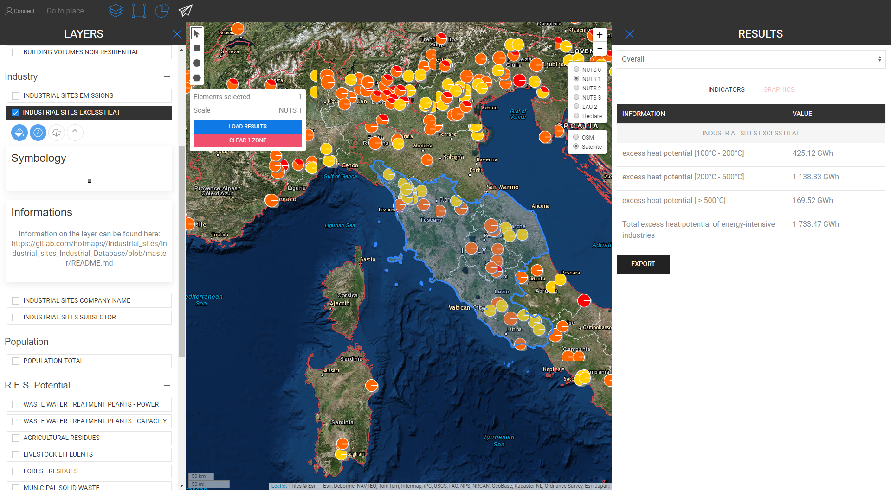

<h1><a class="anchor" id="retrieve-indicators-of-a-selected-area" href="#retrieve-indicators-of-a-selected-area"><i class="fa fa-link"></i></a>Hent indikatorer for et valgt område</h1><h2><a class="anchor" id="table-of-contents" href="#table-of-contents"><i class="fa fa-link"></i></a> Indholdsfortegnelse</h2><ul><li> <a href="#introduction">Introduktion</a></li><li> <a href="#indicators-for-raster-layers">Indikatorer for rasterlag</a><ul><li> <a href="#indicators-for-raster-layers_buildings">Bygninger</a></li><li> <a href="#indicators-for-raster-layers_population">Befolkning</a></li><li> <a href="#indicators-for-raster-layers_renewable-energy-source-potentials">Vedvarende energikildepotentialer</a></li></ul></li><li> <a href="#indicators-for-vector-layers">Indikatorer for vektorlag</a><ul><li> <a href="#indicators-for-vector-layers_industry">Industri</a></li><li> <a href="#indicators-for-vector-layers_renewable-energy-source-potentials">Vedvarende energikildepotentialer</a></li><li> <a href="#indicators-for-vector-layers_electricity">Elektricitet</a></li></ul></li><li> <a href="#example">Eksempel</a></li><li> <a href="#how-to-cite">Hvordan man citerer</a></li><li> <a href="#authors-and-reviewers">Forfattere og korrekturlæsere</a></li><li> <a href="#license">Licens</a></li><li> <a href="#acknowledgement">Anerkendelse</a></li></ul><h2><a class="anchor" id="introduction" href="#introduction"><i class="fa fa-link"></i></a> Introduktion</h2>
 Afhængigt af de lag og område, du har valgt, vises indikatorer til din konfiguration i et sidebjælke til højre på skærmen

 <a href="#table-of-contents"><strong><code>To Top</code></strong></a>

 I det følgende ser vi på de indikatorer, der vises for raster- og vektorlag.
<h2><a class="anchor" id="indicators-for-raster-layers" href="#indicators-for-raster-layers"><i class="fa fa-link"></i></a> Indikatorer for rasterlag</h2>
 Indikatorerne på rasterlag er forskellige fra vektorlag. Med forskellige mener vi med hensyn til aggregering og opdeling. Denne forskellige opførsel kommer fra territoriale beslutninger.

 Rasterlag har generelt en meget højere opløsning, mens vektorlag kun har attributter ved punkter eller polygoner.

 Det betyder på den ene side for eksempel, at hvis du vælger et vektorlag, der er defineret af NUTS3-polygoner, og du f.eks. Vil vælge en LAU-region, bliver NUTS3-værdien ikke opdelt til LAU-niveau, i stedet for NUTS3-indikatoren, hvor dette LAU-regionen er placeret, vises i sidebjælken for resultater.

 På den anden side aggregeres og opdeles rasterlag &quot;vilkårligt&quot; *

 * af de indeholdende celler inden for det valgte område (naturligvis inden for grænsen for selve rasteropløsningen)

 <a href="#table-of-contents"><strong><code>To Top</code></strong></a>
<h3><a class="anchor" id="buildings" href="#buildings"><i class="fa fa-link"></i></a> Bygninger</h3>
 <strong>Kort over varmetæthed</strong>

 <strong>Ekstra funktion</strong>

 Når du vælger varmedensitetslaget og populationslaget på samme tid, vises en ekstra indikator (se billedet nedenfor)

 <a href="#table-of-contents"><strong><code>To Top</code></strong></a>
<h3><a class="anchor" id="in-general-" href="#in-general-"><i class="fa fa-link"></i></a> Generelt:</h3>
 Når et af byggelagene og befolkningslaget vælges på samme tid, vises en ekstra indikator som beskrevet tidligere

<ins> <code><strong><a href="#indicators-for-raster-layers">To Chapter</a></strong></code></ins>

 <strong>Kort over kølingstæthed</strong>

<ins> <code><strong><a href="#indicators-for-raster-layers">To Chapter</a></strong></code></ins>

 <strong>Bygningsvolumener</strong>

<ins> <code><strong><a href="#indicators-for-raster-layers">To Chapter</a></strong></code></ins>

 <strong>Bruttoareal</strong>

<ins> <code><strong><a href="#indicators-for-raster-layers">To Chapter</a></strong></code></ins> <a href="#table-of-contents"><strong><code>To Top</code></strong></a>
<h3><a class="anchor" id="population" href="#population"><i class="fa fa-link"></i></a> Befolkning</h3>

<ins> <code><strong><a href="#indicators-for-raster-layers">To Chapter</a></strong></code></ins> <a href="#table-of-contents"><strong><code>To Top</code></strong></a>
<h3><a class="anchor" id="climate" href="#climate"><i class="fa fa-link"></i></a> Klima</h3>
 <strong>Temperatur</strong>

<ins> <code><strong><a href="#indicators-for-raster-layers">To Chapter</a></strong></code></ins>

 <strong>Køledagsdage</strong>

<ins> <code><strong><a href="#indicators-for-raster-layers">To Chapter</a></strong></code></ins>

 <strong>Opvarmningsgrad dage</strong>

<ins> <code><strong><a href="#indicators-for-raster-layers">To Chapter</a></strong></code></ins>

 <strong>Solstråling</strong>

<ins> <code><strong><a href="#indicators-for-raster-layers">To Chapter</a></strong></code></ins>

 <strong>Vindhastighed</strong>

<ins> <code><strong><a href="#indicators-for-raster-layers">To Chapter</a></strong></code></ins> <a href="#table-of-contents"><strong><code>To Top</code></strong></a>
<h3><a class="anchor" id="renewable-energy-source-potentials" href="#renewable-energy-source-potentials"><i class="fa fa-link"></i></a> Vedvarende energikildepotentialer</h3>
 <strong>Solstråling på bygningens fodaftryk</strong>

<ins> <code><strong><a href="#indicators-for-raster-layers">To Chapter</a></strong></code></ins>

 <strong>Vindpotentiale ved 50m</strong>

<ins> <code><strong><a href="#indicators-for-raster-layers">To Chapter</a></strong></code></ins>

 <strong>Skovrester</strong>

<ins> <code><strong><a href="#indicators-for-raster-layers">To Chapter</a></strong></code></ins> <a href="#table-of-contents"><strong><code>To Top</code></strong></a>
<h2><a class="anchor" id="indicators-for-vector-layers" href="#indicators-for-vector-layers"><i class="fa fa-link"></i></a> Indikatorer for vektorlag</h2><h3><a class="anchor" id="industry" href="#industry"><i class="fa fa-link"></i></a> Industri</h3>
 <strong>Emissioner fra industrianlæg</strong>

<ins> <code><strong><a href="#indicators-for-vector-layers">To Chapter</a></strong></code></ins>

 <strong>Industriel overskudsvarme</strong>

<ins> <code><strong><a href="#indicators-for-vector-layers">To Chapter</a></strong></code></ins>

 <strong>Virksomhedsnavn på det industrielle websted</strong>

<ins> <code><strong><a href="#indicators-for-vector-layers">To Chapter</a></strong></code></ins>

 <strong>Delsektor til industrielt websted</strong>

<ins> <code><strong><a href="#indicators-for-vector-layers">To Chapter</a></strong></code></ins> <a href="#table-of-contents"><strong><code>To Top</code></strong></a>
<h3><a class="anchor" id="renewable-energy-source-potentials" href="#renewable-energy-source-potentials"><i class="fa fa-link"></i></a> Vedvarende energikildepotentialer</h3>
 <strong>Rensningsanlæg for spildevand</strong>

<ins> <code><strong><a href="#indicators-for-vector-layers">To Chapter</a></strong></code></ins>

 <strong>Spildevandsrensningsanlægs kapacitet</strong>

<ins> <code><strong><a href="#indicators-for-vector-layers">To Chapter</a></strong></code></ins>

 <strong>Landbrugsrester</strong>

<ins> <code><strong><a href="#indicators-for-vector-layers">To Chapter</a></strong></code></ins>

 <strong>Udløb af husdyr</strong>

<ins> <code><strong><a href="#indicators-for-vector-layers">To Chapter</a></strong></code></ins>

 <strong>Kommunalt fast affald</strong>

<ins> <code><strong><a href="#indicators-for-vector-layers">To Chapter</a></strong></code></ins>

 <strong>Geotermisk potentiel varmeledningsevne</strong>

<ins> <code><strong><a href="#indicators-for-vector-layers">To Chapter</a></strong></code></ins> <a href="#table-of-contents"><strong><code>To Top</code></strong></a>
<h3><a class="anchor" id="electricity" href="#electricity"><i class="fa fa-link"></i></a> Elektricitet</h3>
 <strong>El C02-emissioner</strong>

<ins> <code><strong><a href="#indicators-for-vector-layers">To Chapter</a></strong></code></ins> <a href="#table-of-contents"><strong><code>To Top</code></strong></a>
<h2><a class="anchor" id="example" href="#example"><i class="fa fa-link"></i></a> Eksempel</h2>
 På billedet nedenfor kan du se, hvordan det ser ud, når alle lag visualiseres (her er Østrig som NUTS0 valgt)

 Selvom dette kort kan se lidt forvirrende ud ved første øjekast, er dets indikatorer lige illustreret. Se nedenfor alle indikatorer, der er beskrevet i resultatsidelinjen, når du vælger alle lag til Østrig (NUTS0)

 <a href="#table-of-contents"><strong><code>To Top</code></strong></a>
<h2><a class="anchor" id="how-to-cite" href="#how-to-cite"><i class="fa fa-link"></i></a> Hvordan man citerer</h2>
 Jeton Hasani, i Hotmaps-Wiki, Hent-indikatorer-for-et-valgt-område (april 2019)

 <a href="#table-of-contents"><strong><code>To Top</code></strong></a>
<h2><a class="anchor" id="authors-and-reviewers" href="#authors-and-reviewers"><i class="fa fa-link"></i></a> Forfattere og korrekturlæsere</h2>
 Denne side er skrevet af Jeton Hasani <strong><a href="https://eeg.tuwien.ac.at/">EEG - TU Wien</a></strong> .

 ☑ Denne side blev gennemgået af Mostafa Fallahnejad <strong><a href="https://eeg.tuwien.ac.at/">EEG - TU Wien</a></strong> .

 <a href="#table-of-contents"><strong><code>To Top</code></strong></a>
<h2><a class="anchor" id="license" href="#license"><i class="fa fa-link"></i></a> Licens</h2>
 Ophavsret © 2016-2020: Jeton Hasani

 Creative Commons Attribution 4.0 International licens

 Dette arbejde er licenseret under en Creative Commons CC BY 4.0 International licens.

 SPDX-licensidentifikator: CC-BY-4.0

 Licens-tekst: https://spdx.org/licenses/CC-BY-4.0.html

 <a href="#table-of-contents"><strong><code>To Top</code></strong></a>
<h2><a class="anchor" id="acknowledgement" href="#acknowledgement"><i class="fa fa-link"></i></a> Anerkendelse</h2>
 Vi vil gerne formidle vores dybeste påskønnelse til Horizon 2020 <a href="https://www.hotmaps-project.eu">Hotmaps-projektet</a> (tilskudsaftale nummer 723677), som gav finansieringen til at gennemføre den nuværende undersøgelse.

 <a href="#table-of-contents"><strong><code>To Top</code></strong></a> <code><a href="Indicator-Section/_edit">Review this page</a></code>

<!--- THIS IS A SUPER UNIQUE IDENTIFIER -->

This page was automatically translated. View in another language:

[English](../en/Retrieve-indicators-of-a-selected-area) (original) [Bulgarian](../bg/Retrieve-indicators-of-a-selected-area)\* [Czech](../cs/Retrieve-indicators-of-a-selected-area)\*  [German](../de/Retrieve-indicators-of-a-selected-area)\* [Greek](../el/Retrieve-indicators-of-a-selected-area)\* [Spanish](../es/Retrieve-indicators-of-a-selected-area)\* [Estonian](../et/Retrieve-indicators-of-a-selected-area)\* [Finnish](../fi/Retrieve-indicators-of-a-selected-area)\* [French](../fr/Retrieve-indicators-of-a-selected-area)\* [Irish](../ga/Retrieve-indicators-of-a-selected-area)\* [Croatian](../hr/Retrieve-indicators-of-a-selected-area)\* [Hungarian](../hu/Retrieve-indicators-of-a-selected-area)\* [Italian](../it/Retrieve-indicators-of-a-selected-area)\* [Lithuanian](../lt/Retrieve-indicators-of-a-selected-area)\* [Latvian](../lv/Retrieve-indicators-of-a-selected-area)\* [Maltese](../mt/Retrieve-indicators-of-a-selected-area)\* [Dutch](../nl/Retrieve-indicators-of-a-selected-area)\* [Polish](../pl/Retrieve-indicators-of-a-selected-area)\* [Portuguese (Portugal, Brazil)](../pt/Retrieve-indicators-of-a-selected-area)\* [Romanian](../ro/Retrieve-indicators-of-a-selected-area)\* [Slovak](../sk/Retrieve-indicators-of-a-selected-area)\* [Slovenian](../sl/Retrieve-indicators-of-a-selected-area)\* [Swedish](../sv/Retrieve-indicators-of-a-selected-area)\* 

\* machine translated
