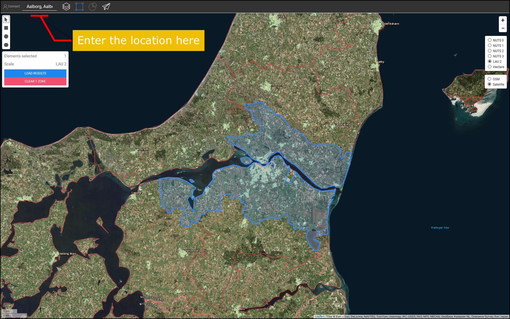
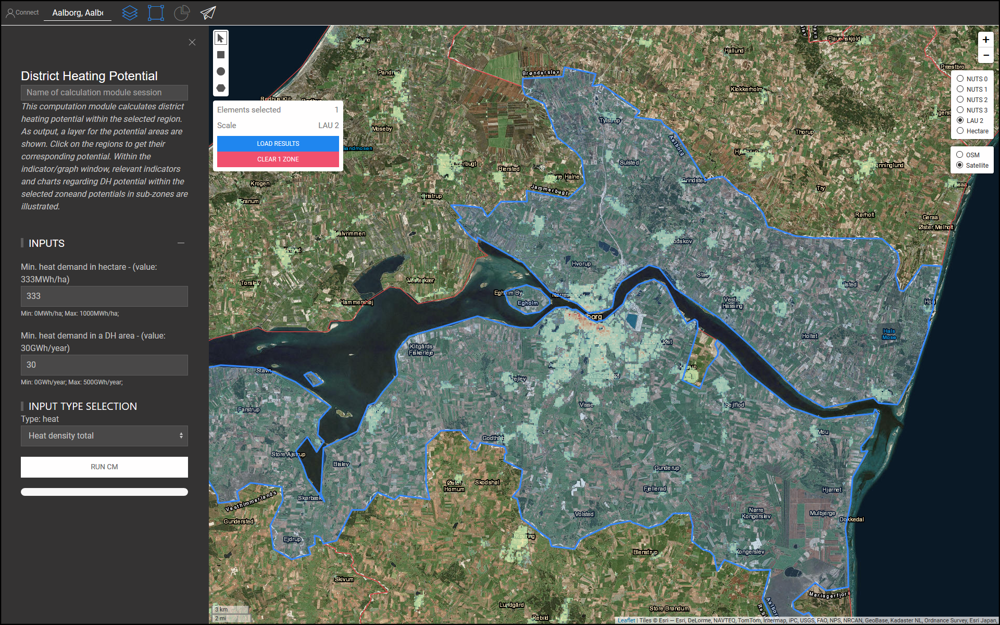
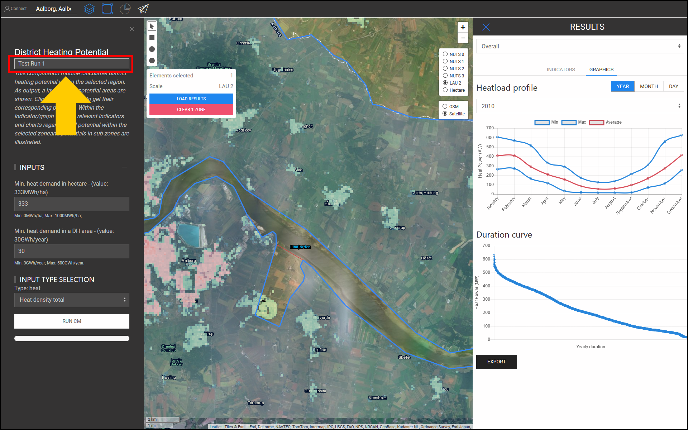
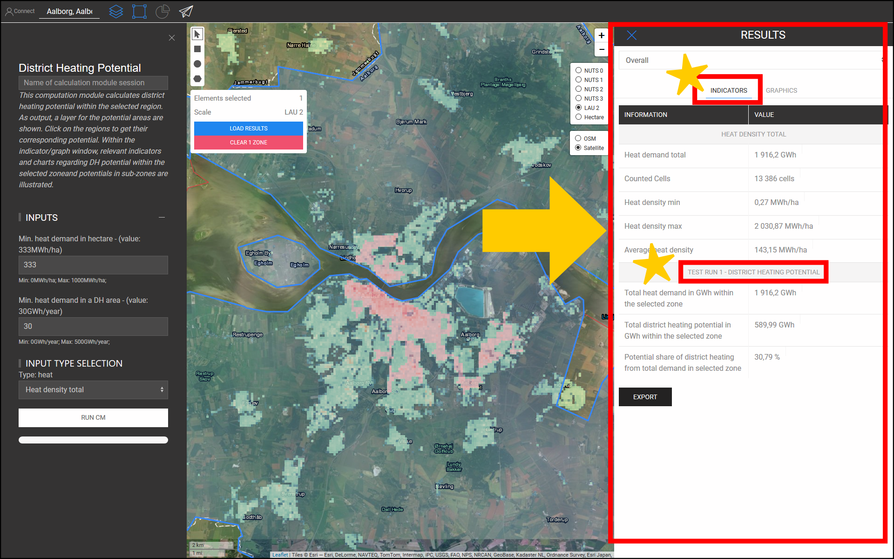
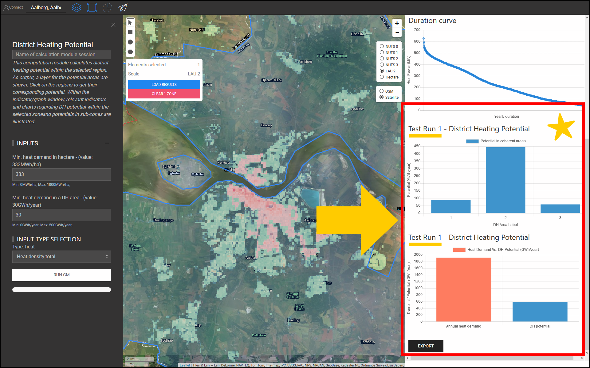
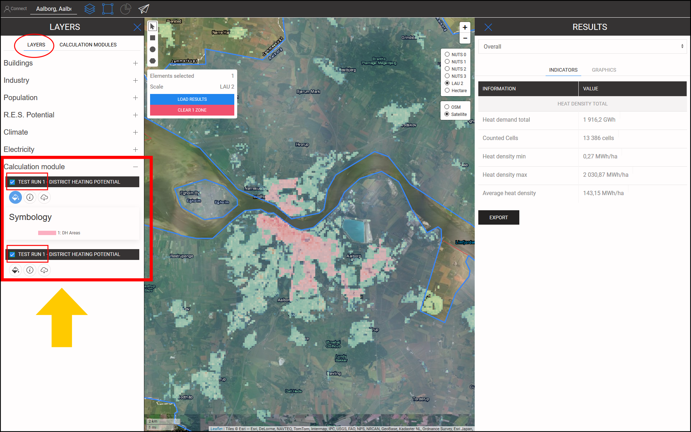
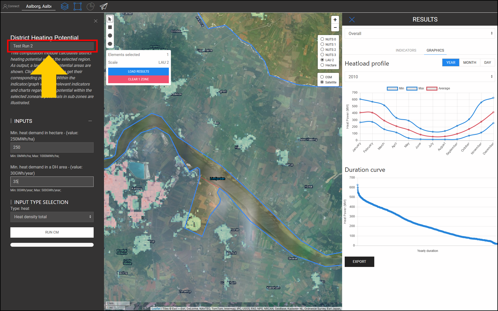
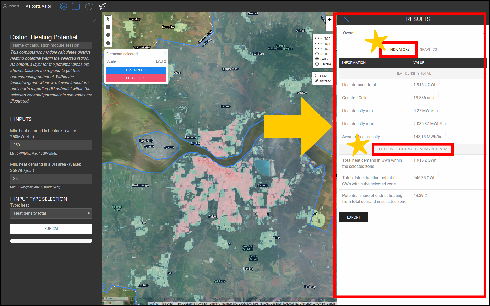
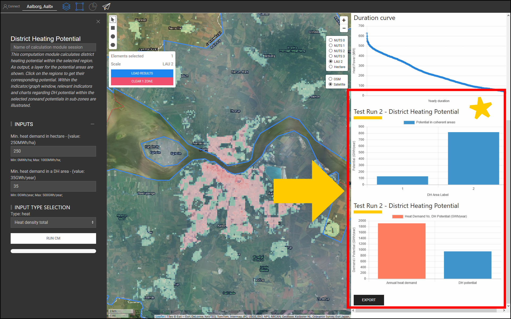
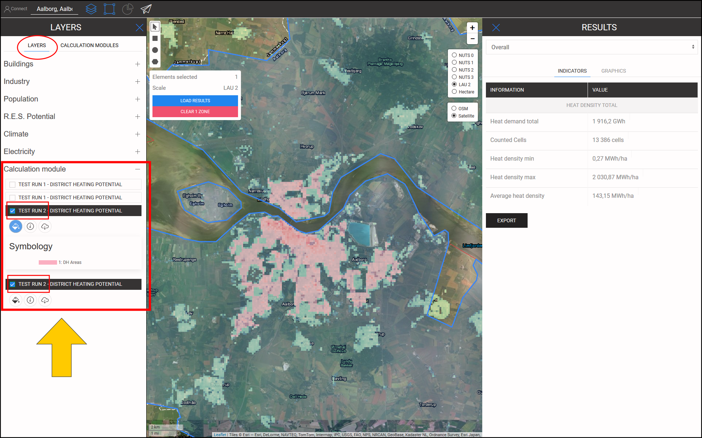

<h1> <a class="anchor" id="cm-district-heating-potential-areas-user-defined-thresholds" href="#cm-district-heating-potential-areas-user-defined-thresholds"><i class="fa fa-link"></i></a> CM Fernwärmepotentialbereiche Benutzerdefinierte Schwellenwerte </h1><h2> <a class="anchor" id="table-of-contents" href="#table-of-contents"><i class="fa fa-link"></i></a> Inhaltsverzeichnis </h2><ul><li> <a href="#in-a-glance">In einem Blick</a> </li><li> <a href="#introduction">Einführung</a> </li><li> <a href="#inputs-and-outputs">Eingänge und Ausgänge</a> </li><li> <a href="#method">Methode</a> </li><li> <a href="#github-repository-of-this-calculation-module">GitHub-Repository dieses Berechnungsmoduls</a> </li><li> <a href="#sample-run">Probelauf</a> <ul><li> <a href="#sample-run_test-run-1-default-input-values">Testlauf 1: Standardeingabewerte</a> </li><li> <a href="#sample-run_test-run-2-modified-input-values">Testlauf 2: geänderte Eingabewerte</a> </li></ul></li><li> <a href="#how-to-cite">Wie zu zitieren</a> </li><li> <a href="#authors-and-reviewers">Autoren und Rezensenten</a> </li><li> <a href="#license">Lizenz</a> </li><li> <a href="#acknowledgement">Wissen</a> </li></ul><h2> <a class="anchor" id="in-a-glance" href="#in-a-glance"><i class="fa fa-link"></i></a> In einem Blick </h2>
 Dieses Berechnungsmodul berechnet das Fernwärmepotential innerhalb der ausgewählten Region anhand von 2 Schwellenwerten: 1) Mindestwärmebedarf in jedem Hektar, 2) Mindestwärmebedarf in einem DH-Gebiet. Bereiche innerhalb der ausgewählten Region, die diese Bedingungen erfüllen, werden als DH-Bereiche zurückgegeben. Darüber hinaus wird der Wärmebedarf in diesen Regionen in Form von Indikatoren als DH-Potenzial zurückgegeben. 

 <a href="#table-of-contents"><strong><code>To Top</code></strong></a> 
 <h2> <a class="anchor" id="introduction" href="#introduction"><i class="fa fa-link"></i></a> Einführung </h2>
 Der Wärmebedarf spielt eine wichtige Rolle bei der Bestimmung potenzieller Fernwärmeflächen. Beispielsweise ist die Implementierung von Fernwärme in Gebieten mit geringem Wärmebedarf wirtschaftlich nicht realisierbar. Andererseits kann es auch ungenau sein, einen Bereich mit hoher Wärmebedarfsdichte als potenziellen DH-Bereich zu definieren. Eine hohe Wärmebedarfsdichte in einem Gebiet könnte auf die Anwesenheit einiger weniger Verbraucher mit einem sehr hohen Wärmebedarf in diesem Gebiet zurückzuführen sein. Im Gegenteil, eine niedrige durchschnittliche Wärmebedarfsdichte könnte ein Zeichen für Zonen mit einem sehr geringen Wärmebedarf innerhalb des ausgewählten Gebiets sein. Ziel des Berechnungsmoduls &quot;CM - DISTRICT HEATING POTENTIAL AREA: BENUTZERDEFINIERTE SCHWELLE&quot; ist es, ein angemessenes Gleichgewicht zwischen der Wärmebedarfsdichte in einem Gebiet und seinen konstituierenden Zonen herzustellen. 

 Der &quot;CM - DISTRICT HEATING POTENTIAL AREA: BENUTZERDEFINIERTE SCHWELLE&quot; bestimmt die DH-Bereiche und ihr entsprechendes DH-Potential basierend auf den Wärmebedarfsdichten. Die Wärmebedarfsdichten werden von einer Eingangs-GIS-Schicht erhalten. Die Hotmaps-Toolbox und -Datenbank enthält eine <strong><a href="https://gitlab.com/hotmaps/heat/heat_tot_curr_density">Standard-</a></strong> Wärmedichtekarte, die in diesem Berechnungsmodul verwendet werden kann. Die Hotmaps-Wärmedichtekarte ist im Rasterformat und hat eine Auflösung von einem Hektar und ein Koordinatenreferenzsystem (CRS) von &quot; <em><em>ETRS89 / LAEA Europe - EPSG 3035</em></em> &quot;. Die Zellen in der Karte zeigen die Wärmedichten in <em><strong>MWh / ha</strong></em> . Neben dieser Standardkarte können auch vom Benutzer generierte Karten in die Toolbox hochgeladen und in diesem CM verwendet werden. 

 Als Ausgabe werden eine GIS-Schicht, drei Indikatoren und zwei Diagramme dargestellt. Diese Ausgaben werden im Abschnitt <a href="#sample-run">Probelauf</a> ausführlich erläutert. Die Ausgabeschicht zeigt die potenziellen DH-Bereiche. Durch Klicken auf jeden Bereich auf der Karte wird ein Fenster geöffnet und das diesem Bereich entsprechende DH-Potenzial angezeigt. In den Fenstern INDIKATOREN / GRAFIKEN im Abschnitt ERGEBNISSE der Toolbox werden relevante Indikatoren und Diagramme zum DH-Potenzial in der ausgewählten Zone und zu den Potenzialen in Unterzonen dargestellt. 

 <a href="#table-of-contents"><strong><code>To Top</code></strong></a> 
 <h2> <a class="anchor" id="inputs-and-outputs" href="#inputs-and-outputs"><i class="fa fa-link"></i></a> Eingänge und Ausgänge </h2>
 Die Eingabeparameter und -ebenen sowie die Ausgabeebenen und -parameter sind wie folgt. 

 <strong>Eingabeebenen und Parameter sind:</strong> 
<ul><li> Minimaler Wärmebedarf pro Hektar [ <em><strong>MWh / ha</strong></em> ]: ein Wert zwischen <em><em>0</em></em> und <em><em>1000</em></em> </li><li> Minimaler Wärmebedarf in einem DH-Bereich [ <em><strong>GWh / Jahr</strong></em> ]: ein Wert zwischen <em><em>0</em></em> und <em><em>500</em></em> </li><li> Wärmedichtekarte: In der Toolbox befindet sich eine Standardkarte. Eigene hochgeladene Karten können auch im CM verwendet werden <ul><li> im Rasterformat (* .tif) </li><li> mit 1 Hektar Auflösung </li><li> Nachfragedichten in <em><strong>MWh / ha</strong></em> </li></ul></li></ul>
 <strong>Ausgabeebenen und Parameter sind:</strong> 
<ul><li> DH-Bereiche in Raster- und Shapefile-Formaten </li><li> DH-Potenzial in jedem DH-Gebiet [ <em><strong>GWh / Jahr</strong></em> ] (auf die Karte klicken) </li><li> Gesamtwärmebedarf in GWh innerhalb der ausgewählten Zone </li><li> Gesamtfernwärmepotential in GWh innerhalb der ausgewählten Zone </li><li> Möglicher Anteil der Fernwärme am Gesamtbedarf in der ausgewählten Zone </li></ul>
 <a href="#table-of-contents"><strong><code>To Top</code></strong></a> 
 <h2> <a class="anchor" id="method" href="#method"><i class="fa fa-link"></i></a> Methode </h2>
 Das Potenzial für DH in einer bestimmten Region kann durch den gesamten Wärmebedarf und seine räumliche Zuordnung definiert werden. In der Hotmaps-Toolbox wird der Wärmebedarf in Form einer Rasterkarte dargestellt. Um potenzielle DH-Bereiche richtig zu definieren, sollte sowohl der Wärmebedarf in jeder Zelle als auch in einem Bereich ein bestimmtes Niveau erreichen. Als Ausgangspunkt schlägt die Hotmaps-Toolbox Standardwerte für diese beiden Parameter vor. Abhängig von der Verteilung des Wärmebedarfs und den örtlichen Bedingungen kann der Hotmaps-Benutzer diese Werte jedoch ändern. 

 Die Bestimmung der DH-Bereiche erfolgt in zwei Schritten: 

 Im ersten Schritt werden alle Zellen mit einem Wärmebedarf unterhalb des Eingangsparameters &quot;Minimaler Wärmebedarf in Hektar&quot; gefiltert. Durch Entfernen dieser Zellen aus der Karte erhalten wir Gruppen von Zellen, die aneinander gebunden sind. Jeder Satz dieser angehängten Zellen bildet kleine Zonen, die hier als &quot;kohärente Bereiche&quot; bezeichnet werden. In den zweiten Schritten wird der Gesamtwärmebedarf in jedem zusammenhängenden Bereich berechnet. Wenn für jeden kohärenten Bereich der Gesamtwärmebedarf höher ist als der Eingangsparameter &quot;Minimaler Wärmebedarf in einem DH-Bereich&quot;, wird er als potenzieller DH-Bereich betrachtet. 

 Schließlich wird für die DH-Bereiche das Potenzial berechnet und in Form einer GIS-Schicht dargestellt, die in der Toolbox angezeigt wird. 

 <a href="#table-of-contents"><strong><code>To Top</code></strong></a> 
 <h2> <a class="anchor" id="github-repository-of-this-calculation-module" href="#github-repository-of-this-calculation-module"><i class="fa fa-link"></i></a> GitHub-Repository dieses Berechnungsmoduls </h2>
 <a href="https://github.com/HotMaps/dh_potential/tree/develop">Hier erhalten</a> Sie die neueste Entwicklung für dieses Berechnungsmodul. 

 <a href="#table-of-contents"><strong><code>To Top</code></strong></a> 
 <h2> <a class="anchor" id="sample-run" href="#sample-run"><i class="fa fa-link"></i></a> Probelauf </h2>
 Hier wird das Berechnungsmodul für die Fallstudie von Aalborg in Dänemark ausgeführt. 
<ul><li> Verwenden Sie zunächst die Leiste &quot;Gehe zu Ort&quot;, um zu Aalborg zu navigieren und die Stadt auszuwählen. </li></ul>

<ul><li>
 Befolgen Sie die in der folgenden Abbildung gezeigten Schritte: 
<ul><li> Klicken Sie auf die Schaltfläche &quot;Ebenen&quot;, um das Fenster &quot;Ebenen&quot; zu öffnen: </li><li> Klicken Sie auf die Registerkarte &quot;BERECHNUNGSMODULE&quot;. </li><li> Klicken Sie auf die Schaltfläche &quot;CM-DISTRICT HEATING POTENTIAL AREAS: BENUTZERDEFINIERTE SCHWELLEN&quot;. </li></ul></li><li>
 Jetzt wird das Berechnungsmodul &quot;CM-DISTRICT HEATING POTENTIAL AREAS: USER-DEFINED THRESHOLDS&quot; geöffnet und ist betriebsbereit. 
</li></ul>

 <a href="#table-of-contents"><strong><code>To Top</code></strong></a> 
 <h3> <a class="anchor" id="test-run-1--default-input-values" href="#test-run-1--default-input-values"><i class="fa fa-link"></i></a> Testlauf 1: Standardeingabewerte </h3>
 Die Standardeingabewerte zeigen die allgemeinen Bedingungen an, unter denen ein Bereich als potenzieller DH-Bereich betrachtet werden kann. Diese Werte sollten nur als Ausgangspunkt betrachtet werden. Möglicherweise müssen Sie Werte unter oder über den Standardwerten in der Toolbox festlegen, um zusätzliche lokale Bedingungen zu berücksichtigen. Daher sollte der Benutzer diese Werte anpassen, um die beste Kombination von Schwellenwerten für seine Fallstudie zu finden. 

 Führen Sie die folgenden Schritte aus, um das Berechnungsmodul auszuführen: 
<ul><li> Weisen Sie der Laufsitzung einen Namen zu (optional - hier haben wir &quot;Testlauf 1&quot; gewählt) und legen Sie die Eingabeparameter fest (hier wurden Standardwerte verwendet). </li></ul>

<ul><li> Drücken Sie die Taste &quot;RUN CM&quot; unten links. </li><li> Warten Sie, bis der Vorgang abgeschlossen ist. </li></ul>
 <strong><code>Note: If you wish to change your input parameters, you can press &quot;STOP CM&quot;, modify your input parameters and re-run the CM</code></strong> 
 <ul><li> Als Ausgabe werden Indikatoren und Diagramme im Abschnitt &quot;ERGEBNISSE&quot; auf der rechten Seite der Toolbox angezeigt. Die Indikatoren zeigen: <ul><li> der gesamte Wärmebedarf in <em><em>GWh</em></em> innerhalb der ausgewählten Zone, </li><li> Gesamt-DH-Potential in <em><em>GWh</em></em> innerhalb der ausgewählten Zone, </li><li> der Anteil des DH-Potenzials am Gesamtbedarf, der durch Division des DH-Potenzials durch den Gesamtwärmebedarf in der Region erhalten wird. </li></ul></li></ul>

 Zusätzlich werden auch zwei Diagramme generiert. Das erste zeigt das DH-Potential in jedem DH-Bereich. Die entsprechenden Beschriftungen finden Sie auch auf der Karte. Das zweite Diagramm zeigt das gesamte DH-Potenzial im Vergleich zum gesamten Wärmebedarf in dem ausgewählten Bereich. 

<ul><li> Außerdem wird der Leinwand eine neue Ebene hinzugefügt, die DH-Bereiche zeigt. Diese Ebene wird der Liste der Ebenen unter der Kategorie &quot;Berechnungsmodul&quot; ganz unten im Ebenenabschnitt hinzugefügt. Der Name der Laufsitzung unterscheidet die Ausgaben dieses Laufs von anderen. </li></ul>

 Wenn Sie diese Schritte ausführen, erhalten Sie einen Eindruck von den Eingabewerten und potenziellen DH-Bereichen. 

 <a href="#table-of-contents"><strong><code>To Top</code></strong></a> 
 <h3> <a class="anchor" id="test-run-2--modified-input-values" href="#test-run-2--modified-input-values"><i class="fa fa-link"></i></a> Testlauf 2: geänderte Eingabewerte </h3>
 Abhängig von Ihrer Erfahrung und Ihren lokalen Kenntnissen können Sie die Eingabewerte erhöhen oder verringern, um bessere Ergebnisse zu erzielen. Im Fall von Aalborg wissen Sie beispielsweise, dass der Wärmebedarf in den Außenbezirken der Stadt relativ nahe am zentralen Teil der Stadt liegt und dass in diesen Gebieten auch ein DH-System möglich ist. Daher können Sie den minimalen Wärmebedarf in Zellen reduzieren, die Teil eines DH-Bereichs sind. Um jedoch einen ausreichenden Wärmebedarf zu gewährleisten, können Sie den minimalen Wärmebedarf in einem DH-Bereich erhöhen. Hier führen Sie die Berechnungsmodule mit neuen Eingabeparametern erneut aus. 
<ul><li> Weisen Sie der Laufsitzung einen Namen zu (optional - hier haben wir &quot;Testlauf 2&quot; gewählt) und stellen Sie die Eingabeparameter ein ( <em><em>250 MWh / ha</em></em> für den minimalen Wärmebedarf in Hektar und <em><em>35 GWh / Jahr</em></em> für den Mindestbedarf im DH-Bereich). . </li></ul>

<ul><li> Drücken Sie die Taste &quot;RUN CM&quot; unten links. </li><li> Warten Sie, bis der Vorgang abgeschlossen ist. </li><li> Als Ausgabe werden Indikatoren und Diagramme im Abschnitt &quot;ERGEBNISSE&quot; auf der rechten Seite der Toolbox angezeigt. Die Indikatoren zeigen: <ul><li> der gesamte Wärmebedarf in <em><em>GWh</em></em> innerhalb der ausgewählten Zone, </li><li> Gesamt-DH-Potential in <em><em>GWh</em></em> innerhalb der ausgewählten Zone, </li><li> der Anteil des DH-Potenzials am Gesamtbedarf, der durch Division des DH-Potenzials durch den gesamten Wärmebedarf in der Region erhalten wird. </li></ul></li></ul>

 Zusätzlich werden auch zwei Diagramme generiert. Der erste zeigt das DH-Potential in jedem DH-Bereich. Die entsprechenden Beschriftungen finden Sie auch auf der Karte. Das zweite Diagramm zeigt das gesamte DH-Potenzial im Vergleich zum gesamten Wärmebedarf in dem ausgewählten Bereich. 

<ul><li> Außerdem wird der Leinwand eine neue Ebene hinzugefügt, die DH-Bereiche zeigt. Diese Ebene wird der Liste der Ebenen unter der Kategorie &quot;Berechnungsmodul&quot; hinzugefügt. Der Name der Laufsitzung unterscheidet die Ausgaben dieses Laufs von anderen. </li></ul>

 <a href="#table-of-contents"><strong><code>To Top</code></strong></a> 
 <h2> <a class="anchor" id="how-to-cite" href="#how-to-cite"><i class="fa fa-link"></i></a> Wie zu zitieren </h2>
 Mostafa Fallahnejad, im Hotmaps-Wiki, CM-Fernwärmepotentialbereiche: Benutzerdefinierte Schwellenwerte (April 2019) 

 <a href="#table-of-contents"><strong><code>To Top</code></strong></a> 
 <h2> <a class="anchor" id="authors-and-reviewers" href="#authors-and-reviewers"><i class="fa fa-link"></i></a> Autoren und Rezensenten </h2>
 Diese Seite wurde von Mostafa Fallahnejad ( <strong><a href="https://eeg.tuwien.ac.at/">EEG - TU Wien</a></strong> ) verfasst. 

 ☑ Diese Seite wurde von Marcul Hummel ( <strong><a href="https://e-think.ac.at">e-think</a></strong> ) überprüft. 

 <a href="#table-of-contents"><strong><code>To Top</code></strong></a> 
 <h2> <a class="anchor" id="license" href="#license"><i class="fa fa-link"></i></a> Lizenz </h2>
 Copyright © 2016-2020: Mostafa Fallahnejad 

 Creative Commons Namensnennung 4.0 Internationale Lizenz 

 Diese Arbeit unterliegt den Bestimmungen einer Creative Commons CC BY 4.0 International License. 

 SPDX-Lizenz-ID: CC-BY-4.0 

 Lizenztext: https://spdx.org/licenses/CC-BY-4.0.html 

 <a href="#table-of-contents"><strong><code>To Top</code></strong></a> 
 <h2> <a class="anchor" id="acknowledgement" href="#acknowledgement"><i class="fa fa-link"></i></a> Wissen </h2>
 Wir möchten dem Horizon 2020 <a href="https://www.hotmaps-project.eu">Hotmaps-Projekt</a> (Finanzhilfevereinbarung Nr. 723677), das die Mittel für die Durchführung der vorliegenden Untersuchung <a href="https://www.hotmaps-project.eu">bereitstellte</a> , unsere tiefste Anerkennung <a href="https://www.hotmaps-project.eu">aussprechen</a> . 

 <a href="#table-of-contents"><strong><code>To Top</code></strong></a> 
 

<!--- THIS IS A SUPER UNIQUE IDENTIFIER -->

This page was automatically translated. View in another language:

[English](../en/CM-District-heating-potential-areas-user-defined-thresholds) (original)  

\* machine translated
