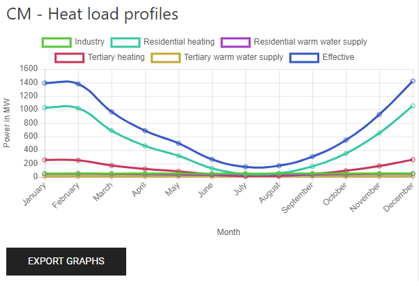

<h1> <a class="anchor" id="cm-heat-load-profiles" href="#cm-heat-load-profiles"><i class="fa fa-link"></i></a> CM Wärmelastprofile </h1><h2> <a class="anchor" id="table-of-contents" href="#table-of-contents"><i class="fa fa-link"></i></a> Inhaltsverzeichnis </h2><ul><li> <a href="#in-a-glance">In einem Blick</a> </li><li> <a href="#introduction">Einführung</a> </li><li> <a href="#inputs-and-outputs">Eingänge und Ausgänge</a> <ul><li> <a href="#inputs-and-outputs_input-layers-and-parameters">Eingabeebenen und Parameter</a> </li><li> <a href="#inputs-and-outputs_output">Ausgabe</a> </li></ul></li><li> <a href="#method">Methode</a> <ul><li> <a href="#method_overview">Überblick</a> </li><li> <a href="#method_details">Einzelheiten</a> </li><li> <a href="#method_implementation">Implementierung</a> </li></ul></li><li> <a href="#github-repository-of-this-calculation-module">GitHub-Repository dieses Berechnungsmoduls</a> </li><li> <a href="#sample-run">Probelauf</a> </li><li> <a href="#how-to-cite">Wie zu zitieren</a> </li><li> <a href="#authors-and-reviewers">Autoren und Rezensenten</a> </li><li> <a href="#license">Lizenz</a> </li><li> <a href="#acknowledgement">Wissen</a> </li></ul><h2> <a class="anchor" id="in-a-glance" href="#in-a-glance"><i class="fa fa-link"></i></a> In einem Blick </h2>
 Dieses Modul generiert Lastprofile des Bedarfs an Raumheizung und Warmwasserbereitung für eine ausgewählte Region. Es verwendet Standardlastprofile für den Wohn- und Tertiärsektor auf NUTS2-Ebene und skaliert sie auf einen bestimmten Bedarf in diesen Sektoren. Außerdem werden die Lastprofile für die Raumheizung und die Warmwasserbereitung getrennt bereitgestellt. 

 <a href="#table-of-contents"><strong><code>To Top</code></strong></a> 
 <h2> <a class="anchor" id="introduction" href="#introduction"><i class="fa fa-link"></i></a> Einführung </h2>
 Hotmaps bietet generische und jahresspezifische Wärmelastprofile auf NUTS2-Ebene. Der Benutzer möchte möglicherweise die Standardprofile basierend auf den Informationen anpassen, über die er verfügt. Dieses Berechnungsmodul bietet die Möglichkeit, verschiedene Elemente der Profile nach oben oder unten zu skalieren und ein neues Profil zu erhalten. 

 <a href="#table-of-contents"><strong><code>To Top</code></strong></a> 
 <h2> <a class="anchor" id="inputs-and-outputs" href="#inputs-and-outputs"><i class="fa fa-link"></i></a> Eingänge und Ausgänge </h2><h3> <a class="anchor" id="input-layers-and-parameters" href="#input-layers-and-parameters"><i class="fa fa-link"></i></a> Eingabeebenen und Parameter </h3>
 Aus dem Standarddatensatz der Hotmaps werden mehrere Ebenen und Profile verwendet: 
<ul><li> Wärmedichte Wohnsektor </li><li> Wärmedichte Nichtwohnungssektor </li><li> Bruttogeschossfläche Wohn </li><li> Bruttogeschossfläche Nichtwohngebäude </li><li> Industriedatenbank </li><li> Lastprofile für die Industrie </li><li> Lastprofile für Wohnraumheizung </li><li> Lastprofile für die Tertiärheizung </li><li> Lastprofile für Warmwasser in Wohngebieten </li><li> Lastprofile für tertiäres Warmwasser </li></ul><h3> <a class="anchor" id="user-inputs" href="#user-inputs"><i class="fa fa-link"></i></a> Benutzereingaben </h3>
 Der Benutzer sollte die folgenden Parameter angeben: 
<ul><li> <strong>Wohnheizfaktor</strong> : Der Wohnwärmebedarf wird mit diesem Faktor multipliziert. </li><li> <strong>Tertiärheizungsfaktor</strong> : Der <strong>Tertiärheizungsbedarf</strong> wird mit diesem Faktor multipliziert. </li><li> <strong>Warmwasserversorgungsfaktor für</strong> Wohngebäude: Der Warmwasserbedarf für Wohngebäude wird mit diesem Faktor multipliziert. </li><li> <strong>Tertiärer Warmwasserversorgungsfaktor</strong> : Der tertiäre Warmwasserbedarf wird mit diesem Faktor multipliziert. </li></ul>
 <a href="#table-of-contents"><strong><code>To Top</code></strong></a> 
 <h3> <a class="anchor" id="output" href="#output"><i class="fa fa-link"></i></a> Ausgabe </h3><h4> <a class="anchor" id="indicators" href="#indicators"><i class="fa fa-link"></i></a> Indikatoren </h4><ul><li> Wärmebedarf der <strong>Industrie</strong> : Jährlicher Wärmebedarf der Industrie in dem ausgewählten Gebiet. </li><li> Wärmebedarf <strong>durch Wohnraumheizung</strong> : Jährlicher Wärmebedarf für die Wohnraumheizung im ausgewählten Bereich. </li><li> Wärmebedarf <strong>durch Warmwasserversorgung in Wohngebieten</strong> : Jährliche Wärme, die für die Warmwasserversorgung in Wohngebieten in dem ausgewählten Gebiet benötigt wird. </li><li> Wärmebedarf durch Heizung im <strong>Tertiärsektor</strong> : Jährliche Wärme, die für die Heizung im Tertiärsektor in dem ausgewählten Bereich benötigt wird. </li><li> Wärmebedarf der <strong>Warmwasserversorgung des tertiären Sektors</strong> : Jährliche Wärme, die für die Warmwasserversorgung des tertiären Sektors in dem ausgewählten Gebiet benötigt wird. </li><li> <strong>Gesamtkopfbedarf</strong> : Jährlicher Gesamtwärmebedarf im ausgewählten Bereich. </li></ul><h4> <a class="anchor" id="graphics" href="#graphics"><i class="fa fa-link"></i></a> Grafik </h4><ul><li> <strong>Wärmebedarfsprofile</strong> : Eine Grafik mit den oben aufgeführten Indikatoren für das Jahr. </li></ul>
 Die x-Achse repräsentiert die Zeit und die y-Achse zeigt die Leistung in MW. Es kann hilfreich sein, bestimmte Sektoren auszublenden, um andere besser sehen zu können. Dies kann durch Doppelklicken auf die Legende erfolgen. 

 <a href="#table-of-contents"><strong><code>To Top</code></strong></a> 
 <h2> <a class="anchor" id="method" href="#method"><i class="fa fa-link"></i></a> Methode </h2><h3> <a class="anchor" id="overview" href="#overview"><i class="fa fa-link"></i></a> Überblick </h3>
 Entsprechende Lastprofile werden in der Benutzerauswahl Industriestandorten, Wohn- und Tertiärgebäuden zugeordnet. 

 <a href="#table-of-contents"><strong><code>To Top</code></strong></a> 
 <h3> <a class="anchor" id="details" href="#details"><i class="fa fa-link"></i></a> Einzelheiten </h3><h4> <a class="anchor" id="residential-warm-water-supply" href="#residential-warm-water-supply"><i class="fa fa-link"></i></a> Warmwasserversorgung in Wohngebieten </h4>
 Basierend auf der Bruttogeschossfläche von Wohngebäuden und ihrer NUTS 0 ID wird der Energieverbrauch für die Warmwasserversorgung anhand der folgenden Liste berechnet. Unter Verwendung der NUTS 2-ID des ausgewählten Bereichs wird ein Lastprofil zugewiesen. Die Warmwasserversorgung in Wohngebieten wird mit dem Warmwasserversorgungsfaktor in Wohngebieten multipliziert, falls der Benutzer den Wert anpassen möchte. 

 <em>Spezifische Energie pro Fläche für die Warmwasserversorgung in Wohngebäuden in verschiedenen Ländern</em> 

 | Nuts0 ID | Warmwasserversorgung in kWh / m² / a | | ------------- |: -------------: | | AT | 21,67 | | BE | 31,95 | | BG | 12.93 | | HR | 21,38 | | CY | 8,80 | | CZ | 22,83 | | DK | 9,64 | | EE | 14.35 | | FI | 10.15 | | FR | 9,66 | | DE | 8,27 | | EL | 12.51 | | HU | 13.66 | | IE | 15,91 | | IT | 14.01 | | LV | 15,71 | | LT | 13.36 | | LU | 8,29 | | MT | 10,99 | | NL | 8,91 | | PL | 10.00 | | PT | 9,48 | | RO | 11.48 | | SK | 21,51 | | SI | 21,74 | | ES | 23,34 | | SE | 13,54 | | UK | 49.03 | 
<h4> <a class="anchor" id="residential-heating" href="#residential-heating"><i class="fa fa-link"></i></a> Wohnheizung </h4>
 Die Wärmebedarfsdichte für den Wohnbereich wird verwendet. Da dieser Datensatz bereits die für warmes Wasser verwendete Energie enthält, wird die zuvor berechnete Warmwasserenergie davon abgezogen. Basierend auf der NUTS 2 ID wird für jede Fliese der Wärmedichte in der Benutzerauswahl ein Wohnheizprofil zugewiesen. Die Wohnheizung wird mit dem Wohnheizfaktor multipliziert, falls der Benutzer den Wert anpassen möchte. 
<h4> <a class="anchor" id="tertiary-warm-water-supply" href="#tertiary-warm-water-supply"><i class="fa fa-link"></i></a> Tertiäre Warmwasserversorgung </h4>
 Ähnlich wie bei der Warmwasserversorgung in Wohngebieten wird der Energiebedarf anhand einer Tabelle berechnet. Mit der NUTS 2-ID eines bestimmten Bereichs wird ein Lastprofil zugewiesen. Die tertiäre Warmwasserversorgung wird mit dem tertiären Warmwasserversorgungsfaktor multipliziert, falls der Benutzer den Wert anpassen möchte. 

 <em>Spezifische Energie pro Fläche für die Warmwasserversorgung in Tertiärgebäuden in verschiedenen Ländern</em> 

 | Nuts0 ID | Warmwasserversorgung in kWh / m² / a | | ------------- |: -------------: | | AT | 6,57 | | BE | 13,88 | | BG | 15,88 | | HR | 9,42 | | CY | 6.26 | | CZ | 9.18 | | DK | 8.03 | | EE | 14.13 | | FI | 10.52 | | FR | 9,57 | | DE | 3,05 | | EL | 6,99 | | HU | 9,51 | | IE | 10,87 | | IT | 5,62 | | LV | 7.16 | | LT | 10.46 | | LU | 7,20 | | MT | 10.45 | | NL | 6,89 | | PL | 9,55 | | PT | 21,47 | | RO | 13,85 | | SK | 8,49 | | SI | 27,73 | | ES | 12.44 | | SE | 19,62 | | UK | 13.45 | 
<h4> <a class="anchor" id="tertiary-heating" href="#tertiary-heating"><i class="fa fa-link"></i></a> Tertiärheizung </h4>
 Die Tertiärheizung wird ähnlich wie die Wohnheizung berechnet. Die Tertiärheizung wird mit dem Tertiärheizungsfaktor multipliziert, falls der Benutzer den Wert anpassen möchte. 
<h4> <a class="anchor" id="industrial-heat-demand" href="#industrial-heat-demand"><i class="fa fa-link"></i></a> Industrieller Wärmebedarf </h4>
 Der Wärmebedarf der Industrie wird in der Industriedatenbank nachgeschlagen und anhand der NUTS 0-ID und des Teilsektors wird ein Lastprofil zugewiesen. 
<h4> <a class="anchor" id="summation" href="#summation"><i class="fa fa-link"></i></a> Summe </h4>
 Die fünf resultierenden Profile werden absolut aggregiert, um das endgültige Profil zu erhalten. 

 <a href="#table-of-contents"><strong><code>To Top</code></strong></a> 
 <h3> <a class="anchor" id="implementation" href="#implementation"><i class="fa fa-link"></i></a> Implementierung </h3><h4> <a class="anchor" id="load-profiles" href="#load-profiles"><i class="fa fa-link"></i></a> Profile laden </h4>
 Die genannten Lastprofile bestehen aus 8760 Punkten, die die Last für jede Stunde der 365 Tage darstellen. Weitere Informationen zu den <strong><a href="https://gitlab.com/hotmaps/load_profile">Lastprofilen finden Sie hier.</a></strong> Alle Lastprofile werden so normalisiert, dass das Integral gleich 1 ist. 
<h4> <a class="anchor" id="industrial-sites" href="#industrial-sites"><i class="fa fa-link"></i></a> Industriestandorte </h4>
 Die Wärmequellen stammen aus der <strong><a href="https://gitlab.com/hotmaps/industrial_sites/industrial_sites_Industrial_Database">Industriedatenbank.</a></strong> Basierend auf ihrer überschüssigen Wärme, NUTS 0 ID und dem Industriesektor wird für jeden Standort ein Lastprofil erstellt, das jede Stunde des Jahres abdeckt. 
<h4> <a class="anchor" id="heat-densities" href="#heat-densities"><i class="fa fa-link"></i></a> Wärmedichten </h4>
 Die Wärmebedarfsdichte des Wohn- und Nichtwohnsektors sind Rasterdateien, die hier zu finden <strong><a href="https://gitlab.com/hotmaps/heat">sind.</a></strong> 
<h4> <a class="anchor" id="gross-floor-areas" href="#gross-floor-areas"><i class="fa fa-link"></i></a> Bruttogrundfläche </h4>
 Die Bruttogeschossfläche für Wohngebäude und die Bruttogeschossfläche für Nichtwohngebäude sind Rasterdateien, die <strong><a href="https://gitlab.com/hotmaps/gfa_res_curr_density">hier</a></strong> und <strong><a href="https://gitlab.com/hotmaps/gfa_nonres_curr_density">hier</a></strong> zu finden <strong><a href="https://gitlab.com/hotmaps/gfa_nonres_curr_density">sind.</a></strong> 

 <a href="#table-of-contents"><strong><code>To Top</code></strong></a> 
 <h2> <a class="anchor" id="github-repository-of-this-calculation-module" href="#github-repository-of-this-calculation-module"><i class="fa fa-link"></i></a> GitHub-Repository dieses Berechnungsmoduls </h2>
 <a href="https://github.com/HotMaps/load_profile_cm">Hier erhalten</a> Sie die neueste Entwicklung für dieses Berechnungsmodul. 

 <a href="#table-of-contents"><strong><code>To Top</code></strong></a> 
 <h2> <a class="anchor" id="sample-run" href="#sample-run"><i class="fa fa-link"></i></a> Probelauf </h2>
 Probelauf in DK05. 
<figure><figcaption> <i>Probelauf in DK05. Es wird nur der ausgewählte blaue Bereich berücksichtigt.</i> </figcaption></figure><figure><figcaption> <i>Grafik, die den Wärmebedarf der verschiedenen Sektoren im Laufe des Jahres zeigt.</i> </figcaption></figure>
 Daten aus dieser Grafik können durch Drücken der Schaltfläche &quot;EXPORT GRAPHS&quot; exportiert werden. 

 <a href="#table-of-contents"><strong><code>To Top</code></strong></a> 
 <h2> <a class="anchor" id="how-to-cite" href="#how-to-cite"><i class="fa fa-link"></i></a> Wie zu zitieren </h2>
 Ali Aydemir und David Schilling, im Hotmaps-Wiki, CM Wärmelastprofile (September 2020) 

 <a href="#table-of-contents"><strong><code>To Top</code></strong></a> 
 <h2> <a class="anchor" id="authors-and-reviewers" href="#authors-and-reviewers"><i class="fa fa-link"></i></a> Autoren und Rezensenten </h2>
 Diese Seite wurde von Ali Aydemir und David Schilling ( <strong><a href="https://isi.fraunhofer.de/">Fraunhofer ISI</a></strong> ) verfasst. 

 ☑ Diese Seite wurde von Tobias Fleiter ( <strong><a href="https://isi.fraunhofer.de/">Fraunhofer ISI</a></strong> ) überprüft. 

 <a href="#table-of-contents"><strong><code>To Top</code></strong></a> 
 <h2> <a class="anchor" id="license" href="#license"><i class="fa fa-link"></i></a> Lizenz </h2>
 Copyright © 2016-2020: Ali Aydemir und David Schilling 

 Creative Commons Namensnennung 4.0 Internationale Lizenz 

 Diese Arbeit unterliegt den Bestimmungen einer Creative Commons CC BY 4.0 International License. 

 SPDX-Lizenz-ID: CC-BY-4.0 

 Lizenztext: https://spdx.org/licenses/CC-BY-4.0.html 

 <a href="#table-of-contents"><strong><code>To Top</code></strong></a> 
 <h2> <a class="anchor" id="acknowledgement" href="#acknowledgement"><i class="fa fa-link"></i></a> Wissen </h2>
 Wir möchten dem Horizon 2020 <a href="https://www.hotmaps-project.eu">Hotmaps-Projekt</a> (Finanzhilfevereinbarung Nr. 723677), das die Mittel für die Durchführung der vorliegenden Untersuchung <a href="https://www.hotmaps-project.eu">bereitstellte</a> , unsere tiefste Anerkennung <a href="https://www.hotmaps-project.eu">aussprechen</a> . 

 <a href="#table-of-contents"><strong><code>To Top</code></strong></a> 
 

<!--- THIS IS A SUPER UNIQUE IDENTIFIER -->

This page was automatically translated. View in another language:

[English](../en/CM-Heat-load-profiles) (original)  

\* machine translated
