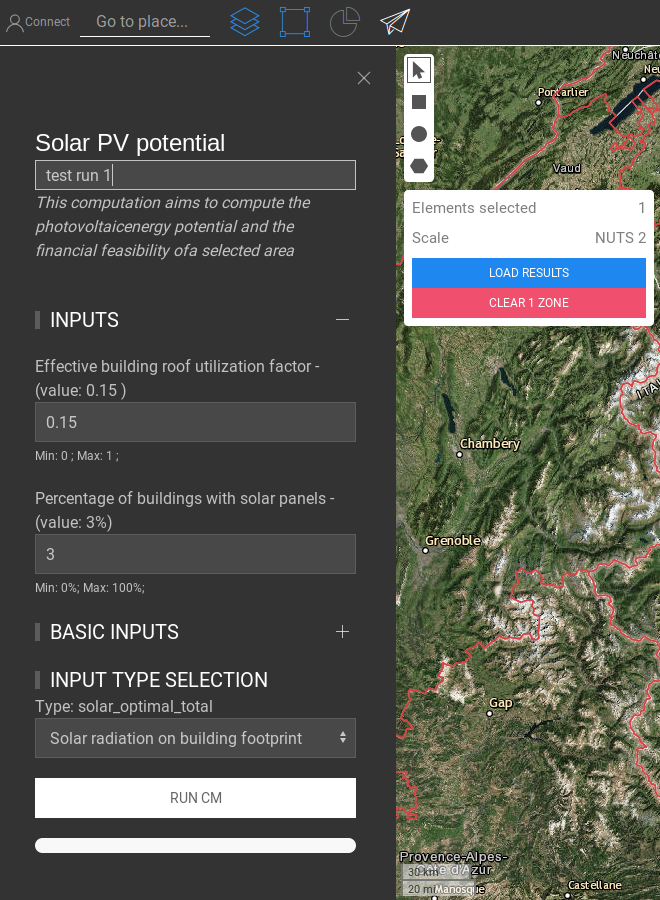

<h1> <a class="anchor" id="cm-solar-thermal-and-pv-potential" href="#cm-solar-thermal-and-pv-potential"><i class="fa fa-link"></i></a> CM Solarthermie und PV-Potenzial </h1><h2> <a class="anchor" id="table-of-contents" href="#table-of-contents"><i class="fa fa-link"></i></a> Inhaltsverzeichnis </h2><ul><li> <a href="#in-a-glance">In einem Blick</a> </li><li> <a href="#introduction">Einführung</a> </li><li> <a href="#inputs-and-outputs">Eingänge und Ausgänge</a> </li><li> <a href="#method">Methode</a> <ul><li> <a href="#method_example">Beispiel</a> </li></ul></li><li> <a href="#github-repository-of-this-calculation-module">GitHub-Repository dieses Berechnungsmoduls</a> </li><li> <a href="#sample-run">Probelauf</a> <ul><li> <a href="#sample-run_test-run-1-default-input-values">Testlauf 1: Standardeingabewerte</a> </li><li> <a href="#sample-run_test-run-2-modified-input-values">Testlauf 2: geänderte Eingabewerte</a> </li></ul></li><li> <a href="#how-to-cite">Wie zu zitieren</a> </li><li> <a href="#authors-and-reviewers">Autoren und Rezensenten</a> </li><li> <a href="#license">Lizenz</a> </li><li> <a href="#acknowledgement">Wissen</a> </li></ul><h2> <a class="anchor" id="in-a-glance" href="#in-a-glance"><i class="fa fa-link"></i></a> In einem Blick </h2>
 Dieses Modul berechnet das Energieversorgungspotenzial und die damit verbundenen Kosten für auf dem Dach installierte Solarthermie- und PV-Systeme in einem definierten Bereich. Die Eingaben in das Modul sind Rasterdateien des Gebäudegrundrisses und der Sonneneinstrahlung, der Kosten und der Effizienz von Referenz-Solarthermie- und PV-Systemen sowie der Anteile der nutzbaren Dachfläche, auf der Solarthermie- und PV-Systeme installiert sind. 

 <a href="#table-of-contents"><strong><code>To Top</code></strong></a> 
 <h2> <a class="anchor" id="introduction" href="#introduction"><i class="fa fa-link"></i></a> Einführung </h2>
 Das Berechnungsmodul zielt darauf ab, das solarthermische und das photovoltaische Energiepotential sowie die finanzielle Durchführbarkeit eines ausgewählten Gebiets zu berechnen, indem Folgendes berücksichtigt wird: 
<ul><li> die Installation neuer Solarthermie- / PV-Systeme auf einem Prozentsatz der verfügbaren Flächen (die Standardfläche ist die Gebäudegrundfläche), </li><li> Bewertung der finanziellen Durchführbarkeit neuer Anlagen. </li></ul>
 <a href="#table-of-contents"><strong><code>To Top</code></strong></a> 
 <h2> <a class="anchor" id="inputs-and-outputs" href="#inputs-and-outputs"><i class="fa fa-link"></i></a> Eingänge und Ausgänge </h2>
 Die Eingabeparameter und -ebenen sowie die Ausgabeebenen und -parameter sind wie folgt. 

 <strong>Eingabeebenen und Parameter sind:</strong> 
<ul><li> Rasterdatei: <ul><li> mittlere jährliche Sonneneinstrahlung [kWh / m 2 ], </li><li> mit der Fläche für die Solarenergienutzung. Das Standard-Raster verwendet die Building-Footprint-Rasterdatei [m 2 ]. </li></ul></li><li> Prozentsatz der verfügbaren Fläche, die mit Sonnenkollektoren abgedeckt werden kann [%], </li><li> Referenzanlagenparameter: <ul><li> durchschnittliche installierte Spitzenleistung pro Anlage [kW_p], </li><li> Systemeffizienz, Wert zwischen 0 und 1 [-], </li><li> Die Sonneneinstrahlung bei Standardtestbedingungen beträgt 1 kW / m 2 . </li><li> Modulwirkungsgrad bei Standardprüfbedingungen [kW m 2 ]. </li></ul></li></ul>
 <strong>Ausgabeebenen und Parameter sind:</strong> 
<ul><li> Gesamtkosten für die Abdeckung des ausgewählten Bereichs mit PV-Modulen [Währung] </li><li> Jährliche Gesamtenergieerzeugung [MWh / Jahr] </li><li> Nivellierte Energiekosten [€ / kWh] </li><li> Rasterdatei mit den am besten geeigneten Bereichen für die PV-Energieerzeugung </li></ul>
 <a href="#table-of-contents"><strong><code>To Top</code></strong></a> 
 <h2> <a class="anchor" id="method" href="#method"><i class="fa fa-link"></i></a> Methode </h2>
 Ausgehend von der verfügbaren Fläche und der Art der PV-Technologie berechnet das Modul die PV-Energieerzeugung unter folgenden Annahmen: 
<ul><li> Optimale Neigung der PV-Anlage; </li><li> Fläche der PV-Module entspricht dem vom Benutzer gewählten Prozentsatz der Gebäudegrundfläche; </li><li> Einzigartig ausgewählte Technologie für alle installierten PV-Systeme; </li><li> Standardmäßige Systemeffizienz von 0,75. </li></ul>
 Diese Annahmen wurden getroffen, um eine Planungsphase für eine Region und nicht den Entwurf einer bestimmten PV-Anlage zu berücksichtigen. 

 Die jährliche Energieabgabe wird unter Berücksichtigung der räumlichen Verteilung der jährlichen Sonnenstrahlung auf dem Gebäudegrundriss abgeleitet. Die PV-Energieerzeugung wird für eine einzelne repräsentative Anlage berechnet. Die repräsentativste installierte Spitzenleistung für eine PV-Anlage ist ein Eingang des Moduls. Folglich werden die von einer einzelnen Pflanze bedeckte Oberfläche und die Gesamtzahl der Pflanzen berechnet. 

 Schließlich wird die am besten geeignete Fläche unter Berücksichtigung der Dächer mit höherer Energieerzeugung berechnet. Bei der Energieerzeugung jedes Pixels wird berücksichtigt, dass nur ein Bruchteil der Dächer gleich f_roof ist. Das Integral der Energieerzeugung des am besten geeigneten Gebiets ist gleich der Gesamtenergieerzeugung des ausgewählten Gebiets. 

 <a href="#table-of-contents"><strong><code>To Top</code></strong></a> 
 <h3> <a class="anchor" id="example" href="#example"><i class="fa fa-link"></i></a> Beispiel </h3>
 Um ein praktisches Beispiel zu geben, wird die CM-Logik / -Methode auf einen vordefinierten Bereich angewendet. Standardmäßig ist der von uns verwendete Eingabebereich der Footprint der Gebäude. So zum Beispiel die Stadt Bozen (Italien), da ein großer Teil der Stadt das historische Zentrum ist (in dem keine Sonnenkollektoren installiert werden können), können wir schätzen, dass nur 1 Dach pro 5 zum Sammeln von Sonnenenergie verwendet werden kann (~ 20%). Wenn Sie stattdessen einen Bereich bereitstellen, der für die Implementierung eines Solarfelds verfügbar ist, können Sie festlegen, dass 100% des Bereichs für das Sonnensystem verwendet werden können. 

 Welcher Bereich der 20% der Dächer in Bozen kann mit PV-Modulen abgedeckt werden? Das gesamte Dach abzudecken ist nicht realistisch, da ein Teil des Daches keine geeignete Ausrichtung hat. Da das Gebäude in der Regel 4 Seiten hat, können wir uns vorstellen, dass rund 25% des Daches eine gute Ausrichtung haben (zumindest in Bozen, wo die meisten Dächer nicht eben sind und 2 oder 4 Dachneigungen haben). Trotzdem haben wir Schatteneffekte von den umliegenden Bäumen, Gebäuden, Bergen usw. und lassen im Allgemeinen etwas Platz nahe der Dachgrenze. Stellen wir uns also vor, dass 50% des gut ausgerichteten Daches von PV genutzt werden können (25) % * 50% = 12,5%), der Standardwert ist etwas optimistischer (15%). 

 Im Falle eines Solarfeldes nimmt der PV-String im Allgemeinen etwa 40-50% der Fläche ein, um den Schatteneffekt zwischen PV-Strings zu vermeiden. 

 <a href="#table-of-contents"><strong><code>To Top</code></strong></a> 
 <h4> <a class="anchor" id="example-with-a-pv-system-on-a-building-footprint" href="#example-with-a-pv-system-on-a-building-footprint"><i class="fa fa-link"></i></a> Beispiel mit einer PV-Anlage auf einem Gebäudegrundriss </h4>
 Als Beispiel erläutern wir die Methodik für ein einzelnes Pixel (1 Hektar Fläche). Das CM wendet für jedes Pixel in dem vom Benutzer ausgewählten Bereich dieselbe Logik an. Die Standardschicht (die Gebäudegrundfläche) hat eine Pixelabmessung von 100 x 100 m, daher steht eine Fläche von 10000 m² zur Verfügung. Stellen Sie sich für dieses Beispiel vor, dass nur 3000 m² Dächer im Pixel verfügbar sind. Der andere fehlende Teil der Oberfläche ist die Oberfläche, die Routen, Grünflächen, Flüssen usw. gewidmet ist. Die vom CM implementierte Logik lautet: 
<ul><li> Wenden Sie den ersten Prozentsatz an, um nur die Dächer zu erhalten, auf denen ich das System hosten kann: <code>available_surface = 3000 [m²] * 20% = 600 [m²]</code> </li><li> Die Oberfläche, die wirklich von PV-Anlagen bedeckt werden kann, wird auf 12,5% geschätzt, daher: <code>available_pv_surface = 600 [m²] * 12.5% = 75 [m²]</code> </li><li> Dann verwenden wir die Informationen des PV-Wirkungsgrads (standardmäßig 0,15), um die Oberfläche zu berechnen, die für eine einzelne PV-Anlage erforderlich ist (standardmäßig 3 kWp). <code>single_pv_surface = 3 [kWp] / 0.15 = 20 [m²]</code> </li><li> Dann berechnen wir die Anzahl der PV-Systeme, die in dem Pixel installiert werden können: <code>n_pv_plants = 75 [m²] // 20 [m²] = 3</code> und daher werden 3 Anlagen mit 3 kWp auf dem Pixel von 100 mal 100 installiert m (also 9 kWp), und dann multiplizieren wir diesen Wert mit der von 1 kWp erzeugten Energie und multiplizieren mit dem Wirkungsgrad der PV-Systeme (Wechselrichter und Übertragung, standardmäßig: 0,85), um die vom Pixel erzeugte Gesamtenergie zu erhalten: <code>pv_energy = solar_radiation [kWh/kWp/year] * 9 [kWp] * 0.85</code> </li></ul>
 <a href="#table-of-contents"><strong><code>To Top</code></strong></a> 
 <h4> <a class="anchor" id="example-with-a-solar-pv-field" href="#example-with-a-solar-pv-field"><i class="fa fa-link"></i></a> Beispiel mit einem Solar-PV-Feld </h4>
 Jetzt haben wir ein Pixel von 100x100m, das für ein PV-Feldsystem verfügbar ist: 
<ul><li> Wie bereits erwähnt, beträgt der erste Prozentsatz 100%, da in der gesamten Fläche die PV-Anlage untergebracht werden kann: <code>available_surface = (100 x 100) [m²] * 100% = 10000 [m²]</code> </li><li> Die Oberfläche, die von PV-Anlagen abgedeckt werden kann, ist: <code>available_pv_surface = 10000 m² * 50% = 5000 m²</code> </li><li> Dann verwenden wir die Informationen des PV-Wirkungsgrads (standardmäßig 0,15), um die Oberfläche zu berechnen, die für eine einzelne PV-Anlage erforderlich ist (standardmäßig 3 kWp). <code>single_pv_surface = 3 [kWp] / 0.15 = 20 [m²]</code> </li><li> Dann berechnen wir die Anzahl der Systeme, die in dem Pixel installiert werden können: <code>n_pv_plants = 5000 // 20 = 250</code> und daher werden 250 Anlagen mit 3 kWp auf einem Pixel von 100 x 100 m (also 750 kWp) installiert sein. und dann multiplizieren wir diesen Wert mit der stündlichen Energie, die von 1 kWp erzeugt wird, und multiplizieren mit dem Wirkungsgrad der PV-Systeme (Wechselrichter und Übertragung, standardmäßig: 0,85), um die vom Pixel <code>pv_energy = solar_radiation [kWh/kWp/year] * 750 kWp * 0.85</code> zu erhalten: <code>pv_energy = solar_radiation [kWh/kWp/year] * 750 kWp * 0.85</code> </li></ul>
 <a href="#table-of-contents"><strong><code>To Top</code></strong></a> 
 <h4> <a class="anchor" id="example-with-a-pv-&amp;-st-system-on-a-building-footprint" href="#example-with-a-pv-&amp;-st-system-on-a-building-footprint"><i class="fa fa-link"></i></a> Beispiel mit einem PV &amp; ST-System auf einem Gebäudegrundriss </h4>
 Die Gebäudefläche, die genutzt werden kann, ist eine begrenzte Ressource. Daher ist es nicht möglich, mit einer PV-Anlage dieselbe Oberfläche zum Sammeln von Sonnenenergie zu verwenden und gleichzeitig eine Solarthermie zu verwenden. Wenn wir uns an das vorherige Beispiel erinnern, haben wir bereits 75 m² Fläche für PV. Wir haben geschätzt, dass das gut ausgerichtete Dach 25% der Gesamtfläche ausmacht, und daher stehen uns noch weitere 75 [m²] zur Verfügung. Wir können nur einen Bruchteil verwenden, sagen wir mal 7,5%. Dies bedeutet, dass, wenn wir 25% des Daches mit einer guten Exposition betrachten, wir davon ausgehen, dass 12,5% für die PV und 7,5% für ST bestimmt sind und daher 20% der 25% verwendet werden. 

 Um ein praktisches Beispiel zu geben: 
<ul><li> Wenden Sie den ersten Prozentsatz an, um nur die Dächer zu erhalten, auf denen ich das System hosten kann: <code>available_surface = 3000 [m²] * 20% = 600 [m²]</code> </li><li> Die Oberfläche, die von ST-Systemen wirklich abgedeckt werden kann, ist: 600 m² * 7,5% = 67,5 m² <code>available_st_surface = 600 [m²] * 7.5% = 45 [m²]</code> Beachten Sie, dass <code>75 + 45 = 120 [m²]</code> kleiner als die ist geschätzte Oberfläche, die eine gute Exposition haben könnte ( <code>available_surface * 25% = 150 [m²]</code> Oberfläche <code>available_surface * 25% = 150 [m²]</code> ). </li><li> Dann verwenden wir die Informationen der ST-Oberfläche, die von einem ST-System benötigt werden (standardmäßig 5 m²), um die Anzahl der ST-Pflanzen zu berechnen: <code>n_st_plants = 45 [m²] // 5 [m²] = 9</code> </li><li> dann berechnen wir die installierte Fläche von ST-Anlagen: st_surface = 9 * 5 m² = 45 [m²] ` </li><li> und jetzt wenden wir die globale Sonnenstrahlung (kWh / m²) durch die bedeckte Oberfläche durch den Wirkungsgrad der ST- <code>solar_radiation [kWh/m²] * 45 [m²] * 0.85</code> (standardmäßig 0,85) an: <code>solar_radiation [kWh/m²] * 45 [m²] * 0.85</code> </li></ul>
 <a href="#table-of-contents"><strong><code>To Top</code></strong></a> 
 <h2> <a class="anchor" id="github-repository-of-this-calculation-module" href="#github-repository-of-this-calculation-module"><i class="fa fa-link"></i></a> GitHub-Repository dieses Berechnungsmoduls </h2>
 <a href="https://github.com/HotMaps/solar_potential/tree/develop">Hier erhalten</a> Sie die neueste Entwicklung für dieses Berechnungsmodul. 

 <a href="#table-of-contents"><strong><code>To Top</code></strong></a> 
 <h2> <a class="anchor" id="test-run-1" href="#test-run-1"><i class="fa fa-link"></i></a> Testlauf 1 </h2>
 Hier wird das Berechnungsmodul für die Region Lombardei in Italien (NUTS2) ausgeführt. 
<ul><li> Wählen Sie zuerst Nuts2 und den ausgewählten Bereich aus. </li></ul> Abb. 1: Wählen Sie eine Region aus <ul><li>
 Befolgen Sie die in der folgenden Abbildung gezeigten Schritte: 
<ul><li> Klicken Sie auf die Schaltfläche &quot;Ebenen&quot;, um das Fenster &quot;Ebenen&quot; zu öffnen: </li><li> Klicken Sie auf die Registerkarte &quot;BERECHNUNGSMODUL&quot;. </li><li> Klicken Sie auf die Schaltfläche &quot;SOLAR PV POTENTIAL&quot;. </li></ul></li><li>
 Jetzt öffnet sich das &quot;Solar PV Potential&quot; und ist betriebsbereit. 
</li></ul>
 <a href="#table-of-contents"><strong><code>To Top</code></strong></a> 
 <h2> <a class="anchor" id="sample-run" href="#sample-run"><i class="fa fa-link"></i></a> Probelauf </h2><h3> <a class="anchor" id="test-run-1--default-input-values" href="#test-run-1--default-input-values"><i class="fa fa-link"></i></a> Testlauf 1: Standardeingabewerte </h3>
 Die Standardeingabewerte berücksichtigen die Möglichkeit, dachmontierte PV-Module an Gebäuden zu installieren. Diese Werte beziehen sich auf eine Anlage mit 3 kWp. Möglicherweise müssen Sie Werte unter oder über den Standardwerten festlegen, um zusätzliche lokale Überlegungen und Kosten zu berücksichtigen. Daher sollte der Benutzer diese Werte anpassen, um die beste Kombination von Schwellenwerten für seine Fallstudie zu finden. 

 Führen Sie die folgenden Schritte aus, um das Berechnungsmodul auszuführen: 
<ul><li> Weisen Sie der Laufsitzung einen Namen zu (optional - hier haben wir &quot;Testlauf 1&quot; gewählt) und legen Sie die Eingabeparameter fest (hier wurden Standardwerte verwendet). </li></ul><ul><li> Warten Sie, bis der Vorgang abgeschlossen ist. </li><li> Als Ausgabe werden Indikatoren und Diagramme im Fenster &quot;ERGEBNISSE&quot; angezeigt. Die Indikatoren zeigen: <ul><li> Gesamtenergieerzeugung, </li><li> Gesamteinrichtungskosten, </li><li> Anzahl der installierten Systeme, </li><li> Nivellierte Energiekosten. </li></ul></li></ul><ul><li> Außerdem wird der Leinwand eine neue Ebene hinzugefügt, die die Gebäude mit höherem Energiepotential zeigt. Diese Ebene wird der Liste der Ebenen unter der Kategorie &quot;Berechnungsmodul&quot; hinzugefügt. Der Name der Laufsitzung unterscheidet die Ausgaben dieses Laufs von anderen. Wenn Sie die Standardebenen abgewählt und TEST RUN 1 ausgewählt haben, können Sie die am besten geeigneten Bereiche für die Installation von PV-Anlagen anzeigen. </li></ul>
 <a href="#table-of-contents"><strong><code>To Top</code></strong></a> 
 <h3> <a class="anchor" id="test-run-2--modified-input-values" href="#test-run-2--modified-input-values"><i class="fa fa-link"></i></a> Testlauf 2: geänderte Eingabewerte </h3>
 Abhängig von Ihrer Erfahrung und Ihren lokalen Kenntnissen können Sie die Eingabewerte erhöhen oder verringern, um bessere Ergebnisse zu erzielen. Sie können die für PV-Anlagen geeignete Gebäudefläche vergrößern. 
<ul><li>
 Weisen Sie der Laufsitzung einen Namen zu (optional - hier haben wir &quot;Testlauf 2&quot; gewählt) und stellen Sie die Eingabeparameter ein. Prozentsatz der Gebäude mit Sonnenkollektoren gleich 50. Dies bedeutet, dass wir 50% der verfügbaren Gebäudedächer abdecken. Beachten Sie, dass der Benutzer auch den effektiven Gebäudedachnutzungsfaktor festlegen kann, da jedes Pixel mehr als ein Gebäude darstellen kann und wir nicht das gesamte Dach mit PV-Modulen abdecken. Der Standardwert ist 0.15. Dies bedeutet, dass nur 15% der Dachfläche in einem Pixel von PV-Modulen bedeckt sind. 
</li><li>
 Warten Sie, bis der Vorgang abgeschlossen ist. 
</li><li>
 Als Ausgabe werden Indikatoren und Diagramme im Fenster &quot;ERGEBNISSE&quot; angezeigt. Die Indikatoren zeigen: 
<ul><li> Gesamtenergieerzeugung, </li><li> Gesamteinrichtungskosten, </li><li> Anzahl der installierten Systeme, </li><li> Nivellierte Energiekosten. </li></ul></li></ul>
 <a href="#table-of-contents"><strong><code>To Top</code></strong></a> 
 <h2> <a class="anchor" id="how-to-cite" href="#how-to-cite"><i class="fa fa-link"></i></a> Wie zu zitieren </h2>
 Giulia Garegnani, im Hotmaps-Wiki, CM-Solar-PV-Potenzial (April 2019) 

 <a href="#table-of-contents"><strong><code>To Top</code></strong></a> 
 <h2> <a class="anchor" id="authors-and-reviewers" href="#authors-and-reviewers"><i class="fa fa-link"></i></a> Autoren und Rezensenten </h2>
 Diese Seite wurde von Giulia Garegnani ( <strong><a href="http://www.eurac.edu">EURAC</a></strong> ) geschrieben. 

 ☑ Diese Seite wurde von Mostafa Fallahnejad ( <strong><a href="https://eeg.tuwien.ac.at/">EEG - TU Wien</a></strong> ) überprüft. 

 <a href="#table-of-contents"><strong><code>To Top</code></strong></a> 
 <h2> <a class="anchor" id="license" href="#license"><i class="fa fa-link"></i></a> Lizenz </h2>
 Copyright © 2016-2020: Giulia Garegnani 

 Creative Commons Namensnennung 4.0 Internationale Lizenz 

 Diese Arbeit unterliegt den Bestimmungen einer Creative Commons CC BY 4.0 International License. 

 SPDX-Lizenz-ID: CC-BY-4.0 

 Lizenztext: https://spdx.org/licenses/CC-BY-4.0.html 

 <a href="#table-of-contents"><strong><code>To Top</code></strong></a> 
 <h2> <a class="anchor" id="acknowledgement" href="#acknowledgement"><i class="fa fa-link"></i></a> Wissen </h2>
 Wir möchten dem Horizon 2020 <a href="https://www.hotmaps-project.eu">Hotmaps-Projekt</a> (Finanzhilfevereinbarung Nr. 723677), das die Mittel für die Durchführung der vorliegenden Untersuchung <a href="https://www.hotmaps-project.eu">bereitstellte</a> , unsere tiefste Anerkennung <a href="https://www.hotmaps-project.eu">aussprechen</a> . 

 <a href="#table-of-contents"><strong><code>To Top</code></strong></a> 
 

<!--- THIS IS A SUPER UNIQUE IDENTIFIER -->

This page was automatically translated. View in another language:

[English](../en/CM-Solar-thermal-and-PV-potential) (original)  [Italian](../it/CM-Solar-thermal-and-PV-potential)\* 

\* machine translated
