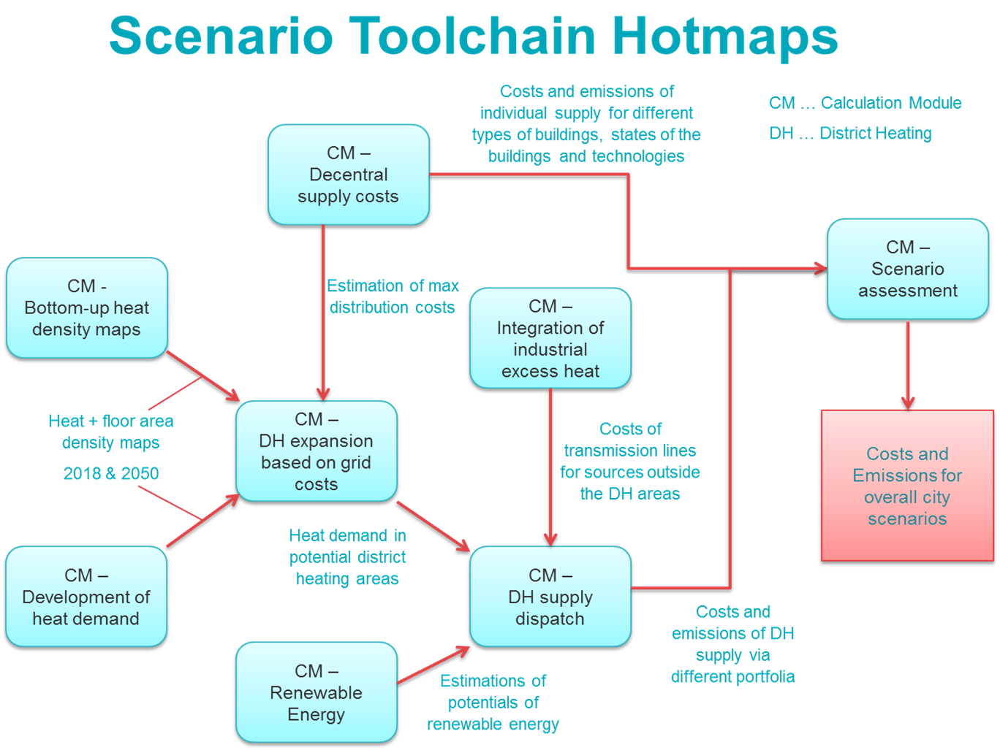
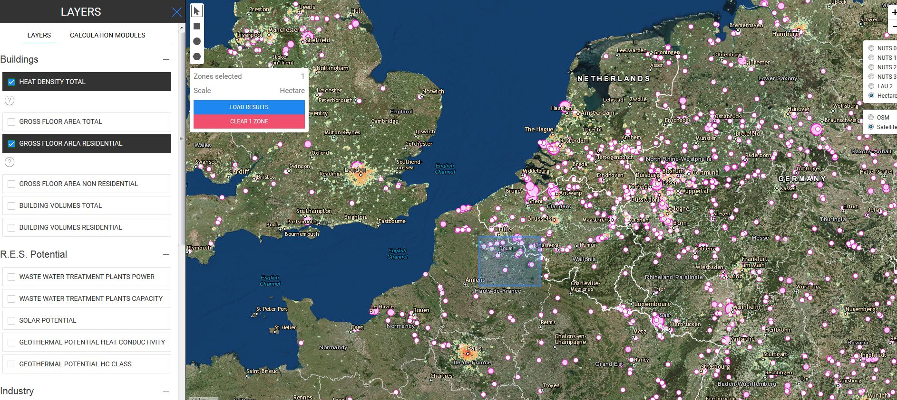

<h1> <a class="anchor" id="welcome!" href="#welcome!"><i class="fa fa-link"></i></a> Herzlich willkommen! </h1>## Hotmaps-Toolbox 
 Das Heizen und Kühlen in Wohn- und Industriebereichen macht die Hälfte des Energieverbrauchs der EU aus. Mehr als 80% des Heizens und Kühlens wird immer noch aus fossilen Brennstoffen erzeugt [ <a href="#references">1</a> ]. Inzwischen sind auch die Wärmeverluste deutlich hoch. Dieser Sektor muss transformiert werden! 

 Hotmaps bietet eine Open-Source-Online-Software, die die Planungsprozesse des Energiesektors auf lokaler und nationaler Ebene auf transparente Weise unterstützt. Auf dieser Website können Sie innerhalb von 5 Minuten eine erste Schätzung des Heiz- und Kühlbedarfs in jeder europäischen Region sowie des lokalen Potenzials für erneuerbare Energien zur Deckung dieses Bedarfs bereitstellen. Anschließend können durch Verwendung detaillierterer Daten und Anwendung von Hotmaps-Berechnungsmodulen viel umfassendere Heiz- und Kühlstrategien erarbeitet werden. Dank dieser Software können Sie praktische Entscheidungen in Ihrem Interessengebiet (Dorf, Stadt, Stadt, Region usw.) treffen. Die Anwendbarkeit von Hotmaps wurde in sieben Pilotbereichen nachgewiesen und demonstriert. 

 Die Hotmaps-Toolbox wurde von führenden Forschungseinrichtungen in ganz Europa zusammen mit Stadtverwaltungen entwickelt. Gehen Sie auf die Website, indem Sie <a href="https://www.hotmaps.eu/map">HIER</a> klicken, und entdecken Sie die klimaneutrale Energiezukunft Ihrer Stadt. 
<h2> <a class="anchor" id="hotmaps-wiki" href="#hotmaps-wiki"><i class="fa fa-link"></i></a> Hotmaps Wiki </h2>
 Das Hotmaps-Wiki enthält die Dokumentation, Anleitung und das Handbuch der Hotmaps-Toolbox. Es besteht aus folgenden Hauptteilen: 
<ol><li> <strong>Datensätze,</strong> </li><li> <strong>Allgemeine Toolbox-Funktionen,</strong> </li><li> <strong>Berechnungsmodule,</strong> </li><li> <strong>Wie wende ich die Hotmaps-Toolbox an?</strong> </li><li> <strong>Entwickler</strong> . </li></ol>
 Diese Abschnitte sind auf allen Wiki-Seiten in der Seitenleiste verfügbar. 

 Der Abschnitt <strong>Datensätze</strong> enthält Informationen zu Hotmaps-Datensatz-Repositorys sowie Methoden zum Sammeln dieser Datensätze. 

 Der Abschnitt <strong>Allgemeine Werkzeugfunktionen und -struktur</strong> führt den Benutzer durch die Oberfläche der Toolbox. Der Abschnitt behandelt alle allgemeinen Aspekte der Toolbox, die sich auf die Benutzererfahrung beziehen, z. B. Navigieren durch verschiedene Teile der Toolbox, Ebenenauswahl, Abrufen von Indikatoren, Funktionen zum Hochladen und Exportieren von Daten usw. 

 Der Abschnitt <strong>Berechnungsmodule</strong> enthält eine ausführliche Erläuterung der Konzepte und Methoden hinter den Berechnungsmodulen. Neben der Erläuterung der Methodik helfen die bereitgestellten Beispiele und Testläufe für jedes Berechnungsmodul dem Benutzer, ein Verständnis der Eingabeparameter und Ausgabeergebnisse zu erhalten. Einige Berechnungsmodule sind in die Toolbox integriert, andere sind eigenständig. 

 Der Abschnitt &quot; <strong>Wie wende ich die Hotmaps-Toolbox an?</strong> &quot; <strong>Ist</strong> einer der wichtigsten Abschnitte dieses Wikis. Es unterstützt Hotmaps-Benutzer bei der Planung von Heizungen und Kühlungen mit der Hotmaps-Toolbox und enthält Richtlinien zur Verwendung von Hotmaps auf lokaler und nationaler Ebene sowie Schulungsmaterialien. Dieser Abschnitt zeigt, wie verschiedene Berechnungsmodule verwendet werden können, um verschiedene Aspekte des Heiz- und Kühlsystems und verschiedene Forschungsfragen zu analysieren. Darüber hinaus wird gezeigt, wie die Berechnungsmodule auch als Werkzeugkette verwendet werden können, um Szenarien zum Heizen und Kühlen bestimmter Bereiche abzuleiten. Diese Toolchain ist unten schematisch dargestellt: 

 ! [] (../ images / Hotmaps_toolchain_2019-05-09.png = 684x) 

 Weitere Unterstützung bei der Planung von Heizung und Kühlung finden Sie in den Hotmaps-Handbüchern und auf der Seite Schulungsmaterial: 
<ul><li> <a href="https://www.hotmaps-project.eu/wp-content/uploads/2019/04/Summary-Hotmaps-Handbook.pdf">Zusammenfassung der Hotmaps-Handbücher für die strategische Wärmeplanung</a> </li><li> <a href="https://vbn.aau.dk/da/publications/definition-amp-experiences-of-strategic-heat-planning">Handbuch 1 - Definition und Erfahrungen der strategischen Wärmeplanung</a> </li><li> <a href="https://vbn.aau.dk/da/publications/guidance-for-the-comprehensive-assessment-of-efficient-heating-an">Handbuch 2 - Anleitung zur umfassenden Bewertung der effizienten Heizung und Kühlung</a> </li><li> <a href="https://vbn.aau.dk/da/publications/appendix-report-to-the-hotmaps-handbook-for-strategic-heat-planni">Anhang Bericht zum Handbuch für die strategische Wärmeplanung: Fallbeschreibungen</a> </li><li> <a href="https://wiki.hotmaps.hevs.ch/Training-Material">Übungsmaterial</a> </li></ul>
 Der Abschnitt <strong>Entwickler</strong> enthält alle Informationen, die Entwickler benötigen, um zur Hotmaps-Toolbox beizutragen oder um zu verstehen, wie sie funktioniert. Es erklärt die IT-Infrastruktur der Hotmaps-Toolbox, die Datensatzintegration, den Beitrag zur Entwicklung von Berechnungsmodulen usw. 

 <strong>Das Hotmaps-Wiki ist ein lebendiges Dokument</strong> , dh es wächst mit der Hotmaps-Toolbox. Die Hotmaps-Entwickler aktualisieren weiterhin die Hotmaps-Wiki-Seiten, indem sie neue Updates, Verbesserungen, Funktionen und Berechnungsmodule einführen. Bitte verwenden Sie diese <a href="Guidelines-for-writing-a-Hotmaps-Wiki-page">Richtlinien, um eine Hotmaps-Wiki-Seite zu schreiben</a> . 

 Wir wünschen Ihnen viel Spaß beim Erkunden der Toolbox und finden sie hilfreich für Ihre Heiz- und Kühlplanung! 

 <strong>Viel Spaß beim Entdecken der HOTMAPS TOOLBOX!</strong> 

<h2> <a class="anchor" id="references" href="#references"><i class="fa fa-link"></i></a> Verweise </h2>
 [1] EU-H2020-Projekt: Kartierung und Analyse des gegenwärtigen und zukünftigen Einsatzes von Heiz- / Kühlbrennstoffen (2020 - 2030) (fossile / erneuerbare Energien). WP1-Bericht. 2016. Zugriff über https://ec.europa.eu/energy/sites/ener/files/documents/Report%20WP1.pdf 

<ins> <code><strong><a href="#hotmaps-toolbox">To Top</a></strong></code> </ins> 
<h2> <a class="anchor" id="how-to-cite" href="#how-to-cite"><i class="fa fa-link"></i></a> Wie zu zitieren </h2>
 Das Hotmaps-Team im Hotmaps-Wiki, Begrüßungsseite (September 2020) 

<ins> <code><strong><a href="#hotmaps-toolbox">To Top</a></strong></code> </ins> 
<h2> <a class="anchor" id="authors-and-reviewers" href="#authors-and-reviewers"><i class="fa fa-link"></i></a> Autoren und Rezensenten </h2>
 Diese Seite wurde vom Hotmaps-Team geschrieben und zwar von: 

 <strong><a href="https://eeg.tuwien.ac.at/">EEG - TU Wien</a></strong> : Lukas Kranzl, Mostafa Fallahnejad, Jeton Hasani 

 <strong><a href="https://www.crem.ch/">CREM</a></strong> : Thierry Bernhard, Lesly Houndole und Albain Dufils 

 <strong><a href="https://e-think.ac.at">E-Think</a></strong> : Marcus Hummel, Andreas Müller, Giulia Conforto, David Schmidinger 

 <strong><a href="http://www.eurac.edu">EURAC</a></strong> : Pietro Zambelli, Giulia Garegnani und Simon Pezzutto 

 <strong><a href="https://isi.fraunhofer.de/">Fraunhofer ISI</a></strong> : Ali Aydemir, David Schilling, Lisa Neusel, Tobias Fleiter 

 <strong><a href="https://www.hevs.ch">HES-SO</a></strong> : Daniel Hunacek, Lucien Zuber, Matthieu Dayer 

 <strong><a href="https://planenergi.dk/">Planenergie</a></strong> : Anders M. Odgaard 

 ☑ Diese Seite wurde von Giulia Conforto überprüft. 

 <a href="#table-of-contents"><strong><code>To Top</code></strong></a> 
 <h2> <a class="anchor" id="license" href="#license"><i class="fa fa-link"></i></a> Lizenz </h2>
 Copyright © 2016-2020: Lukas Kranzl, Mostafa Fallahnejad, Jeton Hasani, Thierry Bernhard, Lesly Houndole und Albain Dufils, Marcus Hummel, Giulia Conforto, David Schmidinger, Pietro Zambelli, Giulia Garegnani, Ali Aydemir, David Schilling, Lisa Neusel, Tobias Fleiter Daniel Hunacek, Lucien Zuber, Matthieu Dayer. 

 Creative Commons Namensnennung 4.0 Internationale Lizenz 

 Diese Arbeit unterliegt den Bestimmungen einer Creative Commons CC BY 4.0 International License. 

 SPDX-Lizenz-ID: CC-BY-4.0 

 Lizenztext: https://spdx.org/licenses/CC-BY-4.0.html 

<ins> <code><strong><a href="#hotmaps-toolbox">To Top</a></strong></code> </ins> 
<h2> <a class="anchor" id="acknowledgement" href="#acknowledgement"><i class="fa fa-link"></i></a> Wissen </h2>
 Wir möchten dem Horizon 2020 <a href="https://www.hotmaps-project.eu">Hotmaps-Projekt</a> (Finanzhilfevereinbarung Nr. 723677), das die Mittel für die Durchführung der vorliegenden Untersuchung <a href="https://www.hotmaps-project.eu">bereitstellte</a> , unsere tiefste Anerkennung <a href="https://www.hotmaps-project.eu">aussprechen</a> . 

<ins> <code><strong><a href="#hotmaps-toolbox">To Top</a></strong></code> </ins> 

<!--- THIS IS A SUPER UNIQUE IDENTIFIER -->

This page was automatically translated. View in another language:

[English](../en/Home) (original)  

\* machine translated
