<h1><a class="anchor" id="introduction-to-user-interface" href="#introduction-to-user-interface"><i class="fa fa-link"></i></a>Einführung in die Benutzeroberfläche</h1><h2><a class="anchor" id="table-of-contents" href="#table-of-contents"><i class="fa fa-link"></i></a> Inhaltsverzeichnis</h2><ul><li>
 <a href="#introduction-page">Einführungsseite</a>
</li><li>
 <a href="#upper-toolbar">Obere Symbolleiste</a>
<ul><li> <a href="#upper-toolbar_connect">Verbinden</a><ul><li> <a href="#upper-toolbar_connect_login">Einloggen</a></li><li> <a href="#upper-toolbar_connect_register">Registrieren</a></li><li> <a href="#upper-toolbar_connect_recover">Genesen</a></li></ul></li><li> <a href="#upper-toolbar_go-to-place">Gehe zu Platz</a></li><li> <a href="#upper-toolbar_layers">Schichten</a></li><li> <a href="#upper-toolbar_selection-tools">Auswahlwerkzeuge</a></li><li> <a href="#upper-toolbar_show-result">Zeige Ergebnis</a></li><li> <a href="#upper-toolbar_feedback">Feedback</a></li><li> <a href="#upper-toolbar_save-session">Sitzung speichern</a></li><li> <a href="#upper-toolbar_save-session-folder">Sitzungsordner speichern</a></li></ul></li><li>
 <a href="#tiles">Fliesen</a>
</li><li>
 <a href="#how-to-cite">Wie zu zitieren</a>
</li><li>
 <a href="#authors-and-reviewers">Autoren und Rezensenten</a>
</li><li>
 <a href="#license">Lizenz</a>
</li><li>
 <a href="#acknowledgement">Wissen</a>
</li></ul><h2><a class="anchor" id="introduction-page" href="#introduction-page"><i class="fa fa-link"></i></a> Einführungsseite</h2>
 Sobald die Toolbox geöffnet ist, wird die Seite mit dem Haftungsausschluss angezeigt. Neben der Haftungsausschlussnachricht werden zusätzliche Informationen zu unterstützten Browsern, den Zielen des Hotmaps-Projekts, dem Link zur Hotmaps-Projektwebsite und den Datenrepositorys bereitgestellt.

<a name="Fig1">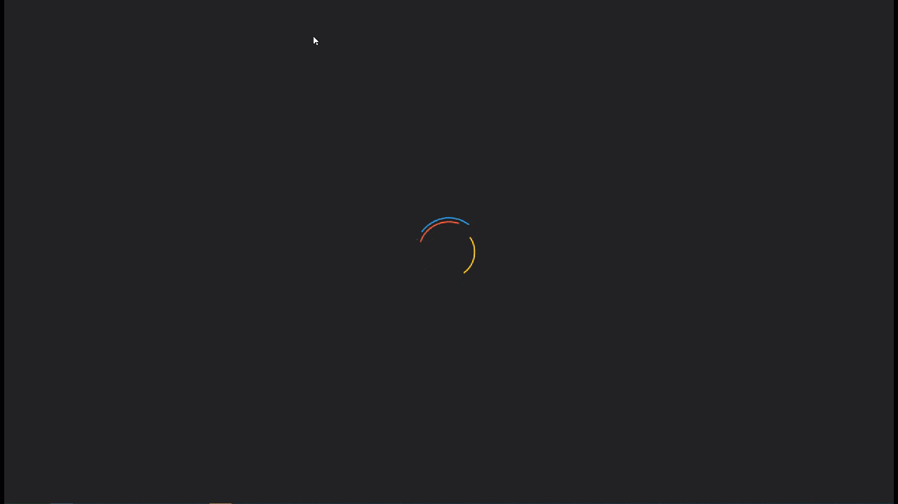</a> <em>Abb. 1 Kurze Einführung in die Hotmaps-Toolbox</em>

 Die Hotmaps-Benutzeroberfläche ist eine GIS-basierte Schnittstelle. Durch Schließen der Haftungsausschlussseite sieht der Benutzer die Europakarte. Standardmäßig ist die Karte der Wärmebedarfsdichte der EU-28-Länder und der NUTS 2-Grenzen dargestellt. Zusätzlich zu diesen beiden Karten werden einige Tools und Schaltflächen in der GUI angezeigt. Diese Werkzeuge sind in der folgenden Abbildung dargestellt.

<a name="Fig2">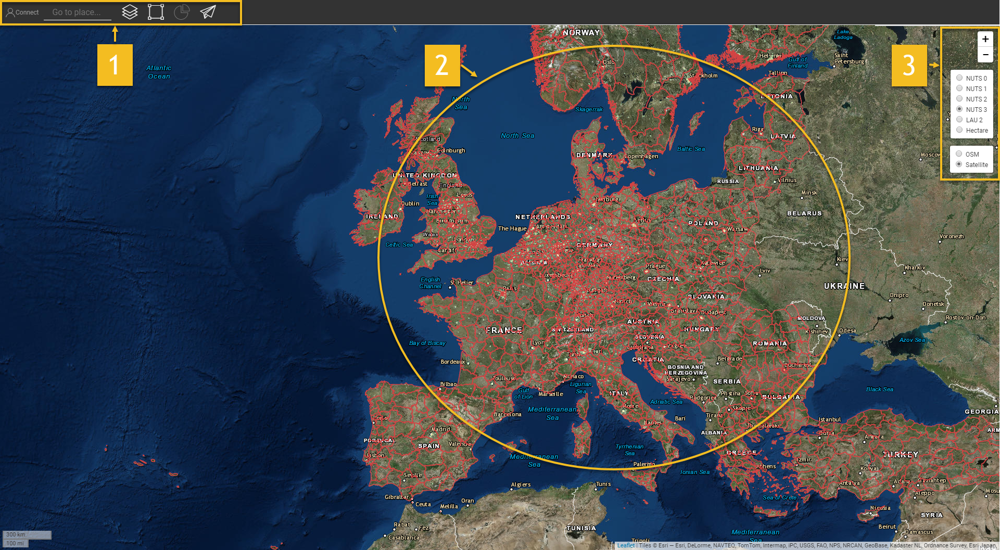</a> <em>Abb. 2 Startseite</em>

 Hier sehen Sie auf den ersten Blick 3 Teile der Benutzeroberfläche:
<ol><li> <a href="#upper-toolbar">eine Symbolleiste oben links</a> ,</li><li> die Karte selbst,</li><li> <a href="#tiles">Einige Tools zum Ändern des Kartenstils</a> .</li><li> Zwei Links oben rechts: zu diesem <a href="https://wiki.hotmaps.eu/">Hotmaps-Wiki</a> und zur <a href="https://www.hotmaps-project.eu/">Hotmaps-Projekt-Website</a> .</li></ol>
 In den folgenden Kapiteln werden die ersten 3 Punkte ausführlich erläutert.

 <a href="#table-of-contents"><strong><code>To Top</code></strong></a>
<h2><a class="anchor" id="upper-toolbar" href="#upper-toolbar"><i class="fa fa-link"></i></a> Obere Symbolleiste</h2>
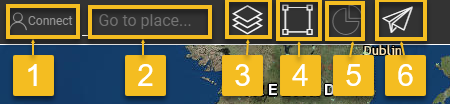

 Mit dieser Symbolleiste können Sie:
<ol><li> <a href="#upper-toolbar_connect"><em>Verbinden:</em></a> Registrieren Sie sich und melden Sie sich bei der Webanwendung an, um Ihre Arbeit zu speichern.</li><li> <a href="#upper-toolbar_go-to-place"><em>Gehe zu Ort:</em></a> Zoomen Sie in eine bestimmte Region, indem Sie den Namen eingeben.</li><li> <a href="#upper-toolbar_layers"><em>Ebenen:</em></a> Zeigen Sie die Seitenleiste der Ebene an.</li><li> <a href="#upper-toolbar_selection-tools"><em>Auswahlhilfen:</em></a> aktivieren oder deaktivieren Sie die Auswahl - Werkzeuge,</li><li> <a href="#upper-toolbar_show-result"><em>Ergebnis anzeigen: Zeigt</em></a> die Ergebnisseitenleiste Ihrer ausgewählten Regionen an.</li><li> <a href="#upper-toolbar_feedback"><em>Feedback:</em></a> Geben Sie uns Feedback zum Tool.</li><li> <a href="#upper-toolbar_save-session"><em>Sitzung speichern:</em></a> Sie können ausgewählte Ebenen und Zoomstufen speichern und später wieder aufrufen.</li><li> <a href="#upper-toolbar_save-session-folder"><em>Sitzungsordner speichern:</em></a> Hier sehen Sie die Liste aller gespeicherten Sitzungen.</li></ol>
 <a href="#table-of-contents"><strong><code>To Top</code></strong></a>
<h3><a class="anchor" id="connect" href="#connect"><i class="fa fa-link"></i></a> Verbinden</h3>
 Hier kannst du:
<ul><li> Ein Konto erstellen</li><li> Melden Sie sich in Ihrem Konto an, um Ihren Fortschritt zu speichern</li><li> Oder setzen Sie Ihr Passwort zurück, wenn Sie es vergessen haben</li></ul>
 <a href="#table-of-contents"><strong><code>To Top</code></strong></a>
<h4><a class="anchor" id="login" href="#login"><i class="fa fa-link"></i></a> Einloggen</h4>
 Nach der <a href="#register">Registrierung</a> und Aktivierung Ihres Kontos sollten Sie sich mit Ihrer E-Mail-Adresse und Ihrem Passwort anmelden können (siehe <a href="#fig4">Abb</a> . <a href="#fig4">4</a> unten).

<a name="Fig4">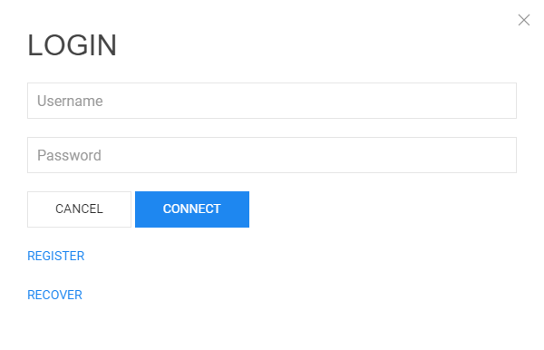</a>

 <em>Abb.4.: Anmeldeformular</em>

 <a href="#table-of-contents"><strong><code>To Top</code></strong></a>
<h4><a class="anchor" id="register" href="#register"><i class="fa fa-link"></i></a> Registrieren</h4>
 Hier können Sie ein Konto für die <em>Hotmaps-</em> Website <em>erstellen</em> . Nach dem Absenden des <a href="#fig5">Formulars</a> erhalten Sie eine E-Mail zur Aktivierung Ihres Kontos. Mit Ihrem Konto können Sie Ihren Fortschritt speichern.

<a name="Fig5">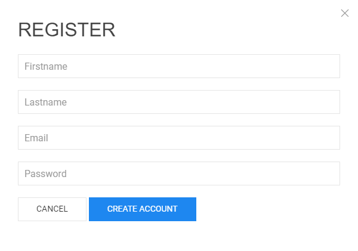</a>

 <em>Abb.5.: Anmeldeformular</em>

 <a href="#table-of-contents"><strong><code>To Top</code></strong></a>
<h4><a class="anchor" id="recover" href="#recover"><i class="fa fa-link"></i></a> Genesen</h4>
 Wenn Sie Ihr Passwort jemals vergessen haben, können Sie es in diesem Menü <a href="#fig6">wiederherstellen</a> (siehe <a href="#fig6">Abb. 6</a> unten). Bitte beachten Sie anschließend ein neues Passwort.

<a name="Fig6">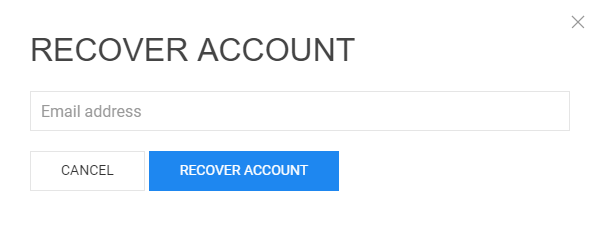</a>

 <em>Abb.6.: Formular wiederherstellen</em>

 <a href="#table-of-contents"><strong><code>To Top</code></strong></a>
<h3><a class="anchor" id="go-to-place" href="#go-to-place"><i class="fa fa-link"></i></a> Gehe zu Platz</h3>
 Sie können auf eine bestimmte Region zoomen, indem Sie deren Namen eingeben (siehe Animation unten).

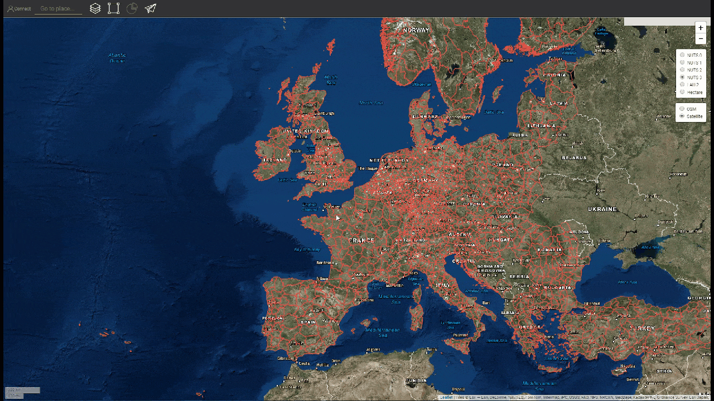

 <a href="#table-of-contents"><strong><code>To Top</code></strong></a>
<h3><a class="anchor" id="layers" href="#layers"><i class="fa fa-link"></i></a> Schichten</h3>
 Durch Drücken dieser Schaltfläche wird links eine Seitenleiste mit verschiedenen Ebenen angezeigt.

 Folgende Ebenen können gefunden und visualisiert werden:

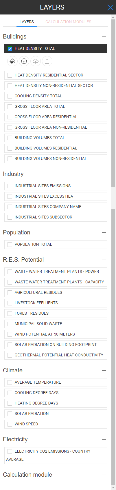

 <a href="#table-of-contents"><strong><code>To Top</code></strong></a>
<h3><a class="anchor" id="selection-tools" href="#selection-tools"><i class="fa fa-link"></i></a> Auswahlwerkzeuge</h3>
 Durch Drücken dieser Taste werden die Auswahlwerkzeuge links auf Ihrem Bildschirm angezeigt

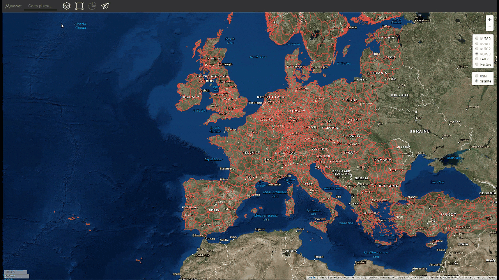

 Die folgende Abbildung zeigt das Erscheinungsbild der Werkzeuge:

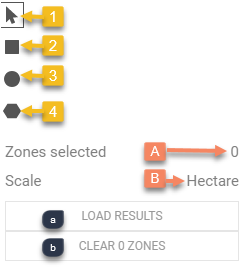
<ol><li> Werkzeug zur Auswahl von Regionen</li><li> Erstellen Sie einen benutzerdefinierten quadratischen Bereich</li><li> Erstellen Sie einen benutzerdefinierten Kreisbereich</li><li> Erstellen Sie einen benutzerdefinierten Polygonbereich</li><li> Laden Sie ein GeoJSON-Objekt hoch, um eine benutzerdefinierte Bereichsauswahl zu verwenden</li></ol><ol type="A"><li> Zeigt an, wie viele Regionen Sie ausgewählt haben</li><li> zeigt die Gesamtfläche des kleinsten Rechtecks, das den ausgewählten Bereich abdecken kann</li><li> Zeigt den Maßstab an, den Sie in der rechten Symbolleiste ausgewählt haben</li></ol><ol type="a"><li> Schaltfläche zum Laden der Ergebnisse Ihrer ausgewählten Region und der ausgewählten Ebenen</li><li> Schaltfläche zum Löschen einer ausgewählten Region</li></ol>
 <a href="#table-of-contents"><strong><code>To Top</code></strong></a>
<h3><a class="anchor" id="show-result" href="#show-result"><i class="fa fa-link"></i></a> Zeige Ergebnis</h3>
 Abhängig von den Ebenen und Regionen, die Sie für Ihre Konfiguration ausgewählt haben, werden die Ergebnisse in einer Seitenleiste rechts auf dem Bildschirm angezeigt

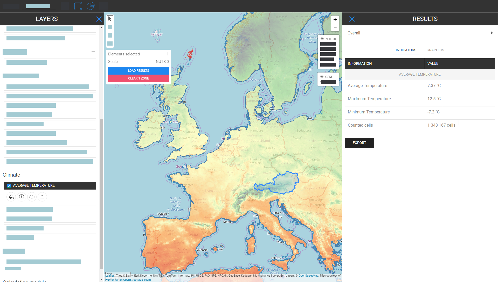

 <a href="#table-of-contents"><strong><code>To Top</code></strong></a>
<h3><a class="anchor" id="feedback" href="#feedback"><i class="fa fa-link"></i></a> Feedback</h3>
 Haben Sie Vorschläge zur Verbesserung des Tools? Haben Sie Fehler bemerkt? Informieren Sie uns bitte! Indem Sie uns Feedback geben, können Sie uns helfen, die Toolbox zu verbessern!

 Bitte füllen Sie das folgende <a href="#Fig7">Formular aus</a> :

 <a href="#table-of-contents"><strong><code>To Top</code></strong></a><a name="Fig7">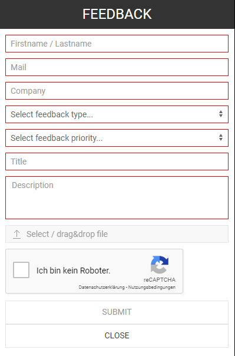</a>

 Sie können aus folgenden Typen wählen:

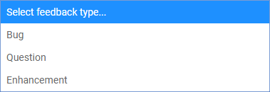

 und setzen Sie eine Priorität:

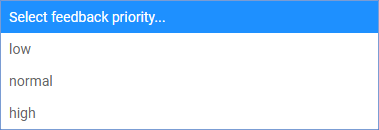

 <a href="#table-of-contents"><strong><code>To Top</code></strong></a>
<h3><a class="anchor" id="save-session" href="#save-session"><i class="fa fa-link"></i></a> Sitzung speichern</h3>
 Durch Drücken dieser Schaltfläche können Sie eine Momentaufnahme Ihrer Arbeit erstellen (ausgewählte Bereiche und Ebenen, Zoomstufen usw.). Sie können auch einen Namen und eine Beschreibung des Schnappschusses definieren.
<h3><a class="anchor" id="save-session-folder" href="#save-session-folder"><i class="fa fa-link"></i></a> Sitzungsordner speichern</h3>
 Hier sehen Sie alle Ihre Schnappschüsse mit Namen und Beschreibung. Wenn Sie eine auswählen, werden die ausgewählten Ebenen, Bereiche, die Zoomstufe und andere Konfigurationen geladen.
<h2><a class="anchor" id="tiles" href="#tiles"><i class="fa fa-link"></i></a> Fliesen</h2>
 Sie können den zu analysierenden Gebietsmaßstab (NUTS-Regionen oder Hektar) auswählen und die Kachel der Karte festlegen

 Es sind folgende Konfigurationen möglich

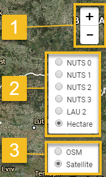
<ol><li> Vergrößern und verkleinern Sie die Karte</li><li> Zeigen Sie die NUTS-Grenzen an, um bestimmte NUTS-Regionen auszuwählen, oder verwenden Sie Hektar, um Ihre <a href="#upper-toolbar_selection-tools">Auswahl</a> anzupassen</li><li> Verwenden Sie die OpenStreetMap-Kachel oder die Satelite-Kachel</li></ol>
 <a href="#table-of-contents"><strong><code>To Top</code></strong></a>
<h2><a class="anchor" id="how-to-cite" href="#how-to-cite"><i class="fa fa-link"></i></a> Wie zu zitieren</h2>
 Jeton Hasani, im Hotmaps-Wiki, Einführung in die Benutzeroberfläche (April 2019)

 <a href="#table-of-contents"><strong><code>To Top</code></strong></a>
<h2><a class="anchor" id="authors-and-reviewers" href="#authors-and-reviewers"><i class="fa fa-link"></i></a> Autoren und Rezensenten</h2>
 Diese Seite wurde von Jeton Hasani <strong><a href="https://eeg.tuwien.ac.at/">EEG - TU Wien geschrieben</a></strong> .

 ☑ Diese Seite wurde von Mostafa Fallahnejad <strong><a href="https://eeg.tuwien.ac.at/">EEG - TU Wien</a></strong> bewertet.

 <a href="#table-of-contents"><strong><code>To Top</code></strong></a>
<h2><a class="anchor" id="license" href="#license"><i class="fa fa-link"></i></a> Lizenz</h2>
 Copyright © 2016-2020: Jeton Hasani

 Creative Commons Namensnennung 4.0 Internationale Lizenz

 Diese Arbeit unterliegt den Bestimmungen einer Creative Commons CC BY 4.0 International License.

 SPDX-Lizenz-ID: CC-BY-4.0

 Lizenztext: https://spdx.org/licenses/CC-BY-4.0.html

 <a href="#table-of-contents"><strong><code>To Top</code></strong></a>
<h2><a class="anchor" id="acknowledgement" href="#acknowledgement"><i class="fa fa-link"></i></a> Wissen</h2>
 Wir möchten dem Horizon 2020 <a href="https://www.hotmaps-project.eu">Hotmaps-Projekt</a> (Finanzhilfevereinbarung Nr. 723677), das die Mittel für die Durchführung der vorliegenden Untersuchung <a href="https://www.hotmaps-project.eu">bereitstellte</a> , unsere tiefste Anerkennung <a href="https://www.hotmaps-project.eu">aussprechen</a> .

 <a href="#table-of-contents"><strong><code>To Top</code></strong></a>

<!--- THIS IS A SUPER UNIQUE IDENTIFIER -->

This page was automatically translated. View in another language:

[English](../en/Introduction-to-user-interface) (original)  [Italian](../it/Introduction-to-user-interface)\* 

\* machine translated
