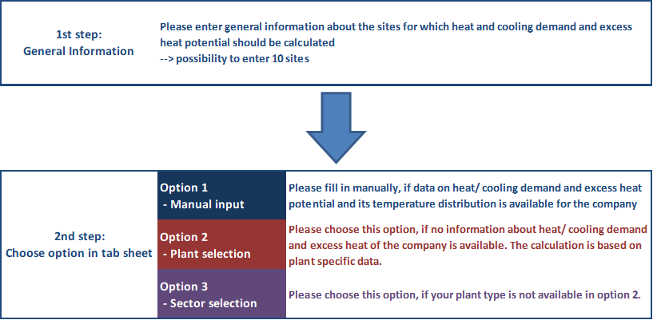

<h1><a class="anchor" id="cm-add-industry-plant" href="#cm-add-industry-plant"><i class="fa fa-link"></i></a>CM Προσθήκη βιομηχανικού εργοστασίου</h1><h2><a class="anchor" id="table-of-contents" href="#table-of-contents"><i class="fa fa-link"></i></a> Πίνακας περιεχομένων</h2><ul><li> <a href="#introduction">Εισαγωγή</a></li><li> <a href="#inputs-and-outputs">Είσοδοι και έξοδοι</a></li><li> <a href="#method">Μέθοδος</a></li><li> <a href="#github-repository-of-this-calculation-module">Αποθήκη GitHub αυτής της λειτουργικής μονάδας υπολογισμού</a></li><li> <a href="#references">βιβλιογραφικές αναφορές</a></li><li> <a href="#how-to-cite">Πώς να παραθέσω</a></li><li> <a href="#authors-and-reviewers">Συγγραφείς και κριτικοί</a></li><li> <a href="#license">Αδεια</a></li><li> <a href="#acknowledgement">Αναγνώριση</a></li></ul><h2><a class="anchor" id="introduction" href="#introduction"><i class="fa fa-link"></i></a> Εισαγωγή</h2>
 Αυτή η ενότητα παρέχει τη δυνατότητα προσθήκης πρόσθετων ιστότοπων της βιομηχανίας με τη ζήτηση θέρμανσης και ψύξης και το υπερβολικό δυναμικό θερμότητας στην εργαλειοθήκη Hotmaps. Είναι δυνατόν να προστεθούν επιπλέον βιομηχανίες υψηλής έντασης ενέργειας καθώς και λιγότερο ενεργειακής έντασης. Ο χρήστης εισάγει τα απαραίτητα δεδομένα σε ένα αυτόνομο εργαλείο Excel, το οποίο στη συνέχεια δημιουργεί ένα αρχείο CSV για μεταφόρτωση στην εργαλειοθήκη Hotmaps.

 <a href="#table-of-contents"><strong><code>To Top</code></strong></a>
<h2><a class="anchor" id="inputs-and-outputs" href="#inputs-and-outputs"><i class="fa fa-link"></i></a> Είσοδοι και έξοδοι</h2><h3><a class="anchor" id="important-pre-settings-before-using-the-tool" href="#important-pre-settings-before-using-the-tool"><i class="fa fa-link"></i></a> Σημαντικές προρυθμίσεις πριν χρησιμοποιήσετε το εργαλείο</h3>
 🔺<mark> <strong>Σημείωση:</strong> Για τη δημιουργία των αρχείων ( <em>.csv</em> ) στη σωστή μορφή, είναι απαραίτητο ο προεπιλεγμένος οριοθέτης να οριστεί ως κόμμα ( <strong>αγγλικό πρότυπο</strong> ). Αυτό <strong>δεν μπορεί να διαμορφωθεί από το Excel</strong> και πρέπει να γίνει παγκοσμίως από τον Πίνακα Ελέγχου των Windows (όπως περιγράφεται <a href="https://www.itsupportguides.com/knowledge-base/office-2013/excel-20132016-how-to-change-csv-delimiter-character/">εδώ</a> ). Το παρακάτω σχήμα δείχνει την υποδειγματική ρύθμιση για γερμανικά Windows windows.</mark>

 🔺<mark> <strong>Σημείωση:</strong> Για τη σωστή χρήση του εργαλείου που βασίζεται στο Excel, πρέπει να χρησιμοποιήσετε το <strong>σημείο</strong> ως δεκαδικός διαχωριστής (αγγλικό πρότυπο, π.χ. 40.50). Αυτό πρέπει να ρυθμιστεί από το Excel (όπως περιγράφεται <a href="https://support.microsoft.com/en-us/office/change-the-character-used-to-separate-thousands-or-decimals-c093b545-71cb-4903-b205-aebb9837bd1e">εδώ</a> ). Το παρακάτω σχήμα δείχνει την υποδειγματική ρύθμιση για το Γερμανικό Excel.</mark>
<h3><a class="anchor" id="data-input-in-excel-tool-by-user" href="#data-input-in-excel-tool-by-user"><i class="fa fa-link"></i></a> Εισαγωγή δεδομένων στο εργαλείο Excel από το χρήστη</h3>
 Κάντε λήψη του παρεχόμενου εργαλείου Excel από <a href="https://github.com/HotMaps/add_industry_plant_cm/blob/master/HotMaps_CM_Add_industry_plant_V14.xlsm">ΕΔΩ</a> .

 Η προσέγγιση σχετικά με τον τρόπο χρήσης του εργαλείου Excel απεικονίζεται στο παρακάτω σχήμα και περιγράφεται λεπτομερέστερα στις ακόλουθες ενότητες.
<figure><figcaption> <i> Βήμα προς βήμα προσέγγιση του τρόπου χρήσης του εργαλείου Excel.</i></figcaption></figure><h4><a class="anchor" id="1-add-general-information" href="#1-add-general-information"><i class="fa fa-link"></i></a> 1) Προσθέστε γενικές πληροφορίες</h4>
 Μεταβείτε στο φύλλο καρτέλας:<figure></figure>

 Στο πρώτο βήμα, εισαγάγετε όλες τις απαραίτητες γενικές πληροφορίες σχετικά με τους ιστότοπους για τους οποίους θα πρέπει να υπολογιστεί η ζήτηση θέρμανσης και ψύξης και το υπερβολικό δυναμικό θερμότητας. Είναι δυνατή η προσθήκη έως και 10 βιομηχανικών χώρων.
<figure><figcaption> <i> Παράδειγμα πίνακα excel για εισαγωγή γενικών πληροφοριών εταιρειών ως βάση για τον υπολογισμό και εισαγωγή στην εργαλειοθήκη HotMaps.</i></figcaption></figure><h4><a class="anchor" id="2-choose-calculation-option" href="#2-choose-calculation-option"><i class="fa fa-link"></i></a> 2) Ορίστε την επιλογή υπολογισμού</h4>
 Στο δεύτερο βήμα, υπάρχουν 3 επιλογές για τον τρόπο υπολογισμού της ζήτησης θέρμανσης και ψύξης και του υπερβολικού δυναμικού θερμότητας. Λάβετε υπόψη ότι είναι δυνατή η εναλλαγή μεταξύ των τριών επιλογών για τις διάφορες εταιρείες. αλλά όχι μέσα στην ίδια την εταιρεία.

 Όσον αφορά την υπερβολική θερμοκρασία θερμότητας, πρέπει να αναφερθεί ότι η θερμότητα χαμηλής θερμοκρασίας (&lt;100 ° C) μπορεί να εισαχθεί στο Excel-Tool, αλλά δεν έχει ακόμη αξιολογηθεί στην εργαλειοθήκη Hotmaps. Εάν πρέπει να ληφθεί υπόψη η θερμότητα χαμηλής θερμοκρασίας, είναι απαραίτητη η εφαρμογή αντλίας θερμότητας. Επομένως, ο χρήστης μπορεί να συμπεριλάβει τη ζήτηση ηλεκτρικής ενέργειας μιας αντλίας θερμότητας στην τελική ενεργειακή ζήτηση για ηλεκτρική ενέργεια και να ανυψώσει τη θερμοκρασία της παραγόμενης περίσσειας θερμότητας έως το εύρος των 100-200 ° C.
<h5><a class="anchor" id="option-1--manual-input" href="#option-1--manual-input"><i class="fa fa-link"></i></a> Επιλογή 1: Μη αυτόματη εισαγωγή</h5>
 Μεταβείτε στο φύλλο καρτέλας:<figure></figure>

 Ορίστε αυτήν την επιλογή, εάν υπάρχουν διαθέσιμα δεδομένα σχετικά με τη ζήτηση θέρμανσης / ψύξης και το υπερβολικό δυναμικό θέρμανσης και τη διανομή θερμοκρασίας για την επιλεγμένη εταιρεία και μπορούν να συμπληρωθούν χειροκίνητα.
<h5><a class="anchor" id="option-2--plant-selection" href="#option-2--plant-selection"><i class="fa fa-link"></i></a> Επιλογή 2: Επιλογή φυτού</h5>
 Μεταβείτε στο φύλλο καρτελών:<figure></figure>

 Ορίστε αυτήν την επιλογή, εάν δεν υπάρχουν διαθέσιμες πληροφορίες σχετικά με τη ζήτηση θέρμανσης / ψύξης και το υπερβολικό δυναμικό θέρμανσης για την επιλεγμένη εταιρεία. Με βάση τη συγκεκριμένη βάση δεδομένων του εργοστασίου, η τυπική ζήτηση θέρμανσης / ψύξης και το υπερβολικό δυναμικό θερμότητας με κατανομή θερμοκρασίας μπορούν να επιλεγούν για έναν αριθμό εγκαταστάσεων και προϊόντων / διεργασιών. Ως απαραίτητη εισαγωγή για τη μετατροπή των δεδομένων του συγκεκριμένου προϊόντος, πρέπει να εισαχθεί μια τιμή ως βάση υπολογισμού (π.χ. παραγωγή, έκταση κ.λπ.). Για περισσότερες πληροφορίες σχετικά με τη μέθοδο υπολογισμού, δείτε τη <a href="#method">Μέθοδο</a> .
<h5><a class="anchor" id="option-3--sector-selection" href="#option-3--sector-selection"><i class="fa fa-link"></i></a> Επιλογή 3: Επιλογή τομέα</h5>
 Μεταβείτε στο φύλλο καρτέλας:<figure></figure>

 Ορίστε αυτήν την επιλογή, εάν ο τύπος της εγκατάστασής σας δεν είναι διαθέσιμος στην επιλογή 2. Με βάση τα τομεακά δεδομένα θερμότητας, υπολογίζεται η τυπική ζήτηση θέρμανσης / ψύξης και το υπερβολικό δυναμικό θερμότητας. Ως απαραίτητη είσοδος, πρέπει να εισαχθεί η ζήτηση καυσίμου για παροχή θερμότητας (σε GWh / έτος). Για περισσότερες πληροφορίες σχετικά με τη μέθοδο υπολογισμού, δείτε τη <a href="#method">Μέθοδο</a> .
<h3><a class="anchor" id="data-upload-on-hotmaps-toolbox" href="#data-upload-on-hotmaps-toolbox"><i class="fa fa-link"></i></a> Μεταφόρτωση δεδομένων στην εργαλειοθήκη HotMaps</h3>
 Υπάρχουν 2 αρχεία (* .csv) που δημιουργούνται από το εργαλείο που βασίζεται στο Excel και μπορούν να μεταφορτωθούν στο λογαριασμό χρήστη στην εργαλειοθήκη Hotmaps.
<h4><a class="anchor" id="1-file-generation--subsector" href="#1-file-generation--subsector"><i class="fa fa-link"></i></a> 1) Δημιουργία αρχείων: Υποτομέας</h4>
 Μεταβείτε στο φύλλο καρτέλας:

 Εξαγάγετε τον πίνακα ως <em>.csv</em> κάνοντας κλικ στο:
<h4><a class="anchor" id="2-file-generation--excess-heat" href="#2-file-generation--excess-heat"><i class="fa fa-link"></i></a> 2) Δημιουργία αρχείων: Υπερβολική θερμότητα</h4>
 Μεταβείτε στο φύλλο καρτέλας:

 Εξαγάγετε τον πίνακα ως <em>.csv</em> κάνοντας κλικ στο:
<h4><a class="anchor" id="3-upload-to-the-hotmaps-toolbox" href="#3-upload-to-the-hotmaps-toolbox"><i class="fa fa-link"></i></a> 3) Μεταφόρτωση στο Hotmaps Toolbox</h4>
 Για να ανεβάσετε τα δύο αρχεία <em>.csv</em> , ανοίξτε την πλατφόρμα μεταφόρτωσης κάνοντας κλικ στο <strong>Λογαριασμός</strong> .

 Σε ένα επόμενο βήμα, επιλέξτε τα δύο αρχεία <em>.csv</em> για μεταφόρτωση και επιλέξτε τη σωστή κατηγορία μεταφόρτωσης για κάθε αρχείο.

 Τώρα μπορείτε να δείτε τα μεταφορτωμένα αρχεία σας στην ενότητα <strong>Επίπεδα - Προσωπικό επίπεδο</strong>

 <a href="#table-of-contents"><strong><code>To Top</code></strong></a>
<h2><a class="anchor" id="method" href="#method"><i class="fa fa-link"></i></a> Μέθοδος</h2>
 Εάν η ζήτηση θέρμανσης / ψύξης και το πλεονάζον θερμικό δυναμικό μιας εγκατάστασης δεν είναι γνωστά, δύο μέθοδοι που βασίζονται σε δείκτες προσφέρονται στον χρήστη για τον υπολογισμό της ζήτησης θερμότητας και του υπερβολικού δυναμικού θερμότητας.

 Πρέπει να αναφερθεί ότι αυτές οι τιμές είναι μόνο ενδεικτικές κατά προσέγγιση τιμές για τυπικές εγκαταστάσεις (επιλογή 2) ή σε επίπεδο τομέα (επιλογή 3) και δεν αντικαθιστούν μια λεπτομερή ανάλυση και μέτρηση της ζήτησης θερμότητας και της υπερβολικής θερμότητας μιας εγκατάστασης.
<h3><a class="anchor" id="method---option-2--plant-selection" href="#method---option-2--plant-selection"><i class="fa fa-link"></i></a> Μέθοδος - Επιλογή 2: Επιλογή φυτού</h3>
 Τα δεδομένα θερμότητας συγκεκριμένης εγκατάστασης λαμβάνονται από τη βάση δεδομένων Πρόβλεψης. Για μεγάλο αριθμό διαφορετικών τύπων εγκαταστάσεων υψηλής έντασης ενέργειας και λιγότερης έντασης ενέργειας, η ζήτηση θέρμανσης / ψύξης διεργασίας και το υπερβολικό δυναμικό θερμότητας προέρχονται από τη συγκεκριμένη τελική ενεργειακή ζήτηση καυσίμων και ηλεκτρικής ενέργειας. Είναι σημαντικό να σημειωθεί ότι λόγω της υποκείμενης βάσης δεδομένων μόνο η θερμότητα διεργασίας και η διαδικασία ψύξης καλύπτονται με αυτήν τη μέθοδο. Η θέρμανση χώρου και το ζεστό νερό δεν περιλαμβάνονται εδώ. Ανάλογα με τον τύπο της εγκατάστασης παρέχονται διαφορετικές εισροές ως βάση για τον υπολογισμό (π.χ. όγκος παραγωγής σε <em>τόνους</em> ή έκταση σε <em>m 2</em> ).

 Για τον υπολογισμό της ζήτησης θέρμανσης και ψύξης, είναι απαραίτητο να υπολογίσουμε την απόδοση μετατροπής από την τελική ενέργεια σε θερμότητα και ψύξη. Δεδομένου ότι οι περισσότερες από τις εφαρμογές θερμότητας βασίζονται σε ατμό, υποτίθεται απόδοση 90%. Για εφαρμογές ψύξης υπολογίζεται μια αναλογία ενεργειακής απόδοσης στάθμης θερμοκρασίας (EER):

 | Επίπεδο θερμοκρασίας | ανέλαβε EER (σύμφωνα με τη βάση δεδομένων προβλέψεων) | | --- | -------------: | | &lt;-30 ° C | 0,01 | | -30 ° C - 0 ° C | 1.8 | | 0 ° C - 15 ° C &amp;&gt; 15 ° C | 3.5 |

 Ολόκληρη η βάση δεδομένων που χρησιμοποιείται για την επιλογή 2 είναι διαθέσιμη εδώ: <a href="https://github.com/HotMaps/add_industry_plant_cm/blob/master/CM_add_industry_plant_databases.xlsx">Option2 Database</a>
<h3><a class="anchor" id="method---option-3--sector-selection" href="#method---option-3--sector-selection"><i class="fa fa-link"></i></a> Μέθοδος - Επιλογή 3: Επιλογή τομέα</h3>
 Η επιλογή 3 παρέχει μια ευρεία εκτίμηση της ζήτησης θερμότητας και της υπερβολικής θερμότητας για τους τομείς της μεταποιητικής βιομηχανίας (σύμφωνα με τη NACE αναθ. 2 [ <a href="#references">1</a> ]).
<h4><a class="anchor" id="calculation-of-excess-heat-potentials-on-a-sector-level" href="#calculation-of-excess-heat-potentials-on-a-sector-level"><i class="fa fa-link"></i></a> Υπολογισμός του πλεονάζοντος θερμικού δυναμικού σε επίπεδο τομέα</h4>
 Για τον υπολογισμό του πλεονάζοντος θερμικού δυναμικού των διαφόρων τομέων χρησιμοποιούνται υπερβολικοί συντελεστές θερμότητας σύμφωνα με τον Brückner 2016 [ <a href="#references">2</a> ] (βλέπε πίνακα παρακάτω). Ο υπερβολικός συντελεστής θερμότητας ορίζεται ως η απορριπτέα θερμότητα που παράγεται ανά κατανάλωση καυσίμου. Στο [ <a href="#references">2</a> ] τα διαθέσιμα δεδομένα για τον προσδιορισμό του πλεονάζοντος θερμικού δυναμικού στη μεταποιητική βιομηχανία προέρχονται από την έρευνα εκπομπών που διεξάγεται κάθε τέσσερα χρόνια σε κρατικό επίπεδο στη Γερμανία. Σύμφωνα με το διάταγμα για τη δήλωση εκπομπών (1. BImSchG), όλοι οι φορείς εκμετάλλευσης εγκαταστάσεων, οι οποίοι υπόκεινται σε έγκριση, πρέπει να υποβάλλουν δήλωση για τις εκπομπές τους κάθε τέσσερα χρόνια. Για το έτος 2008 αξιολογούνται στοιχεία για το επίπεδο της εταιρείας που αποτελούνται από ροές όγκου καυσαερίων και το επίπεδο θερμοκρασίας τους. Μαζί με τις διαθέσιμες πληροφορίες σχετικά με τον τύπο και την ποσότητα της κατανάλωσης καυσίμου των εγκαταστάσεων, ο υπερβολικός συντελεστής θερμότητας μιας μονάδας υπολογίζεται ως:

 <em>Υπερβολικός συντελεστής θερμότητας = υπερβολική κατανάλωση θερμότητας / καυσίμου</em>

 Τέλος, ο συντελεστής υπερβολικής θερμότητας υπολογίζεται όχι μόνο σε επίπεδο εταιρείας αλλά και σε επίπεδο τομέα. Για αναλυτικές πληροφορίες δείτε [ <a href="#references">2</a> ].

 Οι υπερβολικοί θερμικοί παράγοντες σύμφωνα με το [ <a href="#references">2</a> ] περιλαμβάνουν την υπερβολική θερμότητα που προέρχεται από τη θερμότητα της διεργασίας καθώς και την παραγωγή θερμότητας χώρου και ζεστό νερό. Αυτό οφείλεται στο γεγονός ότι μόνο μια ροή όγκου καυσαερίων που εξέρχεται από την εγκατάσταση αναλύεται χωρίς να διαχωρίζεται η κατανάλωση καυσίμου σε θέρμανση χώρου, ζεστό νερό και θερμότητα διεργασίας. Δεν περιλαμβάνεται η υπερβολική θερμότητα που παράγεται από εφαρμογές που βασίζονται σε ηλεκτρική ενέργεια.

 Η κατανομή του μεριδίου της περίσσειας θερμότητας ανά εύρος θερμοκρασίας βασίζεται σε δικές του υποθέσεις.

 | NACE αναθ. 2 | Τομέας | υπερβολικός συντελεστής θερμότητας | | --- | ------------- | -----: | | 10 | Κατασκευή προϊόντων διατροφής | 0.10 | | 11 | Παραγωγή ποτών | 0.14 | | 12 | Κατασκευή προϊόντων καπνού | 0.12 | | 13 | Κατασκευή υφασμάτων | 0,29 | | 14 | Κατασκευή ενδυμάτων | 0,06 | | 15 | Κατασκευή δέρματος και συναφών προϊόντων | 0,20 | | 16 | Κατασκευή ξύλου και προϊόντων από ξύλο και φελλό, εκτός από έπιπλα · κατασκευή ειδών από άχυρο και σπαρτοπλεκτική | 0.10 | | 17 | Κατασκευή χαρτιού και προϊόντων χαρτιού | 0,09 | | 18 | Εκτύπωση και αναπαραγωγή εγγεγραμμένων μέσων | 0,03 | | 20 | Κατασκευή χημικών και χημικών προϊόντων | 0,09 | | 21 | Παραγωγή βασικών φαρμακευτικών προϊόντων και φαρμακευτικών παρασκευασμάτων | 0,08 | | 22 | Κατασκευή προϊόντων από καουτσούκ και πλαστικά | 0.17 | | 23 | Κατασκευή άλλων μη μεταλλικών ορυκτών προϊόντων | 0.15 | | 24 | Κατασκευή βασικών μετάλλων | 0.19 | | 25 | Κατασκευή μεταλλικών προϊόντων, εκτός από μηχανήματα και εξοπλισμό | 0.19 | | 26 | Κατασκευή ηλεκτρονικών, ηλεκτρονικών και οπτικών προϊόντων | 0.18 | | 27 | Κατασκευή ηλεκτρικού εξοπλισμού | 0,31 | | 28 | Κατασκευή μηχανημάτων και εξοπλισμού π.δ.κ.α. | 0.16 | | 29 | Κατασκευή μηχανοκίνητων οχημάτων, ρυμουλκουμένων και ημιρυμουλκουμένων | 0.12 | | 30 | Κατασκευή άλλου εξοπλισμού μεταφοράς | 0,38 | | 31 | Κατασκευή επίπλων | 0.12 | | 32 | Άλλες κατασκευές | 0,08 | | 33 | Επισκευή και εγκατάσταση μηχανημάτων και εξοπλισμού | 0,05 |

 <em>Υπερβολικοί συντελεστές θερμότητας για τους τομείς της μεταποιητικής βιομηχανίας (σύμφωνα με [ <a href="#references">1</a> ])</em>
<h4><a class="anchor" id="calculation-of-heat-demand-on-a-sector-level" href="#calculation-of-heat-demand-on-a-sector-level"><i class="fa fa-link"></i></a> Υπολογισμός της ζήτησης θερμότητας σε τομεακό επίπεδο</h4>
 Η ανάλυση της τελικής ενεργειακής ζήτησης καυσίμων σε θερμοκρασίες κυμαίνεται σε επίπεδο τομέα βάσει μιας γερμανικής μελέτης (βάση δεδομένων για την αξιολόγηση των μέτρων ενεργειακής απόδοσης [ <a href="#references">3</a> ]). Για τον υπολογισμό της ζήτησης θερμότητας θεωρείται ότι σχεδόν όλες οι αγορές καυσίμων χρησιμοποιούνται για θερμότητα. Σύμφωνα με την επιλογή 2, θεωρείται ότι έχει αποδοτικότητα μετατροπής από τελική ενέργεια σε θερμότητα 90% για παραγωγή θερμότητας με ατμό.

 Ολόκληρη η βάση δεδομένων που χρησιμοποιείται για την επιλογή 3 είναι διαθέσιμη εδώ: <a href="https://github.com/HotMaps/add_industry_plant_cm/blob/master/CM_add_industry_plant_databases.xlsx">Option3 Database</a>

 <a href="#table-of-contents"><strong><code>To Top</code></strong></a>
<h2><a class="anchor" id="github-repository-of-this-calculation-module" href="#github-repository-of-this-calculation-module"><i class="fa fa-link"></i></a> Αποθήκη GitHub αυτής της λειτουργικής μονάδας υπολογισμού</h2>
 <a href="https://github.com/HotMaps/add_industry_plant_cm">Εδώ</a> θα βρείτε την ανάπτυξη αιχμής για αυτήν την ενότητα υπολογισμού.

 <a href="#table-of-contents"><strong><code>To Top</code></strong></a>
<h2><a class="anchor" id="references" href="#references"><i class="fa fa-link"></i></a> βιβλιογραφικές αναφορές</h2>
 [1]. Ευρωπαϊκή Επιτροπή: NACE αναθ. 2. Στατιστική ταξινόμηση των οικονομικών δραστηριοτήτων στην Ευρωπαϊκή Κοινότητα. Λουξεμβούργο, 2008. ISBN: 978-92-79-04741-1.

 [2]. Brückner S.: Industrielle Abwärme στο Deutschland. Διατριβή Technische Universtität München, 2016.

 [3]. Prognos AG, Fraunhofer ISI, TU München: Datenbasis zur Bewertung von Energieeffizienzmaßnahmen in der Zeitreihe 2005-2014. Im Auftrag des Umweltbundesamtes. Dessau, 2017. ISSN 1862-4359.

 <a href="#table-of-contents"><strong><code>To Top</code></strong></a>
<h2><a class="anchor" id="how-to-cite" href="#how-to-cite"><i class="fa fa-link"></i></a> Πώς να παραθέσω</h2>
 Ali Aydemir και Lisa Neusel, στο Hotmaps-Wiki, en-CM-Add-industry-plant (Σεπτέμβριος 2020)

 <a href="#table-of-contents"><strong><code>To Top</code></strong></a>
<h2><a class="anchor" id="authors-and-reviewers" href="#authors-and-reviewers"><i class="fa fa-link"></i></a> Συγγραφείς και κριτικοί</h2>
 Αυτή η σελίδα γράφτηκε από τους Ali Aydemir και Lisa Neusel ( <strong><a href="https://isi.fraunhofer.de/">Fraunhofer ISI</a></strong> ).

 ☑ Αυτή η σελίδα αξιολογήθηκε από τον Tobias Fleiter ( <strong><a href="https://isi.fraunhofer.de/">Fraunhofer ISI</a></strong> ).

 <a href="#table-of-contents"><strong><code>To Top</code></strong></a>
<h2><a class="anchor" id="license" href="#license"><i class="fa fa-link"></i></a> Αδεια</h2>
 Πνευματικά δικαιώματα © 2016-2020: Ali Aydemir και Lisa Neusel

 Creative Commons Attribution 4.0 Διεθνής άδεια

 Αυτό το έργο έχει άδεια βάσει της Creative Commons CC BY 4.0 International License.

 SPDX-License-Identifier: CC-BY-4.0

 License-Text: https://spdx.org/licenses/CC-BY-4.0.html

 <a href="#table-of-contents"><strong><code>To Top</code></strong></a>
<h2><a class="anchor" id="acknowledgement" href="#acknowledgement"><i class="fa fa-link"></i></a> Αναγνώριση</h2>
 Θα θέλαμε να εκφράσουμε τη βαθύτατη εκτίμησή μας στο <a href="https://www.hotmaps-project.eu">Πρόγραμμα Hotmaps</a> «Ορίζοντας 2020 <a href="https://www.hotmaps-project.eu">»</a> (Συμφωνία επιχορήγησης αριθμός 723677), το οποίο παρείχε τη χρηματοδότηση για τη διεξαγωγή της παρούσας έρευνας.

 <a href="#table-of-contents"><strong><code>To Top</code></strong></a>

<!--- THIS IS A SUPER UNIQUE IDENTIFIER -->

This page was automatically translated. View in another language:

[English](../en/CM-Add-industry-plant) (original) [Bulgarian](../bg/CM-Add-industry-plant)\* [Czech](../cs/CM-Add-industry-plant)\* [Danish](../da/CM-Add-industry-plant)\* [German](../de/CM-Add-industry-plant)\*  [Spanish](../es/CM-Add-industry-plant)\* [Estonian](../et/CM-Add-industry-plant)\* [Finnish](../fi/CM-Add-industry-plant)\* [French](../fr/CM-Add-industry-plant)\* [Irish](../ga/CM-Add-industry-plant)\* [Croatian](../hr/CM-Add-industry-plant)\* [Hungarian](../hu/CM-Add-industry-plant)\* [Italian](../it/CM-Add-industry-plant)\* [Lithuanian](../lt/CM-Add-industry-plant)\* [Latvian](../lv/CM-Add-industry-plant)\* [Maltese](../mt/CM-Add-industry-plant)\* [Dutch](../nl/CM-Add-industry-plant)\* [Polish](../pl/CM-Add-industry-plant)\* [Portuguese (Portugal, Brazil)](../pt/CM-Add-industry-plant)\* [Romanian](../ro/CM-Add-industry-plant)\* [Slovak](../sk/CM-Add-industry-plant)\* [Slovenian](../sl/CM-Add-industry-plant)\* [Swedish](../sv/CM-Add-industry-plant)\* 

\* machine translated
