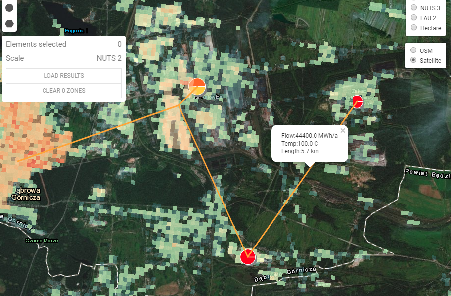

<h1><a class="anchor" id="cm-excess-heat-transport-potential" href="#cm-excess-heat-transport-potential"><i class="fa fa-link"></i></a>CM Υπερβολική δυνατότητα μεταφοράς θερμότητας</h1><h2><a class="anchor" id="table-of-contents" href="#table-of-contents"><i class="fa fa-link"></i></a> Πίνακας περιεχομένων</h2><ul><li> <a href="#in-a-glance">Με μια ματιά</a></li><li> <a href="#introduction">Εισαγωγή</a></li><li> <a href="#inputs-and-outputs">Είσοδοι και έξοδοι</a><ul><li> <a href="#inputs-and-outputs_input-layers-and-parameters">Επίπεδα και παράμετροι εισόδου</a></li><li> <a href="#inputs-and-outputs_output">Παραγωγή</a></li></ul></li><li> <a href="#method">Μέθοδος</a><ul><li> <a href="#method_overview">ΣΦΑΙΡΙΚΗ ΕΙΚΟΝΑ</a></li><li> <a href="#method_details">Λεπτομέριες</a></li><li> <a href="#method_implementation">Εκτέλεση</a></li></ul></li><li> <a href="#github-repository-of-this-calculation-module">Αποθήκη GitHub αυτής της λειτουργικής μονάδας υπολογισμού</a></li><li> <a href="#quick-start">Γρήγορη εκίνηση</a></li><li> <a href="#troubleshooting">Αντιμετώπιση προβλημάτων</a></li><li> <a href="#sample-run">Δείγμα εκτέλεσης</a></li><li> <a href="#how-to-cite">Πώς να παραθέσω</a></li><li> <a href="#authors-and-reviewers">Συγγραφείς και κριτικοί</a></li><li> <a href="#license">Αδεια</a></li><li> <a href="#acknowledgement">Αναγνώριση</a></li></ul><h2><a class="anchor" id="in-a-glance" href="#in-a-glance"><i class="fa fa-link"></i></a> Με μια ματιά</h2>
 Αυτή η ενότητα υπολογίζει τη ροή και το κόστος μετάδοσης θερμότητας από πιθανές υπερβολικές πηγές θερμότητας που βρίσκονται εκτός των πιθανών περιοχών τηλεθέρμανσης στην περιοχή τηλεθέρμανσης. Οι είσοδοι είναι ωριαία κατατομή φόρτωσης της υπερβολικής ροής θερμότητας και της ζήτησης τηλεθέρμανσης, η θέση της πλεονάζουσας πηγής θερμότητας και το πιθανό σύστημα τηλεθέρμανσης, το κόστος επένδυσης σε εναλλάκτες θερμότητας και γραμμές μεταφοράς και τιμές κατωφλίου για το κόστος απόστασης και μεταφοράς.

 <a href="#table-of-contents"><strong><code>To Top</code></strong></a>
<h2><a class="anchor" id="introduction" href="#introduction"><i class="fa fa-link"></i></a> Εισαγωγή</h2>
 Η Ενότητα Υπολογισμού &quot;Υπερβολική δυνατότητα μεταφοράς θερμότητας&quot; θα βοηθήσει τον χρήστη να εντοπίσει δυνατότητες ολοκλήρωσης για υπερβολική θερμότητα στα δίκτυα τηλεθέρμανσης. Οι δυνατότητες βασίζονται στο <a href="https://wiki.hotmaps.hevs.ch/en/CM-District-heating-potential-areas-user-defined-thresholds">Δυναμικό Θέρμανσης Επαρχίας</a> . Αυτό το CM προσδιορίζει περιοχές με ευνοϊκές συνθήκες για δίκτυα τηλεθέρμανσης και δείχνει πόση θερμότητα θα μπορούσε ενδεχομένως να καλυφθεί από βιομηχανική υπερβολική θερμότητα σε αυτές τις περιοχές. Ωστόσο, αυτό δεν σημαίνει ότι υπάρχει ήδη δίκτυο τηλεθέρμανσης σε αυτήν την περιοχή.

 Τα ακόλουθα δεδομένα και μέθοδοι συνδυάζονται για την προηγούμενη εργασία.

 Δεδομένα:
<ul><li>
 Απαιτήσεις θέρμανσης για κοντινές περιοχές με ευνοϊκές συνθήκες για δίκτυα τηλεθέρμανσης, τα οποία διαλύονται ανά ώρα (από το <a href="https://wiki.hotmaps.hevs.ch/en/CM-District-heating-potential-areas-user-defined-thresholds">Δυναμικό CM - District Heating</a> ).
</li><li>
 Στοιχεία σχετικά με τις υπερβολικές ποσότητες θερμότητας των βιομηχανικών εταιρειών στην περιοχή, οι οποίες επίσης επιλύονται ανά ώρα (από τη βιομηχανική βάση δεδομένων του συνόλου δεδομένων).
</li><li>
 Υποθέσεις σχετικά με το κόστος των εναλλακτών θερμότητας, αντλιών και αγωγών καθώς και απώλειες θερμότητας για αγωγούς τηλεθέρμανσης.
</li></ul>
 Μέθοδος (απλοποιημένη):
<ul><li> Σχεδιασμός αγωγών με βάση ένα ανεπτυγμένο ευρετικό, το οποίο αντιπροσωπεύει το πρόβλημα του σχεδιασμού ως πρόβλημα ροής δικτύου.</li></ul>
 Ο στόχος της μεθόδου είναι να αντιπροσωπεύει τη μεγαλύτερη δυνατή υπερβολική ροή θερμότητας με όχι πάρα πολλούς και έτσι πολύ μεγάλους αγωγούς προς τους πιθανούς χρήστες τηλεθέρμανσης, δημιουργώντας δίκτυα με μέγιστες ροές. Ωστόσο, ιδιαίτερα μη αποδοτικές γραμμές μεταφοράς (με χαμηλές ροές θερμότητας και επομένως υψηλό ειδικό κόστος μεταφοράς θερμότητας) δεν λαμβάνονται υπόψη στο τελικό δίκτυο. Το όριο για την οικονομική αποδοτικότητα των μεμονωμένων γραμμών μεταφοράς μπορεί να καθοριστεί από τον χρήστη (βλ. Κατώφλι γραμμής μεταφοράς).

 Το βασικό υπόβαθρο της προσέγγισης είναι το εξής: εάν υπάρχουν μόνο λίγες πηγές υπερβολικής θερμότητας, ένας αγωγός ανά πηγή θα μπορούσε πάντα να λαμβάνεται υπόψη για τη μεταφορά της θερμότητας σε μια κοντινή περιοχή με ευνοϊκές συνθήκες για τηλεθέρμανση. Ωστόσο, εάν υπάρχουν πολλές υπερβολικές πηγές θερμότητας που πρόκειται να ρέουν στην ίδια περιοχή, θα ήταν λογικό να συλλέξουμε τη θερμότητα και να τη μεταφέρουμε στην περιοχή σε έναν μεγαλύτερο κοινό αγωγό. Η προσέγγιση με έναν σωλήνα ανά πηγή τείνει να υπερεκτιμά την προσπάθεια για τους αγωγούς.

 Για να εξουδετερωθούν τα παραπάνω, το πρόβλημα του σχεδιασμού αγωγών προσεγγίστηκε υποθέτοντας ένα πρόβλημα ροής δικτύου. Χρησιμοποιείται μια ευρετική μέθοδος για την επίλυση του προβλήματος, στην οποία η υπερβολική θερμότητα μπορεί να συσσωρευτεί και να μεταφερθεί στους πιθανούς χρήστες. Ο συγκεκριμένος μεθοδολογικός σχεδιασμός της λύσης με την προσέγγιση του ελάχιστου span tree περιγράφεται στο αντίστοιχο μεθοδικό μέρος. Ο σχεδιασμός του αγωγού που καθορίστηκε στο προηγούμενο πλαίσιο δεν αντιπροσωπεύει, συνεπώς, λεπτομερή σχεδιασμό ή πραγματική καθοδήγηση διαδρομής, αλλά χρησιμοποιείται μόνο για την προσέγγιση των δαπανών για την κατανομή των υπερβολικών ποσοτήτων θερμότητας στις γειτονικές περιοχές με ευνοϊκές συνθήκες για δίκτυα τηλεθέρμανσης (βλ. <a href="https://wiki.hotmaps.hevs.ch/en/CM-District-heating-potential-areas-user-defined-thresholds">CM - Δυναμικό θέρμανσης περιοχής</a> , συνεκτικές περιοχές λέξεων-κλειδιών). Αυτή η προσέγγιση του κόστους αναφέρεται επομένως σε ολόκληρο το δίκτυο.

 Τα αποτελέσματα θα πρέπει πρώτα να ερμηνευθούν ως εξής: εάν οι καταγεγραμμένες υπερβολικές ποσότητες θερμότητας επρόκειτο να μεταφερθούν μαζί στις υποδεικνυόμενες γειτονικές περιοχές, τότε το κόστος για τη διανομή θερμότητας θα μπορούσε να είναι της τάξης του μεγέθους, όπως υποδεικνύεται από το εργαλείο (βλ. Τυποποιημένο κόστος παροχής θερμότητας). Κατά κανόνα, οι τιμές για ολόκληρο το δίκτυο είναι επίσης μια καλή ένδειξη εκκίνησης για μεμονωμένους αγωγούς. Ο σκοπός των αποτελεσμάτων είναι, επομένως, να παρασχεθεί ένας προγραμματιστής έργου ή ένας αρμόδιος για το σχεδιασμό μιας τάξης μεγέθους για πιθανό κόστος διανομής.

 <a href="#table-of-contents"><strong><code>To Top</code></strong></a>
<h2><a class="anchor" id="inputs-and-outputs" href="#inputs-and-outputs"><i class="fa fa-link"></i></a> Είσοδοι και έξοδοι</h2><h3><a class="anchor" id="input-layers-and-parameters" href="#input-layers-and-parameters"><i class="fa fa-link"></i></a> Επίπεδα και παράμετροι εισόδου</h3><h4><a class="anchor" id="provided-by-toolbox" href="#provided-by-toolbox"><i class="fa fa-link"></i></a> Παρέχεται από το Toolbox</h4><ul><li>
 Περιοχές τηλεθέρμανσης (παρέχονται τώρα άμεσα από το δυναμικό τηλεθέρμανσης CM)
</li><li>
 Βιομηχανική βάση δεδομένων (από προεπιλογή παρέχεται από την εργαλειοθήκη)
</li><li>
 Φόρτωση προφίλ για τη βιομηχανία
</li><li>
 Τοποθετήστε προφίλ για θέρμανση κατοικιών και ζεστό νερό οικιακής χρήσης
</li></ul><h4><a class="anchor" id="provided-by-the-user" href="#provided-by-the-user"><i class="fa fa-link"></i></a> Παρέχεται από τον χρήστη</h4><ul><li>
 Ελάχ. ζήτηση θερμότητας ανά εκτάριο

 Βλέπε <a href="https://wiki.hotmaps.hevs.ch/en/CM-District-heating-potential-areas-user-defined-thresholds">CM - Δυναμικό θέρμανσης περιοχής</a> .
</li><li>
 Ελάχ. ζήτηση θερμότητας σε μια περιοχή DH

 Βλέπε <a href="https://wiki.hotmaps.hevs.ch/en/CM-District-heating-potential-areas-user-defined-thresholds">CM - Δυναμικό θέρμανσης περιοχής</a> .
</li><li>
 Διάρκεια ζωής του εξοπλισμού σε χρόνια

 Το ισοπεδωμένο κόστος της θερμότητας αναφέρεται σε αυτήν τη χρονική περίοδο.
</li><li>
 Ποσοστό έκπτωσης σε%

 Επιτόκιο πίστωσης που απαιτείται για τη δημιουργία του δικτύου.
</li><li>
 Συντελεστής κόστους

 Συντελεστής προσαρμογής του κόστους δικτύου σε περίπτωση που οι προεπιλεγμένες τιμές δεν αντιπροσωπεύουν με ακρίβεια το κόστος. Οι απαραίτητες επενδύσεις για το δίκτυο πολλαπλασιάζονται με αυτόν τον παράγοντα. Το προεπιλεγμένο κόστος βρίσκεται στην ενότητα <a href="en-CM-Excess-heat-transport-potential#computation-of-costs">Υπολογισμός κόστους</a> .
</li><li>
 Λειτουργικά έξοδα σε%

 Λειτουργικά κόστη δικτύου ανά έτος. Στο ποσοστό των επενδύσεων που είναι απαραίτητες για το δίκτυο.
</li><li>
 Τιμή κατωφλίου για γραμμές μετάδοσης σε ct / kWh

 Το μέγιστο ισοσταθμισμένο κόστος θερμότητας κάθε μεμονωμένης γραμμής μετάδοσης. Αυτή η παράμετρος μπορεί να χρησιμοποιηθεί για τον έλεγχο του ισοσταθμισμένου κόστους θερμότητας για ολόκληρο το δίκτυο. Μια χαμηλότερη τιμή ισούται με το χαμηλότερο επίπεδο θερμότητας, αλλά και τη μείωση της υπερβολικής θερμότητας που χρησιμοποιείται και το αντίστροφο.
</li></ul><h4><a class="anchor" id="performance-parameters" href="#performance-parameters"><i class="fa fa-link"></i></a> Παράμετροι απόδοσης</h4><ul><li>
 Ανάλυση χρόνου

 Ορίζει το διάστημα μεταξύ των υπολογισμών ροής δικτύου καθ &#39;όλη τη διάρκεια του έτους. Μπορεί να είναι μία από αυτές τις τιμές: (ώρα, ημέρα, εβδομάδα, μήνας, έτος)
</li></ul>
 <a href="#table-of-contents"><strong><code>To Top</code></strong></a>
<h3><a class="anchor" id="output" href="#output"><i class="fa fa-link"></i></a> Παραγωγή</h3><h4><a class="anchor" id="layers" href="#layers"><i class="fa fa-link"></i></a> Επίπεδα</h4><ul><li>
 Γραμμές μετάδοσης

 Το Shapefile δείχνει τις προτεινόμενες γραμμές μετάδοσης με τη θερμοκρασία, την ετήσια ροή θερμότητας και το κόστος τους. Λεπτομέρειες μπορείτε να βρείτε εδώ.
</li></ul><h4><a class="anchor" id="indicators" href="#indicators"><i class="fa fa-link"></i></a> Δείκτες</h4><ul><li>
 Συνολική υπερβολική θερμότητα στην επιλεγμένη περιοχή σε GWh

 Συνολική πλεονάζουσα θερμότητα διαθέσιμη βιομηχανικών εγκαταστάσεων σε επιλεγμένη περιοχή και εγγύτητα.
</li><li>
 Υπερβολική θερμότητα συνδεδεμένη σε GWh

 Συνολική πλεονάζουσα θερμότητα διαθέσιμη βιομηχανικών εγκαταστάσεων συνδεδεμένων σε δίκτυο.
</li><li>
 Υπερβολική θερμότητα που χρησιμοποιείται σε GWh

 Πραγματική υπερβολική θερμότητα που χρησιμοποιείται για DH.
</li><li>
 Απαραίτητες επενδύσεις για το δίκτυο σε €

 Απαιτούνται επενδύσεις για τη δημιουργία του δικτύου.
</li><li>
 Ετήσιο κόστος του δικτύου σε € / έτος

 Κόστος που προκαλείται από το ετήσιο κόστος και το λειτουργικό κόστος του δικτύου ανά έτος.
</li><li>
 Τυποποιημένο κόστος παροχής θερμότητας σε ct / kWh

 ισοπεδωμένο κόστος θερμότητας του πλήρους δικτύου.
</li></ul><h4><a class="anchor" id="graphics" href="#graphics"><i class="fa fa-link"></i></a> Γραφικά</h4><ul><li>
 Δυναμικό DH και υπερβολική θερμότητα

 Γραφικό που δείχνει δυναμικό DH, συνολική περίσσεια θερμότητας, συνδεδεμένη υπερβολική θερμότητα και χρησιμοποιημένη υπερβολική θερμότητα. Λεπτομέρειες μπορείτε να βρείτε <a href="en-CM-Excess-heat-transport-potential#dh-potential-and-excess-heat">εδώ</a> .
</li><li>
 Απαιτείται υπερβολική θερμότητα και απαιτείται επένδυση

 Γράφημα που δείχνει την ετήσια παράδοση υπερβολικής θερμότητας στην επένδυση που απαιτείται για το δίκτυο. Λεπτομέρειες μπορείτε να βρείτε <a href="en-CM-Excess-heat-transport-potential#excess-heat-used-and-investment-necessary">εδώ</a> .
</li><li>
 Φόρτωση καμπυλών

 Γραφικό που δείχνει τη μηνιαία ζήτηση θερμότητας και την περίσσεια. Λεπτομέρειες μπορείτε να βρείτε <a href="en-CM-Excess-heat-transport-potential#load-curves">εδώ</a> .
</li><li>
 Φόρτωση καμπυλών

 Γραφικό που δείχνει τη μέση ημερήσια ζήτηση θερμότητας και την περίσσεια. Λεπτομέρειες μπορείτε να βρείτε <a href="en-CM-Excess-heat-transport-potential#load-curves">εδώ</a> .
</li></ul><h4><a class="anchor" id="examples-of-layer" href="#examples-of-layer"><i class="fa fa-link"></i></a> Παραδείγματα επιπέδου</h4><h5><a class="anchor" id="transmission-lines" href="#transmission-lines"><i class="fa fa-link"></i></a> Γραμμές μετάδοσης</h5><figcaption> <i> Παράδειγμα γραμμής μετάδοσης που εμφανίζεται στην εργαλειοθήκη</i></figcaption>
 Κάνοντας κλικ στη γραμμή μετάδοσης θα εμφανιστούν πρόσθετες πληροφορίες.
<h4><a class="anchor" id="examples-of-graphics" href="#examples-of-graphics"><i class="fa fa-link"></i></a> Παραδείγματα γραφικών</h4><h5><a class="anchor" id="dh-potential-and-excess-heat" href="#dh-potential-and-excess-heat"><i class="fa fa-link"></i></a> Δυναμικό DH και υπερβολική θερμότητα</h5>
 <em>Αυτό το γραφικό συγκρίνει το δυναμικό DH, τη συνολική υπερβολική θερμότητα, τη συνδεδεμένη υπερβολική θερμότητα και τη χρησιμοποιημένη υπερβολική θερμότητα.</em>

 Περισσότερες πληροφορίες σχετικά με την ετήσια ζήτηση θερμότητας και το δυναμικό DH μπορούν να βρεθούν <a href="CM-District-heating-potential-areas-user-defined-thresholds">εδώ</a> . Η περίσσεια θερμότητας που συνδέεται με την υπερβολική θερμότητα και η χρησιμοποιημένη περίσσεια θερμότητας είναι οι ίδιες με τους αντίστοιχους δείκτες τους, στην ενότητα <a href="en-CM-Excess-heat-transport-potential#inputs-and-outputs_input-layers-and-parameters">Εισαγωγή και έξοδος</a> .
<h5><a class="anchor" id="load-curves" href="#load-curves"><i class="fa fa-link"></i></a> Φόρτωση καμπυλών</h5><figure><figcaption><i> </i>
 <i>Αυτό το γραφικό δείχνει τη συνολική ροή μέσω του δικτύου καθ &#39;όλη τη διάρκεια του έτους. Το χαμηλότερο γραφικό αντιπροσωπεύει τη μέση ημέρα.</i>
</figcaption></figure>
 Ο άξονας x αντιπροσωπεύει το χρόνο και την ισχύ του άξονα y. Οι μπλε καμπύλες αντιπροσωπεύουν τη ζήτηση θερμότητας των περιοχών DH και το κόκκινο της πλεονάζουσας διαθέσιμης θερμότητας. Η τομή και των δύο καμπυλών αντιπροσωπεύει την πραγματική συνολική ροή θερμότητας. Το πάνω γράφημα δείχνει τη ροή κατά τη διάρκεια του έτους και το κάτω είναι η ροή της μέσης ημέρας. Λάβετε υπόψη ότι η <a href="en-CM-Excess-heat-transport-potential#performance-parameters">ανάλυση ώρας</a> πρέπει να οριστεί τουλάχιστον σε &quot;μήνα&quot; για το ανώτερο και &quot;ώρα&quot; για να είναι αντιπροσωπευτικό το κάτω γραφικό.

 <a href="#table-of-contents"><strong><code>To Top</code></strong></a>
<h2><a class="anchor" id="method" href="#method"><i class="fa fa-link"></i></a> Μέθοδος</h2><h3><a class="anchor" id="overview" href="#overview"><i class="fa fa-link"></i></a> ΣΦΑΙΡΙΚΗ ΕΙΚΟΝΑ</h3>
 Το βασικό στοιχείο της μονάδας περίσσειας θερμότητας είναι το μοντέλο πηγής-νεροχύτη που χρησιμοποιείται. Κατασκευάζει ένα δίκτυο μετάδοσης ελάχιστου μήκους και υπολογίζει τη ροή για κάθε ώρα του έτους με βάση προφίλ φόρτωσης οικιακής θέρμανσης με ανάλυση NUTS 2 και προφίλ φορτίου βιομηχανίας με ανάλυση NUTS 0. Με βάση τις μέσες μέγιστες ροές καθ &#39;όλη τη διάρκεια του έτους, μπορεί να υπολογιστεί το κόστος για κάθε γραμμή μετάδοσης και μπορεί να υπολογιστεί ο εναλλάκτης θερμότητας από την πηγή και τον νεροχύτη.

 <a href="#table-of-contents"><strong><code>To Top</code></strong></a>
<h3><a class="anchor" id="details" href="#details"><i class="fa fa-link"></i></a> Λεπτομέριες</h3><h4><a class="anchor" id="modeling-of-sources" href="#modeling-of-sources"><i class="fa fa-link"></i></a> Μοντελοποίηση πηγών</h4>
 Με βάση το αναγνωριστικό NUTS 0 και τον βιομηχανικό τομέα, αποδίδεται σε κάθε πηγή ένα φορτίο που διαρκεί όλο το χρόνο.
<h4><a class="anchor" id="modeling-of-sinks" href="#modeling-of-sinks"><i class="fa fa-link"></i></a> Μοντελοποίηση νεροχύτη</h4>
 Με βάση τη μονάδα υπολογισμού δυναμικού τηλεθέρμανσης δημιουργούνται αντίστοιχα σημεία εισόδου στις συνεκτικές περιοχές. Ανάλογα με το αναγνωριστικό NUTS 2 των σημείων εισόδου εκχωρείται ένα προφίλ φόρτωσης.
<h4><a class="anchor" id="fixed-radius-search" href="#fixed-radius-search"><i class="fa fa-link"></i></a> Διορθώθηκε η αναζήτηση ακτίνας</h4>
 Μέσα σε μια προκαθορισμένη ακτίνα, ελέγχεται ποιες πηγές βρίσκονται στο εύρος μεταξύ τους, ποιοι νεροχύτες βρίσκονται στο εύρος του άλλου και ποιοι νεροχύτες βρίσκονται στο εύρος για πηγές. Αυτό μπορεί να αντιπροσωπεύεται από ένα γράφημα με πηγές και νεροχύτες που σχηματίζουν τις κορυφές και τις κορυφές στο εύρος που συνδέονται από ένα άκρο.
<h4><a class="anchor" id="reduction-to-minimum-length-network" href="#reduction-to-minimum-length-network"><i class="fa fa-link"></i></a> Μείωση στο δίκτυο ελάχιστου μήκους</h4>
 Υπολογίζεται ένα ελάχιστο δέντρο έκτασης με την απόσταση των άκρων ως βάρη. Αυτό έχει ως αποτέλεσμα ένα γράφημα να διατηρεί τη συνδεσιμότητά του ενώ έχει ελάχιστο συνολικό μήκος άκρων. Σημειώστε ότι τα σημεία εισόδου συνεκτικών περιοχών συνδέονται εσωτερικά δωρεάν, καθώς αποτελούν το δικό τους δίκτυο διανομής.
<h4><a class="anchor" id="flow-computation" href="#flow-computation"><i class="fa fa-link"></i></a> Υπολογισμός ροής</h4>
 Η μέγιστη ροή από τις πηγές προς τους νεροχύτες υπολογίζεται για κάθε ώρα του έτους.
<h4><a class="anchor" id="cost-determination" href="#cost-determination"><i class="fa fa-link"></i></a> Προσδιορισμός κόστους</h4>
 Η μέγιστη ροή του έτους κατά μέσο όρο για 3 ώρες καθορίζει την απαιτούμενη χωρητικότητα για τις γραμμές μεταφοράς και τους εναλλάκτες θερμότητας. Το κόστος των γραμμών μεταφοράς εξαρτάται από το μήκος και τη χωρητικότητα, ενώ το κόστος των εναλλακτών θερμότητας επηρεάζεται μόνο από τη χωρητικότητα. Από την πλευρά της πηγής, θεωρείται ότι υπάρχει εναλλάκτης θερμότητας αέρα προς υγρό με ενσωματωμένη αντλία για τη γραμμή μεταφοράς και από την πλευρά του νεροχύτη θεωρείται ότι ένας εναλλάκτης θερμότητας από υγρό σε υγρό.
<h4><a class="anchor" id="variation-of-network" href="#variation-of-network"><i class="fa fa-link"></i></a> Παραλλαγή δικτύου</h4>
 Δεδομένου ότι το κόστος και η ροή κάθε γραμμής μετάδοσης είναι γνωστά, οι γραμμές με τον υψηλότερο λόγο κόστους προς ροή μπορούν να αφαιρεθούν και η ροή υπολογίζεται εκ νέου έως ότου επιτευχθεί το επιθυμητό κόστος ανά ροή.

 <a href="#table-of-contents"><strong><code>To Top</code></strong></a>
<h3><a class="anchor" id="implementation" href="#implementation"><i class="fa fa-link"></i></a> Εκτέλεση</h3><h4><a class="anchor" id="fixed-radius-search" href="#fixed-radius-search"><i class="fa fa-link"></i></a> Διορθώθηκε η αναζήτηση ακτίνας</h4>
 Για τον υπολογισμό της απόστασης μεταξύ δύο σημείων, χρησιμοποιείται μια μικρή γωνία προσέγγισης του μήκους του λοξοδρομίου. Ενώ υπάρχει επίσης μια ακριβής εφαρμογή της απόστασης του ορθοδρόμου, η αυξημένη ακρίβεια δεν έχει κανένα πραγματικό όφελος λόγω των μικρών αποστάσεων που είναι κυρίως μικρότερες από 20 χιλιόμετρα και της αβεβαιότητας του πραγματικού μήκους της γραμμής μετάδοσης λόγω πολλών παραγόντων όπως η τοπολογία. Εάν δύο σημεία βρίσκονται στο εύρος της ακτίνας αποθηκεύονται σε μια λίστα γειτνίασης. Η δημιουργία τέτοιων λιστών γειτνίασης πραγματοποιείται μεταξύ πηγών και πηγών, νεροχύτη και νεροχύτη, και πηγών και νεροχύτη. Ο λόγος για τον διαχωρισμό έγκειται στην ευελιξία προσθήκης ορισμένων απαιτήσεων θερμοκρασίας για πηγές ή νεροχύτες.
<figure><figcaption> <i> Παράδειγμα αναζήτησης σταθερής ακτίνας. Οι κόκκινες κορυφές αντιπροσωπεύουν πηγές και οι μπλε βυθίζονται. Οι αριθμοί αντιπροσωπεύουν την απόσταση μεταξύ των σημείων. Το σχέδιο δεν είναι σε κλίμακα.</i></figcaption></figure><h4><a class="anchor" id="networkgraph-class" href="#networkgraph-class"><i class="fa fa-link"></i></a> Κατηγορία NetworkGraph</h4>
 Με βάση τη βιβλιοθήκη igraph εφαρμόζεται μια κλάση NetworkGraph με όλες τις λειτουργίες που απαιτούνται για τη μονάδα υπολογισμού. Ενώ το igraph δεν έχει επαρκή τεκμηρίωση, προσφέρει πολύ καλύτερη απόδοση από τις καθαρές μονάδες python όπως το NetworkX και την ευρύτερη υποστήριξη πλατφόρμας πέρα από το Linux, σε αντίθεση με το εργαλείο γραφημάτων. Η κλάση NetworkGraph περιγράφει μόνο ένα δίκτυο στην επιφάνεια αλλά περιέχει 3 διαφορετικά γραφήματα. Πρώτον, το γράφημα που περιγράφει το δίκτυο όπως ορίζεται από τις τρεις λίστες γειτνίασης. Δεύτερον, το γράφημα αντιστοιχίας που συνδέει εσωτερικά νεροχύτες της ίδιας συνεκτικής περιοχής και διαρκεί το γράφημα μέγιστης ροής που χρησιμοποιείται για τον υπολογισμό της μέγιστης ροής.
<h5><a class="anchor" id="graph" href="#graph"><i class="fa fa-link"></i></a> Γραφική παράσταση</h5>
 Περιέχει μόνο τις πραγματικές πηγές και τις νεροχύτες ως κορυφές.
<figure><figcaption> <i> Παράδειγμα γραφήματος. Οι κόκκινες κορυφές αντιπροσωπεύουν πηγές και οι μπλε βυθίζονται.</i></figcaption></figure><h5><a class="anchor" id="correspondence-graph" href="#correspondence-graph"><i class="fa fa-link"></i></a> Γράφημα αλληλογραφίας</h5>
 Κάθε νεροχύτης χρειάζεται ένα αναγνωριστικό αλληλογραφίας, το οποίο δείχνει εάν συνδέεται εσωτερικά από ένα ήδη υπάρχον δίκτυο όπως σε συνεκτικές περιοχές. Οι νεροχύτες με το ίδιο αναγνωριστικό αντιστοιχίας συνδέονται σε μια νέα κορυφή με άκρα με μηδενικά βάρη. Αυτό είναι σημαντικό για τον υπολογισμό ενός ελάχιστου δέντρου που εκτείνεται και για το λόγο που χρησιμοποιείται το γράφημα αντιστοιχίας για αυτό. Αυτή η δυνατότητα εφαρμόζεται επίσης για πηγές αλλά δεν χρησιμοποιείται.
<figure><figcaption><i> </i>
 <i>Παράδειγμα γραφήματος αλληλογραφίας. Οι κόκκινες κορυφές αντιπροσωπεύουν πηγές και οι μπλε βυθίζονται. Οι τρεις νεροχύτες στα δεξιά συνδέονται συνεκτικά με μια επιπλέον μεγαλύτερη κορυφή</i>
</figcaption></figure><h5><a class="anchor" id="maximum-flow-graph" href="#maximum-flow-graph"><i class="fa fa-link"></i></a> Γράφημα μέγιστης ροής</h5>
 Επειδή το igraph δεν υποστηρίζει πολλές πηγές και βυθίζεται στη λειτουργία μέγιστης ροής, απαιτείται βοηθητικό γράφημα. Εισάγει μια άπειρη πηγή πηγής και νεροχύτη. Κάθε πραγματική πηγή συνδέεται με την άπειρη πηγή και κάθε πραγματικός νεροχύτης συνδέεται με τον άπειρο νεροχύτη από μια άκρη. Σημειώστε ότι εάν ένας νεροχύτης είναι συνδεδεμένος σε μια κορυφή αντιστοιχίας, αυτή η κορυφή θα συνδεθεί και όχι η ίδια η νεροχύτη.
<figure><figcaption><i> </i>
 <i>Παράδειγμα γραφήματος μέγιστης ροής.</i>
</figcaption></figure><h5><a class="anchor" id="minimum-spanning-tree-computation" href="#minimum-spanning-tree-computation"><i class="fa fa-link"></i></a> Ελάχιστος υπολογισμός δέντρου</h5>
 Με βάση το γράφημα αντιστοιχίας υπολογίζεται το ελάχιστο δέντρο έκτασης. Τα άκρα που συνδέουν τους συνεκτικούς νεροχύτες έχουν πάντα το βάρος 0, ώστε να παραμένουν πάντα μέρος του ελάχιστου δέντρου.
<figure><figcaption><i> </i>
 <i>Παράδειγμα γραφήματος αντιστοιχίας με τα βάρη κάθε άκρης και το ελάχιστο δέντρο έκτασης.</i>
</figcaption></figure><h5><a class="anchor" id="maximum-flow-computation" href="#maximum-flow-computation"><i class="fa fa-link"></i></a> Μέγιστος υπολογισμός ροής</h5>
 Η ροή μέσω των άκρων που συνδέει τις πραγματικές πηγές ή βυθίζεται στην άπειρη πηγή ή νεροχύτη αντίστοιχα περιορίζεται στην πραγματική χωρητικότητα κάθε πηγής ή νεροχύτη. Για αριθμητικούς λόγους οι χωρητικότητες είναι κανονικοποιημένες έτσι ώστε η μεγαλύτερη χωρητικότητα είναι 1. Η ροή μέσω του υποσυνόλου των ακμών που περιέχεται στο γράφημα αντιστοιχίας περιορίζεται σε 1000, η οποία θα πρέπει, για όλους τους έντονους και σκοπούς, να προσφέρει απεριόριστη ροή. Στη συνέχεια υπολογίζεται η μέγιστη ροή από την άπειρη πηγή προς τον άπειρο νεροχύτη και η ροή επαναπροσδιορίζεται στο αρχικό της μέγεθος. Δεδομένου ότι οι συνεκτικοί νεροχύτες δεν συνδέονται άμεσα με την άπειρη κορυφή νεροχύτη αλλά από την κορυφή αντιστοιχίας, η ροή μέσω αυτής περιορίζεται στο άθροισμα όλων των συνεκτικών νεροχυτών.
<figure><figcaption><i> </i>
 <i>Παράδειγμα γραφήματος μέγιστης ροής και χωρητικότητας κάθε πηγής και νεροχύτη. Το δεξί γράφημα δείχνει τη μέγιστη επιτρεπόμενη ροή σε κάθε άκρη μετά την κανονικοποίηση. Σημειώστε ότι η μέγιστη επιτρεπόμενη ροή μέσω των άκρων με το σύμβολο του απείρου περιορίζεται στην πραγματικότητα στα 1000 κατά την υλοποίηση.</i>
</figcaption></figure>
 Η εφαρμογή της λειτουργίας μέγιστης ροής igraph χρησιμοποιεί τον αλγόριθμο Push-relabel. Αυτός ο τύπος αλγορίθμου δεν είναι ευαίσθητος στο κόστος και ενδέχεται να μην βρίσκει πάντα τον συντομότερο τρόπο δρομολόγησης της ροής. Ένας αλγόριθμος ευαίσθητος στο κόστος δεν είναι διαθέσιμος στο igraph και η απόδοση θα ήταν πιθανότατα χαμηλή ώστε να είναι σε θέση να επιλύσει μια ωριαία ροή βάσει του χρόνου. Αλλά λόγω της προηγούμενης μείωσης σε ένα ελάχιστο δέντρο έκτασης, οι περιπτώσεις στις οποίες επιλέγεται μια μη ιδανική λύση είναι πολύ περιορισμένες και απίθανες. Ο αλγόριθμος Push-relabel έχει επίσης την τάση να κατευθύνει τη ροή μέσω του ελάχιστου όγκου. Η εφαρμογή igraph φαίνεται να είναι ντετερμινιστική με τη σειρά κατανομής της ροής εάν τα γραφήματα είναι τουλάχιστον αυτομορφισμοί, κάτι που είναι σημαντικό για τον υπολογισμό της ροής ανά ώρα, καθώς οποιαδήποτε τεχνητή ταλάντωση ροής μεταξύ των άκρων είναι ανεπιθύμητη.
<figure><figcaption> <i> Η ροή υπολογίζεται από τον αλγόριθμο μέγιστης ροής και την επανασύνδεση στο αρχικό μέγεθος.</i></figcaption></figure><h4><a class="anchor" id="heat-sources" href="#heat-sources"><i class="fa fa-link"></i></a> Πηγές θερμότητας</h4>
 Οι πηγές θερμότητας λαμβάνονται από τη <strong><a href="https://gitlab.com/hotmaps/industrial_sites/industrial_sites_Industrial_Database">βιομηχανική βάση δεδομένων.</a></strong> Με βάση την υπερβολική θερμότητα, το Nuts0 ID και τον βιομηχανικό τομέα δημιουργείται ένα προφίλ φορτίου που καλύπτει κάθε ώρα του έτους για κάθε ιστότοπο. Προγραμματίζεται η προσαρμοσμένη προσθήκη ιστότοπων.
<h4><a class="anchor" id="heat-sinks" href="#heat-sinks"><i class="fa fa-link"></i></a> Νεροχύτες</h4>
 Οι ψύκτες βασίζονται σε συνεκτικές περιοχές με γνωστή ζήτηση θερμότητας. Οι συνεκτικές περιοχές σχηματίζουν μια μάσκα για ένα πλέγμα στο οποίο τοποθετούνται ισοδύναμα σημεία ως σημεία εισόδου. Ανάλογα με το επιλεγμένο αναγνωριστικό NUTS 2 ένα προφίλ θέρμανσης κατοικιών έχει αντιστοιχιστεί στους νεροχύτες. Προβλέπεται η προσαρμοσμένη προσθήκη σημείων εισόδου και νεροχύτη.
<figure><figcaption> <i> Παράδειγμα μιας συνεκτικής περιοχής και των παραγόμενων σημείων εισόδου.</i></figcaption></figure><h4><a class="anchor" id="load-profiles" href="#load-profiles"><i class="fa fa-link"></i></a> Φόρτωση προφίλ</h4>
 Τα αναφερόμενα προφίλ φορτίου αποτελούνται από 8760 σημεία που αντιπροσωπεύουν το φορτίο για κάθε ώρα των 365 ημερών. Περισσότερες πληροφορίες σχετικά με τα <strong><a href="https://gitlab.com/hotmaps/load_profile">προφίλ φόρτωσης μπορείτε να βρείτε εδώ.</a></strong>
<h4><a class="anchor" id="computation-of-costs" href="#computation-of-costs"><i class="fa fa-link"></i></a> Υπολογισμός κόστους</h4>
 Δεδομένου ότι τα συστήματα τηλεθέρμανσης έχουν μεγάλη χωρητικότητα θερμότητας, η αιχμή της ροής δεν σημαίνει ότι οι γραμμές μεταφοράς πρέπει να παρέχουν αυτή τη σύντομη αύξηση της θερμότητας αμέσως. Επομένως, οι απαιτούμενες ικανότητες των γραμμών μεταφοράς και των εναλλάκτη θερμότητας καθορίζονται από το μέσο όρο φορτίου αιχμής. Συγκεκριμένα, η συνάρτηση numpy συνέλιξης χρησιμοποιείται για τον μέσο όρο της ροής τις τελευταίες τρεις ώρες με συνεχή λειτουργία με συνεχή λειτουργία. Ανάλογα με αυτήν την τιμή επιλέγεται μια γραμμή μετάδοσης από τον ακόλουθο πίνακα.

 <em>Ειδικό κόστος χρησιμοποιούμενων γραμμών μεταφοράς</em>

 | Ισχύς σε MW | Κόστος σε € / m | Θερμοκρασία σε ° C | | ------------- |: -------------: | -----: | | 0,2 | 195 | &lt;150 | | 0,3 | 206 | &lt;150 | | 0,6 | 220 | &lt;150 | | 1.2 | 240 | &lt;150 | | 1.9 | 261 | &lt;150 | | 3.6 | 288 | &lt;150 | | 6.1 | 323 | &lt;150 | | 9.8 | 357 | &lt;150 | | 20 | 426 | &lt;150 | | 45 | 564 | &lt;150 | | 75 | 701 | &lt;150 | | 125 | 839 | &lt;150 | | 190 | 976 | &lt;150 | | &gt; 190 | 976 | &lt;150 |

 Υπολογίζεται το κόστος του εναλλάκτη θερμότητας στην πλευρά της πηγής που θεωρείται ως αέρας προς υγρό

 C HS Source (en-P) = P αιχμής * 15.000 € / MW.

 Το κόστος του εναλλάκτη θερμότητας από υγρό σε υγρό στην πλευρά του νεροχύτη καθορίζεται με

 C HSink (en-P) = P αιχμής * 265.000 € / MW αν P αιχμής &lt;1MW ή

 C HSink (en-P) = P κορυφή * 100.000 € / MW αλλού.
<h4><a class="anchor" id="removal-of-transmission-lines" href="#removal-of-transmission-lines"><i class="fa fa-link"></i></a> Αφαίρεση γραμμών μεταφοράς</h4>
 Με το όριο κόστους προς ροή για γραμμές μεταφοράς, μπορούν να αφαιρεθούν εάν το ξεπεράσουν για να βελτιωθεί η σχέση ροής προς κόστος. Μετά την αφαίρεση των άκρων, η ροή πρέπει να υπολογίζεται εκ νέου, καθώς η συνέχεια της ροής στο γράφημα δεν είναι πλέον εγγυημένη. Ο λόγος κόστους προς ροή μπορεί επίσης να αυξηθεί και για άλλα άκρα, οπότε αυτή η διαδικασία επαναλαμβάνεται έως ότου το άθροισμα όλων των ροών δεν αλλάξει πια.
<h4><a class="anchor" id="description-of-the-complete-routine" href="#description-of-the-complete-routine"><i class="fa fa-link"></i></a> Περιγραφή της πλήρους ρουτίνας</h4>
 Πρώτον, οι πηγές θερμότητας και οι νεροχύτες φορτώνονται με τα προφίλ φορτίου τους. Στη συνέχεια εκτελείται η αναζήτηση σταθερής ακτίνας και το δίκτυο αρχικοποιήθηκε. Στη συνέχεια, το δίκτυο μειώνεται στο ελάχιστο δέντρο έκτασης και η μέγιστη ροή υπολογίζεται για κάθε ώρα του έτους. Με βάση τη ροή υπολογίζεται το κόστος για κάθε εναλλάκτη θερμότητας, αντλία και γραμμή μετάδοσης. Εάν ορίζεται ένας λόγος κόστους προς ροή κατωφλίου, εκτελείται η διαδικασία αφαίρεσης γραμμής μεταφοράς. Στο τέλος, επιστρέφεται το συνολικό κόστος και η συνολική ροή του δικτύου και η διάταξη του δικτύου.

 <a href="#table-of-contents"><strong><code>To Top</code></strong></a>
<h2><a class="anchor" id="github-repository-of-this-calculation-module" href="#github-repository-of-this-calculation-module"><i class="fa fa-link"></i></a> Αποθήκη GitHub αυτής της λειτουργικής μονάδας υπολογισμού</h2>
 <a href="https://github.com/HotMaps/excess_heat_cm/tree/develop">Εδώ</a> θα βρείτε την ανάπτυξη αιχμής για αυτήν την ενότητα υπολογισμού.

 <a href="#table-of-contents"><strong><code>To Top</code></strong></a>
<h2><a class="anchor" id="quick-start" href="#quick-start"><i class="fa fa-link"></i></a> Γρήγορη εκίνηση</h2>
 Το παρόν CM - EXCESS HEAT TRANSPORT POTENTIAL προορίζεται να βοηθήσει τον χρήστη να εντοπίσει δυνατότητες ενσωμάτωσης για υπερβολική θερμότητα στα δίκτυα τηλεθέρμανσης. Παρόλο που παρέχονται πολλές λειτουργίες ανάλυσης προκειμένου να μην περιοριστεί ο χρήστης, πρέπει να επισημανθεί ρητά ότι αυτός δεν είναι λεπτομερής τεχνικός σχεδιασμός. Οι δυνατότητες βασίζονται στο <a href="https://wiki.hotmaps.hevs.ch/en/CM-District-heating-potential-areas-user-defined-thresholds">Δυναμικό Θέρμανσης Επαρχίας</a> . Αυτό το CM προσδιορίζει περιοχές με ευνοϊκές συνθήκες για δίκτυα τηλεθέρμανσης. Έτσι, δείχνει πόση θερμότητα θα μπορούσε να καλυφθεί από βιομηχανική περίσσεια θερμότητας σε αυτές τις περιοχές. Ωστόσο, αυτό δεν σημαίνει ότι υπάρχει ήδη δίκτυο τηλεθέρμανσης σε αυτήν την περιοχή. Επομένως, η χρήση του εργαλείου που προσανατολίζεται στην εφαρμογή για τους επαγγελματίες θα μπορούσε, ως εκ τούτου, να έχει ως εξής:
<ul><li>
 Εάν είναι απαραίτητο, προσθέστε τα δικά σας δεδομένα σχετικά με την υπερβολική θερμότητα που παρέχουν σε εταιρείες στην περιοχή το <a href="https://wiki.hotmaps.hevs.ch/en/CM-Add-industry-plant">εργοστάσιο προσθήκης βιομηχανίας</a> CM.
</li><li>
 Ενεργοποιήστε τις &quot;Βιομηχανικές τοποθεσίες υπερβολική θερμότητα&quot;
</li><li>
 Εκτελέστε το CM - EXCESS HEAT TRANSPORT POTENTIAL.
</li><li>
 Η αξία
</li></ul><figure><figcaption> <i>Αυτό το γραφικό συγκρίνει το δυναμικό DH, τη συνολική υπερβολική θερμότητα, τη συνδεδεμένη υπερβολική θερμότητα και τη χρησιμοποιημένη υπερβολική θερμότητα.</i></figcaption></figure>
 Αυτό το γράφημα δείχνει πόση θερμότητα θα μπορούσε να καλυφθεί από την υπερβολική θερμότητα στην περιοχή έρευνας.
<ul><li> αξία</li></ul><figure><figcaption> <i>Δείκτες Απαραίτητες επενδύσεις, Ετήσιο κόστος και ισοπεδωμένο κόστος θερμότητας</i></figcaption></figure>
 Αυτό το γράφημα δείχνει το συγκεκριμένο κόστος παραγωγής θερμότητας για ολόκληρο το δίκτυο. Σημείωση: το εμφανιζόμενο κόστος εκτιμήθηκε χρησιμοποιώντας μια απλοποιημένη προσέγγιση. Αυτά τα κόστη δεν ισχύουν για μεμονωμένους αγωγούς. Ωστόσο, το εμφανιζόμενο κόστος μπορεί να χρησιμοποιηθεί ως απλοποιημένη αρχική υπόθεση ως κόστος μεταφοράς για την ενσωμάτωση της υπερβολικής θερμότητας σε ένα πιθανώς κοντινό δίκτυο τηλεθέρμανσης.

 Από τα παραπάνω, θα μπορούσε να χρησιμοποιηθεί η ακόλουθη ιεραρχία εργασίας:
<ol><li>
 Ελέγξτε εάν υπάρχει δίκτυο τηλεθέρμανσης ή έχει προγραμματιστεί στην υπό εξέταση περιοχή.
</li><li>
 Οι απεικονιζόμενοι σωλήνες περιέχουν ροές. Εκεί μπορείτε να δείτε πόση υπερβολική θερμότητα μεταφέρεται από τις αντίστοιχες πηγές. Θα μπορούσαν πλέον να επικοινωνήσουν με τις πληγείσες εταιρείες. Πιθανώς πρώτα οι εταιρείες με μεγάλες ποσότητες.
</li></ol><figure><figcaption> <i>Γραμμή μετάδοσης και η ροή της</i></figcaption></figure><ol start="3"><li> Εάν ο χειριστής του δικτύου τηλεθέρμανσης και ο παραγωγός της υπερβολικής θερμότητας ενδιαφέρονται να συνεργαστούν, θα μπορούσαν να τεθούν σε λειτουργία πιο λεπτομερείς μελέτες σκοπιμότητας. Στην καλύτερη περίπτωση, τα δεδομένα που εμφανίζονται θα βοηθήσουν στην έναρξη πραγματικών έργων.</li></ol>
 <a href="#table-of-contents"><strong><code>To Top</code></strong></a>
<h2><a class="anchor" id="troubleshooting" href="#troubleshooting"><i class="fa fa-link"></i></a> Αντιμετώπιση προβλημάτων</h2><h3><a class="anchor" id="cm-does-not-finish" href="#cm-does-not-finish"><i class="fa fa-link"></i></a> Το CM δεν τελειώνει</h3><ul><li> Μειώστε τη χωρική ανάλυση</li><li> Μειώστε την ανάλυση χρόνου</li><li> Επιλέξτε μικρότερη περιοχή</li><li> Εκτελέστε ξανά αργότερα</li></ul><h3><a class="anchor" id="cm-crashes-without-a-message" href="#cm-crashes-without-a-message"><i class="fa fa-link"></i></a> Το CM διακόπτεται χωρίς μήνυμα</h3><ul><li> Εκτελέστε ξανά αργότερα</li><li> Επικοινωνήστε με τον προγραμματιστή CM</li></ul><h3><a class="anchor" id="error--"no-dh-area-in-selection."" href="#error--"no-dh-area-in-selection.""><i class="fa fa-link"></i></a> Σφάλμα: &quot;Χωρίς περιοχή DH στην επιλογή.&quot;</h3>
 Ελέγξτε το <a href="https://wiki.hotmaps.hevs.ch/en/CM-District-heating-potential-areas-user-defined-thresholds">DH Potential CM</a> για να προσαρμόσετε τις εισόδους έτσι ώστε να δημιουργηθεί μια περιοχή DH.
<h3><a class="anchor" id="error--"no-industrial-sites-in-the-selected-area."" href="#error--"no-industrial-sites-in-the-selected-area.""><i class="fa fa-link"></i></a> Σφάλμα: &quot;Δεν υπάρχουν βιομηχανικοί ιστότοποι στην επιλεγμένη περιοχή.&quot;</h3>
 Ελέγξτε το επίπεδο &quot;βιομηχανικοί ιστότοποι&quot; στην επιλογή χρήστη.
<h3><a class="anchor" id="error--"no-entry-points-in-selected-area."" href="#error--"no-entry-points-in-selected-area.""><i class="fa fa-link"></i></a> Σφάλμα: &quot;Δεν υπάρχουν σημεία εισόδου στην επιλεγμένη περιοχή.&quot;</h3>
 Ελέγξτε την <a href="#troubleshooting_warning-no-industry-profiles-available-for">προειδοποίηση</a> .
<h3><a class="anchor" id="error--"no-industrial-sites-in-range."" href="#error--"no-industrial-sites-in-range.""><i class="fa fa-link"></i></a> Σφάλμα: &quot;Δεν υπάρχουν βιομηχανικοί ιστότοποι σε εμβέλεια.&quot;</h3>
 Επιλέξτε μια μεγαλύτερη περιοχή, στην οποία θα βρείτε τουλάχιστον έναν βιομηχανικό ιστότοπο βάσει του προεπιλεγμένου βιομηχανικού συνόλου δεδομένων που είναι διαθέσιμο στην εργαλειοθήκη Hotmaps.
<h3><a class="anchor" id="error--"no-excess-heat-used."" href="#error--"no-excess-heat-used.""><i class="fa fa-link"></i></a> Σφάλμα: &quot;Δεν χρησιμοποιείται υπερβολική θερμότητα.&quot;</h3>
 Αυξήστε το <a href="#inputs-and-outputs_input-layers-and-parameters_provided-by-the-user">όριο γραμμής μετάδοσης</a>
<h3><a class="anchor" id="warning--"no-industry-profiles-available-for-..."" href="#warning--"no-industry-profiles-available-for-...""><i class="fa fa-link"></i></a> Προειδοποίηση: &quot;Δεν υπάρχουν διαθέσιμα προφίλ κλάδου για ...&quot;</h3>
 Ελέγξτε τη χώρα και τον υποτομέα των μεταφορτωμένων βιομηχανικών ιστότοπων.
<h3><a class="anchor" id="warning--"no-residential-heating-profile-available-for-..."" href="#warning--"no-residential-heating-profile-available-for-...""><i class="fa fa-link"></i></a> Προειδοποίηση: &quot;Δεν υπάρχει διαθέσιμο προφίλ θέρμανσης κατοικιών για ...&quot;</h3>
 Η CM δεν έχει πρόσβαση σε δεδομένα προφίλ θέρμανσης κατοικιών που θα εκτελεστούν σε αυτήν την περιοχή.

 <a href="#table-of-contents"><strong><code>To Top</code></strong></a>
<h2><a class="anchor" id="sample-run" href="#sample-run"><i class="fa fa-link"></i></a> Δείγμα εκτέλεσης</h2>
 Το δείγμα εκτελείται σε PL22 με προεπιλεγμένες παραμέτρους. Συνιστάται να ενεργοποιήσετε τις τοποθεσίες υπερβολικής θερμότητας στην καρτέλα επιπέδων.
<figure><figcaption> <i>Δείγμα εκτέλεσης σε PL22. Οι ροζ περιοχές αντιπροσωπεύουν την τηλεθέρμανση. Το πορτοκαλί περιβάλλει την πηγή θερμότητας και οι πορτοκαλί γραμμές τις γραμμές μετάδοσης του δικτύου.</i></figcaption></figure><figure><figcaption> <i> Αυτό το γραφικό δείχνει τη συνολική ροή μέσω του δικτύου καθ &#39;όλη τη διάρκεια του έτους. Το χαμηλότερο γραφικό αντιπροσωπεύει τη μέση ημέρα. Δεδομένου ότι η προεπιλεγμένη ανάλυση χρόνου έχει οριστεί σε &quot;εβδομάδα&quot;, είναι σταθερή σε αυτήν την περίπτωση.</i></figcaption></figure>
 <a href="#table-of-contents"><strong><code>To Top</code></strong></a>
<h2><a class="anchor" id="how-to-cite" href="#how-to-cite"><i class="fa fa-link"></i></a> Πώς να παραθέσω</h2>
 Ali Aydemir και David Schilling, στο Hotmaps Wiki, CM Υπερβολικό δυναμικό μεταφοράς θερμότητας (Σεπτέμβριος 2020)

 <a href="#table-of-contents"><strong><code>To Top</code></strong></a>
<h2><a class="anchor" id="authors-and-reviewers" href="#authors-and-reviewers"><i class="fa fa-link"></i></a> Συγγραφείς και κριτικοί</h2>
 Αυτή η σελίδα γράφτηκε από τους Ali Aydemir και David Schilling ( <strong><a href="https://isi.fraunhofer.de/">Fraunhofer ISI</a></strong> ).

 ☑ Αυτή η σελίδα αξιολογήθηκε από τον Tobias Fleiter ( <strong><a href="https://isi.fraunhofer.de/">Fraunhofer ISI</a></strong> ).

 <a href="#table-of-contents"><strong><code>To Top</code></strong></a>
<h2><a class="anchor" id="license" href="#license"><i class="fa fa-link"></i></a> Αδεια</h2>
 Πνευματικά δικαιώματα © 2016-2020: Ali Aydemir και David Schilling

 Creative Commons Attribution 4.0 Διεθνής άδεια

 Αυτό το έργο έχει άδεια βάσει της Creative Commons CC BY 4.0 International License.

 SPDX-License-Identifier: CC-BY-4.0

 License-Text: https://spdx.org/licenses/CC-BY-4.0.html

 <a href="#table-of-contents"><strong><code>To Top</code></strong></a>
<h2><a class="anchor" id="acknowledgement" href="#acknowledgement"><i class="fa fa-link"></i></a> Αναγνώριση</h2>
 Θα θέλαμε να εκφράσουμε τη βαθύτατη εκτίμησή μας στο <a href="https://www.hotmaps-project.eu">Πρόγραμμα Hotmaps</a> «Ορίζοντας 2020 <a href="https://www.hotmaps-project.eu">»</a> (Συμφωνία επιχορήγησης αριθμός 723677), το οποίο παρείχε τη χρηματοδότηση για τη διεξαγωγή της παρούσας έρευνας.

 <a href="#table-of-contents"><strong><code>To Top</code></strong></a>

<!--- THIS IS A SUPER UNIQUE IDENTIFIER -->

This page was automatically translated. View in another language:

[English](../en/CM-Excess-heat-transport-potential) (original) [Bulgarian](../bg/CM-Excess-heat-transport-potential)\* [Czech](../cs/CM-Excess-heat-transport-potential)\* [Danish](../da/CM-Excess-heat-transport-potential)\* [German](../de/CM-Excess-heat-transport-potential)\*  [Spanish](../es/CM-Excess-heat-transport-potential)\* [Estonian](../et/CM-Excess-heat-transport-potential)\* [Finnish](../fi/CM-Excess-heat-transport-potential)\* [French](../fr/CM-Excess-heat-transport-potential)\* [Irish](../ga/CM-Excess-heat-transport-potential)\* [Croatian](../hr/CM-Excess-heat-transport-potential)\* [Hungarian](../hu/CM-Excess-heat-transport-potential)\* [Italian](../it/CM-Excess-heat-transport-potential)\* [Lithuanian](../lt/CM-Excess-heat-transport-potential)\* [Latvian](../lv/CM-Excess-heat-transport-potential)\* [Maltese](../mt/CM-Excess-heat-transport-potential)\* [Dutch](../nl/CM-Excess-heat-transport-potential)\* [Polish](../pl/CM-Excess-heat-transport-potential)\* [Portuguese (Portugal, Brazil)](../pt/CM-Excess-heat-transport-potential)\* [Romanian](../ro/CM-Excess-heat-transport-potential)\* [Slovak](../sk/CM-Excess-heat-transport-potential)\* [Slovenian](../sl/CM-Excess-heat-transport-potential)\* [Swedish](../sv/CM-Excess-heat-transport-potential)\* 

\* machine translated
