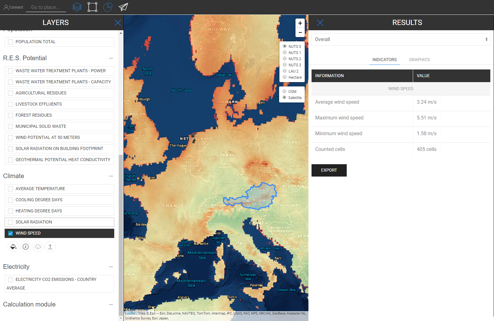

<h1><a class="anchor" id="retrieve-indicators-of-a-selected-area" href="#retrieve-indicators-of-a-selected-area"><i class="fa fa-link"></i></a>Ανάκτηση δεικτών μιας επιλεγμένης περιοχής</h1><h2><a class="anchor" id="table-of-contents" href="#table-of-contents"><i class="fa fa-link"></i></a> Πίνακας περιεχομένων</h2><ul><li> <a href="#introduction">Εισαγωγή</a></li><li> <a href="#indicators-for-raster-layers">Δείκτες για στρώματα ράστερ</a><ul><li> <a href="#indicators-for-raster-layers_buildings">Κτίρια</a></li><li> <a href="#indicators-for-raster-layers_population">Πληθυσμός</a></li><li> <a href="#indicators-for-raster-layers_renewable-energy-source-potentials">Δυνατότητες ανανεώσιμων πηγών ενέργειας</a></li></ul></li><li> <a href="#indicators-for-vector-layers">Δείκτες για διανυσματικά επίπεδα</a><ul><li> <a href="#indicators-for-vector-layers_industry">Βιομηχανία</a></li><li> <a href="#indicators-for-vector-layers_renewable-energy-source-potentials">Δυνατότητες ανανεώσιμων πηγών ενέργειας</a></li><li> <a href="#indicators-for-vector-layers_electricity">Ηλεκτρική ενέργεια</a></li></ul></li><li> <a href="#example">Παράδειγμα</a></li><li> <a href="#how-to-cite">Πώς να παραθέσω</a></li><li> <a href="#authors-and-reviewers">Συγγραφείς και κριτικοί</a></li><li> <a href="#license">Αδεια</a></li><li> <a href="#acknowledgement">Αναγνώριση</a></li></ul><h2><a class="anchor" id="introduction" href="#introduction"><i class="fa fa-link"></i></a> Εισαγωγή</h2>
 Ανάλογα με τα επίπεδα και την περιοχή που επιλέξατε οι δείκτες για τη διαμόρφωσή σας εμφανίζονται σε μια πλευρική γραμμή στα δεξιά της οθόνης σας

 <a href="#table-of-contents"><strong><code>To Top</code></strong></a>

 Στη συνέχεια, εξετάζουμε τις ενδείξεις που εμφανίζονται για raster και διανυσματικά επίπεδα.
<h2><a class="anchor" id="indicators-for-raster-layers" href="#indicators-for-raster-layers"><i class="fa fa-link"></i></a> Δείκτες για στρώματα ράστερ</h2>
 Οι δείκτες στα στρώματα ράστερ διαφέρουν από τα επίπεδα φορέα. Με διαφορετικό, εννοούμε ως προς τη συνάθροιση και την αποσυναρμολόγηση. Αυτή η διαφορετική συμπεριφορά προέρχεται από εδαφικές αποφάσεις.

 Τα Raster Layers έχουν γενικά πολύ υψηλότερη ανάλυση, ενώ τα διανυσματικά επίπεδα έχουν μόνο χαρακτηριστικά σε σημεία ή πολύγωνα.

 Αυτό σημαίνει αφενός ότι εάν επιλέξετε ένα επίπεδο φορέα που ορίζεται από τα πολύγωνα NUTS3 και θέλετε για παράδειγμα να επιλέξετε μια περιοχή LAU, τότε η τιμή NUTS3 δεν θα χωριστεί στο επίπεδο LAU, αντίθετα, η ένδειξη NUTS3 όπου αυτό Η περιοχή LAU βρίσκεται θα εμφανιστεί στην πλευρική γραμμή αποτελεσμάτων.

 Από την άλλη πλευρά, τα στρώματα ράστερ συγκεντρώνονται και διαχωρίζονται &quot;αυθαίρετα&quot; *

 * από τα κελιά που περιέχουν στην περιοχή που επιλέξατε (φυσικά εντός του ορίου της ίδιας της ανάλυσης ράστερ)

 <a href="#table-of-contents"><strong><code>To Top</code></strong></a>
<h3><a class="anchor" id="buildings" href="#buildings"><i class="fa fa-link"></i></a> Κτίρια</h3>
 <strong>Χάρτης πυκνότητας θερμότητας</strong>

 <strong>Επιπλέον δυνατότητα</strong>

 Όταν επιλέγετε ταυτόχρονα το στρώμα πυκνότητας θερμότητας και το στρώμα πληθυσμού εμφανίζεται ένας επιπλέον δείκτης (δείτε την παρακάτω εικόνα)

 <a href="#table-of-contents"><strong><code>To Top</code></strong></a>
<h3><a class="anchor" id="in-general-" href="#in-general-"><i class="fa fa-link"></i></a> Γενικά:</h3>
 Όταν επιλεγεί ταυτόχρονα ένα από τα επίπεδα του κτιρίου και το επίπεδο του πληθυσμού, θα εμφανιστεί ένας επιπλέον δείκτης όπως περιγράφηκε προηγουμένως

<ins> <code><strong><a href="#indicators-for-raster-layers">To Chapter</a></strong></code></ins>

 <strong>Χάρτης πυκνότητας ψύξης</strong>

<ins> <code><strong><a href="#indicators-for-raster-layers">To Chapter</a></strong></code></ins>

 <strong>Όγκοι κτιρίων</strong>

<ins> <code><strong><a href="#indicators-for-raster-layers">To Chapter</a></strong></code></ins>

 <strong>Ακαθάριστη επιφάνεια δαπέδου</strong>

<ins> <code><strong><a href="#indicators-for-raster-layers">To Chapter</a></strong></code></ins> <a href="#table-of-contents"><strong><code>To Top</code></strong></a>
<h3><a class="anchor" id="population" href="#population"><i class="fa fa-link"></i></a> Πληθυσμός</h3>

<ins> <code><strong><a href="#indicators-for-raster-layers">To Chapter</a></strong></code></ins> <a href="#table-of-contents"><strong><code>To Top</code></strong></a>
<h3><a class="anchor" id="climate" href="#climate"><i class="fa fa-link"></i></a> Κλίμα</h3>
 <strong>Θερμοκρασία</strong>

<ins> <code><strong><a href="#indicators-for-raster-layers">To Chapter</a></strong></code></ins>

 <strong>Ημέρες Ψύξης</strong>

<ins> <code><strong><a href="#indicators-for-raster-layers">To Chapter</a></strong></code></ins>

 <strong>Ημέρες βαθμού θέρμανσης</strong>

<ins> <code><strong><a href="#indicators-for-raster-layers">To Chapter</a></strong></code></ins>

 <strong>Ηλιακή ακτινοβολία</strong>

<ins> <code><strong><a href="#indicators-for-raster-layers">To Chapter</a></strong></code></ins>

 <strong>ΤΑΧΥΤΗΤΑ ΑΝΕΜΟΥ</strong>

<ins> <code><strong><a href="#indicators-for-raster-layers">To Chapter</a></strong></code></ins> <a href="#table-of-contents"><strong><code>To Top</code></strong></a>
<h3><a class="anchor" id="renewable-energy-source-potentials" href="#renewable-energy-source-potentials"><i class="fa fa-link"></i></a> Δυνατότητες ανανεώσιμων πηγών ενέργειας</h3>
 <strong>Ηλιακή ακτινοβολία στην κατασκευή του αποτυπώματος</strong>

<ins> <code><strong><a href="#indicators-for-raster-layers">To Chapter</a></strong></code></ins>

 <strong>Δυνατότητα ανέμου στα 50μ</strong>

<ins> <code><strong><a href="#indicators-for-raster-layers">To Chapter</a></strong></code></ins>

 <strong>Δασικά υπολείμματα</strong>

<ins> <code><strong><a href="#indicators-for-raster-layers">To Chapter</a></strong></code></ins> <a href="#table-of-contents"><strong><code>To Top</code></strong></a>
<h2><a class="anchor" id="indicators-for-vector-layers" href="#indicators-for-vector-layers"><i class="fa fa-link"></i></a> Δείκτες για διανυσματικά επίπεδα</h2><h3><a class="anchor" id="industry" href="#industry"><i class="fa fa-link"></i></a> Βιομηχανία</h3>
 <strong>Εκπομπές βιομηχανικών περιοχών</strong>

<ins> <code><strong><a href="#indicators-for-vector-layers">To Chapter</a></strong></code></ins>

 <strong>Υπερβολική θερμότητα βιομηχανικού χώρου</strong>

<ins> <code><strong><a href="#indicators-for-vector-layers">To Chapter</a></strong></code></ins>

 <strong>Όνομα εταιρείας βιομηχανικού χώρου</strong>

<ins> <code><strong><a href="#indicators-for-vector-layers">To Chapter</a></strong></code></ins>

 <strong>Υποτομέας βιομηχανικών περιοχών</strong>

<ins> <code><strong><a href="#indicators-for-vector-layers">To Chapter</a></strong></code></ins> <a href="#table-of-contents"><strong><code>To Top</code></strong></a>
<h3><a class="anchor" id="renewable-energy-source-potentials" href="#renewable-energy-source-potentials"><i class="fa fa-link"></i></a> Δυνατότητες ανανεώσιμων πηγών ενέργειας</h3>
 <strong>Ισχύς εγκαταστάσεων επεξεργασίας λυμάτων</strong>

<ins> <code><strong><a href="#indicators-for-vector-layers">To Chapter</a></strong></code></ins>

 <strong>Χωρητικότητα εγκαταστάσεων επεξεργασίας λυμάτων</strong>

<ins> <code><strong><a href="#indicators-for-vector-layers">To Chapter</a></strong></code></ins>

 <strong>Γεωργικά υπολείμματα</strong>

<ins> <code><strong><a href="#indicators-for-vector-layers">To Chapter</a></strong></code></ins>

 <strong>Λυόμενα ζώα</strong>

<ins> <code><strong><a href="#indicators-for-vector-layers">To Chapter</a></strong></code></ins>

 <strong>Δημοτικά στερεά απόβλητα</strong>

<ins> <code><strong><a href="#indicators-for-vector-layers">To Chapter</a></strong></code></ins>

 <strong>Γεωθερμική Δυναμική Αγωγιμότητα Θερμότητας</strong>

<ins> <code><strong><a href="#indicators-for-vector-layers">To Chapter</a></strong></code></ins> <a href="#table-of-contents"><strong><code>To Top</code></strong></a>
<h3><a class="anchor" id="electricity" href="#electricity"><i class="fa fa-link"></i></a> Ηλεκτρική ενέργεια</h3>
 <strong>Εκπομπές ηλεκτρικής ενέργειας C02</strong>

<ins> <code><strong><a href="#indicators-for-vector-layers">To Chapter</a></strong></code></ins> <a href="#table-of-contents"><strong><code>To Top</code></strong></a>
<h2><a class="anchor" id="example" href="#example"><i class="fa fa-link"></i></a> Παράδειγμα</h2>
 Στην παρακάτω εικόνα μπορείτε να δείτε πώς φαίνεται όταν εμφανίζονται όλα τα επίπεδα (εδώ είναι η Αυστρία ως επιλεγμένη η NUTS0)

 Αν και αυτός ο χάρτης μπορεί να φαίνεται λίγο συγκεχυμένος με την πρώτη ματιά, οι δείκτες του απεικονίζονται ευθεία προς τα εμπρός. Δείτε παρακάτω όλους τους δείκτες που περιγράφονται στην πλευρική γραμμή αποτελεσμάτων όταν επιλέγετε όλα τα επίπεδα για την Αυστρία (NUTS0)

 <a href="#table-of-contents"><strong><code>To Top</code></strong></a>
<h2><a class="anchor" id="how-to-cite" href="#how-to-cite"><i class="fa fa-link"></i></a> Πώς να παραθέσω</h2>
 Jeton Hasani, στο Hotmaps-Wiki, Ανάκτηση-δείκτες-μιας-επιλεγμένης περιοχής (Απρίλιος 2019)

 <a href="#table-of-contents"><strong><code>To Top</code></strong></a>
<h2><a class="anchor" id="authors-and-reviewers" href="#authors-and-reviewers"><i class="fa fa-link"></i></a> Συγγραφείς και κριτικοί</h2>
 Αυτή η σελίδα γράφτηκε από τον Jeton Hasani <strong><a href="https://eeg.tuwien.ac.at/">EEG - TU Wien</a></strong> .

 ☑ Αυτή η σελίδα αξιολογήθηκε από το Mostafa Fallahnejad <strong><a href="https://eeg.tuwien.ac.at/">EEG - TU Wien</a></strong> .

 <a href="#table-of-contents"><strong><code>To Top</code></strong></a>
<h2><a class="anchor" id="license" href="#license"><i class="fa fa-link"></i></a> Αδεια</h2>
 Πνευματικά δικαιώματα © 2016-2020: Jeton Hasani

 Creative Commons Attribution 4.0 Διεθνής άδεια

 Αυτό το έργο έχει άδεια βάσει της Creative Commons CC BY 4.0 International License.

 SPDX-License-Identifier: CC-BY-4.0

 License-Text: https://spdx.org/licenses/CC-BY-4.0.html

 <a href="#table-of-contents"><strong><code>To Top</code></strong></a>
<h2><a class="anchor" id="acknowledgement" href="#acknowledgement"><i class="fa fa-link"></i></a> Αναγνώριση</h2>
 Θα θέλαμε να εκφράσουμε τη βαθύτατη εκτίμησή μας στο <a href="https://www.hotmaps-project.eu">Πρόγραμμα Hotmaps</a> «Ορίζοντας 2020 <a href="https://www.hotmaps-project.eu">»</a> (Συμφωνία επιχορήγησης αριθμός 723677), το οποίο παρείχε τη χρηματοδότηση για τη διεξαγωγή της παρούσας έρευνας.

 <a href="#table-of-contents"><strong><code>To Top</code></strong></a> <code><a href="Indicator-Section/_edit">Review this page</a></code>

<!--- THIS IS A SUPER UNIQUE IDENTIFIER -->

This page was automatically translated. View in another language:

[English](../en/Retrieve-indicators-of-a-selected-area) (original) [Bulgarian](../bg/Retrieve-indicators-of-a-selected-area)\* [Czech](../cs/Retrieve-indicators-of-a-selected-area)\* [Danish](../da/Retrieve-indicators-of-a-selected-area)\* [German](../de/Retrieve-indicators-of-a-selected-area)\*  [Spanish](../es/Retrieve-indicators-of-a-selected-area)\* [Estonian](../et/Retrieve-indicators-of-a-selected-area)\* [Finnish](../fi/Retrieve-indicators-of-a-selected-area)\* [French](../fr/Retrieve-indicators-of-a-selected-area)\* [Irish](../ga/Retrieve-indicators-of-a-selected-area)\* [Croatian](../hr/Retrieve-indicators-of-a-selected-area)\* [Hungarian](../hu/Retrieve-indicators-of-a-selected-area)\* [Italian](../it/Retrieve-indicators-of-a-selected-area)\* [Lithuanian](../lt/Retrieve-indicators-of-a-selected-area)\* [Latvian](../lv/Retrieve-indicators-of-a-selected-area)\* [Maltese](../mt/Retrieve-indicators-of-a-selected-area)\* [Dutch](../nl/Retrieve-indicators-of-a-selected-area)\* [Polish](../pl/Retrieve-indicators-of-a-selected-area)\* [Portuguese (Portugal, Brazil)](../pt/Retrieve-indicators-of-a-selected-area)\* [Romanian](../ro/Retrieve-indicators-of-a-selected-area)\* [Slovak](../sk/Retrieve-indicators-of-a-selected-area)\* [Slovenian](../sl/Retrieve-indicators-of-a-selected-area)\* [Swedish](../sv/Retrieve-indicators-of-a-selected-area)\* 

\* machine translated
