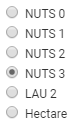

<h1><a class="anchor" id="select-a-region-in-the-hotmaps-toolbox" href="#select-a-region-in-the-hotmaps-toolbox"><i class="fa fa-link"></i></a>Επιλέξτε μια περιοχή στην εργαλειοθήκη Hotmaps</h1><h2><a class="anchor" id="table-of-contents" href="#table-of-contents"><i class="fa fa-link"></i></a> Πίνακας περιεχομένων</h2><ul><li> <a href="#introduction">Εισαγωγή</a></li><li> <a href="#selection-by-nuts-boundaries">Επιλογή από τα όρια NUTS</a><ul><li> <a href="#selection-by-nuts-boundaries_nuts-0-selection">Επιλογή NUTS 0</a></li><li> <a href="#selection-by-nuts-boundaries_nuts-1-selection">Επιλογή NUTS 1</a></li><li> <a href="#selection-by-nuts-boundaries_nuts-2-selection">Επιλογή NUTS 2</a></li><li> <a href="#selection-by-nuts-boundaries_nuts-3-selection">Επιλογή NUTS 3</a></li><li> <a href="#selection-by-nuts-boundaries_lau-selection">Επιλογή LAU</a></li></ul></li><li> <a href="#custom-selection">Προσαρμοσμένη επιλογή</a></li><li> <a href="#bounding-box-and-area-selection-limit">Όριο επιλογής κουτιού και ορίων</a></li><li> <a href="#how-to-cite">Πώς να παραθέσω</a></li><li> <a href="#authors-and-reviewers">Συγγραφείς και κριτικοί</a></li><li> <a href="#license">Αδεια</a></li><li> <a href="#acknowledgement">Αναγνώριση</a></li></ul><h2><a class="anchor" id="introduction" href="#introduction"><i class="fa fa-link"></i></a> Εισαγωγή</h2>
 Υπάρχουν δύο τρόποι για να επιλέξετε μια περιοχή στην εργαλειοθήκη Hotmaps:
<ol><li> επιλογή από την <a href="https://ec.europa.eu/eurostat/web/nuts/background">ταξινόμηση NUTS (Ονοματολογία εδαφικών στατιστικών μονάδων)</a></li><li> Επιλογή προσαρμοσμένου εκταρίου</li></ol>
 Με τα <a href="#fig1">κουμπιά επιλογής</a> στα δεξιά της οθόνης σας, μπορείτε να επιλέξετε την εδαφική κλίμακα που θέλετε να αναλύσετε (περιοχές NUTS, <a href="https://ec.europa.eu/eurostat/web/nuts/local-administrative-units">LAU (Τοπικές μονάδες διαχείρισης</a> ή επίπεδο εκταρίου)

 Εικ.1: Κουμπιά επιλογής για την εδαφική κλίμακα

 <a href="#table-of-contents"><strong><code>To Top</code></strong></a>
<h2><a class="anchor" id="selection-by-nuts-boundaries-" href="#selection-by-nuts-boundaries-"><i class="fa fa-link"></i></a> Επιλογή από τα όρια NUTS:</h2>
 Αφού επιλέξετε μια περιοχή και πατήσετε το <em>κουμπί ΑΠΟΤΕΛΕΣΜΑΤΑ ΦΟΡΤΩΣΗΣ, εμφανίζεται</em> η πλευρική γραμμή αποτελεσμάτων στα δεξιά και ανάλογα με το επίπεδο που επιλέξατε, εμφανίζονται ορισμένες ενδείξεις για αυτές. Μπορείτε να δείτε ότι επιλέγοντας μια άλλη περιοχή τα αποτελέσματα θα συγκεντρωθούν αμέσως.

 <a href="#table-of-contents"><strong><code>To Top</code></strong></a>
<h3><a class="anchor" id="nuts-0-selection" href="#nuts-0-selection"><i class="fa fa-link"></i></a> Επιλογή NUTS 0</h3>
 <a href="#table-of-contents"><strong><code>To Top</code></strong></a>
<h3><a class="anchor" id="nuts-1-selection" href="#nuts-1-selection"><i class="fa fa-link"></i></a> Επιλογή NUTS 1</h3>
 <a href="#table-of-contents"><strong><code>To Top</code></strong></a>
<h3><a class="anchor" id="nuts-2-selection" href="#nuts-2-selection"><i class="fa fa-link"></i></a> Επιλογή NUTS 2</h3>
 <a href="#table-of-contents"><strong><code>To Top</code></strong></a>
<h3><a class="anchor" id="nuts-3-selection" href="#nuts-3-selection"><i class="fa fa-link"></i></a> Επιλογή NUTS 3</h3>
 <a href="#table-of-contents"><strong><code>To Top</code></strong></a>
<h3><a class="anchor" id="lau-selection" href="#lau-selection"><i class="fa fa-link"></i></a> Επιλογή LAU</h3>
 Εκτός από τα τρία επίπεδα NUTS, έχετε επίσης τη δυνατότητα ανάλυσης σε επίπεδο LAU

 <a href="#table-of-contents"><strong><code>To Top</code></strong></a>
<h2><a class="anchor" id="custom-selection-" href="#custom-selection-"><i class="fa fa-link"></i></a> Προσαρμοσμένη επιλογή:</h2>
 Εάν χρειάζεστε έναν πιο ευέλικτο τρόπο και θέλετε να αναλύσετε μια περιοχή που δεν καλύπτεται από τα όρια NUTS ή LAU, τότε είναι καλύτερο να καθορίσετε τις δικές σας τελωνειακές περιοχές. Η εργαλειοθήκη προσφέρει πολλά εργαλεία επιλογής: ορθογώνιο, κύκλο ή πολύγωνο. Σχεδιάστε το σχήμα που θέλετε να αναλύσετε και, στη συνέχεια, κάντε κλικ στο συρμένο πλαίσιο οριοθέτησης για να επιλέξετε την περιοχή

 Μια άλλη επιλογή που είναι διαθέσιμη μόνο σε επίπεδο εκταρίου, είναι να ανεβάσετε ένα αντικείμενο επιλογής GeoJSON. Το GeoJSON είναι μια μορφή κωδικοποίησης δομών γεωγραφικών δεδομένων. Εάν έχετε δημιουργήσει ένα αντικείμενο GeoJSON που αντιπροσωπεύει μια περιοχή διαστήματος ή μια συλλογή χωρικών οριοθετημένων οντοτήτων, ανεβάζοντας το αντικείμενο GeoJSN, αυτή η επιλογή θα χρησιμοποιηθεί εύκολα σε Hotmaps.

 <a href="#table-of-contents"><strong><code>To Top</code></strong></a>
<h2><a class="anchor" id="bounding-box-and-area-selection-limit" href="#bounding-box-and-area-selection-limit"><i class="fa fa-link"></i></a> Όριο επιλογής κουτιού και ορίων</h2>
 Όταν επιλέγετε μία ή περισσότερες περιοχές στο χάρτη, το πλαίσιο στην αριστερή πλευρά της οθόνης με τα κουμπιά για τη φόρτωση των αποτελεσμάτων εμφανίζει τις ακόλουθες πληροφορίες σχετικά με την τρέχουσα επιλογή:
<ul><li> Επιλεγμένα στοιχεία: ο αριθμός των μεμονωμένων ζωνών που έχουν επιλεγεί</li><li> Bounding Box: η συνολική επιφάνεια του μικρότερου ορθογώνιου σχήματος που μπορεί να καλύψει την περιοχή που έχει επιλεγεί</li><li> Κλίμακα: το επίπεδο στο οποίο γίνεται η επιλογή</li></ul>
 <strong>ΣΗΜΑΝΤΙΚΗ ΣΗΜΕΙΩΣΗ</strong> Το Bounding Box έχει όριο ορίου περίπου 640.000km2. Οι ενότητες υπολογισμού και τα επίπεδα αποτελεσμάτων δεν μπορούν να εκτελεστούν / φορτωθούν πάνω από αυτό το κατώφλι. Επιλέγοντας μια περιοχή πάνω από το όριο επιλογής, θα εμφανιστεί το ακόλουθο μήνυμα σφάλματος: <em>Έχετε υπερβεί το όριο επιλογής περιοχής για τη δωρεάν επιλογή καθώς και για την εκτέλεση λειτουργικών μονάδων υπολογισμού! Επιλέξτε μια μικρότερη περιοχή.</em>

 <a href="#table-of-contents"><strong><code>To Top</code></strong></a>
<h2><a class="anchor" id="how-to-cite" href="#how-to-cite"><i class="fa fa-link"></i></a> Πώς να παραθέσω</h2>
 Jeton Hasani, στο Hotmaps-Wiki, εργαλειοθήκη Select-a-region-in-the-Hotmaps-Απρίλιος 2019

 <a href="#table-of-contents"><strong><code>To Top</code></strong></a>
<h2><a class="anchor" id="authors-and-reviewers" href="#authors-and-reviewers"><i class="fa fa-link"></i></a> Συγγραφείς και κριτικοί</h2>
 Αυτή η σελίδα γράφτηκε από τον Jeton Hasani <strong><a href="https://eeg.tuwien.ac.at/">EEG - TU Wien</a></strong> .

 ☑ Αυτή η σελίδα αξιολογήθηκε από το Mostafa Fallahnejad <strong><a href="https://eeg.tuwien.ac.at/">EEG - TU Wien</a></strong> .

 <a href="#table-of-contents"><strong><code>To Top</code></strong></a>
<h2><a class="anchor" id="license" href="#license"><i class="fa fa-link"></i></a> Αδεια</h2>
 Πνευματικά δικαιώματα © 2016-2020: Jeton Hasani

 Creative Commons Attribution 4.0 Διεθνής άδεια

 Αυτό το έργο έχει άδεια βάσει της διεθνούς άδειας Creative Commons CC BY 4.0.

 SPDX-License-Identifier: CC-BY-4.0

 Άδεια χρήσης-Κείμενο: https://spdx.org/licenses/CC-BY-4.0.html

<ins> <code><strong><a href="#hotmaps-toolbox">To Top</a></strong></code></ins>
<h2><a class="anchor" id="acknowledgement" href="#acknowledgement"><i class="fa fa-link"></i></a> Αναγνώριση</h2>
 Θα θέλαμε να εκφράσουμε τη βαθύτατη εκτίμησή μας στο <a href="https://www.hotmaps-project.eu">Σχέδιο Hotmaps</a> «Ορίζοντας 2020 <a href="https://www.hotmaps-project.eu">»</a> (Συμφωνία επιχορήγησης αριθμός 723677), το οποίο παρείχε τη χρηματοδότηση για τη διεξαγωγή της παρούσας έρευνας.

 <a href="#table-of-contents"><strong><code>To Top</code></strong></a>

<!--- THIS IS A SUPER UNIQUE IDENTIFIER -->

This page was automatically translated. View in another language:

[English](../en/Select-a-region-in-the-Hotmaps-toolbox) (original) [Bulgarian](../bg/Select-a-region-in-the-Hotmaps-toolbox)\* [Czech](../cs/Select-a-region-in-the-Hotmaps-toolbox)\* [Danish](../da/Select-a-region-in-the-Hotmaps-toolbox)\* [German](../de/Select-a-region-in-the-Hotmaps-toolbox)\*  [Spanish](../es/Select-a-region-in-the-Hotmaps-toolbox)\* [Estonian](../et/Select-a-region-in-the-Hotmaps-toolbox)\* [Finnish](../fi/Select-a-region-in-the-Hotmaps-toolbox)\* [French](../fr/Select-a-region-in-the-Hotmaps-toolbox)\* [Irish](../ga/Select-a-region-in-the-Hotmaps-toolbox)\* [Croatian](../hr/Select-a-region-in-the-Hotmaps-toolbox)\* [Hungarian](../hu/Select-a-region-in-the-Hotmaps-toolbox)\* [Italian](../it/Select-a-region-in-the-Hotmaps-toolbox)\* [Lithuanian](../lt/Select-a-region-in-the-Hotmaps-toolbox)\* [Latvian](../lv/Select-a-region-in-the-Hotmaps-toolbox)\* [Maltese](../mt/Select-a-region-in-the-Hotmaps-toolbox)\* [Dutch](../nl/Select-a-region-in-the-Hotmaps-toolbox)\* [Polish](../pl/Select-a-region-in-the-Hotmaps-toolbox)\* [Portuguese (Portugal, Brazil)](../pt/Select-a-region-in-the-Hotmaps-toolbox)\* [Romanian](../ro/Select-a-region-in-the-Hotmaps-toolbox)\* [Slovak](../sk/Select-a-region-in-the-Hotmaps-toolbox)\* [Slovenian](../sl/Select-a-region-in-the-Hotmaps-toolbox)\* [Swedish](../sv/Select-a-region-in-the-Hotmaps-toolbox)\* 

\* machine translated
