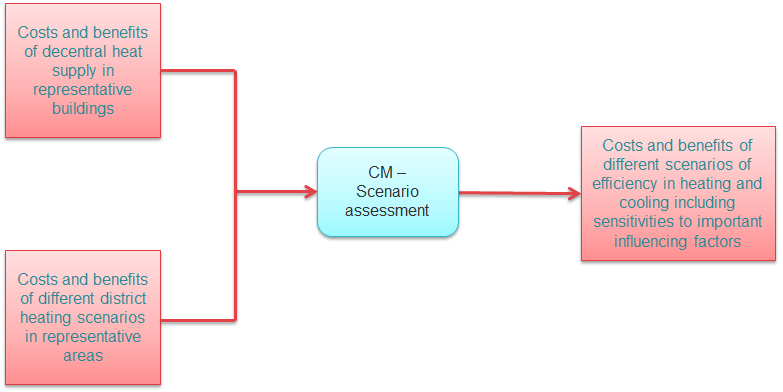

<h1><a class="anchor" id="national-level---step-4--comparison-of-results-for-different-scenarios" href="#national-level---step-4--comparison-of-results-for-different-scenarios"><i class="fa fa-link"></i></a>Εθνικό επίπεδο - Βήμα 4: Σύγκριση αποτελεσμάτων για διαφορετικά σενάρια</h1>
 <a href="guide-national-level-comprehensive-assessment-eed#part-iii-analysis-of-the-economic-potential-for-efficiency-in-heating-and-cooling_different-steps"><strong><code>Scenario Toolchain Steps</code></strong></a> <a href="Step-3-Calculation-of-decentral-heat-supply"><strong><code>Previous step</code></strong></a>
<h2><a class="anchor" id="table-of-contents" href="#table-of-contents"><i class="fa fa-link"></i></a> Πίνακας περιεχομένων</h2><ul><li> <a href="#introduction">Εισαγωγή</a></li><li> <a href="#comparison-of-results-for-different-scenarios">Σύγκριση αποτελεσμάτων για διαφορετικά σενάρια</a></li><li> <a href="#how-to-cite">Πώς να παραθέσω</a></li><li> <a href="#authors-and-reviewers">Συγγραφείς και κριτικοί</a></li><li> <a href="#license">Αδεια</a></li><li> <a href="#acknowledgement">Αναγνώριση</a></li></ul><h2><a class="anchor" id="introduction" href="#introduction"><i class="fa fa-link"></i></a> Εισαγωγή</h2>
 Αυτό είναι το δεύτερο βήμα της ανάλυσης σε εθνικό επίπεδο.

<ins> <code><strong><a href="#table-of-contents">To Top</a></strong></code></ins>
<h2><a class="anchor" id="comparison-of-results-for-different-scenarios" href="#comparison-of-results-for-different-scenarios"><i class="fa fa-link"></i></a> Σύγκριση αποτελεσμάτων για διαφορετικά σενάρια</h2>
 Το τελευταίο βήμα στην ανάλυση είναι η σύγκριση των αποτελεσμάτων για τα διαφορετικά σενάρια και ευαισθησίες. Για αυτό, όλα τα αποτελέσματα που υπολογίστηκαν στα προηγούμενα βήματα συλλέγονται τόσο από τους υπολογισμούς της τηλεθέρμανσης όσο και από τους υπολογισμούς της αποκεντρωμένης προσφοράς και συγκρίνονται μεταξύ τους για τους κύριους δείκτες. Αυτό μπορεί να γίνει στην αξιολόγηση CM - Scenario. Το παρακάτω σχήμα δείχνει αυτήν την προσέγγιση.

 <em>Εικόνα: Σύγκριση αποτελεσμάτων για διαφορετικά σενάρια (Βήμα 4)</em>

<ins> <code><strong><a href="#table-of-contents">To Top</a></strong></code></ins>
<h2><a class="anchor" id="how-to-cite" href="#how-to-cite"><i class="fa fa-link"></i></a> Πώς να παραθέσω</h2>
 Marcus Hummel, Giulia Conforto, στο Hotmaps-Wiki, Οδηγίες για τη χρήση της εργαλειοθήκης Hotmaps για αναλύσεις σε εθνικό επίπεδο (Αύγουστος 2020)

<ins> <code><strong><a href="#table-of-contents">To Top</a></strong></code></ins>
<h2><a class="anchor" id="authors-and-reviewers" href="#authors-and-reviewers"><i class="fa fa-link"></i></a> Συγγραφείς και κριτικοί</h2>
 Αυτή η σελίδα γράφτηκε από τους Marcus Hummel και Giulia Conforto ( <strong><a href="https://e-think.ac.at">e-think</a></strong> ).

 ☑ Αυτή η σελίδα αξιολογήθηκε από τον Mostafa Fallahnejad ( <strong><a href="https://eeg.tuwien.ac.at/">EEG - TU Wien</a></strong> ).

 <a href="#table-of-contents"><strong><code>To Top</code></strong></a>
<h2><a class="anchor" id="license" href="#license"><i class="fa fa-link"></i></a> Αδεια</h2>
 Πνευματικά δικαιώματα © 2016-2020: Marcus Hummel, Giulia Conforto

 Creative Commons Attribution 4.0 Διεθνής άδεια

 Αυτό το έργο έχει άδεια βάσει της Creative Commons CC BY 4.0 International License.

 SPDX-License-Identifier: CC-BY-4.0

 License-Text: https://spdx.org/licenses/CC-BY-4.0.html

<ins> <code><strong><a href="#table-of-contents">To Top</a></strong></code></ins>
<h2><a class="anchor" id="acknowledgement" href="#acknowledgement"><i class="fa fa-link"></i></a> Αναγνώριση</h2>
 Θα θέλαμε να εκφράσουμε τη βαθύτατη εκτίμησή μας στο <a href="https://www.hotmaps-project.eu">Πρόγραμμα Hotmaps</a> «Ορίζοντας 2020 <a href="https://www.hotmaps-project.eu">»</a> (Συμφωνία επιχορήγησης αριθμός 723677), το οποίο παρείχε τη χρηματοδότηση για τη διεξαγωγή της παρούσας έρευνας.

<ins> <code><strong><a href="#table-of-contents">To Top</a></strong></code></ins>

<!--- THIS IS A SUPER UNIQUE IDENTIFIER -->

This page was automatically translated. View in another language:

[English](../en/Step-4-Comparison-of-results-for-different-scenarios) (original) [Bulgarian](../bg/Step-4-Comparison-of-results-for-different-scenarios)\* [Czech](../cs/Step-4-Comparison-of-results-for-different-scenarios)\* [Danish](../da/Step-4-Comparison-of-results-for-different-scenarios)\* [German](../de/Step-4-Comparison-of-results-for-different-scenarios)\*  [Spanish](../es/Step-4-Comparison-of-results-for-different-scenarios)\* [Estonian](../et/Step-4-Comparison-of-results-for-different-scenarios)\* [Finnish](../fi/Step-4-Comparison-of-results-for-different-scenarios)\* [French](../fr/Step-4-Comparison-of-results-for-different-scenarios)\* [Irish](../ga/Step-4-Comparison-of-results-for-different-scenarios)\* [Croatian](../hr/Step-4-Comparison-of-results-for-different-scenarios)\* [Hungarian](../hu/Step-4-Comparison-of-results-for-different-scenarios)\* [Italian](../it/Step-4-Comparison-of-results-for-different-scenarios)\* [Lithuanian](../lt/Step-4-Comparison-of-results-for-different-scenarios)\* [Latvian](../lv/Step-4-Comparison-of-results-for-different-scenarios)\* [Maltese](../mt/Step-4-Comparison-of-results-for-different-scenarios)\* [Dutch](../nl/Step-4-Comparison-of-results-for-different-scenarios)\* [Polish](../pl/Step-4-Comparison-of-results-for-different-scenarios)\* [Portuguese (Portugal, Brazil)](../pt/Step-4-Comparison-of-results-for-different-scenarios)\* [Romanian](../ro/Step-4-Comparison-of-results-for-different-scenarios)\* [Slovak](../sk/Step-4-Comparison-of-results-for-different-scenarios)\* [Slovenian](../sl/Step-4-Comparison-of-results-for-different-scenarios)\* [Swedish](../sv/Step-4-Comparison-of-results-for-different-scenarios)\* 

\* machine translated
