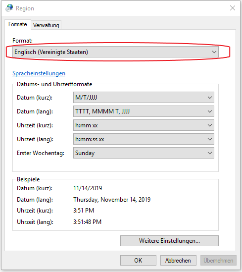

<h1>CM Add industry plant (User-defined excess heat potentials)</h1>

## Table of Contents
* [Introduction](#introduction)
* [Inputs and outputs](#inputs-and-outputs)
* [Method](#method)
* [References](#references)
* [How to cite](#how-to-cite)
* [Authors and reviewers](#authors-and-reviewers)
* [License](#license)
* [Acknowledgement](#acknowledgement)

## Introduction
This module provides the possibility to add additional industry sites with their heating and cooling demand and excess heat potential to the HotMaps toolbox. It is possible to add additional energy-intensive as well as less-energy intensive industries. The user enters the necessary data in a stand-alone Excel-tool, which then generates a datasheet to be uploaded on the HotMaps toolbox.   

[**`To Top`**](#table-of-contents)

## Inputs and outputs

### Data input in Excel-tool by user

Please download the provided Excel-tool [HERE](https://github.com/HotMaps/add_industry_plant_cm/blob/master/HotMaps_CM_Add_industry_plant_V7.xlsx).

The approach how to use the Excel-tool is illustrated in the figure below and described in more detail in the following sections.

<figure>
  
  <figcaption><i>  
Step-by-step approach  how to use the Excel-tool.</i></figcaption>
</figure>

#### 1) Add general information
Please go to tabsheet: <figure></figure>

In the first step please enter all necessary general information about the sites for which heat and cooling demand and excess heat potential should be calculated. It is possible to add up to 10 industrial sites. 

<figure>
  
  <figcaption><i>  
Example of excel table to enter general information of companies as basis for the calculation and import into the HotMaps toolbox.</i></figcaption>
</figure>

#### 2) Choose calculation option

In the second step there are 3 options how heat and cooling demand and excess heat potential can be estimated. Please note, that it is possible to switch between the three options for the different companies but not within a company itself.

With regard to the excess heat temperature it has to be mentioned, that low temperature heat (< 100°C) can be entered into the Excel-Tool but is not yet evaluated in the HotMaps toolbox. If low temperature heat should be considered, the application of a heat pump is necessary. Therefor the user can include the electricity demand of a heat pump in the final energy demand for electricity and lift the temperature of the generated excess heat up to the range of 100-200°C.

##### Option 1: Manual input
Please go to tabsheet: <figure></figure>

Please choose this option, if data on heat/ cooling demand and excess heat potential and temperature distribution is available for the selected company and can be filled in manually.

##### Option 2: Plant selection
Please go to tabsheet: <figure></figure>

Please choose this option, if no information about heat/ cooling demand and excess heat potential is available for the selected company. On the basis of a plant specific database typical heat/cooling demand and excess heat potentials with temperature distribution can be selected for a number of plants and products/processes. 
As necessary input for the conversion of the product specific data a value as calculation basis needs to be entered (f. ex. production, area etc.). 
For more information concerning the calculation method see [Method](#method).

##### Option 3: Sector selection
Please go to tabsheet: <figure></figure>

Please choose this option, if your plant type is not available in option 2. On the basis of sector specific heat data typical heat/ cooling demand and excess heat potentials are calculated. 
As necessary input the fuel demand for heat supply (in GWh/ year) needs to be entered. For more information concerning the calculation method see [Method](#method).

### Data upload on HotMaps toolbox
There are 2 files (*.csv) that need to be generated by the user and then uploaded onto the HotMaps toolbox.

🔺 <mark>**Note:** 
For the generation of the (*.csv) files in the correct format, it is necessary that the default delimiter is set as comma (**english standard**). This **cannot be configured from Excel** and needs to be done globally from the Windows Control Panel (as described [here](https://www.itsupportguides.com/knowledge-base/office-2013/excel-20132016-how-to-change-csv-delimiter-character/)). The figure below shows the exemplary setting for german windows PC's.

<figure></figure>

#### 1) File generation: Subsector
Please go to tabsheet: <figure></figure>

Copy the whole sheet into a new Excel-File and save it in the format: (*.csv)

#### 2) File generation: Excess heat
Please go to tabsheet: <figure></figure>

Copy the whole sheet into a new Excel-File and save it in the format: (*.csv)

#### 3) Upload on HotMaps Toolbox
To upload the two (*csv.)-files open the upload platform by clicking on **Account**

<figure></figure>

In a next step select the two (*csv.files) for uploading and choose the right upload category for each file.

<figure></figure>

You can now check out your uploaded files in the section **Layers - Personal layer**

<figure></figure>

[**`To Top`**](#table-of-contents)

## Method

If the heat/ cooling demand and excess heat potential of a plant is not known, two indicator based methods are offered to the user for the calculation of heat demand and excess heat potential. 

It has to be mentioned that these values are only indicative approximate values for typical plants (option 2) or on a sectorial level (option 3) and don't replace a detailed analysis and measurement of heat demand and excess heat of a plant.

### Method - Option 2: Plant selection
The plant specific heat data is taken from the Forecast database. For a large number of different energy-intensive and less energy-intensive plant types process heat/ cooling demand and excess heat potential are derived from the specific final energy demand of fuels and electricity. 
It is important to note that due to the underlying database only process heat and process cooling is covered with this method; space heating and hot water is not included here. Depending on the plant type different inputs as basis for the calculation are provided (f. ex. production volume in _tonnes_ or area in _m2_ ).

For the calculation of heat and cooling demand it is necessary to assume conversion efficiencies from final energy to heat and cooling. Since most of the heat applications are steam-based an efficiency of 90% is assumed. For cooling applications a temperature level weighted energy efficiency ratio (EER) is assumed: 

| Temperature level | assumed EER (according to Forecast database) | 
| --- |-------------:|
| < -30°C  | 0.01   |
| -30°C - 0°C  | 1.8   |
| 0°C - 15°C & > 15°C  | 3.5   |

The whole database used for option 2 is available here: Repository_Link

### Method - Option 3: Sector selection
Option 3 provides a broad based assessment of heat demand and excess heat for the sectors of the manufacturing industry (according to NACE Rev. 2 [[1](#references)]). 

#### Calculation of excess heat potentials on sectorial level
For the calculation of the excess heat potential of the different sectors excess heat factors according to Brückner 2016 [[2](#references)] are used (see table below). The excess heat factor is defined as waste heat generated per fuel consumption.
In [[2](#references)] the available data to determine the excess heat potential in the manufacturing industry originates from the emissions survey carried out every four years on state level in germany. 
According to the Emission Declaration Ordinance (1. BImSchG) all operators of plants, which are subject to approval, have to submit a declaration of their emissions every four years. 
For the year 2008 data on company level consisting of exhaust gas volume flows and their temperature level are evaluated. Together with available information on the type and quantitiy of fuel consumption of the plants, the excess heat factor of a plant is calculated as

_Excess heat factor = Excess heat / fuel consumption_

Finally the excess heat factor is calculated not only at company level but also on sector level. For detailed information see [[2](#references)].

The excess heat factors according to [[2](#references)] include excess heat coming from process heat as well as space heat generation and hot water. This is due to the fact that only an exhaust gas volume flow leaving the plant is analyzed without separating the fuel consumption into space heating, hot water and process heat. Excess heat generated by electricity based applications is not included.

The distribution of the share of excess heat per temperature range is based on own assumptions.

*Excess heat factors for the sectors of the manufacturing industry (according to [[1](#references)])*

| NACE Rev. 2  | Sector | excess heat factor  |
| --- |-------------| -----:|
| 10  | Manufacture of food products 												         | 0.10 |
| 11  | Manufacture of beverages      													 | 0.14 |
| 12  | Manufacture of tobacco products      											 	 | 0.12 |
| 13  | Manufacture of textiles         												 | 0.29 |
| 14  | Manufacture of wearing apparel       												 | 0.06 |
| 15  | Manufacture of leather and related products    											 | 0.20 |
| 16  | Manufacture of wood and of products of wood and cork, except furniture; manufacture of articles of straw and plaiting materials  | 0.10 |
| 17  | Manufacture of paper and paper products           										 | 0.09 |
| 18  | Printing and reproduction of recorded media   											 | 0.03 |
| 20  | Manufacture of chemicals and chemical products          									 | 0.09 |
| 21  | Manufacture of basic pharmaceutical products and pharmaceutical preparations  						         | 0.08 |
| 22  | Manufacture of rubber and plastic products          										 | 0.17 |
| 23  | Manufacture of other non-metallic mineral products   										 | 0.15 |
| 24  | Manufacture of basic metals       												 | 0.19 |
| 25  | Manufacture of fabricated metal products, except machinery and equipment  							 | 0.19 |
| 26  | Manufacture of computer, electronic and optical products     									 | 0.18 |
| 27  | Manufacture of electrical equipment      									                 | 0.31 |
| 28  | Manufacture of machinery and equipment n.e.c.          										 | 0.16 |
| 29  | Manufacture of motor vehicles, trailers and semi-trailers    									 | 0.12 |
| 30  | Manufacture of other transport equipment          										 | 0.38 |
| 31  | Manufacture of furniture         												 | 0.12 |
| 32  | Other manufacturing         													 | 0.08 |
| 33  | Repair and installation of machinery and equipment       									 | 0.05 |

#### Calculation of heat demand on sectorial level

The breakdown of the final energy demand for fuels into temperature ranges on sectorial level is based on a german study (databasis for evaluation of energy efficiency measures [[3](#references)]). 
For the calculation of the heat demand it is assumed that almost all fuel purchases are used for heat. Consistent with option 2 a conversion efficiency from final energy to heat of 90% is assumed for steam-based heat generation.

The whole database used for option 3 is available here: Repository_Link

[**`To Top`**](#table-of-contents)

## References

[1]. European Commission: NACE Rev. 2 . Statistical classification of economic activities in the European Community. Luxembourg, 2008. ISBN: 978-92-79-04741-1.

[2]. Brückner S.: Industrielle Abwärme in Deutschland. Dissertation Technische Universtität München, 2016.

[3]. Prognos AG, Fraunhofer ISI, TU München: Datenbasis zur Bewertung von Energieeffizienzmaßnahmen in der Zeitreihe 2005-2014. Im Auftrag des Umweltbundesamtes. Dessau, 2017. ISSN 1862-4359.

[**`To Top`**](#table-of-contents)

## How to cite
Lisa Neusel, in Hotmaps-Wiki, en-CM-Add-industry-plant
(September 2019)

[**`To Top`**](#table-of-contents)

## Authors and reviewers

This page is written by Ali Aydemir \* and Lisa Neusel \*
- [ ] This page was reviewed by Tobias Fleiter\*.

\* [Fraunhofer ISI](https://isi.fraunhofer.de/)
Fraunhofer ISI, Breslauer Str. 48, 
76139 Karlsruhe

[**`To Top`**](#table-of-contents)

## License
Copyright © 2016-2018: Ali Aydemir, Lisa Neusel

Creative Commons Attribution 4.0 International License
This work is licensed under a Creative Commons CC BY 4.0 International License.

SPDX-License-Identifier: CC-BY-4.0

License-Text: https://spdx.org/licenses/CC-BY-4.0.html

[**`To Top`**](#table-of-contents)

## Acknowledgement
We would like to convey our deepest appreciation to the Horizon 2020 [Hotmaps Project](https://www.hotmaps-project.eu) (Grant Agreement number 723677), which provided the funding to carry out the present investigation.

[**`To Top`**](#table-of-contents)

