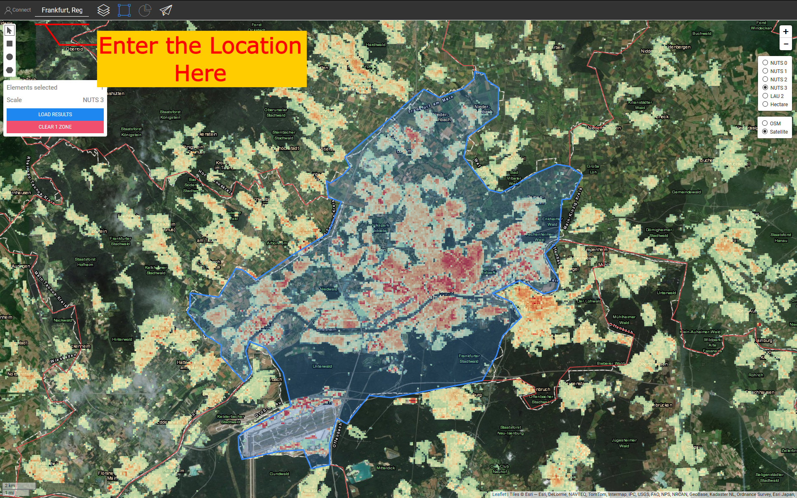
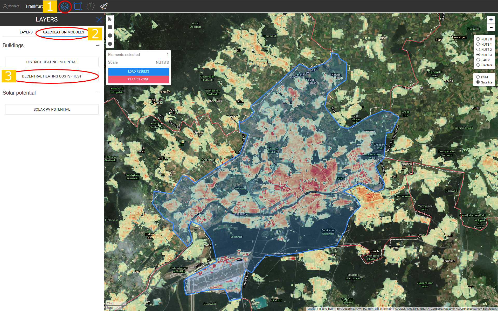
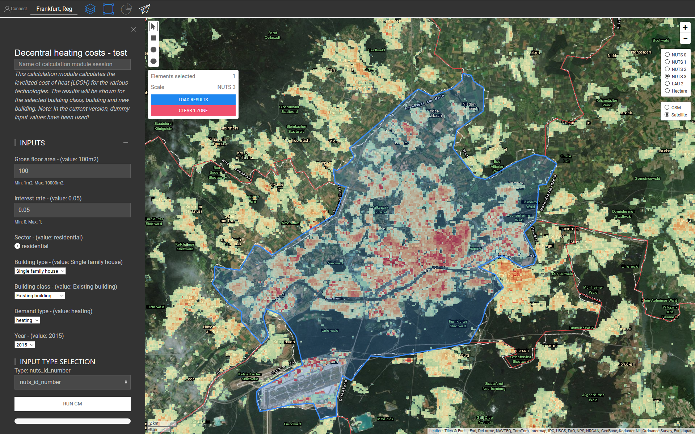
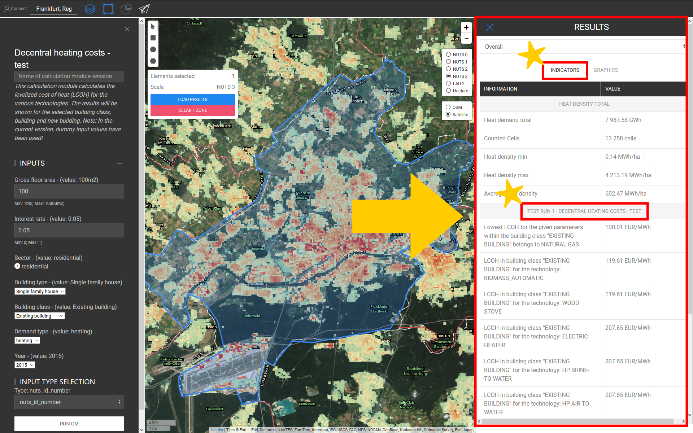
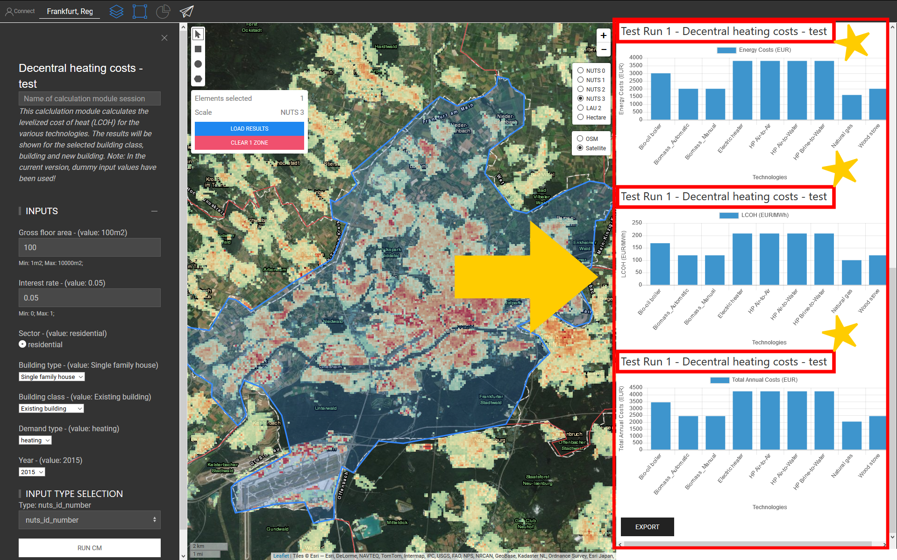
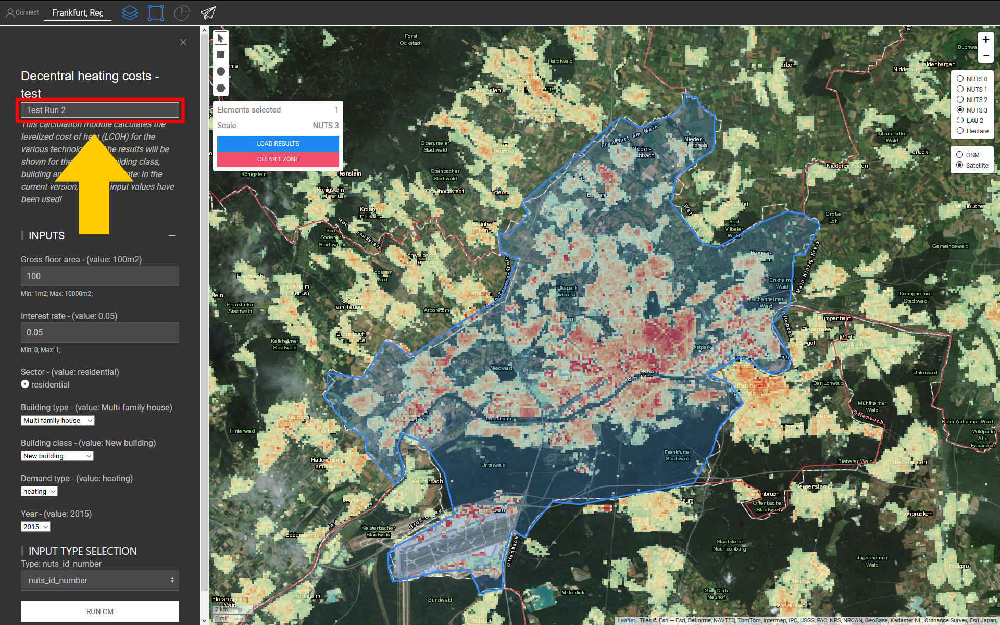
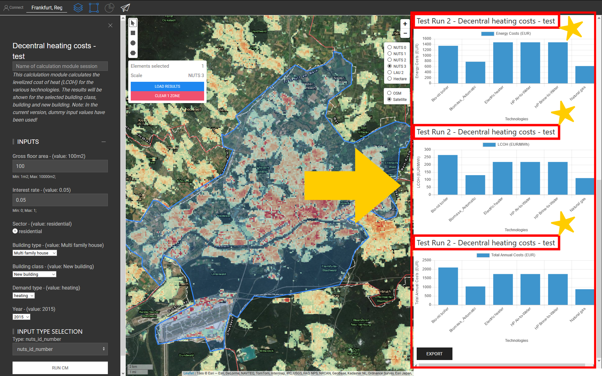

<h1>CM Decentral heating supply</h1>

## Table of Contents

* [Introduction](#introduction)
* [Inputs and outputs](#inputs-and-outputs)
* [Method](#method)
* [GitHub repository of this calculation module](#github-repository-of-this-calculation-module)
* [Sample run](#sample-run)
  * [Test Run 1: single family house, existing building](#test-run-1-single-family-house-existing-building)
  * [Test Run 2: multi-family house, new building](#test-run-2-multi---family-house-new-building)
* [References](#references)
* [How to cite](#how-to-cite)
* [Authors and reviewers](#authors-and-reviewers)
* [License](#license)
* [Acknowledgement](#acknowledgement)

## Introduction

The decentral heating cost calclulation module (CM) calculates the levelized cost of heat (LCOH) for the various technologies in residential or service sector. **This module can be run for NUTS 3 region.** The technologies are as follows:

* Heat pump air-to-air, air-to-water and Brine-to-water,
* Electric heater,
* Bio-oil boiler,
* Oil boiler,
* Biomass automatic and manual,
* Wood stove,
* Natural gas,
* Solar thermal

The results will be shown for the selected building type and building class.

🔺 <mark>**Note 1:** The current version on the toolbox is a test version. We are considering to use additional data and expand the functionality of this calculation module. </mark>

🔺 <mark>**Note 2:** Due to wide range of taxation methods and tax refunds in different countries, it is not considered in this calculation module. </mark>
[**`To Top`**](#table-of-contents)

## Inputs and outputs
The input parameters and layers as well as output layers and parameters are as follows.

**Input parameters are:**

* Gross floor area of the building in [_**m<sup>2</sup>**_]: a value between _*1*_ and _*10000*_
* Interest rate: a value between _*0*_ and _*1*_
* Sector: residential or service (🔺 Currently, only residential is supported)
* Building type: single family or multi family house
* Building class: existing, renovated or new building
* Demand type: heating or cooling (🔺 Currently, only heating is supported)
* Year: (🔺 Currently, only for the year 2015 is supported)

**Output are:**
* graphs
* indicators

[**`To Top`**](#table-of-contents)

## Method

In the first step, based on the selected zone, the specific heating demand for the selected sector, building type, building class and demand type is extracted from the hotmap database. Heating system cost related parameters in selected zone also obtained from the Hotmaps database.
By multiplying the specific heating demand and the gross floor area of the building, the energy demand is obtained. Subsequently, for calculation of the levelized cost of heat, the following steps should be taken:

```
# final energy demand [kWh]
final_energy_demand = energy_demand / efficiency_heating_system

# OPEX: Operational Expenditure (EUR)
OPEX = fix_operation_and_maintenance * heat_load + variable_operation_and_maintenance * final_energy_demand

# CAPEX: Capital Expenditure (EUR)
CAPEX = heat_load * specific_investment_cost_of_heating_system * annuity_factor

# energy costs (EUR)
energy_costs = final_energy_demand * energy_price

# total costs heat supply (EUR)
total_costs = OPEX + CAPEX + energy_costs

# levelized cost of heat (LCOH) [EUR/kWh]
LCOH = total_costs / energy_demand

```
The above process is performed for all heating systems mentioned in the [Introductio](#introduction) section.  The summary of the results is presented in form of graphs and indicators in the toolbox.


[**`To Top`**](#table-of-contents)


## GitHub repository of this calculation module

[Here](https://github.com/HotMaps/lcoh/tree/develop) you get the bleeding-edge development for this calculation module.

[**`To Top`**](#table-of-contents)


## Sample run
Here, the calculation module is run for a building with gross floor area of _100 m<sup>2</sup>_ in Frankfurt once for a single family house, existing building category and once for a multi-family house, new building category.

First, use the "Go To Place" bar to navigate to Frankfurt and select the city.



Follow the steps as shown in the figure below:
* Click on the "Layers" button to open the "Layers" window:
* Click on the "CALCULATION MODULE" tab.
* Click on the "DISTRICT HEATING POTENTIAL" button.




* Now, the "DECENTRAL HEATING COSTS" opens and is ready to run.




[**`To Top`**](#table-of-contents)

### Test Run 1: single family house, existing building
Here, you can enter your desired values for running the calculation module. We set the input values as it is described in (Sample run)[#Sample-run] section. To run the calculation module, follow the next steps:

* Assign a name to the run session (optional - here, we chose "Test Run 1") and set the input parameters (here, default values were used).


* Once you entered the input data, press run button and wait until the process is finished.
* As output, indicators and diagrams are shown in the "RESULTS" window.



* Additionally, also several diagrams are generated.




[**`To Top`**](#table-of-contents)

### Test Run 2: multi-family house, new building

Here, you can enter your desired values for running the calculation module. We set the input values as it is described in (Sample run)[#Sample-run] section. To run the calculation module, follow the next steps:

* Assign a name to the run session (optional - here, we chose "Test Run 1") and set the input parameters (here, default values were used).




* Once you entered the input data, press run button and wait until the process is finished.
* As output, indicators and diagrams are shown in the "RESULTS" window.


* Additionally, also several diagrams are generated.




[**`To Top`**](#table-of-contents)

## References


## How to cite
Mostafa Fallahnejad, in Hotmaps-Wiki, CM-Decentral-heating-costs (April 2019)


## Authors and reviewers
This page is written by Mostafa Fallahnejad\*.
- [ ] This page was reviewed by Lukas Kranzl\*.

\* [Energy Economics Group - TU Wien](https://eeg.tuwien.ac.at/)

Institute of Energy Systems and Electrical Drives

Gusshausstrasse 27-29/370

1040 Wien


## License
Copyright © 2016-2019: Mostafa Fallahnejad

Creative Commons Attribution 4.0 International License

This work is licensed under a Creative Commons CC BY 4.0 International License.

SPDX-License-Identifier: CC-BY-4.0

License-Text: https://spdx.org/licenses/CC-BY-4.0.html


## Acknowledgement
We would like to convey our deepest appreciation to the Horizon 2020 [Hotmaps Project](https://www.hotmaps-project.eu) (Grant Agreement number 723677), which provided the funding to carry out the present investigation.

[**`To Top`**](#table-of-contents)


<!--- THIS IS A SUPER UNIQUE IDENTIFIER -->

View in another language:

 [German](../de/CM-Decentral-heating-supply)<sup>\*</sup> 

<sup>\*</sup> machine translated
