<h1>CM Excess heat transport potential</h1>

## Table of Contents

* [Introduction](#introduction)
* [Inputs and outputs](#inputs-and-outputs)
* [Method](#method)
* [Quick start](#quick-start)
* [Troubleshooting](#troubleshooting)
* [Sample run](#sample-run)
* [Authors and reviewers](#authors-and-reviewers)
* [License](#license)
* [Acknowledgement](#acknowledgement)

## Introduction

This CM - EXCESS HEAT TRANSPORT POTENTIAL will help the user to identify integration potentials for excess heat in district heating networks. The potentials are based on the CM - DISTRICT HEATING POTENTIAL. This CM identifies areas with favorable conditions for district heating networks. The CM - EXCESS HEAT TRANSPORT POTENTIAL shows how much heat could be covered by industrial excess heat in these areas. However, this does not mean that a district heating network already exists in this region.

The following data and methods are combined for the previous task.

Data:
* Heating requirements for nearby areas with favorable conditions for district heating networks, which are dissolved hourly (from the CM - DISTRICT HEATING POTENTIAL).

* Data on excess heat quantities of industrial companies in the area, which are also resolved hourly (from the data set industrial database).

* Assumptions about costs of heat exchangers, pumps and pipelines as well as heat losses for district heating pipelines.

Method (simplified):
* Pipeline design on the basis of a developed heuristic, which represents the problem of the design as a network flow problem.

The aim of the method is to represent the largest possible excess heat flow with not too many and thus too long pipelines to the possible district heating users by generating networks with maximum flows. However, particularly inefficient transport lines (with low heat flows and thus high specific heat transport costs) are not considered in the final network. The threshold for the economic efficiency of individual transport lines can be specified by the user (cf. Transmission line threshold).

The basic background of the approach is as follows: if there are only a few sources of excess heat, a single pipeline per source could always be taken into account for transporting the heat to a nearby area with favorable conditions for district heating. However, if there are several excess heat sources that are to flow into the same area, it would make sense to collect the heat and transport it to the area in a larger common pipeline. The approach with one pipe per source tends to overestimate the effort for the pipelines.

To counteract the above, the problem of pipeline planning was approximated by assuming a network flow problem. A heuristic is used to solve the problem, in which excess heat can be bundled and transported to the possible users. The concrete methodical design of the solution with the approach of the minimum span tree is described in the corresponding methodical part.
The pipeline design determined in the previous context does not therefore represent a detailed planning or real route guidance, but is only used for the approximation of costs for the distribution of the excess heat quantities in the nearby areas with favorable conditions for district heating networks (see CM - DISTRICT HEATING POTENTIAL, keyword coherent areas). This approximation of costs thus refers to the entire network.

The results should then first be interpreted as follows: if the recorded excess heat quantities were to be transported together to the indicated nearby areas, then the costs for heat distribution could be in the order of magnitude as indicated by the tool (cf. Levelized cost of heat supply). As a rule, the values for the entire network are also a good starting indicator for individual pipelines. The purpose of the results is therefore to provide a project developer or planner with an order of magnitude for possible distribution costs.

## Inputs and outputs

### Input layers and parameters

#### Provided by Toolbox

* District heating areas (for now directly provided by the district heating potential CM)

* Industrial database (by default provided by the toolbox)

* Load profiles for industry

* Load profiles for residential heating and domestic hot water

#### Provided by user

* Min. heat demand in hectare

  See [DH Potential CM](en-CM-District-heating-potential-areas-user-defined-thresholds).

* Min. heat demand in a DH area

  See [DH Potential CM](en-CM-District-heating-potential-areas-user-defined-thresholds).

* Search radius in km

  The maximum length of a transmission line from point to point.

* Lifetime of equipment in years

  Levelized costs of heat are in refence to this time period.

* Discount rate in %

  Rate of interest for credit required to build the network.

* Cost factor

  Factor to adapt network costs in case the default values do not accurately represent the costs. The investments necessary for the network are multiplied with this factor. Default costs can be found [here](en-CM-Excess-heat-transport-potential#computation-of-costs).

* Operational costs in %

  Operational costs of network per year. In percent of investments necessary for the network.

* Threshold value for transmission lines in ct/kWh

  The maximum levelized cost of heat of each individual transmission line. This parameter can be used to control the levelized cost of heat for the whole network. A lower value equals lower levelized cost of heat but also a reduction in excess heat used and vice versa.

#### Performance Parameters

* Time resolution

  Sets the interval between the network flow calculations over the whole year. Can be one of these values: (hour, day, week, month, year)

* Spatial resolution in km

  Sets the entry point distance in longitude and latitude direction in dh areas.

### Output

#### Layers

* Transmission lines

  Shape file showing the suggested transmission lines with their temperature, annual heat flow and cost. Details can be found here.

#### Indicators

* Total excess heat in selected area in GWh

  Total excess heat available of industrial plants in selected area and proximity.

* Excess heat connected in GWh

  Total excess heat available of industrial plants connected to a network.

* Excess heat used in GWh

  Actual excess heat used for dh.

* Investments necessary for the network in €

  Investment needed to build the network.

* Annual costs of network in €/year

  Costs caused by the annuity and operational costs of network per year.

* Levelized costs of heat supply in ct/kWh

  levelized cost of heat of the complete network.

#### Graphics

* DH potential and excess heat

  Graphic showing DH potential, total excess heat, connected excess heat and used excess heat.
  Details can be found [here](en-CM-Excess-heat-transport-potential#dh-potential-and-excess-heat).

* Excess heat used and investment necessary

  Graphic showing annual delivered excess heat to investment necessary for the network.
  Details can be found [here](en-CM-Excess-heat-transport-potential#excess-heat-used-and-investment-necessary).

* Excess heat used and levelized cost

  Graphic showing annual delivered excess heat to levelized cost for network and corresponding transmission line threshold.
  Details can be found [here](en-CM-Excess-heat-transport-potential#excess-heat-used-and-levelized-cost).

* Load curves

  Graphic showing monthly heat demand and excess.
  Details can be found [here](en-CM-Excess-heat-transport-potential#load-curves).

* Load curves  

  Graphic showing average daily heat demand and excess.
  Details can be found [here](en-CM-Excess-heat-transport-potential#load-curves).

#### Examples of Layer

##### Transmission lines

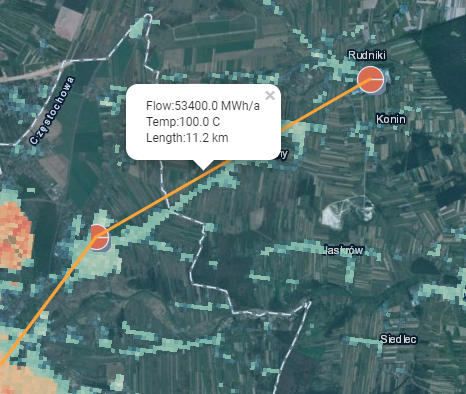
<figcaption><i>Example of a transmission line displayed in the toolbox</i></figcaption></figure>

By clicking on the transmission line additional information will pop up.

#### Examples of Graphics

##### DH potential and excess heat

<figure>
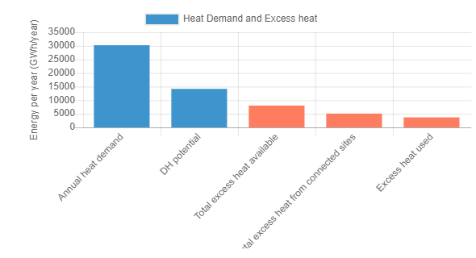
<figcaption><i>This graphic compares the DH potential, total excess heat, connected excess heat and used excess heat.</i></figcaption></figure>

More information about the annual heat demand and DH potential can be found [here](en-CM-District-heating-potential-areas-user-defined-thresholds).
The excess heat, connected excess heat and used excess heat are the same as their equally named [indicators](en-CM-Excess-heat-transport-potential#indicators).

##### Excess heat used and investment necessary

<figure>
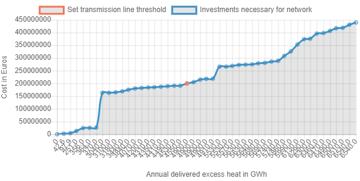
<figcaption><i>This graphic plots the costs of the network compared to the annual flow. The orange point represents the current network with its set transmission line threshold</i></figcaption></figure>

The x-axis represents the annual flow and the y axis the necessary investment for the complete network. Note that the x-axis is not linear and may be confusing. Always check the actual values! The orange point represents the network at the currently set [transmission line threshold](en-CM-Excess-heat-transport-potential#provided-by-user). Deviations from the [investment needed](en-CM-Excess-heat-transport-potential#indicators) indicator are common since the graphic is generated at a lower accuracy because of computational complexity. The trend and course of the graph represent how the [transmission line threshold](en-CM-Excess-heat-transport-potential#provided-by-user) affects the network and can be really helpful. Especially in conjunction with the next [graphic](en-CM-Excess-heat-transport-potential#excess-heat-used-and-levelized-cost). In case of small networks this graphic might not display any useful information since the network is not complex enough for variations.

##### Excess heat used and levelized cost

<figure>
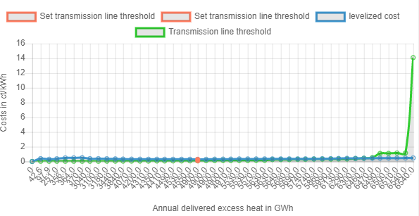
<figcaption><i>This graphic plots levelized heating costs and the necessary transmission line threshold for a certain flow. The orange points represent the value with the currently set transmission line threshold</i></figcaption></figure>

The x-axis represents the annual flow and the y axis both levelized costs of heat and the transmission line threshold. The orange points represents the network at the currently set [transmission line threshold](en-CM-Excess-heat-transport-potential#provided-by-user). Since the transmission line threshold curve can scale a lot higher than the levelized costs it might be helpful to disable the view of the transmission line threshold curve like shown in the picture below. In case of small networks this graphic might not display any useful information since the network is not complex enough for variations.

<figure>
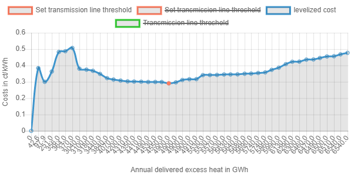
<figcaption><i>Sometimes it can be helpful to hide the transmission line threshold in the graphic to analyze the levelized costs.</i></figcaption></figure>

Deviations from the [levelized costs of heat](en-CM-Excess-heat-transport-potential#indicators) indicator are common since the graphic is generated at a lower accuracy because of computational complexity. The trend and course of the graph represent how the [transmission line threshold](en-CM-Excess-heat-transport-potential#provided-by-user) affects the network and can be really helpful. Once a desired levelized cost of heat is chosen the transmission line threshold curve can be reenabled and the corresponding transmission line threshold for the desired levelized cost can be read by hovering over the curve at this point. More details on how to use the graphic can be found here.

##### Load curves

<figure>
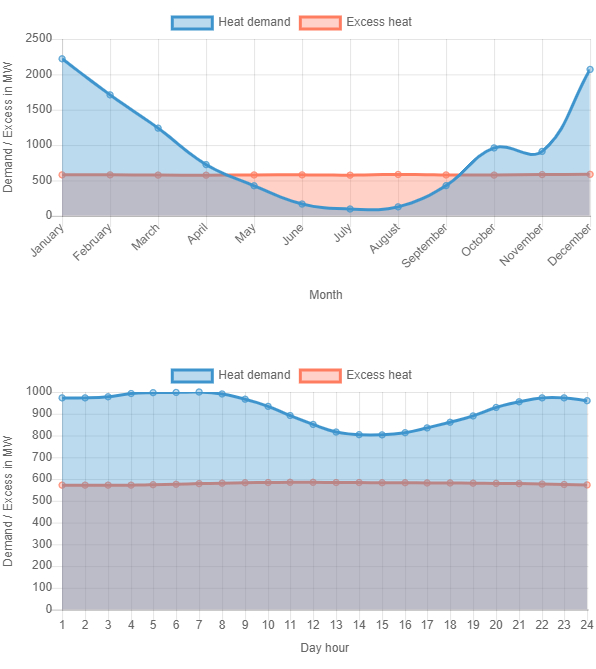
<figcaption><i>This graphic shows the total flow through the network throughout the year. The lower graphic represents the average day.</i></figcaption>
</figure>

The x-axis represents time and the y-axis power. The blue curves represents the heat demand of the DH areas and the red the excess heat available. The intersection of both curves represent the actual total flow of heat. The upper graphic shows the flow over the year and the bottom one the flow of the average day. Note that [time resolution](en-CM-Excess-heat-transport-potential#performance-parameters) needs to be set at least to "month" for the upper and "hour" for the lower graphic to be representative.

## Method

### Overview
The key element of the excess heat module is the source sink model used.
It constructs a transmission network of minimum length and computes the flow for every hour of the year based on residential heating load profiles with Nuts2 resolution and industry load profiles with Nuts0 resolution. Based on averaged peak flows throughout the year costs for every transmission line and heat exchanger on the source and sink side can be computed.

### Details
#### Modeling of sources
Based on the Nuts0 ID and the industrial sector a yearlong hourly resolved load profile is assigned to every source.

#### Modeling of sinks
Based on the district heating potential calculation module equidistantly entry points are created in the coherent areas. Depending on the Nuts2 ID of the entry points a load profile is assigned.

#### Fixed radius search
Within a set radius it is checked which sources are in range of each other, which sinks are in range of each other and which sinks are in range for sources. This can be represented by a graph with sources and sinks forming the vertices and the vertices in range being connected by an edge.

#### Reduction to minimum length network
A minimum spanning tree is computed with the distance of the edges as weights. This results in a graph retaining its connectivity while having a minimum total length of edges. Note that the entry points of coherent areas are connected internally for free since they form their own distribution network.

#### Flow computation
The maximum flow from the sources to the sinks is computed for every hour of the year.

#### Cost determination
The peak flow of the year averaged over 3 hours determines the required capacity for the transmission lines and heat exchangers. The costs of the transmission lines depend on the length and capacity, while the costs of the heat exchangers are only influenced by the capacity. On the source side an air to liquid heat exchanger with integrated pump for the transmission line and on the sink side a liquid to liquid heat exchanger are assumed.

#### Variation of network
Since the cost and flow of every transmission line are known the lines with the highest cost to flow ratio can be removed and the flow recomputed until a desired cost per flow is achieved.

### Implementation
#### Fixed radius search
For the computation of the distance between two points a small angle approximation of the loxodrome length is used. While there is also an accurate implementation of the orthodrome distance the increased accuracy has no real benefit because of the small distances mostly lower than 20km and the uncertainty of the real transmission line length because of many factors like topology.
If two points are in range of the radius it is stored in an adjacency list. The creation of such adjacency lists is performed between sources and sources, sinks and sinks, and sources and sinks. The reason for the separation lies in the flexibility to add certain temperature requirements for sources or sinks.

<figure>

<figcaption><i> 
Example of a fixed radius search. The red vertices represent sources and the blue ones sinks. The numbers represent the distance between the points. Drawing is not to scale.</i></figcaption>
</figure>

#### NetworkGraph class
Based on the igraph library a NetworkGraph class is implemented with all functionality needed for the calculation module. While igraph is poorly documented it offers much better performance than pure python modules like NetworkX and a wider platform support beyond Linux unlike graph-tool.
The NetworkGraph class describes only one network on the surface but contains 3 different graphs. Firstly, the graph describing the network as it is defined by the three adjacency lists. Secondly the correspondence graph internally connecting sinks of the same coherent area and last the maximum flow graph used for the maximum flow computation.

##### Graph
Only contains the real sources and sinks as vertices.

<figure>

<figcaption><i>  
Example of a graph. The red vertices represent sources and the blue ones sinks.</i></figcaption>
</figure>

##### Correspondence graph
Every sink needs a correspondence id, which indicates, if it is internally connected by an already existing network like in coherent areas. Sinks with the same correspondence id are connected to a new vertex with edges with zero weights. This is crucial for the computation of a minimum spanning tree and the reason the correspondence graph is used for it. This feature is also implemented for sources but not used.

<figure>

<figcaption><i>   Example of a correspondence graph. The red vertices represent sources and the blue ones sinks. The three sinks on the right are coherent connected by an additional larger vertex</i></figcaption>
</figure>

##### Maximum flow graph
Since igraph does not support multiple sources and sinks in its maximum flow function an auxiliary graph is needed. It introduces an infinite source and sink vertex. Every real source is connected to the infinite source and every real sink is connected to the infinite sink by an edge. Note that if a sink is connected to a correspondence vertex this vertex will be connected rather than the sink itself.

<figure>
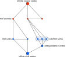
<figcaption><i>   Example of a maximum flow graph.</i></figcaption>
</figure>

##### Minimum spanning tree computation
Based on the correspondence graph the minimum spanning tree is computed. The edges connecting the coherent sinks always have the weight 0 so they will always remain part of the minimum spanning tree.

<figure>

<figcaption><i>   Example of a correspondence graph with the weights of every edge and its minimum spanning tree.</i></figcaption>
</figure>

##### Maximum flow computation
The flow through the edges connecting the real sources or sinks to the infinite source or sink respectively is capped to the real capacity of each source or sink. For numerical reasons the capacities are normalized so that the largest capacity is 1. The flow through the subset of edges contained in the correspondence graph is limited to 1000 which should, for all intense and purposes offer unrestricted flow. Then the maximum flow from the infinite source to the infinite sink is computed and the flow rescaled to its original size. Since coherent sinks are not directly connected to the infinite sink vertex but by the correspondence vertex the flow through it is limited to the sum of all coherent sinks.

<figure>
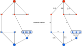
<figcaption><i>   Example of a maximum flow graph and the capacities of each source and sink. The right graph shows the maximum flow allowed through each edge after the normalization. Note that the maximum flow allowed through the edges with infinity symbol is actually capped to 1000 in the implementation.</i></figcaption>
</figure>

The implementation of the igraph maximum flow function uses the Push-relabel algorithm. This type of algorithm is not cost sensitive and might not always find the shortest way of routing the flow. A cost sensitive algorithm is not available in igraph and the performance would be likely to low to be able to resolve an hourly based flow throughout the year. But because of the prior reduction to a minimum spanning tree the cases in which a non-ideal solution is chosen are very limited and unlikely. The Push-relabel algorithm also has tendency to rout the flow through the least amount of edges. The igraph implementation seems to be deterministic in the order of allocation of the flow if the graphs are at least automorphisms, which is important for the hourly based flow calculation since any artificially introduced flow oscillation between edges is undesirable.

<figure>
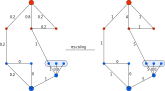
<figcaption><i>   Flow computed by the max flow algorithm and the rescaling to the original size.</i></figcaption>
</figure>

#### Heat sources

The heat sources are taken from the **[industrial database.]( https://gitlab.com/hotmaps/industrial_sites/industrial_sites_Industrial_Database)** Based on their excess heat, Nuts0 ID and industrial sector a load profile covering every hour of the year is created for each site. The custom addition of sites is planned.

#### Heat sinks

The heat sinks are based on coherent areas with a known heat demand. The coherent areas form a mask for a grid on which equidistant points are placed as entry points. Depending on the selected Nuts2 ID a residential heating profile is assigned to the sinks. The custom addition of entry points and sinks is planned.

<figure>
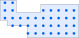
<figcaption><i>   Example of a coherent area and its generated entry points.</i></figcaption>
</figure>

#### Load profiles

The mentioned load profiles consist of 8760 points which represent the load for every hour of the 365 days. Further information about the **[load profiles can be found here.](https://gitlab.com/hotmaps/load_profile)**

#### Computation of costs

Since district heating systems have a large heat capacity a peak in flow does not mean the transmission lines need to deliver that short spike of heat instantaneously. Therefore, the required capacities of the transmission lines and heat exchangers are determined by the averaged peak load. Specifically, the numpy convolution function is used to average the flow over the last three hours by convoluting with a constant function. Depending on this value a transmission line from the following table is chosen.

*Specific costs of transmission lines used*

| Power in MW   | Costs in €/m  | Temperature in °C  |
| ------------- |:-------------:| -----:|
| 0.2           | 195           | &lt;150 |
| 0.3           | 206           | &lt;150 |
| 0.6           | 220           | &lt;150 |
| 1.2           | 240           | &lt;150 |
| 1.9           | 261           | &lt;150 |
| 3.6           | 288           | &lt;150 |
| 6.1           | 323           | &lt;150 |
| 9.8           | 357           | &lt;150 |
| 20            | 426           | &lt;150 |
| 45            | 564           | &lt;150 |
| 75            | 701           | &lt;150 |
| 125           | 839           | &lt;150 |
| 190           | 976           | &lt;150 |
| &gt;190          | 976           | &lt;150 |

The costs of the heat exchanger on the source side which is assumed as air to liquid is computed with

CHSource(en-P) = Ppeak * 15,000€/MW.

The costs of the liquid to liquid heat exchanger on the sink side is determined with

CHSink(en-P) = Ppeak * 265,000€/MW if Ppeak &lt; 1MW or

CHSink(en-P) = Ppeak * 100,000€/MW else.

The costs of the pump follow

CPump(en-P) = Ppeak * 240,000€/MW if Ppeak &lt; 1MW or

CPump(en-P) = Ppeak * 90,000€/MW else.

#### Removal of transmission lines

With a cost to flow threshold for transmission lines they can be removed if exceeding it to improve the flow to cost ratio. After the removal of edges, the flow must be recomputed since the continuity of flow in the graph is not guaranteed anymore. The cost to flow ratio might also increase for other edges now, so this process is repeated until the sum of all flows does not change anymore.

#### Description of the complete routine

First the heat sources and sinks are loaded with their load profiles. Then the fixed radius search is performed, and the Network initialized. Afterwards the Network is reduced to its minimum spanning tree and the maximum flow is computed for every hour of the year. Based on the flow the costs for every heat exchanger, pump and transmission line is computed. If a threshold cost to flow ratio is defined the removal of transmission line procedure is executed. In the end the total cost and total flow of the network and the layout of the network is returned.

## Quick start

The present CM - EXCESS HEAT TRANSPORT POTENTIAL is intended to help the user to identify integration potentials for excess heat in district heating networks. Although numerous analysis functions are given in order not to restrict the user, it must be explicitly pointed out that this is not a detailed technical planning.
The potentials are based on the CM - DISTRICT HEATING POTENTIAL. This CM identifies areas with favorable conditions for district heating networks. The CM - EXCESS HEAT TRANSPORT POTENTIAL thus shows how much heat could be covered by industrial excess heat in these areas. However, this does not mean that a district heating network already exists in this region. An application-oriented use of the tool for practitioners could therefore look as follows:

* If necessary, add your own data on excess heat providing companies in the region with the [add industry plant](en-CM-Add-industry-plant) cm.

* Turn on the "Industrial sites excess heat"

* Execute the CM - EXCESS HEAT TRANSPORT POTENTIAL.

* The Value
<figure>
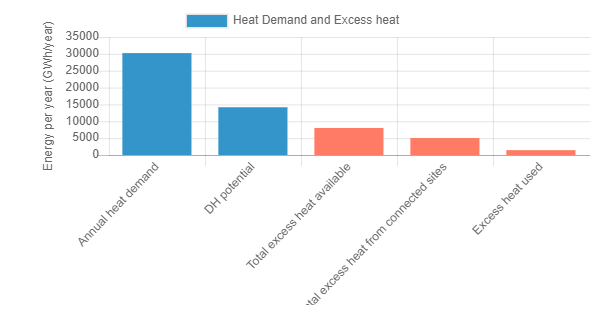
<figcaption><i>This graphic compares the DH potential, total excess heat, connected excess heat and used excess heat.</i></figcaption></figure>

  shows how much heat could be covered by excess heat in the investigated area.

* Value
<figure>
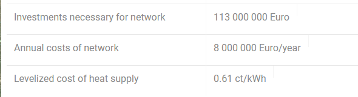
<figcaption><i>Indicators Investments necessary, Annual costs and levelized cost of heat</i></figcaption></figure>

 shows the specific heat production costs for the whole network. Note: the displayed costs have been estimated  using a simplified approach. These costs do not apply to individual pipelines. However, the displayed costs can be used as a simplified starting assumption as transport costs for the integration of excess heat into a possibly nearby district heating network.

From the above, the following work hierarchy could be used:
1. Check whether a district heating network exists or is planned in the region under consideration.

2. The displayed pipes contain flows. There you can see how much excess heat is transported from the respective sources. The affected companies could now be contacted. Probably first the companies with the high quantities.
<figure>
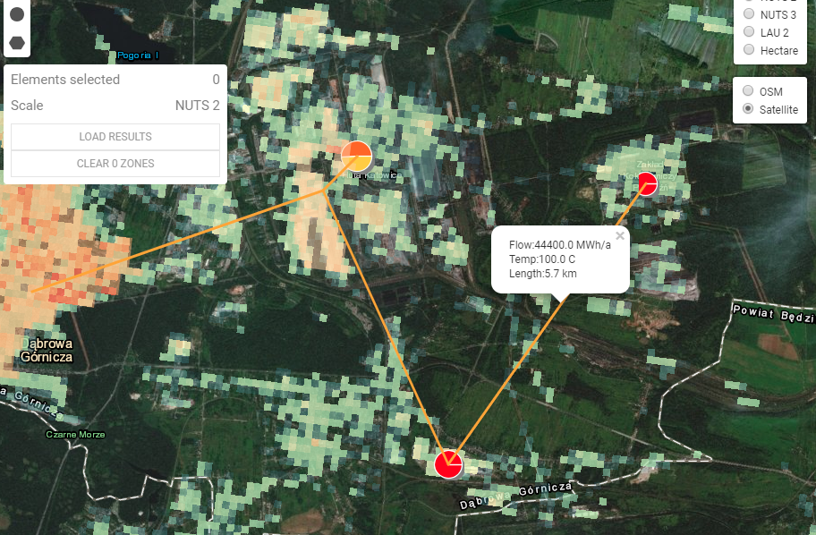
<figcaption><i>Transmission line and its flow</i></figcaption></figure>

3. If the operator of the district heating network and the producer of the excess heat are interested in cooperating, more detailed feasibility studies could be commissioned. In the best case, the displayed data will help to initiate real projects.

## Troubleshooting

#### CM does not finish

* Reduce [spatial resolution](en-CM-Excess-heat-transport-potential#performance-parameters) (increase kms)
* Reduce [time resolution](en-CM-Excess-heat-transport-potential#performance-parameters)
* Select smaller area
* Decrease [search radius](en-CM-Excess-heat-transport-potential#provided-by-user)
* Rerun at a later point

#### CM crashes without message

* Rerun at a later point
* Contact CM developer

#### Error: "No dh area in selection."

Check [DH Potential CM](en-CM-District-heating-potential-areas-user-defined-thresholds) to adapt inputs so that a dh area is created.

#### Error: "No industrial sites in selected area."

Check "industrial sites" layer in user selection.

#### Error: "No entry points in selected area."

Check [warning](en-CM-Excess-heat-transport-potential#warning-no-residential-heating-profile-available-for-).

#### Error: "No industrial sites in range."

Increase [search radius](en-CM-Excess-heat-transport-potential#provided-by-user)

#### Error: "No excess heat used."

Increase [transmission line threshold](en-CM-Excess-heat-transport-potential#provided-by-user)

#### Warning: "No industry profiles available for ..."

Check country and subsector of uploaded industrial sites.

#### Warning: "No residential heating profile available for ..."

CM does not have access to residential heating profile data to be executed in this area.

## Sample run

### Sample run 1

Sample run in PL22 with default parameters. It is recommended to turn on excess heat sites in the layers tab.

<figure>
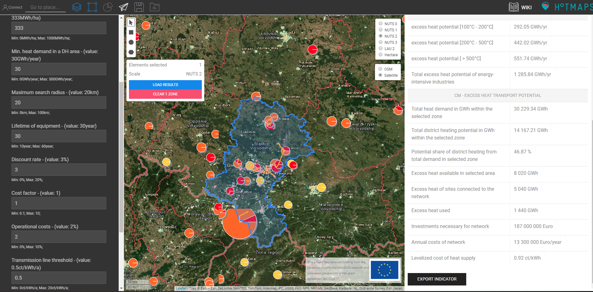
<figcaption><i>Sample run in PL22. The pink areas represent the district heating. The orange circles the heat source and the orange lines the transmission lines of the network.</i></figcaption>
</figure>

<figure>

<figcaption><i>This graphic compares the DH potential, total excess heat, connected excess heat and used excess heat.</i></figcaption>
</figure>

<figure>
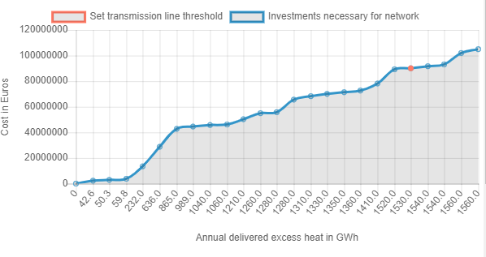
<figcaption><i>This graphic plots the costs of the network compared to the annual flow. The orange point represents the current network with its set transmission line threshold</i></figcaption>
</figure>

In this case we can see that there is much more excess heat available than used, but on the other side the maximum possible flow is almost achieved, since the orange point is at 1530 GWh per year. In this case increasing the search radius can help to distribute more excess heat. In sample run 2 we will do exactly that.

<figure>
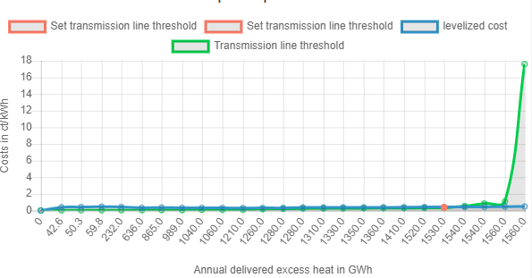
<figcaption><i>This graphic plots levelized heating costs and the necessary transmission line threshold for a certain flow. The orange points represent the value with the currently set transmission line threshold</i></figcaption>
</figure>

<figure>
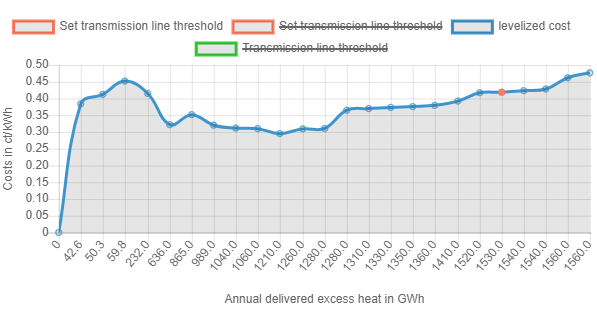
<figcaption><i>Sometimes it can be helpful to hide the transmission line threshold in the graphic to analyze the levelized costs.</i></figcaption>
</figure>

<figure>
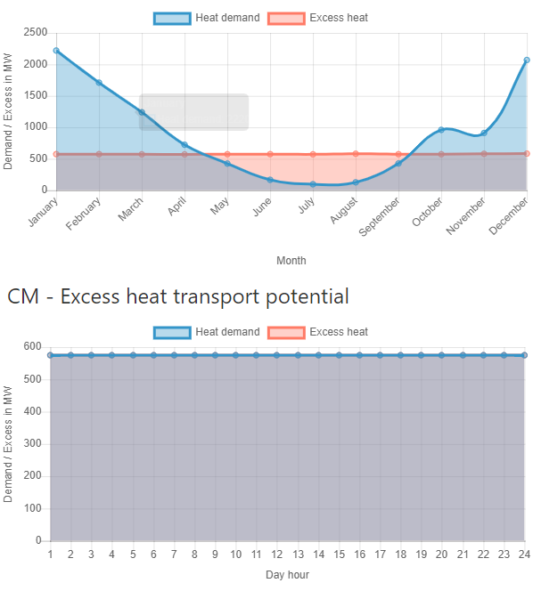
<figcaption><i>This graphic shows the total flow through the network throughout the year. The lower graphic represents the average day. Since the default time resolution is set to "week" it is constant in this case.</i></figcaption>
</figure>

### Sample run 2

Sample run in PL22 with maximum search radius set to 40 kms.

<figure>
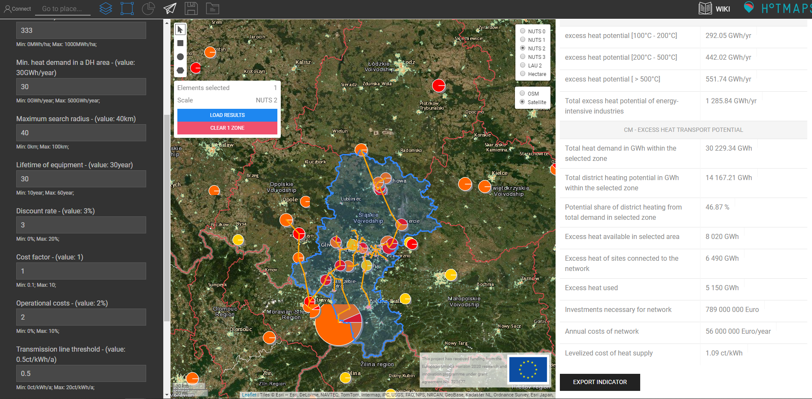
<figcaption><i>Sample run in PL22. The pink areas represent the district heating. The orange circles the heat source and the orange lines the tranmission lines of the network.</i></figcaption>
</figure>

Network is much larger than in the first sample run.

<figure>
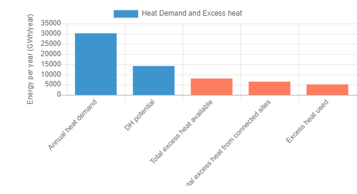
<figcaption><i>This graphic compares the DH potential, total excess heat, connected excess heat and used excess heat.</i></figcaption>
</figure>

More excess heat is used.

<figure>
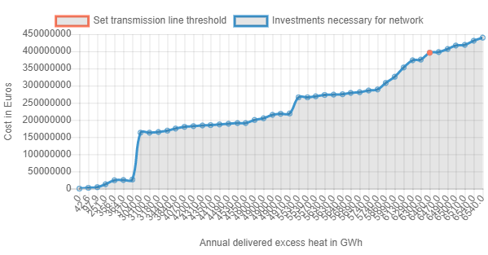
<figcaption><i>This graphic plots the costs of the network compared to the annual flow. The orange point represents the current network with its set transmission line threshold</i></figcaption>
</figure>

<figure>
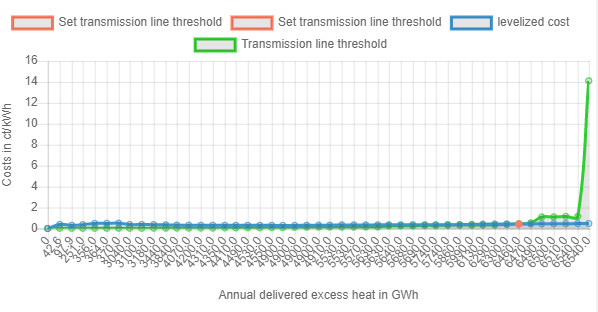
<figcaption><i>This graphic plots levelized heating costs and the necessary transmission line threshold for a certain flow. The orange points represent the value with the currently set transmission line threshold</i></figcaption>
</figure>

<figure>
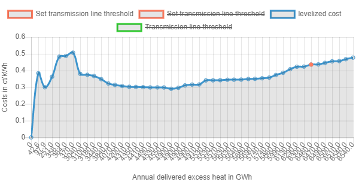
<figcaption><i>Sometimes it can be helpful to hide the transmission line threshold in the graphic to analyze the levelized costs.</i></figcaption>
</figure>

We can see a local minimum of levelized cost of heat supply at 4900 GWh per year. By hovering over the green line we can determine this is achieved with a transmission line threshold of 0.11 ct/kWh. In sample run 3 we are going to try to find this network.

<figure>
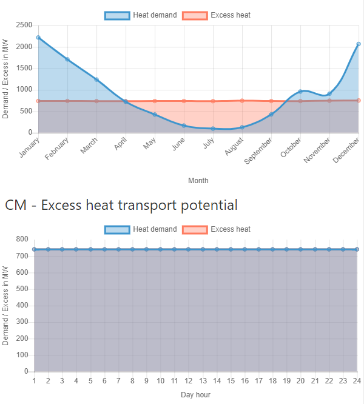
<figcaption><i>This graphic shows the total flow through the network throughout the year. The lower graphic represents the average day. Since the default time resolution is set to "week" it is constant in this case.</i></figcaption>
</figure>

### Sample run 3

Sample run in PL22 with maximum search radius set to 40 kms, transmission line threshold set to 0.11ct/kWh and time resolution set to "hour".

<figure>
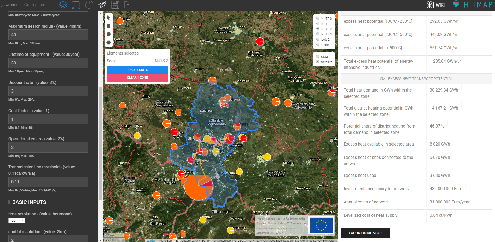
<figcaption><i>Sample run in PL22. The pink areas represent the district heating. The orange circles the heat source and the orange lines the transmission lines of the network.</i></figcaption>
</figure>

Network is smaller than in the second run but retains much of the flow.

<figure>

<figcaption><i>This graphic compares the DH potential, total excess heat, connected excess heat and used excess heat.</i></figcaption>
</figure>

<figure>

<figcaption><i>This graphic plots the costs of the network compared to the annual flow. The orange point represents the current network with its set transmission line threshold</i></figcaption>
</figure>

<figure>

<figcaption><i>This graphic plots levelized heating costs and the necessary transmission line threshold for a certain flow. The orange points represent the value with the currently set transmission line threshold</i></figcaption>
</figure>

<figure>

<figcaption><i>Sometimes it can be helpful to hide the transmission line threshold in the graphic to analyze the levelized costs.</i></figcaption>
</figure>

We can see that we just hit the local minimum. The difference in the cost approximation graphs to the indicators is caused by approximation errors. But those errors are mostly systematic and hence do not offset the minimum but just scale the curve in a different way. The levelized cost indicator now shows 0.84 ct/kWh instead of the 1.09 ct/kWh in the second run.

<figure>

<figcaption><i>This graphic shows the total flow through the network throughout the year. The lower graphic represents the average day. This time with time resolution set to "hour" the average day is represented correctly.</i></figcaption>
</figure>

## Authors and reviewers

This page is written by Ali Aydemir \* and David Schilling \*
- [ ] This page was reviewed by Tobias Fleiter\*.

\* [Fraunhofer ISI](https://isi.fraunhofer.de/)
Fraunhofer ISI, Breslauer Str. 48,
76139 Karlsruhe

## License
Copyright © 2016-2018: Ali Aydemir, David Schilling

Creative Commons Attribution 4.0 International License
This work is licensed under a Creative Commons CC BY 4.0 International License.

SPDX-License-Identifier: CC-BY-4.0

License-Text: https://spdx.org/licenses/CC-BY-4.0.html

## Acknowledgement
We would like to convey our deepest appreciation to the Horizon 2020 [Hotmaps Project](https://www.hotmaps-project.eu) (Grant Agreement number 723677), which provided the funding to carry out the present investigation.

[**`To Top`**](#table-of-contents)

