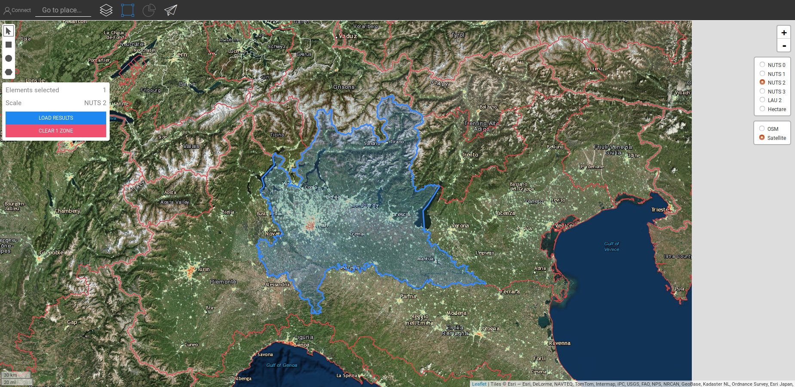

<h1>CM Solar thermal and PV potential</h1>

## Table of Contents
* [In a glance](#in-a-glance)
* [Introduction](#introduction)
* [Inputs and outputs](#inputs-and-outputs)
* [Method](#method)
  * [Example](#method_example)
* [Sample run](#sample-run)
  * [Test Run 1: default input values](#sample-run_test-run-1-default-input-values)
  * [Test Run 2: modified input values](#sample-run_test-run-2-modified-input-values)
* [How to cite](#how-to-cite)
* [Authors and reviewers](#authors-and-reviewers)
* [License](#license)
* [Acknowledgement](#acknowledgement)

## In a glance
This module calculates the energy supply potential and related costs for rooftop installed solar thermal and PV systems in a defined area. The inputs to the module are raster files of building footprint and solar irradiation, costs and efficiency of reference solar thermal and PV systems and the fractions of usable rooftop area where solar thermal and PV systems are installed.

[**`To Top`**](#table-of-contents)

## Introduction

It aims to compute the solar thermal and the photovoltaic energy potential and the financial feasibility of a selected area by considering:
- the installation of new Solar thermal / PV systems on a percentage of the available areas (the default area are the building footprint)
- assess the financial feasibility of new plants

[**`To Top`**](#table-of-contents)

## Inputs and outputs

The input parameters and layers, as well as output layers and parameters, are as follows.

**Input layers and parameters are:**

* raster file:
     * mean yearly solar irradiation [kWh m^{-2}] 
     * with the area available for the solar energy exploitation. The default raster use the building footprint raster file [m^{2}] 
* percentage of available area that can be covered with solar panels [%] 
* reference plant parameters:  
     * average installed peak power per plant [kW_p] 
     * system efficiency, value between 0 and 1 [-] 
     * the solar radiation at Standard Test Condition equal to 1 kW  m^{-2}
     * module efficiency at Standard Test Conditions [kW  m^{-2}]

**Output layers and parameters are:**

* Total cost of covering the selected area with PV panels [currency]
* Total yearly energy production [MWh/year]
* Levelized Cost of Energy  [€/kWh]
* Raster file with the most suitable areas for PV energy production

[**`To Top`**](#table-of-contents)

## Method

Starting from the available area and the kind of PV technology the module computes the PV energy production under the following assumptions:
- Optimal inclination of the PV system
- Area of the PV modules equal to the percentage of the building footprint chosen by the user
- Unique selected technology for all the installed PV systems
- Default system efficiency equal to 0.75 

These assumptions have been done in order to consider a planning phase for a region and not the design of a specific PV system.

The yearly energy output is derived by considering the spatial distribution of yearly solar radiation on the building footprint. The PV energy production is computed for a single representative plant.
The most representative installed peak power for a PV system is an input of the module.
Consequently, the surface covered by a single plant and the total number of plants are computed.
 
Finally, the most suitable area is computed by considering the roofs with higher energy production. 
The energy production of each pixel considers covering only a fraction of the roofs equal to f_roof. The integral of the energy production of the most suitable area is equal to the total energy production of the selected area.

### Example

To give a practical example of how the CM logic/methodology is applied to a predefined area.
By default, the input area we are using is the buildings' footprint. 
So for example, the city of Bolzano (Italy), since a large part of the city is the historic centre (where it is not possible to install solar panels) we can estimate that only 1 roof every 5 can be used to collect solar energy (~20%). Instead, if you provide an area that it is available to implement some solar field then you can set 100% of the area can be used for the solar system.

Which area of the 20% of the roofs in Bolzano can be covered by PV panels?
Cover the whole roof is no realistic, since part of the roof have not suitable orientation since the building generally has 4 sides we can imagine that around 25% of the roof have a good orientation (at least in Bolzano where most of the roofs are not plane and have 2 or 4 roofs slopes), but still, we have shadowing effects from the surrounding trees, buildings, mountains, etc, and generally, we are leaving some space close to the border of the roofs so let's imagine that 50% of the good oriented roof can be used by PV (25% * 50% = 12.5%), the default value is a bit more optimistic (15%).

In case of a solar field generally, the PV string occupies around 40-50% of the area to avoid the shadowing effect between PV strings.

#### Example with a PV system on a building footprint

For the sake of example, we are explaining the methodology for one single pixel, the CM is applying the same logic for each pixel in the area selected by the user. The default layer (the building footprint) has a pixel dimension of 100 x 100 m, therefore we have an available surface of 10000 m². For this example imagine that only 3000 m² of roofs are available in the pixel, the other missing part of the surface is surface dedicated to routes, green areas, river, etc. The logic implemented by the CM is:

* apply the first percentage to get only the roofs that I can host the system:
    `available_surface = 3000 [m²] * 20% = 600 [m²]`
* The surface that can be really covered by PV systems is estimated to be 12.5%, therefore:
    `available_pv_surface = 600 [m²] * 12.5% = 75 [m²]`
* Then we use the information of the PV efficiency (by default 0.15) to calculate the surface required to have a single PV plant (by default of 3 kWp)
    `single_pv_surface = 3 [kWp] / 0.15 = 20 [m²]`
* then we compute the number of PV systems that can be installed in the pixel that are:
    `n_pv_plants = 75 [m²] // 20 [m²] = 3`
  and therefore we will have 3 plants of 3 KWp installed on the pixel of 100 by 100 m (so 9 kWp), and then we multiply this value by the energy produced by 1 kWp and multiply by the efficiency of the PV systems (inverter and transmission, by default: 0.85) to obtain the total energy produced by the pixel:
    `pv_energy = solar_radiation [kWh/kWp/year] * 9 [kWp] * 0.85`

#### Example with a solar PV field

Now we have a pixel of 100 x 100m that it is available for a PV field system:

* as said before the first percentage is 100% since all the area can host the PV system:
    `available_surface = (100 x 100) [m²] * 100% = 10000 [m²]`
* The surface that can be covered by PV systems is:
    `available_pv_surface = 10000 m² * 50% = 5000 m²`
* Then we use the information of the PV efficiency (by default 0.15) to calculate the surface required to have a single PV plant (by default of 3 kWp)
    `single_pv_surface = 3 [kWp] / 0.15 = 20 [m²]`
* then we compute the number of systems that can be installed in the pixel that are:
    `n_pv_plants = 5000 // 20 = 250`
  and therefore we will have 250 plants of 3 KWp installed on the pixel of 100 by 100 m (so 750 kWp), and then we multiply this value by the hourly energy produced by 1 kWp and multiply by the efficiency of the PV systems (inverter and transmission, by default: 0.85) to obtain the total energy produced by the pixel:
    `pv_energy = solar_radiation [kWh/kWp/year] * 750 kWp * 0.85`

#### Example with a PV & ST system on a building footprint

The building surface that you can use it is a limited resource, therefore it is not possible to use the same surface to collect solar energy with a PV system and use also a Solar Thermal system.
So recalling the previous example we have already 75 m² of surface dedicated to PV, we estimated that the good-oriented roof it is around 25% and therefore, we have still other 75 [m²] available. We can only use a fraction, let's say that 7.5%, that mean that if before we consider a 25% of the roof with a good exposition then we are considering the 12.5% is dedicated to the PV and 7.5 is dedicated to ST, and therefore we are using 20% of the 25%.

So to give a practical example:

* apply the first percentage to get only the roofs that I can host the system:
    `available_surface = 3000 [m²] * 20% = 600 [m²]`
* The surface that can be really covered by ST systems is:
    600 m² * 7.5% = 67.5 m²
    `available_st_surface = 600 [m²] * 7.5% = 45 [m²]`
    note that `75 + 45 = 120 [m²]` that it is smaller than the estimated surface that could have a good exposition (`available_surface * 25% = 150 [m²]`).
* Then we use the information of the ST surface required by a ST system (by default 5 m²) to calculate the number of ST plants:
    `n_st_plants = 45 [m²] // 5 [m²] = 9`
* then we compute the installed surface of ST plants:
    st_surface = 9 * 5 m² = 45 [m²]`
* and now we are applying the global solar radiation (kWh/m²) by the covered surface by the efficiency of the ST panels (by default 0.85):
    `solar_radiation [kWh/m²] * 45 [m²] * 0.85`

[**`To Top`**](#table-of-contents)

## Test Run 1
Here, the calculation module is run for the Lombardy region in Italy (NUTS2).

* First, select Nuts2 and the chosen area.

* Follow the steps as shown in the figure below:
  * Click on the "Layers" button to open the "Layers" window:
  * Click on the "CALCULATION MODULE" tab.
  * Click on the "SOLAR PV POTENTIAL" button.

* Now, the "Solar PV Potential" opens and is ready to run. 

[**`To Top`**](#table-of-contents)

## Sample Run

### Test Run 1: default input values

The default input values consider the possibility to install roof-mounted PV panels on buildings. These values refer to a plant of 3 kWp. You may need to set values bellow or above default values considering additional local considerations and costs. Therefore, the user should tweak these values to find the best combination of thresholds for his/her case study.

To run the calculation module, follow the next steps:

* Assign a name to the run session (optional - here, we chose "Test Run 1") and set the input parameters (here, default values were used).

* Wait until the process is finished.
* As output, indicators and diagrams are shown in the "RESULTS" window. The indicators show:
  * Total energy production,
  * Total setup costs,
  * Number of installed systems,
  * Levelized Cost of Energy

* Also a new layer is added to the canvas showing the buildings with higher energy potential. This layer is added to the list of layers under the "Calculation module" category. The run session name distinguishes the outputs of this run from other ones.
If you deselected the default layers and select TEST RUN 1 you can visualize the most suitable areas for PV plants installations.

[**`To Top`**](#table-of-contents)

### Test Run 2: modified input values

Depending on your experience and local knowledge, you may increase or decrease the input values to obtain better results. You may decide to increase the building surface suitable for PV plants.

* Assign a name to the run session (optional - here, we chose "Test Run 2") and set the input parameters Percentage of buildings with solar panels equal to 50. It means that we are covering 50% of the available building roofs. Notice that since each pixel can represent more than one building and we are not covering the whole roof with PV panels, the user can set also the Effective building roof utilization factor. The default value is set to 0.15. This means that only 15% of the roof surface in a pixel is covered by PV panels.

* Wait until the process is finished.
* As output, indicators and diagrams are shown in the "RESULTS" window. The indicators show:
  * Total energy production,
  * Total setup costs,
  * Number of installed systems,
  * Levelized Cost of Energy

[**`To Top`**](#table-of-contents)

## How to cite
Giulia Garegnani, in Hotmaps-Wiki, CM-Solar-PV-potential (April 2019)

[**`To Top`**](#table-of-contents)

## Authors and reviewers

This page is written by Giulia Garegnani\*.

\* [Urban and Regional Energy System Group - EURAC Bozen](http://www.eurac.edu/en/research/technologies/renewableenergy/researchfields/Pages/Energy-strategies-and-planning.aspx)

Institute of Renewable Energy
Drususallee/Viale Druso 1
I-39100 Bozen/Bolzano
Italy

[**`To Top`**](#table-of-contents)

## License

Copyright © 2016-2019: Giulia Garegnani

Creative Commons Attribution 4.0 International License

This work is licensed under a Creative Commons CC BY 4.0 International License.

SPDX-License-Identifier: CC-BY-4.0

License-Text: https://spdx.org/licenses/CC-BY-4.0.html

[**`To Top`**](#table-of-contents)

## Acknowledgement

We would like to convey our deepest appreciation to the Horizon 2020 [Hotmaps Project](https://www.hotmaps-project.eu) (Grant Agreement number 723677), which provided the funding to carry out the present investigation.

[**`To Top`**](#table-of-contents)

<!--- THIS IS A SUPER UNIQUE IDENTIFIER -->

View in another language:

 [German](../de/Database-behind-the-Hotmaps-toolbox)\* 

\* machine translated