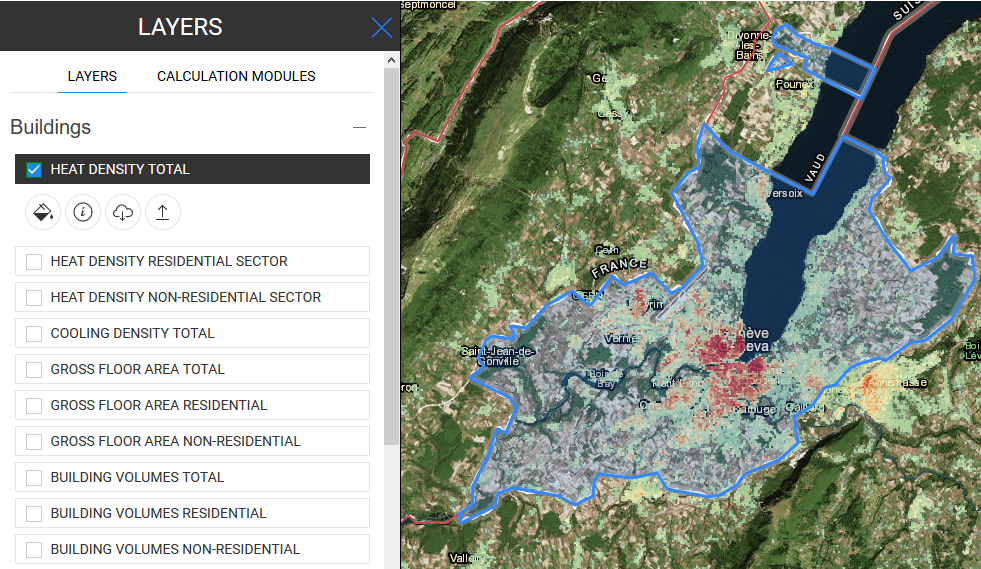

<h1>Data export functionalities</h1>

## Table of Contents

- [Introduction](#introduction)
- [How to export a dataset](#how-to-export-a-dataset)
- [How to cite](#how-to-cite)
- [Authors and reviewers](#authors-and-reviewers)
- [License](#license)
- [Acknowledgement](#acknowledgement)

## Introduction

The Hotmaps toolbox allows anyone to export part of a layer/dataset.

This feature requires basic usage knowledge on selection and layers. 

If you have any difficulties please read the following guides:

- [How to select a region in the Hotmaps toolbox](Select-a-region-in-the-Hotmaps-toolbox)
- [Layer selection](Layers-section-in-the-Hotmaps-toolbox)

[**`To Top`**](#table-of-contents)

## How to export a data set

1. Select the layer you want to export in the list of layers (left panel)

2. Select the selection scale on the right of the map (NUTS/LAU/hectare)

3. Select the the region you want with the selection tools

4. Once the selection is done, click on the  button that appears below the layer name on the left panel to start the download process.

   

5. Once finished you will get a .tif file on your computer

Once all these steps are done you will have an export of one of the layers.

You can then use it with your own tools and even edit it to import it back to the platform (see [Data upload](Data_upload) for indications on how to do it).

[**`To Top`**](#table-of-contents)

## How to cite
Daniel Hunacek and Lucien Zuber, in Hotmaps Wiki, Data export functionalities (September 2020)

[**`To Top`**](#table-of-contents)

## Authors and reviewers

This page was written by Daniel Hunacek and Lucien Zuber (**[HES-SO](https://www.hevs.ch)**).

&#9745; This page was reviewed by Mostafa Fallahnejad (**[EEG - TU Wien](https://eeg.tuwien.ac.at/)**).

[**`To Top`**](#table-of-contents)

## License

Copyright © 2016-2020: Daniel Hunacek and Lucien Zuber

Creative Commons Attribution 4.0 International License

This work is licensed under a Creative Commons CC BY 4.0 International License.

SPDX-License-Identifier: CC-BY-4.0

License-Text: https://spdx.org/licenses/CC-BY-4.0.html

[**`To Top`**](#table-of-contents)

## Acknowledgement

We would like to convey our deepest appreciation to the Horizon 2020 [Hotmaps Project](https://www.hotmaps-project.eu) (Grant Agreement number 723677), which provided the funding to carry out the present investigation

[**`To Top`**](#table-of-contents)

<!--- THIS IS A SUPER UNIQUE IDENTIFIER -->

View in another language:

 [German](../de/Data-export-functionalities)\* [Italian](../it/Data-export-functionalities)\* 

\* machine translated
