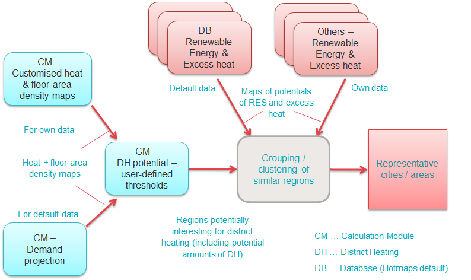

[**`Scenario Toolchain Steps`**](guide-national-level-comprehensive-assessment-eed#part-iii-analysis-of-the-economic-potential-for-efficiency-in-heating-and-cooling_different-steps)
[**`Next step`**](step-2-Costs-and-potentials-for-district-heating-in-representative-regions-or-cities)
   
<h1>Step 1: Identification of different representative cases for district heating</h1>

# Table of Contents
* [Step 1: Identification of different representative cases for district heating](#step-1-identification-of-different-representative-cases-for-district-heating)
  * [Calculation of future heat demand and building floor area density maps](#step-1-identification-of-different-representative-cases-for-district-heating_calculation-of-future-heat-demand-and-building-floor-area-density-maps)
  * [Identification of areas potentially interesting for district heating](#step-1-identification-of-different-representative-cases-for-district-heating_identification-of-areas-potentially-interesting-for-district-heating)
  * [Identification of representative, typical district heating areas for further analysis](#step-1-identification-of-different-representative-cases-for-district-heating_identification-of-representative-typical-district-heating-areas-for-further-analysis)

# Step 1: Identification of different representative cases for district heating

In order to identify different, representative, typical cases for further analysis of the costs and potentials for district heating in the country/region of interest Hotmaps provides various default data layers in the Hotmaps database as well as different Calculation Modules (CMs). Also, own data can be uploaded and used. This identification procedure can consist of the following steps:
* Calculate scenarios of future heat demand and building floor area density maps for the entire country/region of interest
* Identify areas potentially interesting for district heating based on user-defined threshold values
* Analyse/collect potentials for excess heat and renewable energy in the identified country/region potentially interesting for district heating
* Group/cluster similar regions and select representative cities/areas for further analysis

The following figure shows this procedure graphically and shows the various data sources and calculation modules that can be used.

*Figure: Identification of different representative, typical cases for district heating (Step 1)*

In the following subchapters, the different steps in this procedure are described in more detail.

<code><ins>**[To Top](#table-of-contents)**</ins></code>

## Calculation of future heat demand and building floor area density maps

The first step in the analysis is to generate future heat demand and floor area density maps for your region/country of interest. You can use data developed in the course of the Hotmaps project for all EU-28 countries (Hotmaps default data, available in the Hotmaps database), or you can use other heat demand density maps for your region/country of interest.

* **Use heat demand and floor area density maps developed in the course of the Hotmaps project** - default data on heat demand density from the Hotmaps database:
    * For all EU 28 Member States (MS) heat demand density maps reflecting the heat demand from space heating and hot water generation in buildings have been developed. They are available as the total demand in residential and non-residential buildings but also split between residential and non-residential buildings. All maps are all available at hectare level, i.e. with a resolution of 100x100m. The heat demand density maps can be accessed in the layers section of the Hotmaps database and more information on how to select the country/region of your interest can be found here.
    * It is possible to adapt the heat demand density maps according to assumptions regarding the future development of the heat demand in the buildings. Two different Calculation Modules (CMs) can be used:
        * The [CM - Scale heat and cold density maps](https://wiki.hotmaps.hevs.ch/en/CM-Scale-heat-and-cool-density-maps) can be used to recalculate the heat demand in each hectare using the same factor for all hectare elements.
        * The [CM - Demand projection](https://wiki.hotmaps.hevs.ch/en/CM-Demand-projection) can be used to generate future heat demand and floor area density maps based on default development scenarios of the building stock in the EU (link to further info on the default scenarios. It is also possible to adapt several parameters compared to the default calculations like a reduction of energy demand or a reduction of floor area.
* **Use own data on heat demand density in your country/region of analysis**:
    * It is possible to upload heat density maps in a raster file format (.tif) to the Hotmaps toolbox when creating a user account and logging in to the private section. Uploaded heat demand density layers can reflect the current situation of heat demand densities in the country/region of interest, or also a possible future scenario of heat demand densities, depending on the input data used for generating the respective layers. More information on how to create a user account and how to upload your own data can be found here.
    * It is also possible to further adapt the own heat density maps with the [CM - Scale heat and cold density maps](https://wiki.hotmaps.hevs.ch/en/CM-Scale-heat-and-cool-density-maps) or via the [CM - Demand projection](https://wiki.hotmaps.hevs.ch/en/CM-Demand-projection) like for the default layer.

The developed heat demand and floor area density maps are further used in the subsequent steps in other Calculation Modules (CMs).

<code><ins>**[To Top](#table-of-contents)**</ins></code>

## Identification of city/area potentially interesting for district heating

After developing possible future scenarios of heat demand and floor area density maps for the city/area of interest, potential district heating cities/areas can be identified. This can be done using the [CM - District heating potential areas: user-defined thresholds](https://wiki.hotmaps.hevs.ch/en/CM-District-heating-potential-areas-user-defined-thresholds) according to the following steps:

* The CM is possible to use at NUTS3 - NUTS0 level and also on hectare level (=own selection of an area). However, for larger areas calculation might take a long time, or the module may find too many feasible areas and may not be able to display the results. In such a case the area of interest can be split up, e.g. in the different NUTS3 or Hectare areas, and for each of these the CM can be started.
* The CM identifies potential district heating areas based on the following two threshold values: a heat demand threshold for the heat demand in each cell of the heat demand density map and a heat demand threshold for groups of connected cells with heat demand above the previous threshold (=coherent area). These two threshold values have to be defined by the user.
* Besides several other indicators the module generates a shapefile of potential district heating areas that are displayed and stored in the toolbox in the layers section. Especially of interest are the following indicators: total heat demand in the coherent area, average heat demand density in the area. 
* After having used the CM for the entire region/country of interest an overall map of potential district heating areas can be generated out of the single maps.

<code><ins>**[To Top](#table-of-contents)**</ins></code>

## Identification of representative, typical district heating areas for further analysis

The data collected in the two previous steps can be used to define different types of representative, typical district heating (DH) areas in the region/country of interest. Regions/cities with similar dimensions and combinations of total heat demand, average heat demand density, and potentials for renewable energy and excess heat can be grouped.

Possible indicators for grouping of typical district heating areas:
* overall heat demand in the area [GWh/yr]
* average heat demand density in the area [MWh/(ha*yr)]
* Available potential of renewable energy sources:
    * waste water treatment plants power
    * agricultural residues
    * livestock effluents
    * forest residues
    * municipal solid waste
    * geothermal potential heat conductivity
    * potential solar thermal collectors - rooftop
    * potential solar thermal collectors open - field
* excess heat potentials:
    * large industrial sites
    * other

For each of the developed groups of typical DH areas, then one or several representative cities/regions can be selected and further analysed. These can serve as representative case studies.

<code><ins>**[To Top](#table-of-contents)**</ins></code>
   
[**`Scenario Toolchain Steps`**](guide-national-level-comprehensive-assessment-eed#part-iii-analysis-of-the-economic-potential-for-efficiency-in-heating-and-cooling_different-steps)
[**`Next step`**](step-2-Costs-and-potentials-for-district-heating-in-representative-regions-or-cities)