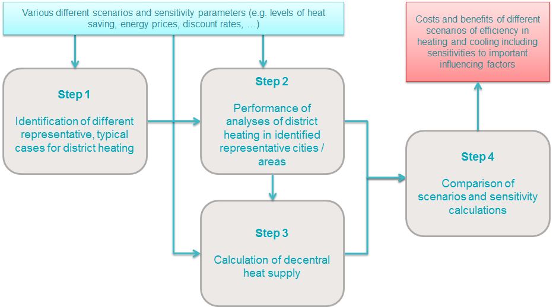

<h1>Guidelines for using the Hotmaps toolbox for analyses at national level</h1>

## Table of Contents
* [Introduction](#introduction)
* [Part I: Overview of heating and cooling](#part-i-overview-of-heating-and-cooling)
* [Part III: Analysis of the economic potential for efficiency in heating and cooling](#part-iii-analysis-of-the-economic-potential-for-efficiency-in-heating-and-cooling)
  * [Overview of the Hotmaps approach](#part-iii-analysis-of-the-economic-potential-for-efficiency-in-heating-and-cooling_overview-of-the-hotmaps-approach)
  * [Different Steps](#part-iii-analysis-of-the-economic-potential-for-efficiency-in-heating-and-cooling_different-steps)
* [How to cite](#how-to-cite)
* [Authors and reviewers](#authors-and-reviewers)
* [License](#license)
* [Acknowledgement](#acknowledgement)

## Introduction

These guidelines describe how the Hotmaps toolbox can be used to analyse costs and potentials for efficient and renewable heating and cooling at the national level. _**The guide is especially oriented towards the development of results according to the comprehensive assessment of national heating and cooling potentials referred to in Article 14(1) of the Energy Efficiency Directive (EED) in its current version.**_

<code><ins>**[To Top](#table-of-contents)**</ins></code>

## Part I: Overview of heating and cooling

The Hotmaps data sets and toolbox provides two different inputs to this part: first, the Hotmaps data sets provide default data for several of the data needed to include in this part I of the comprehensive assessment. Second, the Hotmaps toolbox is basically a mapping tool that not only allows a geographical representation of default data in the toolbox; but also, user uploaded data to the use account in the toolbox. In the following, we describe the different default data form Hotmaps and we link to the descriptions of how to use the upload function of the Hotmaps toolbox.

The following data relevant for Part I of Annex VIII is available in the Hotmaps database:

* Point 2: current heating and cooling supply
  * (b) (v) industrial installations:
    * [DB - Industrial sites excess heat](https://gitlab.com/hotmaps/industrial_sites/industrial_sites_industryBenchmarks)
    * [DB – Industrial sites company names](https://gitlab.com/hotmaps/industrial_sites/industrial_sites_Industrial_Database) 
    * [DB – Industrial sites subsector](https://gitlab.com/hotmaps/industrial_sites/industrial_sites_industryBenchmarks)
  * All other:
    * No default data is contained for supply points, but own data can uploaded and displayed
    * [How to create an account](#introduction-to-user-interface)
    * [How to upload own data to the toolbox](#data-upload-functionalities)
* Point 3: a map covering the entire national territory
  * (a) Heating and cooling demand areas (not for industrial demand)
    * [DB – Heat density residential](https://gitlab.com/hotmaps/heat/heat_res_curr_density)
    * [DB – Heat density non-residential](https://gitlab.com/hotmaps/heat/heat_nonres_curr_density)
    * [DB – Heat density total](https://gitlab.com/hotmaps/heat/heat_tot_curr_density)
  * (b) + (c) Existing and planned supply points
    * No default data is contained for supply points, but own data can be uploaded and displayed
    * [How to create an account](#introduction-to-user-interface)
    * [How to upload own data to the toolbox](#data-upload-functionalities)
* Point 4: forecast of trends in the demand for heating and cooling
  * Default scenarios for all EU28 MS are available from the H2020 project [CHEETAH](http://www.cheetah-project.eu/)
  * This data is also integrated into the [CM – Demand projection](https://wiki.hotmaps.eu/en/CM-Demand-projection) and used for the calculations in this module

<code><ins>**[To Top](#table-of-contents)**</ins></code>

## Part III: Analysis of the economic potential for efficiency in heating and cooling

The Hotmaps toolbox contains a number of calculation modules (CMs) that can be used to analyse the economic potential for efficiency in heating and cooling. In the following, a possible approach for generating results for the comprehensive assessment with the Hotmaps toolbox is described also linking to the respective default data and calculation modules.

### Overview of the Hotmaps approach

To assess the economic potential for efficiency in heating and cooling it is important to distinguish between areas potentially supplied by district heating and areas where decentral supply will most probably be more economically efficient. Accordingly, **the Hotmaps approach is built strongly on the following four steps**:

1. Identify different representative, typical cases for district heating in the country/region under investigation;

2. Carry out analyses of district heating grid construction/expansion and district heat supply for the identified representative cases;

3. Calculate indicators of decentral heat supply;

4. Compare different scenarios of district heating and decentral heat supply and sensitivity calculations.

The following figure shows this approach graphically. The different steps will be explained in more detail in the following chapters of these guidelines.

*Figure: Hotmaps approach for analysing the economic potential for efficiency in heating and cooling in course of Article 14 of the Energy Efficiency Directive (EED)*

In all of these steps **various scenarios and sensitivities should be taken into account**:
* Different levels of heat savings (implemented in step 1, 2 and 3)
* Different levels of district heating shares in total heat supply (implemented in step 2)
* Different future energy prices (implemented in step 2 and 3)
* Different depreciation times and discount rates (socio-economic vs. private-economic calculations) (implemented in step 2 and 3)

The following resulting **indicators can be retrieved from the Hotmaps Calculation Modules** (CMs):

* Economic potential: 
  * Levelized costs of Heat (LCOH) [EUR/MWh]:
    * [CM - District heating supply dispatch](https://wiki.hotmaps.eu/en/CM-District-heating-supply-dispatch) for costs of heat supply to district heating
    * [CM - Decentral heating supply](https://wiki.hotmaps.eu/en/CM-Decentral-heating-supply) for costs of decentral heat supply 
    * [CM - Excess heat transport potential](https://wiki.hotmaps.eu/en/CM-Excess-heat-transport-potential) for costs of transporting excess heat to potential district heating networks
  * Specific district heating grid costs (expansion and/or new construction) [EUR/MWh]:
    * [CM - District heating potential: economic assessment](https://wiki.hotmaps.eu/en/CM-District-heating-potential-economic-assessment)
* GHG emissions:
  * CO2 emissions [kt]:
    * [CM - District heating supply dispatch](https://wiki.hotmaps.eu/en/CM-District-heating-supply-dispatch) for CO2 emissions from heat supply to district heating
    * [CM - Decentral heating supply](https://wiki.hotmaps.eu/en/CM-Decentral-heating-supply) for CO2 emissions from decentral heat supply
* Impact on the share of RES can be calculated based on the results of the following CMs:
  * [CM - District heating supply dispatch](https://wiki.hotmaps.eu/en/CM-District-heating-supply-dispatch) for the share of RES from heat supply to district heating
  * [CM - Decentral heating supply](https://wiki.hotmaps.eu/en/CM-Decentral-heating-supply) for the share of RES from decentral heat supply

<code><ins>**[To Top](#table-of-contents)**</ins></code>

### Different Steps

* [Step 1: Identification of different representative cases for district heating](https://wiki.hotmaps.eu/en/Step-1-Identification-of-different-representative-cases-for-district-heating)
   * [Calculation of future heat demand and building floor area density maps](Step-1-Identification-of-different-representative-cases-for-district-heating#step-1-identification-of-different-representative-cases-for-district-heating_calculation-of-future-heat-demand-and-building-floor-area-density-maps)
   * [Identification of areas potentially interesting for district heating](Step-1-Identification-of-different-representative-cases-for-district-heating#step-1-identification-of-different-representative-cases-for-district-heating_identification-of-areas-potentially-interesting-for-district-heating)
   * [Identification of representative, typical district heating areas for further analysis](Step-1-Identification-of-different-representative-cases-for-district-heating#step-1-identification-of-different-representative-cases-for-district-heating_identification-of-representative-typical-district-heating-areas-for-further-analysis)
* [Step 2: Costs and potentials for district heating in representative regions or cities](https://wiki.hotmaps.eu/en/Step-2-Costs-and-potentials-for-district-heating-in-representative-regions-or-cities)
   * [Economic assessment of the potential for district heating](Step-2-Costs-and-potentials-for-district-heating-in-representative-regions-or-cities#step-2-costs-and-potentials-for-district-heating-in-representative-regions-or-cities_economic-assessment-of-the-potential-for-district-heating)
   * [Estimation of costs for the transport of excess heat to district heating areas](Step-2-Costs-and-potentials-for-district-heating-in-representative-regions-or-cities#step-2-costs-and-potentials-for-district-heating-in-representative-regions-or-cities_estimation-of-costs-for-the-transport-of-excess-heat-to-district-heating-areas)
   * [Development of future heat load profiles](Step-2-Costs-and-potentials-for-district-heating-in-representative-regions-or-cities#step-2-costs-and-potentials-for-district-heating-in-representative-regions-or-cities_development-of-future-heat-load-profiles)
   * [Calculation of costs and emissions of heat supply in district heating](Step-2-Costs-and-potentials-for-district-heating-in-representative-regions-or-cities#step-2-costs-and-potentials-for-district-heating-in-representative-regions-or-cities_calculation-of-costs-and-emissions-of-heat-supply-in-district-heating)
* [Step 3: Calculation of decentral heat supply](https://wiki.hotmaps.eu/en/Step-3-Calculation-of-decentral-heat-supply)
* [Step 4: Comparison of results for different scenarios](https://wiki.hotmaps.eu/en/Step-4-Comparison-of-results-for-different-scenarios)

<code><ins>**[To Top](#table-of-contents)**</ins></code>

## How to cite

Marcus Hummel, Giulia Conforto, in Hotmaps-Wiki, Guidelines for using the Hotmaps toolbox for analyses at national level (October 2020)

<code><ins>**[To Top](#table-of-contents)**</ins></code>

## Authors and reviewers

This page was written by Marcus Hummel and Giulia Conforto (**[e-think](https://e-think.ac.at)**).

&#9745; This page was reviewed by Mostafa Fallahnejad (**[EEG - TU Wien](https://eeg.tuwien.ac.at/)**).

[**`To Top`**](#table-of-contents)

## License

Copyright © 2016-2020: Marcus Hummel, Giulia Conforto

Creative Commons Attribution 4.0 International License

This work is licensed under a Creative Commons CC BY 4.0 International License.

SPDX-License-Identifier: CC-BY-4.0

License-Text: https://spdx.org/licenses/CC-BY-4.0.html

<code><ins>**[To Top](#table-of-contents)**</ins></code>

## Acknowledgement
We would like to convey our deepest appreciation to the Horizon 2020 [Hotmaps Project](https://www.hotmaps-project.eu) (Grant Agreement number 723677), which provided the funding to carry out the present investigation.

<code><ins>**[To Top](#table-of-contents)**</ins></code>

<!--- THIS IS A SUPER UNIQUE IDENTIFIER -->

View in another language:

 [German](../de/GL-local)\* 

\* machine translated