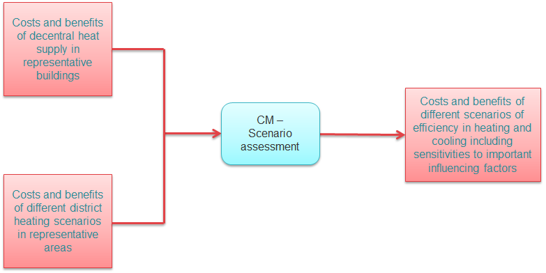

<h1>Guidelines for using the Hotmaps toolbox for analyses at national level</h1>

# Table of Contents
* [Introduction](#introduction)
* [Part I: Overview of heating and cooling](#part-i-overview-of-heating-and-cooling)
* [Part III: Analysis of the economic potential for efficiency in heating and cooling](#part-iii-analysis-of-the-economic-potential-for-efficiency-in-heating-and-cooling)
  * [Different Steps](#part-iii-analysis-of-the-economic-potential-for-efficiency-in-heating-and-cooling_different-steps)
    * [Step 1: Identification of different representative cases for district heating](https://wiki.hotmaps.hevs.ch/en/Step-1-Identification-of-different-representative-cases-for-district-heating)
    * [Step 2: Costs and potentials for district heating in representative regions or cities](#part-iii-analysis-of-the-economic-potential-for-efficiency-in-heating-and-cooling_different-steps_step-2-costs-and-potentials-for-district-heating-in-representative-regions-or-cities)
        * [Economic assessment of the potential for district heating](#part-iii-analysis-of-the-economic-potential-for-efficiency-in-heating-and-cooling_step-2-costs-and-potentials-for-district-heating-in-representative-regions-or-cities_economic-assessment-of-the-potential-for-district-heating)
        * [Estimation of costs for the transport of excess heat to district heating areas](#part-iii-analysis-of-the-economic-potential-for-efficiency-in-heating-and-cooling_step-2-costs-and-potentials-for-district-heating-in-representative-regions-or-cities_estimation-of-costs-for-the-transport-of-excess-heat-to-district-heating-areas)
        * [Development of future heat load profiles](#part-iii-analysis-of-the-economic-potential-for-efficiency-in-heating-and-cooling_step-2-costs-and-potentials-for-district-heating-in-representative-regions-or-cities_development-of-future-heat-load-profiles)
        * [Calculation of costs and emissions of heat supply in district heating](#part-iii-analysis-of-the-economic-potential-for-efficiency-in-heating-and-cooling_step-2-costs-and-potentials-for-district-heating-in-representative-regions-or-cities_calculation-of-costs-and-emissions-of-heat-supply-in-district-heating)
    * [Step 3: Calculation of decentral heat supply](#part-iii-analysis-of-the-economic-potential-for-efficiency-in-heating-and-cooling_step-3-calculation-of-decentral-heat-supply)
    * [Step 4: Comparison of results for different scenarios](#part-iii-analysis-of-the-economic-potential-for-efficiency-in-heating-and-cooling_step-4-comparison-of-results-for-different-scenarios)
* [References](#references)
* [How to cite](#how-to-cite)
* [Authors and reviewers](#authors-and-reviewers)
* [License](#license)
* [Acknowledgement](#acknowledgement)

# Introduction

These guidelines describe how the Hotmaps toolbox can be used to analyse costs and potentials for efficient and renewable heating and cooling at national level. _**The guide is especially oriented towards the development of results according to the comprehensive assessment of national heating and cooling potentials referred to in Article 14(1) of the Energy Efficiency Directive (EED) in its current version.**_

<code><ins>**[To Top](#table-of-contents)**</ins></code>

# Part I: Overview of heating and cooling

The Hotmaps database and toolbox provides two different inputs to this part: first, the Hotmaps database provides default data for several of the data needed to include in this part I of the comprehensive assessment. Second, the Hotmaps toolbox is basically a mapping tool that allows a geographical representation of default data in the toolbox but also of other data uploaded to the toolbox. In the following we describe the different default data form Hotmaps that might be of use and we link to the descriptions of how to use the upload function of the Hotmaps toolbox.

The following data relevant for Part I of Annex VIII is available in the Hotmaps database:

* Point 2: current heating and cooling supply
  * (b) (v) industrial installations:
    * [DB - Industrial sites excess heat](https://gitlab.com/hotmaps/industrial_sites/industrial_sites_industryBenchmarks)
    * [DB – Industrial sites company names](https://gitlab.com/hotmaps/industrial_sites/industrial_sites_Industrial_Database) 
    * [DB – Industrial sites subsector](https://gitlab.com/hotmaps/industrial_sites/industrial_sites_industryBenchmarks)
  * All other:
    * No default data is contained for supply points, but own data can uploaded and displayed
    * [How to create an account](#introduction-to-user-interface)
    * [How to upload own data to the toolbox](#data-upload-functionalities)
* Point 3: a map covering the entire national territory
  * (a) Heating and cooling demand areas (not for industrial demand)
    * [DB – Heat density residential](https://gitlab.com/hotmaps/heat/heat_res_curr_density)
    * [DB – Heat density non-residential](https://gitlab.com/hotmaps/heat/heat_nonres_curr_density)
    * [DB – Heat density total](https://gitlab.com/hotmaps/heat/heat_tot_curr_density)
  * (b) + (c) Existing and planned supply points
    * No default data is contained for supply points, but own data can be uploaded and displayed
    * [How to create an account](#introduction-to-user-interface)
    * [How to upload own data to the toolbox](#data-upload-functionalities)
* Point 4: forecast of trends in the demand for heating and cooling
  * Default scenarios for all EU28 MS are available from the H2020 project [CHEETAH](http://www.cheetah-project.eu/)
  * This data is also integrated into the [CM – Demand projection](https://wiki.hotmaps.hevs.ch/en/CM-Demand-projection) and used for the calculations in this module

<code><ins>**[To Top](#table-of-contents)**</ins></code>

# Part III: Analysis of the economic potential for efficiency in heating and cooling

The Hotmaps toolbox contains a number of calculation modules (CMs) that can be used to analyse the economic potential for efficiency in heating and cooling. In the following, a possible approach for generating results for the comprehensive assessment with the Hotmaps toolbox is described also linking to the respective default data and calculation modules.

## Overview of the Hotmaps approach
To assess the economic potential for efficiency in heating and cooling it is important to distinguish between areas potentially supplied by district heating and areas where decentral supply will most probably be more economically efficient. Thus, **the Hotmaps approach strongly builds on the following four steps**:

1. Identify different representative, typical cases for district heating in the country/region under investigation

2. Carry out analyses of district heating grid construction/expansion and district heat supply for the identified representative cases

3. Calculate indicators of decentral heat supply

4. Compare different scenarios of district heating and decentral heat supply and sensitivity calculations

The following figure shows this approach graphically. The different steps will be explained in more detail in the following chapters of these guidelines.

*Figure: Hotmaps approach for analysing the economic potential for efficiency in heating and cooling in course of Article 14 of the Energy Efficiency Directive (EED)*

In all of these steps **various scenarios and sensitivities should be taken into account**:
* Different levels of heat savings (implemented in step 1, 2 and 3)
* Different levels of district heating shares in total heat supply (implemented in step 2)
* Different future energy prices (implemented in step 2 and 3)
* Different depreciation times and discount rates (socio-economic vs. private-economic calculations) (implemented in step 2 and 3)

The following resulting **indicators can be retrieved from the Hotmaps Calculation Modules** (CMs):

* Economic potential: 
  * Levelised costs of Heat (LCOH) [EUR/MWh]:
    * [CM - District heating supply dispatch](https://wiki.hotmaps.hevs.ch/en/CM-District-heating-supply-dispatch) for costs of heat supply to district heating
    * [CM - Decentral heating supply](https://wiki.hotmaps.hevs.ch/en/CM-Decentral-heating-supply) for costs of decentral heat supply 
    * [CM - Excess heat transport potential](https://wiki.hotmaps.hevs.ch/en/CM-Excess-heat-transport-potential) for costs of transporting excess heat to potential district heating networks
  * Specific district heating grid costs (expansion and/or new construction) [EUR/MWh]:
    * [CM - District heating potential: economic assessment](https://wiki.hotmaps.hevs.ch/en/CM-District-heating-potential-economic-assessment)
* GHG emissions:
  * CO2 emissions [kt]:
    * [CM - District heating supply dispatch](https://wiki.hotmaps.hevs.ch/en/CM-District-heating-supply-dispatch) for CO2 emissions from heat supply to district heating
    * [CM - Decentral heating supply](https://wiki.hotmaps.hevs.ch/en/CM-Decentral-heating-supply) for CO2 emissions from decentral heat supply
* Impact on the share of RES can be calculated based on the results of the following CMs:
  * [CM - District heating supply dispatch](https://wiki.hotmaps.hevs.ch/en/CM-District-heating-supply-dispatch) for share of RES from heat supply to district heating
  * [CM - Decentral heating supply](https://wiki.hotmaps.hevs.ch/en/CM-Decentral-heating-supply) for share of RES from decentral heat supply

<code><ins>**[To Top](#table-of-contents)**</ins></code>

## Different Steps

* [Step 1: Identification of different representative cases for district heating](https://wiki.hotmaps.hevs.ch/en/Step-1-Identification-of-different-representative-cases-for-district-heating)
   * [Calculation of future heat demand and building floor area density maps](#step-1-identification-of-different-representative-cases-for-district-heating_calculation-of-future-heat-demand-and-building-floor-area-density-maps)
   * [Identification of areas potentially interesting for district heating](#step-1-identification-of-different-representative-cases-for-district-heating_identification-of-areas-potentially-interesting-for-district-heating)
   * [Analysis of potentials for excess heat and renewable energy in the identified areas with potential interest for district heating](#step-1-identification-of-different-representative-cases-for-district-heating_analysis of potentials for excess heat and renewable energy in the identified areas with potential interest for district heating)
   * [Identification of representative, typical district heating areas for further analysis](#step-1-identification-of-different-representative-cases-for-district-heating_identification-of-representative-typical-district-heating-areas-for-further-analysis)

<code><ins>**[To Top](#table-of-contents)**</ins></code>

## Step 2: Costs and potentials for district heating in representative regions or cities

For the identified representative cities/areas analyses on the costs and potentials for the heat supply with district heating can be performed. For these analyses, Hotmaps provides various default data layers in the Hotmaps database as well as different Calculation Modules (CMs). Also, own data can be uploaded and used. These analyses can consist of the following steps:
* Assess the economic potential for district heating networks
* Estimate the costs for the transport of excess heat to district heating areas
* Develop future heat load profiles
* Calculate costs and emissions of heat supply in district heating

The following figure shows this procedure graphically and shows the various data sources and calculation modules that can be used.

*Figure: Analysis of costs and potentials for district heating in representative cities/regions (Step 2)*

In the following subchapters, the different steps in this procedure are described in more detail.

<code><ins>**[To Top](#table-of-contents)**</ins></code>

### Economic assessment of the potential for district heating

For the representative cities/areas, an economic assessment of district heating can be performed to gain more detailed insights on the costs and economic feasibility of district heating and the amount of heat potentially supplied by district heating in the areas. For this purpose the CM - District heating potential: economic assessment can be used. This module generates a map of potential district heating areas based on an assessment of the heat distribution costs. An analysis of the feasibility of district heating in the analysed areas can be assessed in the following way:

* Adapt network construction costs according to experiences in your region/country of interest
* Calculate the average heat distribution costs and district heating demands for different input parameters
* Vary e.g. the following important influencing factors:
    * Heat savings over the analysis period
    * Market shares of district heating
    * The threshold for acceptable heat distribution costs
    * Network construction costs
    * Depreciation time and interest rate

The scenarios can be used to analyse the influence of the different factors on the heat distribution costs in district heating systems in the different representative cities/areas. For different settings of depreciation time and interest rate, one scenario of district heating expansion per representative city/area should be selected for further analysis.

The outcomes of this step are the heat demand for district heating [GWh/yr] and the heat distribution costs [EUR/MWh] in each of the representative cities/areas. These results will then be used in the overall scenario comparison in step 4.

<code><ins>**[To Top](#table-of-contents)**</ins></code>

### Estimation of costs for the transport of excess heat to district heating areas

In order to estimate the costs of transporting excess heat from potential sources outside of district heating areas to potential district heating areas, the CM - Excess heat transport potential can be used. The module yields levelised costs of excess heat transported to the district heating grid [EUR/MWh]. This can further be used in the next step of calculating heat supply costs in district heating.

<code><ins>**[To Top](#table-of-contents)**</ins></code>

### Development of future heat load profiles

Renovation of buildings leads to reductions in energy demand for space heating. This also affects the load profiles of heat demand in the district heating systems: the peak demands in winter decrease and the full load hours increase due to higher shares of hot water generation on the overall heat demand. With the CM - Heat load profiles future heat load profiles can be developed according to different heat-saving levels. This can be done based on load profiles provided in the Hotmaps database (default profiles for all NUTS2 regions in Europe) or based on your own profiles uploaded into the toolbox. The resulting load profiles are then used in the next step, the calculation of costs and emission of heat supply in district heating with the dispatch module.

<code><ins>**[To Top](#table-of-contents)**</ins></code>

### Calculation of costs and emissions of heat supply in district heating

The costs and emissions of heat supply in district heating system depend on the interaction of the different installed supply capacities. Hereby the least-cost combination of capacities and their operation over time is of interest. In order to analyse the so-called hourly dispatch of different supply technology combinations and the effect on the overall costs and emissions of heat supply in district heating the CM - District heating supply dispatch can be used. With the module several scenarios with the following input data combinations can be calculated in order to derive costs and benefits:

* Combinations of different technologies in supply portfolios:
    * Excess heat from industry (with or without heat pump)
    * Waste incineration
    * High-efficiency cogeneration
    * Solar thermal
    * Geothermal
    * Biomass
    * Heat pumps with different heat sources as e.g.
        * wastewater treatment plants
        * river water
        * excess heat from data centers
* Prices scenarios:
    * for prices of different energy carriers 
    * for prices CO2 emissions

The calculations can be used to identify beneficial supply portfolios in the different representative cities/areas and their sensitivity to important influencing parameters like energy carrier and CO2 prices or interest rate and depreciation time.

The outcomes of this step are the heat supply costs to the district heating system [EUR/MWh] in each of the representative cities/areas and the related CO2 emissions [kt/yr]. These results will then be used in the overall scenario comparison in step 4.

<code><ins>**[To Top](#table-of-contents)**</ins></code>

## Step 3: Calculation of decentral heat supply

In the third step, the costs and emissions of heat supply via decentral technologies are calculated. This calculation should be performed for different representative buildings in the country/region of interest. While for district heating representative cities/areas have been developed in step 1 of the approach, typical buildings in each EU Member State data can be found in the Hotmaps default database. Also, for many EU countries detailed building typologies (building archetypes) with data on heat demand before and after renovation can be found in statistics and literature.

The CM - Decentral heating supply can be used to calculate the costs and emissions of heat supply via different decentral technologies. The module uses data on heat demand as well as data on costs of technologies and prices for energy carriers to calculate the levelised costs of heat supply [EUR/MWh] for the different technologies in the different typical buildings and renovation states. The following figure shows this procedure graphically and shows the various data sources feeding into the CM - Decentral heating supply.

*Figure: Calculation of decentral heat supply (Step 3)*

The calculations can be used to identify costs and benefits of various supply technologies in different representative buildings and their sensitivity to important influencing parameters like energy carrier and CO2 prices or interest rate and depreciation time.

The outcomes of this step are the costs of heat supply via decentral technologies [EUR/MWh] in each of the representative buildings and the related CO2 emissions [kt/yr]. These results will then be used in the overall scenario comparison in step 4.

<code><ins>**[To Top](#table-of-contents)**</ins></code>

## Step 4: Comparison of results for different scenarios

The final step in the analysis is the comparison of the results for the different scenarios and sensitivities. For this, all results calculated in the previous steps are collected both from the calculations of district heating as well as from the calculations of decentral supply and compared against each other for main indicators. This can be done in the CM - Scenario Assessment.  The following figure shows this approach.

*Figure: Comparison of results for different scenarios (Step 4)*

<code><ins>**[To Top](#table-of-contents)**</ins></code>

# References

<code><ins>**[To Top](#table-of-contents)**</ins></code>

# How to cite
Marcus Hummel, in Hotmaps-Wiki, Guidelines for using the Hotmaps toolbox for analyses at national level (October 2020)

<code><ins>**[To Top](#table-of-contents)**</ins></code>

# Authors and reviewers
This page is written by Marcus Hummel\*.
- [x] This page was reviewed by Lukas Kranzl\**.

\* [e-think](https://e-think.ac.at/),
Zentrum f. Energiewirtschaft und Umwelt,
Argentinierstrasse 18/10,
1040 Wien

\** [Energy Economics Group - TU Wien](https://eeg.tuwien.ac.at/),
Institute of Energy Systems and Electrical Drives,
Gusshausstrasse 27-29/370,
1040 Wien

<code><ins>**[To Top](#table-of-contents)**</ins></code>

# License
Copyright © 2016-2019: Marcus Hummel

Creative Commons Attribution 4.0 International License
This work is licensed under a Creative Commons CC BY 4.0 International License.

SPDX-License-Identifier: CC-BY-4.0

License-Text: https://spdx.org/licenses/CC-BY-4.0.html

<code><ins>**[To Top](#table-of-contents)**</ins></code>

# Acknowledgement
We would like to convey our deepest appreciation to the Horizon 2020 [Hotmaps Project](https://www.hotmaps-project.eu) (Grant Agreement number 723677), which provided the funding to carry out the present investigation.

<code><ins>**[To Top](#table-of-contents)**</ins></code>

<!--- THIS IS A SUPER UNIQUE IDENTIFIER -->

View in another language:

 [German](../de/GL-local)\* 

\* machine translated