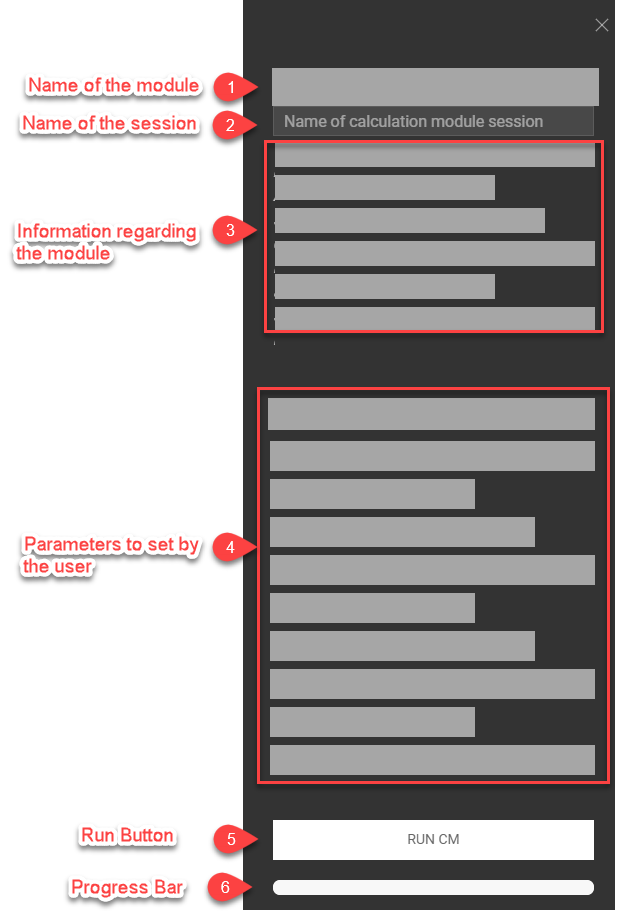

<h1><a class="anchor" id="access-to-calculation-modules" href="#access-to-calculation-modules"><i class="fa fa-link"></i></a>Acceso a módulos de cálculo</h1><h2><a class="anchor" id="table-of-contents" href="#table-of-contents"><i class="fa fa-link"></i></a> Tabla de contenido</h2><ul><li> <a href="#introduction">Introducción</a></li><li> <a href="#structure-of-a-calculation-module">Estructura de un módulo de cálculo</a></li><li> <a href="#list-of-calculation-modules">Lista de módulos de cálculo</a></li><li> <a href="#how-to-cite">Cómo citar</a></li><li> <a href="#authors-and-reviewers">Autores y revisores</a></li><li> <a href="#license">Licencia</a></li><li> <a href="#acknowledgement">Reconocimiento</a></li></ul><h2><a class="anchor" id="introduction" href="#introduction"><i class="fa fa-link"></i></a> Introducción</h2>
 En el siguiente capítulo, describiremos cómo acceder a un módulo de cálculo.

 <strong>Pasos para acceder a un módulo de cálculo</strong>

 <strong>Pasos:</strong>
<ol><li> Definir una escala territorial</li><li> Seleccione una región</li><li> Habilitar la sección de capa</li><li> Vaya a la pestaña <code>Calculation Modules</code></li><li> Accede a tu módulo deseado</li><li> Definir los parámetros, dar un nombre a la ejecución y ejecutar el módulo</li><li> los resultados se muestran en la barra de resultados y en el mapa</li></ol>

<h2><a class="anchor" id="structure-of-a-calculation-module" href="#structure-of-a-calculation-module"><i class="fa fa-link"></i></a> Estructura de un módulo de cálculo</h2>
 La siguiente imagen muestra la estructura de un módulo de cálculo.

<h2><a class="anchor" id="list-of-calculation-modules" href="#list-of-calculation-modules"><i class="fa fa-link"></i></a> Lista de módulos de cálculo</h2>
 A continuación, verá los módulos disponibles actualmente. En la parte inferior, se enumeran los módulos de cálculo independientes. Cada uno tiene un enlace a su página wiki dedicada o wiki separada y a su repositorio, ya que no son una parte integral de Hotmaps Toolbox.
<h2><a class="anchor" id="how-to-cite" href="#how-to-cite"><i class="fa fa-link"></i></a> Cómo citar</h2>
 Jeton Hasani, en Hotmaps-Wiki, Acceso a módulos de cálculo (abril de 2019)
<h2><a class="anchor" id="authors-and-reviewers" href="#authors-and-reviewers"><i class="fa fa-link"></i></a> Autores y revisores</h2>
 Esta página fue escrita por Jeton Hasani <strong><a href="https://eeg.tuwien.ac.at/">EEG - TU Wien</a></strong> .

 ☑ Esta página fue revisada por Mostafa Fallahnejad.

 <a href="#table-of-contents"><strong><code>To Top</code></strong></a>
<h2><a class="anchor" id="license" href="#license"><i class="fa fa-link"></i></a> Licencia</h2>
 Copyright © 2016-2020: Jeton Hasani

 Licencia internacional Creative Commons Attribution 4.0

 Esta obra está autorizada bajo una licencia internacional Creative Commons CC BY 4.0.

 Identificador de licencia SPDX: CC-BY-4.0

 Texto de licencia: https://spdx.org/licenses/CC-BY-4.0.html

 <a href="#table-of-contents"><strong><code>To Top</code></strong></a>
<h2><a class="anchor" id="acknowledgement" href="#acknowledgement"><i class="fa fa-link"></i></a> Reconocimiento</h2>
 Nos gustaría transmitir nuestro más profundo agradecimiento al <a href="https://www.hotmaps-project.eu">Proyecto Hotmaps</a> Horizon 2020 (Acuerdo de subvención número 723677), que proporcionó los fondos para llevar a cabo la presente investigación.

 <a href="#table-of-contents"><strong><code>To Top</code></strong></a>

<!--- THIS IS A SUPER UNIQUE IDENTIFIER -->

This page was automatically translated. View in another language:

[English](../en/Access-to-calculation-modules) (original) [Bulgarian](../bg/Access-to-calculation-modules)\* [Czech](../cs/Access-to-calculation-modules)\* [Danish](../da/Access-to-calculation-modules)\* [German](../de/Access-to-calculation-modules)\* [Greek](../el/Access-to-calculation-modules)\*  [Estonian](../et/Access-to-calculation-modules)\* [Finnish](../fi/Access-to-calculation-modules)\* [French](../fr/Access-to-calculation-modules)\* [Irish](../ga/Access-to-calculation-modules)\* [Croatian](../hr/Access-to-calculation-modules)\* [Hungarian](../hu/Access-to-calculation-modules)\* [Italian](../it/Access-to-calculation-modules)\* [Lithuanian](../lt/Access-to-calculation-modules)\* [Latvian](../lv/Access-to-calculation-modules)\* [Maltese](../mt/Access-to-calculation-modules)\* [Dutch](../nl/Access-to-calculation-modules)\* [Polish](../pl/Access-to-calculation-modules)\* [Portuguese (Portugal, Brazil)](../pt/Access-to-calculation-modules)\* [Romanian](../ro/Access-to-calculation-modules)\* [Slovak](../sk/Access-to-calculation-modules)\* [Slovenian](../sl/Access-to-calculation-modules)\* [Swedish](../sv/Access-to-calculation-modules)\* 

\* machine translated
