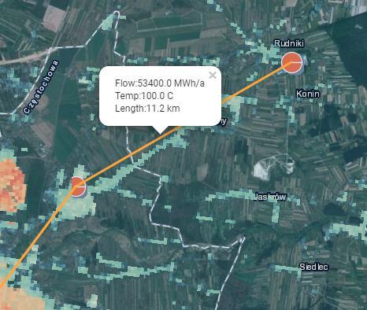
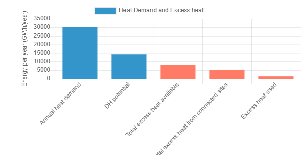

<h1><a class="anchor" id="cm-excess-heat-transport-potential" href="#cm-excess-heat-transport-potential"><i class="fa fa-link"></i></a>CM Exceso de potencial de transporte de calor</h1><h2><a class="anchor" id="table-of-contents" href="#table-of-contents"><i class="fa fa-link"></i></a> Tabla de contenido</h2><ul><li> <a href="#in-a-glance">De un vistazo</a></li><li> <a href="#introduction">Introducción</a></li><li> <a href="#inputs-and-outputs">Entradas y salidas</a><ul><li> <a href="#inputs-and-outputs_input-layers-and-parameters">Capas de entrada y parámetros</a></li><li> <a href="#inputs-and-outputs_output">Salida</a></li></ul></li><li> <a href="#method">Método</a><ul><li> <a href="#method_overview">Visión de conjunto</a></li><li> <a href="#method_details">Detalles</a></li><li> <a href="#method_implementation">Implementación</a></li></ul></li><li> <a href="#github-repository-of-this-calculation-module">Repositorio de GitHub de este módulo de cálculo</a></li><li> <a href="#quick-start">Inicio rápido</a></li><li> <a href="#troubleshooting">Solución de problemas</a></li><li> <a href="#sample-run">Ejecución de muestra</a></li><li> <a href="#how-to-cite">Cómo citar</a></li><li> <a href="#authors-and-reviewers">Autores y revisores</a></li><li> <a href="#license">Licencia</a></li><li> <a href="#acknowledgement">Reconocimiento</a></li></ul><h2><a class="anchor" id="in-a-glance" href="#in-a-glance"><i class="fa fa-link"></i></a> De un vistazo</h2>
 Este módulo calcula el flujo y los costos de transmisión de calor de posibles fuentes de exceso de calor ubicadas fuera de las áreas potenciales de calefacción urbana al área de calefacción urbana. Las entradas son perfiles de carga por hora del exceso de flujo de calor y la demanda de calefacción urbana, la ubicación de la fuente de calor excedente y el sistema potencial de calefacción urbana, los costos de inversión en intercambiadores de calor y líneas de transmisión y los valores de umbral para los costos de distancia y transmisión.

 <a href="#table-of-contents"><strong><code>To Top</code></strong></a>
<h2><a class="anchor" id="introduction" href="#introduction"><i class="fa fa-link"></i></a> Introducción</h2>
 El módulo de cálculo &quot;Exceso de potencial de transporte de calor&quot; ayudará al usuario a identificar los potenciales de integración para el exceso de calor en las redes de calefacción urbana. Los potenciales se basan en el <a href="https://wiki.hotmaps.hevs.ch/en/CM-District-heating-potential-areas-user-defined-thresholds">CM - Potencial de calefacción urbana</a> . Este MC identifica áreas con condiciones favorables para las redes de calefacción de distrito y muestra cuánto calor podría potencialmente ser cubierto por el exceso de calor industrial en estas áreas. Sin embargo, esto no significa que ya exista una red de calefacción urbana en esta región.

 Los siguientes datos y métodos se combinan para la tarea anterior.

 Datos:
<ul><li>
 Requerimientos de calefacción para áreas cercanas con condiciones favorables para redes de calefacción urbana, que se disuelven cada hora (del <a href="https://wiki.hotmaps.hevs.ch/en/CM-District-heating-potential-areas-user-defined-thresholds">CM - Potencial de calefacción urbana</a> ).
</li><li>
 Datos sobre las cantidades de exceso de calor de las empresas industriales de la zona, que también se resuelven cada hora (de la base de datos industrial del conjunto de datos).
</li><li>
 Supuestos sobre costos de intercambiadores de calor, bombas y tuberías, así como pérdidas de calor para tuberías de calefacción urbana.
</li></ul>
 Método (simplificado):
<ul><li> Diseño de ductos sobre la base de una heurística desarrollada, que representa el problema del diseño como un problema de flujo de red.</li></ul>
 El objetivo del método es representar el mayor exceso de flujo de calor posible con tuberías no demasiadas y, por lo tanto, demasiado largas para los posibles usuarios de calefacción urbana mediante la generación de redes con flujos máximos. Sin embargo, las líneas de transporte particularmente ineficientes (con bajos flujos de calor y, por lo tanto, altos costos específicos de transporte de calor) no se consideran en la red final. El usuario puede especificar el umbral de eficiencia económica de las líneas de transporte individuales (véase el umbral de la línea de transmisión).

 El trasfondo básico del enfoque es el siguiente: si solo hay unas pocas fuentes de exceso de calor, siempre se podría tener en cuenta una sola tubería por fuente para transportar el calor a un área cercana con condiciones favorables para la calefacción urbana. Sin embargo, si hay varias fuentes de exceso de calor que van a fluir hacia la misma área, tendría sentido recolectar el calor y transportarlo al área en una tubería común más grande. El enfoque con una tubería por fuente tiende a sobrestimar el esfuerzo de las tuberías.

 Para contrarrestar lo anterior, el problema de la planificación de la tubería se aproximó asumiendo un problema de flujo de red. Se utiliza un método heurístico para resolver el problema, en el que el exceso de calor se puede agrupar y transportar a los posibles usuarios. El diseño metódico concreto de la solución con el enfoque del árbol de luz mínima se describe en la parte metódica correspondiente. El diseño de la tubería determinado en el contexto anterior no representa, por lo tanto, una planificación detallada o una guía de ruta real, sino que solo se utiliza para la aproximación de costos para la distribución de las cantidades de calor en exceso en las áreas cercanas con condiciones favorables para las redes de calefacción urbana. (ver <a href="https://wiki.hotmaps.hevs.ch/en/CM-District-heating-potential-areas-user-defined-thresholds">CM - Potencial de calefacción de distrito</a> , áreas coherentes de palabras clave). Esta aproximación de costes se refiere, por tanto, a toda la red.

 Entonces, los resultados deben interpretarse primero de la siguiente manera: si las cantidades de exceso de calor registradas fueran transportadas juntas a las áreas cercanas indicadas, entonces los costos de distribución de calor podrían ser del orden de magnitud indicado por la herramienta (cf. Costo nivelado de suministro de calor). Como regla general, los valores para toda la red también son un buen indicador de inicio para tuberías individuales. El propósito de los resultados es, por lo tanto, proporcionar al desarrollador o planificador de un proyecto un orden de magnitud para los posibles costos de distribución.

 <a href="#table-of-contents"><strong><code>To Top</code></strong></a>
<h2><a class="anchor" id="inputs-and-outputs" href="#inputs-and-outputs"><i class="fa fa-link"></i></a> Entradas y salidas</h2><h3><a class="anchor" id="input-layers-and-parameters" href="#input-layers-and-parameters"><i class="fa fa-link"></i></a> Capas de entrada y parámetros</h3><h4><a class="anchor" id="provided-by-toolbox" href="#provided-by-toolbox"><i class="fa fa-link"></i></a> Proporcionado por Toolbox</h4><ul><li>
 Áreas de calefacción urbana (por ahora proporcionadas directamente por el potencial de calefacción urbana CM)
</li><li>
 Base de datos industrial (proporcionada por defecto por la caja de herramientas)
</li><li>
 Perfiles de carga para la industria
</li><li>
 Perfiles de carga para calefacción residencial y agua caliente sanitaria
</li></ul><h4><a class="anchor" id="provided-by-the-user" href="#provided-by-the-user"><i class="fa fa-link"></i></a> Proporcionado por el usuario</h4><ul><li>
 Min. demanda de calor por hectárea

 Consulte <a href="https://wiki.hotmaps.hevs.ch/en/CM-District-heating-potential-areas-user-defined-thresholds">CM - Potencial de calefacción urbana</a> .
</li><li>
 Min. demanda de calor en un área de DH

 Consulte <a href="https://wiki.hotmaps.hevs.ch/en/CM-District-heating-potential-areas-user-defined-thresholds">CM - Potencial de calefacción urbana</a> .
</li><li>
 Vida útil del equipo en años

 Los costos nivelados de calor se refieren a este período de tiempo.
</li><li>
 Tasa de descuento en%

 Tasa de interés del crédito necesario para construir la red.
</li><li>
 Factor de costo

 Factor para adaptar los costos de la red en caso de que los valores predeterminados no representen con precisión los costos. Las inversiones necesarias para la red se multiplican con este factor. Los costos por defecto se pueden encontrar en la sección <a href="en-CM-Excess-heat-transport-potential#computation-of-costs">Cálculo de costos</a> .
</li><li>
 Costos operativos en%

 Costos operativos de la red por año. En porcentaje de las inversiones necesarias para la red.
</li><li>
 Valor umbral para líneas de transmisión en ct / kWh

 El costo máximo nivelado de calor de cada línea de transmisión individual. Este parámetro se puede utilizar para controlar el costo nivelado del calor para toda la red. Un valor más bajo equivale a un menor costo nivelado de calor, pero también a una reducción en el exceso de calor utilizado y viceversa.
</li></ul><h4><a class="anchor" id="performance-parameters" href="#performance-parameters"><i class="fa fa-link"></i></a> Parámetros de rendimiento</h4><ul><li>
 Resolución de tiempo

 Establece el intervalo entre los cálculos de flujo de la red durante todo el año. Puede ser uno de estos valores: (hora, día, semana, mes, año)
</li></ul>
 <a href="#table-of-contents"><strong><code>To Top</code></strong></a>
<h3><a class="anchor" id="output" href="#output"><i class="fa fa-link"></i></a> Salida</h3><h4><a class="anchor" id="layers" href="#layers"><i class="fa fa-link"></i></a> Capas</h4><ul><li>
 Lineas de transmisión

 Shapefile que muestra las líneas de transmisión sugeridas con su temperatura, flujo de calor anual y costo. Detalles pueden ser encontrados aqui.
</li></ul><h4><a class="anchor" id="indicators" href="#indicators"><i class="fa fa-link"></i></a> Indicadores</h4><ul><li>
 Exceso de calor total en la zona seleccionada en GWh

 Exceso total de calor disponible de plantas industriales en zona seleccionada y proximidad.
</li><li>
 Exceso de calor conectado en GWh

 Exceso total de calor disponible de plantas industriales conectadas a red.
</li><li>
 Exceso de calor utilizado en GWh

 Exceso de calor real utilizado para DH.
</li><li>
 Inversiones necesarias para la red en €

 Inversión necesaria para construir la red.
</li><li>
 Costes anuales de la red en € / año

 Los costos causados por la anualidad y los costos operativos de la red por año.
</li><li>
 Costos nivelados de suministro de calor en ct / kWh

 Costo nivelado de calor de la red completa.
</li></ul><h4><a class="anchor" id="graphics" href="#graphics"><i class="fa fa-link"></i></a> Gráficos</h4><ul><li>
 Potencial DH y exceso de calor

 Gráfico que muestra el potencial de DH, el exceso de calor total, el exceso de calor conectado y el exceso de calor utilizado. Los detalles se pueden encontrar <a href="en-CM-Excess-heat-transport-potential#dh-potential-and-excess-heat">aquí</a> .
</li><li>
 Exceso de calor utilizado e inversión necesaria

 Gráfico que muestra el exceso de calor entregado anual a la inversión necesaria para la red. Los detalles se pueden encontrar <a href="en-CM-Excess-heat-transport-potential#excess-heat-used-and-investment-necessary">aquí</a> .
</li><li>
 Curvas de carga

 Gráfico que muestra la demanda y el exceso de calor mensuales. Los detalles se pueden encontrar <a href="en-CM-Excess-heat-transport-potential#load-curves">aquí</a> .
</li><li>
 Curvas de carga

 Gráfico que muestra la demanda y el exceso de calor diarios promedio. Los detalles se pueden encontrar <a href="en-CM-Excess-heat-transport-potential#load-curves">aquí</a> .
</li></ul><h4><a class="anchor" id="examples-of-layer" href="#examples-of-layer"><i class="fa fa-link"></i></a> Ejemplos de capa</h4><h5><a class="anchor" id="transmission-lines" href="#transmission-lines"><i class="fa fa-link"></i></a> Lineas de transmisión</h5><figcaption> <i> Ejemplo de una línea de transmisión mostrada en la caja de herramientas</i></figcaption>
 Al hacer clic en la línea de transmisión, aparecerá información adicional.
<h4><a class="anchor" id="examples-of-graphics" href="#examples-of-graphics"><i class="fa fa-link"></i></a> Ejemplos de gráficos</h4><h5><a class="anchor" id="dh-potential-and-excess-heat" href="#dh-potential-and-excess-heat"><i class="fa fa-link"></i></a> Potencial DH y exceso de calor</h5>
 <em>Este gráfico compara el potencial de DH, el exceso de calor total, el exceso de calor conectado y el exceso de calor utilizado.</em>

 Puede encontrar más información sobre la demanda anual de calor y el potencial de DH <a href="CM-District-heating-potential-areas-user-defined-thresholds">aquí</a> . El exceso de calor conectado al exceso de calor y el exceso de calor utilizado son los mismos que sus indicadores con el mismo nombre, en la sección de <a href="en-CM-Excess-heat-transport-potential#inputs-and-outputs_input-layers-and-parameters">Entrada y Salida</a> .
<h5><a class="anchor" id="load-curves" href="#load-curves"><i class="fa fa-link"></i></a> Curvas de carga</h5><figure><figcaption><i> </i>
 <i>Este gráfico muestra el caudal total a través de la red a lo largo del año. El gráfico inferior representa el día promedio.</i>
</figcaption></figure>
 El eje x representa el tiempo y la potencia del eje y. Las curvas azules representan la demanda de calor de las áreas DH y las rojas el exceso de calor disponible. La intersección de ambas curvas representa el flujo total real de calor. El gráfico superior muestra el caudal durante el año y el inferior el caudal del día medio. Tenga en cuenta que la <a href="en-CM-Excess-heat-transport-potential#performance-parameters">resolución de tiempo</a> debe establecerse al menos en &quot;mes&quot; para el gráfico superior y &quot;hora&quot; para que el gráfico inferior sea representativo.

 <a href="#table-of-contents"><strong><code>To Top</code></strong></a>
<h2><a class="anchor" id="method" href="#method"><i class="fa fa-link"></i></a> Método</h2><h3><a class="anchor" id="overview" href="#overview"><i class="fa fa-link"></i></a> Visión de conjunto</h3>
 El elemento clave del módulo de exceso de calor es el modelo de fuente-disipador utilizado. Construye una red de transmisión de longitud mínima y calcula el caudal para cada hora del año basándose en perfiles de carga de calefacción residencial con resolución NUTS 2 y perfiles de carga industrial con resolución NUTS 0. Con base en los caudales máximos promediados a lo largo del año, se pueden calcular los costos de cada línea de transmisión e intercambiador de calor en el lado de la fuente y el sumidero.

 <a href="#table-of-contents"><strong><code>To Top</code></strong></a>
<h3><a class="anchor" id="details" href="#details"><i class="fa fa-link"></i></a> Detalles</h3><h4><a class="anchor" id="modeling-of-sources" href="#modeling-of-sources"><i class="fa fa-link"></i></a> Modelado de fuentes</h4>
 Según el NUTS 0 ID y el sector industrial, se asigna a cada fuente un perfil de carga resuelto por horas durante un año.
<h4><a class="anchor" id="modeling-of-sinks" href="#modeling-of-sinks"><i class="fa fa-link"></i></a> Modelado de lavabos</h4>
 Basado en el módulo de cálculo de potencial de calefacción urbana, se crean puntos de entrada equidistantes en las áreas coherentes. Dependiendo del NUTS 2 ID de los puntos de entrada, se asigna un perfil de carga.
<h4><a class="anchor" id="fixed-radius-search" href="#fixed-radius-search"><i class="fa fa-link"></i></a> Búsqueda de radio fijo</h4>
 Dentro de un radio preestablecido, se verifica qué fuentes están en el rango entre sí, qué sumideros están dentro del rango entre sí y qué sumideros están dentro del rango de las fuentes. Esto se puede representar mediante un gráfico con fuentes y sumideros que forman los vértices y los vértices en el rango están conectados por un borde.
<h4><a class="anchor" id="reduction-to-minimum-length-network" href="#reduction-to-minimum-length-network"><i class="fa fa-link"></i></a> Reducción a la longitud mínima de la red</h4>
 Un árbol de expansión mínimo se calcula con la distancia de los bordes como pesos. Esto da como resultado un gráfico que conserva su conectividad mientras tiene una longitud total mínima de bordes. Tenga en cuenta que los puntos de entrada de las áreas coherentes están conectados internamente de forma gratuita ya que forman su propia red de distribución.
<h4><a class="anchor" id="flow-computation" href="#flow-computation"><i class="fa fa-link"></i></a> Cálculo de flujo</h4>
 El caudal máximo de las fuentes a los sumideros se calcula para cada hora del año.
<h4><a class="anchor" id="cost-determination" href="#cost-determination"><i class="fa fa-link"></i></a> Determinación de costos</h4>
 El flujo máximo del año promediado durante 3 horas determina la capacidad requerida para las líneas de transmisión y los intercambiadores de calor. Los costos de las líneas de transmisión dependen de la longitud y la capacidad, mientras que los costos de los intercambiadores de calor solo están influenciados por la capacidad. En el lado de la fuente, se asume un intercambiador de calor aire a líquido con bomba integrada para la línea de transmisión y en el lado del sumidero un intercambiador de calor líquido a líquido.
<h4><a class="anchor" id="variation-of-network" href="#variation-of-network"><i class="fa fa-link"></i></a> Variación de red</h4>
 Dado que se conocen el costo y el flujo de cada línea de transmisión, se pueden eliminar las líneas con la relación costo / flujo más alta y se puede volver a calcular el flujo hasta lograr el costo por flujo deseado.

 <a href="#table-of-contents"><strong><code>To Top</code></strong></a>
<h3><a class="anchor" id="implementation" href="#implementation"><i class="fa fa-link"></i></a> Implementación</h3><h4><a class="anchor" id="fixed-radius-search" href="#fixed-radius-search"><i class="fa fa-link"></i></a> Búsqueda de radio fijo</h4>
 Para el cálculo de la distancia entre dos puntos, se utiliza una pequeña aproximación de ángulo de la longitud del loxódromo. Si bien también existe una implementación precisa de la distancia del ortodromo, el aumento de la precisión no tiene ningún beneficio real debido a las pequeñas distancias en su mayoría inferiores a 20 km y la incertidumbre de la longitud real de la línea de transmisión debido a muchos factores como la topología. Si dos puntos están en el rango del radio, se almacena en una lista de adyacencia. La creación de dichas listas de adyacencia se realiza entre fuentes y fuentes, sumideros y sumideros, y fuentes y sumideros. La razón de la separación radica en la flexibilidad para agregar ciertos requisitos de temperatura para fuentes o sumideros.
<figure><figcaption> <i> Ejemplo de búsqueda de radio fijo. Los vértices rojos representan fuentes y los azules sumideros. Los números representan la distancia entre los puntos. El dibujo no está a escala.</i></figcaption></figure><h4><a class="anchor" id="networkgraph-class" href="#networkgraph-class"><i class="fa fa-link"></i></a> Clase NetworkGraph</h4>
 Sobre la base de la biblioteca de igraph, se implementa una clase NetworkGraph con todas las funciones necesarias para el módulo de cálculo. Si bien igraph está mal documentado, ofrece un rendimiento mucho mejor que los módulos de Python puros como NetworkX y un soporte de plataforma más amplio más allá de Linux, a diferencia de la herramienta gráfica. La clase NetworkGraph describe solo una red en la superficie, pero contiene 3 gráficos diferentes. En primer lugar, el gráfico que describe la red tal y como la definen las tres listas de adyacencia. En segundo lugar, el gráfico de correspondencia que conecta internamente los sumideros de la misma área coherente y, por último, el gráfico de flujo máximo utilizado para el cálculo del flujo máximo.
<h5><a class="anchor" id="graph" href="#graph"><i class="fa fa-link"></i></a> Grafico</h5>
 Solo contiene las fuentes y sumideros reales como vértices.
<figure><figcaption> <i> Ejemplo de gráfico. Los vértices rojos representan fuentes y los azules sumideros.</i></figcaption></figure><h5><a class="anchor" id="correspondence-graph" href="#correspondence-graph"><i class="fa fa-link"></i></a> Gráfico de correspondencia</h5>
 Cada sumidero necesita una identificación de correspondencia, que indica si está conectado internamente por una red ya existente como en áreas coherentes. Los sumideros con el mismo id de correspondencia están conectados a un nuevo vértice con aristas con pesos cero. Esto es crucial para el cálculo de un árbol de expansión mínimo y la razón por la que se utiliza el gráfico de correspondencia para ello. Esta función también se implementa para las fuentes, pero no se utiliza.
<figure><figcaption><i> </i>
 <i>Ejemplo de gráfico de correspondencia. Los vértices rojos representan fuentes y los azules sumideros. Los tres sumideros de la derecha están conectados coherentemente por un vértice adicional más grande</i>
</figcaption></figure><h5><a class="anchor" id="maximum-flow-graph" href="#maximum-flow-graph"><i class="fa fa-link"></i></a> Gráfico de flujo máximo</h5>
 Dado que igraph no admite múltiples fuentes y sumideros en su función de flujo máximo, se necesita un gráfico auxiliar. Introduce un vértice de fuente y sumidero infinito. Cada fuente real está conectada a la fuente infinita y cada sumidero real está conectado al sumidero infinito por un borde. Tenga en cuenta que si un sumidero está conectado a un vértice de correspondencia, este vértice estará conectado en lugar del sumidero en sí.
<figure><figcaption><i> </i>
 <i>Ejemplo de gráfico de flujo máximo.</i>
</figcaption></figure><h5><a class="anchor" id="minimum-spanning-tree-computation" href="#minimum-spanning-tree-computation"><i class="fa fa-link"></i></a> Cálculo mínimo del árbol de expansión</h5>
 Sobre la base del gráfico de correspondencia, se calcula el árbol de expansión mínimo. Los bordes que conectan los sumideros coherentes siempre tienen el peso 0, por lo que siempre serán parte del árbol de expansión mínimo.
<figure><figcaption><i> </i>
 <i>Ejemplo de un gráfico de correspondencia con los pesos de cada borde y su árbol de expansión mínimo.</i>
</figcaption></figure><h5><a class="anchor" id="maximum-flow-computation" href="#maximum-flow-computation"><i class="fa fa-link"></i></a> Cálculo de caudal máximo</h5>
 El flujo a través de los bordes que conectan las fuentes o sumideros reales con la fuente o sumidero infinito, respectivamente, está limitado a la capacidad real de cada fuente o sumidero. Por razones numéricas, las capacidades están normalizadas de modo que la capacidad más grande es 1. El flujo a través del subconjunto de bordes contenidos en el gráfico de correspondencia está limitado a 1000, lo que debería, para todos los propósitos intensos y ofrecer flujo sin restricciones. Luego, se calcula el flujo máximo desde la fuente infinita al sumidero infinito y el flujo se vuelve a escalar a su tamaño original. Dado que los sumideros coherentes no están conectados directamente al vértice del sumidero infinito sino por el vértice de correspondencia, el flujo a través de él se limita a la suma de todos los sumideros coherentes.
<figure><figcaption><i> </i>
 <i>Ejemplo de gráfico de flujo máximo y las capacidades de cada fuente y sumidero. El gráfico de la derecha muestra el flujo máximo permitido a través de cada borde después de la normalización. Tenga en cuenta que el flujo máximo permitido a través de los bordes con el símbolo de infinito en realidad está limitado a 1000 en la implementación.</i>
</figcaption></figure>
 La implementación de la función de flujo máximo de igraph utiliza el algoritmo Push-relabel. Este tipo de algoritmo no es sensible a los costos y es posible que no siempre encuentre la forma más corta de enrutar el flujo. Un algoritmo sensible al costo no está disponible en igraph y es probable que el rendimiento sea bajo para poder resolver un flujo basado en horas durante todo el año. Pero debido a la reducción previa a un árbol de expansión mínimo, los casos en los que se elige una solución no ideal son muy limitados e improbables. El algoritmo Push-Rebelbel también tiene la tendencia de dirigir el flujo a través de la menor cantidad de bordes. La implementación de igraph parece ser determinista en el orden de asignación del flujo si los gráficos son al menos automorfismos, lo cual es importante para el cálculo de flujo basado en horas, ya que cualquier oscilación de flujo introducida artificialmente entre los bordes es indeseable.
<figure><figcaption> <i> Flujo calculado por el algoritmo de flujo máximo y el cambio de escala al tamaño original.</i></figcaption></figure><h4><a class="anchor" id="heat-sources" href="#heat-sources"><i class="fa fa-link"></i></a> Fuentes de calor</h4>
 Las fuentes de calor se toman de la <strong><a href="https://gitlab.com/hotmaps/industrial_sites/industrial_sites_Industrial_Database">base de datos industrial.</a></strong> En base a su exceso de calor, Nuts0 ID y sector industrial se crea un perfil de carga que cubre cada hora del año para cada sitio. Se planea la adición personalizada de sitios.
<h4><a class="anchor" id="heat-sinks" href="#heat-sinks"><i class="fa fa-link"></i></a> Disipadores de calor</h4>
 Los disipadores de calor se basan en áreas coherentes con demanda de calor conocida. Las áreas coherentes forman una máscara para una cuadrícula en la que se colocan puntos equidistantes como puntos de entrada. Dependiendo de la ID de NUTS 2 seleccionada, se asigna un perfil de calefacción residencial a los fregaderos. Está prevista la adición personalizada de puntos de entrada y lavabos.
<figure><figcaption> <i> Ejemplo de un área coherente y sus puntos de entrada generados.</i></figcaption></figure><h4><a class="anchor" id="load-profiles" href="#load-profiles"><i class="fa fa-link"></i></a> Perfiles de carga</h4>
 Los perfiles de carga mencionados constan de 8760 puntos que representan la carga por cada hora de los 365 días. <strong><a href="https://gitlab.com/hotmaps/load_profile">Puede encontrar</a></strong> más información sobre los <strong><a href="https://gitlab.com/hotmaps/load_profile">perfiles de carga aquí.</a></strong>
<h4><a class="anchor" id="computation-of-costs" href="#computation-of-costs"><i class="fa fa-link"></i></a> Cálculo de costos</h4>
 Dado que los sistemas de calefacción de distrito tienen una gran capacidad calorífica, un pico en el flujo no significa que las líneas de transmisión deban entregar ese corto pico de calor instantáneamente. Por lo tanto, las capacidades requeridas de las líneas de transmisión y los intercambiadores de calor están determinadas por la carga máxima promedio. Específicamente, la función de convolución numpy se usa para promediar el flujo durante las últimas tres horas convolucionando con una función constante. Dependiendo de este valor se elige una línea de transmisión de la siguiente tabla.

 <em>Costos específicos de las líneas de transmisión utilizadas</em>

 | Potencia en MW | Costes en € / m | Temperatura en ° C | | ------------- |: -------------: | -----: | | 0,2 | 195 | &lt;150 | | 0,3 | 206 | &lt;150 | | 0,6 | 220 | &lt;150 | | 1,2 | 240 | &lt;150 | | 1,9 | 261 | &lt;150 | | 3,6 | 288 | &lt;150 | | 6,1 | 323 | &lt;150 | | 9,8 | 357 | &lt;150 | | 20 | 426 | &lt;150 | | 45 | 564 | &lt;150 | | 75 | 701 | &lt;150 | | 125 | 839 | &lt;150 | | 190 | 976 | &lt;150 | | &gt; 190 | 976 | &lt;150 |

 Los costos del intercambiador de calor en el lado de la fuente, que se asume como aire a líquido, se calculan con

 C HSource (en-P) = P pico * 15.000 € / MW.

 Los costos del intercambiador de calor de líquido a líquido en el lado del fregadero se determinan con

 C HSink (en-P) = P pico * 265.000 € / MW si P pico &lt;1MW o

 C HSink (en-P) = P pico * 100.000 € / MW de lo contrario.
<h4><a class="anchor" id="removal-of-transmission-lines" href="#removal-of-transmission-lines"><i class="fa fa-link"></i></a> Eliminación de líneas de transmisión</h4>
 Con un umbral de costo a flujo para las líneas de transmisión, se pueden eliminar si se excede para mejorar la relación flujo a costo. Después de la eliminación de los bordes, se debe volver a calcular el flujo, ya que la continuidad del flujo en el gráfico ya no está garantizada. La relación de costo a flujo también podría aumentar para otros bordes ahora, por lo que este proceso se repite hasta que la suma de todos los flujos ya no cambie.
<h4><a class="anchor" id="description-of-the-complete-routine" href="#description-of-the-complete-routine"><i class="fa fa-link"></i></a> Descripción de la rutina completa</h4>
 Primero, las fuentes de calor y los sumideros se cargan con sus perfiles de carga. Luego, se realiza la búsqueda de radio fijo y se inicializa la red. Posteriormente, la red se reduce a su árbol de expansión mínimo y se calcula el flujo máximo para cada hora del año. Con base en el flujo, se calculan los costos de cada intercambiador de calor, bomba y línea de transmisión. Si se define una relación umbral de costo a flujo, se ejecuta el procedimiento de eliminación de la línea de transmisión. Al final, se devuelve el costo total y el flujo total de la red y el diseño de la red.

 <a href="#table-of-contents"><strong><code>To Top</code></strong></a>
<h2><a class="anchor" id="github-repository-of-this-calculation-module" href="#github-repository-of-this-calculation-module"><i class="fa fa-link"></i></a> Repositorio de GitHub de este módulo de cálculo</h2>
 <a href="https://github.com/HotMaps/excess_heat_cm/tree/develop">Aquí</a> obtiene el desarrollo de vanguardia para este módulo de cálculo.

 <a href="#table-of-contents"><strong><code>To Top</code></strong></a>
<h2><a class="anchor" id="quick-start" href="#quick-start"><i class="fa fa-link"></i></a> Inicio rápido</h2>
 El presente CM - EXCESO POTENCIAL DE TRANSPORTE DE CALOR está destinado a ayudar al usuario a identificar los potenciales de integración para el exceso de calor en las redes de calefacción urbana. Aunque se proporcionan numerosas funciones de análisis para no restringir al usuario, se debe señalar explícitamente que no se trata de una planificación técnica detallada. Los potenciales se basan en el <a href="https://wiki.hotmaps.hevs.ch/en/CM-District-heating-potential-areas-user-defined-thresholds">CM - Potencial de calefacción urbana</a> . Este MC identifica áreas con condiciones favorables para las redes de calefacción urbana. Por lo tanto, muestra la cantidad de calor que podría cubrir el exceso de calor industrial en estas áreas. Sin embargo, esto no significa que ya exista una red de calefacción urbana en esta región. Por lo tanto, un uso de la herramienta orientado a la aplicación para los profesionales podría tener el siguiente aspecto:
<ul><li>
 Si es necesario, agregue sus propios datos sobre el exceso de calor proporcionando a las empresas de la región el CM de <a href="https://wiki.hotmaps.hevs.ch/en/CM-Add-industry-plant">planta industrial add</a> .
</li><li>
 Encienda el &quot;Exceso de calor de sitios industriales&quot;
</li><li>
 Ejecute CM - EXCESO POTENCIAL DE TRANSPORTE DE CALOR.
</li><li>
 El valor
</li></ul><figure><figcaption> <i>Este gráfico compara el potencial de DH, el exceso de calor total, el exceso de calor conectado y el exceso de calor utilizado.</i></figcaption></figure>
 Este gráfico muestra cuánto calor podría cubrir el exceso de calor en el área investigada.
<ul><li> Valor</li></ul><figure><figcaption> <i>Indicadores Inversiones necesarias, costos anuales y costo nivelado de calefacción</i></figcaption></figure>
 Este gráfico muestra los costos específicos de producción de calor para toda la red. Nota: los costos mostrados se han estimado utilizando un enfoque simplificado. Estos costos no se aplican a tuberías individuales. Sin embargo, los costos mostrados se pueden utilizar como una suposición inicial simplificada como costos de transporte para la integración del exceso de calor en una red de calefacción urbana posiblemente cercana.

 De lo anterior, se podría utilizar la siguiente jerarquía de trabajo:
<ol><li>
 Compruebe si existe o está prevista una red de calefacción urbana en la región en cuestión.
</li><li>
 Las tuberías mostradas contienen flujos. Allí puede ver cuánto exceso de calor se transporta desde las respectivas fuentes. Ahora se podría contactar con las empresas afectadas. Probablemente primero las empresas con grandes cantidades.
</li></ol><figure><figcaption> <i>Línea de transmisión y su flujo</i></figcaption></figure><ol start="3"><li> Si el operador de la red de calefacción urbana y el productor del exceso de calor están interesados en cooperar, se podrían encargar estudios de viabilidad más detallados. En el mejor de los casos, los datos mostrados ayudarán a iniciar proyectos reales.</li></ol>
 <a href="#table-of-contents"><strong><code>To Top</code></strong></a>
<h2><a class="anchor" id="troubleshooting" href="#troubleshooting"><i class="fa fa-link"></i></a> Solución de problemas</h2><h3><a class="anchor" id="cm-does-not-finish" href="#cm-does-not-finish"><i class="fa fa-link"></i></a> CM no termina</h3><ul><li> Reducir la resolución espacial</li><li> Reducir la resolución de tiempo</li><li> Seleccione un área más pequeña</li><li> Vuelva a ejecutar en un momento posterior</li></ul><h3><a class="anchor" id="cm-crashes-without-a-message" href="#cm-crashes-without-a-message"><i class="fa fa-link"></i></a> CM se bloquea sin un mensaje</h3><ul><li> Vuelva a ejecutar en un momento posterior</li><li> Póngase en contacto con el desarrollador de CM</li></ul><h3><a class="anchor" id="error--"no-dh-area-in-selection."" href="#error--"no-dh-area-in-selection.""><i class="fa fa-link"></i></a> Error: &quot;No hay área DH en la selección&quot;.</h3>
 Marque <a href="https://wiki.hotmaps.hevs.ch/en/CM-District-heating-potential-areas-user-defined-thresholds">DH Potencial CM</a> para adaptar las entradas de modo que se cree un área DH.
<h3><a class="anchor" id="error--"no-industrial-sites-in-the-selected-area."" href="#error--"no-industrial-sites-in-the-selected-area.""><i class="fa fa-link"></i></a> Error: &quot;No hay sitios industriales en el área seleccionada&quot;.</h3>
 Marque la capa &quot;sitios industriales&quot; en la selección de usuario.
<h3><a class="anchor" id="error--"no-entry-points-in-selected-area."" href="#error--"no-entry-points-in-selected-area.""><i class="fa fa-link"></i></a> Error: &quot;No hay puntos de entrada en el área seleccionada&quot;.</h3>
 Verifique la <a href="#troubleshooting_warning-no-industry-profiles-available-for">advertencia</a> .
<h3><a class="anchor" id="error--"no-industrial-sites-in-range."" href="#error--"no-industrial-sites-in-range.""><i class="fa fa-link"></i></a> Error: &quot;No hay sitios industriales en el rango&quot;.</h3>
 Seleccione un área más grande, en la que encuentre al menos un sitio industrial basado en el conjunto de datos industriales predeterminado disponible en la caja de herramientas Hotmaps.
<h3><a class="anchor" id="error--"no-excess-heat-used."" href="#error--"no-excess-heat-used.""><i class="fa fa-link"></i></a> Error: &quot;No se utiliza exceso de calor&quot;.</h3>
 Aumentar el <a href="#inputs-and-outputs_input-layers-and-parameters_provided-by-the-user">umbral de la línea de transmisión</a>
<h3><a class="anchor" id="warning--"no-industry-profiles-available-for-..."" href="#warning--"no-industry-profiles-available-for-...""><i class="fa fa-link"></i></a> Advertencia: &quot;No hay perfiles de industria disponibles para ...&quot;</h3>
 Verifique el país y subsector de los sitios industriales cargados.
<h3><a class="anchor" id="warning--"no-residential-heating-profile-available-for-..."" href="#warning--"no-residential-heating-profile-available-for-...""><i class="fa fa-link"></i></a> Advertencia: &quot;No hay perfil de calefacción residencial disponible para ...&quot;</h3>
 CM no tiene acceso a los datos del perfil de calefacción residencial que se ejecutarán en esta área.

 <a href="#table-of-contents"><strong><code>To Top</code></strong></a>
<h2><a class="anchor" id="sample-run" href="#sample-run"><i class="fa fa-link"></i></a> Ejecución de muestra</h2>
 Ejecución de muestra en PL22 con parámetros predeterminados. Se recomienda activar los sitios de exceso de calor en la pestaña de capas.
<figure><figcaption> <i>Ejecución de muestra en PL22. Las áreas rosadas representan la calefacción urbana. El naranja rodea la fuente de calor y el naranja las líneas de transmisión de la red.</i></figcaption></figure><figure><figcaption> <i> Este gráfico muestra el caudal total a través de la red a lo largo del año. El gráfico inferior representa el día promedio. Dado que la resolución de tiempo predeterminada se establece en &quot;semana&quot;, en este caso es constante.</i></figcaption></figure>
 <a href="#table-of-contents"><strong><code>To Top</code></strong></a>
<h2><a class="anchor" id="how-to-cite" href="#how-to-cite"><i class="fa fa-link"></i></a> Cómo citar</h2>
 Ali Aydemir y David Schilling, en Hotmaps Wiki, CM Exceso de potencial de transporte de calor (septiembre de 2020)

 <a href="#table-of-contents"><strong><code>To Top</code></strong></a>
<h2><a class="anchor" id="authors-and-reviewers" href="#authors-and-reviewers"><i class="fa fa-link"></i></a> Autores y revisores</h2>
 Esta página fue escrita por Ali Aydemir y David Schilling ( <strong><a href="https://isi.fraunhofer.de/">Fraunhofer ISI</a></strong> ).

 ☑ Esta página fue revisada por Tobias Fleiter ( <strong><a href="https://isi.fraunhofer.de/">Fraunhofer ISI</a></strong> ).

 <a href="#table-of-contents"><strong><code>To Top</code></strong></a>
<h2><a class="anchor" id="license" href="#license"><i class="fa fa-link"></i></a> Licencia</h2>
 Copyright © 2016-2020: Ali Aydemir y David Schilling

 Licencia internacional Creative Commons Attribution 4.0

 Este trabajo está autorizado bajo una licencia internacional Creative Commons CC BY 4.0.

 Identificador de licencia SPDX: CC-BY-4.0

 Texto de licencia: https://spdx.org/licenses/CC-BY-4.0.html

 <a href="#table-of-contents"><strong><code>To Top</code></strong></a>
<h2><a class="anchor" id="acknowledgement" href="#acknowledgement"><i class="fa fa-link"></i></a> Reconocimiento</h2>
 Nos gustaría transmitir nuestro más profundo agradecimiento al <a href="https://www.hotmaps-project.eu">Proyecto Hotmaps</a> Horizon 2020 (Acuerdo de subvención número 723677), que proporcionó los fondos para llevar a cabo la presente investigación.

 <a href="#table-of-contents"><strong><code>To Top</code></strong></a>

<!--- THIS IS A SUPER UNIQUE IDENTIFIER -->

This page was automatically translated. View in another language:

[English](../en/CM-Excess-heat-transport-potential) (original) [Bulgarian](../bg/CM-Excess-heat-transport-potential)\* [Czech](../cs/CM-Excess-heat-transport-potential)\* [Danish](../da/CM-Excess-heat-transport-potential)\* [German](../de/CM-Excess-heat-transport-potential)\* [Greek](../el/CM-Excess-heat-transport-potential)\*  [Estonian](../et/CM-Excess-heat-transport-potential)\* [Finnish](../fi/CM-Excess-heat-transport-potential)\* [French](../fr/CM-Excess-heat-transport-potential)\* [Irish](../ga/CM-Excess-heat-transport-potential)\* [Croatian](../hr/CM-Excess-heat-transport-potential)\* [Hungarian](../hu/CM-Excess-heat-transport-potential)\* [Italian](../it/CM-Excess-heat-transport-potential)\* [Lithuanian](../lt/CM-Excess-heat-transport-potential)\* [Latvian](../lv/CM-Excess-heat-transport-potential)\* [Maltese](../mt/CM-Excess-heat-transport-potential)\* [Dutch](../nl/CM-Excess-heat-transport-potential)\* [Polish](../pl/CM-Excess-heat-transport-potential)\* [Portuguese (Portugal, Brazil)](../pt/CM-Excess-heat-transport-potential)\* [Romanian](../ro/CM-Excess-heat-transport-potential)\* [Slovak](../sk/CM-Excess-heat-transport-potential)\* [Slovenian](../sl/CM-Excess-heat-transport-potential)\* [Swedish](../sv/CM-Excess-heat-transport-potential)\* 

\* machine translated
