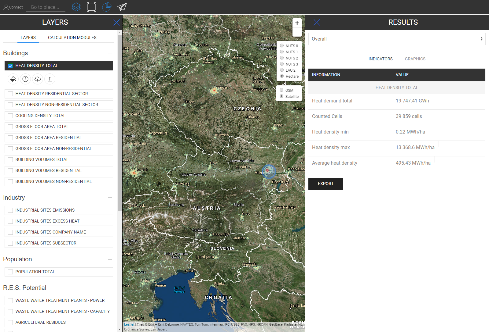
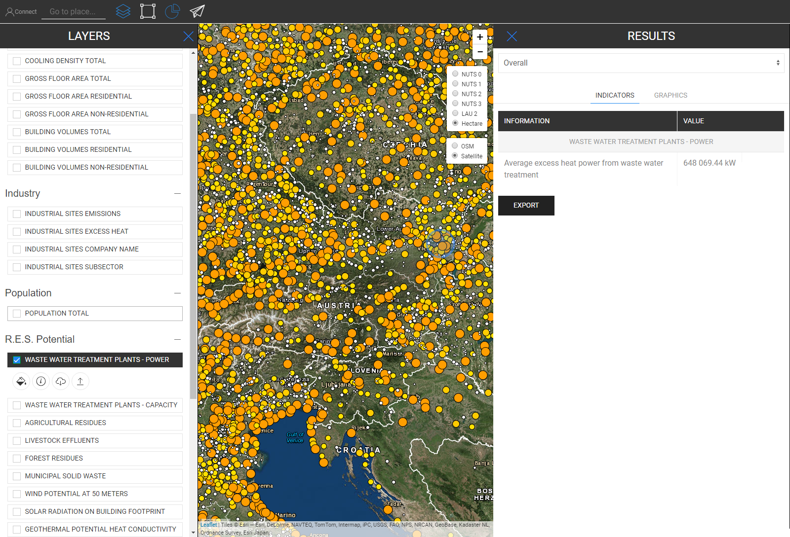

<h1><a class="anchor" id="retrieve-indicators-of-a-selected-area" href="#retrieve-indicators-of-a-selected-area"><i class="fa fa-link"></i></a>Recuperar indicadores de un área seleccionada</h1><h2><a class="anchor" id="table-of-contents" href="#table-of-contents"><i class="fa fa-link"></i></a> Tabla de contenido</h2><ul><li> <a href="#introduction">Introducción</a></li><li> <a href="#indicators-for-raster-layers">Indicadores de capas ráster</a><ul><li> <a href="#indicators-for-raster-layers_buildings">Edificios</a></li><li> <a href="#indicators-for-raster-layers_population">Población</a></li><li> <a href="#indicators-for-raster-layers_renewable-energy-source-potentials">Potenciales de fuentes de energía renovable</a></li></ul></li><li> <a href="#indicators-for-vector-layers">Indicadores de capas vectoriales</a><ul><li> <a href="#indicators-for-vector-layers_industry">Industria</a></li><li> <a href="#indicators-for-vector-layers_renewable-energy-source-potentials">Potenciales de fuentes de energía renovable</a></li><li> <a href="#indicators-for-vector-layers_electricity">Electricidad</a></li></ul></li><li> <a href="#example">Ejemplo</a></li><li> <a href="#how-to-cite">Cómo citar</a></li><li> <a href="#authors-and-reviewers">Autores y revisores</a></li><li> <a href="#license">Licencia</a></li><li> <a href="#acknowledgement">Reconocimiento</a></li></ul><h2><a class="anchor" id="introduction" href="#introduction"><i class="fa fa-link"></i></a> Introducción</h2>
 Dependiendo de las capas y la región que seleccionó, los indicadores para su configuración se muestran en una barra lateral a la derecha de su pantalla

 <a href="#table-of-contents"><strong><code>To Top</code></strong></a>

 A continuación, examinamos los indicadores que se muestran para capas ráster y vectoriales.
<h2><a class="anchor" id="indicators-for-raster-layers" href="#indicators-for-raster-layers"><i class="fa fa-link"></i></a> Indicadores de capas ráster</h2>
 Los indicadores de las capas ráster son diferentes de las capas vectoriales. Con diferente, queremos decir en términos de agregación y desagregación. Este comportamiento diferente proviene de resoluciones territoriales.

 Las capas ráster tienen generalmente una resolución mucho más alta, mientras que las capas vectoriales solo tienen atributos en puntos o polígonos.

 Eso significa, por un lado, por ejemplo, que si selecciona una capa vectorial que está definida por polígonos NUTS3 y desea, por ejemplo, seleccionar una región LAU, entonces el valor NUTS3 no se desagregará al nivel LAU, en cambio, el indicador NUTS3 donde este La región LAU donde se encuentra se mostrará en la barra lateral de resultados.

 Por otro lado, las capas ráster se agregan y desagregan &quot;arbitrariamente&quot; *

 * por las celdas que las contienen dentro de la región que seleccionó (naturalmente dentro del límite de la resolución de la trama)

 <a href="#table-of-contents"><strong><code>To Top</code></strong></a>
<h3><a class="anchor" id="buildings" href="#buildings"><i class="fa fa-link"></i></a> Edificios</h3>
 <strong>Mapa de densidad de calor</strong>

 <strong>Característica extra</strong>

 Cuando selecciona la capa de densidad de calor y la capa de población al mismo tiempo, se muestra un indicador adicional (vea la imagen a continuación)

 <a href="#table-of-contents"><strong><code>To Top</code></strong></a>
<h3><a class="anchor" id="in-general-" href="#in-general-"><i class="fa fa-link"></i></a> En general:</h3>
 Cuando una de las capas de construcción y la capa de población se seleccionan al mismo tiempo, se mostrará un indicador adicional como se describió anteriormente.

<ins> <code><strong><a href="#indicators-for-raster-layers">To Chapter</a></strong></code></ins>

 <strong>Mapa de densidad de enfriamiento</strong>

<ins> <code><strong><a href="#indicators-for-raster-layers">To Chapter</a></strong></code></ins>

 <strong>Volúmenes de construcción</strong>

<ins> <code><strong><a href="#indicators-for-raster-layers">To Chapter</a></strong></code></ins>

 <strong>Superficie de suelo</strong>

<ins> <code><strong><a href="#indicators-for-raster-layers">To Chapter</a></strong></code></ins> <a href="#table-of-contents"><strong><code>To Top</code></strong></a>
<h3><a class="anchor" id="population" href="#population"><i class="fa fa-link"></i></a> Población</h3>

<ins> <code><strong><a href="#indicators-for-raster-layers">To Chapter</a></strong></code></ins> <a href="#table-of-contents"><strong><code>To Top</code></strong></a>
<h3><a class="anchor" id="climate" href="#climate"><i class="fa fa-link"></i></a> Clima</h3>
 <strong>Temperatura</strong>

<ins> <code><strong><a href="#indicators-for-raster-layers">To Chapter</a></strong></code></ins>

 <strong>Días de grado de enfriamiento</strong>

<ins> <code><strong><a href="#indicators-for-raster-layers">To Chapter</a></strong></code></ins>

 <strong>Días de grado de calefacción</strong>

<ins> <code><strong><a href="#indicators-for-raster-layers">To Chapter</a></strong></code></ins>

 <strong>Radiación solar</strong>

<ins> <code><strong><a href="#indicators-for-raster-layers">To Chapter</a></strong></code></ins>

 <strong>Velocidad del viento</strong>

<ins> <code><strong><a href="#indicators-for-raster-layers">To Chapter</a></strong></code></ins> <a href="#table-of-contents"><strong><code>To Top</code></strong></a>
<h3><a class="anchor" id="renewable-energy-source-potentials" href="#renewable-energy-source-potentials"><i class="fa fa-link"></i></a> Potenciales de fuentes de energía renovable</h3>
 <strong>Radiación solar en la huella del edificio</strong>

<ins> <code><strong><a href="#indicators-for-raster-layers">To Chapter</a></strong></code></ins>

 <strong>Potencial de viento a 50 m</strong>

<ins> <code><strong><a href="#indicators-for-raster-layers">To Chapter</a></strong></code></ins>

 <strong>Residuos forestales</strong>

<ins> <code><strong><a href="#indicators-for-raster-layers">To Chapter</a></strong></code></ins> <a href="#table-of-contents"><strong><code>To Top</code></strong></a>
<h2><a class="anchor" id="indicators-for-vector-layers" href="#indicators-for-vector-layers"><i class="fa fa-link"></i></a> Indicadores de capas vectoriales</h2><h3><a class="anchor" id="industry" href="#industry"><i class="fa fa-link"></i></a> Industria</h3>
 <strong>Emisiones de sitios industriales</strong>

<ins> <code><strong><a href="#indicators-for-vector-layers">To Chapter</a></strong></code></ins>

 <strong>Exceso de calor en sitios industriales</strong>

<ins> <code><strong><a href="#indicators-for-vector-layers">To Chapter</a></strong></code></ins>

 <strong>Nombre de la empresa del emplazamiento industrial</strong>

<ins> <code><strong><a href="#indicators-for-vector-layers">To Chapter</a></strong></code></ins>

 <strong>Subsector de emplazamiento industrial</strong>

<ins> <code><strong><a href="#indicators-for-vector-layers">To Chapter</a></strong></code></ins> <a href="#table-of-contents"><strong><code>To Top</code></strong></a>
<h3><a class="anchor" id="renewable-energy-source-potentials" href="#renewable-energy-source-potentials"><i class="fa fa-link"></i></a> Potenciales de fuentes de energía renovable</h3>
 <strong>Plantas de tratamiento de aguas residuales Energía</strong>

<ins> <code><strong><a href="#indicators-for-vector-layers">To Chapter</a></strong></code></ins>

 <strong>Capacidad de las plantas de tratamiento de aguas residuales</strong>

<ins> <code><strong><a href="#indicators-for-vector-layers">To Chapter</a></strong></code></ins>

 <strong>Residuos agrícolas</strong>

<ins> <code><strong><a href="#indicators-for-vector-layers">To Chapter</a></strong></code></ins>

 <strong>Efluentes ganaderos</strong>

<ins> <code><strong><a href="#indicators-for-vector-layers">To Chapter</a></strong></code></ins>

 <strong>Residuos sólidos urbanos</strong>

<ins> <code><strong><a href="#indicators-for-vector-layers">To Chapter</a></strong></code></ins>

 <strong>Conductividad térmica potencial geotérmica</strong>

<ins> <code><strong><a href="#indicators-for-vector-layers">To Chapter</a></strong></code></ins> <a href="#table-of-contents"><strong><code>To Top</code></strong></a>
<h3><a class="anchor" id="electricity" href="#electricity"><i class="fa fa-link"></i></a> Electricidad</h3>
 <strong>Emisiones de C02 de Electricidad</strong>

<ins> <code><strong><a href="#indicators-for-vector-layers">To Chapter</a></strong></code></ins> <a href="#table-of-contents"><strong><code>To Top</code></strong></a>
<h2><a class="anchor" id="example" href="#example"><i class="fa fa-link"></i></a> Ejemplo</h2>
 En la imagen de abajo, puede ver cómo se ve cuando se visualizan todas las capas (aquí está Austria como NUTS0 seleccionado)

 Aunque este mapa puede parecer un poco confuso a primera vista, sus indicadores se ilustran claramente. Vea a continuación todos los indicadores que se describen en la barra lateral de resultados cuando selecciona todas las capas para Austria (NUTS0)

 <a href="#table-of-contents"><strong><code>To Top</code></strong></a>
<h2><a class="anchor" id="how-to-cite" href="#how-to-cite"><i class="fa fa-link"></i></a> Cómo citar</h2>
 Jeton Hasani, en Hotmaps-Wiki, Recuperar-indicadores-de-un-área-seleccionada (abril de 2019)

 <a href="#table-of-contents"><strong><code>To Top</code></strong></a>
<h2><a class="anchor" id="authors-and-reviewers" href="#authors-and-reviewers"><i class="fa fa-link"></i></a> Autores y revisores</h2>
 Esta página fue escrita por Jeton Hasani <strong><a href="https://eeg.tuwien.ac.at/">EEG - TU Wien</a></strong> .

 ☑ Esta página fue revisada por Mostafa Fallahnejad <strong><a href="https://eeg.tuwien.ac.at/">EEG - TU Wien</a></strong> .

 <a href="#table-of-contents"><strong><code>To Top</code></strong></a>
<h2><a class="anchor" id="license" href="#license"><i class="fa fa-link"></i></a> Licencia</h2>
 Copyright © 2016-2020: Jeton Hasani

 Licencia internacional Creative Commons Attribution 4.0

 Esta obra está autorizada bajo una licencia internacional Creative Commons CC BY 4.0.

 Identificador de licencia SPDX: CC-BY-4.0

 Texto de licencia: https://spdx.org/licenses/CC-BY-4.0.html

 <a href="#table-of-contents"><strong><code>To Top</code></strong></a>
<h2><a class="anchor" id="acknowledgement" href="#acknowledgement"><i class="fa fa-link"></i></a> Reconocimiento</h2>
 Nos gustaría transmitir nuestro más profundo agradecimiento al <a href="https://www.hotmaps-project.eu">Proyecto Hotmaps</a> Horizon 2020 (Acuerdo de subvención número 723677), que proporcionó los fondos para llevar a cabo la presente investigación.

 <a href="#table-of-contents"><strong><code>To Top</code></strong></a> <code><a href="Indicator-Section/_edit">Review this page</a></code>

<!--- THIS IS A SUPER UNIQUE IDENTIFIER -->

This page was automatically translated. View in another language:

[English](../en/Retrieve-indicators-of-a-selected-area) (original) [Bulgarian](../bg/Retrieve-indicators-of-a-selected-area)\* [Czech](../cs/Retrieve-indicators-of-a-selected-area)\* [Danish](../da/Retrieve-indicators-of-a-selected-area)\* [German](../de/Retrieve-indicators-of-a-selected-area)\* [Greek](../el/Retrieve-indicators-of-a-selected-area)\*  [Estonian](../et/Retrieve-indicators-of-a-selected-area)\* [Finnish](../fi/Retrieve-indicators-of-a-selected-area)\* [French](../fr/Retrieve-indicators-of-a-selected-area)\* [Irish](../ga/Retrieve-indicators-of-a-selected-area)\* [Croatian](../hr/Retrieve-indicators-of-a-selected-area)\* [Hungarian](../hu/Retrieve-indicators-of-a-selected-area)\* [Italian](../it/Retrieve-indicators-of-a-selected-area)\* [Lithuanian](../lt/Retrieve-indicators-of-a-selected-area)\* [Latvian](../lv/Retrieve-indicators-of-a-selected-area)\* [Maltese](../mt/Retrieve-indicators-of-a-selected-area)\* [Dutch](../nl/Retrieve-indicators-of-a-selected-area)\* [Polish](../pl/Retrieve-indicators-of-a-selected-area)\* [Portuguese (Portugal, Brazil)](../pt/Retrieve-indicators-of-a-selected-area)\* [Romanian](../ro/Retrieve-indicators-of-a-selected-area)\* [Slovak](../sk/Retrieve-indicators-of-a-selected-area)\* [Slovenian](../sl/Retrieve-indicators-of-a-selected-area)\* [Swedish](../sv/Retrieve-indicators-of-a-selected-area)\* 

\* machine translated
