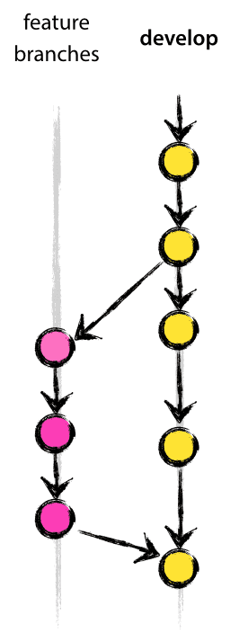

<h2> Sisukord </h2><ul><li> <a href="#Introduction">Sissejuhatus</a> </li><li> <a href="#Dataset-integration">Andmekogumi integreerimine</a> </li><li> <a href="#add-your-datasets-on-gitlab">Lisage oma andmekogumid GitLabile</a> </li><li> <a href="#List-of-main-repositories">Peamiste hoidlate loetelu</a> </li><li> <a href="#How-to-contribute-code">Kuidas koodi sisestada?</a> </li><li> <a href="#Description-of-IT-infrastructure">IT-infrastruktuuri kirjeldus</a> <ul><li> <a href="#Run-with-Docker">Jookse koos Dockeriga</a> </li><li> <a href="#Server-infrastructure">Serveri infrastruktuur</a> <ul><li> <a href="#Infrastructure">Infrastruktuur</a> </li><li> <a href="#Performance">Etendus</a> </li></ul></li></ul></li><li> <a href="#How-to-define-indicators">Kuidas määratleda näitajaid</a> </li><li> <a href="#References">Viited</a> </li><li> <a href="#How-to-cite">Kuidas tsiteerida</a> </li><li> <a href="#Authors-and-reviewers">Autorid ja retsensendid</a> </li><li> <a href="#Acknowledgement">Tunnustus</a> </li></ul><h2> Sissejuhatus </h2>
 See leht sisaldab kogu teavet, mida arendajad vajavad Hotmaps platvormi loomiseks või selle toimimiseks mõistmiseks. 

<ins> <code><strong><a href="#table-of-contents">To Top</a></strong></code> </ins> 
<h2> Andmekogumi integreerimine </h2>
 Uute avalike andmekogumite integreerimist käsitletakse järgmiselt: 
<ol><li> andmestikud tuleb lükata git-hoidlasse ( <a href="#Add-your-datasets-on-GitLab">lisage oma andmekogumid GitLabis</a> ) </li><li> igal õhtul integreerib skript uued / värskendatud andmekogumid DEV-platvormiga </li><li> kui kõik toimis hästi, on andmestik nüüd saadaval DEV-platvormil ja arendajad saavad selle oma koodi integreerida </li><li> Kui kodeerimine on lõpule viidud, lisatakse uued funktsioonid tootmisplatvormile uue väljalaske kaudu </li></ol>

 Kui andmestik integreerimise ajal ebaõnnestub, luuakse probleem Taigas (projektihaldusplatvorm). Probleem näitab tõstatatud viga ja arendaja peaks selle parandama ja oma töö uuesti Gitile suunama, et skript saaks järgmisel õhtul proovida seda uuesti integreerida. 

 Integreerimisskripti lähtekood on saadaval sellel lingil: <a href="https://github.com/HotMaps/CI_DatasetIntegration">Andmete integreerimine</a> 

<ins> <code><strong><a href="#table-of-contents">To Top</a></strong></code> </ins> 
<h2> Lisage oma andmekogumid GitLabile </h2>
 Andmekogude lisamiseks avalike andmekogumite loendisse tuleb need lükata uude Giti hoidlasse GitLabis. Siin on GitLabi organisatsioon, kuhu tuleks andmekogumid lükata: <a href="https://gitlab.com/hotmaps">Andmebaasid GitLabil</a> . 

 Kord päevas kontrollitakse hoidlaid uute kohustuste osas ja integreeritakse, kui jah. Integreerimisprotsess kontrollib, kas andmed vastavad spetsifikatsioonile või mitte. 

 Siin on spetsifikatsioon: <a href="uploads%5CHotmaps_Data-upload-on-Gitlab_2017-12-04_V4.pdf">Hotmaps_Data-upload-on-Gitlab_2017-12-04_V4.pdf</a> 

<ins> <code><strong><a href="#table-of-contents">To Top</a></strong></code> </ins> 
<h2> Peamiste hoidlate loetelu </h2>
 Rakenduse kood asub GitHubis <a href="https://github.com/HotMaps">organisatsiooni Hotmaps</a> all. Sellel organisatsioonil on mitu hoidlat 
<ul><li> <a href="https://github.com/HotMaps/Hotmaps-toolbox-service">Hotmaps-toolbox-klient</a> sisaldab meie rakenduse <a href="https://github.com/HotMaps/Hotmaps-toolbox-service">esikülge</a> . See on nurgeline projekt (JavaScript) </li><li> <a href="https://github.com/HotMaps/Hotmaps-toolbox-service">Teenus Hotmaps-toolbox-service</a> sisaldab meie rakenduse API <a href="https://github.com/HotMaps/Hotmaps-toolbox-service">-</a> t. See põhineb kolvil (Python) </li><li> <a href="https://github.com/HotMaps/hotmaps_wiki">Hotmaps-wiki</a> on Wiki, mida praegu loete </li><li> <a href="https://github.com/HotMaps/base_calculation_module">aluse arvutamisel-moodul</a> on põhiline malli saate luua oma arvutuse moodulid HotMaps </li><li> arvutusmoodulite loetelu </li></ul>
<ins> <code><strong><a href="#table-of-contents">To Top</a></strong></code> </ins> 
<h2> Kuidas koodi sisestada? </h2>
 Mõne koodi lisamiseks Hotmapsisse on teil kaks võimalust: kui soovite liidest või taustaprogrammi värskendada otse, peate tööriistakasti klienti või teenusehoidlat muutma. Kui soovite lisada oma arvutusmooduli, saate oma hoidla luua, järgides <a href="https://github.com/HotMaps/base_calculation_module">hoidla base_calculation_module readme readme</a> 

 Kui soovite mõnda tööd Giti hoidlas teha, siis ärge töötage otse peaharuga. Looge arendusharust uus haru, tehke oma tööd sellel harul ja kui teie funktsiooni on testitud, saate ühendada oma töö arendusharuga, nagu on näidatud järgmisel graafikul. 

 Midagi mõnda Hotmapi hoidlasse suunamiseks peate kuuluma Hotmapi meeskonda, kui te pole veel üks, võite oma tööriista väljatöötamiseks ikkagi meie tööriista kahvli teha. 

 Lisateavet selle kohta, kuidas töötada, leiate järgmistest dokumentidest: 
<ul><li> <a href="uploads/Hotmaps_python_best_practices_tutorial_2017-08-07_v01.pdf">Hotmaps_python_best_practices_tutorial_2017-08-07_v01.pdf</a> </li><li> <a href="uploads%5CHotmaps_Testing_in_python_tutorial_pytest_2017-08-07_v01.pdf">Hotmaps_Testing_in_python_tutorial_pytest_2017-08-07_v01.pdf</a> </li><li> <a href="uploads%5CGitFlow_Guidelines_CREM_2017-02-01.pdf">GitFlow_Guidelines_CREM_2017-02-01.pdf</a> </li></ul>
<ins> <code><strong><a href="#table-of-contents">To Top</a></strong></code> </ins> 
<h2> IT-infrastruktuuri kirjeldus </h2>

 Kõiki teenuseid ja komponente kasutatakse nende Dockeri konteineri kaudu. Kõik need mahutid on määratletud ühes doki koostamise failis. Ülalolev pilt tähistab Hotmapi IT-arhitektuuri. 

 Mõni partnerorganisatsioon piiras suhtlust ainult sadama 80 kaudu. Sellest piiratusest põhjustatud probleemide vältimiseks loodi vastupidine puhverserver. See vastupidine puhverserver pakub ühte sisenemispunkti ja jaotab seejärel kliendi saadetud päringu asjaomasele teenusele. Pöördpuhvers koosneb kolmest komponendist: 
<ol><li> Pöördpuhverserver: see toimib ainulaadse sisenemispunktina ja jaotab päringuid õigetele teenustele. </li><li> Puhverserver: see on teenus, mis kaardistab automaatselt kõik teenused puhverserveris. Seega pole vaja puhverserveri konfiguratsioonile käsitsi uut teenust lisada </li><li> laseb-krüptida: see on teenus, mis võimaldab kasutada SSL-protokolli. See on vajalik https-protokolli aktiveerimiseks. SSL-sertifikaatidele kirjutavad alla selle teenuse konfigureeritud e-posti aadress. </li></ol>
 On olemas kolm võrku: 
<ul><li> hotmaps_nginx võimaldab vastupidisel puhverserveril suhelda api, kasutajaliidese ja geoserveriga. Peamiselt võimaldab see jaotada päringu õige teenuse jaoks kolme hulgas. </li><li> hotmaps_backend võimaldab suhelda kõigi taustaprogrammi komponentide vahel: api, frontend, geoserver ja PostgreSQL andmebaas. </li><li> hotmaps_cm-net võimaldab suhelda iga arvutusmooduli ja api vahel. </li></ul>
 Igal arvutusmoodulil on oma Dockeri konteiner. 
<h3> Jookse koos Dockeriga </h3>
 HotMaps kasutab <a href="https://www.docker.com/">sadamatööline</a> tarkvara ja <a href="https://docs.docker.com/compose/">sadamatööline-komponeerida</a> vahend juhtida konteinerid. Faili docker-compose.yml fail sisaldab kogu Dockeri arhitektuuri konfiguratsiooni (konteinerite, võrkude, linkide jne konfiguratsioonid). See võimaldab konteinerite käitamist ühe lihtsa käsuga: 
<pre> <code class="language-shell">docker-compose up</code> </pre>
 <em>Dockeri koostamise kohta on Dockeri veebisüsteemis rohkem: <a href="https://docs.docker.com/compose/reference/">käsurida käsurida</a> ja <a href="https://docs.docker.com/compose/compose-file/">faili koostamine</a> .</em> 

 On ainult üks konteiner, mida käitatakse teistest eraldi: see on andmebaas, kuna see peab kogu aeg püsti olema. Sellepärast pole seda doki koostamise konfiguratsioonifailis. 
<h3> Serveri infrastruktuur </h3><h4> Infrastruktuur </h4>
 Praegu hostitakse serverit Šveitsis HES-SO. Saadaval on 2 masinat: üks arendamiseks (arendamine ja testimine) ja teine tootmiseks (tegelik tööriistakast, saadaval aadressil <a href="https://www.hotmaps.eu">www.hotmaps.eu</a> ). 

 Mõlemal masinal on sama spetsifikatsioon: 
<ul><li> Protsessor: Intel Xeon E5-2680 v4 (8) @ 2,4 GHz) </li><li> RAM: 16 GB </li><li> HDD: 500 GB </li><li> OS: Ubutnu 16.04 LTS </li></ul><h4> Etendus </h4>
 Teatud hulga samaaegsete kasutajate tagamiseks korraldame arendusserveris sageli jõudlusteste. 

 Allpool on toodud näiteks esimese beetaversiooni versiooni tulevaste versioonide testid. Uus väljaanne sisaldab mõningaid jõudluse täiustusi. 

 <em>See näide näitab samaaegsete kasutajate jõudlusteste, mis kasutavad sama funktsiooni: "hektari valimise kestuskõver". Paksus kirjas rida näitab piiri, kus server hakkab vigu tekitama. Hektarivalik on hea näide, kuna see näitab päringuid, mis nõuavad kõige rohkem ressursse.</em> 

 <strong>Beetaväljaanne märtsis 2019</strong> 

 | Simuleeritud kasutajate Nb | Keskmine aeg | Mediaan | Maksimaalne aeg | Min aeg | Vigade protsent | | --------------------- | ------------ | ------ | -------- | -------- | -------------------- | | 1 | 2936 | 2936 | 2936 | 2936 | 0 | | 20 | 9329 | 9503 | 11778 | 6901 | 0 | | 50 | 22922 | 22713 | 33401 | 8661 | 0 | | <strong>100</strong> | 33302 | 32875 | 58257 | 4929 | <strong>16</strong> | | 200 | na | na | na | na | na | | 300 | na | na | na | na | na | 

 <strong>DEV tulevane väljalase (märts 2019)</strong> 

 | Simuleeritud kasutajate Nb | Keskmine aeg | Mediaan | Maksimaalne aeg | Min aeg | Vigade protsent | | --------------------- | ------------ | ------ | -------- | -------- | -------------------- | | 1 | 1802 | 1802 | 1802 | 1802 | 0 | | 20 | 5289 | 2677 | 6873 | 2149 | 0 | | 50 | 10775 | 11274 | 17081 | 2577 | 0 | | 100 | 19807 | 20280 | 35142 | 3156 | 0 | | 200 | 37302 | 37575 | 69930 | 3381 | 0 | | <strong>300</strong> | 49091 | 57536 | 83578 | 2447 | <strong>26</strong> | 

<ins> <code><strong><a href="#table-of-contents">To Top</a></strong></code> </ins> 
<h2> Kuidas määratleda näitajaid </h2>
 <a href="indicator_readme">Näitaja määratlus</a> 

<ins> <code><strong><a href="#table-of-contents">To Top</a></strong></code> </ins> 
<h2> Viited </h2>
<ins> <code><strong><a href="#table-of-contents">To Top</a></strong></code> </ins> 
<h2> Kuidas tsiteerida </h2>
<ins> <code><strong><a href="#table-of-contents">To Top</a></strong></code> </ins> 
<h2> Autorid ja retsensendid </h2>
 Autorid: 
<ul><li> Daniel Hunacek </li><li> Lucien Zuber </li><li> Matthieu Dayer </li></ul>
 Ülevaatajad: 

<ins> <code><strong><a href="#table-of-contents">To Top</a></strong></code> </ins> 
<h2> Tunnustus </h2>
 Soovime avaldada oma sügavat tunnustust <a href="https://www.hotmaps-project.eu">projektile</a> Horisont 2020 <a href="https://www.hotmaps-project.eu">Hotmaps</a> (toetuslepingu nr 723677), mis eraldas raha käesoleva uurimise läbiviimiseks 

<ins> <code><strong><a href="#table-of-contents">To Top</a></strong></code> </ins> 
<h2></h2>

This page was automatically translated. View in another language:

[English](en-Developers) (original) [Bulgarian](bg-Developers)\* [Croatian](hr-Developers)\* [Czech](cs-Developers)\* [Danish](da-Developers)\* [Dutch](nl-Developers)\*  [Finnish](fi-Developers)\* [French](fr-Developers)\* [German](de-Developers)\* [Greek](el-Developers)\* [Hungarian](hu-Developers)\* [Irish](ga-Developers)\* [Italian](it-Developers)\* [Latvian](lv-Developers)\* [Lithuanian](lt-Developers)\* [Maltese](mt-Developers)\* [Polish](pl-Developers)\* [Portuguese (Portugal, Brazil)](pt-Developers)\* [Romanian](ro-Developers)\* [Slovak](sk-Developers)\* [Slovenian](sl-Developers)\* [Spanish](es-Developers)\* [Swedish](sv-Developers)\*
\*: machine translated
