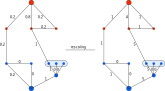

<h1><a class="anchor" id="cm-excess-heat-transport-potential" href="#cm-excess-heat-transport-potential"><i class="fa fa-link"></i></a>CM Liigne soojustranspordi potentsiaal</h1><h2><a class="anchor" id="table-of-contents" href="#table-of-contents"><i class="fa fa-link"></i></a> Sisukord</h2><ul><li> <a href="#in-a-glance">Lühidalt</a></li><li> <a href="#introduction">Sissejuhatus</a></li><li> <a href="#inputs-and-outputs">Sisendid ja väljundid</a><ul><li> <a href="#inputs-and-outputs_input-layers-and-parameters">Sisendkihid ja parameetrid</a></li><li> <a href="#inputs-and-outputs_output">Väljund</a></li></ul></li><li> <a href="#method">Meetod</a><ul><li> <a href="#method_overview">Ülevaade</a></li><li> <a href="#method_details">Üksikasjad</a></li><li> <a href="#method_implementation">Rakendamine</a></li></ul></li><li> <a href="#github-repository-of-this-calculation-module">Selle arvutusmooduli GitHubi hoidla</a></li><li> <a href="#quick-start">Kiire algus</a></li><li> <a href="#troubleshooting">Tõrkeotsing</a></li><li> <a href="#sample-run">Proovijooks</a></li><li> <a href="#how-to-cite">Kuidas tsiteerida</a></li><li> <a href="#authors-and-reviewers">Autorid ja retsensendid</a></li><li> <a href="#license">Litsents</a></li><li> <a href="#acknowledgement">Tunnustus</a></li></ul><h2><a class="anchor" id="in-a-glance" href="#in-a-glance"><i class="fa fa-link"></i></a> Lühidalt</h2>
 Selles moodulis arvutatakse väljaspool potentsiaalseid kaugküttepiirkondi asuvate võimalike liigsete soojusallikate kaugkütte piirkonda soojusülekande voog ja kulud. Sisenditeks on liigse soojusvoolu ja kaugküttevajaduse tunnikoormuse profiilid, liigse soojusallika ja potentsiaalse kaugküttesüsteemi asukoht, soojusvahetite ja ülekandeliinide investeerimiskulud ning kaugus- ja ülekandekulude künnisväärtused.

 <a href="#table-of-contents"><strong><code>To Top</code></strong></a>
<h2><a class="anchor" id="introduction" href="#introduction"><i class="fa fa-link"></i></a> Sissejuhatus</h2>
 Arvestusmoodul &quot;Liigne soojuse transpordi potentsiaal&quot; aitab kasutajal tuvastada kaugküttevõrkude ülemäärase soojuse integreerimisvõimalusi. Potentsiaalid põhinevad <a href="https://wiki.hotmaps.hevs.ch/en/CM-District-heating-potential-areas-user-defined-thresholds">CM - kaugkütte potentsiaalil</a> . See CM määratleb piirkonnad, kus kaugküttevõrkude jaoks on soodsad tingimused, ja näitab, kui palju soojust võiks nendes piirkondades katta tööstuslik liigne soojus. See aga ei tähenda, et selles piirkonnas on kaugküttevõrk juba olemas.

 Eelmise ülesande jaoks on ühendatud järgmised andmed ja meetodid.

 Andmed:
<ul><li>
 Kaugküttevõrkude soodsate tingimustega läheduses asuvate piirkondade küttenõuded, mis lahustatakse tunnis ( <a href="https://wiki.hotmaps.hevs.ch/en/CM-District-heating-potential-areas-user-defined-thresholds">CM-st - kaugküttepotentsiaal</a> ).
</li><li>
 Andmed piirkonna tööstusettevõtete liigsete soojuskoguste kohta, mis lahendatakse ka tunnis (andmekogumi tööstusandmebaasist).
</li><li>
 Eeldused soojusvahetite, pumpade ja torujuhtmete maksumuse ning kaugküttetorustike soojuskadude kohta.
</li></ul>
 Meetod (lihtsustatud):
<ul><li> Torujuhtme kujundamine väljatöötatud heuristika põhjal, mis kujutab endast projekti kui võrgu voolu probleemi.</li></ul>
 Meetodi eesmärk on esindada võimalikult suurt üleliigset soojusvoogu mitte liiga paljude ja seega liiga pikkade torujuhtmetega võimalike kaugkütte kasutajateni, tekitades maksimaalse vooluhulgaga võrke. Eriti ebaefektiivseid transpordiliine (madalate soojusvoogude ja seega kõrgete soojuse erikuludega) ei arvestata lõppvõrgus. Individuaalsete transpordiliinide majandusliku efektiivsuse künnise saab määrata kasutaja (vrd ülekandeliini künnis).

 Lähenemisviisi põhitaust on järgmine: kui üleliigseid soojusallikaid on vaid mõni, võiks alati arvestada ühe gaasijuhtmega allika kohta, et viia soojus kaugkütteks soodsate tingimustega lähedalasuvasse piirkonda. Kui aga samasse piirkonda peaks voolama mitu üleliigset soojusallikat, oleks mõttekas soojus kokku koguda ja suuremasse ühisesse torujuhtmesse piirkonda transportida. Lähenemisviis ühe toruga allika kohta kipub torujuhtmete pingutusi üle hindama.

 Eeltoodu neutraliseerimiseks ühtlustati torujuhtme planeerimise probleem, eeldades võrgu voogude probleemi. Probleemi lahendamiseks kasutatakse heuristilist meetodit, mille abil saab üleliigse soojuse kokku panna ja võimalikele kasutajatele transportida. Lahuse konkreetset metoodilist ülesehitust minimaalse laiuspuu lähenemisega kirjeldatakse vastavas metoodilises osas. Eelmises kontekstis kindlaksmääratud torujuhtme projekt ei tähenda seetõttu detailplaneeringut ega reaalset marsruudi juhatust, vaid seda kasutatakse ainult kaugküttevõrkudele soodsate tingimustega lähipiirkondades asuvate ülemääraste soojakoguste jaotamise kulude ühtlustamiseks. (vt <a href="https://wiki.hotmaps.hevs.ch/en/CM-District-heating-potential-areas-user-defined-thresholds">CM - kaugküttepotentsiaal</a> , märksõnaga koherentsed alad). See kulude lähendamine viitab seega kogu võrgule.

 Tulemusi tuleks seejärel tõlgendada järgmiselt: kui registreeritud üleliigsed soojuskogused tuleks transportida koos näidatud lähipiirkondadesse, siis võiksid soojuse jaotamise kulud olla tööriista näidatud suurusjärgus (vrd. soojusvarustus). Reeglina on kogu võrgu väärtused ka heaks indikaatoriks üksikute torujuhtmete jaoks. Tulemuste eesmärk on seega anda projekti arendajale või planeerijale suurusjärk võimalike levitamiskulude jaoks.

 <a href="#table-of-contents"><strong><code>To Top</code></strong></a>
<h2><a class="anchor" id="inputs-and-outputs" href="#inputs-and-outputs"><i class="fa fa-link"></i></a> Sisendid ja väljundid</h2><h3><a class="anchor" id="input-layers-and-parameters" href="#input-layers-and-parameters"><i class="fa fa-link"></i></a> Sisendkihid ja parameetrid</h3><h4><a class="anchor" id="provided-by-toolbox" href="#provided-by-toolbox"><i class="fa fa-link"></i></a> Pakub tööriistakast</h4><ul><li>
 Kaugküttepiirkonnad (praegu pakub otseselt kaugkütte potentsiaal CM)
</li><li>
 Tööstuse andmebaas (vaikimisi pakub tööriistakast)
</li><li>
 Tööstuse koormusprofiilid
</li><li>
 Elamukütte ja sooja tarbevee koormusprofiilid
</li></ul><h4><a class="anchor" id="provided-by-the-user" href="#provided-by-the-user"><i class="fa fa-link"></i></a> Pakub kasutaja</h4><ul><li>
 Min. soojavajadus hektari kohta

 Vt <a href="https://wiki.hotmaps.hevs.ch/en/CM-District-heating-potential-areas-user-defined-thresholds">CM - kaugkütte potentsiaal</a> .
</li><li>
 Min. soojavajadus sooja tarbevööndis

 Vt <a href="https://wiki.hotmaps.hevs.ch/en/CM-District-heating-potential-areas-user-defined-thresholds">CM - kaugkütte potentsiaal</a> .
</li><li>
 Seadmete eluiga aastatel

 Tasandatud soojuskulud viitavad sellele ajaperioodile.
</li><li>
 Diskontomäär protsentides

 Võrgu ehitamiseks vajaliku krediidi intressimäär.
</li><li>
 Kulutegur

 Faktor võrgukulude kohandamiseks juhul, kui vaikeväärtused ei näita kulusid täpselt. Selle teguriga korrutatakse võrku vajalikud investeeringud. Vaikekulud leiate jaotisest <a href="en-CM-Excess-heat-transport-potential#computation-of-costs">Kulude arvutamine</a> .
</li><li>
 Tegevuskulud%

 Võrgu tegevuskulud aastas. Protsentides võrgu jaoks vajalikest investeeringutest.
</li><li>
 Ülekandeliinide künnisväärtus ct / kWh

 Iga ülekandeliini maksimaalne tasandatud soojuskulu. Seda parameetrit saab kasutada kogu võrgu tasandatud küttekulu kontrollimiseks. Madalam väärtus võrdub madalama tasandatud soojuskuluga, aga ka kasutatud liigse soojuse vähenemisega ja vastupidi.
</li></ul><h4><a class="anchor" id="performance-parameters" href="#performance-parameters"><i class="fa fa-link"></i></a> Toimivuse parameetrid</h4><ul><li>
 Aja resolutsioon

 Määrab intervalli kogu aasta võrguvoogude arvutuste vahel. Võib olla üks järgmistest väärtustest: (tund, päev, nädal, kuu, aasta)
</li></ul>
 <a href="#table-of-contents"><strong><code>To Top</code></strong></a>
<h3><a class="anchor" id="output" href="#output"><i class="fa fa-link"></i></a> Väljund</h3><h4><a class="anchor" id="layers" href="#layers"><i class="fa fa-link"></i></a> Kihid</h4><ul><li>
 Ülekandeliinid

 Shapefile, kus on näidatud soovitatud ülekandeliinid koos nende temperatuuri, aastase soojusvoolu ja maksumusega. Üksikasjad leiate siit.
</li></ul><h4><a class="anchor" id="indicators" href="#indicators"><i class="fa fa-link"></i></a> Näitajad</h4><ul><li>
 Kogu ülekuumenemine valitud piirkonnas GWh

 Valitud piirkonnas ja läheduses asuvate tööstusettevõtete kogu saadaolev üleliigne soojus.
</li><li>
 Liigne kuumus on ühendatud GWh

 Võrku ühendatud tööstusettevõtete kogu saadaolev üleliigne soojusenergia.
</li><li>
 GWh-s kasutatud liigne kuumus

 DH jaoks kasutatud tegelik üleliigne soojus.
</li><li>
 Võrgu jaoks vajalikud investeeringud eurodes

 Võrgu rajamiseks on vaja investeeringuid.
</li><li>
 Võrgu aastased kulud eurodes aastas

 Võrgu annuiteedi ja tegevuskulude põhjustatud kulud aastas.
</li><li>
 Soojusvarustuse tasandatud kulud ct / kWh

 kogu võrgu soojuse maksumus.
</li></ul><h4><a class="anchor" id="graphics" href="#graphics"><i class="fa fa-link"></i></a> Graafika</h4><ul><li>
 DH potentsiaal ja liigne kuumus

 Graafiline pilt, mis näitab DH potentsiaali, kogu liigset soojust, ühendatud üleliigset soojust ja kasutatud liigset soojust. Üksikasjad leiate <a href="en-CM-Excess-heat-transport-potential#dh-potential-and-excess-heat">siit</a> .
</li><li>
 Kasutatud liigne soojus ja vajalikud investeeringud

 Graafik, mis näitab võrgu jaoks vajalike investeeringute jaoks aastas tarnitud liigset soojust. Üksikasjad leiate <a href="en-CM-Excess-heat-transport-potential#excess-heat-used-and-investment-necessary">siit</a> .
</li><li>
 Koormuskõverad

 Graafiline pilt, mis näitab igakuist soojavajadust ja ülejääki. Üksikasjad leiate <a href="en-CM-Excess-heat-transport-potential#load-curves">siit</a> .
</li><li>
 Koormuskõverad

 Graafiline graafik, mis näitab keskmist päevast soojavajadust ja üleliigset kogust. Üksikasjad leiate <a href="en-CM-Excess-heat-transport-potential#load-curves">siit</a> .
</li></ul><h4><a class="anchor" id="examples-of-layer" href="#examples-of-layer"><i class="fa fa-link"></i></a> Kihi näited</h4><h5><a class="anchor" id="transmission-lines" href="#transmission-lines"><i class="fa fa-link"></i></a> Ülekandeliinid</h5><figcaption> <i> Näide tööriistakastis kuvatud ülekandeliinist</i></figcaption>
 Ülekandeliinil klõpsates ilmub lisateave.
<h4><a class="anchor" id="examples-of-graphics" href="#examples-of-graphics"><i class="fa fa-link"></i></a> Graafika näited</h4><h5><a class="anchor" id="dh-potential-and-excess-heat" href="#dh-potential-and-excess-heat"><i class="fa fa-link"></i></a> DH potentsiaal ja liigne kuumus</h5>
 <em>Selles graafikus võrreldakse soojuspinna potentsiaali, kogu üleliigset soojust, ühendatud üleliigset soojust ja kasutatud liigset soojust.</em>

 Lisateavet aastase soojavajaduse ja sooja tarbevee potentsiaali kohta leiate <a href="CM-District-heating-potential-areas-user-defined-thresholds">siit</a> . Liigne soojus ühendas liigse soojuse ja kasutatud liigse soojuse samamoodi kui nende võrdselt nimetatud indikaatorid jaotises <a href="en-CM-Excess-heat-transport-potential#inputs-and-outputs_input-layers-and-parameters">Sisend ja väljund</a> .
<h5><a class="anchor" id="load-curves" href="#load-curves"><i class="fa fa-link"></i></a> Koormuskõverad</h5><figure><figcaption><i> </i>
 <i>See graafik näitab kogu voogu läbi aasta kogu võrgu kaudu. Alumine graafik tähistab keskmist päeva.</i>
</figcaption></figure>
 X-telg tähistab aega ja y-telje võimsust. Sinised kõverad tähistavad sooja tarbevööndi soojavajadust ja punased üleliigset soojust. Mõlema kõvera lõikepunkt tähistab tegelikku kogu soojusvoogu. Ülemine graafik näitab aasta voogu ja alumine keskmise päeva voogu. Pange tähele, et <a href="en-CM-Excess-heat-transport-potential#performance-parameters">aja eraldusvõimeks</a> tuleb seada vähemalt &quot;kuu&quot; ülemise jaoks ja &quot;tund&quot;, et alumine graafika oleks tüüpiline.

 <a href="#table-of-contents"><strong><code>To Top</code></strong></a>
<h2><a class="anchor" id="method" href="#method"><i class="fa fa-link"></i></a> Meetod</h2><h3><a class="anchor" id="overview" href="#overview"><i class="fa fa-link"></i></a> Ülevaade</h3>
 Ülemäärase soojusmooduli põhielement on kasutatud allika-valamu mudel. See ehitab minimaalse pikkusega ülekandevõrgu ja arvutab voo iga tunni kohta aastas, tuginedes NUTS 2 lahutusvõimega elamute küttekoormuse profiilidele ja NUTS 0 eraldusvõimega tööstuse koormusprofiilidele. Kogu aasta keskmiste tippvoogude põhjal saab arvutada iga ülekandeliini ja allika ja valamu poolse soojusvaheti kulusid.

 <a href="#table-of-contents"><strong><code>To Top</code></strong></a>
<h3><a class="anchor" id="details" href="#details"><i class="fa fa-link"></i></a> Üksikasjad</h3><h4><a class="anchor" id="modeling-of-sources" href="#modeling-of-sources"><i class="fa fa-link"></i></a> Allikate modelleerimine</h4>
 NUTS 0 ID ja tööstussektori põhjal määratakse igale allikale aastapikkune tunnis lahendatud koormusprofiil.
<h4><a class="anchor" id="modeling-of-sinks" href="#modeling-of-sinks"><i class="fa fa-link"></i></a> Valamute modelleerimine</h4>
 Kaugküttepotentsiaali arvutamise mooduli põhjal luuakse ühtsetesse piirkondadesse sisenemispunktid võrdsel kaugusel. Sõltuvalt sisenemispunktide NUTS 2 ID-st määratakse koormusprofiil.
<h4><a class="anchor" id="fixed-radius-search" href="#fixed-radius-search"><i class="fa fa-link"></i></a> Fikseeritud raadiusega otsing</h4>
 Eelseadistatud raadiuses kontrollitakse, millised allikad asuvad üksteise vahemikus, millised valamud asuvad üksteise vahemikus ja millised valamud on allikate vahemikus. Seda saab kujutada graafikuga, kus allikad ja valamud moodustavad tipud ja vahemikus olevad tipud on ühendatud servaga.
<h4><a class="anchor" id="reduction-to-minimum-length-network" href="#reduction-to-minimum-length-network"><i class="fa fa-link"></i></a> Vähendamine minimaalse pikkusega võrku</h4>
 Minimaalne haarav puu arvutatakse servade kauguse ja kaalu vahel. Selle tulemusel säilitab graafik oma ühenduvuse, olles samal ajal minimaalne servade kogupikkus. Pange tähele, et ühtsete alade sisenemispunktid on sisemiselt tasuta ühendatud, kuna need moodustavad oma jaotusvõrgu.
<h4><a class="anchor" id="flow-computation" href="#flow-computation"><i class="fa fa-link"></i></a> Voolu arvutamine</h4>
 Maksimaalne vool allikatest valamuteni arvutatakse iga tunni kohta aastas.
<h4><a class="anchor" id="cost-determination" href="#cost-determination"><i class="fa fa-link"></i></a> Kulude kindlaksmääramine</h4>
 Aasta tippvool 3 tunni keskmisena määrab ülekandeliinide ja soojusvahetite vajaliku võimsuse. Ülekandeliinide maksumus sõltub pikkusest ja võimsusest, soojusvahetite kulusid mõjutab aga ainult läbilaskevõime. Allika poolel eeldatakse ülekandeliini integreeritud pumbaga õhk-vedelik soojusvahetit ja valamu pool vedeliku-vedeliku soojusvahetit.
<h4><a class="anchor" id="variation-of-network" href="#variation-of-network"><i class="fa fa-link"></i></a> Võrgu variatsioon</h4>
 Kuna iga ülekandeliini maksumus ja voog on teada, saab kõrgeima kulu / voolu suhtega liine eemaldada ja voolu ümber arvutada, kuni saavutatakse soovitud kulu voo kohta.

 <a href="#table-of-contents"><strong><code>To Top</code></strong></a>
<h3><a class="anchor" id="implementation" href="#implementation"><i class="fa fa-link"></i></a> Rakendamine</h3><h4><a class="anchor" id="fixed-radius-search" href="#fixed-radius-search"><i class="fa fa-link"></i></a> Fikseeritud raadiusega otsing</h4>
 Kahe punkti vahelise kauguse arvutamiseks kasutatakse loksodroomi pikkuse väikest nurga lähendust. Ehkki on olemas ka ortodroomi kauguse täpne rakendamine, pole täpsusest suurem kasu, kuna väikesed vahemaad on enamasti alla 20 km ja tegelike ülekandeliinide pikkuse ebakindlus paljude tegurite, näiteks topoloogia tõttu. Kui kaks punkti asuvad raadiuses, salvestatakse see külgnevuste loendisse. Selliste külgnevusloendite loomine toimub allikate ja allikate, valamute ja valamute ning allikate ja valamute vahel. Eraldamise põhjus peitub paindlikkuses lisada teatud temperatuurinõuded allikatele või valamutele.
<figure><figcaption> <i> Fikseeritud raadiusega otsingu näide. Punased tipud tähistavad allikaid ja sinised vajuvad. Numbrid tähistavad punktide vahelist kaugust. Joonistamine ei ole skaala järgi.</i></figcaption></figure><h4><a class="anchor" id="networkgraph-class" href="#networkgraph-class"><i class="fa fa-link"></i></a> NetworkGraphi klass</h4>
 Igraphi teegi põhjal rakendatakse NetworkGraph klass koos kõigi arvutusmooduli jaoks vajalike funktsioonidega. Kuigi igraph on halvasti dokumenteeritud, pakub see palju paremat jõudlust kui puhtad pythoni moodulid, nagu NetworkX, ja laiem platvormitugi väljaspool Linuxi, erinevalt graafikutööriistast. Klass NetworkGraph kirjeldab pinnal ainult ühte võrku, kuid sisaldab 3 erinevat graafikut. Esiteks graafik, mis kirjeldab võrku sellisena, nagu see on määratletud kolme külgnevusloendiga. Teiseks, vastavuse graafik, mis ühendab sisemiselt sama koherentse piirkonna valamuid, kestab maksimaalse voolu arvutamiseks kasutatud maksimaalse voolu graafiku.
<h5><a class="anchor" id="graph" href="#graph"><i class="fa fa-link"></i></a> Graafik</h5>
 Sisaldab ainult tegelikke allikaid ja vajub tippudena.
<figure><figcaption> <i> Graafiku näide. Punased tipud tähistavad allikaid ja sinised vajuvad.</i></figcaption></figure><h5><a class="anchor" id="correspondence-graph" href="#correspondence-graph"><i class="fa fa-link"></i></a> Kirjavahetuse graafik</h5>
 Iga valamu vajab kirjavahetuse ID-d, mis näitab, kas see on sisemiselt ühendatud juba olemasoleva võrguga nagu sidusates piirkondades. Sama kirjavahetuse ID-ga valamud on ühendatud uue tipuga, mille servad on nullmassiga. See on minimaalse haardepuu arvutamiseks ülioluline ja põhjus, miks selle jaoks kasutatakse graafikut. Seda funktsiooni rakendatakse ka allikate puhul, kuid seda ei kasutata.
<figure><figcaption><i> </i>
 <i>Näide vastavusgraafikust. Punased tipud tähistavad allikaid ja sinised vajuvad. Kolm paremal asuvat valamut on omavahel ühendatud täiendava suurema tipuga</i>
</figcaption></figure><h5><a class="anchor" id="maximum-flow-graph" href="#maximum-flow-graph"><i class="fa fa-link"></i></a> Maksimaalne vooggraafik</h5>
 Kuna igraph ei toeta mitut allikat ja vajub oma maksimaalse voolu funktsioonis, on vaja abigraafi. See tutvustab lõpmatu allika ja valamu tippu. Iga tõeline allikas on ühendatud lõpmatu allikaga ja iga tõeline valamu on äärega ühendatud lõpmatu valamuga. Pange tähele, et kui valamu on ühendatud vastavustipuga, siis ühendatakse see tipp, mitte valamu ise.
<figure><figcaption><i> </i>
 <i>Maksimaalse voo graafiku näide.</i>
</figcaption></figure><h5><a class="anchor" id="minimum-spanning-tree-computation" href="#minimum-spanning-tree-computation"><i class="fa fa-link"></i></a> Puu minimaalne arvutamine</h5>
 Vastavusgraafiku põhjal arvutatakse minimaalne haarav puu. Koherentse valamute ühendavate servade kaal on alati 0, nii et need jäävad alati minimaalse sirutuspuu osaks.
<figure><figcaption><i> </i>
 <i>Näide vastavusgraafikust, kus on esitatud iga serva kaal ja selle minimaalne haarav puu.</i>
</figcaption></figure><h5><a class="anchor" id="maximum-flow-computation" href="#maximum-flow-computation"><i class="fa fa-link"></i></a> Maksimaalse voolu arvutamine</h5>
 Vool läbi servade, mis ühendavad tegelikke allikaid või valamuid vastavalt lõpmatu allika või valamuga, piiratakse iga allika või valamu tegeliku võimsusega. Numbrilistel põhjustel on võimsused normaliseeritud nii, et suurim läbilaskevõime on 1. Voogude graafikus sisalduvate servade alamhulga kaudu läbiv vool on piiratud 1000-ga, mis peaks kõigil intensiivsetel eesmärkidel pakkuma piiramatut voogu. Seejärel arvutatakse maksimaalne vool lõpmatust allikast lõpmatu valamuni ja vooluhulk muudetakse algsesse suurusjärku. Kuna koherentsed valamud pole otseselt ühendatud lõpmatu valamu tipuga, vaid vastavuse tipuga, siis piirdub seda läbiv vool kõigi koherentsete valamute summaga.
<figure><figcaption><i> </i>
 <i>Näide maksimaalse voo graafikust ning iga allika ja valamu võimsustest. Parempoolne graafik näitab maksimaalset lubatud voolu läbi iga serva pärast normaliseerimist. Pange tähele, et lõpmatuse sümboliga servade kaudu lubatud maksimaalne voog on rakenduses tegelikult piiratud 1000-ga.</i>
</figcaption></figure>
 Igraphi maksimaalse voo funktsiooni rakendamisel kasutatakse Push-relabel algoritmi. Seda tüüpi algoritmid ei ole kulutundlikud ega pruugi alati leida kõige lühemat viisi voo suunamiseks. Kulutundlik algoritm pole igraphis saadaval ja jõudlus oleks tõenäoliselt madal, et oleks võimalik lahendada tunnipõhine voog kogu aasta vältel. Kuid kuna varasem puu on eelnevalt viidud miinimumini, on mitte-ideaalse lahenduse valimine väga piiratud ja ebatõenäoline. Push-relabel algoritmil on ka kalduvus suunata vool läbi kõige vähem servi. Igrafi teostus näib olevat voo jaotamise järjekorras deterministlik, kui graafikud on vähemalt automorfismid, mis on oluline tunnipõhise voo arvutamiseks, kuna igasugune kunstlikult sisestatud voo võnkumine servade vahel on ebasoovitav.
<figure><figcaption> <i> Maksimaalse voo algoritmi abil arvutatud voog ja algsuurusele ümberkorraldamine.</i></figcaption></figure><h4><a class="anchor" id="heat-sources" href="#heat-sources"><i class="fa fa-link"></i></a> Soojusallikad</h4>
 Soojusallikad on võetud <strong><a href="https://gitlab.com/hotmaps/industrial_sites/industrial_sites_Industrial_Database">tööstuse andmebaasist.</a></strong> Nende liigse kuumuse, Nuts0 ID ja tööstussektori põhjal luuakse iga saidi jaoks koormusprofiil, mis hõlmab iga tunni aastas. Kavandatud on saitide kohandatud lisamine.
<h4><a class="anchor" id="heat-sinks" href="#heat-sinks"><i class="fa fa-link"></i></a> Jahutusradiaatorid</h4>
 Jahutusradiaatorid põhinevad ühtsetel aladel, kus on teada soojavajadus. Koherentsed alad moodustavad maski ruudustikule, millele sisestuspunktidena asetatakse võrdsel kaugusel olevad punktid. Valitud NUTS 2 ID-st sõltuvalt on valamutele määratud elamu kütteprofiil. Kavandatud on sisenemispunktide ja valamute kohandatud lisamine.
<figure><figcaption> <i> Näide ühtsest alast ja selle loodud sisenemispunktidest.</i></figcaption></figure><h4><a class="anchor" id="load-profiles" href="#load-profiles"><i class="fa fa-link"></i></a> Laadige profiilid</h4>
 Mainitud koormusprofiilid koosnevad 8760 punktist, mis tähistavad koormust 365 tunni iga tunni kohta. Lisateavet <strong><a href="https://gitlab.com/hotmaps/load_profile">koormusprofiilide kohta leiate siit.</a></strong>
<h4><a class="anchor" id="computation-of-costs" href="#computation-of-costs"><i class="fa fa-link"></i></a> Kulude arvutamine</h4>
 Kuna kaugküttesüsteemidel on suur soojusmahtuvus, ei tähenda vooluhulga tipp seda, et ülekandeliinid peaksid selle lühikese soojuskiire viivitamatult tarnima. Seetõttu määratakse ülekandeliinide ja soojusvahetite nõutavad võimsused keskmiseks tippkoormuseks. Täpsemalt kasutatakse arvu kolme konvolutsiooni funktsiooni, et keskmistada voolu viimase kolme tunni jooksul konvolutsiooniga konstantse funktsiooniga. Sellest väärtusest sõltuvalt valitakse järgmisest tabelist ülekandeliin.

 <em>Kasutatud ülekandeliinide erikulud</em>

 | Võimsus MW | Kulud eurodes / m | Temperatuur ° C | | ------------- |: -------------: | -----: | | 0,2 | 195 | &lt;150 | | 0,3 | 206 | &lt;150 | | 0,6 | 220 | &lt;150 | | 1.2 | 240 | &lt;150 | | 1,9 | 261 | &lt;150 | | 3.6 | 288 | &lt;150 | | 6.1 | 323 | &lt;150 | | 9,8 | 357 | &lt;150 | | 20 | 426 | &lt;150 | | 45 | 564 | &lt;150 | | 75 | 701 | &lt;150 | | 125 | 839 | &lt;150 | | 190 | 976 | &lt;150 | | &gt; 190 | 976 | &lt;150 |

 Allikapoolse soojusvaheti kulud, mida eeldatakse õhust vedelikuni, arvutatakse

 C HSallikas (en-P) = P tipp * 15 000 € / MW.

 Valamupoolse vedeliku ja vedeliku soojusvaheti kulud määratakse

 C HSink (en-P) = P tipp * 265 000 € / MW, kui P tipp on &lt;1MW või

 C HSink (en-P) = P tipp * 100 000 € / MW muu.
<h4><a class="anchor" id="removal-of-transmission-lines" href="#removal-of-transmission-lines"><i class="fa fa-link"></i></a> Ülekandeliinide eemaldamine</h4>
 Ülekandeliinide kuluvuse piirmäära korral saab need voolu ja kulu suhte parandamiseks eemaldada, kui see ületatakse. Pärast servade eemaldamist tuleb vool ümber arvutada, kuna graafiku voolu järjepidevus pole enam tagatud. Kulude ja voolu suhe võib nüüd suureneda ka teiste servade puhul, nii et seda protsessi korratakse seni, kuni kõigi voogude summa enam ei muutu.
<h4><a class="anchor" id="description-of-the-complete-routine" href="#description-of-the-complete-routine"><i class="fa fa-link"></i></a> Kogu rutiini kirjeldus</h4>
 Esiteks koormatakse soojusallikad ja valamud oma koormusprofiilidega. Seejärel viiakse läbi fikseeritud raadiusega otsing ja võrk lähtestatakse. Pärast seda vähendatakse võrk minimaalseks laienevaks puuks ja maksimaalne voog arvutatakse iga tunni kohta aastas. Voolu põhjal arvutatakse iga soojusvaheti, pumba ja ülekandeliini kulud. Kui on määratletud kulude ja voolu suhe, tehakse ülekandeliini eemaldamise protseduur. Lõpuks tagastatakse võrgu kogumaksumus ja kogu voog ning võrgu paigutus.

 <a href="#table-of-contents"><strong><code>To Top</code></strong></a>
<h2><a class="anchor" id="github-repository-of-this-calculation-module" href="#github-repository-of-this-calculation-module"><i class="fa fa-link"></i></a> Selle arvutusmooduli GitHubi hoidla</h2>
 <a href="https://github.com/HotMaps/excess_heat_cm/tree/develop">Siit</a> saate selle arvutusmooduli jaoks verejooksu arenduse.

 <a href="#table-of-contents"><strong><code>To Top</code></strong></a>
<h2><a class="anchor" id="quick-start" href="#quick-start"><i class="fa fa-link"></i></a> Kiire algus</h2>
 Käesolev CM - ÜLEKÜTE SOOJUSE TRANSPORDI POTENTSIAAL on mõeldud kasutajale abiks kaugküttevõrkude ülemäärase soojuse integreerumisvõimaluste tuvastamisel. Ehkki kasutajate piiramiseks antakse arvukalt analüüsifunktsioone, tuleb sõnaselgelt juhtida tähelepanu sellele, et see pole detailne tehniline planeerimine. Potentsiaalid põhinevad <a href="https://wiki.hotmaps.hevs.ch/en/CM-District-heating-potential-areas-user-defined-thresholds">CM - kaugkütte potentsiaalil</a> . See CM määratleb piirkonnad, kus kaugküttevõrkude jaoks on soodsad tingimused. Seega näitab see, kui palju soojust võiks nendes piirkondades katta tööstuslik üleliigne soojus. See aga ei tähenda, et selles piirkonnas on kaugküttevõrk juba olemas. Tööriista rakenduskeskne kasutamine võib seetõttu välja näha järgmine:
<ul><li>
 Vajadusel lisage oma andmed liigse soojuse kohta, pakkudes piirkonna <a href="https://wiki.hotmaps.hevs.ch/en/CM-Add-industry-plant">ettevõtetele</a> lisatööstuse <a href="https://wiki.hotmaps.hevs.ch/en/CM-Add-industry-plant">tehast</a> CM.
</li><li>
 Lülitage sisse &quot;Tööstusobjektide liigne soojus&quot;
</li><li>
 Käivitage CM - LIIGA SOOJUSE TRANSPORDI POTENTSIAAL.
</li><li>
 Väärtus
</li></ul><figure><figcaption> <i>Selles graafikus võrreldakse soojuspinna potentsiaali, kogu üleliigset soojust, ühendatud üleliigset soojust ja kasutatud liigset soojust.</i></figcaption></figure>
 See graafik näitab, kui palju soojust võiks uuritud piirkonnas katta liigne soojus.
<ul><li> Väärtus</li></ul><figure><figcaption> <i>Näitajad Vajalikud investeeringud, aastased kulud ja tasandatud soojusmaksumus</i></figcaption></figure>
 See graafik näitab konkreetseid soojuse tootmiskulusid kogu võrgus. Märkus: kuvatud kulud on hinnatud lihtsustatud lähenemisviisi abil. Need kulud ei kehti üksikute torujuhtmete kohta. Kuvatud kulusid saab aga kasutada lihtsustatud lähteprognoosina transpordikuludena üleliigse soojuse integreerimiseks võimalikuks lähedal asuvasse kaugküttevõrku.

 Eeltoodust lähtudes võiks kasutada järgmist tööhierarhiat:
<ol><li>
 Kontrollige, kas vaadeldavas piirkonnas on olemas või on kavandatud kaugküttevõrk.
</li><li>
 Kuvatud torud sisaldavad vooge. Seal on näha, kui palju liigset soojust vastavatest allikatest transporditakse. Mõjutatud ettevõtetega sai nüüd ühendust võtta. Tõenäoliselt kõigepealt suurte kogustega ettevõtted.
</li></ol><figure><figcaption> <i>Ülekandeliin ja selle voog</i></figcaption></figure><ol start="3"><li> Kui kaugküttevõrgu operaator ja üleliigse soojuse tootja on koostööst huvitatud, võiks tellida täpsemad tasuvusuuringud. Parimal juhul aitavad kuvatud andmed algatada tegelikke projekte.</li></ol>
 <a href="#table-of-contents"><strong><code>To Top</code></strong></a>
<h2><a class="anchor" id="troubleshooting" href="#troubleshooting"><i class="fa fa-link"></i></a> Tõrkeotsing</h2><h3><a class="anchor" id="cm-does-not-finish" href="#cm-does-not-finish"><i class="fa fa-link"></i></a> CM ei lõpeta</h3><ul><li> Vähendage ruumilist eraldusvõimet</li><li> Vähendage aja eraldusvõimet</li><li> Valige väiksem ala</li><li> Kordage hiljem</li></ul><h3><a class="anchor" id="cm-crashes-without-a-message" href="#cm-crashes-without-a-message"><i class="fa fa-link"></i></a> CM kukub alla ilma sõnumita</h3><ul><li> Kordage hiljem</li><li> Võtke ühendust CM-i arendajaga</li></ul><h3><a class="anchor" id="error--"no-dh-area-in-selection."" href="#error--"no-dh-area-in-selection.""><i class="fa fa-link"></i></a> Viga: &quot;Valikus pole DH-ala&quot;.</h3>
 Kontrollige <a href="https://wiki.hotmaps.hevs.ch/en/CM-District-heating-potential-areas-user-defined-thresholds">DH potentsiaali CM,</a> et sisendeid kohandada nii, et tekiks DH ala.
<h3><a class="anchor" id="error--"no-industrial-sites-in-the-selected-area."" href="#error--"no-industrial-sites-in-the-selected-area.""><i class="fa fa-link"></i></a> Viga: &quot;Valitud piirkonnas pole tööstusobjekte.&quot;</h3>
 Kontrollige kasutajavaliku kihti &quot;tööstuslikud saidid&quot;.
<h3><a class="anchor" id="error--"no-entry-points-in-selected-area."" href="#error--"no-entry-points-in-selected-area.""><i class="fa fa-link"></i></a> Viga: &quot;Valitud piirkonnas pole sisestuspunkte.&quot;</h3>
 Kontrollige <a href="#troubleshooting_warning-no-industry-profiles-available-for">hoiatust</a> .
<h3><a class="anchor" id="error--"no-industrial-sites-in-range."" href="#error--"no-industrial-sites-in-range.""><i class="fa fa-link"></i></a> Viga: &quot;Tööstusobjekte pole vahemikus.&quot;</h3>
 Valige suurem ala, kus leiate vähemalt ühe tööstussaidi, tuginedes tööriistakastis Hotmaps saadaval olevale vaikimisi tööstusandmekogumile.
<h3><a class="anchor" id="error--"no-excess-heat-used."" href="#error--"no-excess-heat-used.""><i class="fa fa-link"></i></a> Viga: &quot;Ülemäärast soojust pole kasutatud.&quot;</h3>
 Suurendage <a href="#inputs-and-outputs_input-layers-and-parameters_provided-by-the-user">ülekandeliini künnist</a>
<h3><a class="anchor" id="warning--"no-industry-profiles-available-for-..."" href="#warning--"no-industry-profiles-available-for-...""><i class="fa fa-link"></i></a> Hoiatus: &quot;Tööstuse profiilid pole saadaval ...&quot;</h3>
 Kontrollige üleslaaditud tööstussaitide riiki ja allsektorit.
<h3><a class="anchor" id="warning--"no-residential-heating-profile-available-for-..."" href="#warning--"no-residential-heating-profile-available-for-...""><i class="fa fa-link"></i></a> Hoiatus: &quot;Elamute kütteprofiil pole saadaval ...&quot;</h3>
 CM-l pole juurdepääsu eluruumide kütteprofiili andmetele, mida selles piirkonnas täita.

 <a href="#table-of-contents"><strong><code>To Top</code></strong></a>
<h2><a class="anchor" id="sample-run" href="#sample-run"><i class="fa fa-link"></i></a> Proovijooks</h2>
 Proovi käitamine PL22-s vaikeparameetritega. Kihtide vahekaardil on soovitatav sisse lülitada liigsed soojuskohad.
<figure><figcaption> <i>Proovijooks PL22-s. Roosad alad tähistavad kaugkütet. Oranž ümbritseb soojusallikat ja oranž ümbritseb võrgu ülekandeliini.</i></figcaption></figure><figure><figcaption> <i> See graafik näitab kogu voogu läbi aasta kogu võrgu kaudu. Alumine graafik tähistab keskmist päeva. Kuna vaikeaja eraldusvõimeks on seatud &quot;nädal&quot;, on see sel juhul pidev.</i></figcaption></figure>
 <a href="#table-of-contents"><strong><code>To Top</code></strong></a>
<h2><a class="anchor" id="how-to-cite" href="#how-to-cite"><i class="fa fa-link"></i></a> Kuidas tsiteerida</h2>
 Ali Aydemir ja David Schilling, Hotmapsi vikis, CM Liigne soojustranspordi potentsiaal (september 2020)

 <a href="#table-of-contents"><strong><code>To Top</code></strong></a>
<h2><a class="anchor" id="authors-and-reviewers" href="#authors-and-reviewers"><i class="fa fa-link"></i></a> Autorid ja retsensendid</h2>
 Selle lehe kirjutasid Ali Aydemir ja David Schilling ( <strong><a href="https://isi.fraunhofer.de/">Fraunhofer ISI</a></strong> ).

 ☑ Selle lehe vaatas üle Tobias Fleiter ( <strong><a href="https://isi.fraunhofer.de/">Fraunhofer ISI</a></strong> ).

 <a href="#table-of-contents"><strong><code>To Top</code></strong></a>
<h2><a class="anchor" id="license" href="#license"><i class="fa fa-link"></i></a> Litsents</h2>
 Autoriõigus © 2016-2020: Ali Aydemir ja David Schilling

 Creative Commons Attribution 4.0 rahvusvaheline litsents

 See töö on litsentsitud rahvusvahelise Creative Commons CC BY 4.0 litsentsi alusel.

 SPDX-litsentsi identifikaator: CC-BY-4.0

 Litsentsi tekst: https://spdx.org/licenses/CC-BY-4.0.html

 <a href="#table-of-contents"><strong><code>To Top</code></strong></a>
<h2><a class="anchor" id="acknowledgement" href="#acknowledgement"><i class="fa fa-link"></i></a> Tunnustus</h2>
 Soovime avaldada sügavat tunnustust <a href="https://www.hotmaps-project.eu">projektile</a> Horisont 2020 <a href="https://www.hotmaps-project.eu">Hotmaps</a> (toetuslepingu number 723677), mis andis rahalisi vahendeid käesoleva uurimise läbiviimiseks.

 <a href="#table-of-contents"><strong><code>To Top</code></strong></a>

<!--- THIS IS A SUPER UNIQUE IDENTIFIER -->

This page was automatically translated. View in another language:

[English](../en/CM-Excess-heat-transport-potential) (original) [Bulgarian](../bg/CM-Excess-heat-transport-potential)\* [Czech](../cs/CM-Excess-heat-transport-potential)\* [Danish](../da/CM-Excess-heat-transport-potential)\* [German](../de/CM-Excess-heat-transport-potential)\* [Greek](../el/CM-Excess-heat-transport-potential)\* [Spanish](../es/CM-Excess-heat-transport-potential)\*  [Finnish](../fi/CM-Excess-heat-transport-potential)\* [French](../fr/CM-Excess-heat-transport-potential)\* [Irish](../ga/CM-Excess-heat-transport-potential)\* [Croatian](../hr/CM-Excess-heat-transport-potential)\* [Hungarian](../hu/CM-Excess-heat-transport-potential)\* [Italian](../it/CM-Excess-heat-transport-potential)\* [Lithuanian](../lt/CM-Excess-heat-transport-potential)\* [Latvian](../lv/CM-Excess-heat-transport-potential)\* [Maltese](../mt/CM-Excess-heat-transport-potential)\* [Dutch](../nl/CM-Excess-heat-transport-potential)\* [Polish](../pl/CM-Excess-heat-transport-potential)\* [Portuguese (Portugal, Brazil)](../pt/CM-Excess-heat-transport-potential)\* [Romanian](../ro/CM-Excess-heat-transport-potential)\* [Slovak](../sk/CM-Excess-heat-transport-potential)\* [Slovenian](../sl/CM-Excess-heat-transport-potential)\* [Swedish](../sv/CM-Excess-heat-transport-potential)\* 

\* machine translated
