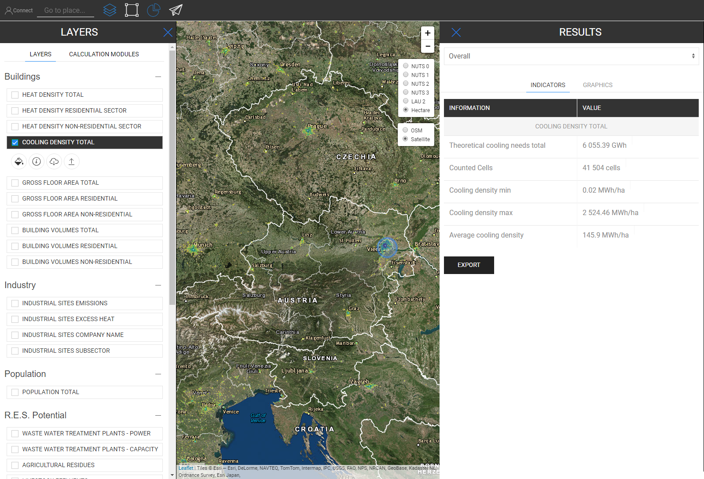
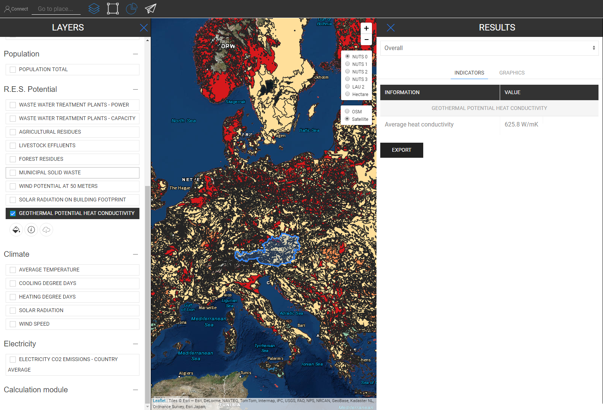

<h1><a class="anchor" id="retrieve-indicators-of-a-selected-area" href="#retrieve-indicators-of-a-selected-area"><i class="fa fa-link"></i></a>Too valitud ala indikaatorid</h1><h2><a class="anchor" id="table-of-contents" href="#table-of-contents"><i class="fa fa-link"></i></a> Sisukord</h2><ul><li> <a href="#introduction">Sissejuhatus</a></li><li> <a href="#indicators-for-raster-layers">Rasterkihtide näitajad</a><ul><li> <a href="#indicators-for-raster-layers_buildings">Ehitised</a></li><li> <a href="#indicators-for-raster-layers_population">Rahvaarv</a></li><li> <a href="#indicators-for-raster-layers_renewable-energy-source-potentials">Taastuvate energiaallikate potentsiaal</a></li></ul></li><li> <a href="#indicators-for-vector-layers">Vektorkihtide näitajad</a><ul><li> <a href="#indicators-for-vector-layers_industry">Tööstus</a></li><li> <a href="#indicators-for-vector-layers_renewable-energy-source-potentials">Taastuvate energiaallikate potentsiaal</a></li><li> <a href="#indicators-for-vector-layers_electricity">Elekter</a></li></ul></li><li> <a href="#example">Näide</a></li><li> <a href="#how-to-cite">Kuidas tsiteerida</a></li><li> <a href="#authors-and-reviewers">Autorid ja retsensendid</a></li><li> <a href="#license">Litsents</a></li><li> <a href="#acknowledgement">Tunnustus</a></li></ul><h2><a class="anchor" id="introduction" href="#introduction"><i class="fa fa-link"></i></a> Sissejuhatus</h2>
 Sõltuvalt valitud kihtidest ja piirkonnast kuvatakse teie konfiguratsiooni jaoks indikaatorid ekraani paremal külgribal

 <a href="#table-of-contents"><strong><code>To Top</code></strong></a>

 Järgnevalt vaatleme indikaatoreid, mis kuvatakse raster- ja vektorikihtide jaoks.
<h2><a class="anchor" id="indicators-for-raster-layers" href="#indicators-for-raster-layers"><i class="fa fa-link"></i></a> Rasterkihtide näitajad</h2>
 Rasterkihtide näitajad erinevad vektorikihtidest. Erinevatega mõtleme summeerimise ja jaotamise mõttes. See erinev käitumine tuleneb territoriaalsetest resolutsioonidest.

 Rasterkihtidel on üldiselt palju suurem eraldusvõime, samas kui vektorikihtidel on atribuudid ainult punktides või hulknurkades.

 See tähendab ühelt poolt näiteks seda, et kui valite NUTS3 polügoonidega määratletud vektorikihi ja soovite näiteks valida LAU piirkonna, siis NUTS3 väärtust ei lahutata LAU tasemele, selle asemel kuvatakse NUTS3 indikaator, kus see LAU piirkond asub, kuvatakse tulemuste külgribal.

 Teiselt poolt liidetakse rasterkihid kokku ja jaotatakse &quot;meelevaldselt&quot; *

 * valitud piirkonnas sisalduvate lahtritega (loomulikult rasterresolutsiooni enda piires)

 <a href="#table-of-contents"><strong><code>To Top</code></strong></a>
<h3><a class="anchor" id="buildings" href="#buildings"><i class="fa fa-link"></i></a> Ehitised</h3>
 <strong>Kuumustiheduse kaart</strong>

 <strong>Lisafunktsioon</strong>

 Kui valite samaaegselt soojustiheduse kihi ja asustuskihi, kuvatakse täiendav indikaator (vt allolevat pilti)

 <a href="#table-of-contents"><strong><code>To Top</code></strong></a>
<h3><a class="anchor" id="in-general-" href="#in-general-"><i class="fa fa-link"></i></a> Üldiselt:</h3>
 Kui korraga valitakse üks hoonekihtidest ja asustuskiht, kuvatakse eelnevalt kirjeldatud viisil täiendav näitaja

<ins> <code><strong><a href="#indicators-for-raster-layers">To Chapter</a></strong></code></ins>

 <strong>Jahutava tiheduse kaart</strong>

<ins> <code><strong><a href="#indicators-for-raster-layers">To Chapter</a></strong></code></ins>

 <strong>Ehitusmahud</strong>

<ins> <code><strong><a href="#indicators-for-raster-layers">To Chapter</a></strong></code></ins>

 <strong>Brutopind</strong>

<ins> <code><strong><a href="#indicators-for-raster-layers">To Chapter</a></strong></code></ins> <a href="#table-of-contents"><strong><code>To Top</code></strong></a>
<h3><a class="anchor" id="population" href="#population"><i class="fa fa-link"></i></a> Rahvaarv</h3>

<ins> <code><strong><a href="#indicators-for-raster-layers">To Chapter</a></strong></code></ins> <a href="#table-of-contents"><strong><code>To Top</code></strong></a>
<h3><a class="anchor" id="climate" href="#climate"><i class="fa fa-link"></i></a> Kliima</h3>
 <strong>Temperatuur</strong>

<ins> <code><strong><a href="#indicators-for-raster-layers">To Chapter</a></strong></code></ins>

 <strong>Jahutuskraadipäevad</strong>

<ins> <code><strong><a href="#indicators-for-raster-layers">To Chapter</a></strong></code></ins>

 <strong>Küttekraadipäevad</strong>

<ins> <code><strong><a href="#indicators-for-raster-layers">To Chapter</a></strong></code></ins>

 <strong>Päikesekiirgus</strong>

<ins> <code><strong><a href="#indicators-for-raster-layers">To Chapter</a></strong></code></ins>

 <strong>Tuule kiirus</strong>

<ins> <code><strong><a href="#indicators-for-raster-layers">To Chapter</a></strong></code></ins> <a href="#table-of-contents"><strong><code>To Top</code></strong></a>
<h3><a class="anchor" id="renewable-energy-source-potentials" href="#renewable-energy-source-potentials"><i class="fa fa-link"></i></a> Taastuvate energiaallikate potentsiaal</h3>
 <strong>Päikese kiirgus hoone jalajäljel</strong>

<ins> <code><strong><a href="#indicators-for-raster-layers">To Chapter</a></strong></code></ins>

 <strong>Tuule potentsiaal 50 m juures</strong>

<ins> <code><strong><a href="#indicators-for-raster-layers">To Chapter</a></strong></code></ins>

 <strong>Metsajäägid</strong>

<ins> <code><strong><a href="#indicators-for-raster-layers">To Chapter</a></strong></code></ins> <a href="#table-of-contents"><strong><code>To Top</code></strong></a>
<h2><a class="anchor" id="indicators-for-vector-layers" href="#indicators-for-vector-layers"><i class="fa fa-link"></i></a> Vektorkihtide näitajad</h2><h3><a class="anchor" id="industry" href="#industry"><i class="fa fa-link"></i></a> Tööstus</h3>
 <strong>Tööstusobjektide heitkogused</strong>

<ins> <code><strong><a href="#indicators-for-vector-layers">To Chapter</a></strong></code></ins>

 <strong>Tööstuspiirkonna liigne kuumus</strong>

<ins> <code><strong><a href="#indicators-for-vector-layers">To Chapter</a></strong></code></ins>

 <strong>Tööstusettevõtte ettevõtte nimi</strong>

<ins> <code><strong><a href="#indicators-for-vector-layers">To Chapter</a></strong></code></ins>

 <strong>Tööstusobjektide allsektor</strong>

<ins> <code><strong><a href="#indicators-for-vector-layers">To Chapter</a></strong></code></ins> <a href="#table-of-contents"><strong><code>To Top</code></strong></a>
<h3><a class="anchor" id="renewable-energy-source-potentials" href="#renewable-energy-source-potentials"><i class="fa fa-link"></i></a> Taastuvate energiaallikate potentsiaal</h3>
 <strong>Reoveepuhastusjaamade võimsus</strong>

<ins> <code><strong><a href="#indicators-for-vector-layers">To Chapter</a></strong></code></ins>

 <strong>Reoveepuhastite võimsus</strong>

<ins> <code><strong><a href="#indicators-for-vector-layers">To Chapter</a></strong></code></ins>

 <strong>Põllumajanduslikud jäägid</strong>

<ins> <code><strong><a href="#indicators-for-vector-layers">To Chapter</a></strong></code></ins>

 <strong>Loomade heitveed</strong>

<ins> <code><strong><a href="#indicators-for-vector-layers">To Chapter</a></strong></code></ins>

 <strong>Tahked olmejäätmed</strong>

<ins> <code><strong><a href="#indicators-for-vector-layers">To Chapter</a></strong></code></ins>

 <strong>Geotermiline potentsiaalne soojusjuhtivus</strong>

<ins> <code><strong><a href="#indicators-for-vector-layers">To Chapter</a></strong></code></ins> <a href="#table-of-contents"><strong><code>To Top</code></strong></a>
<h3><a class="anchor" id="electricity" href="#electricity"><i class="fa fa-link"></i></a> Elekter</h3>
 <strong>Elektri C02 heide</strong>

<ins> <code><strong><a href="#indicators-for-vector-layers">To Chapter</a></strong></code></ins> <a href="#table-of-contents"><strong><code>To Top</code></strong></a>
<h2><a class="anchor" id="example" href="#example"><i class="fa fa-link"></i></a> Näide</h2>
 Alloleval pildil näete, kuidas see kõigi kihtide visualiseerimisel välja näeb (siin on Austria valitud NUTS0-ga)

 Kuigi see kaart võib esmapilgul veidi segane tunduda, on selle näitajad illustreeritud otse. Kui valite Austria jaoks kõik kihid, vaadake allpool kõiki näitajaid, mida kirjeldatakse tulemuste külgribal (NUTS0)

 <a href="#table-of-contents"><strong><code>To Top</code></strong></a>
<h2><a class="anchor" id="how-to-cite" href="#how-to-cite"><i class="fa fa-link"></i></a> Kuidas tsiteerida</h2>
 Jeton Hasani, Hotmaps-Wikis, valitud ala näitajate hankimine (aprill 2019)

 <a href="#table-of-contents"><strong><code>To Top</code></strong></a>
<h2><a class="anchor" id="authors-and-reviewers" href="#authors-and-reviewers"><i class="fa fa-link"></i></a> Autorid ja retsensendid</h2>
 Selle lehe kirjutas Jeton Hasani <strong><a href="https://eeg.tuwien.ac.at/">EEG - TU Wien</a></strong> .

 ☑ Selle lehe vaatas läbi Mostafa Fallahnejad <strong><a href="https://eeg.tuwien.ac.at/">EEG - TU Wien</a></strong> .

 <a href="#table-of-contents"><strong><code>To Top</code></strong></a>
<h2><a class="anchor" id="license" href="#license"><i class="fa fa-link"></i></a> Litsents</h2>
 Autoriõigus © 2016-2020: Jeton Hasani

 Creative Commons Attribution 4.0 rahvusvaheline litsents

 See töö on litsentsitud rahvusvahelise Creative Commons CC BY 4.0 litsentsi alusel.

 SPDX-litsentsi identifikaator: CC-BY-4.0

 Litsentsi tekst: https://spdx.org/licenses/CC-BY-4.0.html

 <a href="#table-of-contents"><strong><code>To Top</code></strong></a>
<h2><a class="anchor" id="acknowledgement" href="#acknowledgement"><i class="fa fa-link"></i></a> Tunnustus</h2>
 Soovime avaldada sügavat tunnustust <a href="https://www.hotmaps-project.eu">projektile</a> Horisont 2020 <a href="https://www.hotmaps-project.eu">Hotmaps</a> (toetuslepingu number 723677), mis andis rahalisi vahendeid käesoleva uurimise läbiviimiseks.

 <a href="#table-of-contents"><strong><code>To Top</code></strong></a> <code><a href="Indicator-Section/_edit">Review this page</a></code>

<!--- THIS IS A SUPER UNIQUE IDENTIFIER -->

This page was automatically translated. View in another language:

[English](../en/Retrieve-indicators-of-a-selected-area) (original) [Bulgarian](../bg/Retrieve-indicators-of-a-selected-area)\* [Czech](../cs/Retrieve-indicators-of-a-selected-area)\* [Danish](../da/Retrieve-indicators-of-a-selected-area)\* [German](../de/Retrieve-indicators-of-a-selected-area)\* [Greek](../el/Retrieve-indicators-of-a-selected-area)\* [Spanish](../es/Retrieve-indicators-of-a-selected-area)\*  [Finnish](../fi/Retrieve-indicators-of-a-selected-area)\* [French](../fr/Retrieve-indicators-of-a-selected-area)\* [Irish](../ga/Retrieve-indicators-of-a-selected-area)\* [Croatian](../hr/Retrieve-indicators-of-a-selected-area)\* [Hungarian](../hu/Retrieve-indicators-of-a-selected-area)\* [Italian](../it/Retrieve-indicators-of-a-selected-area)\* [Lithuanian](../lt/Retrieve-indicators-of-a-selected-area)\* [Latvian](../lv/Retrieve-indicators-of-a-selected-area)\* [Maltese](../mt/Retrieve-indicators-of-a-selected-area)\* [Dutch](../nl/Retrieve-indicators-of-a-selected-area)\* [Polish](../pl/Retrieve-indicators-of-a-selected-area)\* [Portuguese (Portugal, Brazil)](../pt/Retrieve-indicators-of-a-selected-area)\* [Romanian](../ro/Retrieve-indicators-of-a-selected-area)\* [Slovak](../sk/Retrieve-indicators-of-a-selected-area)\* [Slovenian](../sl/Retrieve-indicators-of-a-selected-area)\* [Swedish](../sv/Retrieve-indicators-of-a-selected-area)\* 

\* machine translated
