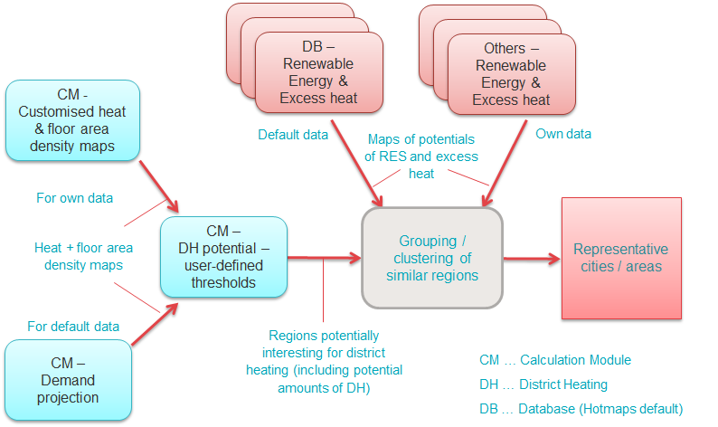

<h1><a class="anchor" id="national-level---step-1--identification-of-different-representative-cases-for-district-heating" href="#national-level---step-1--identification-of-different-representative-cases-for-district-heating"><i class="fa fa-link"></i></a>Riiklik tasand - 1. samm: kaugkütte erinevate juhtumite tuvastamine</h1>
 <a href="guide-national-level-comprehensive-assessment-eed#part-iii-analysis-of-the-economic-potential-for-efficiency-in-heating-and-cooling_different-steps"><strong><code>Scenario Toolchain Steps</code></strong></a> <a href="step-2-Costs-and-potentials-for-district-heating-in-representative-regions-or-cities"><strong><code>Next step</code></strong></a> 
<h2><a class="anchor" id="table-of-contents" href="#table-of-contents"><i class="fa fa-link"></i></a> Sisukord</h2><ul><li> <a href="#introduction">Sissejuhatus</a></li><li> <a href="#identification-of-different-representative-cases-for-district-heating">Kaugkütte erinevate juhtumite tuvastamine</a><ul><li> <a href="#identification-of-different-representative-cases-for-district-heating_calculation-of-future-heat-demand-and-building-floor-area-density-maps">Tulevase soojavajaduse arvutamine ja hoone kogupindala tiheduse kaardid</a></li><li> <a href="#identification-of-different-representative-cases-for-district-heating_identification-of-regions-potentially-interesting-for-district-heating">Kaugkütte jaoks potentsiaalselt huvipakkuvate piirkondade kindlakstegemine</a></li><li> <a href="#identification-of-different-representative-cases-for-district-heating_analysis-of-potentials-for-excess-heat-and-renewable-energy-in-the-identified-regions-with-potential-interest-for-district-heating">Liigse soojuse ja taastuvenergia potentsiaali analüüs määratletud piirkondades, kus potentsiaalne huvi on kaugkütte vastu</a></li><li> <a href="#identification-of-different-representative-cases-for-district-heating_identification-of-representative-typical-district-heating-areas-for-further-analysis">Edasiseks analüüsiks tüüpiliste tüüpiliste kaugküttepiirkondade kindlakstegemine</a></li></ul></li><li> <a href="#how-to-cite">Kuidas tsiteerida</a></li><li> <a href="#authors-and-reviewers">Autorid ja retsensendid</a></li><li> <a href="#license">Litsents</a></li><li> <a href="#acknowledgement">Tunnustus</a></li></ul><h2><a class="anchor" id="introduction" href="#introduction"><i class="fa fa-link"></i></a> Sissejuhatus</h2>
 See on riikliku tasandi analüüsi esimene samm.

<ins> <code><strong><a href="#table-of-contents">To Top</a></strong></code></ins>
<h2><a class="anchor" id="identification-of-different-representative-cases-for-district-heating" href="#identification-of-different-representative-cases-for-district-heating"><i class="fa fa-link"></i></a> Kaugkütte erinevate juhtumite tuvastamine</h2>
 Erinevate tüüpiliste juhtumite tuvastamiseks kaugkütte kulude ja potentsiaali edasiseks analüüsimiseks huvipakkuvas riigis / piirkonnas pakub Hotmaps erinevaid vaikeandmekihte Hotmapsi andmebaasis ning ka erinevaid arvutusmooduleid (CM). Samuti saab enda andmeid üles laadida ja kasutada. See identifitseerimisprotseduur võib koosneda järgmistest etappidest:
<ul><li> Arvutage välja tulevase soojavajaduse stsenaariumid ja ehitage kogu huvipakkuva riigi / piirkonna brutopinna tiheduse kaardid</li><li> Määrake kaugkütte jaoks potentsiaalselt huvitavad piirkonnad kasutaja määratud piirväärtuste põhjal</li><li> Analüüsige / koguge liigse soojuse ja taastuvenergia potentsiaali määratletud riigis / piirkonnas, mis võib olla huvitav kaugkütte jaoks</li><li> Grupeerige / klastrige sarnased piirkonnad ja valige edasiseks analüüsiks esinduslikud linnad / piirkonnad</li></ul>
 Järgmine joonis näitab seda protseduuri graafiliselt ning näitab erinevaid andmeallikaid ja arvutusmooduleid, mida saab kasutada.
 * Joonis: Kaugkütte erinevate tüüpiliste juhtumite tuvastamine (1. etapp) *
 Järgmistes alapeatükkides kirjeldatakse selle protseduuri erinevaid etappe üksikasjalikumalt.

<ins> <code><strong><a href="#table-of-contents">To Top</a></strong></code></ins>
<h3><a class="anchor" id="calculation-of-future-heat-demand-and-building-gross-floor-area-density-maps" href="#calculation-of-future-heat-demand-and-building-gross-floor-area-density-maps"><i class="fa fa-link"></i></a> Tulevase soojavajaduse arvutamine ja hoone kogupindala tiheduse kaardid</h3>
 Analüüsi esimene samm on tulevase soojusvajaduse ja põrandapinna tiheduse kaartide loomine teie huvipakkuvale piirkonnale / riigile. Võite kasutada Hotmapsi projekti käigus välja töötatud andmeid kõigi EL-28 riikide jaoks (Hotmapsi vaikeandmed, mis on saadaval Hotmapsi andmebaasis) või kasutada muid huvipakkuva piirkonna / riigi nõudmisi soojuse järele.
<ul><li> <strong>Kasutage Hotmapsi projekti käigus välja töötatud soojusvajaduse ja kogupõranda tiheduse kaarte</strong> - vaikeandmed soojavajaduse tiheduse kohta Hotmapsi andmebaasist:<ul><li> Kõigi EL 28 liikmesriikide jaoks on välja töötatud soojuse nõudluse tiheduse kaardid, mis kajastavad hoonete ruumide kütmise ja sooja vee tootmise vajadust. Need on saadaval kogunõudlusena elamutes ja mitteeluhoonetes, kuid jagunevad ka elamute ja mitteeluhoonete vahel. Kõik kaardid on saadaval hektari tasemel, st eraldusvõimega 100x100m. Soojusvajaduse tiheduse kaartidele pääseb juurde Hotmapsi andmebaasi kihtide jaotisest ja lisateavet huvipakkuva riigi / piirkonna valimise kohta leiate siit.</li><li> Soojuse nõudluse tiheduse kaarte on võimalik kohandada vastavalt eeldustele hoonete soojusvajaduse edasise arengu kohta. Kasutada saab kahte erinevat arvutusmoodulit (CM):<ul><li> <a href="https://wiki.hotmaps.hevs.ch/en/CM-Scale-heat-and-cool-density-maps">CM - skaala soojus- ja külmatiheduse kaarte</a> saab kasutada iga hektari küttevajaduse ümberarvutamiseks, kasutades sama tegurit kõigi hektarielementide jaoks.</li><li> <a href="https://wiki.hotmaps.hevs.ch/en/CM-Demand-projection">CM - nõudluse prognoosi</a> saab kasutada tulevase küttevajaduse ja brutopindala tiheduse kaartide loomiseks, tuginedes EL hoonestuse vaikearengu stsenaariumidele (link lisateabele vaikestsenaariumite kohta. Võimalik on kohandada ka mitmeid parameetreid vaikearvutustele, nagu näiteks energiavajaduse vähenemine või üldpinna vähenemine.</li></ul></li></ul></li><li> <strong>Kasutage enda andmeid küttevajaduse tiheduse kohta oma riigis / analüüsipiirkonnas</strong> :<ul><li> Kasutajakonto loomisel ja privaatsesse jaotisse sisselogimisel on võimalik soojustiheduse kaarte üles laadida rasterfaili vormingus (.tif) Hotmapsi tööriistakasti. Üleslaaditud soojusnõudluse tiheduse kihid võivad kajastada soojusvajaduse tiheduse hetkeolukorda huvipakkuvas riigis / piirkonnas või ka võimalikku soojusvajaduse tiheduse tulevikustsenaariumi, sõltuvalt vastavate kihtide loomiseks kasutatud sisendandmetest. Lisateavet kasutajakonto loomise ja enda andmete üleslaadimise kohta leiate siit.</li><li> Oma soojustiheduse kaarte on võimalik veelgi kohandada <a href="https://wiki.hotmaps.hevs.ch/en/CM-Scale-heat-and-cool-density-maps">CM - skaala soojus - ja külmtiheduskaartide abil</a> või <a href="https://wiki.hotmaps.hevs.ch/en/CM-Demand-projection">CM - Demand projektsiooni kaudu</a> nagu vaikekihi jaoks.</li></ul></li></ul>
 Väljatöötatud soojusvajaduse ja kogupindala tiheduse kaarte kasutatakse järgnevates etappides teistes arvutusmoodulites (CM).

<ins> <code><strong><a href="#table-of-contents">To Top</a></strong></code></ins>
<h3><a class="anchor" id="identification-of-regions-potentially-interesting-for-district-heating" href="#identification-of-regions-potentially-interesting-for-district-heating"><i class="fa fa-link"></i></a> Kaugkütte jaoks potentsiaalselt huvipakkuvate piirkondade kindlakstegemine</h3>
 Pärast võimalike tulevikuliste stsenaariumide väljatöötamist soojusvajaduse ja põranda kogupindala tiheduse kaartide kohta huvipakkuva linna / piirkonna jaoks on võimalik tuvastada potentsiaalsed kaugküttelinnad / -piirkonnad. Seda saab teha <a href="https://wiki.hotmaps.hevs.ch/en/CM-District-heating-potential-areas-user-defined-thresholds">CM-ga - kaugkütte potentsiaalsed piirkonnad: kasutaja määratletud künnised</a> vastavalt järgmistele sammudele:
<ul><li> CM-i on võimalik kasutada tasemel NUTS3 - NUTS0 ja ka hektari tasemel (= ala enda valitud). Suuremate alade arvutamine võib aga võtta kaua aega või moodul võib leida liiga palju teostatavaid alasid ega pruugi tulemusi kuvada. Sellisel juhul saab huvipakkuva valdkonna jagada, näiteks erinevates NUTS3 või Hektari piirkondades, ja kõigi nende jaoks saab CM-i käivitada.</li><li> CM määrab potentsiaalsed kaugküttepiirkonnad kahe järgmise künnise alusel: soojusvajaduse künnis soojusvajaduse tiheduse kaardi igas lahtris ja soojusvajaduse lävi ühendatud rakkude rühmade jaoks, mille soojusvajadus ületab eelmise künnise ( = sidus ala). Need kaks läviväärtust peab kasutaja määratlema.</li><li> Lisaks mitmele muule indikaatorile genereerib moodul kujundfaili potentsiaalsetest kaugküttepiirkondadest, mis kuvatakse ja salvestatakse tööriistakasti kihtide jaotises. Eriti huvitavad on järgmised näitajad: soojusenergia üldine nõudlus ühtses piirkonnas, keskmine soojusvajaduse tihedus piirkonnas.</li><li> Pärast CM-i kasutamist kogu huvipakkuvas piirkonnas / riigis saab ühtsetest kaartidest luua potentsiaalsete kaugküttepiirkondade üldkaardi.</li></ul>
<ins> <code><strong><a href="#table-of-contents">To Top</a></strong></code></ins>
<h3><a class="anchor" id="analysis-of-potentials-for-excess-heat-and-renewable-energy-in-the-identified-regions-with-potential-interest-for-district-heating" href="#analysis-of-potentials-for-excess-heat-and-renewable-energy-in-the-identified-regions-with-potential-interest-for-district-heating"><i class="fa fa-link"></i></a> Liigse soojuse ja taastuvenergia potentsiaali analüüs määratletud piirkondades, kus potentsiaalne huvi on kaugkütte vastu</h3>
 Selles etapis saab analüüsida liigse soojuse ja taastuvenergia potentsiaali piirkondades, mis on kaugkütte jaoks potentsiaalselt huvitavad. Neid andmeid koos eelmises etapis kogutud andmetega soojusvajaduse ja soojusvajaduse tiheduse kohta piirkondades saab seejärel kasutada edasiste analüüsietappide jaoks tüüpiliste kaugküttepiirkondade iseloomustamiseks. Järgmine loetelu annab ülevaate soojusallikatest, mida tuleks arvestada, ja lingid vastavate energiaallikate vaikeandmetega, mis on saadaval Hotmapsi andmebaasis:
<ul><li> Taastuvad energiaallikad:<ul><li> <a href="https://gitlab.com/hotmaps/potential/WWTP">Reoveepuhastid:</a><ul><li> DB - reoveepuhastite võimsus</li><li> DB - reoveepuhastite võimsus</li></ul></li><li> <a href="https://gitlab.com/hotmaps/potential/potential_biomass">Põllumajanduslik biomass:</a><ul><li> DB - põllumajandusjäägid</li><li> DB - kariloomade heitveed</li></ul></li><li> Metsane biomass:<ul><li> <a href="https://gitlab.com/hotmaps/potential/potential_forest">DB - metsajäägid</a></li></ul></li><li> Jäätmed:<ul><li> <a href="https://gitlab.com/hotmaps/potential/potential_municipal_solid_waste">DB - tahked olmejäätmed</a></li></ul></li><li> Geotermiline energia:<ul><li> <a href="https://gitlab.com/hotmaps/potential/potential_geothermal_raster">DB - geotermiline potentsiaal soojusjuhtivus</a></li></ul></li><li> Päikese soojusenergia:<ul><li> <a href="https://gitlab.com/hotmaps/potential/potential_solarthermal_collectors_rooftop">DB - potentsiaalsed päikesekollektorid - katusel</a></li><li> <a href="https://gitlab.com/hotmaps/potential/potential_solarthermal_collectors_open_field">DB - potentsiaalsed päikesekollektorid avamaal</a></li></ul></li></ul></li><li> Liigne kuumus:<ul><li> Suured tööstusobjektid:<ul><li> <a href="https://gitlab.com/hotmaps/industrial_sites/industrial_sites_industryBenchmarks">DB - tööstusobjektide liigne soojus</a></li></ul></li><li> Muud liigsed soojusallikad:<ul><li> Teavet muude liigsete soojusallikate, näiteks elektrijaamade, muude tööstusjaamade, madalatemperatuuriliste soojusallikate, näiteks jõevee, andmekeskuste jms kohta saab tööriistakasti üles laadida. Juhendi selle kohta leiate <a href="https://wiki.hotmaps.hevs.ch/en/CM-Add-industry-plant">siit</a> .</li></ul></li></ul></li></ul>
<ins> <code><strong><a href="#table-of-contents">To Top</a></strong></code></ins>
<h3><a class="anchor" id="identification-of-representative,-typical-district-heating-areas-for-further-analysis" href="#identification-of-representative,-typical-district-heating-areas-for-further-analysis"><i class="fa fa-link"></i></a> Edasiseks analüüsimiseks tüüpiliste kaugküttepiirkondade kindlakstegemine</h3>
 Kahes eelmises etapis kogutud andmeid saab kasutada huvipakkuvas piirkonnas / riigis erinevat tüüpi tüüpiliste tüüpiliste kaugküttepiirkondade määratlemiseks. Piirkonnad / linnad, mille mõõtmed ja kogu soojusvajaduse, keskmise soojusvajaduse tiheduse ning taastuvenergia ja liigse soojuse potentsiaalide kombinatsioonid on sarnased, võib rühmitada.

 Võimalikud näitajad tüüpiliste kaugküttepiirkondade rühmitamiseks:
<ul><li> piirkonna üldine soojavajadus [GWh / aasta]</li><li> keskmine soojusvajaduse tihedus piirkonnas [MWh / (ha * aastas)]</li><li> Taastuvate energiaallikate olemasolev potentsiaal:<ul><li> reoveepuhastite võimsus</li><li> põllumajandusjäägid</li><li> loomade heitveed</li><li> metsajäägid</li><li> tahked olmejäätmed</li><li> geotermiline potentsiaal soojusjuhtivus</li><li> potentsiaalsed päikesekollektorid - katusel</li><li> potentsiaalsed päikesekollektorid avamaal</li></ul></li><li> liigsed soojuspotentsiaalid:<ul><li> suured tööstusobjektid</li><li> muud</li></ul></li></ul>
 Igale väljatöötatud tüüpiliste DH-alade rühmale saab valida ühe või mitu tüüpilist linna / piirkonda ja neid edasi analüüsida. Neid saab kasutada juhtumianalüüsidena.

<ins> <code><strong><a href="#table-of-contents">To Top</a></strong></code></ins>
<h2><a class="anchor" id="how-to-cite" href="#how-to-cite"><i class="fa fa-link"></i></a> Kuidas tsiteerida</h2>
 Marcus Hummel, Giulia Conforto, Hotmaps-Wiki, Suunised Hotmapsi tööriistakasti kasutamiseks riiklikul tasandil analüüsimiseks (august 2020)

<ins> <code><strong><a href="#table-of-contents">To Top</a></strong></code></ins>
<h2><a class="anchor" id="authors-and-reviewers" href="#authors-and-reviewers"><i class="fa fa-link"></i></a> Autorid ja retsensendid</h2>
 Selle lehe kirjutasid Marcus Hummel ja Giulia Conforto <strong><a href="https://e-think.ac.at">e-think</a></strong> .

 ☑ Selle lehe vaatas läbi Mostafa Fallahnejad <strong><a href="https://eeg.tuwien.ac.at/">EEG - TU Wien</a></strong> .

 <a href="#table-of-contents"><strong><code>To Top</code></strong></a>
<h2><a class="anchor" id="license" href="#license"><i class="fa fa-link"></i></a> Litsents</h2>
 Autoriõigus © 2016-2020: Marcus Hummel, Giulia Conforto

 Creative Commons Attribution 4.0 rahvusvaheline litsents

 See töö on litsentsitud rahvusvahelise Creative Commons CC BY 4.0 litsentsi alusel.

 SPDX-litsentsi identifikaator: CC-BY-4.0

 Litsentsi tekst: https://spdx.org/licenses/CC-BY-4.0.html

<ins> <code><strong><a href="#table-of-contents">To Top</a></strong></code></ins>
<h2><a class="anchor" id="acknowledgement" href="#acknowledgement"><i class="fa fa-link"></i></a> Tunnustus</h2>
 Soovime avaldada sügavat tunnustust <a href="https://www.hotmaps-project.eu">projektile</a> Horisont 2020 <a href="https://www.hotmaps-project.eu">Hotmaps</a> (toetuslepingu number 723677), mis andis rahalisi vahendeid käesoleva uurimise läbiviimiseks.

<ins> <code><strong><a href="#table-of-contents">To Top</a></strong></code></ins>

<!--- THIS IS A SUPER UNIQUE IDENTIFIER -->

This page was automatically translated. View in another language:

[English](../en/Step-1-Identification-of-different-representative-cases-for-district-heating) (original) [Bulgarian](../bg/Step-1-Identification-of-different-representative-cases-for-district-heating)\* [Czech](../cs/Step-1-Identification-of-different-representative-cases-for-district-heating)\* [Danish](../da/Step-1-Identification-of-different-representative-cases-for-district-heating)\* [German](../de/Step-1-Identification-of-different-representative-cases-for-district-heating)\* [Greek](../el/Step-1-Identification-of-different-representative-cases-for-district-heating)\* [Spanish](../es/Step-1-Identification-of-different-representative-cases-for-district-heating)\*  [Finnish](../fi/Step-1-Identification-of-different-representative-cases-for-district-heating)\* [French](../fr/Step-1-Identification-of-different-representative-cases-for-district-heating)\* [Irish](../ga/Step-1-Identification-of-different-representative-cases-for-district-heating)\* [Croatian](../hr/Step-1-Identification-of-different-representative-cases-for-district-heating)\* [Hungarian](../hu/Step-1-Identification-of-different-representative-cases-for-district-heating)\* [Italian](../it/Step-1-Identification-of-different-representative-cases-for-district-heating)\* [Lithuanian](../lt/Step-1-Identification-of-different-representative-cases-for-district-heating)\* [Latvian](../lv/Step-1-Identification-of-different-representative-cases-for-district-heating)\* [Maltese](../mt/Step-1-Identification-of-different-representative-cases-for-district-heating)\* [Dutch](../nl/Step-1-Identification-of-different-representative-cases-for-district-heating)\* [Polish](../pl/Step-1-Identification-of-different-representative-cases-for-district-heating)\* [Portuguese (Portugal, Brazil)](../pt/Step-1-Identification-of-different-representative-cases-for-district-heating)\* [Romanian](../ro/Step-1-Identification-of-different-representative-cases-for-district-heating)\* [Slovak](../sk/Step-1-Identification-of-different-representative-cases-for-district-heating)\* [Slovenian](../sl/Step-1-Identification-of-different-representative-cases-for-district-heating)\* [Swedish](../sv/Step-1-Identification-of-different-representative-cases-for-district-heating)\* 

\* machine translated
