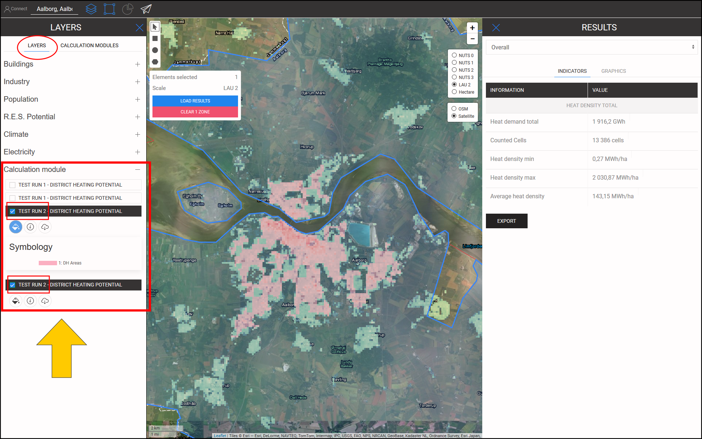

<h1><a class="anchor" id="cm-district-heating-potential-areas-user-defined-thresholds" href="#cm-district-heating-potential-areas-user-defined-thresholds"><i class="fa fa-link"></i></a>CM Zones de potentiel de chauffage urbain Seuils définis par l&#39;utilisateur</h1><h2><a class="anchor" id="table-of-contents" href="#table-of-contents"><i class="fa fa-link"></i></a> Table des matières</h2><ul><li> <a href="#in-a-glance">En un coup d&#39;oeil</a></li><li> <a href="#introduction">introduction</a></li><li> <a href="#inputs-and-outputs">Entrées et sorties</a></li><li> <a href="#method">Méthode</a></li><li> <a href="#github-repository-of-this-calculation-module">Dépôt GitHub de ce module de calcul</a></li><li> <a href="#sample-run">Exemple d&#39;exécution</a><ul><li> <a href="#sample-run_test-run-1-default-input-values">Test Run 1: valeurs d&#39;entrée par défaut</a></li><li> <a href="#sample-run_test-run-2-modified-input-values">Test Run 2: valeurs d&#39;entrée modifiées</a></li></ul></li><li> <a href="#how-to-cite">Comment citer</a></li><li> <a href="#authors-and-reviewers">Auteurs et relecteurs</a></li><li> <a href="#license">Licence</a></li><li> <a href="#acknowledgement">Reconnaissance</a></li></ul><h2><a class="anchor" id="in-a-glance" href="#in-a-glance"><i class="fa fa-link"></i></a> En un coup d&#39;oeil</h2>
 Ce module de calcul calcule le potentiel de chauffage urbain dans la région sélectionnée à l&#39;aide de 2 valeurs de seuil: 1) Demande de chaleur minimale par hectare, 2) Demande de chaleur minimale dans une zone DH. Les zones de la région sélectionnée qui remplissent ces conditions sont renvoyées en tant que zones DH. De plus, les demandes de chaleur dans ces régions sont restituées sous forme d&#39;indicateurs sous forme de potentiel DH.

 <a href="#table-of-contents"><strong><code>To Top</code></strong></a>
<h2><a class="anchor" id="introduction" href="#introduction"><i class="fa fa-link"></i></a> introduction</h2>
 La demande de chaleur joue un rôle important dans la détermination des zones potentielles de chauffage urbain (DH). Par exemple, la mise en œuvre du chauffage urbain dans les zones à faible demande de chaleur n&#39;est pas économiquement viable. D&#39;un autre côté, la définition d&#39;une zone avec une densité de demande de chaleur élevée comme une zone DH potentielle peut également être inexacte. Une densité de demande de chaleur élevée dans une zone pourrait être due à la présence de quelques consommateurs ayant une demande de chaleur très élevée dans cette zone. Au contraire, une faible densité de demande de chaleur moyenne pourrait être le signe de zones avec une demande de chaleur très faible dans la zone sélectionnée. L&#39;objectif du module de calcul &quot;CM - ZONE POTENTIELLE DE CHAUFFAGE DE DISTRICT: SEUIL DEFINI PAR L&#39;UTILISATEUR&quot; est de fournir un équilibre raisonnable entre la densité de demande de chaleur dans une zone et ses zones constitutives.

 Le «CM - ZONE POTENTIELLE DE CHAUFFAGE DISTRICT: SEUIL DÉFINI PAR L&#39;UTILISATEUR» détermine les zones DH et leur potentiel DH correspondant en fonction des densités de demande de chaleur. Les densités de demande de chaleur sont obtenues à partir d&#39;une couche d&#39;entrée SIG. La boîte à outils et la base de données Hotmaps fournissent une <strong><a href="https://gitlab.com/hotmaps/heat/heat_tot_curr_density">carte de densité de chaleur par défaut</a></strong> qui peut être utilisée dans ce module de calcul. La carte de densité de chaleur Hotmaps est au format raster et a une résolution d&#39;un hectare et un système de référence de coordonnées (CRS) de &quot; <em><em>ETRS89 / LAEA Europe - EPSG 3035</em></em> &quot;. Les cellules de la carte montrent les densités de chaleur en <em><strong>MWh / ha</strong></em> . Outre cette carte par défaut, les cartes générées par l&#39;utilisateur peuvent également être téléchargées dans la boîte à outils et utilisées dans ce CM.

 Comme résultat, une couche SIG, trois indicateurs et deux diagrammes sont présentés. Ces sorties sont expliquées en détail dans la section <a href="#sample-run">Sample Run</a> . La couche de sortie montre les zones DH potentielles. En cliquant sur chaque zone de la carte, une fenêtre apparaît et le potentiel DH correspondant à cette zone est affiché. Dans les fenêtres INDICATEURS / GRAPHIQUES de la section RÉSULTATS de la boîte à outils, des indicateurs et des graphiques pertinents concernant le potentiel DH dans la zone sélectionnée et les potentiels dans les sous-zones sont illustrés.

 <a href="#table-of-contents"><strong><code>To Top</code></strong></a>
<h2><a class="anchor" id="inputs-and-outputs" href="#inputs-and-outputs"><i class="fa fa-link"></i></a> Entrées et sorties</h2>
 Les paramètres d&#39;entrée et les couches, ainsi que les couches et paramètres de sortie, sont les suivants.

 <strong>Les couches et paramètres d&#39;entrée sont:</strong>
<ul><li> Demande de chaleur minimale par hectare [ <em><strong>MWh / ha</strong></em> ]: une valeur comprise entre <em><em>0</em></em> et <em><em>1000</em></em></li><li> Demande de chaleur minimale dans une zone DH [ <em><strong>GWh / an</strong></em> ]: une valeur comprise entre <em><em>0</em></em> et <em><em>500</em></em></li><li> Carte de densité de chaleur: une carte par défaut est fournie dans la boîte à outils; Les propres cartes téléchargées peuvent également être utilisées dans le CM<ul><li> au format raster (* .tif)</li><li> avec une résolution de 1 hectare</li><li> densités de demande en <em><strong>MWh / ha</strong></em></li></ul></li></ul>
 <strong>Les couches et paramètres de sortie sont:</strong>
<ul><li> Zones DH aux formats raster et shapefile</li><li> Potentiel DH dans chaque zone DH [ <em><strong>GWh / an</strong></em> ] (cliquez sur la carte)</li><li> Demande totale de chaleur en GWh dans la zone sélectionnée</li><li> Potentiel total de chauffage urbain en GWh dans la zone sélectionnée</li><li> Part potentielle du chauffage urbain par rapport à la demande totale dans la zone sélectionnée</li></ul>
 <a href="#table-of-contents"><strong><code>To Top</code></strong></a>
<h2><a class="anchor" id="method" href="#method"><i class="fa fa-link"></i></a> Méthode</h2>
 Le potentiel de DH dans une région spécifique peut être défini par la demande globale de chaleur et son allocation spatiale. Dans la boîte à outils Hotmaps, la demande de chaleur est représentée sous la forme d&#39;une carte raster. Afin de définir correctement les zones DH potentielles, la demande de chaleur dans chaque cellule et également dans une zone doit atteindre un certain niveau. Comme point de départ, la boîte à outils Hotmaps suggère des valeurs par défaut pour ces deux paramètres. Cependant, en fonction de la répartition de la demande de chaleur et également des conditions locales, l&#39;utilisateur Hotmaps peut modifier ces valeurs.

 La détermination des zones DH se fait en deux étapes:

 Dans la première étape, toutes les cellules dont la demande de chaleur est inférieure au paramètre d&#39;entrée «Demande de chaleur minimale en hectare» sont filtrées. En éliminant ces cellules de la carte, nous obtenons des groupes de cellules qui sont attachées les unes aux autres. Chaque ensemble de ces cellules attachées constitue de petites zones que l&#39;on appelle ici «zones cohérentes». Dans les deuxièmes étapes, la demande de chaleur totale dans chaque zone cohérente est calculée. Pour chaque zone cohérente, si la demande de chaleur totale est supérieure au paramètre d&#39;entrée «Demande de chaleur minimale dans une zone DH», elle est considérée comme une zone DH potentielle.

 Enfin, pour les zones DH, le potentiel est calculé et présenté sous la forme d&#39;une couche SIG, visible dans la boîte à outils.

 <a href="#table-of-contents"><strong><code>To Top</code></strong></a>
<h2><a class="anchor" id="github-repository-of-this-calculation-module" href="#github-repository-of-this-calculation-module"><i class="fa fa-link"></i></a> Dépôt GitHub de ce module de calcul</h2>
 <a href="https://github.com/HotMaps/dh_potential/tree/develop">Ici,</a> vous obtenez le développement de pointe pour ce module de calcul.

 <a href="#table-of-contents"><strong><code>To Top</code></strong></a>
<h2><a class="anchor" id="sample-run" href="#sample-run"><i class="fa fa-link"></i></a> Exemple d&#39;exécution</h2>
 Ici, le module de calcul est exécuté pour l&#39;étude de cas d&#39;Aalborg au Danemark.
<ul><li> Tout d&#39;abord, utilisez la barre &quot;Aller à l&#39;endroit&quot; pour naviguer vers Aalborg et sélectionnez la ville.</li></ul><ul><li>
 Suivez les étapes indiquées dans la figure ci-dessous:
<ul><li> Cliquez sur le bouton &quot;Calques&quot; pour ouvrir la fenêtre &quot;Calques&quot;:</li><li> Cliquez sur l&#39;onglet &quot;MODULES DE CALCUL&quot;.</li><li> Cliquez sur le bouton &quot;ZONES POTENTIELLES DE CHAUFFAGE DU DISTRICT CM: SEUILS DEFINIS PAR L&#39;UTILISATEUR&quot;.</li></ul></li><li>
 Maintenant, le module de calcul &quot;ZONES POTENTIELLES CHAUFFAGE DU DISTRICT CM: SEUILS DEFINIS PAR L&#39;UTILISATEUR&quot; s&#39;ouvre et est prêt à fonctionner.
</li></ul>
 <a href="#table-of-contents"><strong><code>To Top</code></strong></a>
<h3><a class="anchor" id="test-run-1--default-input-values" href="#test-run-1--default-input-values"><i class="fa fa-link"></i></a> Test Run 1: valeurs d&#39;entrée par défaut</h3>
 Les valeurs d&#39;entrée par défaut indiquent les conditions générales dans lesquelles une zone peut être considérée comme une zone DH potentielle. Ces valeurs doivent être considérées comme un point de départ uniquement. Vous devrez peut-être définir des valeurs inférieures ou supérieures aux valeurs par défaut dans la boîte à outils en tenant compte des conditions locales supplémentaires. Par conséquent, l&#39;utilisateur doit adapter ces valeurs pour trouver la meilleure combinaison de seuils pour son étude de cas.

 Pour exécuter le module de calcul, suivez les étapes suivantes:
<ul><li> Attribuez un nom à la session d&#39;exécution (facultatif - ici, nous avons choisi &quot;Test Run 1&quot;) et définissez les paramètres d&#39;entrée (ici, les valeurs par défaut ont été utilisées).</li></ul><ul><li> Appuyez sur le bouton &quot;RUN CM&quot; en bas à gauche.</li><li> Attendez que le processus soit terminé.</li></ul>
 <strong><code>Note: If you wish to change your input parameters, you can press &quot;STOP CM&quot;, modify your input parameters and re-run the CM</code></strong>
<ul><li> En tant que résultat, des indicateurs et des diagrammes sont affichés dans la section &quot;RÉSULTATS&quot; sur le côté droit de la boîte à outils. Les indicateurs montrent:<ul><li> la demande totale de chaleur en <em><em>GWh</em></em> dans la zone sélectionnée,</li><li> potentiel DH total en <em><em>GWh</em></em> dans la zone sélectionnée,</li><li> la part du potentiel DH de la demande totale, qui est obtenue par division du potentiel DH par la demande totale de chaleur dans la région.</li></ul></li></ul>
 De plus, deux diagrammes sont également générés. Le premier montre le potentiel DH dans chaque zone DH. Les étiquettes correspondantes se trouvent également sur la carte. Le deuxième diagramme illustre le potentiel DH total en comparaison avec la demande totale de chaleur dans la zone sélectionnée.
<ul><li> Un nouveau calque est également ajouté au canevas montrant les zones DH. Cette couche est ajoutée à la liste des couches sous la catégorie &quot;Module de calcul&quot; tout en bas de la section des couches. Le nom de la session d&#39;exécution distingue les sorties de cette exécution des autres.</li></ul>
 En suivant ces étapes, vous aurez une impression des valeurs d&#39;entrée et des zones DH potentielles.

 <a href="#table-of-contents"><strong><code>To Top</code></strong></a>
<h3><a class="anchor" id="test-run-2--modified-input-values" href="#test-run-2--modified-input-values"><i class="fa fa-link"></i></a> Test Run 2: valeurs d&#39;entrée modifiées</h3>
 En fonction de votre expérience et de vos connaissances locales, vous pouvez augmenter ou diminuer les valeurs d&#39;entrée pour obtenir de meilleurs résultats. Dans le cas d&#39;Aalborg, par exemple, vous savez peut-être que la demande de chaleur dans les zones extérieures de la ville est relativement proche de la partie centrale de la ville et que le système DH est également réalisable dans ces zones. Par conséquent, vous pouvez décider de réduire la demande de chaleur minimale dans les cellules faisant partie d&#39;une zone DH; cependant, pour garantir une demande de chaleur suffisante, vous pouvez augmenter la demande de chaleur minimale dans une zone DH. Ici, vous réexécutez les modules de calcul avec de nouveaux paramètres d&#39;entrée.
<ul><li> Attribuez un nom à la session d&#39;exécution (facultatif - ici, nous avons choisi «Test Run 2») et définissez les paramètres d&#39;entrée ( <em><em>250 MWh / ha</em></em> pour la demande de chaleur minimale en hectare et <em><em>35 GWh / an</em></em> pour la demande minimale en zone DH) .</li></ul><ul><li> Appuyez sur le bouton &quot;RUN CM&quot; en bas à gauche.</li><li> Attendez que le processus soit terminé.</li><li> En tant que résultat, des indicateurs et des diagrammes sont affichés dans la section &quot;RÉSULTATS&quot; sur le côté droit de la boîte à outils. Les indicateurs montrent:<ul><li> la demande totale de chaleur en <em><em>GWh</em></em> dans la zone sélectionnée,</li><li> potentiel DH total en <em><em>GWh</em></em> dans la zone sélectionnée,</li><li> la part du potentiel DH de la demande totale, qui est obtenue par division du potentiel DH par la demande totale de chaleur dans la région.</li></ul></li></ul>
 De plus, deux diagrammes sont également générés. Le premier montre le potentiel DH dans chaque zone DH. Les étiquettes correspondantes se trouvent également sur la carte. Le deuxième diagramme illustre le potentiel DH total en comparaison avec la demande totale de chaleur dans la zone sélectionnée.
<ul><li> Un nouveau calque est également ajouté au canevas montrant les zones DH. Cette couche est ajoutée à la liste des couches sous la catégorie &quot;Module de calcul&quot;. Le nom de la session d&#39;exécution distingue les sorties de cette exécution des autres.</li></ul>
 <a href="#table-of-contents"><strong><code>To Top</code></strong></a>
<h2><a class="anchor" id="how-to-cite" href="#how-to-cite"><i class="fa fa-link"></i></a> Comment citer</h2>
 Mostafa Fallahnejad, dans Hotmaps-Wiki, CM-Zone-de-potentiel-de-chauffage-urbain: seuils-définis par l&#39;utilisateur (avril 2019)

 <a href="#table-of-contents"><strong><code>To Top</code></strong></a>
<h2><a class="anchor" id="authors-and-reviewers" href="#authors-and-reviewers"><i class="fa fa-link"></i></a> Auteurs et relecteurs</h2>
 Cette page a été écrite par Mostafa Fallahnejad ( <strong><a href="https://eeg.tuwien.ac.at/">EEG - TU Wien</a></strong> ).

 ☑ Cette page a été révisée par Marcul Hummel ( <strong><a href="https://e-think.ac.at">e-think</a></strong> ).

 <a href="#table-of-contents"><strong><code>To Top</code></strong></a>
<h2><a class="anchor" id="license" href="#license"><i class="fa fa-link"></i></a> Licence</h2>
 Droits d&#39;auteur © 2016-2020: Mostafa Fallahnejad

 Licence internationale Creative Commons Attribution 4.0

 Ce travail est autorisé sous une licence internationale Creative Commons CC BY 4.0.

 Identificateur de licence SPDX: CC-BY-4.0

 Texte de la licence: https://spdx.org/licenses/CC-BY-4.0.html

 <a href="#table-of-contents"><strong><code>To Top</code></strong></a>
<h2><a class="anchor" id="acknowledgement" href="#acknowledgement"><i class="fa fa-link"></i></a> Reconnaissance</h2>
 Nous souhaitons exprimer notre profonde gratitude au projet Horizon 2020 <a href="https://www.hotmaps-project.eu">Hotmaps</a> (accord de subvention n ° 723677), qui a fourni le financement nécessaire pour mener à bien la présente enquête.

 <a href="#table-of-contents"><strong><code>To Top</code></strong></a>

<!--- THIS IS A SUPER UNIQUE IDENTIFIER -->

This page was automatically translated. View in another language:

[English](../en/CM-District-heating-potential-areas-user-defined-thresholds) (original) [Bulgarian](../bg/CM-District-heating-potential-areas-user-defined-thresholds)\* [Czech](../cs/CM-District-heating-potential-areas-user-defined-thresholds)\* [Danish](../da/CM-District-heating-potential-areas-user-defined-thresholds)\* [German](../de/CM-District-heating-potential-areas-user-defined-thresholds)\* [Greek](../el/CM-District-heating-potential-areas-user-defined-thresholds)\* [Spanish](../es/CM-District-heating-potential-areas-user-defined-thresholds)\* [Estonian](../et/CM-District-heating-potential-areas-user-defined-thresholds)\* [Finnish](../fi/CM-District-heating-potential-areas-user-defined-thresholds)\*  [Irish](../ga/CM-District-heating-potential-areas-user-defined-thresholds)\* [Croatian](../hr/CM-District-heating-potential-areas-user-defined-thresholds)\* [Hungarian](../hu/CM-District-heating-potential-areas-user-defined-thresholds)\* [Italian](../it/CM-District-heating-potential-areas-user-defined-thresholds)\* [Lithuanian](../lt/CM-District-heating-potential-areas-user-defined-thresholds)\* [Latvian](../lv/CM-District-heating-potential-areas-user-defined-thresholds)\* [Maltese](../mt/CM-District-heating-potential-areas-user-defined-thresholds)\* [Dutch](../nl/CM-District-heating-potential-areas-user-defined-thresholds)\* [Polish](../pl/CM-District-heating-potential-areas-user-defined-thresholds)\* [Portuguese (Portugal, Brazil)](../pt/CM-District-heating-potential-areas-user-defined-thresholds)\* [Romanian](../ro/CM-District-heating-potential-areas-user-defined-thresholds)\* [Slovak](../sk/CM-District-heating-potential-areas-user-defined-thresholds)\* [Slovenian](../sl/CM-District-heating-potential-areas-user-defined-thresholds)\* [Swedish](../sv/CM-District-heating-potential-areas-user-defined-thresholds)\* 

\* machine translated
