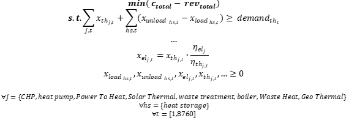

<h1><a class="anchor" id="cm-district-heating-supply-dispatch" href="#cm-district-heating-supply-dispatch"><i class="fa fa-link"></i></a>Distribution de l&#39;approvisionnement en chauffage urbain CM</h1><h2><a class="anchor" id="table-of-contents" href="#table-of-contents"><i class="fa fa-link"></i></a> Table des matières</h2><ul><li> <a href="#in-a-glance">En un coup d&#39;oeil</a></li><li> <a href="#introduction">introduction</a></li><li> <a href="#inputs-and-outputs">Entrées et sorties</a></li><li> <a href="#method">Méthode</a></li><li> <a href="#github-repository-of-this-calculation-module">Dépôt GitHub de ce module de calcul</a></li><li> <a href="#sample-run">Exemple d&#39;exécution</a></li><li> <a href="#how-to-cite">Comment citer</a></li><li> <a href="#authors-and-reviewers">Auteurs et relecteurs</a></li><li> <a href="#license">Licence</a></li><li> <a href="#acknowledgement">Reconnaissance</a></li></ul><h2><a class="anchor" id="in-a-glance" href="#in-a-glance"><i class="fa fa-link"></i></a> En un coup d&#39;oeil</h2>
 Ce module peut être exécuté selon deux modes: 1) expédition, 2) investissement. En mode de répartition, il calcule le fonctionnement à coût minimal d&#39;un portefeuille de technologies de fourniture de chaleur dans un système de chauffage urbain défini pour chaque heure de l&#39;année. Les entrées du module sont des profils horaires de la demande de chaleur dans le réseau, de l&#39;apport de chaleur potentiel de différentes sources et des prix des vecteurs énergétiques. En outre, des paramètres de coût et d&#39;efficacité pour chaque technologie sont nécessaires. Le module donne les coûts de fourniture de chaleur, la part des vecteurs énergétiques utilisés et les émissions implicites de CO2. En mode investissement, le module optimise les capacités des technologies de fourniture de chaleur installées pour couvrir la demande de chaleur.

 <a href="#table-of-contents"><strong><code>To Top</code></strong></a>
<h2><a class="anchor" id="introduction" href="#introduction"><i class="fa fa-link"></i></a> introduction</h2>
 Ce module peut être exécuté selon deux modes: 1) expédition, 2) investissement. En mode de répartition, il calcule le fonctionnement à coût minimal d&#39;un portefeuille de technologies de fourniture de chaleur dans un système de chauffage urbain défini pour chaque heure de l&#39;année. Les entrées du module sont des profils horaires pour la demande de chaleur dans le réseau, pour l&#39;apport de chaleur potentiel de différentes sources et pour les prix des vecteurs énergétiques. En outre, des paramètres de coût et d&#39;efficacité pour chaque technologie sont nécessaires. Le module donne les coûts de fourniture de chaleur, la part des vecteurs énergétiques utilisés et les émissions de CO2 implicites. En mode investissement, le module optimise les capacités des technologies de fourniture de chaleur installées pour couvrir la demande de chaleur.

 Le module de répartition de l&#39;approvisionnement en chauffage urbain est un modèle de répartition qui tente de trouver une solution optimale en termes de coût pour couvrir la demande de chaleur à chaque heure de l&#39;année.

 La méthode décrite ici doit être comprise comme un premier concept et peut s&#39;écarter de la mise en œuvre réelle (la complexité du modèle, les entrées et les sorties, etc. doivent être vues de ce point de vue). Cette page wiki, explique la version du module de calcul qui est intégrée à la boîte à outils. Une <strong>version autonome</strong> du module de calcul est beaucoup plus complète et peut être téléchargée <strong><a href="https://github.com/tuw-eeg/hotmapsDispatch">ICI</a></strong> . Cette version nécessite cependant des connaissances de base en programmation python. La <strong>documentation</strong> de la version autonome peut être trouvée <strong><a href="https://hotmapsdispatch.readthedocs.io/en/latest/">ICI</a></strong> .

 <a href="#table-of-contents"><strong><code>To Top</code></strong></a>
<h2><a class="anchor" id="inputs-and-outputs" href="#inputs-and-outputs"><i class="fa fa-link"></i></a> Entrées et sorties</h2><h3><a class="anchor" id="main-inputs" href="#main-inputs"><i class="fa fa-link"></i></a> Entrées principales</h3>
 Le module nécessite une longue gamme de paramètres d&#39;entrée. Les principaux paramètres d&#39;entrée sont cependant:
<ol><li> Demande de chaleur du réseau (région sélectionnée)</li><li> Capacités installées des générateurs / stockage de chaleur</li><li> Paramètres techniques (en-efficiences) et financiers (opex, capex, durée de vie) des générateurs / stockages de chaleur</li><li> Profils (séries chronologiques de la demande de chaleur, rayonnement solaire, température, prix de l&#39;électricité, etc.)</li></ol><h3><a class="anchor" id="main-outputs" href="#main-outputs"><i class="fa fa-link"></i></a> Sorties principales</h3>
 Les principaux indicateurs de sortie du module de calcul sont:
<ul><li> Coûts de production de chaleur</li><li> Coûts d&#39;investissement, d&#39;exploitation et de carburant</li><li> Mix de génération de chaleur par générateur de chaleur</li><li> Emissions de CO2</li><li> Heures de pleine charge,</li></ul>
 <strong>NOTE IMPORTANTE</strong> Dans Hotmaps, les émissions de biomasse ne sont pas supposées nulles car Hotmaps est un outil destiné à accompagner la transition énergétique en cours. Considérer la biomasse comme une source d&#39;énergie neutre en carbone implique que la combustion de la biomasse réduit les émissions totales actuelles par rapport à la combustion de combustibles fossiles, ce qui n&#39;est pas vrai. Le stockage du dioxyde de carbone dans les arbres se produit sur des décennies, tandis que son rejet dans l&#39;atmosphère se fait en une seule fois. Par conséquent, le bilan carbone net de la biomasse est nul à long terme, mais pas à court terme et les mesures d&#39;atténuation du changement climatique doivent aboutir à une réduction des émissions de carbone à court terme.

 <a href="#table-of-contents"><strong><code>To Top</code></strong></a>
<h2><a class="anchor" id="method" href="#method"><i class="fa fa-link"></i></a> Méthode</h2>
 Le module est implémenté sous la forme d&#39;un programme linéaire et peut être utilisé d&#39;une part comme modèle d&#39;expédition pur et d&#39;autre part pour la planification des investissements afin de couvrir un profil de charge. La fonction objectif essaie de trouver le minimum de la différence entre les coûts de fourniture de chaleur et les revenus de la production d&#39;électricité.
<h3><a class="anchor" id="equation-fragments-of-the-linear-program-" href="#equation-fragments-of-the-linear-program-"><i class="fa fa-link"></i></a> Fragments d&#39;équation du programme linéaire:</h3>

<h4> <a class="anchor" id="the-total-costs-<code>ctotal<-sub><-code>-yield-from-the-sum-of-" href="#the-total-costs-<code>ctotal<-sub><-code>-yield-from-the-sum-of-"><i class="fa fa-link"></i></a> Les coûts totaux <code>c total</code> rendement <code>c total</code> à partir de la somme de:</h4><h5> <a class="anchor" id="investment-costs-<code>ic<-code>-installed-capacities-multiplied-by-the-annuities-of-the-specific-investment-costs" href="#investment-costs-<code>ic<-code>-installed-capacities-multiplied-by-the-annuities-of-the-specific-investment-costs"><i class="fa fa-link"></i></a> coûts d&#39;investissement <code>IC</code> (capacités installées multipliées par les annuités des coûts d&#39;investissement spécifiques)</h5>

<h5> <a class="anchor" id="captial-costs-<code>cc<-code>--" href="#captial-costs-<code>cc<-code>--"><i class="fa fa-link"></i></a> captial coûte <code>CC</code> :</h5>

<h5> <a class="anchor" id="the-variable-costs-<code>opex<-code>--" href="#the-variable-costs-<code>opex<-code>--"><i class="fa fa-link"></i></a> les coûts variables <code>OPEX</code> :</h5>

<h5><a class="anchor" id="ramp-costs-of-chp-and-waste-incineration-plants-rough-estimation--" href="#ramp-costs-of-chp-and-waste-incineration-plants-rough-estimation--"><i class="fa fa-link"></i></a> coûts de rampe des usines de cogénération et d&#39;incinération des déchets (estimation approximative):</h5>

<h5><a class="anchor" id="assumed-costs-for-the-peak-electrical-load-in-the-winter-time-rough-estimation-" href="#assumed-costs-for-the-peak-electrical-load-in-the-winter-time-rough-estimation-"><i class="fa fa-link"></i></a> coûts supposés pour la charge électrique de pointe en hiver (estimation approximative):</h5>

<h4> <a class="anchor" id="the-total-revenues-<code>revtotal<-sub><-code>-yield-from--" href="#the-total-revenues-<code>revtotal<-sub><-code>-yield-from--"><i class="fa fa-link"></i></a> Le total des revenus par rapport au rendement <code>rev total</code> de:</h4><h5><a class="anchor" id="the-sale-of-electricity-for-example-from-chp-plants-and-waste-incineration-plants.-" href="#the-sale-of-electricity-for-example-from-chp-plants-and-waste-incineration-plants.-"><i class="fa fa-link"></i></a> la vente d&#39;électricité (par exemple des usines de cogénération et des usines d&#39;incinération de déchets):</h5>

 <a href="#table-of-contents"><strong><code>To Top</code></strong></a>
<h4><a class="anchor" id="legend" href="#legend"><i class="fa fa-link"></i></a> Légende</h4>

 <a href="#table-of-contents"><strong><code>To Top</code></strong></a>
<h2><a class="anchor" id="github-repository-of-this-calculation-module" href="#github-repository-of-this-calculation-module"><i class="fa fa-link"></i></a> Dépôt GitHub de ce module de calcul</h2>
 <a href="https://github.com/HotMaps/dispatch_module/tree/develop">Ici,</a> vous obtenez le développement de pointe pour ce module de calcul.

 <a href="#table-of-contents"><strong><code>To Top</code></strong></a>
<h2><a class="anchor" id="sample-run" href="#sample-run"><i class="fa fa-link"></i></a> Exemple d&#39;exécution</h2>
 Une fois que vous avez sélectionné une région et que vous n&#39;avez apporté aucune modification aux paramètres par défaut, le modèle s&#39;exécute en mode investissement. Cela signifie que les capacités installées sont également optimisées pour une couverture optimale des coûts de la demande de chaleur.

 Ci-dessous vous pouvez voir tous les paramètres d&#39;entrée qui peuvent être modifiés
<h4><a class="anchor" id="output-indicators" href="#output-indicators"><i class="fa fa-link"></i></a> Indicateurs de sortie</h4><h4><a class="anchor" id="output-charts" href="#output-charts"><i class="fa fa-link"></i></a> Graphiques de sortie</h4>
 <a href="#table-of-contents"><strong><code>To Top</code></strong></a>
<h2><a class="anchor" id="how-to-cite" href="#how-to-cite"><i class="fa fa-link"></i></a> Comment citer</h2>
 Jeton Hasani, dans Hotmaps Wiki, CM Distribution de l&#39;approvisionnement en chauffage urbain (septembre 2020)

 <a href="#table-of-contents"><strong><code>To Top</code></strong></a>
<h2><a class="anchor" id="authors-and-reviewers" href="#authors-and-reviewers"><i class="fa fa-link"></i></a> Auteurs et relecteurs</h2>
 Cette page a été écrite par Jeton Hasani ( <strong><a href="https://eeg.tuwien.ac.at/">EEG - TU Wien</a></strong> ).

 ☑ Cette page a été révisée par Mostafa Fallahnejad ( <strong><a href="https://eeg.tuwien.ac.at/">EEG - TU Wien</a></strong> ).

 <a href="#table-of-contents"><strong><code>To Top</code></strong></a>
<h2><a class="anchor" id="license" href="#license"><i class="fa fa-link"></i></a> Licence</h2>
 Droits d&#39;auteur © 2016-2020: Jeton Hasani

 Licence internationale Creative Commons Attribution 4.0

 Ce travail est concédé sous une licence internationale Creative Commons CC BY 4.0.

 Identificateur de licence SPDX: CC-BY-4.0

 Texte de la licence: https://spdx.org/licenses/CC-BY-4.0.html

 <a href="#table-of-contents"><strong><code>To Top</code></strong></a>
<h2><a class="anchor" id="acknowledgement" href="#acknowledgement"><i class="fa fa-link"></i></a> Reconnaissance</h2>
 Nous souhaitons exprimer notre profonde gratitude au projet Horizon 2020 <a href="https://www.hotmaps-project.eu">Hotmaps</a> (accord de subvention n ° 723677), qui a fourni le financement nécessaire pour mener à bien la présente enquête.

 <a href="#table-of-contents"><strong><code>To Top</code></strong></a>

<!--- THIS IS A SUPER UNIQUE IDENTIFIER -->

This page was automatically translated. View in another language:

[English](../en/CM-District-heating-supply-dispatch) (original) [Bulgarian](../bg/CM-District-heating-supply-dispatch)\* [Czech](../cs/CM-District-heating-supply-dispatch)\* [Danish](../da/CM-District-heating-supply-dispatch)\* [German](../de/CM-District-heating-supply-dispatch)\* [Greek](../el/CM-District-heating-supply-dispatch)\* [Spanish](../es/CM-District-heating-supply-dispatch)\* [Estonian](../et/CM-District-heating-supply-dispatch)\* [Finnish](../fi/CM-District-heating-supply-dispatch)\*  [Irish](../ga/CM-District-heating-supply-dispatch)\* [Croatian](../hr/CM-District-heating-supply-dispatch)\* [Hungarian](../hu/CM-District-heating-supply-dispatch)\* [Italian](../it/CM-District-heating-supply-dispatch)\* [Lithuanian](../lt/CM-District-heating-supply-dispatch)\* [Latvian](../lv/CM-District-heating-supply-dispatch)\* [Maltese](../mt/CM-District-heating-supply-dispatch)\* [Dutch](../nl/CM-District-heating-supply-dispatch)\* [Polish](../pl/CM-District-heating-supply-dispatch)\* [Portuguese (Portugal, Brazil)](../pt/CM-District-heating-supply-dispatch)\* [Romanian](../ro/CM-District-heating-supply-dispatch)\* [Slovak](../sk/CM-District-heating-supply-dispatch)\* [Slovenian](../sl/CM-District-heating-supply-dispatch)\* [Swedish](../sv/CM-District-heating-supply-dispatch)\* 

\* machine translated
