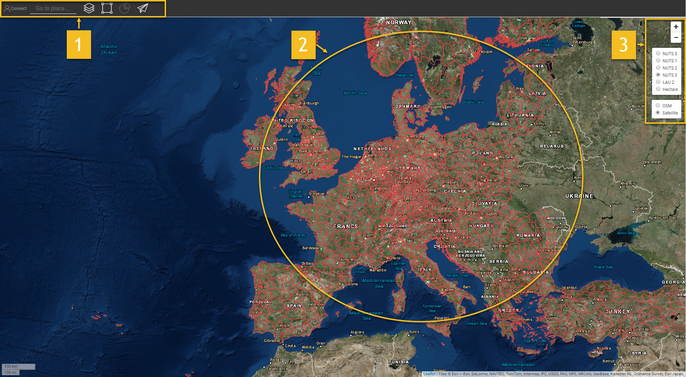

<h1><a class="anchor" id="introduction-to-user-interface" href="#introduction-to-user-interface"><i class="fa fa-link"></i></a>Introduction à l&#39;interface utilisateur</h1><h2><a class="anchor" id="table-of-contents" href="#table-of-contents"><i class="fa fa-link"></i></a> Table des matières</h2><ul><li>
 <a href="#introduction-page">Page d&#39;introduction</a>
</li><li>
 <a href="#upper-toolbar">Barre d&#39;outils supérieure</a>
<ul><li> <a href="#upper-toolbar_connect">Relier</a><ul><li> <a href="#upper-toolbar_connect_login">S&#39;identifier</a></li><li> <a href="#upper-toolbar_connect_register">S&#39;inscrire</a></li><li> <a href="#upper-toolbar_connect_recover">Récupérer</a></li></ul></li><li> <a href="#upper-toolbar_go-to-place">Aller au lieu</a></li><li> <a href="#upper-toolbar_layers">Couches</a></li><li> <a href="#upper-toolbar_selection-tools">Outils de sélection</a></li><li> <a href="#upper-toolbar_show-result">Afficher le résultat</a></li><li> <a href="#upper-toolbar_feedback">Retour d&#39;information</a></li><li> <a href="#upper-toolbar_save-session">Sauvegarder la session</a></li><li> <a href="#upper-toolbar_save-session-folder">Enregistrer le dossier de session</a></li></ul></li><li>
 <a href="#tiles">Carrelage</a>
</li><li>
 <a href="#how-to-cite">Comment citer</a>
</li><li>
 <a href="#authors-and-reviewers">Auteurs et relecteurs</a>
</li><li>
 <a href="#license">Licence</a>
</li><li>
 <a href="#acknowledgement">Reconnaissance</a>
</li></ul><h2><a class="anchor" id="introduction-page" href="#introduction-page"><i class="fa fa-link"></i></a> Page d&#39;introduction</h2>
 Une fois la boîte à outils ouverte, la page d&#39;exclusion de responsabilité s&#39;affiche. Outre le message d&#39;avertissement, des informations supplémentaires concernant les navigateurs pris en charge, les objectifs du projet Hotmaps, le lien vers le site Web du projet Hotmaps et les référentiels de données sont fournis.

 <em>Fig.1 Brève introduction à la boîte à outils Hotmaps</em>

 L&#39;interface graphique Hotmaps est une interface SIG. En fermant la page d&#39;exclusion, l&#39;utilisateur voit la carte de l&#39;Europe. Par défaut, la carte de densité de la demande de chaleur des pays de l&#39;UE-28 et les frontières NUTS 2 sont représentées. En plus de ces deux cartes, certains outils et boutons peuvent être vus dans l&#39;interface graphique. Ces outils sont illustrés dans la figure suivante.

 <em>Fig.2 Page initiale</em>

 Ici, vous pouvez repérer à première vue 3 parties de l&#39;interface utilisateur:
<ol><li> <a href="#upper-toolbar">une barre d&#39;outils en haut à gauche</a> ,</li><li> la carte elle-même,</li><li> <a href="#tiles">quelques outils pour changer le style de la carte</a> .</li><li> deux liens en haut à droite: vers ce <a href="https://wiki.hotmaps.eu/">Wiki Hotmaps</a> et vers le <a href="https://www.hotmaps-project.eu/">site Web du projet Hotmaps</a> .</li></ol>
 Dans les chapitres suivants, les 3 premiers points sont expliqués en détail.

 <a href="#table-of-contents"><strong><code>To Top</code></strong></a>
<h2><a class="anchor" id="upper-toolbar" href="#upper-toolbar"><i class="fa fa-link"></i></a> Barre d&#39;outils supérieure</h2>

 Avec cette barre d&#39;outils, vous pouvez:
<ol><li> <a href="#upper-toolbar_connect"><em>Connectez-vous:</em></a> inscrivez-vous et connectez-vous à l&#39;application Web afin de sauvegarder votre travail,</li><li> <a href="#upper-toolbar_go-to-place"><em>Aller à l&#39;endroit:</em></a> zoomez sur une région spécifique en saisissant le nom,</li><li> <a href="#upper-toolbar_layers"><em>Calques:</em></a> affichez la barre latérale des calques,</li><li> <a href="#upper-toolbar_selection-tools"><em>Outils de sélection</em> :</a> activer ou désactiver les outils de sélection,</li><li> <a href="#upper-toolbar_show-result"><em>Afficher le résultat:</em></a> affichez la barre latérale des résultats de vos régions sélectionnées,</li><li> <a href="#upper-toolbar_feedback"><em>Commentaires:</em></a> donnez-nous vos commentaires sur l&#39;outil,</li><li> <a href="#upper-toolbar_save-session"><em>Enregistrer la session:</em></a> vous pouvez enregistrer les calques sélectionnés et le niveau de zoom et les rappeler plus tard,</li><li> <a href="#upper-toolbar_save-session-folder"><em>Enregistrer le dossier de session:</em></a> où vous pouvez voir la liste de toutes les sessions enregistrées.</li></ol>
 <a href="#table-of-contents"><strong><code>To Top</code></strong></a>
<h3><a class="anchor" id="connect" href="#connect"><i class="fa fa-link"></i></a> Relier</h3>
 Ici tu peux:
<ul><li> Créer un compte</li><li> Connectez-vous à votre compte pour enregistrer votre progression</li><li> Ou réinitialisez votre mot de passe si vous l&#39;oubliez</li></ul>
 <a href="#table-of-contents"><strong><code>To Top</code></strong></a>
<h4><a class="anchor" id="login" href="#login"><i class="fa fa-link"></i></a> S&#39;identifier</h4>
 Après avoir <a href="#register">enregistré</a> et activé votre compte, vous devriez pouvoir vous connecter avec votre email et votre mot de passe (voir la <a href="#fig4">figure 4</a> ci-dessous).

 <em>Fig.4: Formulaire de connexion</em>

 <a href="#table-of-contents"><strong><code>To Top</code></strong></a>
<h4><a class="anchor" id="register" href="#register"><i class="fa fa-link"></i></a> S&#39;inscrire</h4>
 Ici, vous pouvez créer un compte pour le site Web <em>hotmaps</em> . Après avoir soumis le <a href="#fig5">formulaire,</a> vous recevrez un e-mail pour activer votre compte. Avec votre compte, vous pourrez enregistrer votre progression.

 <em>Fig.5: Formulaire d&#39;inscription</em>

 <a href="#table-of-contents"><strong><code>To Top</code></strong></a>
<h4><a class="anchor" id="recover" href="#recover"><i class="fa fa-link"></i></a> Récupérer</h4>
 Si jamais vous oubliez votre mot de passe, vous pouvez le récupérer dans ce menu (voir <a href="#fig6">figure 6</a> ci-dessous). Veuillez noter que vous devez ensuite définir un nouveau mot de passe.

 <em>Fig.6: Récupérer le formulaire</em>

 <a href="#table-of-contents"><strong><code>To Top</code></strong></a>
<h3><a class="anchor" id="go-to-place" href="#go-to-place"><i class="fa fa-link"></i></a> Aller au lieu</h3>
 Vous pouvez zoomer sur une région spécifiée en tapant son nom (voir l&#39;animation ci-dessous)

 <a href="#table-of-contents"><strong><code>To Top</code></strong></a>
<h3><a class="anchor" id="layers" href="#layers"><i class="fa fa-link"></i></a> Couches</h3>
 En appuyant sur ce bouton, une barre latérale avec différents types de couches est affichée à gauche.

 Les couches suivantes peuvent être trouvées et visualisées:

 <a href="#table-of-contents"><strong><code>To Top</code></strong></a>
<h3><a class="anchor" id="selection-tools" href="#selection-tools"><i class="fa fa-link"></i></a> Outils de sélection</h3>
 En appuyant sur ce bouton, les outils de sélection apparaîtront à gauche de votre écran

 La figure ci-dessous montre l&#39;apparence des outils:

<ol><li> Outil de sélection des régions</li><li> Créer une région carrée personnalisée</li><li> Créer une région de cercle personnalisée</li><li> Créer une région de polygone personnalisée</li><li> Téléchargez un objet GeoJSON pour utiliser une sélection de zone personnalisée</li></ol><ol type="A"><li> indique le nombre de régions que vous avez sélectionnées</li><li> montre la surface globale du plus petit rectangle pouvant couvrir la zone sélectionnée</li><li> montre l&#39;échelle que vous avez sélectionnée dans la barre d&#39;outils de droite</li></ol><ol type="a"><li> bouton pour charger les résultats de votre région sélectionnée et des couches sélectionnées</li><li> bouton pour supprimer une région sélectionnée</li></ol>
 <a href="#table-of-contents"><strong><code>To Top</code></strong></a>
<h3><a class="anchor" id="show-result" href="#show-result"><i class="fa fa-link"></i></a> Afficher le résultat</h3>
 Selon les couches et la région que vous avez sélectionnées, les résultats pour votre configuration sont affichés dans une barre latérale à droite de votre écran

 <a href="#table-of-contents"><strong><code>To Top</code></strong></a>
<h3><a class="anchor" id="feedback" href="#feedback"><i class="fa fa-link"></i></a> Retour d&#39;information</h3>
 Avez-vous des suggestions pour améliorer l&#39;outil? Avez-vous remarqué des erreurs? Merci de nous le faire savoir! En nous faisant part de vos commentaires, vous pouvez nous aider à améliorer la boîte à outils!

 Veuillez remplir le <a href="#Fig7">formulaire</a> ci-dessous:

 <a href="#table-of-contents"><strong><code>To Top</code></strong></a>

 vous pouvez choisir parmi les types suivants:

 et définissez une priorité:

 <a href="#table-of-contents"><strong><code>To Top</code></strong></a>
<h3><a class="anchor" id="save-session" href="#save-session"><i class="fa fa-link"></i></a> Sauvegarder la session</h3>
 vous pouvez faire un instantané de votre travail (zones et calques sélectionnés, niveaux de zoom, etc.) en appuyant sur ce bouton. Vous pouvez également définir un nom et une description de l&#39;instantané.
<h3><a class="anchor" id="save-session-folder" href="#save-session-folder"><i class="fa fa-link"></i></a> Enregistrer le dossier de session</h3>
 Ici, vous voyez tous vos instantanés avec leurs noms et leur description. Lorsque vous sélectionnez une des couches, des zones, le niveau de zoom et une autre configuration sélectionnés sont chargés.
<h2><a class="anchor" id="tiles" href="#tiles"><i class="fa fa-link"></i></a> Carrelage</h2>
 Vous pouvez choisir l&#39;échelle territoriale que vous souhaitez analyser (régions NUTS ou niveau hectare) et définir la tuile de la carte

 Les configurations suivantes sont possibles

<ol><li> Zoom avant et zoom arrière sur la carte</li><li> Affichez les limites NUTS pour sélectionner des régions NUTS spécifiques ou utilisez un hectare pour personnaliser votre <a href="#upper-toolbar_selection-tools">sélection</a></li><li> Utiliser la tuile OpenStreetMap ou la tuile Satelite</li></ol>
 <a href="#table-of-contents"><strong><code>To Top</code></strong></a>
<h2><a class="anchor" id="how-to-cite" href="#how-to-cite"><i class="fa fa-link"></i></a> Comment citer</h2>
 Jeton Hasani, dans Hotmaps-Wiki, Introduction-to-user-interface (avril 2019)

 <a href="#table-of-contents"><strong><code>To Top</code></strong></a>
<h2><a class="anchor" id="authors-and-reviewers" href="#authors-and-reviewers"><i class="fa fa-link"></i></a> Auteurs et relecteurs</h2>
 Cette page a été écrite par Jeton Hasani <strong><a href="https://eeg.tuwien.ac.at/">EEG - TU Wien</a></strong> .

 ☑ Cette page a été révisée par Mostafa Fallahnejad <strong><a href="https://eeg.tuwien.ac.at/">EEG - TU Wien</a></strong> .

 <a href="#table-of-contents"><strong><code>To Top</code></strong></a>
<h2><a class="anchor" id="license" href="#license"><i class="fa fa-link"></i></a> Licence</h2>
 Droits d&#39;auteur © 2016-2020: Jeton Hasani

 Licence internationale Creative Commons Attribution 4.0

 Ce travail est autorisé sous une licence internationale Creative Commons CC BY 4.0.

 Identificateur de licence SPDX: CC-BY-4.0

 Texte de la licence: https://spdx.org/licenses/CC-BY-4.0.html

 <a href="#table-of-contents"><strong><code>To Top</code></strong></a>
<h2><a class="anchor" id="acknowledgement" href="#acknowledgement"><i class="fa fa-link"></i></a> Reconnaissance</h2>
 Nous souhaitons exprimer notre profonde gratitude au projet Horizon 2020 <a href="https://www.hotmaps-project.eu">Hotmaps</a> (accord de subvention n ° 723677), qui a fourni le financement nécessaire pour mener à bien la présente enquête.

 <a href="#table-of-contents"><strong><code>To Top</code></strong></a>

<!--- THIS IS A SUPER UNIQUE IDENTIFIER -->

This page was automatically translated. View in another language:

[English](../en/Introduction-to-user-interface) (original) [Bulgarian](../bg/Introduction-to-user-interface)\* [Czech](../cs/Introduction-to-user-interface)\* [Danish](../da/Introduction-to-user-interface)\* [German](../de/Introduction-to-user-interface)\* [Greek](../el/Introduction-to-user-interface)\* [Spanish](../es/Introduction-to-user-interface)\* [Estonian](../et/Introduction-to-user-interface)\* [Finnish](../fi/Introduction-to-user-interface)\*  [Irish](../ga/Introduction-to-user-interface)\* [Croatian](../hr/Introduction-to-user-interface)\* [Hungarian](../hu/Introduction-to-user-interface)\* [Italian](../it/Introduction-to-user-interface)\* [Lithuanian](../lt/Introduction-to-user-interface)\* [Latvian](../lv/Introduction-to-user-interface)\* [Maltese](../mt/Introduction-to-user-interface)\* [Dutch](../nl/Introduction-to-user-interface)\* [Polish](../pl/Introduction-to-user-interface)\* [Portuguese (Portugal, Brazil)](../pt/Introduction-to-user-interface)\* [Romanian](../ro/Introduction-to-user-interface)\* [Slovak](../sk/Introduction-to-user-interface)\* [Slovenian](../sl/Introduction-to-user-interface)\* [Swedish](../sv/Introduction-to-user-interface)\* 

\* machine translated
