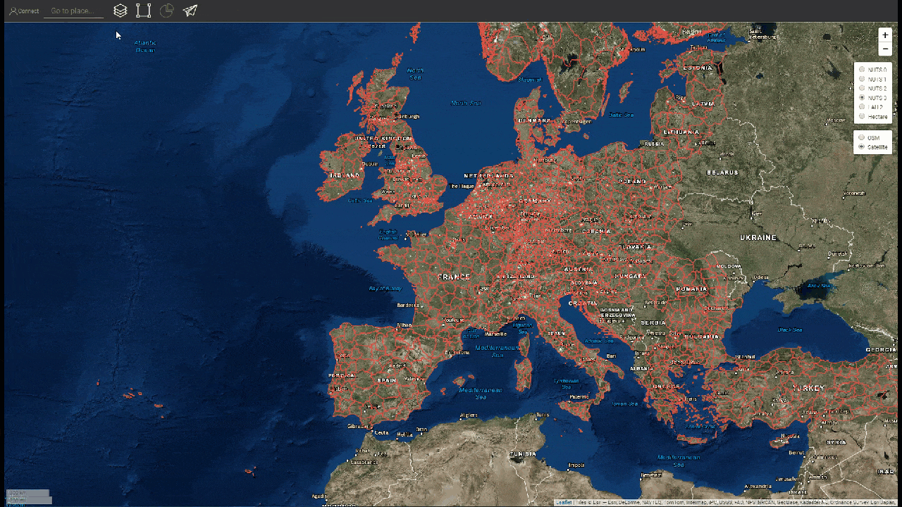
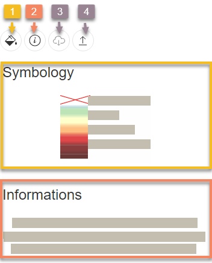
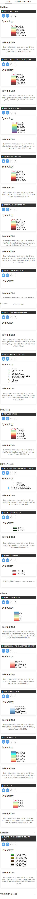

<h1><a class="anchor" id="layers-section-in-the-hotmaps-toolbox" href="#layers-section-in-the-hotmaps-toolbox"><i class="fa fa-link"></i></a>Section Calques dans la boîte à outils Hotmaps</h1><h2><a class="anchor" id="table-of-contents" href="#table-of-contents"><i class="fa fa-link"></i></a> Table des matières</h2><ul><li> <a href="#introduction">introduction</a></li><li> <a href="#layers">Couches</a></li><li> <a href="#raster-layers">Couches raster</a></li><li> <a href="#vector-layers">Couches vectorielles</a></li><li> <a href="#calculation-module-layers">Couches du module de calcul</a></li><li> <a href="#how-to-cite">Comment citer</a></li><li> <a href="#authors-and-reviewers">Auteurs et relecteurs</a></li><li> <a href="#license">Licence</a></li><li> <a href="#acknowledgement">Reconnaissance</a></li></ul><h2><a class="anchor" id="introduction" href="#introduction"><i class="fa fa-link"></i></a> introduction</h2>
 En appuyant sur le Bouton une barre latérale avec différents types de calques est affichée à gauche de votre écran.

 <strong>Chaque couche a un ensemble d&#39;outils comme indiqué ci-dessous</strong>

<ol><li> Affiche la section de symbologie de la couche (légende)</li><li> Affiche la section d&#39;informations (principal un lien vers le référentiel GitLab, il est fortement recommandé de rechercher plus d&#39;informations sur les données dans le <a href="https://gitlab.com/hotmaps">référentiel GitLab</a> )</li><li> Téléchargez le jeu de données par défaut</li><li> Télécharger le calque pour la sélection de calque</li></ol>
 <a href="#table-of-contents"><strong><code>To Top</code></strong></a>
<h2><a class="anchor" id="layers" href="#layers"><i class="fa fa-link"></i></a> Couches</h2>
 Il existe <a href="https://www.gislounge.com/geodatabases-explored-vector-and-raster-data">deux catégories de couches</a> :
<ol><li> Couches vectorielles</li><li> Couches raster</li></ol>
 Les couches suivantes peuvent être trouvées et visualisées (vous pouvez également voir la légende et aussi la section d&#39;informations de chaque couche):

 <a href="#table-of-contents"><strong><code>To Top</code></strong></a>
<h2><a class="anchor" id="raster-layers" href="#raster-layers"><i class="fa fa-link"></i></a> Couches raster</h2>
 Les couches raster suivantes sont visualisées:
<ol><li>
 <strong>17 x couches de bâtiments:</strong>
<ul><li> Carte de densité de chaleur (totale / résidentielle / non résidentielle)</li><li> Carte de densité de refroidissement (totale / résidentielle / non résidentielle)</li><li> Surface de plancher brute (totale / résidentielle / non résidentielle)</li><li> Volumes des bâtiments (total / résidentiel / non résidentiel)</li></ul></li><li>
 <strong>1 x couche de population</strong>
<ul><li> Total de la population</li></ul></li><li>
 <strong>3 x sources d&#39;énergie renouvelable Couches potentielles:</strong>
<ul><li> Rayonnement solaire sur l&#39;empreinte du bâtiment</li><li> Potentiel éolien à 50m</li><li> Résidus forestiers</li></ul></li><li>
 <strong>5 x couches climatiques:</strong>
<ul><li> Température</li><li> Degré-jours de refroidissement</li><li> Degrés-jours de chauffage</li><li> Radiation solaire</li><li> Vitesse du vent</li></ul></li></ol>
 <a href="#table-of-contents"><strong><code>To Top</code></strong></a>
<h2><a class="anchor" id="vector-layers" href="#vector-layers"><i class="fa fa-link"></i></a> Couches vectorielles</h2>
 Les couches vectorielles suivantes sont visualisées:
<ol><li>
 <strong>4x couches industrielles:</strong>
<ul><li> Émissions de sites industriels</li><li> Excès de chaleur sur les sites industriels</li><li> Nom de la société du site industriel</li><li> Sous-secteur des sites industriels</li></ul></li><li>
 <strong>6 x sources d&#39;énergie renouvelable Couches potentielles:</strong>
<ul><li> Puissance des usines de traitement des eaux usées</li><li> Capacité des usines de traitement des eaux usées</li><li> Résidus agricoles</li><li> Effluents d&#39;élevage</li><li> Conductivité thermique potentielle géothermique</li><li> Déchets solides municipaux</li></ul></li><li>
 <strong>1 x couche d&#39;électricité:</strong>
<ul><li> Électricité Émissions de CO2 Moyenne du pays</li></ul></li></ol>
 <a href="#table-of-contents"><strong><code>To Top</code></strong></a>
<h2><a class="anchor" id="calculation-module-layers" href="#calculation-module-layers"><i class="fa fa-link"></i></a> Couches du module de calcul</h2>
 Certains modules de calcul génèrent une couche avec les résultats calculés, comme les <a href="/en/CM-Scale-heat-and-cool-density-maps">cartes de densité de chaleur et de refroidissement à l&#39;échelle CM</a> par exemple. Lorsque ces CM sont exécutés, la couche relative apparaît sur le côté gauche de l&#39;écran, dans la section des couches, tout en bas. La couche peut ensuite être sélectionnée et utilisée dans d&#39;autres calculs. Comme pour toutes les autres couches, quelques boutons sous le titre de la couche permettent d&#39;afficher la symbologie de la couche, les informations disponibles sur la couche, le téléchargement du jeu de données de la couche et le téléchargement de la couche sous forme de fichier raster.

 <a href="#table-of-contents"><strong><code>To Top</code></strong></a>
<h2><a class="anchor" id="how-to-cite" href="#how-to-cite"><i class="fa fa-link"></i></a> Comment citer</h2>
 Jeton Hasani, dans Hotmaps-Wiki, Layers-section-in-the-Hotmaps-toolbox (avril 2019)

 <a href="#table-of-contents"><strong><code>To Top</code></strong></a>
<h2><a class="anchor" id="authors-and-reviewers" href="#authors-and-reviewers"><i class="fa fa-link"></i></a> Auteurs et relecteurs</h2>
 Cette page a été écrite par Jeton Hasani <strong><a href="https://eeg.tuwien.ac.at/">EEG - TU Wien</a></strong> .

 ☑ Cette page a été révisée par Mostafa Fallahnejad <strong><a href="https://eeg.tuwien.ac.at/">EEG - TU Wien</a></strong> .

 <a href="#table-of-contents"><strong><code>To Top</code></strong></a>
<h2><a class="anchor" id="license" href="#license"><i class="fa fa-link"></i></a> Licence</h2>
 Droits d&#39;auteur © 2016-2020: Jeton Hasani

 Licence internationale Creative Commons Attribution 4.0

 Ce travail est concédé sous une licence internationale Creative Commons CC BY 4.0.

 Identificateur de licence SPDX: CC-BY-4.0

 Texte de la licence: https://spdx.org/licenses/CC-BY-4.0.html

 <a href="#table-of-contents"><strong><code>To Top</code></strong></a>
<h2><a class="anchor" id="acknowledgement" href="#acknowledgement"><i class="fa fa-link"></i></a> Reconnaissance</h2>
 Nous souhaitons exprimer notre profonde gratitude au projet Horizon 2020 <a href="https://www.hotmaps-project.eu">Hotmaps</a> (accord de subvention n ° 723677), qui a fourni le financement nécessaire pour mener à bien la présente enquête.

 <a href="#table-of-contents"><strong><code>To Top</code></strong></a>

<!--- THIS IS A SUPER UNIQUE IDENTIFIER -->

This page was automatically translated. View in another language:

[English](../en/Layers-section-in-the-Hotmaps-toolbox) (original) [Bulgarian](../bg/Layers-section-in-the-Hotmaps-toolbox)\* [Czech](../cs/Layers-section-in-the-Hotmaps-toolbox)\* [Danish](../da/Layers-section-in-the-Hotmaps-toolbox)\* [German](../de/Layers-section-in-the-Hotmaps-toolbox)\* [Greek](../el/Layers-section-in-the-Hotmaps-toolbox)\* [Spanish](../es/Layers-section-in-the-Hotmaps-toolbox)\* [Estonian](../et/Layers-section-in-the-Hotmaps-toolbox)\* [Finnish](../fi/Layers-section-in-the-Hotmaps-toolbox)\*  [Irish](../ga/Layers-section-in-the-Hotmaps-toolbox)\* [Croatian](../hr/Layers-section-in-the-Hotmaps-toolbox)\* [Hungarian](../hu/Layers-section-in-the-Hotmaps-toolbox)\* [Italian](../it/Layers-section-in-the-Hotmaps-toolbox)\* [Lithuanian](../lt/Layers-section-in-the-Hotmaps-toolbox)\* [Latvian](../lv/Layers-section-in-the-Hotmaps-toolbox)\* [Maltese](../mt/Layers-section-in-the-Hotmaps-toolbox)\* [Dutch](../nl/Layers-section-in-the-Hotmaps-toolbox)\* [Polish](../pl/Layers-section-in-the-Hotmaps-toolbox)\* [Portuguese (Portugal, Brazil)](../pt/Layers-section-in-the-Hotmaps-toolbox)\* [Romanian](../ro/Layers-section-in-the-Hotmaps-toolbox)\* [Slovak](../sk/Layers-section-in-the-Hotmaps-toolbox)\* [Slovenian](../sl/Layers-section-in-the-Hotmaps-toolbox)\* [Swedish](../sv/Layers-section-in-the-Hotmaps-toolbox)\* 

\* machine translated
