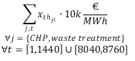

<h1><a class="anchor" id="cm-district-heating-supply-dispatch" href="#cm-district-heating-supply-dispatch"><i class="fa fa-link"></i></a>Seol soláthar teasa CM Dúiche</h1><h2><a class="anchor" id="table-of-contents" href="#table-of-contents"><i class="fa fa-link"></i></a> Clár ábhair</h2><ul><li> <a href="#in-a-glance">Sracfhéachaint</a></li><li> <a href="#introduction">Réamhrá</a></li><li> <a href="#inputs-and-outputs">Ionchuir agus aschuir</a></li><li> <a href="#method">Modh</a></li><li> <a href="#github-repository-of-this-calculation-module">Stór GitHub den mhodúl ríofa seo</a></li><li> <a href="#sample-run">Rith samplach</a></li><li> <a href="#how-to-cite">Conas a lua</a></li><li> <a href="#authors-and-reviewers">Údair agus léirmheastóirí</a></li><li> <a href="#license">Ceadúnas</a></li><li> <a href="#acknowledgement">Admháil</a></li></ul><h2><a class="anchor" id="in-a-glance" href="#in-a-glance"><i class="fa fa-link"></i></a> Sracfhéachaint</h2>
 Is féidir an modúl seo a reáchtáil ar dhá mhodh: 1) seoladh, 2) infheistiú. Sa mhodh seolta, ríomhann sé an oibríocht is lú ó thaobh costais de phunann de theicneolaíochtaí soláthair teasa i gcóras teasa ceantair sainithe do gach uair an chloig den bhliain. Is próifílí in aghaidh na huaire iad na hionchuir don mhodúl don éileamh teasa sa líonra, don soláthar teasa féideartha ó fhoinsí éagsúla agus do phraghsanna iompróirí fuinnimh. Ina theannta sin, teastaíonn paraiméadair costais agus éifeachtúlachta do gach teicneolaíocht. Tugann an modúl costais an tsoláthair teasa, sciar na n-iompróirí fuinnimh a úsáidtear agus na hastuithe intuigthe CO2. Sa mhodh infheistíochta, uasmhéadaíonn an modúl cumais na dteicneolaíochtaí soláthair teasa suiteáilte chun éileamh teasa a chlúdach.

 <a href="#table-of-contents"><strong><code>To Top</code></strong></a>
<h2><a class="anchor" id="introduction" href="#introduction"><i class="fa fa-link"></i></a> Réamhrá</h2>
 Is féidir an modúl seo a reáchtáil ar dhá mhodh: 1) seoladh, 2) infheistiú. Sa mhodh seolta, ríomhann sé an oibríocht is lú ó thaobh costais de phunann de theicneolaíochtaí soláthair teasa i gcóras teasa ceantair sainithe do gach uair an chloig den bhliain. Is próifílí in aghaidh na huaire iad na hionchuir don mhodúl don éileamh teasa sa líonra, don soláthar teasa féideartha ó fhoinsí éagsúla agus do phraghsanna iompróirí fuinnimh. Ina theannta sin, teastaíonn paraiméadair costais agus éifeachtúlachta do gach teicneolaíocht. Tugann an modúl costais an tsoláthair teasa, sciar na n-iompróirí fuinnimh a úsáidtear agus na hastuithe intuigthe CO2. Sa mhodh infheistíochta, uasmhéadaíonn an modúl cumais na dteicneolaíochtaí soláthair teasa suiteáilte chun éileamh teasa a chlúdach.

 Is samhail seolta é an modúl seolta soláthair teasa ceantair a dhéanann iarracht réiteach costais is fearr a fháil chun an t-éileamh teasa a chlúdach ag gach uair an chloig den bhliain.

 Tá an modh a thuairiscítear anseo le tuiscint mar chéad choincheap agus is féidir imeacht ón gcur i bhfeidhm iarbhír (caithfear castacht an mhúnla, ionchuir agus aschuir, srl. A fheiceáil ón dearcadh seo). Míníonn an leathanach wiki seo an leagan den mhodúl ríofa atá comhtháite leis an mbosca uirlisí. Tá <strong>leagan neamhspleách den</strong> mhodúl ríofa i bhfad níos cuimsithí agus is féidir é a íoslódáil <strong><a href="https://github.com/tuw-eeg/hotmapsDispatch">ANSEO</a></strong> . Éilíonn an leagan seo, áfach, eolas bunúsach ar ríomhchlárú python. Is féidir <strong>cáipéisíocht</strong> an leagain neamhspleách a fháil <strong><a href="https://hotmapsdispatch.readthedocs.io/en/latest/">ANSEO</a></strong> .

 <a href="#table-of-contents"><strong><code>To Top</code></strong></a>
<h2><a class="anchor" id="inputs-and-outputs" href="#inputs-and-outputs"><i class="fa fa-link"></i></a> Ionchuir agus aschuir</h2><h3><a class="anchor" id="main-inputs" href="#main-inputs"><i class="fa fa-link"></i></a> Príomh-ionchuir</h3>
 Éilíonn an modúl sraith fhada de pharaiméadair ionchuir. Is iad na príomh-pharaiméadair ionchuir, áfach:
<ol><li> Éileamh teasa na heangaí (réigiún roghnaithe)</li><li> Cumas suiteáilte gineadóirí teasa / stórála</li><li> Paraiméadair theicniúla (en-éifeachtúlachtaí) agus airgeadais (opex, capex, saolré) gineadóirí / stórálacha teasa</li><li> Próifílí (sraith ama den éileamh teasa, radaíocht na gréine, teocht, praghsanna leictreachais, srl.)</li></ol><h3><a class="anchor" id="main-outputs" href="#main-outputs"><i class="fa fa-link"></i></a> Príomh-aschuir</h3>
 Is iad príomhtháscairí aschuir an mhodúil ríofa:
<ul><li> Costais giniúna teasa</li><li> Costais infheistíochta, oibríochta agus breosla</li><li> Meascán giniúna teasa in aghaidh an ghineadóra teasa</li><li> Astaíochtaí CO2</li><li> Uaireanta Luchtaithe Iomlán,</li></ul>
 <strong>NÓTA TÁBHACHTACH</strong> I Hotmaps ní ghlactar le hastaíochtaí bithmhaise nialasacha toisc gur uirlis é Hotmaps atá dírithe ar thacú leis an aistriú fuinnimh leanúnach. Nuair a chuirtear bithmhais san áireamh mar fhoinse fuinnimh atá neodrach ó thaobh carbóin de, tugtar le tuiscint go laghdaíonn bithmhais dhó na hastuithe iomlána reatha i gcomparáid le breoslaí iontaise a dhó, rud nach bhfuil fíor. Déantar dé-ocsaíd charbóin a stóráil i gcrainn le blianta fada, agus scaoiltear san atmaisféar é go léir ag an am céanna. Dá bhrí sin, is é nialas an t-iarmhéid glancharbóin bithmhaise san fhadtéarma, ach ní sa ghearrthéarma agus ní mór do bhearta maolaithe athraithe aeráide torthaí a thabhairt chun astuithe carbóin a laghdú sa ghearrthéarma.

 <a href="#table-of-contents"><strong><code>To Top</code></strong></a>
<h2><a class="anchor" id="method" href="#method"><i class="fa fa-link"></i></a> Modh</h2>
 Cuirtear an modúl i bhfeidhm mar chlár líneach agus is féidir é a úsáid ar thaobh amháin mar mhúnla seolta íon agus ar an taobh eile le haghaidh pleanála infheistíochta chun próifíl ualaigh a chlúdach. Déanann an fheidhm oibiachtúil iarracht an difríocht is lú a fháil ó na costais as an teas agus an t-ioncam ó tháirgeadh leictreachais a sholáthar.
<h3><a class="anchor" id="equation-fragments-of-the-linear-program-" href="#equation-fragments-of-the-linear-program-"><i class="fa fa-link"></i></a> Blúirí cothromaíochta den chlár líneach:</h3>

<h4> <a class="anchor" id="the-total-costs-<code>ctotal<-sub><-code>-yield-from-the-sum-of-" href="#the-total-costs-<code>ctotal<-sub><-code>-yield-from-the-sum-of-"><i class="fa fa-link"></i></a> Na costais iomlána <code>c total</code> toradh <code>c total</code> ó shuim:</h4><h5> <a class="anchor" id="investment-costs-<code>ic<-code>-installed-capacities-multiplied-by-the-annuities-of-the-specific-investment-costs" href="#investment-costs-<code>ic<-code>-installed-capacities-multiplied-by-the-annuities-of-the-specific-investment-costs"><i class="fa fa-link"></i></a> costais infheistíochta <code>IC</code> (cumais suiteáilte arna iolrú faoi bhlianachtaí na gcostas infheistíochta ar leith)</h5>

<h5> <a class="anchor" id="captial-costs-<code>cc<-code>--" href="#captial-costs-<code>cc<-code>--"><i class="fa fa-link"></i></a> costais ghabhála <code>CC</code> :</h5>

<h5> <a class="anchor" id="the-variable-costs-<code>opex<-code>--" href="#the-variable-costs-<code>opex<-code>--"><i class="fa fa-link"></i></a> na costais athraitheacha <code>OPEX</code> :</h5>

<h5><a class="anchor" id="ramp-costs-of-chp-and-waste-incineration-plants-rough-estimation--" href="#ramp-costs-of-chp-and-waste-incineration-plants-rough-estimation--"><i class="fa fa-link"></i></a> costais rampa CHP agus gléasraí loscadh dramhaíola (Meastachán garbh):</h5>

<h5><a class="anchor" id="assumed-costs-for-the-peak-electrical-load-in-the-winter-time-rough-estimation-" href="#assumed-costs-for-the-peak-electrical-load-in-the-winter-time-rough-estimation-"><i class="fa fa-link"></i></a> costais mheasta don bhuaicualach leictreach sa gheimhreadh (Meastachán garbh):</h5>

<h4> <a class="anchor" id="the-total-revenues-<code>revtotal<-sub><-code>-yield-from--" href="#the-total-revenues-<code>revtotal<-sub><-code>-yield-from--"><i class="fa fa-link"></i></a> Athraíonn an t-ioncam <code>rev total</code> toradh <code>rev total</code> ó ::</h4><h5><a class="anchor" id="the-sale-of-electricity-for-example-from-chp-plants-and-waste-incineration-plants.-" href="#the-sale-of-electricity-for-example-from-chp-plants-and-waste-incineration-plants.-"><i class="fa fa-link"></i></a> díol leictreachais (mar shampla ó ghléasraí CHP agus gléasraí loscadh dramhaíola):</h5>

 <a href="#table-of-contents"><strong><code>To Top</code></strong></a>
<h4><a class="anchor" id="legend" href="#legend"><i class="fa fa-link"></i></a> Finscéal</h4>

 <a href="#table-of-contents"><strong><code>To Top</code></strong></a>
<h2><a class="anchor" id="github-repository-of-this-calculation-module" href="#github-repository-of-this-calculation-module"><i class="fa fa-link"></i></a> Stór GitHub den mhodúl ríofa seo</h2>
 <a href="https://github.com/HotMaps/dispatch_module/tree/develop">Anseo</a> gheobhaidh tú an fhorbairt ceannródaíoch don mhodúl ríofa seo.

 <a href="#table-of-contents"><strong><code>To Top</code></strong></a>
<h2><a class="anchor" id="sample-run" href="#sample-run"><i class="fa fa-link"></i></a> Rith samplach</h2>
 Tar éis duit réigiún a roghnú agus gan aon athruithe a dhéanamh ar na paraiméadair réamhshocraithe, rithfidh an tsamhail i mód infheistíochta. Ciallaíonn sé seo go ndéantar na hacmhainní suiteáilte a bharrfheabhsú freisin chun an clúdach costais is fearr is féidir a fháil ar an éileamh teasa.

 Anseo thíos is féidir leat na paraiméadair ionchuir go léir is féidir a athrú a fheiceáil
<h4><a class="anchor" id="output-indicators" href="#output-indicators"><i class="fa fa-link"></i></a> Táscairí Aschuir</h4><h4><a class="anchor" id="output-charts" href="#output-charts"><i class="fa fa-link"></i></a> Cairteacha Aschuir</h4>
 <a href="#table-of-contents"><strong><code>To Top</code></strong></a>
<h2><a class="anchor" id="how-to-cite" href="#how-to-cite"><i class="fa fa-link"></i></a> Conas a lua</h2>
 Jeton Hasani, i Hotmaps Wiki, seoladh soláthair teasa Dúiche CM (Meán Fómhair 2020)

 <a href="#table-of-contents"><strong><code>To Top</code></strong></a>
<h2><a class="anchor" id="authors-and-reviewers" href="#authors-and-reviewers"><i class="fa fa-link"></i></a> Údair agus léirmheastóirí</h2>
 Scríobh Jeton Hasani ( <strong><a href="https://eeg.tuwien.ac.at/">EEG - TU Wien</a></strong> ) an leathanach seo.

 ☑ Rinne Mostafa Fallahnejad ( <strong><a href="https://eeg.tuwien.ac.at/">EEG-TU Wien</a></strong> ) athbhreithniú ar an leathanach seo.

 <a href="#table-of-contents"><strong><code>To Top</code></strong></a>
<h2><a class="anchor" id="license" href="#license"><i class="fa fa-link"></i></a> Ceadúnas</h2>
 Cóipcheart © 2016-2020: Jeton Hasani

 Creative Commons Attribution 4.0 Ceadúnas Idirnáisiúnta

 Tá an obair seo ceadúnaithe faoi Cheadúnas Idirnáisiúnta Creative Commons CC BY 4.0.

 Aitheantóir SPDX-Ceadúnais: CC-BY-4.0

 Téacs an Cheadúnais: https://spdx.org/licenses/CC-BY-4.0.html

 <a href="#table-of-contents"><strong><code>To Top</code></strong></a>
<h2><a class="anchor" id="acknowledgement" href="#acknowledgement"><i class="fa fa-link"></i></a> Admháil</h2>
 Ba mhaith linn ár mbuíochas is doimhne a chur in iúl do <a href="https://www.hotmaps-project.eu">Thionscadal Hotmaps</a> Horizon 2020 (Comhaontú Deontais uimhir 723677), a chuir an maoiniú ar fáil chun an t-imscrúdú reatha a dhéanamh.

 <a href="#table-of-contents"><strong><code>To Top</code></strong></a>

<!--- THIS IS A SUPER UNIQUE IDENTIFIER -->

This page was automatically translated. View in another language:

[English](../en/CM-District-heating-supply-dispatch) (original) [Bulgarian](../bg/CM-District-heating-supply-dispatch)\* [Czech](../cs/CM-District-heating-supply-dispatch)\* [Danish](../da/CM-District-heating-supply-dispatch)\* [German](../de/CM-District-heating-supply-dispatch)\* [Greek](../el/CM-District-heating-supply-dispatch)\* [Spanish](../es/CM-District-heating-supply-dispatch)\* [Estonian](../et/CM-District-heating-supply-dispatch)\* [Finnish](../fi/CM-District-heating-supply-dispatch)\* [French](../fr/CM-District-heating-supply-dispatch)\*  [Croatian](../hr/CM-District-heating-supply-dispatch)\* [Hungarian](../hu/CM-District-heating-supply-dispatch)\* [Italian](../it/CM-District-heating-supply-dispatch)\* [Lithuanian](../lt/CM-District-heating-supply-dispatch)\* [Latvian](../lv/CM-District-heating-supply-dispatch)\* [Maltese](../mt/CM-District-heating-supply-dispatch)\* [Dutch](../nl/CM-District-heating-supply-dispatch)\* [Polish](../pl/CM-District-heating-supply-dispatch)\* [Portuguese (Portugal, Brazil)](../pt/CM-District-heating-supply-dispatch)\* [Romanian](../ro/CM-District-heating-supply-dispatch)\* [Slovak](../sk/CM-District-heating-supply-dispatch)\* [Slovenian](../sl/CM-District-heating-supply-dispatch)\* [Swedish](../sv/CM-District-heating-supply-dispatch)\* 

\* machine translated
