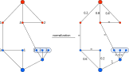

<h1><a class="anchor" id="cm-excess-heat-transport-potential" href="#cm-excess-heat-transport-potential"><i class="fa fa-link"></i></a>CM Acmhainneacht iomarcach iompair teasa</h1><h2><a class="anchor" id="table-of-contents" href="#table-of-contents"><i class="fa fa-link"></i></a> Clár ábhair</h2><ul><li> <a href="#in-a-glance">Sracfhéachaint</a></li><li> <a href="#introduction">Réamhrá</a></li><li> <a href="#inputs-and-outputs">Ionchuir agus aschuir</a><ul><li> <a href="#inputs-and-outputs_input-layers-and-parameters">Sraitheanna agus paraiméadair ionchuir</a></li><li> <a href="#inputs-and-outputs_output">Aschur</a></li></ul></li><li> <a href="#method">Modh</a><ul><li> <a href="#method_overview">Forbhreathnú</a></li><li> <a href="#method_details">Sonraí</a></li><li> <a href="#method_implementation">Cur i bhFeidhm</a></li></ul></li><li> <a href="#github-repository-of-this-calculation-module">Stór GitHub den mhodúl ríofa seo</a></li><li> <a href="#quick-start">Tús tapa</a></li><li> <a href="#troubleshooting">Fabhtcheartú</a></li><li> <a href="#sample-run">Rith samplach</a></li><li> <a href="#how-to-cite">Conas a lua</a></li><li> <a href="#authors-and-reviewers">Údair agus léirmheastóirí</a></li><li> <a href="#license">Ceadúnas</a></li><li> <a href="#acknowledgement">Admháil</a></li></ul><h2><a class="anchor" id="in-a-glance" href="#in-a-glance"><i class="fa fa-link"></i></a> Sracfhéachaint</h2>
 Ríomhann an modúl seo an sreabhadh agus na costais a bhaineann le tarchur teasa ó fhoinsí teasa breise a d’fhéadfadh a bheith suite lasmuigh de cheantair téimh ceantair ionchasacha go dtí an limistéar teasa ceantair. Is iad na hionchuir próifílí ualaigh in aghaidh na huaire den ró-shreabhadh teasa agus an t-éileamh ar théamh ceantair, suíomh na foinse teasa iomarcacha agus an chórais téimh ceantair ionchasach, costais infheistíochta i malartóirí teasa agus línte tarchuir agus luachanna tairsí le haghaidh costas achair agus tarchuir.

 <a href="#table-of-contents"><strong><code>To Top</code></strong></a>
<h2><a class="anchor" id="introduction" href="#introduction"><i class="fa fa-link"></i></a> Réamhrá</h2>
 Cuideoidh an Modúl Ríomh &quot;Acmhainneacht Iompair Teasa Iompair&quot; leis an úsáideoir poitéinseal comhtháthaithe le haghaidh barraíocht teasa i líonraí téimh ceantair a aithint. Tá na féidearthachtaí bunaithe ar <a href="https://wiki.hotmaps.hevs.ch/en/CM-District-heating-potential-areas-user-defined-thresholds">Acmhainneacht Teasa Dúiche CM</a> . Aithníonn an CM seo ceantair le coinníollacha fabhracha do líonraí téimh ceantair agus taispeánann sé an méid teasa a d’fhéadfadh a bheith clúdaithe ag barraíocht teasa tionsclaíoch sna ceantair seo. Ní chiallaíonn sé sin, áfach, go bhfuil líonra teasa ceantair ann cheana sa réigiún seo.

 Cuirtear na sonraí agus na modhanna seo a leanas le chéile don tasc roimhe seo.

 Sonraí:
<ul><li>
 Ceanglais téimh do cheantair in aice láimhe le coinníollacha fabhracha do líonraí téimh ceantair, a thuaslagadh in aghaidh na huaire (ón <a href="https://wiki.hotmaps.hevs.ch/en/CM-District-heating-potential-areas-user-defined-thresholds">CM - Acmhainn Teasa Dúiche</a> ).
</li><li>
 Sonraí faoi chainníochtaí teasa iomarcacha cuideachtaí tionsclaíocha sa cheantar, a réitítear in aghaidh na huaire freisin (ó bhunachar sonraí tionsclaíoch na tacar sonraí).
</li><li>
 Boinn tuisceana faoi chostais malartóirí teasa, caidéil agus píblínte chomh maith le caillteanais teasa do phíblínte teasa ceantair.
</li></ul>
 Modh (simplithe):
<ul><li> Dearadh píblíne ar bhonn heorastúla forbartha, a léiríonn fadhb an dearaidh mar fhadhb sreafa líonra.</li></ul>
 Is é aidhm an mhodha an sreabhadh teasa iomarcach is mó a léiriú gan an iomarca píblínte agus dá bhrí sin píblínte ró-fhada do na húsáideoirí teasa ceantair féideartha trí líonraí a ghiniúint leis na sreafaí uasta. Mar sin féin, ní mheastar línte iompair atá mí-éifeachtach go háirithe (le sreafaí teasa ísle agus dá bhrí sin costais arda iompair teasa ar leith) sa líonra deiridh. Is féidir leis an úsáideoir an tairseach maidir le héifeachtúlacht eacnamaíoch línte iompair aonair a shonrú (cf. Tairseach na líne tarchuir).

 Seo a leanas cúlra bunúsach an chur chuige: mura bhfuil ann ach cúpla foinse teasa breise, d’fhéadfaí píblíne amháin in aghaidh na foinse a chur san áireamh i gcónaí chun an teas a iompar go limistéar in aice láimhe le coinníollacha fabhracha maidir le téamh ceantair. Mar sin féin, má tá roinnt foinsí teasa breise ann atá le sreabhadh isteach sa limistéar céanna, bheadh sé ciallmhar an teas a bhailiú agus é a iompar chuig an limistéar i bpíblíne coitianta níos mó. Is gnách go ndéanann an cur chuige le píopa amháin in aghaidh na foinse an iarracht do na píblínte a rómheastachán.

 Chun dul i gcoinne an méid thuas, rinneadh fadhb na pleanála píblíne a chomhfhogasú trí ghlacadh le fadhb sreafa líonra. Úsáidtear modh heorastúil chun an fhadhb a réiteach, inar féidir an iomarca teasa a chuachadh agus a iompar chuig na húsáideoirí féideartha. Déantar cur síos sa chuid mhodheolaíoch chomhfhreagrach ar dhearadh modheolaíoch coincréite an tuaslagáin le cur chuige an chrainn réise íosta. Dá bhrí sin, ní hionann dearadh na píblíne a socraíodh sa chomhthéacs roimhe seo agus pleanáil mhionsonraithe nó treoir bhealaigh fhíor, ach ní úsáidtear é ach chun comhfhogasú costas do dháileadh na gcainníochtaí teasa iomarcacha sna ceantair in aice láimhe le coinníollacha fabhracha do líonraí téimh ceantair. (féach <a href="https://wiki.hotmaps.hevs.ch/en/CM-District-heating-potential-areas-user-defined-thresholds">CM - Acmhainneacht Teasa Dúiche</a> , réimsí comhleanúnacha eochairfhocal). Mar sin tagraíonn comhfhogasú na gcostas don líonra iomlán.

 Ba cheart na torthaí a léirmhíniú ar dtús mar seo a leanas: dá ndéanfaí na cainníochtaí teasa iomarcacha taifeadta a iompar le chéile go dtí na ceantair in aice láimhe a luaitear, ansin d’fhéadfadh na costais ar dháileadh teasa a bheith in ord méide mar a léiríonn an uirlis (cf. Costas leibhéalta de sholáthar teasa). De ghnáth, is táscaire maith tosaigh iad na luachanna don líonra iomlán do phíblínte aonair. Is é cuspóir na dtorthaí, dá bhrí sin, ord méide a sholáthar d’fhorbróir tionscadail nó do phleanálaí le haghaidh costas dáilte féideartha.

 <a href="#table-of-contents"><strong><code>To Top</code></strong></a>
<h2><a class="anchor" id="inputs-and-outputs" href="#inputs-and-outputs"><i class="fa fa-link"></i></a> Ionchuir agus aschuir</h2><h3><a class="anchor" id="input-layers-and-parameters" href="#input-layers-and-parameters"><i class="fa fa-link"></i></a> Sraitheanna agus paraiméadair ionchuir</h3><h4><a class="anchor" id="provided-by-toolbox" href="#provided-by-toolbox"><i class="fa fa-link"></i></a> Arna chur ar fáil ag Bosca Uirlisí</h4><ul><li>
 Limistéir téimh ceantair (curtha ar fáil go díreach anois ag an CM féideartha teasa)
</li><li>
 Bunachar sonraí tionsclaíoch (arna sholáthar de réir réamhshocraithe ag an mbosca uirlisí)
</li><li>
 Próifílí luchtaithe don tionscal
</li><li>
 Próifílí luchtaithe le haghaidh téimh chónaithe agus uisce te baile
</li></ul><h4><a class="anchor" id="provided-by-the-user" href="#provided-by-the-user"><i class="fa fa-link"></i></a> Arna sholáthar ag an úsáideoir</h4><ul><li>
 Min. éileamh teasa in aghaidh an heicteáir

 Féach <a href="https://wiki.hotmaps.hevs.ch/en/CM-District-heating-potential-areas-user-defined-thresholds">CM - Acmhainn Teasa Dúiche</a> .
</li><li>
 Min. éileamh teasa i limistéar DH

 Féach <a href="https://wiki.hotmaps.hevs.ch/en/CM-District-heating-potential-areas-user-defined-thresholds">CM - Acmhainn Teasa Dúiche</a> .
</li><li>
 Fad saoil an trealaimh le blianta

 Tá costais leibhéalta teasa ag tagairt don tréimhse ama seo.
</li><li>
 Ráta lascaine i%

 Ráta úis creidmheasa a theastaíonn chun an líonra a thógáil.
</li><li>
 Fachtóir costais

 Fachtóir chun costais líonra a oiriúnú i gcás nach ionann na luachanna réamhshocraithe agus na costais go cruinn. Déantar na hinfheistíochtaí atá riachtanach don líonra a iolrú leis an bhfachtóir seo. Is féidir costais réamhshocraithe a fháil sa chuid <a href="en-CM-Excess-heat-transport-potential#computation-of-costs">Ríomh na gcostas</a> .
</li><li>
 Costais oibríochta i%

 Costais oibríochta an líonra in aghaidh na bliana. I faoin gcéad de na hinfheistíochtaí is gá don líonra.
</li><li>
 Luach tairsí do línte tarchuir i ct / kWh

 Uaschostas leibhéalta teasa gach líne tharchuir aonair. Is féidir an paraiméadar seo a úsáid chun costas leibhéalta teasa an líonra iomláin a rialú. Is ionann luach níos ísle agus costas teasa ar leibhéal níos ísle ach laghdú sa bhreis teasa a úsáidtear agus a mhalairt.
</li></ul><h4><a class="anchor" id="performance-parameters" href="#performance-parameters"><i class="fa fa-link"></i></a> Paraiméadair Feidhmíochta</h4><ul><li>
 Réiteach ama

 Socraíonn sé an t-eatramh idir ríomhanna sreafa an líonra i rith na bliana iomláine. Is féidir é a bheith ar cheann de na luachanna seo: (uair, lá, seachtain, mí, bliain)
</li></ul>
 <a href="#table-of-contents"><strong><code>To Top</code></strong></a>
<h3><a class="anchor" id="output" href="#output"><i class="fa fa-link"></i></a> Aschur</h3><h4><a class="anchor" id="layers" href="#layers"><i class="fa fa-link"></i></a> Sraitheanna</h4><ul><li>
 Línte tarchuir

 Shapefile a thaispeánann na línte tarchuir a mholtar lena dteocht, a sreabhadh teasa bliantúil agus a gcostas. Is féidir sonraí a fháil anseo.
</li></ul><h4><a class="anchor" id="indicators" href="#indicators"><i class="fa fa-link"></i></a> Táscairí</h4><ul><li>
 Teas iomarcach iomlán sa limistéar roghnaithe i GWh

 Teas iomarcach iomlán plandaí tionsclaíocha i limistéar roghnaithe agus cóngaracht.
</li><li>
 Teas iomarcach ceangailte i GWh

 Teas iomarcach iomlán plandaí tionsclaíocha atá ceangailte le líonra.
</li><li>
 Teas iomarcach a úsáidtear i GWh

 Teas iarbhír iarbhír a úsáidtear le haghaidh DH.
</li><li>
 Infheistíochtaí is gá don líonra i €

 Infheistíocht ag teastáil chun an líonra a thógáil.
</li><li>
 Costais bhliantúla an líonra i € / bliain

 Costais de bharr blianachtaí agus chostais oibríochta an líonra in aghaidh na bliana.
</li><li>
 Costais leibhéalta an tsoláthair teasa i ct / kWh

 costas leibhéalta teasa an ghréasáin iomláin.
</li></ul><h4><a class="anchor" id="graphics" href="#graphics"><i class="fa fa-link"></i></a> Grafaic</h4><ul><li>
 Acmhainneacht DH agus barraíocht teasa

 Grafach ag taispeáint acmhainneacht DH, an iomarca teasa iomláin, an iomarca teasa ceangailte agus an iomarca teasa in úsáid. Is féidir sonraí a fháil <a href="en-CM-Excess-heat-transport-potential#dh-potential-and-excess-heat">anseo</a> .
</li><li>
 Teas iomarcach a úsáidtear agus infheistíocht riachtanach

 Grafach ag taispeáint barraíocht teasa seachadta bliantúil don infheistíocht atá riachtanach don líonra. Is féidir sonraí a fháil <a href="en-CM-Excess-heat-transport-potential#excess-heat-used-and-investment-necessary">anseo</a> .
</li><li>
 Cuair luchtaithe

 Grafach ag taispeáint éileamh teasa míosúil agus farasbarr. Is féidir sonraí a fháil <a href="en-CM-Excess-heat-transport-potential#load-curves">anseo</a> .
</li><li>
 Cuair luchtaithe

 Grafach a thaispeánann an meánéileamh teasa laethúil agus an iomarca. Is féidir sonraí a fháil <a href="en-CM-Excess-heat-transport-potential#load-curves">anseo</a> .
</li></ul><h4><a class="anchor" id="examples-of-layer" href="#examples-of-layer"><i class="fa fa-link"></i></a> Samplaí de Chiseal</h4><h5><a class="anchor" id="transmission-lines" href="#transmission-lines"><i class="fa fa-link"></i></a> Línte tarchuir</h5><figcaption> <i> Sampla de líne tharchuir atá ar taispeáint sa bhosca uirlisí</i></figcaption>
 Trí chliceáil ar an líne tharchuir nochtfar faisnéis bhreise.
<h4><a class="anchor" id="examples-of-graphics" href="#examples-of-graphics"><i class="fa fa-link"></i></a> Samplaí de Ghrafaic</h4><h5><a class="anchor" id="dh-potential-and-excess-heat" href="#dh-potential-and-excess-heat"><i class="fa fa-link"></i></a> Acmhainneacht DH agus barraíocht teasa</h5>
 <em>Déanann an ghrafach seo comparáid idir acmhainneacht DH, an iomarca teasa iomláin, an iomarca teasa ceangailte agus an iomarca teasa a úsáidtear.</em>

 Is féidir tuilleadh faisnéise faoin éileamh bliantúil teasa agus acmhainneacht DH a fháil <a href="CM-District-heating-potential-areas-user-defined-thresholds">anseo</a> . Tá an barraíocht teasa atá ceangailte le teas agus an iomarca teasa a úsáidtear mar an gcéanna lena dtáscairí atá ainmnithe go cothrom, sa chuid <a href="en-CM-Excess-heat-transport-potential#inputs-and-outputs_input-layers-and-parameters">Ionchuir agus Aschuir</a> .
<h5><a class="anchor" id="load-curves" href="#load-curves"><i class="fa fa-link"></i></a> Cuair luchtaithe</h5><figure><figcaption><i> </i>
 <i>Taispeánann an ghrafach seo an sreabhadh iomlán tríd an líonra i rith na bliana. Léiríonn an ghrafach íochtarach an meán lá.</i>
</figcaption></figure>
 Léiríonn an x-ais am agus an chumhacht y-ais. Léiríonn na cuair ghorma éileamh teasa na limistéar DH agus dearg an teas breise atá ar fáil. Léiríonn crosbhealach an dá chuair an sreabhadh iomlán teasa. Taispeánann an ghrafach uachtarach an sreabhadh i rith na bliana agus an ceann bun sreabhadh an ghnáthlae. Tabhair faoi deara gur gá <a href="en-CM-Excess-heat-transport-potential#performance-parameters">réiteach ama</a> a shocrú ar a laghad go “mí” don uachtair agus don “uair an chloig” chun go mbeidh an grafach íochtarach ionadaíoch.

 <a href="#table-of-contents"><strong><code>To Top</code></strong></a>
<h2><a class="anchor" id="method" href="#method"><i class="fa fa-link"></i></a> Modh</h2><h3><a class="anchor" id="overview" href="#overview"><i class="fa fa-link"></i></a> Forbhreathnú</h3>
 Is í príomhghné an mhodúil teasa iomarcach an tsamhail doirteal foinse a úsáidtear. Tógann sé líonra tarchuir ar a laghad faid agus ríomhtar an sreabhadh do gach uair an chloig den bhliain bunaithe ar phróifílí ualaigh téimh chónaithe le taifeach NUTS 2 agus próifílí ualaigh tionscail le taifeach NUTS 0. Bunaithe ar bhuaicshreafaí ar an meán i rith na bliana is féidir costais do gach líne tharchuir agus malartóir teasa ar thaobh na foinse agus an doirteal a ríomh.

 <a href="#table-of-contents"><strong><code>To Top</code></strong></a>
<h3><a class="anchor" id="details" href="#details"><i class="fa fa-link"></i></a> Sonraí</h3><h4><a class="anchor" id="modeling-of-sources" href="#modeling-of-sources"><i class="fa fa-link"></i></a> Samhaltú foinsí</h4>
 Bunaithe ar ID NUTS 0 agus ar an earnáil thionsclaíoch sanntar próifíl ualaigh réitithe in aghaidh na bliana do gach foinse.
<h4><a class="anchor" id="modeling-of-sinks" href="#modeling-of-sinks"><i class="fa fa-link"></i></a> Samhaltú doirteal</h4>
 Bunaithe ar an modúl ríofa féideartha teasa téite ceantair cruthaítear pointí iontrála go cothrom sna ceantair chomhleanúnacha. Ag brath ar ID NUTS 2 na bpointí iontrála sanntar próifíl ualaigh.
<h4><a class="anchor" id="fixed-radius-search" href="#fixed-radius-search"><i class="fa fa-link"></i></a> Cuardach ga seasta</h4>
 Laistigh de gha réamhshocraithe, déantar seiceáil ar na foinsí atá i raon a chéile, cé na siní atá i raon a chéile agus cé na doirteal atá i raon na bhfoinsí. Is féidir é seo a léiriú le graf le foinsí agus siní ag foirmiú na rinn agus na rinn sa raon á nascadh le ciumhais.
<h4><a class="anchor" id="reduction-to-minimum-length-network" href="#reduction-to-minimum-length-network"><i class="fa fa-link"></i></a> Laghdú ar an líonra faid íosta</h4>
 Ríomhtar íoschrann a chuimsíonn fad na n-imill mar mheáchain. Mar thoradh air seo coimeádann graf a nascacht agus íosfhad iomlán na n-imill aige. Tabhair faoi deara go bhfuil pointí iontrála na limistéar comhleanúnach ceangailte go hinmheánach saor in aisce ós rud é gur líonra dáileacháin féin iad.
<h4><a class="anchor" id="flow-computation" href="#flow-computation"><i class="fa fa-link"></i></a> Ríomh sreafa</h4>
 Ríomhtar an sreabhadh uasta ó na foinsí go dtí na doirteal gach uair an chloig den bhliain.
<h4><a class="anchor" id="cost-determination" href="#cost-determination"><i class="fa fa-link"></i></a> Cinneadh costais</h4>
 Cinneann buaic-sreabhadh na bliana ar an meán thar 3 uair an chloig an acmhainn riachtanach do na línte tarchuir agus na malartóirí teasa. Braitheann costais na línte tarchuir ar an bhfad agus an toilleadh, agus ní bhíonn tionchar ag an gcumas ach ar chostais na malartóirí teasa. Ar thaobh na foinse, glactar le malartóir teasa aer go leacht le caidéal comhtháite don líne tharchuir agus ar thaobh an doirteal glactar le malartóir teasa leachtaigh.
<h4><a class="anchor" id="variation-of-network" href="#variation-of-network"><i class="fa fa-link"></i></a> Athrú líonra</h4>
 Ó tharla go bhfuil costas agus sreabhadh gach líne tharchuir ar eolas is féidir na línte leis an gcóimheas costais is sreafa is airde a bhaint agus an sreabhadh a aisíoc go dtí go mbainfear amach an costas inmhianaithe in aghaidh an tsreafa.

 <a href="#table-of-contents"><strong><code>To Top</code></strong></a>
<h3><a class="anchor" id="implementation" href="#implementation"><i class="fa fa-link"></i></a> Cur i bhFeidhm</h3><h4><a class="anchor" id="fixed-radius-search" href="#fixed-radius-search"><i class="fa fa-link"></i></a> Cuardach ga seasta</h4>
 Chun an fad idir dhá phointe a ríomh, úsáidtear comhfhogasú uillinne beag den fhad loxodrome. Cé go gcuirtear an t-achar ortadómach i bhfeidhm go cruinn freisin níl aon bhuntáiste dáiríre ag an cruinneas méadaithe mar gheall ar na faid bheaga atá níos ísle ná 20km den chuid is mó agus éiginnteacht fad na líne tarchuir dáiríre mar gheall ar go leor fachtóirí cosúil le topology. Má tá dhá phointe i raon an gha stóráiltear é ar liosta aclaíochta. Cruthaítear liostaí oiriúnachta den sórt sin idir foinsí agus foinsí, doirteal agus doirteal, agus foinsí agus doirteal. Is í an chúis atá leis an scaradh ná an tsolúbthacht chun riachtanais teochta áirithe a chur le foinsí nó doirteal.
<figure><figcaption> <i> Sampla de chuardach ga seasta. Léiríonn na rinní dearga foinsí agus téann na cinn ghorma go tóin poill. Léiríonn na huimhreacha an fad idir na pointí. Níl an líníocht de réir scála.</i></figcaption></figure><h4><a class="anchor" id="networkgraph-class" href="#networkgraph-class"><i class="fa fa-link"></i></a> Rang NetworkGraph</h4>
 Bunaithe ar an leabharlann igraph cuirtear rang NetworkGraph i bhfeidhm leis an bhfeidhmiúlacht go léir a theastaíonn don mhodúl ríofa. Cé go bhfuil droch-dhoiciméadú déanta ar igraph, tairgeann sé feidhmíocht i bhfad níos fearr ná modúil python íon mar NetworkX agus tacaíocht ardáin níos leithne seachas Linux, murab ionann agus graf-uirlis. Déanann an rang NetworkGraph cur síos ar líonra amháin ar an dromchla ach tá 3 ghraf éagsúla ann. Ar dtús, an graf a chuireann síos ar an líonra mar atá sé sainithe ag na trí liosta aclaíochta. Ar an dara dul síos, déanann an graf comhfhreagrais siní a nascadh go hinmheánach den limistéar comhleanúnach céanna agus maireann sé an graf sreafa uasta a úsáidtear don ríomh sreafa uasta.
<h5><a class="anchor" id="graph" href="#graph"><i class="fa fa-link"></i></a> Graf</h5>
 Níl ann ach na fíorfhoinsí agus doirtil mar rinn.
<figure><figcaption> <i> Sampla de ghraf. Léiríonn na rinní dearga foinsí agus téann na cinn ghorma go tóin poill.</i></figcaption></figure><h5><a class="anchor" id="correspondence-graph" href="#correspondence-graph"><i class="fa fa-link"></i></a> Graf comhfhreagrais</h5>
 Teastaíonn id chomhfhreagrais ó gach doirteal, a thugann le fios an bhfuil sé ceangailte go hinmheánach ag líonra atá ann cheana mar atá i gceantair chomhleanúnacha. Tá siní a bhfuil an id chomhfhreagrais chéanna acu ceangailte le rinn nua le himill le meáchain nialasacha. Tá sé seo ríthábhachtach chun íoschrann a chuimsíonn a ríomh agus an chúis a n-úsáidtear an graf comhfhreagrais dó. Cuirtear an ghné seo i bhfeidhm freisin maidir le foinsí ach ní úsáidtear í.
<figure><figcaption><i> </i>
 <i>Sampla de ghraf comhfhreagrais. Léiríonn na rinní dearga foinsí agus téann na cinn ghorma go tóin poill. Tá na trí doirteal ar dheis ceangailte go comhleanúnach le rinn níos mó</i>
</figcaption></figure><h5><a class="anchor" id="maximum-flow-graph" href="#maximum-flow-graph"><i class="fa fa-link"></i></a> Graf sreafa uasta</h5>
 Ós rud é nach dtacaíonn igraph le iliomad foinsí agus doirteal ina fheidhm sreafa uasta tá graf cúnta de dhíth. Tugann sé foinse gan teorainn agus rinn doirteal isteach. Tá gach fíorfhoinse ceangailte leis an bhfoinse gan teorainn agus tá gach doirteal fíor ceangailte leis an doirteal gan teorainn le ciumhais. Tabhair faoi deara má tá doirteal ceangailte le rinn comhfhreagrais beidh an rinn seo ceangailte seachas an doirteal féin.
<figure><figcaption><i> </i>
 <i>Sampla de ghraf sreafa uasta.</i>
</figcaption></figure><h5><a class="anchor" id="minimum-spanning-tree-computation" href="#minimum-spanning-tree-computation"><i class="fa fa-link"></i></a> Ríomh íosta crann a chuimsíonn</h5>
 Ríomhtar an t-íoschrann a chuimsíonn an graf comhfhreagrais. Bíonn an meáchan 0 i gcónaí ag na himill a nascann na doirteal comhleanúnacha agus mar sin fanfaidh siad i gcónaí mar chuid den íoschrann a chuimsíonn.
<figure><figcaption><i> </i>
 <i>Sampla de ghraf comhfhreagrais le meáchain gach imeall agus a íoschrann a chuimsíonn.</i>
</figcaption></figure><h5><a class="anchor" id="maximum-flow-computation" href="#maximum-flow-computation"><i class="fa fa-link"></i></a> Ríomh sreafa uasta</h5>
 Déantar an sreabhadh trí na himill a nascann na fíorfhoinsí nó na siní leis an bhfoinse nó an doirteal gan teorainn faoi seach a theorannú do fhíor-acmhainn gach foinse nó doirteal. Ar chúiseanna uimhriúla déantar na hacmhainní a normalú ionas gurb é an toilleadh is mó ná 1. Tá an sreabhadh tríd an bhfo-thacar imill atá sa ghraf comhfhreagrais teoranta do 1000 agus ba cheart go gcuirfeadh sé sin srian neamhshrianta ar gach dian. Ansin ríomhtar an sreabhadh uasta ón bhfoinse gan teorainn go dtí an doirteal gan teorainn agus athchóirítear an sreabhadh go dtí a mhéid bunaidh. Ós rud é nach bhfuil siní comhleanúnacha ceangailte go díreach le rinn an doirteal gan teorainn ach leis an rinn comhfhreagrais, tá an sreabhadh tríd teoranta do shuim gach doirteal comhleanúnach.
<figure><figcaption><i> </i>
 <i>Sampla de ghraf sreafa uasta agus toilleadh gach foinse agus doirteal. Taispeánann an graf ceart an sreabhadh uasta a cheadaítear trí gach imeall tar éis an normalú. Tabhair faoi deara go bhfuil uasteorainn iarbhír ar an sreabhadh uasta a cheadaítear trí na himill le siombail Infinity go 1000 sa chur i bhfeidhm.</i>
</figcaption></figure>
 Úsáideann cur i bhfeidhm na feidhme sreafa uasta igraph an algartam Brúigh-athbhreoslaithe. Níl an cineál algartam seo íogair ó thaobh costais agus b’fhéidir nach bhfaighidh sé an bealach is giorra i gcónaí chun an sreabhadh a ródú. Níl algartam atá íogair ó thaobh costais ar fáil in igraph agus is dóigh go mbeadh an fheidhmíocht íseal chun a bheith in ann sreabhadh in aghaidh na huaire a réiteach i rith na bliana. Ach mar gheall ar an laghdú roimh ré ar íoschrann a chuimsíonn na cásanna ina roghnaítear réiteach neamh-idéalach tá siad an-teoranta agus ní dócha. Tá an claonadh ag an algartam Brúigh-in-athbhreoslaithe an sreabhadh a rith tríd an méid imill is lú. Dealraíonn sé go bhfuil cur chun feidhme igraph cinntitheach in ord leithdháilte an tsreafa más uath-mhoirfeolaíochtaí iad na graif ar a laghad, rud atá tábhachtach don ríomh sreafa in aghaidh na huaire ós rud é go bhfuil aon ascalaithe sreafa a tugadh isteach go saorga neamh-inmhianaithe.
<figure><figcaption> <i> Sreabhadh arna ríomh ag an algartam sreafa uasta agus ag athsoláthar go dtí an méid bunaidh.</i></figcaption></figure><h4><a class="anchor" id="heat-sources" href="#heat-sources"><i class="fa fa-link"></i></a> Foinsí teasa</h4>
 Tógtar na foinsí teasa ón <strong><a href="https://gitlab.com/hotmaps/industrial_sites/industrial_sites_Industrial_Database">mbunachar sonraí tionsclaíoch.</a></strong> Cruthaítear próifíl ualaigh do gach láithreán bunaithe ar a gcuid teasa iomarcacha, Nuts0 ID agus na hearnála tionsclaíche. Tá sé beartaithe suíomhanna breise a chur leis.
<h4><a class="anchor" id="heat-sinks" href="#heat-sinks"><i class="fa fa-link"></i></a> Doirtil teasa</h4>
 Tá na doirtealraí teasa bunaithe ar cheantair chomhleanúnacha a bhfuil éileamh teasa orthu. Cruthaíonn na ceantair chomhleanúnacha masc do ghreille ar a gcuirtear pointí comhlántacha mar phointí iontrála. Ag brath ar an ID NUTS 2 roghnaithe sanntar próifíl téimh chónaithe do na siní. Tá sé beartaithe pointí iontrála agus doirtealáin a chur leis go saincheaptha.
<figure><figcaption> <i> Sampla de limistéar comhleanúnach agus na pointí iontrála ginte.</i></figcaption></figure><h4><a class="anchor" id="load-profiles" href="#load-profiles"><i class="fa fa-link"></i></a> Próifílí luchtaithe</h4>
 Is éard atá sna próifílí ualaigh luaite 8760 pointe a léiríonn an t-ualach ar feadh gach uair an chloig de na 365 lá. Is féidir tuilleadh faisnéise faoi na <strong><a href="https://gitlab.com/hotmaps/load_profile">próifílí ualaigh a fháil anseo.</a></strong>
<h4><a class="anchor" id="computation-of-costs" href="#computation-of-costs"><i class="fa fa-link"></i></a> Costais a ríomh</h4>
 Ó tharla go bhfuil toilleadh teasa mór ag córais téimh ceantair ní chiallaíonn buaic sa sreabhadh go gcaithfidh na línte tarchuir an spíce ghearr teasa sin a sheachadadh ar an toirt. Dá bhrí sin, déantar na hacmhainní riachtanacha atá ag na línte tarchuir agus na malartóirí teasa a chinneadh ag an mbuaicualach ar an meán. Go sonrach, úsáidtear an fheidhm diongbháilte numpy chun an sreabhadh a mheánú le trí huaire an chloig anuas trí chonspóid a dhéanamh le feidhm leanúnach. Ag brath ar an luach seo roghnaítear líne tharchuir ón tábla seo a leanas.

 <em>Costais shonracha na línte tarchuir a úsáidtear</em>

 | Cumhacht i MW | Costais i € / m | Teocht i ° C | | ------------- |: -------------: | -----: | | 0.2 | 195 | &lt;150 | | 0.3 | 206 | &lt;150 | | 0.6 | 220 | &lt;150 | | 1.2 | 240 | &lt;150 | | 1.9 | 261 | &lt;150 | | 3.6 | 288 | &lt;150 | | 6.1 | 323 | &lt;150 | | 9.8 | 357 | &lt;150 | | 20 | 426 | &lt;150 | | 45 | 564 | &lt;150 | | 75 | 701 | &lt;150 | | 125 | 839 | &lt;150 | | 190 | 976 | &lt;150 | | &gt; 190 | 976 | &lt;150 |

 Ríomhtar costais an malartóra teasa ar thaobh na foinse a nglactar leis mar aer go leacht

 C HSource (en-P) = Buaic P * 15,000 € / MW.

 Cinntear le costais an leachtaigh le malartóir teasa leachtaigh ar thaobh an doirteal

 C HSink (en-P) = Buaic P * 265,000 € / MW más buaic P &lt;1MW nó

 C HSink (en-P) = Buaic P * 100,000 € / MW eile.
<h4><a class="anchor" id="removal-of-transmission-lines" href="#removal-of-transmission-lines"><i class="fa fa-link"></i></a> Línte tarchuir a bhaint</h4>
 Le tairseach costais le sreabhadh do línte tarchuir, is féidir iad a bhaint má sháraíonn siad é chun an cóimheas sreafa go costas a fheabhsú. Tar éis imill a bhaint, caithfear an sreabhadh a aisíoc ós rud é nach ráthaítear leanúnachas an tsreafa sa ghraf níos mó. D’fhéadfadh go dtiocfadh méadú ar an gcóimheas costais le sreabhadh le haghaidh imill eile anois, mar sin déantar an próiseas seo arís agus arís eile go dtí nach n-athraíonn suim na sreafaí go léir níos mó.
<h4><a class="anchor" id="description-of-the-complete-routine" href="#description-of-the-complete-routine"><i class="fa fa-link"></i></a> Cur síos ar an ngnáthamh iomlán</h4>
 Ar dtús, tá na foinsí teasa agus na siní luchtaithe lena bpróifílí ualaigh. Ansin déantar an cuardach ga seasta, agus tosaítear an Líonra. Ina dhiaidh sin, laghdaítear an Líonra go dtí an t-íoschrann a chuimsíonn sé agus ríomhtar an sreabhadh uasta gach uair an chloig den bhliain. Ríomhtar na costais do gach malartóir teasa, caidéil agus líne tarchuir bunaithe ar an sreabhadh. Má shainítear cóimheas tairsí costais agus sreafa, déantar an nós imeachta um líne tharchuir a bhaint. Sa deireadh, tugtar costas iomlán agus sreabhadh iomlán an líonra agus leagan amach an líonra ar ais.

 <a href="#table-of-contents"><strong><code>To Top</code></strong></a>
<h2><a class="anchor" id="github-repository-of-this-calculation-module" href="#github-repository-of-this-calculation-module"><i class="fa fa-link"></i></a> Stór GitHub den mhodúl ríofa seo</h2>
 <a href="https://github.com/HotMaps/excess_heat_cm/tree/develop">Anseo</a> gheobhaidh tú an fhorbairt ceannródaíoch don mhodúl ríofa seo.

 <a href="#table-of-contents"><strong><code>To Top</code></strong></a>
<h2><a class="anchor" id="quick-start" href="#quick-start"><i class="fa fa-link"></i></a> Tús tapa</h2>
 Tá sé i gceist ag an CM - IOMLÁN IOMPAIR IOMPAIR TIONCHAIR atá ann faoi láthair cuidiú leis an úsáideoir poitéinseal comhtháthaithe le haghaidh barraíocht teasa i líonraí téimh ceantair a aithint. Cé go dtugtar go leor feidhmeanna anailíse d’fhonn gan an t-úsáideoir a shrianadh, caithfear a chur in iúl go sainráite nach pleanáil theicniúil mhionsonraithe é seo. Tá na féidearthachtaí bunaithe ar <a href="https://wiki.hotmaps.hevs.ch/en/CM-District-heating-potential-areas-user-defined-thresholds">Acmhainneacht Teasa Dúiche CM</a> . Aithníonn an CM seo ceantair le coinníollacha fabhracha do líonraí teasa ceantair. Mar sin taispeánann sé an méid teasa a d’fhéadfadh an iomarca teasa tionsclaíoch a chlúdach sna ceantair seo. Ní chiallaíonn sé sin, áfach, go bhfuil líonra teasa ceantair ann cheana sa réigiún seo. Dá bhrí sin, d’fhéadfadh sé go bhféachfadh sé seo a leanas ar úsáid na huirlise atá dírithe ar fheidhmchlár do chleachtóirí:
<ul><li>
 Más gá, cuir do chuid sonraí féin maidir le barraíocht teasa a sholáthraíonn an <a href="https://wiki.hotmaps.hevs.ch/en/CM-Add-industry-plant">gléasra tionscail breise</a> CM do chuideachtaí sa réigiún.
</li><li>
 Cas ar na &quot;Teas iomarcach suíomhanna tionsclaíocha&quot;
</li><li>
 Forghníomhú an CM - POTENTIAL IOMPAIR TÉARMAÍ BREISE.
</li><li>
 An luach
</li></ul><figure><figcaption> <i>Déanann an ghrafach seo comparáid idir acmhainneacht DH, an iomarca teasa iomláin, an iomarca teasa ceangailte agus an iomarca teasa a úsáidtear.</i></figcaption></figure>
 Taispeánann an ghrafach seo an méid teasa a d’fhéadfadh an iomarca teasa a chlúdach sa limistéar imscrúdaithe.
<ul><li> Luach</li></ul><figure><figcaption> <i>Táscairí Infheistíochtaí riachtanach, Costais bhliantúla agus costas leibhéalta teasa</i></figcaption></figure>
 Taispeánann an ghrafach seo na costais shonracha táirgeachta teasa don líonra iomlán. Nóta: rinneadh na costais a thaispeántar a mheas ag úsáid cur chuige simplithe. Ní bhaineann na costais seo le píblínte aonair. Mar sin féin, is féidir na costais a thaispeántar a úsáid mar bhonn tuisceana simplithe mar chostais iompair chun an iomarca teasa a chomhtháthú i líonra teasa ceantair in aice láimhe, b’fhéidir.

 Ón méid thuas, d’fhéadfaí an t-ordlathas oibre seo a leanas a úsáid:
<ol><li>
 Seiceáil an bhfuil líonra teasa ceantair ann nó an bhfuil sé beartaithe sa réigiún atá faoi bhreithniú.
</li><li>
 Tá sreafaí sna píopaí a thaispeántar. Is féidir leat a fheiceáil ansin an méid teasa a iompraítear ó na foinsí faoi seach. D’fhéadfaí teagmháil a dhéanamh anois leis na cuideachtaí atá buailte. Is dócha ar dtús na cuideachtaí a bhfuil cainníochtaí arda acu.
</li></ol><figure><figcaption> <i>Líne tarchuir agus a sreabhadh</i></figcaption></figure><ol start="3"><li> Má tá suim ag oibreoir an líonra téimh ceantair agus táirgeoir an iomarca teasa comhoibriú, d’fhéadfaí staidéir féidearthachta níos mionsonraithe a choimisiúnú. Sa chás is fearr, cuideoidh na sonraí a thaispeántar le fíor-thionscadail a thionscnamh.</li></ol>
 <a href="#table-of-contents"><strong><code>To Top</code></strong></a>
<h2><a class="anchor" id="troubleshooting" href="#troubleshooting"><i class="fa fa-link"></i></a> Fabhtcheartú</h2><h3><a class="anchor" id="cm-does-not-finish" href="#cm-does-not-finish"><i class="fa fa-link"></i></a> Ní chríochnaíonn CM</h3><ul><li> Rún spásúil a laghdú</li><li> Laghdaigh am</li><li> Roghnaigh limistéar níos lú</li><li> Rerun ag pointe níos déanaí</li></ul><h3><a class="anchor" id="cm-crashes-without-a-message" href="#cm-crashes-without-a-message"><i class="fa fa-link"></i></a> Tuairteanna CM gan teachtaireacht</h3><ul><li> Rerun ag pointe níos déanaí</li><li> Déan teagmháil le forbróir CM</li></ul><h3><a class="anchor" id="error--"no-dh-area-in-selection."" href="#error--"no-dh-area-in-selection.""><i class="fa fa-link"></i></a> Earráid: &quot;Níl aon limistéar DH sa roghnú.&quot;</h3>
 Seiceáil <a href="https://wiki.hotmaps.hevs.ch/en/CM-District-heating-potential-areas-user-defined-thresholds">DH Poitéinseal CM</a> chun ionchuir a oiriúnú ionas go gcruthófar limistéar DH.
<h3><a class="anchor" id="error--"no-industrial-sites-in-the-selected-area."" href="#error--"no-industrial-sites-in-the-selected-area.""><i class="fa fa-link"></i></a> Earráid: &quot;Gan aon láithreáin tionsclaíocha sa limistéar roghnaithe.&quot;</h3>
 Seiceáil an ciseal &quot;suíomhanna tionsclaíocha&quot; sa roghnú úsáideora.
<h3><a class="anchor" id="error--"no-entry-points-in-selected-area."" href="#error--"no-entry-points-in-selected-area.""><i class="fa fa-link"></i></a> Earráid: &quot;Gan aon phointí iontrála sa limistéar roghnaithe.&quot;</h3>
 Seiceáil <a href="#troubleshooting_warning-no-industry-profiles-available-for">rabhadh</a> .
<h3><a class="anchor" id="error--"no-industrial-sites-in-range."" href="#error--"no-industrial-sites-in-range.""><i class="fa fa-link"></i></a> Earráid: &quot;Níl aon láithreáin tionsclaíocha sa raon.&quot;</h3>
 Roghnaigh limistéar níos mó, ina bhfaighidh tú láithreán tionsclaíoch amháin ar a laghad bunaithe ar an tacar sonraí tionsclaíoch réamhshocraithe atá ar fáil i mbosca uirlisí Hotmaps.
<h3><a class="anchor" id="error--"no-excess-heat-used."" href="#error--"no-excess-heat-used.""><i class="fa fa-link"></i></a> Earráid: &quot;Níor úsáideadh aon teas breise.&quot;</h3>
 <a href="#inputs-and-outputs_input-layers-and-parameters_provided-by-the-user">Tairseach na líne tarchuir a mhéadú</a>
<h3><a class="anchor" id="warning--"no-industry-profiles-available-for-..."" href="#warning--"no-industry-profiles-available-for-...""><i class="fa fa-link"></i></a> Rabhadh: &quot;Níl aon phróifílí tionscail ar fáil do ...&quot;</h3>
 Seiceáil tír agus fo-earnáil na suíomhanna tionsclaíocha uaslódáilte.
<h3><a class="anchor" id="warning--"no-residential-heating-profile-available-for-..."" href="#warning--"no-residential-heating-profile-available-for-...""><i class="fa fa-link"></i></a> Rabhadh: &quot;Níl aon phróifíl teasa cónaithe ar fáil do ...&quot;</h3>
 Níl rochtain ag CM ar shonraí próifíl téimh chónaithe atá le déanamh sa réimse seo.

 <a href="#table-of-contents"><strong><code>To Top</code></strong></a>
<h2><a class="anchor" id="sample-run" href="#sample-run"><i class="fa fa-link"></i></a> Rith samplach</h2>
 Rith samplach i PL22 le paraiméadair réamhshocraithe. Moltar suíomhanna breise teasa a chasadh air sa chluaisín sraitheanna.
<figure><figcaption> <i>Rith samplach i PL22. Léiríonn na ceantair bándearg an téamh ceantair. Ciorclaíonn an oráiste an fhoinse teasa agus línteíonn an oráiste línte tarchuir an líonra.</i></figcaption></figure><figure><figcaption> <i> Taispeánann an ghrafach seo an sreabhadh iomlán tríd an líonra i rith na bliana. Léiríonn an ghrafach íochtarach an meán lá. Ós rud é go socraítear &quot;seachtain&quot; an taifeach ama réamhshocraithe tá sé seasmhach sa chás seo.</i></figcaption></figure>
 <a href="#table-of-contents"><strong><code>To Top</code></strong></a>
<h2><a class="anchor" id="how-to-cite" href="#how-to-cite"><i class="fa fa-link"></i></a> Conas a lua</h2>
 Ali Aydemir agus David Schilling, i Hotmaps Wiki, CM Acmhainneacht iomarcach iompair teasa (Meán Fómhair 2020)

 <a href="#table-of-contents"><strong><code>To Top</code></strong></a>
<h2><a class="anchor" id="authors-and-reviewers" href="#authors-and-reviewers"><i class="fa fa-link"></i></a> Údair agus léirmheastóirí</h2>
 Scríobh Ali Aydemir agus David Schilling ( <strong><a href="https://isi.fraunhofer.de/">Fraunhofer ISI</a></strong> ) an leathanach seo.

 ☑ Rinne Tobias Fleiter ( <strong><a href="https://isi.fraunhofer.de/">Fraunhofer ISI</a></strong> ) athbhreithniú ar an leathanach seo.

 <a href="#table-of-contents"><strong><code>To Top</code></strong></a>
<h2><a class="anchor" id="license" href="#license"><i class="fa fa-link"></i></a> Ceadúnas</h2>
 Cóipcheart © 2016-2020: Ali Aydemir agus David Schilling

 Creative Commons Attribution 4.0 Ceadúnas Idirnáisiúnta

 Tá an obair seo ceadúnaithe faoi Cheadúnas Idirnáisiúnta Creative Commons CC BY 4.0.

 Aitheantóir SPDX-Ceadúnais: CC-BY-4.0

 Téacs an Cheadúnais: https://spdx.org/licenses/CC-BY-4.0.html

 <a href="#table-of-contents"><strong><code>To Top</code></strong></a>
<h2><a class="anchor" id="acknowledgement" href="#acknowledgement"><i class="fa fa-link"></i></a> Admháil</h2>
 Ba mhaith linn ár mbuíochas is doimhne a chur in iúl do <a href="https://www.hotmaps-project.eu">Thionscadal Hotmaps</a> Horizon 2020 (Comhaontú Deontais uimhir 723677), a chuir an maoiniú ar fáil chun an t-imscrúdú reatha a dhéanamh.

 <a href="#table-of-contents"><strong><code>To Top</code></strong></a>

<!--- THIS IS A SUPER UNIQUE IDENTIFIER -->

This page was automatically translated. View in another language:

[English](../en/CM-Excess-heat-transport-potential) (original) [Bulgarian](../bg/CM-Excess-heat-transport-potential)\* [Czech](../cs/CM-Excess-heat-transport-potential)\* [Danish](../da/CM-Excess-heat-transport-potential)\* [German](../de/CM-Excess-heat-transport-potential)\* [Greek](../el/CM-Excess-heat-transport-potential)\* [Spanish](../es/CM-Excess-heat-transport-potential)\* [Estonian](../et/CM-Excess-heat-transport-potential)\* [Finnish](../fi/CM-Excess-heat-transport-potential)\* [French](../fr/CM-Excess-heat-transport-potential)\*  [Croatian](../hr/CM-Excess-heat-transport-potential)\* [Hungarian](../hu/CM-Excess-heat-transport-potential)\* [Italian](../it/CM-Excess-heat-transport-potential)\* [Lithuanian](../lt/CM-Excess-heat-transport-potential)\* [Latvian](../lv/CM-Excess-heat-transport-potential)\* [Maltese](../mt/CM-Excess-heat-transport-potential)\* [Dutch](../nl/CM-Excess-heat-transport-potential)\* [Polish](../pl/CM-Excess-heat-transport-potential)\* [Portuguese (Portugal, Brazil)](../pt/CM-Excess-heat-transport-potential)\* [Romanian](../ro/CM-Excess-heat-transport-potential)\* [Slovak](../sk/CM-Excess-heat-transport-potential)\* [Slovenian](../sl/CM-Excess-heat-transport-potential)\* [Swedish](../sv/CM-Excess-heat-transport-potential)\* 

\* machine translated
