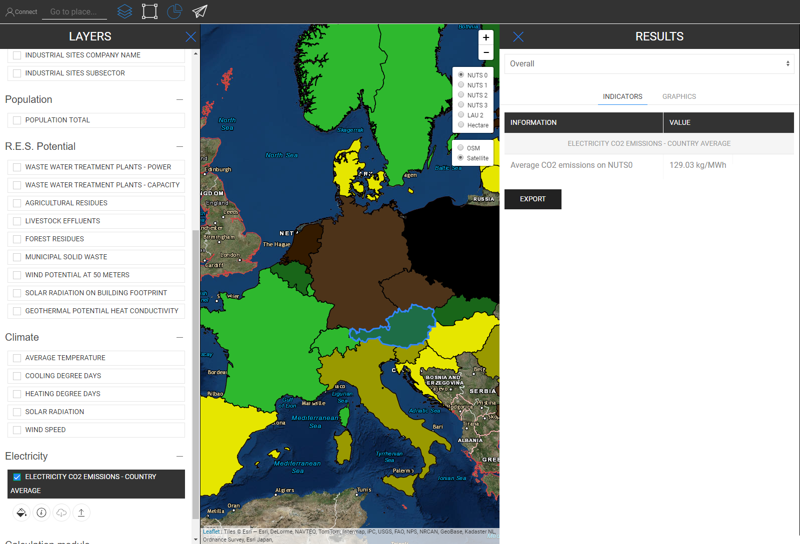

<h1><a class="anchor" id="retrieve-indicators-of-a-selected-area" href="#retrieve-indicators-of-a-selected-area"><i class="fa fa-link"></i></a>Faigh táscairí limistéar roghnaithe</h1><h2><a class="anchor" id="table-of-contents" href="#table-of-contents"><i class="fa fa-link"></i></a> Clár ábhair</h2><ul><li> <a href="#introduction">Réamhrá</a></li><li> <a href="#indicators-for-raster-layers">Táscairí le haghaidh sraitheanna raster</a><ul><li> <a href="#indicators-for-raster-layers_buildings">Foirgnimh</a></li><li> <a href="#indicators-for-raster-layers_population">Daonra</a></li><li> <a href="#indicators-for-raster-layers_renewable-energy-source-potentials">Poitéinseal Foinse Fuinnimh In-athnuaite</a></li></ul></li><li> <a href="#indicators-for-vector-layers">Táscairí do shraitheanna veicteora</a><ul><li> <a href="#indicators-for-vector-layers_industry">Tionscal</a></li><li> <a href="#indicators-for-vector-layers_renewable-energy-source-potentials">Poitéinseal Foinse Fuinnimh In-athnuaite</a></li><li> <a href="#indicators-for-vector-layers_electricity">Leictreachas</a></li></ul></li><li> <a href="#example">Sampla</a></li><li> <a href="#how-to-cite">Conas a lua</a></li><li> <a href="#authors-and-reviewers">Údair agus léirmheastóirí</a></li><li> <a href="#license">Ceadúnas</a></li><li> <a href="#acknowledgement">Admháil</a></li></ul><h2><a class="anchor" id="introduction" href="#introduction"><i class="fa fa-link"></i></a> Réamhrá</h2>
 Ag brath ar na sraitheanna agus an réigiún a roghnaigh tú taispeántar táscairí do do chumraíocht i mbarra taobh ar thaobh dheis do scáileáin

 <a href="#table-of-contents"><strong><code>To Top</code></strong></a>

 Ina dhiaidh seo, féachaimid ar na táscairí a thaispeántar le haghaidh sraitheanna raster agus veicteora.
<h2><a class="anchor" id="indicators-for-raster-layers" href="#indicators-for-raster-layers"><i class="fa fa-link"></i></a> Táscairí le haghaidh sraitheanna raster</h2>
 Tá na táscairí ar shraitheanna raster difriúil ó shraitheanna veicteora. Le difriúil, is éard atá i gceist againn i dtéarmaí comhiomlánaithe agus dí-chomhiomlánaithe. Tagann an t-iompar difriúil seo ó rúin chríochacha.

 De ghnáth bíonn taifeach i bhfad níos airde ag Sraitheanna Raster ach níl tréithe ag sraitheanna veicteora ach ag pointí nó polagáin.

 Ciallaíonn sé sin ar thaobh amháin mar shampla má roghnaíonn tú ciseal veicteora atá sainithe ag polagáin NUTS3 agus má theastaíonn uait, mar shampla, réigiún LAU a roghnú, ní dhéanfar luach NUTS3 a dhí-chomhbhailiú go leibhéal LAU, ina ionad sin, an táscaire NUTS3 ina bhfuil sé seo Taispeánfar réigiún LAU i mbarra taobh na dtorthaí.

 Ar an láimh eile, déantar sraitheanna raster a chomhiomlánú agus a dhí-chomhbhailiú &quot;go treallach&quot; *

 * de réir na gcealla ina bhfuil tú sa réigiún a roghnaigh tú (go nádúrtha laistigh de theorainn an taifeach raster féin)

 <a href="#table-of-contents"><strong><code>To Top</code></strong></a>
<h3><a class="anchor" id="buildings" href="#buildings"><i class="fa fa-link"></i></a> Foirgnimh</h3>
 <strong>Léarscáil Dlús Teasa</strong>

 <strong>Gné Bhreise</strong>

 Nuair a roghnaíonn tú an ciseal dlús teasa agus an Ciseal Daonra ag an am céanna taispeántar táscaire breise (féach pictiúr thíos)

 <a href="#table-of-contents"><strong><code>To Top</code></strong></a>
<h3><a class="anchor" id="in-general-" href="#in-general-"><i class="fa fa-link"></i></a> Go ginearálta:</h3>
 Nuair a roghnaítear ceann de na sraitheanna tógála agus an ciseal daonra ag an am céanna, taispeánfar táscaire breise mar a thuairiscítear roimhe seo

<ins> <code><strong><a href="#indicators-for-raster-layers">To Chapter</a></strong></code></ins>

 <strong>Léarscáil Dlús Fuarú</strong>

<ins> <code><strong><a href="#indicators-for-raster-layers">To Chapter</a></strong></code></ins>

 <strong>Imleabhair Foirgníochta</strong>

<ins> <code><strong><a href="#indicators-for-raster-layers">To Chapter</a></strong></code></ins>

 <strong>Achar urláir comhlán</strong>

<ins> <code><strong><a href="#indicators-for-raster-layers">To Chapter</a></strong></code></ins> <a href="#table-of-contents"><strong><code>To Top</code></strong></a>
<h3><a class="anchor" id="population" href="#population"><i class="fa fa-link"></i></a> Daonra</h3>

<ins> <code><strong><a href="#indicators-for-raster-layers">To Chapter</a></strong></code></ins> <a href="#table-of-contents"><strong><code>To Top</code></strong></a>
<h3><a class="anchor" id="climate" href="#climate"><i class="fa fa-link"></i></a> Aeráid</h3>
 <strong>Teocht</strong>

<ins> <code><strong><a href="#indicators-for-raster-layers">To Chapter</a></strong></code></ins>

 <strong>Laethanta Céime Fuarú</strong>

<ins> <code><strong><a href="#indicators-for-raster-layers">To Chapter</a></strong></code></ins>

 <strong>Laethanta Céime Teasa</strong>

<ins> <code><strong><a href="#indicators-for-raster-layers">To Chapter</a></strong></code></ins>

 <strong>Radaíocht na Gréine</strong>

<ins> <code><strong><a href="#indicators-for-raster-layers">To Chapter</a></strong></code></ins>

 <strong>Luas na Gaoithe</strong>

<ins> <code><strong><a href="#indicators-for-raster-layers">To Chapter</a></strong></code></ins> <a href="#table-of-contents"><strong><code>To Top</code></strong></a>
<h3><a class="anchor" id="renewable-energy-source-potentials" href="#renewable-energy-source-potentials"><i class="fa fa-link"></i></a> Poitéinseal Foinse Fuinnimh In-athnuaite</h3>
 <strong>Radaíocht na Gréine ar Lorg an Fhoirgnimh</strong>

<ins> <code><strong><a href="#indicators-for-raster-layers">To Chapter</a></strong></code></ins>

 <strong>Acmhainn Gaoithe ag 50m</strong>

<ins> <code><strong><a href="#indicators-for-raster-layers">To Chapter</a></strong></code></ins>

 <strong>Iarmhair Foraoise</strong>

<ins> <code><strong><a href="#indicators-for-raster-layers">To Chapter</a></strong></code></ins> <a href="#table-of-contents"><strong><code>To Top</code></strong></a>
<h2><a class="anchor" id="indicators-for-vector-layers" href="#indicators-for-vector-layers"><i class="fa fa-link"></i></a> Táscairí do shraitheanna veicteora</h2><h3><a class="anchor" id="industry" href="#industry"><i class="fa fa-link"></i></a> Tionscal</h3>
 <strong>Astaíochtaí Láithreán Tionscail</strong>

<ins> <code><strong><a href="#indicators-for-vector-layers">To Chapter</a></strong></code></ins>

 <strong>Teas Barrachais Láithreán Tionscail</strong>

<ins> <code><strong><a href="#indicators-for-vector-layers">To Chapter</a></strong></code></ins>

 <strong>Suíomh Cuideachta Tionscail Ainm na Cuideachta</strong>

<ins> <code><strong><a href="#indicators-for-vector-layers">To Chapter</a></strong></code></ins>

 <strong>Fo-earnáil Suíomh Tionscail</strong>

<ins> <code><strong><a href="#indicators-for-vector-layers">To Chapter</a></strong></code></ins> <a href="#table-of-contents"><strong><code>To Top</code></strong></a>
<h3><a class="anchor" id="renewable-energy-source-potentials" href="#renewable-energy-source-potentials"><i class="fa fa-link"></i></a> Poitéinseal Foinse Fuinnimh In-athnuaite</h3>
 <strong>Cumhacht Plandaí Cóireála Fuíolluisce</strong>

<ins> <code><strong><a href="#indicators-for-vector-layers">To Chapter</a></strong></code></ins>

 <strong>Cumas Gléasraí Cóireála Fuíolluisce</strong>

<ins> <code><strong><a href="#indicators-for-vector-layers">To Chapter</a></strong></code></ins>

 <strong>Iarmhair Talmhaíochta</strong>

<ins> <code><strong><a href="#indicators-for-vector-layers">To Chapter</a></strong></code></ins>

 <strong>Eisiltigh Beostoic</strong>

<ins> <code><strong><a href="#indicators-for-vector-layers">To Chapter</a></strong></code></ins>

 <strong>Dramhaíl Sholadach Bardasach</strong>

<ins> <code><strong><a href="#indicators-for-vector-layers">To Chapter</a></strong></code></ins>

 <strong>Seoltacht Teasa Féideartha Geoiteirmeach</strong>

<ins> <code><strong><a href="#indicators-for-vector-layers">To Chapter</a></strong></code></ins> <a href="#table-of-contents"><strong><code>To Top</code></strong></a>
<h3><a class="anchor" id="electricity" href="#electricity"><i class="fa fa-link"></i></a> Leictreachas</h3>
 <strong>Astaíochtaí Leictreachais C02</strong>

<ins> <code><strong><a href="#indicators-for-vector-layers">To Chapter</a></strong></code></ins> <a href="#table-of-contents"><strong><code>To Top</code></strong></a>
<h2><a class="anchor" id="example" href="#example"><i class="fa fa-link"></i></a> Sampla</h2>
 Sa phictiúr thíos is féidir leat a fheiceáil conas a fhéachann sí nuair a dhéantar amharc ar na sraitheanna uile (seo an Ostair mar a roghnaíodh NUTS0)

 Cé go bhféadfadh an léarscáil seo a bheith beagáinín mearbhall ar an gcéad amharc, léirítear a tháscairí go díreach. Féach thíos na táscairí go léir a ndéantar cur síos orthu i mbarra taobh an toraidh nuair a roghnaíonn tú na sraitheanna uile don Ostair (NUTS0)

 <a href="#table-of-contents"><strong><code>To Top</code></strong></a>
<h2><a class="anchor" id="how-to-cite" href="#how-to-cite"><i class="fa fa-link"></i></a> Conas a lua</h2>
 Jeton Hasani, i Hotmaps-Wiki, Retrieve-tablets-of-a-selected-area (Aibreán 2019)

 <a href="#table-of-contents"><strong><code>To Top</code></strong></a>
<h2><a class="anchor" id="authors-and-reviewers" href="#authors-and-reviewers"><i class="fa fa-link"></i></a> Údair agus léirmheastóirí</h2>
 Scríobh Jeton Hasani <strong><a href="https://eeg.tuwien.ac.at/">EEG - TU Wien an leathanach seo</a></strong> .

 ☑ Rinne Mostafa Fallahnejad <strong><a href="https://eeg.tuwien.ac.at/">EEG - TU Wien</a></strong> athbhreithniú ar an leathanach seo.

 <a href="#table-of-contents"><strong><code>To Top</code></strong></a>
<h2><a class="anchor" id="license" href="#license"><i class="fa fa-link"></i></a> Ceadúnas</h2>
 Cóipcheart © 2016-2020: Jeton Hasani

 Creative Commons Attribution 4.0 Ceadúnas Idirnáisiúnta

 Tá an obair seo ceadúnaithe faoi Cheadúnas Idirnáisiúnta Creative Commons CC BY 4.0.

 Aitheantóir SPDX-Ceadúnais: CC-BY-4.0

 Téacs an Cheadúnais: https://spdx.org/licenses/CC-BY-4.0.html

 <a href="#table-of-contents"><strong><code>To Top</code></strong></a>
<h2><a class="anchor" id="acknowledgement" href="#acknowledgement"><i class="fa fa-link"></i></a> Admháil</h2>
 Ba mhaith linn ár mbuíochas is doimhne a chur in iúl do <a href="https://www.hotmaps-project.eu">Thionscadal Hotmaps</a> Horizon 2020 (Comhaontú Deontais uimhir 723677), a chuir an maoiniú ar fáil chun an t-imscrúdú reatha a dhéanamh.

 <a href="#table-of-contents"><strong><code>To Top</code></strong></a> <code><a href="Indicator-Section/_edit">Review this page</a></code>

<!--- THIS IS A SUPER UNIQUE IDENTIFIER -->

This page was automatically translated. View in another language:

[English](../en/Retrieve-indicators-of-a-selected-area) (original) [Bulgarian](../bg/Retrieve-indicators-of-a-selected-area)\* [Czech](../cs/Retrieve-indicators-of-a-selected-area)\* [Danish](../da/Retrieve-indicators-of-a-selected-area)\* [German](../de/Retrieve-indicators-of-a-selected-area)\* [Greek](../el/Retrieve-indicators-of-a-selected-area)\* [Spanish](../es/Retrieve-indicators-of-a-selected-area)\* [Estonian](../et/Retrieve-indicators-of-a-selected-area)\* [Finnish](../fi/Retrieve-indicators-of-a-selected-area)\* [French](../fr/Retrieve-indicators-of-a-selected-area)\*  [Croatian](../hr/Retrieve-indicators-of-a-selected-area)\* [Hungarian](../hu/Retrieve-indicators-of-a-selected-area)\* [Italian](../it/Retrieve-indicators-of-a-selected-area)\* [Lithuanian](../lt/Retrieve-indicators-of-a-selected-area)\* [Latvian](../lv/Retrieve-indicators-of-a-selected-area)\* [Maltese](../mt/Retrieve-indicators-of-a-selected-area)\* [Dutch](../nl/Retrieve-indicators-of-a-selected-area)\* [Polish](../pl/Retrieve-indicators-of-a-selected-area)\* [Portuguese (Portugal, Brazil)](../pt/Retrieve-indicators-of-a-selected-area)\* [Romanian](../ro/Retrieve-indicators-of-a-selected-area)\* [Slovak](../sk/Retrieve-indicators-of-a-selected-area)\* [Slovenian](../sl/Retrieve-indicators-of-a-selected-area)\* [Swedish](../sv/Retrieve-indicators-of-a-selected-area)\* 

\* machine translated
