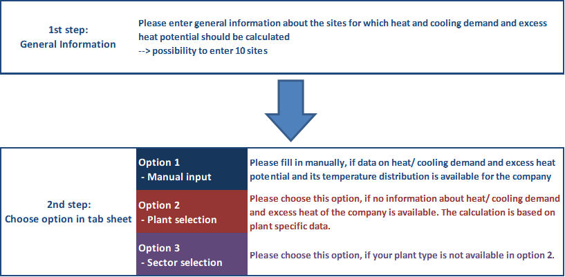
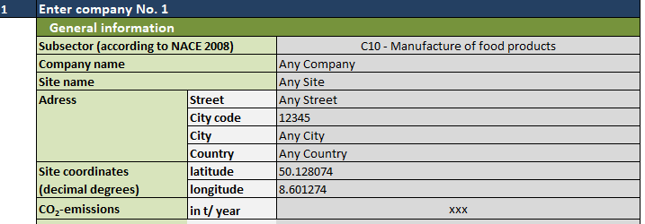

<h1><a class="anchor" id="cm-add-industry-plant" href="#cm-add-industry-plant"><i class="fa fa-link"></i></a>CM Dodaj industrijsko postrojenje</h1><h2><a class="anchor" id="table-of-contents" href="#table-of-contents"><i class="fa fa-link"></i></a> Sadržaj</h2><ul><li> <a href="#introduction">Uvod</a></li><li> <a href="#inputs-and-outputs">Ulazi i izlazi</a></li><li> <a href="#method">Metoda</a></li><li> <a href="#github-repository-of-this-calculation-module">GitHub spremište ovog kalkulacijskog modula</a></li><li> <a href="#references">Reference</a></li><li> <a href="#how-to-cite">Kako citirati</a></li><li> <a href="#authors-and-reviewers">Autori i recenzenti</a></li><li> <a href="#license">Licenca</a></li><li> <a href="#acknowledgement">Priznanje</a></li></ul><h2><a class="anchor" id="introduction" href="#introduction"><i class="fa fa-link"></i></a> Uvod</h2>
 Ovaj modul pruža mogućnost dodavanja dodatnih industrijskih mjesta s njihovim potrebama za grijanjem i hlađenjem i potencijalom viška topline u alatni okvir Hotmaps. Moguće je dodati dodatne energetski intenzivne kao i manje energetski intenzivne industrije. Korisnik unosi potrebne podatke u samostalni alat Excel, koji zatim generira CSV datoteku za prijenos u alatni okvir Hotmaps.

 <a href="#table-of-contents"><strong><code>To Top</code></strong></a>
<h2><a class="anchor" id="inputs-and-outputs" href="#inputs-and-outputs"><i class="fa fa-link"></i></a> Ulazi i izlazi</h2><h3><a class="anchor" id="important-pre-settings-before-using-the-tool" href="#important-pre-settings-before-using-the-tool"><i class="fa fa-link"></i></a> Važne pred-postavke prije upotrebe alata</h3>
 🔺<mark> <strong>Napomena:</strong> Za generiranje ( <em>.csv</em> ) datoteka u ispravnom formatu potrebno je da se zadani graničnik postavi kao zarez ( <strong>engleski standard</strong> ). To <strong>se ne može konfigurirati iz programa Excel,</strong> a to treba učiniti globalno putem upravljačke ploče sustava Windows (kako je <a href="https://www.itsupportguides.com/knowledge-base/office-2013/excel-20132016-how-to-change-csv-delimiter-character/">ovdje</a> opisano). Donja slika prikazuje uzornu postavku za njemačka Windows računala.</mark>

 🔺<mark> <strong>Napomena:</strong> Za pravilnu upotrebu alata temeljenog na Excelu, morate upotrijebiti <strong>točku</strong> kao decimalni separator (engleski standard, npr. 40,50). To treba konfigurirati iz programa Excel (kako je <a href="https://support.microsoft.com/en-us/office/change-the-character-used-to-separate-thousands-or-decimals-c093b545-71cb-4903-b205-aebb9837bd1e">ovdje</a> opisano). Donja slika prikazuje uzornu postavku za njemački Excel.</mark>
<h3><a class="anchor" id="data-input-in-excel-tool-by-user" href="#data-input-in-excel-tool-by-user"><i class="fa fa-link"></i></a> Unos podataka u Excel-alatu od strane korisnika</h3>
 Molimo vas da priloženi Excel-alat preuzmete <a href="https://github.com/HotMaps/add_industry_plant_cm/blob/master/HotMaps_CM_Add_industry_plant_V14.xlsm">OVDJE</a> .

 Pristup korištenju alata Excel ilustriran je na donjoj slici i detaljnije opisan u sljedećim odjeljcima.
<figure><figcaption> <i> Korak po korak kako koristiti alat Excel.</i></figcaption></figure><h4><a class="anchor" id="1-add-general-information" href="#1-add-general-information"><i class="fa fa-link"></i></a> 1) Dodajte opće podatke</h4>
 Idite na tablicu:<figure></figure>

 U prvom koraku unesite sve potrebne opće informacije o mjestima za koja treba izračunati potrebu za grijanjem i hlađenjem i potencijal viška topline. Moguće je dodati do 10 industrijskih mjesta.
<figure><figcaption> <i> Primjer excel tablice za unos općih podataka o tvrtkama kao osnovu za izračun i uvoz u alatni okvir HotMaps.</i></figcaption></figure><h4><a class="anchor" id="2-choose-calculation-option" href="#2-choose-calculation-option"><i class="fa fa-link"></i></a> 2) Odaberite opciju izračuna</h4>
 U drugom koraku postoje 3 mogućnosti kako se mogu procijeniti potrebe za grijanjem i hlađenjem i potencijal viška topline. Imajte na umu da je moguće prebaciti se između tri opcije za različite tvrtke; ali ne unutar same tvrtke.

 S obzirom na prekomjernu temperaturu topline, valja napomenuti da se u Excel-Alat može unijeti niskotemperaturna toplina (&lt;100 ° C), ali ona još nije procijenjena u okviru s alatima Hotmaps. Ako treba razmotriti niskotemperaturnu toplinu, nužna je primjena dizalice topline. Stoga korisnik može uključiti potrebu za električnom energijom toplinske pumpe u konačnu potrebu za energijom i podići temperaturu stvorene viška topline na raspon od 100-200 ° C.
<h5><a class="anchor" id="option-1--manual-input" href="#option-1--manual-input"><i class="fa fa-link"></i></a> Opcija 1: Ručni unos</h5>
 Idite na tablicu:<figure></figure>

 Odaberite ovu opciju ako su podaci o potrebama za grijanjem / hlađenjem i potencijalom viška topline i raspodjelom temperature dostupni odabranoj tvrtki i mogu se ručno popuniti.
<h5><a class="anchor" id="option-2--plant-selection" href="#option-2--plant-selection"><i class="fa fa-link"></i></a> Opcija 2: Odabir biljaka</h5>
 Idite na tablicu:<figure></figure>

 Odaberite ovu opciju ako za odabranu tvrtku nisu dostupne informacije o potrebama za grijanjem / hlađenjem i potencijalom viška topline. Na temelju specifične baze podataka postrojenja, tipične potrebe za grijanjem / hlađenjem i potencijalni višak topline s raspodjelom temperature mogu se odabrati za niz postrojenja i proizvoda / procesa. Kao nužni ulaz za pretvorbu podataka specifičnih za proizvod, treba unijeti vrijednost kao osnovu za izračun (npr. Proizvodnja, površina itd.). Za više informacija o metodi izračuna, pogledajte <a href="#method">Metoda</a> .
<h5><a class="anchor" id="option-3--sector-selection" href="#option-3--sector-selection"><i class="fa fa-link"></i></a> Opcija 3: Odabir sektora</h5>
 Idite na tablicu:<figure></figure>

 Odaberite ovu opciju ako vaša vrsta postrojenja nije dostupna u opciji 2. Na temelju podataka o toplini specifičnih za određeni sektor izračunavaju se tipične potrebe za grijanjem / hlađenjem i potencijalni višak topline. Kao nužni ulaz mora se unijeti potreba za gorivom za opskrbu toplinom (u GWh / godišnje). Za više informacija o metodi izračuna, pogledajte <a href="#method">Metoda</a> .
<h3><a class="anchor" id="data-upload-on-hotmaps-toolbox" href="#data-upload-on-hotmaps-toolbox"><i class="fa fa-link"></i></a> Prijenos podataka na alatni okvir HotMaps</h3>
 Postoje dvije datoteke (* .csv) koje generira alat temeljen na programu Excel i koje se mogu prenijeti na korisnički račun u okviru s alatima Hotmaps.
<h4><a class="anchor" id="1-file-generation--subsector" href="#1-file-generation--subsector"><i class="fa fa-link"></i></a> 1) Generiranje datoteke: podsektor</h4>
 Idite na tablicu:

 Izvezite tablicu kao <em>.csv</em> klikom na:
<h4><a class="anchor" id="2-file-generation--excess-heat" href="#2-file-generation--excess-heat"><i class="fa fa-link"></i></a> 2) Stvaranje datoteke: višak topline</h4>
 Idite na tablicu:

 Izvezite tablicu kao <em>.csv</em> klikom na:
<h4><a class="anchor" id="3-upload-to-the-hotmaps-toolbox" href="#3-upload-to-the-hotmaps-toolbox"><i class="fa fa-link"></i></a> 3) Prenesite u Hotmaps Toolbox</h4>
 Da biste prenijeli dvije <em>.csv</em> datoteke, otvorite platformu za prijenos klikom na <strong>Račun</strong> .

 U sljedećem koraku odaberite dvije <em>.csv</em> datoteke za prijenos i odaberite odgovarajuću kategoriju prijenosa za svaku datoteku.

 Učitane datoteke sada možete provjeriti u odjeljku <strong>Slojevi - Osobni sloj</strong>

 <a href="#table-of-contents"><strong><code>To Top</code></strong></a>
<h2><a class="anchor" id="method" href="#method"><i class="fa fa-link"></i></a> Metoda</h2>
 Ako potražnja za grijanjem / hlađenjem i potencijalni višak topline u postrojenju nisu poznati, korisniku se nude dvije metode temeljene na pokazateljima za izračun potrebe za toplinom i viška toplinskog potencijala.

 Treba napomenuti da su ove vrijednosti samo okvirne približne vrijednosti za tipične biljke (opcija 2) ili na razini sektora (opcija 3) i ne zamjenjuju detaljnu analizu i mjerenje potrebe za toplinom i viška topline postrojenja.
<h3><a class="anchor" id="method---option-2--plant-selection" href="#method---option-2--plant-selection"><i class="fa fa-link"></i></a> Metoda - Opcija 2: Odabir biljke</h3>
 Podaci o toplini specifični za postrojenje preuzeti su iz baze podataka Prognoze. Za velik broj različitih energetski intenzivnih i manje energetski intenzivnih tipova postrojenja proces grijanja / hlađenja i višak toplinskog potencijala proizlaze iz specifične konačne energetske potrebe goriva i električne energije. Važno je napomenuti da je zbog osnovne baze podataka ovom metodom obuhvaćena samo procesna toplina i procesno hlađenje; grijanje prostora i topla voda ovdje nisu uključeni. Ovisno o vrsti postrojenja, daju se različiti ulazni podaci kao osnova za izračun (npr. Obujam proizvodnje u <em>tonama</em> ili površina u <em>m 2</em> ).

 Za izračun potrebe za grijanjem i hlađenjem potrebno je pretpostaviti učinkovitost pretvorbe iz konačne energije u toplinu i hlađenje. Budući da se većina primjena topline temelji na pari, pretpostavlja se učinkovitost od 90%. Za primjenu hlađenja pretpostavlja se omjer energetske učinkovitosti ponderiran na razini temperature:

 | Razina temperature | pretpostavljeni EER (prema bazi podataka Prognoze) | | --- | -------------: | | &lt;-30 ° C | 0,01 | | -30 ° C - 0 ° C | 1,8 | | 0 ° C - 15 ° C i&gt; 15 ° C | 3,5 |

 Cijela baza podataka korištena za opciju 2 dostupna je ovdje: <a href="https://github.com/HotMaps/add_industry_plant_cm/blob/master/CM_add_industry_plant_databases.xlsx">Baza podataka Option2</a>
<h3><a class="anchor" id="method---option-3--sector-selection" href="#method---option-3--sector-selection"><i class="fa fa-link"></i></a> Metoda - Opcija 3: Odabir sektora</h3>
 Opcija 3 pruža široku procjenu potražnje za toplinom i viška topline za sektore prerađivačke industrije (prema NACE Rev. 2 [ <a href="#references">1</a> ]).
<h4><a class="anchor" id="calculation-of-excess-heat-potentials-on-a-sector-level" href="#calculation-of-excess-heat-potentials-on-a-sector-level"><i class="fa fa-link"></i></a> Proračun viška toplinskih potencijala na razini sektora</h4>
 Za proračun viška toplinskog potencijala različitih sektora koriste se faktori viška topline prema Brückner 2016 [ <a href="#references">2</a> ] (vidi donju tablicu). Faktor viška topline definiran je kao otpadna toplina koja se stvara po potrošnji goriva. U [ <a href="#references">2</a> ] dostupnih podataka za utvrđivanje viška potencijal topline u prerađivačkoj industriji potječe iz emisije Anketa provedena svake četiri godine na državnoj razini u Njemačkoj. Prema Pravilniku o deklaraciji o emisijama (1. BImSchG), svi operateri postrojenja koja podliježu odobrenju moraju svake četiri godine podnijeti deklaraciju o svojim emisijama. Za 2008. godinu procjenjuju se podaci na razini poduzeća koji se sastoje od protoka volumena ispušnih plinova i njihove temperature. Zajedno s dostupnim informacijama o vrsti i količini potrošnje goriva postrojenja, faktor viška topline postrojenja izračunava se kao:

 <em>Faktor viška topline = Višak topline / potrošnja goriva</em>

 Konačno, faktor viška topline izračunava se ne samo na razini tvrtke već i na razini sektora. Za detaljne informacije pogledajte [ <a href="#references">2</a> ].

 Faktori viška topline prema [ <a href="#references">2</a> ] uključuju višak topline koja dolazi iz procesne topline, kao i stvaranje topline u prostoru i vruću vodu. To je zbog činjenice da se analizira samo količinski protok ispušnih plinova koji napušta postrojenje bez odvajanja potrošnje goriva na grijanje prostora, toplu vodu i procesnu toplinu. Prekomjerna toplina proizvedena primjenama električne energije nije uključena.

 Raspodjela udjela viška topline po temperaturnom rasponu temelji se na vlastitim pretpostavkama.

 | NACE Rev. 2 | Sektor | faktor viška topline | | --- | ------------- | -----: | | 10 | Proizvodnja prehrambenih proizvoda | 0,10 | | 11 | Proizvodnja pića | 0,14 | | 12 | Proizvodnja duhanskih proizvoda | 0,12 | | 13 | Proizvodnja tekstila | 0,29 | | 14 | Proizvodnja odjeće | 0,06 | | 15 | Proizvodnja kože i srodnih proizvoda | 0,20 | | 16 | Proizvodnja drva i proizvoda od drva i pluta, osim namještaja; proizvodnja proizvoda od slame i pletarskih materijala | 0,10 | | 17 | Proizvodnja papira i proizvoda od papira | 0,09 | | 18 | Tisak i reprodukcija snimljenih medija | 0,03 | | 20 | Proizvodnja kemikalija i kemijskih proizvoda | 0,09 | | 21 | Proizvodnja osnovnih farmaceutskih proizvoda i farmaceutskih pripravaka | 0,08 | | 22 | Proizvodnja proizvoda od gume i plastike | 0,17 | | 23 | Proizvodnja ostalih nemetalnih mineralnih proizvoda | 0,15 | | 24 | Proizvodnja osnovnih metala | 0,19 | | 25 | Proizvodnja gotovih metalnih proizvoda, osim strojeva i opreme | 0,19 | | 26 | Proizvodnja računalnih, elektroničkih i optičkih proizvoda | 0,18 | | 27 | Proizvodnja električne opreme | 0,31 | | 28 | Proizvodnja strojeva i opreme, dn | 0,16 | | 29 | Proizvodnja motornih vozila, prikolica i poluprikolica | 0,12 | | 30 | Proizvodnja ostale transportne opreme | 0,38 | | 31 | Proizvodnja namještaja | 0,12 | | 32 | Ostala proizvodnja | 0,08 | | 33 | Popravak i ugradnja strojeva i opreme | 0,05 |

 <em>Čimbenici viška topline za sektore prerađivačke industrije (prema [ <a href="#references">1</a> ])</em>
<h4><a class="anchor" id="calculation-of-heat-demand-on-a-sector-level" href="#calculation-of-heat-demand-on-a-sector-level"><i class="fa fa-link"></i></a> Proračun potrebe za toplinom na sektorskoj razini</h4>
 Analiza konačne potražnje za energijom za gorivima na temperaturna područja na sektorskoj razini temelji se na njemačkoj studiji (baza podataka za procjenu mjera energetske učinkovitosti [ <a href="#references">3</a> ]). Za izračun potrebe za toplinom pretpostavlja se da se gotovo sva kupnja goriva koristi za toplinu. U skladu s opcijom 2, pretpostavlja se učinkovitost pretvorbe iz konačne energije u toplinu od 90% za proizvodnju topline na bazi pare.

 Cijela baza podataka korištena za opciju 3 dostupna je ovdje: <a href="https://github.com/HotMaps/add_industry_plant_cm/blob/master/CM_add_industry_plant_databases.xlsx">Baza podataka Option3</a>

 <a href="#table-of-contents"><strong><code>To Top</code></strong></a>
<h2><a class="anchor" id="github-repository-of-this-calculation-module" href="#github-repository-of-this-calculation-module"><i class="fa fa-link"></i></a> GitHub spremište ovog kalkulacijskog modula</h2>
 <a href="https://github.com/HotMaps/add_industry_plant_cm">Ovdje</a> ćete dobiti vrhunski razvoj za ovaj modul izračuna.

 <a href="#table-of-contents"><strong><code>To Top</code></strong></a>
<h2><a class="anchor" id="references" href="#references"><i class="fa fa-link"></i></a> Reference</h2>
 [1]. Europska komisija: NACE Rev. 2. Statistička klasifikacija gospodarskih djelatnosti u Europskoj zajednici. Luksemburg, 2008. ISBN: 978-92-79-04741-1.

 [2]. Brückner S .: Industrielle Abwärme u Deutschlandu. Disertacija Technische Universtität München, 2016.

 [3]. Prognos AG, Fraunhofer ISI, TU München: Datenbasis zur Bewertung von Energieeffizienzmaßnahmen in der Zeitreihe 2005.-2014. Im Auftrag des Umweltbundesamtes. Dessau, 2017. ISSN 1862-4359.

 <a href="#table-of-contents"><strong><code>To Top</code></strong></a>
<h2><a class="anchor" id="how-to-cite" href="#how-to-cite"><i class="fa fa-link"></i></a> Kako citirati</h2>
 Ali Aydemir i Lisa Neusel, u Hotmaps-Wiki, en-CM-Add-industry-plant (rujan 2020)

 <a href="#table-of-contents"><strong><code>To Top</code></strong></a>
<h2><a class="anchor" id="authors-and-reviewers" href="#authors-and-reviewers"><i class="fa fa-link"></i></a> Autori i recenzenti</h2>
 Ovu su stranicu napisali Ali Aydemir i Lisa Neusel ( <strong><a href="https://isi.fraunhofer.de/">Fraunhofer ISI</a></strong> ).

 ☑ Ovu je stranicu pregledao Tobias Fleiter ( <strong><a href="https://isi.fraunhofer.de/">Fraunhofer ISI</a></strong> ).

 <a href="#table-of-contents"><strong><code>To Top</code></strong></a>
<h2><a class="anchor" id="license" href="#license"><i class="fa fa-link"></i></a> Licenca</h2>
 Copyright © 2016-2020: Ali Aydemir i Lisa Neusel

 Creative Commons Attribution 4.0 međunarodna licenca

 Ovo je djelo licencirano pod Creative Commons CC BY 4.0 međunarodnom licencom.

 SPDX-identifikator licence: CC-BY-4.0

 Tekst licence: https://spdx.org/licenses/CC-BY-4.0.html

 <a href="#table-of-contents"><strong><code>To Top</code></strong></a>
<h2><a class="anchor" id="acknowledgement" href="#acknowledgement"><i class="fa fa-link"></i></a> Priznanje</h2>
 Željeli bismo izraziti našu najdublju zahvalnost projektu Horizon 2020 <a href="https://www.hotmaps-project.eu">Hotmaps</a> (Ugovor o dodjeli bespovratnih sredstava broj 723677), koji je osigurao financijska sredstva za provođenje ove istrage.

 <a href="#table-of-contents"><strong><code>To Top</code></strong></a>

<!--- THIS IS A SUPER UNIQUE IDENTIFIER -->

This page was automatically translated. View in another language:

[English](../en/CM-Add-industry-plant) (original) [Bulgarian](../bg/CM-Add-industry-plant)\* [Czech](../cs/CM-Add-industry-plant)\* [Danish](../da/CM-Add-industry-plant)\* [German](../de/CM-Add-industry-plant)\* [Greek](../el/CM-Add-industry-plant)\* [Spanish](../es/CM-Add-industry-plant)\* [Estonian](../et/CM-Add-industry-plant)\* [Finnish](../fi/CM-Add-industry-plant)\* [French](../fr/CM-Add-industry-plant)\* [Irish](../ga/CM-Add-industry-plant)\*  [Hungarian](../hu/CM-Add-industry-plant)\* [Italian](../it/CM-Add-industry-plant)\* [Lithuanian](../lt/CM-Add-industry-plant)\* [Latvian](../lv/CM-Add-industry-plant)\* [Maltese](../mt/CM-Add-industry-plant)\* [Dutch](../nl/CM-Add-industry-plant)\* [Polish](../pl/CM-Add-industry-plant)\* [Portuguese (Portugal, Brazil)](../pt/CM-Add-industry-plant)\* [Romanian](../ro/CM-Add-industry-plant)\* [Slovak](../sk/CM-Add-industry-plant)\* [Slovenian](../sl/CM-Add-industry-plant)\* [Swedish](../sv/CM-Add-industry-plant)\* 

\* machine translated
