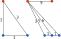

<h1><a class="anchor" id="cm-excess-heat-transport-potential" href="#cm-excess-heat-transport-potential"><i class="fa fa-link"></i></a>CM Višak potencijala za prijenos topline</h1><h2><a class="anchor" id="table-of-contents" href="#table-of-contents"><i class="fa fa-link"></i></a> Sadržaj</h2><ul><li> <a href="#in-a-glance">U jednom pogledu</a></li><li> <a href="#introduction">Uvod</a></li><li> <a href="#inputs-and-outputs">Ulazi i izlazi</a><ul><li> <a href="#inputs-and-outputs_input-layers-and-parameters">Ulazni slojevi i parametri</a></li><li> <a href="#inputs-and-outputs_output">Izlaz</a></li></ul></li><li> <a href="#method">Metoda</a><ul><li> <a href="#method_overview">Pregled</a></li><li> <a href="#method_details">Pojedinosti</a></li><li> <a href="#method_implementation">Provedba</a></li></ul></li><li> <a href="#github-repository-of-this-calculation-module">GitHub spremište ovog kalkulacijskog modula</a></li><li> <a href="#quick-start">Brzi početak</a></li><li> <a href="#troubleshooting">Rješavanje problema</a></li><li> <a href="#sample-run">Uzorak trčanja</a></li><li> <a href="#how-to-cite">Kako citirati</a></li><li> <a href="#authors-and-reviewers">Autori i recenzenti</a></li><li> <a href="#license">Licenca</a></li><li> <a href="#acknowledgement">Priznanje</a></li></ul><h2><a class="anchor" id="in-a-glance" href="#in-a-glance"><i class="fa fa-link"></i></a> U jednom pogledu</h2>
 Ovaj modul izračunava protok i troškove prijenosa topline od potencijalnih suvišnih izvora topline koji se nalaze izvan potencijalnih područja daljinskog grijanja do područja daljinskog grijanja. Ulazi su profili opterećenja po satu viška protoka topline i potrebe daljinskog grijanja, mjesto viška izvora topline i potencijalni sustav daljinskog grijanja, troškovi ulaganja u izmjenjivače topline i dalekovode i granične vrijednosti udaljenosti i troškova prijenosa.

 <a href="#table-of-contents"><strong><code>To Top</code></strong></a>
<h2><a class="anchor" id="introduction" href="#introduction"><i class="fa fa-link"></i></a> Uvod</h2>
 Modul za izračunavanje &quot;Potencijal prenosa viška topline&quot; pomoći će korisniku da identificira potencijale integracije viška topline u mrežama daljinskog grijanja. Potencijali se temelje na <a href="https://wiki.hotmaps.hevs.ch/en/CM-District-heating-potential-areas-user-defined-thresholds">CM - potencijalu daljinskog grijanja</a> . Ovaj CM identificira područja s povoljnim uvjetima za mreže daljinskog grijanja i pokazuje koliko bi topline potencijalno moglo biti pokriveno industrijskom suvišnom toplinom u tim područjima. Međutim, to ne znači da mreža daljinskog grijanja već postoji u ovoj regiji.

 Sljedeći podaci i metode kombinirani su za prethodni zadatak.

 Podaci:
<ul><li>
 Potrebe za grijanjem u obližnjim područjima s povoljnim uvjetima za mreže daljinskog grijanja, koje se rastvaraju svaki sat (iz <a href="https://wiki.hotmaps.hevs.ch/en/CM-District-heating-potential-areas-user-defined-thresholds">CM - potencijal</a> daljinskog grijanja).
</li><li>
 Podaci o prekomjernim količinama topline industrijskih tvrtki na tom području, koje se također rješavaju po satima (iz baze podataka industrijske baze podataka).
</li><li>
 Pretpostavke o troškovima izmjenjivača topline, crpki i cjevovoda kao i gubicima topline za cjevovode daljinskog grijanja.
</li></ul>
 Metoda (pojednostavljena):
<ul><li> Projektiranje cjevovoda na osnovi razvijene heuristike, koja predstavlja problem dizajna kao problema protoka mreže.</li></ul>
 Cilj metode je prikazati najveći mogući višak protoka topline s ne previše, a time i predugim cjevovodima do mogućih korisnika daljinskog grijanja stvaranjem mreža s maksimalnim protocima. Međutim, posebno neučinkovite transportne linije (s malim protocima topline i time visokim specifičnim troškovima prijenosa topline) ne uzimaju se u obzir u konačnoj mreži. Korisnik može odrediti prag ekonomske učinkovitosti pojedinih transportnih linija (usp. Prag dalekovoda).

 Osnovna pozadina pristupa je sljedeća: ako postoji samo nekoliko izvora viška topline, uvijek bi se mogao uzeti u obzir jedan cjevovod po izvoru za transport topline do obližnjeg područja s povoljnim uvjetima za daljinsko grijanje. Međutim, ako postoji nekoliko suvišnih izvora topline koji se slijevaju u isto područje, imalo bi smisla skupljati toplinu i transportirati je na to područje u većem zajedničkom cjevovodu. Pristup s jednom cijevi po izvoru nastoji precijeniti napor cjevovoda.

 Kako bi se suprotstavio gore navedenom, problem planiranja cjevovoda aproksimiran je pretpostavkom problema mrežnog protoka. Za rješavanje problema koristi se heuristička metoda u kojoj se višak topline može povezati i transportirati do mogućih korisnika. Konkretno metodičko oblikovanje rješenja s pristupom stablu minimalnog raspona opisano je u odgovarajućem metodičkom dijelu. Dizajn cjevovoda utvrđen u prethodnom kontekstu, prema tome, ne predstavlja detaljno planiranje ili stvarno usmjeravanje rute, već se koristi samo za aproksimaciju troškova raspodjele viška količine topline u obližnjim područjima s povoljnim uvjetima za mreže daljinskog grijanja. (vidi <a href="https://wiki.hotmaps.hevs.ch/en/CM-District-heating-potential-areas-user-defined-thresholds">CM - Potencijal daljinskog grijanja</a> , koherentna područja ključne riječi). Ova aproksimacija troškova odnosi se na cijelu mrežu.

 Rezultate bi tada trebalo prvo protumačiti na sljedeći način: ako bi se zabilježene suvišne količine topline zajedno transportirale do naznačenih obližnjih područja, tada bi troškovi raspodjele topline mogli biti reda veličine kako pokazuje alat (usp. Levelizirani trošak opskrbe toplinom). Vrijednosti za cijelu mrežu također su dobar početni pokazatelj za pojedine cjevovode. Svrha rezultata je, dakle, pružiti programeru ili planeru reda veličine za moguće troškove distribucije.

 <a href="#table-of-contents"><strong><code>To Top</code></strong></a>
<h2><a class="anchor" id="inputs-and-outputs" href="#inputs-and-outputs"><i class="fa fa-link"></i></a> Ulazi i izlazi</h2><h3><a class="anchor" id="input-layers-and-parameters" href="#input-layers-and-parameters"><i class="fa fa-link"></i></a> Ulazni slojevi i parametri</h3><h4><a class="anchor" id="provided-by-toolbox" href="#provided-by-toolbox"><i class="fa fa-link"></i></a> Pruža Toolbox</h4><ul><li>
 Područja daljinskog grijanja (za sada ih izravno pruža potencijal daljinskog grijanja CM)
</li><li>
 Industrijska baza podataka (prema zadanim postavkama pruža alat)
</li><li>
 Profili opterećenja za industriju
</li><li>
 Profili opterećenja za grijanje stambenih zgrada i potrošne tople vode
</li></ul><h4><a class="anchor" id="provided-by-the-user" href="#provided-by-the-user"><i class="fa fa-link"></i></a> Pruža korisnik</h4><ul><li>
 Min. potreba za toplinom po hektaru

 Pogledajte <a href="https://wiki.hotmaps.hevs.ch/en/CM-District-heating-potential-areas-user-defined-thresholds">CM - Potencijal daljinskog grijanja</a> .
</li><li>
 Min. potreba za toplinom u području DH

 Pogledajte <a href="https://wiki.hotmaps.hevs.ch/en/CM-District-heating-potential-areas-user-defined-thresholds">CM - Potencijal daljinskog grijanja</a> .
</li><li>
 Životni vijek opreme u godinama

 Nivelizirani troškovi topline odnose se na ovo vremensko razdoblje.
</li><li>
 Diskontna stopa u%

 Kamatna stopa za kredit potreban za izgradnju mreže.
</li><li>
 Faktor troškova

 Čimbenik prilagodbe mrežnih troškova u slučaju da zadane vrijednosti ne predstavljaju točno troškove. Ulaganja potrebna za mrežu umnožavaju se s tim čimbenikom. Zadani troškovi mogu se naći u odjeljku <a href="en-CM-Excess-heat-transport-potential#computation-of-costs">Izračun troškova</a> .
</li><li>
 Operativni troškovi u%

 Operativni troškovi mreže godišnje. U posto ulaganja potrebnih za mrežu.
</li><li>
 Vrijednost praga za dalekovode u ct / kWh

 Maksimalni izjednačeni trošak topline svakog pojedinog dalekovoda. Ovaj se parametar može koristiti za kontrolu niveliranih troškova topline za cijelu mrežu. Niža vrijednost jednaka je nižim poravnatim troškovima topline, ali i smanjenju viška korištene topline i obrnuto.
</li></ul><h4><a class="anchor" id="performance-parameters" href="#performance-parameters"><i class="fa fa-link"></i></a> Parametri izvedbe</h4><ul><li>
 Rješenje vremena

 Postavlja interval između izračuna protoka mreže tijekom cijele godine. Može biti jedna od ovih vrijednosti: (sat, dan, tjedan, mjesec, godina)
</li></ul>
 <a href="#table-of-contents"><strong><code>To Top</code></strong></a>
<h3><a class="anchor" id="output" href="#output"><i class="fa fa-link"></i></a> Izlaz</h3><h4><a class="anchor" id="layers" href="#layers"><i class="fa fa-link"></i></a> Slojevi</h4><ul><li>
 Dalekovodi

 Profil oblika koji prikazuje predložene dalekovode s njihovom temperaturom, godišnjim protokom topline i troškovima. Pojedinosti možete pronaći ovdje.
</li></ul><h4><a class="anchor" id="indicators" href="#indicators"><i class="fa fa-link"></i></a> Pokazatelji</h4><ul><li>
 Ukupni višak topline na odabranom području u GWh

 Ukupni višak topline dostupan u industrijskim pogonima u odabranom području i blizini.
</li><li>
 Višak topline povezan u GWh

 Ukupni višak topline dostupan u industrijskim postrojenjima povezanim na mrežu.
</li><li>
 Prekomjerna toplina koja se koristi u GWh

 Stvarni višak topline korišten za DH.
</li><li>
 Ulaganja potrebna za mrežu u €

 Ulaganje potrebno za izgradnju mreže.
</li><li>
 Godišnji troškovi mreže u € / godišnje

 Troškovi uzrokovani anuitetom i operativnim troškovima mreže godišnje.
</li><li>
 Izravnani troškovi opskrbe toplinom u ct / kWh

 nivelirani trošak topline kompletne mreže.
</li></ul><h4><a class="anchor" id="graphics" href="#graphics"><i class="fa fa-link"></i></a> Grafika</h4><ul><li>
 DH potencijal i višak topline

 Grafički prikaz potencijala DH, ukupne suvišne topline, povezane višak topline i korištene višak topline. Pojedinosti možete pronaći <a href="en-CM-Excess-heat-transport-potential#dh-potential-and-excess-heat">ovdje</a> .
</li><li>
 Korištena višak topline i potrebna ulaganja

 Grafički prikaz godišnje isporučene viška topline za ulaganje potrebno za mrežu. Pojedinosti možete pronaći <a href="en-CM-Excess-heat-transport-potential#excess-heat-used-and-investment-necessary">ovdje</a> .
</li><li>
 Krivulje opterećenja

 Grafički prikaz mjesečne potrebe i viška topline. Pojedinosti možete pronaći <a href="en-CM-Excess-heat-transport-potential#load-curves">ovdje</a> .
</li><li>
 Krivulje opterećenja

 Grafikon prikazuje prosječnu dnevnu potrebu i višak topline. Pojedinosti možete pronaći <a href="en-CM-Excess-heat-transport-potential#load-curves">ovdje</a> .
</li></ul><h4><a class="anchor" id="examples-of-layer" href="#examples-of-layer"><i class="fa fa-link"></i></a> Primjeri sloja</h4><h5><a class="anchor" id="transmission-lines" href="#transmission-lines"><i class="fa fa-link"></i></a> Dalekovodi</h5><figcaption> <i> Primjer dalekovoda prikazanog u alatu</i></figcaption>
 Klikom na dalekovod pojavit će se dodatne informacije.
<h4><a class="anchor" id="examples-of-graphics" href="#examples-of-graphics"><i class="fa fa-link"></i></a> Primjeri grafike</h4><h5><a class="anchor" id="dh-potential-and-excess-heat" href="#dh-potential-and-excess-heat"><i class="fa fa-link"></i></a> DH potencijal i višak topline</h5>
 <em>Ova grafika uspoređuje potencijal DH, ukupni višak topline, priključeni višak topline i iskorištena višak topline.</em>

 Više informacija o godišnjoj potrebi za toplinom i potencijalu za toplinsku energiju možete pronaći <a href="CM-District-heating-potential-areas-user-defined-thresholds">ovdje</a> . Prekomjerna toplina povezana višak topline i korištena višak topline jednaki su njihovim jednako imenovanim pokazateljima u odjeljku <a href="en-CM-Excess-heat-transport-potential#inputs-and-outputs_input-layers-and-parameters">Ulaz i izlaz</a> .
<h5><a class="anchor" id="load-curves" href="#load-curves"><i class="fa fa-link"></i></a> Krivulje opterećenja</h5><figure><figcaption><i> </i>
 <i>Ova grafika prikazuje ukupni protok kroz mrežu tijekom cijele godine. Donja grafika predstavlja prosječni dan.</i>
</figcaption></figure>
 Os x predstavlja vrijeme i snagu osi y. Plave krivulje predstavljaju potrebu za toplinom područja DH, a crvene višak topline koji je na raspolaganju. Sjecište obje krivulje predstavlja stvarni ukupni protok topline. Gornja grafika prikazuje protok tijekom godine, a donja protok prosječnog dana. Imajte na umu da <a href="en-CM-Excess-heat-transport-potential#performance-parameters">vremensku razlučivost</a> treba postaviti najmanje na &quot;mjesec&quot; za gornju i &quot;sat&quot; da bi donja grafika bila reprezentativna.

 <a href="#table-of-contents"><strong><code>To Top</code></strong></a>
<h2><a class="anchor" id="method" href="#method"><i class="fa fa-link"></i></a> Metoda</h2><h3><a class="anchor" id="overview" href="#overview"><i class="fa fa-link"></i></a> Pregled</h3>
 Ključni element modula viška topline je model sudopera koji se koristi. Izrađuje prijenosnu mrežu minimalne duljine i izračunava protok za svaki sat u godini na temelju profila opterećenja grijanja za stanovanje s NUTS 2 rezolucijom i industrijskih profila opterećenja s NUTS 0 razlučivosti. Na temelju prosječnih vršnih protoka tijekom godine mogu se izračunati troškovi za svaki dalekovod i izmjenjivač topline na strani izvora i sudopera.

 <a href="#table-of-contents"><strong><code>To Top</code></strong></a>
<h3><a class="anchor" id="details" href="#details"><i class="fa fa-link"></i></a> Pojedinosti</h3><h4><a class="anchor" id="modeling-of-sources" href="#modeling-of-sources"><i class="fa fa-link"></i></a> Modeliranje izvora</h4>
 Na temelju ID-a NUTS 0 i industrijskog sektora, svakom se satu dodjeljuje profil opterećenja koji se razrješava svaki sat.
<h4><a class="anchor" id="modeling-of-sinks" href="#modeling-of-sinks"><i class="fa fa-link"></i></a> Modeliranje sudopera</h4>
 Na temelju modula za proračun potencijala daljinskog grijanja stvaraju se ekvidistancijalno ulazne točke u koherentnim područjima. Ovisno o NUTS 2 ID ulaznih točaka dodjeljuje se profil opterećenja.
<h4><a class="anchor" id="fixed-radius-search" href="#fixed-radius-search"><i class="fa fa-link"></i></a> Pretraživanje s fiksnim radijusom</h4>
 Unutar unaprijed postavljenog radijusa provjerava se koji se izvori nalaze u međusobnom dometu, koji sudoperi su u dometu jedan drugog, a koji sudoperi u dometu za izvore. To se može prikazati grafom s izvorima i slivnicima koji čine vrhove i vrhove u rasponu koji su povezani rubom.
<h4><a class="anchor" id="reduction-to-minimum-length-network" href="#reduction-to-minimum-length-network"><i class="fa fa-link"></i></a> Smanjenje na minimalnu duljinu mreže</h4>
 Izračunava se minimalno rasponično stablo s razmakom rubova kao težinom. To rezultira grafom koji zadržava svoju povezanost, a ima minimalnu ukupnu duljinu bridova. Imajte na umu da su ulazne točke koherentnih područja međusobno povezane besplatno, jer čine vlastitu distribucijsku mrežu.
<h4><a class="anchor" id="flow-computation" href="#flow-computation"><i class="fa fa-link"></i></a> Proračun protoka</h4>
 Maksimalni protok od izvora do ponora izračunava se za svaki sat u godini.
<h4><a class="anchor" id="cost-determination" href="#cost-determination"><i class="fa fa-link"></i></a> Utvrđivanje troškova</h4>
 Vršni protok godine u prosjeku tijekom 3 sata određuje potreban kapacitet za dalekovode i izmjenjivače topline. Troškovi dalekovoda ovise o duljini i kapacitetu, dok na troškove izmjenjivača topline utječe samo kapacitet. Na izvornoj strani pretpostavlja se izmjenjivač topline zrak-tekućina s integriranom pumpom za dalekovod, a na strani umivaonika izmjenjivač topline tekućina-tekućina.
<h4><a class="anchor" id="variation-of-network" href="#variation-of-network"><i class="fa fa-link"></i></a> Varijacija mreže</h4>
 Budući da su poznati troškovi i protok svakog dalekovoda, vodovi s najvećim odnosom troškova i protoka mogu se ukloniti i protok preračunati dok se ne postigne željena cijena po protoku.

 <a href="#table-of-contents"><strong><code>To Top</code></strong></a>
<h3><a class="anchor" id="implementation" href="#implementation"><i class="fa fa-link"></i></a> Provedba</h3><h4><a class="anchor" id="fixed-radius-search" href="#fixed-radius-search"><i class="fa fa-link"></i></a> Pretraživanje s fiksnim radijusom</h4>
 Za izračunavanje udaljenosti između dviju točaka koristi se aproksimacija duljine loxodroma pod malim kutom. Iako postoji i točna primjena ortodromske udaljenosti, povećana točnost nema stvarne koristi zbog malih udaljenosti uglavnom manjih od 20 km i nesigurnosti stvarne duljine dalekovoda zbog mnogih čimbenika poput topologije. Ako su dvije točke u opsegu radijusa, pohranjuje se na popis susjedstva. Stvaranje takvih popisa susjedstva vrši se između izvora i izvorišta, ponora i ponora, te izvora i ponora. Razlog razdvajanja leži u fleksibilnosti dodavanja određenih temperaturnih zahtjeva za izvore ili sudopere.
<figure><figcaption> <i> Primjer pretraživanja s fiksnim radijusom. Crveni vrhovi predstavljaju izvore, a plavi tonove. Brojevi predstavljaju udaljenost između točaka. Crtanje nije u mjerilu.</i></figcaption></figure><h4><a class="anchor" id="networkgraph-class" href="#networkgraph-class"><i class="fa fa-link"></i></a> Klasa NetworkGraph</h4>
 Na temelju biblioteke igraph implementirana je klasa NetworkGraph sa svim funkcionalnostima potrebnim za modul izračuna. Iako je igraph slabo dokumentiran, nudi mnogo bolje performanse od čistih python modula poput NetworkX-a i šire podrške platforme izvan Linuxa, za razliku od graph-alata. Klasa NetworkGraph opisuje samo jednu mrežu na površini, ali sadrži 3 različita grafikona. Prvo, grafikon koji opisuje mrežu kakvu definiraju tri popisa susjedstva. Drugo, dopisni graf koji interno povezuje ponore istog koherentnog područja i zadnji graf maksimalnog protoka korišten za izračunavanje maksimalnog protoka.
<h5><a class="anchor" id="graph" href="#graph"><i class="fa fa-link"></i></a> Grafikon</h5>
 Sadrži samo stvarne izvore i tonove kao vrhove.
<figure><figcaption> <i> Primjer grafa. Crveni vrhovi predstavljaju izvore, a plavi tonove.</i></figcaption></figure><h5><a class="anchor" id="correspondence-graph" href="#correspondence-graph"><i class="fa fa-link"></i></a> Grafikon dopisivanja</h5>
 Svakom sudoperu potreban je korespondencijski ID, koji pokazuje je li interno povezan već postojećom mrežom kao u koherentnim područjima. Sudoperi s istim id-om korespondencije povezani su na novi vrh s rubovima s nultom težinom. To je presudno za izračunavanje minimalnog raspona stabala i razloga za koji se koristi graf korespondencije. Ova je značajka također primijenjena za izvore, ali se ne koristi.
<figure><figcaption><i> </i>
 <i>Primjer dopisnog grafa. Crveni vrhovi predstavljaju izvore, a plavi tonove. Tri sudopera s desne strane koherentno su povezana dodatnim većim vrhom</i>
</figcaption></figure><h5><a class="anchor" id="maximum-flow-graph" href="#maximum-flow-graph"><i class="fa fa-link"></i></a> Grafikon maksimalnog protoka</h5>
 Budući da igraph ne podržava više izvora i tone u svojoj funkciji maksimalnog protoka, potreban je pomoćni graf. Uvodi beskonačni izvor i vrh potonuća. Svaki stvarni izvor povezan je s beskonačnim izvorom, a svaki pravi umivaonik povezan je rubom s beskonačnim sudoperom. Imajte na umu da ako je umivaonik povezan s dopisnim vrhom, ovaj vrh će biti povezan umjesto samog umivaonika.
<figure><figcaption><i> </i>
 <i>Primjer grafa maksimalnog protoka.</i>
</figcaption></figure><h5><a class="anchor" id="minimum-spanning-tree-computation" href="#minimum-spanning-tree-computation"><i class="fa fa-link"></i></a> Izračun minimalnog raspona stabala</h5>
 Na temelju grafa korespondencije izračunava se stablo minimalnog raspona. Rubovi koji povezuju koherentne sudopere uvijek imaju težinu 0, tako da će uvijek ostati dio minimalnog raspona.
<figure><figcaption><i> </i>
 <i>Primjer grafa korespondencije s težinama svakog ruba i njegovim minimalnim rasponom stabla.</i>
</figcaption></figure><h5><a class="anchor" id="maximum-flow-computation" href="#maximum-flow-computation"><i class="fa fa-link"></i></a> Proračun maksimalnog protoka</h5>
 Protok kroz rubove koji povezuju stvarne izvore ili ponore s beskonačnim izvorom ili sudoperom ograničen je na stvarni kapacitet svakog izvora ili ponora. Iz numeričkih razloga kapaciteti su normalizirani tako da je najveći kapacitet 1. Protok kroz podskup rubova sadržanih u grafikonu korespondencije ograničen je na 1000 što bi, za sve intenzivne i svrhe, trebalo pružiti neograničeni protok. Tada se izračunava maksimalni protok od beskonačnog izvora do beskonačnog ponora i protok se skalira do svoje izvorne veličine. Budući da koherentni sudoperi nisu izravno povezani s beskonačnim vrhom sudopera, već s odgovarajućim vrhom, protok kroz njega ograničen je na zbroj svih koherentnih umivaonika.
<figure><figcaption><i> </i>
 <i>Primjer grafa maksimalnog protoka i kapaciteta svakog izvora i ponora. Desni graf prikazuje maksimalni protok dopušten kroz svaki rub nakon normalizacije. Imajte na umu da je maksimalni dopušteni protok kroz rubove s simbolom beskonačnosti zapravo ograničen na 1000 u implementaciji.</i>
</figcaption></figure>
 Implementacija funkcije maksimalnog protoka igraph koristi algoritam Push-relabel. Ova vrsta algoritma nije troškovno osjetljiva i možda neće uvijek pronaći najkraći način usmjeravanja toka. Troškovno osjetljiv algoritam nije dostupan u igraphu, a izvedba bi vjerojatno bila niska da bi mogao riješiti protok zasnovan na satima tijekom cijele godine. Ali zbog prethodnog smanjenja na minimalno rasponično stablo slučajevi u kojima se bira neidealno rješenje vrlo su ograničeni i malo vjerojatni. Push-relabel algoritam također ima tendenciju usmjeravanja protoka kroz najmanju količinu rubova. Čini se da je primjena igrafa deterministička po redoslijedu raspodjele protoka ako su grafovi barem automorfizmi, što je važno za izračun protoka po satu, jer je svako umjetno uvedeno osciliranje protoka između rubova nepoželjno.
<figure><figcaption> <i> Protok izračunat algoritmom maksimalnog protoka i premještanjem na izvornu veličinu.</i></figcaption></figure><h4><a class="anchor" id="heat-sources" href="#heat-sources"><i class="fa fa-link"></i></a> Izvori topline</h4>
 Izvori topline preuzeti su iz <strong><a href="https://gitlab.com/hotmaps/industrial_sites/industrial_sites_Industrial_Database">industrijske baze podataka.</a></strong> Na temelju njihovog viška topline, Nuts0 ID i industrijskog sektora za svako se mjesto stvara profil opterećenja koji pokriva svaki sat u godini. Planirano je prilagođavanje web stranica.
<h4><a class="anchor" id="heat-sinks" href="#heat-sinks"><i class="fa fa-link"></i></a> Hladnjaci</h4>
 Hladnjaci se temelje na koherentnim područjima s poznatom potrebom za toplinom. Koherentna područja čine masku za mrežu na kojoj su jednako udaljene točke postavljene kao ulazne točke. Ovisno o odabranom NUTS 2 ID, umivaonicima se dodjeljuje profil grijanja za stanovanje. Planirano je prilagođavanje ulaznih točaka i umivaonika.
<figure><figcaption> <i> Primjer koherentnog područja i njegovih generiranih ulaznih točaka.</i></figcaption></figure><h4><a class="anchor" id="load-profiles" href="#load-profiles"><i class="fa fa-link"></i></a> Učitaj profile</h4>
 Spomenuti profili opterećenja sastoje se od 8760 točaka koje predstavljaju opterećenje za svaki sat u 365 dana. Daljnje informacije o <strong><a href="https://gitlab.com/hotmaps/load_profile">profilima opterećenja možete pronaći ovdje.</a></strong>
<h4><a class="anchor" id="computation-of-costs" href="#computation-of-costs"><i class="fa fa-link"></i></a> Izračun troškova</h4>
 Budući da sustavi daljinskog grijanja imaju velik toplinski kapacitet, vršni tok u protoku ne znači da dalekovodi trebaju trenutno isporučiti taj kratki zamah topline. Stoga su potrebni kapaciteti dalekovoda i izmjenjivača topline određeni prosječnim vršnim opterećenjem. Točnije, funkcija numpijske konvolucije koristi se za prosječno izračunavanje protoka tijekom posljednja tri sata zgušnjavanjem s konstantnom funkcijom. Ovisno o ovoj vrijednosti odabire se dalekovod iz sljedeće tablice.

 <em>Specifični troškovi korištenih dalekovoda</em>

 | Snaga u MW | Troškovi u € / m | Temperatura u ° C | | ------------- |: -------------: | -----: | | 0,2 | 195 | &lt;150 | | 0,3 | 206 | &lt;150 | | 0,6 | 220 | &lt;150 | | 1.2 | 240 | &lt;150 | | 1.9 | 261 | &lt;150 | | 3,6 | 288 | &lt;150 | | 6.1 | 323 | &lt;150 | | 9,8 | 357 | &lt;150 | | 20 | 426 | &lt;150 | | 45 | 564 | &lt;150 | | 75 | 701 | &lt;150 | | 125 | 839 | &lt;150 | | 190 | 976 | &lt;150 | | &gt; 190 | 976 | &lt;150 |

 Izračunavaju se troškovi izmjenjivača topline na izvornoj strani koji se pretpostavlja kao zrak u tekućinu

 C HS Izvor (en-P) = P maksimum * 15 000 € / MW.

 Troškovi izmjenjivača topline tekućina - tekućina na strani umivaonika određuju se s

 C HSink (en-P) = P * masa 265.000 € / MW ako P pik &lt;1 mW ili

 C HSink (en-P) = P * masa 100.000 € / MW drugi.
<h4><a class="anchor" id="removal-of-transmission-lines" href="#removal-of-transmission-lines"><i class="fa fa-link"></i></a> Uklanjanje dalekovoda</h4>
 S pragom troškova protoka za dalekovode, oni se mogu ukloniti ako ga premaše radi poboljšanja omjera protoka i troškova. Nakon uklanjanja rubova, protok se mora ponovno izračunati, jer kontinuitet protoka na grafikonu više nije zajamčen. Odnos troškova i protoka mogao bi se sada povećati i za druge rubove, pa se taj postupak ponavlja sve dok se zbroj svih protoka više ne mijenja.
<h4><a class="anchor" id="description-of-the-complete-routine" href="#description-of-the-complete-routine"><i class="fa fa-link"></i></a> Opis kompletne rutine</h4>
 Prvo se izvori topline i sudoperi opterećuju svojim profilima opterećenja. Tada se izvodi pretraga s fiksnim radijusom i mreža se inicijalizira. Nakon toga, Mreža se smanjuje na svoje minimalno rasprostranjeno stablo i izračunava se maksimalni protok za svaki sat u godini. Na temelju protoka izračunavaju se troškovi za svaki izmjenjivač topline, pumpu i dalekovod. Ako se definira granični omjer troškova i protoka, izvršava se postupak uklanjanja dalekovoda. Na kraju se vraćaju ukupni troškovi i ukupni protok mreže te izgled mreže.

 <a href="#table-of-contents"><strong><code>To Top</code></strong></a>
<h2><a class="anchor" id="github-repository-of-this-calculation-module" href="#github-repository-of-this-calculation-module"><i class="fa fa-link"></i></a> GitHub spremište ovog kalkulacijskog modula</h2>
 <a href="https://github.com/HotMaps/excess_heat_cm/tree/develop">Ovdje</a> ćete dobiti vrhunski razvoj za ovaj modul izračuna.

 <a href="#table-of-contents"><strong><code>To Top</code></strong></a>
<h2><a class="anchor" id="quick-start" href="#quick-start"><i class="fa fa-link"></i></a> Brzi početak</h2>
 Sadašnji CM - PRETEŽNI POTENCIJAL PRIJEVOZA TOPLOTE namijenjen je pomoći korisniku da prepozna potencijale integracije viška topline u mrežama daljinskog grijanja. Iako su dane brojne funkcije analize kako se korisnik ne bi ograničio, mora se izričito istaknuti da to nije detaljno tehničko planiranje. Potencijali se temelje na <a href="https://wiki.hotmaps.hevs.ch/en/CM-District-heating-potential-areas-user-defined-thresholds">CM - potencijalu daljinskog grijanja</a> . Ovaj CM utvrđuje područja s povoljnim uvjetima za mreže daljinskog grijanja. Tako pokazuje koliko bi topline moglo biti pokriveno industrijskom suvišnom toplinom na tim područjima. Međutim, to ne znači da mreža daljinskog grijanja već postoji u ovoj regiji. Primjena alata orijentiranog na primjenu za praktičare mogla bi izgledati kako slijedi:
<ul><li>
 Ako je potrebno, dodajte vlastite podatke o tvrtkama koje pružaju višak topline u regiji s <a href="https://wiki.hotmaps.hevs.ch/en/CM-Add-industry-plant">pogonom</a> za <a href="https://wiki.hotmaps.hevs.ch/en/CM-Add-industry-plant">dodavanje industrije</a> CM.
</li><li>
 Uključite &quot;Industrijska mjesta višak topline&quot;
</li><li>
 Izvršite CM - VIŠAK POTENCIJALA PRIJEVOZA TOPLINE.
</li><li>
 Vrijednost
</li></ul><figure><figcaption> <i>Ova grafika uspoređuje potencijal DH, ukupni višak topline, priključeni višak topline i iskorištena višak topline.</i></figcaption></figure>
 Ova grafika prikazuje koliko bi topline moglo biti prekriveno suvišnom toplinom na istraženom području.
<ul><li> Vrijednost</li></ul><figure><figcaption> <i>Pokazatelji Potrebna ulaganja, Godišnji troškovi i poravnati trošak topline</i></figcaption></figure>
 Ova grafika prikazuje specifične troškove proizvodnje topline za cijelu mrežu. Napomena: prikazani troškovi procijenjeni su pojednostavljenim pristupom. Ovi se troškovi ne odnose na pojedine cjevovode. Međutim, prikazani troškovi mogu se koristiti kao pojednostavljena početna pretpostavka kao troškovi prijevoza za integraciju viška topline u moguću obližnju mrežu daljinskog grijanja.

 Iz gore navedenog, mogla bi se koristiti sljedeća hijerarhija rada:
<ol><li>
 Provjerite postoji li mreža daljinskog grijanja ili je ona planirana u dotičnoj regiji.
</li><li>
 Prikazane cijevi sadrže protoke. Tamo možete vidjeti koliko se viška topline prenosi iz odgovarajućih izvora. Sada bi se mogle kontaktirati pogođene tvrtke. Vjerojatno prvo tvrtke s velikim količinama.
</li></ol><figure><figcaption> <i>Dalekovod i njegov protok</i></figcaption></figure><ol start="3"><li> Ako su operater mreže daljinskog grijanja i proizvođač viška topline zainteresirani za suradnju, mogu se naručiti detaljnije studije izvodljivosti. U najboljem slučaju, prikazani podaci pomoći će u pokretanju stvarnih projekata.</li></ol>
 <a href="#table-of-contents"><strong><code>To Top</code></strong></a>
<h2><a class="anchor" id="troubleshooting" href="#troubleshooting"><i class="fa fa-link"></i></a> Rješavanje problema</h2><h3><a class="anchor" id="cm-does-not-finish" href="#cm-does-not-finish"><i class="fa fa-link"></i></a> CM ne završava</h3><ul><li> Smanjite prostornu razlučivost</li><li> Smanjite vremensku razlučivost</li><li> Odaberite manje područje</li><li> Ponovite kasnije</li></ul><h3><a class="anchor" id="cm-crashes-without-a-message" href="#cm-crashes-without-a-message"><i class="fa fa-link"></i></a> CM se ruši bez poruke</h3><ul><li> Ponovite kasnije</li><li> Obratite se programeru CM-a</li></ul><h3><a class="anchor" id="error--"no-dh-area-in-selection."" href="#error--"no-dh-area-in-selection.""><i class="fa fa-link"></i></a> Pogreška: &quot;Nije odabrano područje DH-a.&quot;</h3>
 Provjerite <a href="https://wiki.hotmaps.hevs.ch/en/CM-District-heating-potential-areas-user-defined-thresholds">DH potencijalni CM</a> da prilagodite ulaze tako da se stvori DH područje.
<h3><a class="anchor" id="error--"no-industrial-sites-in-the-selected-area."" href="#error--"no-industrial-sites-in-the-selected-area.""><i class="fa fa-link"></i></a> Pogreška: &quot;Na odabranom području nema industrijskih mjesta.&quot;</h3>
 Provjerite sloj &quot;industrijska mjesta&quot; u odabiru korisnika.
<h3><a class="anchor" id="error--"no-entry-points-in-selected-area."" href="#error--"no-entry-points-in-selected-area.""><i class="fa fa-link"></i></a> Pogreška: &quot;U odabranom području nema ulaznih točaka.&quot;</h3>
 Provjerite <a href="#troubleshooting_warning-no-industry-profiles-available-for">upozorenje</a> .
<h3><a class="anchor" id="error--"no-industrial-sites-in-range."" href="#error--"no-industrial-sites-in-range.""><i class="fa fa-link"></i></a> Pogreška: &quot;Nema industrijskih mjesta u dometu.&quot;</h3>
 Odaberite veće područje u kojem ćete pronaći barem jedno industrijsko mjesto na temelju zadanog industrijskog skupa podataka dostupnog u okviru s alatima Hotmaps.
<h3><a class="anchor" id="error--"no-excess-heat-used."" href="#error--"no-excess-heat-used.""><i class="fa fa-link"></i></a> Pogreška: &quot;Ne koristi se višak topline.&quot;</h3>
 Povećajte <a href="#inputs-and-outputs_input-layers-and-parameters_provided-by-the-user">prag dalekovoda</a>
<h3><a class="anchor" id="warning--"no-industry-profiles-available-for-..."" href="#warning--"no-industry-profiles-available-for-...""><i class="fa fa-link"></i></a> Upozorenje: &quot;Nisu dostupni profili u industriji za ...&quot;</h3>
 Provjerite zemlju i podsektor učitanih industrijskih mjesta.
<h3><a class="anchor" id="warning--"no-residential-heating-profile-available-for-..."" href="#warning--"no-residential-heating-profile-available-for-...""><i class="fa fa-link"></i></a> Upozorenje: &quot;Nema raspoloživog profila grijanja za ...&quot;</h3>
 CM nema pristup podacima o profilu grijanja za stanovanje koji bi se trebali izvršiti na ovom području.

 <a href="#table-of-contents"><strong><code>To Top</code></strong></a>
<h2><a class="anchor" id="sample-run" href="#sample-run"><i class="fa fa-link"></i></a> Uzorak trčanja</h2>
 Uzorak pokrenut u PL22 sa zadanim parametrima. Preporučuje se uključivanje mjesta viška topline na kartici slojeva.
<figure><figcaption> <i>Uzorak u PL22. Ružičasta područja predstavljaju daljinsko grijanje. Narančasta kruži oko izvora topline, a narančasta usmjerava dalekovode mreže.</i></figcaption></figure><figure><figcaption> <i> Ova grafika prikazuje ukupni protok kroz mrežu tijekom cijele godine. Donja grafika predstavlja prosječni dan. Budući da je zadana vremenska razlučivost postavljena na &quot;tjedan&quot;, ona je u ovom slučaju konstantna.</i></figcaption></figure>
 <a href="#table-of-contents"><strong><code>To Top</code></strong></a>
<h2><a class="anchor" id="how-to-cite" href="#how-to-cite"><i class="fa fa-link"></i></a> Kako citirati</h2>
 Ali Aydemir i David Schilling, u Hotmaps Wiki, CM Višak potencijala za prijenos topline (rujan 2020)

 <a href="#table-of-contents"><strong><code>To Top</code></strong></a>
<h2><a class="anchor" id="authors-and-reviewers" href="#authors-and-reviewers"><i class="fa fa-link"></i></a> Autori i recenzenti</h2>
 Ovu su stranicu napisali Ali Aydemir i David Schilling ( <strong><a href="https://isi.fraunhofer.de/">Fraunhofer ISI</a></strong> ).

 ☑ Ovu je stranicu pregledao Tobias Fleiter ( <strong><a href="https://isi.fraunhofer.de/">Fraunhofer ISI</a></strong> ).

 <a href="#table-of-contents"><strong><code>To Top</code></strong></a>
<h2><a class="anchor" id="license" href="#license"><i class="fa fa-link"></i></a> Licenca</h2>
 Copyright © 2016-2020: Ali Aydemir i David Schilling

 Creative Commons Attribution 4.0 međunarodna licenca

 Ovo je djelo licencirano pod Creative Commons CC BY 4.0 međunarodnom licencom.

 SPDX-identifikator licence: CC-BY-4.0

 Tekst licence: https://spdx.org/licenses/CC-BY-4.0.html

 <a href="#table-of-contents"><strong><code>To Top</code></strong></a>
<h2><a class="anchor" id="acknowledgement" href="#acknowledgement"><i class="fa fa-link"></i></a> Priznanje</h2>
 Željeli bismo izraziti našu najdublju zahvalnost projektu Horizon 2020 <a href="https://www.hotmaps-project.eu">Hotmaps</a> (Ugovor o dodjeli bespovratnih sredstava broj 723677), koji je osigurao financijska sredstva za provođenje ove istrage.

 <a href="#table-of-contents"><strong><code>To Top</code></strong></a>

<!--- THIS IS A SUPER UNIQUE IDENTIFIER -->

This page was automatically translated. View in another language:

[English](../en/CM-Excess-heat-transport-potential) (original) [Bulgarian](../bg/CM-Excess-heat-transport-potential)\* [Czech](../cs/CM-Excess-heat-transport-potential)\* [Danish](../da/CM-Excess-heat-transport-potential)\* [German](../de/CM-Excess-heat-transport-potential)\* [Greek](../el/CM-Excess-heat-transport-potential)\* [Spanish](../es/CM-Excess-heat-transport-potential)\* [Estonian](../et/CM-Excess-heat-transport-potential)\* [Finnish](../fi/CM-Excess-heat-transport-potential)\* [French](../fr/CM-Excess-heat-transport-potential)\* [Irish](../ga/CM-Excess-heat-transport-potential)\*  [Hungarian](../hu/CM-Excess-heat-transport-potential)\* [Italian](../it/CM-Excess-heat-transport-potential)\* [Lithuanian](../lt/CM-Excess-heat-transport-potential)\* [Latvian](../lv/CM-Excess-heat-transport-potential)\* [Maltese](../mt/CM-Excess-heat-transport-potential)\* [Dutch](../nl/CM-Excess-heat-transport-potential)\* [Polish](../pl/CM-Excess-heat-transport-potential)\* [Portuguese (Portugal, Brazil)](../pt/CM-Excess-heat-transport-potential)\* [Romanian](../ro/CM-Excess-heat-transport-potential)\* [Slovak](../sk/CM-Excess-heat-transport-potential)\* [Slovenian](../sl/CM-Excess-heat-transport-potential)\* [Swedish](../sv/CM-Excess-heat-transport-potential)\* 

\* machine translated
