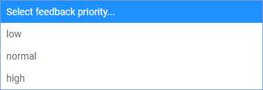

<h1><a class="anchor" id="introduction-to-user-interface" href="#introduction-to-user-interface"><i class="fa fa-link"></i></a>Uvod u korisničko sučelje</h1><h2><a class="anchor" id="table-of-contents" href="#table-of-contents"><i class="fa fa-link"></i></a> Sadržaj</h2><ul><li>
 <a href="#introduction-page">Uvodna stranica</a>
</li><li>
 <a href="#upper-toolbar">Gornja alatna traka</a>
<ul><li> <a href="#upper-toolbar_connect">Spojiti</a><ul><li> <a href="#upper-toolbar_connect_login">Prijaviti se</a></li><li> <a href="#upper-toolbar_connect_register">Registar</a></li><li> <a href="#upper-toolbar_connect_recover">Oporavak</a></li></ul></li><li> <a href="#upper-toolbar_go-to-place">Idite na mjesto</a></li><li> <a href="#upper-toolbar_layers">Slojevi</a></li><li> <a href="#upper-toolbar_selection-tools">Alati za odabir</a></li><li> <a href="#upper-toolbar_show-result">Prikaži rezultat</a></li><li> <a href="#upper-toolbar_feedback">Povratne informacije</a></li><li> <a href="#upper-toolbar_save-session">Spremi sesiju</a></li><li> <a href="#upper-toolbar_save-session-folder">Spremi mapu sesije</a></li></ul></li><li>
 <a href="#tiles">Pločice</a>
</li><li>
 <a href="#how-to-cite">Kako citirati</a>
</li><li>
 <a href="#authors-and-reviewers">Autori i recenzenti</a>
</li><li>
 <a href="#license">Licenca</a>
</li><li>
 <a href="#acknowledgement">Priznanje</a>
</li></ul><h2><a class="anchor" id="introduction-page" href="#introduction-page"><i class="fa fa-link"></i></a> Uvodna stranica</h2>
 Jednom kada se otvori alatni okvir, prikazuje se stranica odricanja prava. Osim poruke o odricanju odgovornosti, pružaju se dodatne informacije u vezi s podržanim preglednicima, ciljevima projekta Hotmaps, poveznica na web mjesto projekta Hotmaps i spremišta podataka.

 <em>Slika 1 Kratki uvod u alatni okvir Hotmaps</em>

 Hotmaps GUI je sučelje temeljeno na GIS-u. Zatvaranjem stranice o odricanju odgovornosti, korisnik vidi kartu Europe. Prema zadanim postavkama prikazana je karta gustoće potrebe za toplinom zemalja EU-28 i granice NUTS 2. Pored ove dvije karte, u GUI-ju se mogu vidjeti i neki alati i gumbi. Ovi su alati prikazani na sljedećoj slici.

 <em>Slika 2 Početna stranica</em>

 Ovdje možete na prvi pogled uočiti 3 dijela korisničkog sučelja:
<ol><li> <a href="#upper-toolbar">alatna traka gore lijevo</a> ,</li><li> karta sama,</li><li> <a href="#tiles">neki alati za promjenu stila karte</a> .</li><li> dvije veze gore desno: na ovaj <a href="https://wiki.hotmaps.eu/">Wiki Hotmaps</a> i na web <a href="https://www.hotmaps-project.eu/">mjesto Projekta Hotmaps</a> .</li></ol>
 U sljedećim su poglavljima detaljno objašnjena prva 3 boda.

 <a href="#table-of-contents"><strong><code>To Top</code></strong></a>
<h2><a class="anchor" id="upper-toolbar" href="#upper-toolbar"><i class="fa fa-link"></i></a> Gornja alatna traka</h2>

 Pomoću ove alatne trake možete:
<ol><li> <a href="#upper-toolbar_connect"><em>Povežite se:</em></a> registrirajte se i prijavite u web aplikaciju kako biste sačuvali svoj rad,</li><li> <a href="#upper-toolbar_go-to-place"><em>Idi na mjesto:</em></a> zumirajte određeno područje upisivanjem imena,</li><li> <a href="#upper-toolbar_layers"><em>Slojevi:</em></a> prikaži bočnu traku sloja,</li><li> <a href="#upper-toolbar_selection-tools"><em>Alati za odabir</em> :</a> omogućite ili onemogućite alate za odabir,</li><li> <a href="#upper-toolbar_show-result"><em>Prikaži rezultat:</em></a> prikaži bočnu traku rezultata za vaše odabrane regije,</li><li> <a href="#upper-toolbar_feedback"><em>Povratne informacije:</em></a> dajte nam povratne informacije u vezi s alatom,</li><li> <a href="#upper-toolbar_save-session"><em>Spremi sesiju:</em></a> možete spremiti odabrane slojeve i razinu zumiranja i pozvati ih kasnije,</li><li> <a href="#upper-toolbar_save-session-folder"><em>Spremi mapu sesije:</em></a> gdje možete vidjeti popis svih spremljenih sesija.</li></ol>
 <a href="#table-of-contents"><strong><code>To Top</code></strong></a>
<h3><a class="anchor" id="connect" href="#connect"><i class="fa fa-link"></i></a> Spojiti</h3>
 Ovdje možete:
<ul><li> Stvorite račun</li><li> Prijavite se na svoj račun da biste spremili napredak</li><li> Ili resetirajte lozinku ako je zaboravite</li></ul>
 <a href="#table-of-contents"><strong><code>To Top</code></strong></a>
<h4><a class="anchor" id="login" href="#login"><i class="fa fa-link"></i></a> Prijaviti se</h4>
 Nakon <a href="#register">registracije</a> i aktivacije računa trebali biste se moći prijaviti putem e-pošte i lozinke (vidi sliku <a href="#fig4">4</a> dolje).

 <em>Slika 4.: Obrazac za prijavu</em>

 <a href="#table-of-contents"><strong><code>To Top</code></strong></a>
<h4><a class="anchor" id="register" href="#register"><i class="fa fa-link"></i></a> Registar</h4>
 Ovdje možete stvoriti račun za web mjesto s <em>vrućim kartama</em> . Nakon slanja <a href="#fig5">obrasca</a> primit ćete e-poruku za aktiviranje računa. Pomoću svog računa moći ćete spremiti napredak.

 <em>Slika 5.: Obrazac za registraciju</em>

 <a href="#table-of-contents"><strong><code>To Top</code></strong></a>
<h4><a class="anchor" id="recover" href="#recover"><i class="fa fa-link"></i></a> Oporavak</h4>
 Ako ikad zaboravite lozinku, možete je vratiti u ovom izborniku (vidi sliku <a href="#fig6">6.</a> Dolje). Imajte na umu da nakon toga postavite novu lozinku.

 <em>Slika 6 .: Obrazac za oporavak</em>

 <a href="#table-of-contents"><strong><code>To Top</code></strong></a>
<h3><a class="anchor" id="go-to-place" href="#go-to-place"><i class="fa fa-link"></i></a> Idite na mjesto</h3>
 Možete zumirati određeno područje upisivanjem njegovog naziva (vidi animaciju ispod)

 <a href="#table-of-contents"><strong><code>To Top</code></strong></a>
<h3><a class="anchor" id="layers" href="#layers"><i class="fa fa-link"></i></a> Slojevi</h3>
 Pritiskom na ovaj gumb lijevo se prikazuje bočna traka s različitim vrstama slojeva.

 Sljedeći slojevi se mogu pronaći i vizualizirati:

 <a href="#table-of-contents"><strong><code>To Top</code></strong></a>
<h3><a class="anchor" id="selection-tools" href="#selection-tools"><i class="fa fa-link"></i></a> Alati za odabir</h3>
 Pritiskom na ovaj gumb alati za odabir pojavit će se na lijevoj strani zaslona

 Donja slika prikazuje izgled alata:

<ol><li> Alat za odabir regija</li><li> Stvorite prilagođenu kvadratnu regiju</li><li> Stvorite prilagođenu regiju kruga</li><li> Stvorite prilagođenu regiju poligona</li><li> Prenesite GeoJSON objekt da biste koristili odabir prilagođenog područja</li></ol><ol type="A"><li> pokazuje koliko ste regija odabrali</li><li> prikazuje ukupnu površinu najmanjeg pravokutnika koji može pokriti odabrano područje</li><li> prikazuje mjerilo koje ste odabrali na desnoj alatnoj traci</li></ol><ol type="a"><li> gumb za učitavanje rezultata odabrane regije i odabranih slojeva</li><li> gumb za brisanje odabrane regije</li></ol>
 <a href="#table-of-contents"><strong><code>To Top</code></strong></a>
<h3><a class="anchor" id="show-result" href="#show-result"><i class="fa fa-link"></i></a> Prikaži rezultat</h3>
 Ovisno o slojevima i regiji koje ste odabrali, rezultati za vašu konfiguraciju prikazuju se na bočnoj traci s desne strane zaslona

 <a href="#table-of-contents"><strong><code>To Top</code></strong></a>
<h3><a class="anchor" id="feedback" href="#feedback"><i class="fa fa-link"></i></a> Povratne informacije</h3>
 Imate li prijedloga kako poboljšati alat? Jeste li primijetili pogreške? Obavijestite nas! Davanjem povratnih informacija možete nam pomoći da poboljšamo alatni set!

 Molimo ispunite donji <a href="#Fig7">obrazac</a> :

 <a href="#table-of-contents"><strong><code>To Top</code></strong></a>

 možete birati između sljedećih vrsta:

 i postavite prioritet:

 <a href="#table-of-contents"><strong><code>To Top</code></strong></a>
<h3><a class="anchor" id="save-session" href="#save-session"><i class="fa fa-link"></i></a> Spremi sesiju</h3>
 pritiskom na ovaj gumb možete napraviti snimak svog rada (odabrana područja i slojevi, razine zumiranja itd.). Također možete definirati ime i opis snimke.
<h3><a class="anchor" id="save-session-folder" href="#save-session-folder"><i class="fa fa-link"></i></a> Spremi mapu sesije</h3>
 Ovdje vidite sve svoje snimke s njihovim imenima i opisom. Kad odaberete jedan, učitavaju se odabrani slojevi, područja, razina zumiranja i druga konfiguracija.
<h2><a class="anchor" id="tiles" href="#tiles"><i class="fa fa-link"></i></a> Pločice</h2>
 Možete odabrati teritorijalnu ljestvicu koju želite analizirati (NUTS regije ili razina hektara) i postaviti pločicu karte

 Moguće su sljedeće konfiguracije

<ol><li> Povećajte i smanjite kartu</li><li> Pokažite granice NUTS-a da biste odabrali određene NUTS regije ili upotrijebite hektar da prilagodite svoj <a href="#upper-toolbar_selection-tools">odabir</a></li><li> Upotrijebite pločicu OpenStreetMap ili pločicu Satelite</li></ol>
 <a href="#table-of-contents"><strong><code>To Top</code></strong></a>
<h2><a class="anchor" id="how-to-cite" href="#how-to-cite"><i class="fa fa-link"></i></a> Kako citirati</h2>
 Jeton Hasani, u Hotmaps-Wiki, Uvod u korisničko sučelje (travanj 2019)

 <a href="#table-of-contents"><strong><code>To Top</code></strong></a>
<h2><a class="anchor" id="authors-and-reviewers" href="#authors-and-reviewers"><i class="fa fa-link"></i></a> Autori i recenzenti</h2>
 Ovu je stranicu napisao Jeton Hasani <strong><a href="https://eeg.tuwien.ac.at/">EEG - TU Wien</a></strong> .

 ☑ Ovu je stranicu pregledao Mostafa Fallahnejad <strong><a href="https://eeg.tuwien.ac.at/">EEG - TU Wien</a></strong> .

 <a href="#table-of-contents"><strong><code>To Top</code></strong></a>
<h2><a class="anchor" id="license" href="#license"><i class="fa fa-link"></i></a> Licenca</h2>
 Copyright © 2016-2020: Jeton Hasani

 Creative Commons Attribution 4.0 međunarodna licenca

 Ovo je djelo licencirano pod Creative Commons CC BY 4.0 međunarodnom licencom.

 SPDX-identifikator licence: CC-BY-4.0

 Tekst licence: https://spdx.org/licenses/CC-BY-4.0.html

 <a href="#table-of-contents"><strong><code>To Top</code></strong></a>
<h2><a class="anchor" id="acknowledgement" href="#acknowledgement"><i class="fa fa-link"></i></a> Priznanje</h2>
 Željeli bismo izraziti našu najdublju zahvalnost projektu Horizon 2020 <a href="https://www.hotmaps-project.eu">Hotmaps</a> (Ugovor o dodjeli bespovratnih sredstava broj 723677), koji je osigurao financijska sredstva za provođenje ove istrage.

 <a href="#table-of-contents"><strong><code>To Top</code></strong></a>

<!--- THIS IS A SUPER UNIQUE IDENTIFIER -->

This page was automatically translated. View in another language:

[English](../en/Introduction-to-user-interface) (original) [Bulgarian](../bg/Introduction-to-user-interface)\* [Czech](../cs/Introduction-to-user-interface)\* [Danish](../da/Introduction-to-user-interface)\* [German](../de/Introduction-to-user-interface)\* [Greek](../el/Introduction-to-user-interface)\* [Spanish](../es/Introduction-to-user-interface)\* [Estonian](../et/Introduction-to-user-interface)\* [Finnish](../fi/Introduction-to-user-interface)\* [French](../fr/Introduction-to-user-interface)\* [Irish](../ga/Introduction-to-user-interface)\*  [Hungarian](../hu/Introduction-to-user-interface)\* [Italian](../it/Introduction-to-user-interface)\* [Lithuanian](../lt/Introduction-to-user-interface)\* [Latvian](../lv/Introduction-to-user-interface)\* [Maltese](../mt/Introduction-to-user-interface)\* [Dutch](../nl/Introduction-to-user-interface)\* [Polish](../pl/Introduction-to-user-interface)\* [Portuguese (Portugal, Brazil)](../pt/Introduction-to-user-interface)\* [Romanian](../ro/Introduction-to-user-interface)\* [Slovak](../sk/Introduction-to-user-interface)\* [Slovenian](../sl/Introduction-to-user-interface)\* [Swedish](../sv/Introduction-to-user-interface)\* 

\* machine translated
