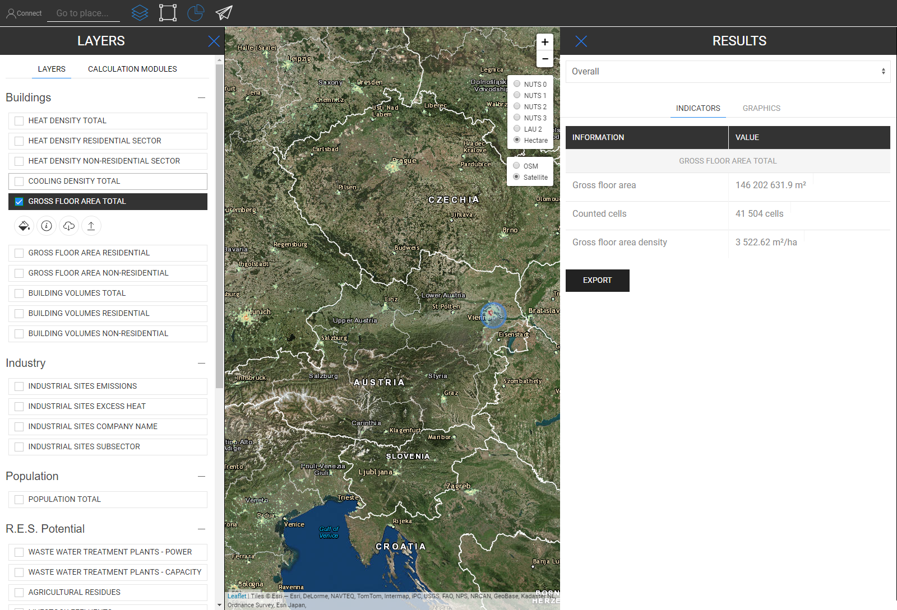

<h1><a class="anchor" id="retrieve-indicators-of-a-selected-area" href="#retrieve-indicators-of-a-selected-area"><i class="fa fa-link"></i></a>Dohvatite pokazatelje odabranog područja</h1><h2><a class="anchor" id="table-of-contents" href="#table-of-contents"><i class="fa fa-link"></i></a> Sadržaj</h2><ul><li> <a href="#introduction">Uvod</a></li><li> <a href="#indicators-for-raster-layers">Pokazatelji za rasterske slojeve</a><ul><li> <a href="#indicators-for-raster-layers_buildings">Građevine</a></li><li> <a href="#indicators-for-raster-layers_population">Stanovništvo</a></li><li> <a href="#indicators-for-raster-layers_renewable-energy-source-potentials">Potencijali obnovljivih izvora energije</a></li></ul></li><li> <a href="#indicators-for-vector-layers">Pokazatelji za vektorske slojeve</a><ul><li> <a href="#indicators-for-vector-layers_industry">Industrija</a></li><li> <a href="#indicators-for-vector-layers_renewable-energy-source-potentials">Potencijali obnovljivih izvora energije</a></li><li> <a href="#indicators-for-vector-layers_electricity">Struja</a></li></ul></li><li> <a href="#example">Primjer</a></li><li> <a href="#how-to-cite">Kako citirati</a></li><li> <a href="#authors-and-reviewers">Autori i recenzenti</a></li><li> <a href="#license">Licenca</a></li><li> <a href="#acknowledgement">Priznanje</a></li></ul><h2><a class="anchor" id="introduction" href="#introduction"><i class="fa fa-link"></i></a> Uvod</h2>
 Ovisno o slojevima i regiji koje ste odabrali pokazatelji za vašu konfiguraciju prikazani su na bočnoj traci s desne strane zaslona

 <a href="#table-of-contents"><strong><code>To Top</code></strong></a>

 U nastavku ćemo pogledati pokazatelje koji se prikazuju za rasterske i vektorske slojeve.
<h2><a class="anchor" id="indicators-for-raster-layers" href="#indicators-for-raster-layers"><i class="fa fa-link"></i></a> Pokazatelji za rasterske slojeve</h2>
 Pokazatelji na rasterskim slojevima razlikuju se od vektorskih slojeva. Pod različitim podrazumijevamo u smislu agregacije i razvrstavanja. Ovo različito ponašanje dolazi iz teritorijalnih rezolucija.

 Rasterski slojevi općenito imaju puno veću rezoluciju, dok vektorski slojevi imaju samo atribute u točkama ili poligonima.

 To s jedne strane znači, na primjer, ako odaberete vektorski sloj koji je definiran NUTS3 poligonima i želite, na primjer, odabrati LAU regiju, tada vrijednost NUTS3 neće biti razvrstana na razinu LAU, umjesto toga, pokazatelj NUTS3 gdje je ovo LAU regija koja se nalazi bit će prikazana na bočnoj traci rezultata.

 S druge strane, rasterski slojevi se agregiraju i raščlanjuju &quot;proizvoljno&quot; *

 * od strane ćelija koje sadrže unutar područja koje ste odabrali (naravno unutar granica same rasterske razlučivosti)

 <a href="#table-of-contents"><strong><code>To Top</code></strong></a>
<h3><a class="anchor" id="buildings" href="#buildings"><i class="fa fa-link"></i></a> Građevine</h3>
 <strong>Karta gustoće topline</strong>

 <strong>Dodatna značajka</strong>

 Kada istodobno odaberete sloj gustoće topline i sloj stanovništva, prikazuje se dodatni indikator (pogledajte sliku dolje)

 <a href="#table-of-contents"><strong><code>To Top</code></strong></a>
<h3><a class="anchor" id="in-general-" href="#in-general-"><i class="fa fa-link"></i></a> Općenito:</h3>
 Kada se istodobno odabere jedan od slojeva zgrade i sloj stanovništva, prikazat će se dodatni pokazatelj kako je prethodno opisano

<ins> <code><strong><a href="#indicators-for-raster-layers">To Chapter</a></strong></code></ins>

 <strong>Karta gustoće hlađenja</strong>

<ins> <code><strong><a href="#indicators-for-raster-layers">To Chapter</a></strong></code></ins>

 <strong>Izgradnja svezaka</strong>

<ins> <code><strong><a href="#indicators-for-raster-layers">To Chapter</a></strong></code></ins>

 <strong>Bruto površina poda</strong>

<ins> <code><strong><a href="#indicators-for-raster-layers">To Chapter</a></strong></code></ins> <a href="#table-of-contents"><strong><code>To Top</code></strong></a>
<h3><a class="anchor" id="population" href="#population"><i class="fa fa-link"></i></a> Stanovništvo</h3>

<ins> <code><strong><a href="#indicators-for-raster-layers">To Chapter</a></strong></code></ins> <a href="#table-of-contents"><strong><code>To Top</code></strong></a>
<h3><a class="anchor" id="climate" href="#climate"><i class="fa fa-link"></i></a> Klima</h3>
 <strong>Temperatura</strong>

<ins> <code><strong><a href="#indicators-for-raster-layers">To Chapter</a></strong></code></ins>

 <strong>Dani stupnja hlađenja</strong>

<ins> <code><strong><a href="#indicators-for-raster-layers">To Chapter</a></strong></code></ins>

 <strong>Dani stupnja grijanja</strong>

<ins> <code><strong><a href="#indicators-for-raster-layers">To Chapter</a></strong></code></ins>

 <strong>Solarno zračenje</strong>

<ins> <code><strong><a href="#indicators-for-raster-layers">To Chapter</a></strong></code></ins>

 <strong>Brzina vjetra</strong>

<ins> <code><strong><a href="#indicators-for-raster-layers">To Chapter</a></strong></code></ins> <a href="#table-of-contents"><strong><code>To Top</code></strong></a>
<h3><a class="anchor" id="renewable-energy-source-potentials" href="#renewable-energy-source-potentials"><i class="fa fa-link"></i></a> Potencijali obnovljivih izvora energije</h3>
 <strong>Sunčevo zračenje na građevinskom otisku</strong>

<ins> <code><strong><a href="#indicators-for-raster-layers">To Chapter</a></strong></code></ins>

 <strong>Potencijal vjetra na 50m</strong>

<ins> <code><strong><a href="#indicators-for-raster-layers">To Chapter</a></strong></code></ins>

 <strong>Šumski ostaci</strong>

<ins> <code><strong><a href="#indicators-for-raster-layers">To Chapter</a></strong></code></ins> <a href="#table-of-contents"><strong><code>To Top</code></strong></a>
<h2><a class="anchor" id="indicators-for-vector-layers" href="#indicators-for-vector-layers"><i class="fa fa-link"></i></a> Pokazatelji za vektorske slojeve</h2><h3><a class="anchor" id="industry" href="#industry"><i class="fa fa-link"></i></a> Industrija</h3>
 <strong>Emisije na industrijskim gradilištima</strong>

<ins> <code><strong><a href="#indicators-for-vector-layers">To Chapter</a></strong></code></ins>

 <strong>Višak topline na industrijskom mjestu</strong>

<ins> <code><strong><a href="#indicators-for-vector-layers">To Chapter</a></strong></code></ins>

 <strong>Naziv tvrtke za industrijsko mjesto</strong>

<ins> <code><strong><a href="#indicators-for-vector-layers">To Chapter</a></strong></code></ins>

 <strong>Podsektor industrijskog gradilišta</strong>

<ins> <code><strong><a href="#indicators-for-vector-layers">To Chapter</a></strong></code></ins> <a href="#table-of-contents"><strong><code>To Top</code></strong></a>
<h3><a class="anchor" id="renewable-energy-source-potentials" href="#renewable-energy-source-potentials"><i class="fa fa-link"></i></a> Potencijali obnovljivih izvora energije</h3>
 <strong>Postrojenja za pročišćavanje otpadnih voda Snaga</strong>

<ins> <code><strong><a href="#indicators-for-vector-layers">To Chapter</a></strong></code></ins>

 <strong>Kapacitet postrojenja za pročišćavanje otpadnih voda</strong>

<ins> <code><strong><a href="#indicators-for-vector-layers">To Chapter</a></strong></code></ins>

 <strong>Poljoprivredni ostaci</strong>

<ins> <code><strong><a href="#indicators-for-vector-layers">To Chapter</a></strong></code></ins>

 <strong>Efluenti stoke</strong>

<ins> <code><strong><a href="#indicators-for-vector-layers">To Chapter</a></strong></code></ins>

 <strong>Komunalni čvrsti otpad</strong>

<ins> <code><strong><a href="#indicators-for-vector-layers">To Chapter</a></strong></code></ins>

 <strong>Geotermalna potencijalna toplinska vodljivost</strong>

<ins> <code><strong><a href="#indicators-for-vector-layers">To Chapter</a></strong></code></ins> <a href="#table-of-contents"><strong><code>To Top</code></strong></a>
<h3><a class="anchor" id="electricity" href="#electricity"><i class="fa fa-link"></i></a> Struja</h3>
 <strong>Emisija električne energije C02</strong>

<ins> <code><strong><a href="#indicators-for-vector-layers">To Chapter</a></strong></code></ins> <a href="#table-of-contents"><strong><code>To Top</code></strong></a>
<h2><a class="anchor" id="example" href="#example"><i class="fa fa-link"></i></a> Primjer</h2>
 Na donjoj slici možete vidjeti kako to izgleda kad se vizualiziraju svi slojevi (ovdje je Austrija odabrana kao NUTS0)

 Iako ova karta na prvi pogled može izgledati pomalo zbunjujuće, njezini pokazatelji su upravo ilustrirani. Pogledajte dolje sve pokazatelje koji su opisani na bočnoj traci rezultata kada odaberete sve slojeve za Austriju (NUTS0)

 <a href="#table-of-contents"><strong><code>To Top</code></strong></a>
<h2><a class="anchor" id="how-to-cite" href="#how-to-cite"><i class="fa fa-link"></i></a> Kako citirati</h2>
 Jeton Hasani, u Hotmaps-Wiki, Dohvati indikatore-odabranog područja (travanj 2019)

 <a href="#table-of-contents"><strong><code>To Top</code></strong></a>
<h2><a class="anchor" id="authors-and-reviewers" href="#authors-and-reviewers"><i class="fa fa-link"></i></a> Autori i recenzenti</h2>
 Ovu je stranicu napisao Jeton Hasani <strong><a href="https://eeg.tuwien.ac.at/">EEG - TU Wien</a></strong> .

 ☑ Ovu je stranicu pregledao Mostafa Fallahnejad <strong><a href="https://eeg.tuwien.ac.at/">EEG - TU Wien</a></strong> .

 <a href="#table-of-contents"><strong><code>To Top</code></strong></a>
<h2><a class="anchor" id="license" href="#license"><i class="fa fa-link"></i></a> Licenca</h2>
 Copyright © 2016-2020: Jeton Hasani

 Creative Commons Attribution 4.0 međunarodna licenca

 Ovo je djelo licencirano pod Creative Commons CC BY 4.0 međunarodnom licencom.

 SPDX-identifikator licence: CC-BY-4.0

 Tekst licence: https://spdx.org/licenses/CC-BY-4.0.html

 <a href="#table-of-contents"><strong><code>To Top</code></strong></a>
<h2><a class="anchor" id="acknowledgement" href="#acknowledgement"><i class="fa fa-link"></i></a> Priznanje</h2>
 Željeli bismo izraziti našu najdublju zahvalnost projektu Horizon 2020 <a href="https://www.hotmaps-project.eu">Hotmaps</a> (Ugovor o dodjeli bespovratnih sredstava broj 723677), koji je osigurao financijska sredstva za provođenje ove istrage.

 <a href="#table-of-contents"><strong><code>To Top</code></strong></a> <code><a href="Indicator-Section/_edit">Review this page</a></code>

<!--- THIS IS A SUPER UNIQUE IDENTIFIER -->

This page was automatically translated. View in another language:

[English](../en/Retrieve-indicators-of-a-selected-area) (original) [Bulgarian](../bg/Retrieve-indicators-of-a-selected-area)\* [Czech](../cs/Retrieve-indicators-of-a-selected-area)\* [Danish](../da/Retrieve-indicators-of-a-selected-area)\* [German](../de/Retrieve-indicators-of-a-selected-area)\* [Greek](../el/Retrieve-indicators-of-a-selected-area)\* [Spanish](../es/Retrieve-indicators-of-a-selected-area)\* [Estonian](../et/Retrieve-indicators-of-a-selected-area)\* [Finnish](../fi/Retrieve-indicators-of-a-selected-area)\* [French](../fr/Retrieve-indicators-of-a-selected-area)\* [Irish](../ga/Retrieve-indicators-of-a-selected-area)\*  [Hungarian](../hu/Retrieve-indicators-of-a-selected-area)\* [Italian](../it/Retrieve-indicators-of-a-selected-area)\* [Lithuanian](../lt/Retrieve-indicators-of-a-selected-area)\* [Latvian](../lv/Retrieve-indicators-of-a-selected-area)\* [Maltese](../mt/Retrieve-indicators-of-a-selected-area)\* [Dutch](../nl/Retrieve-indicators-of-a-selected-area)\* [Polish](../pl/Retrieve-indicators-of-a-selected-area)\* [Portuguese (Portugal, Brazil)](../pt/Retrieve-indicators-of-a-selected-area)\* [Romanian](../ro/Retrieve-indicators-of-a-selected-area)\* [Slovak](../sk/Retrieve-indicators-of-a-selected-area)\* [Slovenian](../sl/Retrieve-indicators-of-a-selected-area)\* [Swedish](../sv/Retrieve-indicators-of-a-selected-area)\* 

\* machine translated
