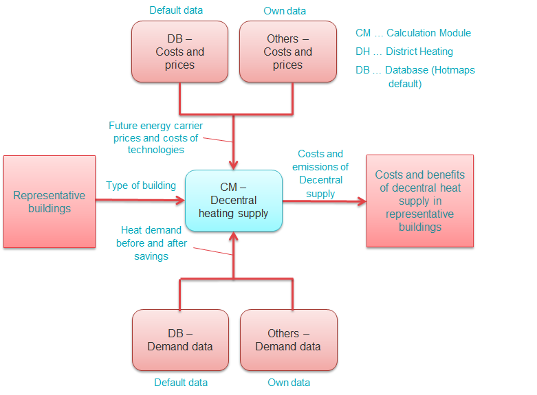

<h1><a class="anchor" id="national-level---step-3--calculation-of-decentral-heat-supply" href="#national-level---step-3--calculation-of-decentral-heat-supply"><i class="fa fa-link"></i></a>Nacionalna razina - Korak 3: Izračun decentralne opskrbe toplinom</h1>
 <a href="guide-national-level-comprehensive-assessment-eed#part-iii-analysis-of-the-economic-potential-for-efficiency-in-heating-and-cooling_different-steps"><strong><code>Scenario Toolchain Steps</code></strong></a> <a href="Step-2-Costs-and-potentials-for-district-heating-in-representative-regions-or-cities"><strong><code>Previous step</code></strong></a> <a href="Step-4-Comparison-of-results-for-different-scenarios"><strong><code>Next step</code></strong></a>
<h2><a class="anchor" id="table-of-contents" href="#table-of-contents"><i class="fa fa-link"></i></a> Sadržaj</h2><ul><li> <a href="#introduction">Uvod</a></li><li> <a href="#calculation-of-decentral-heat-supply">Proračun decentralne opskrbe toplinom</a></li><li> <a href="#how-to-cite">Kako citirati</a></li><li> <a href="#authors-and-reviewers">Autori i recenzenti</a></li><li> <a href="#license">Licenca</a></li><li> <a href="#acknowledgement">Priznanje</a></li></ul><h2><a class="anchor" id="introduction" href="#introduction"><i class="fa fa-link"></i></a> Uvod</h2>
 Ovo je drugi korak analize na nacionalnoj razini.

<ins> <code><strong><a href="#table-of-contents">To Top</a></strong></code></ins>
<h2><a class="anchor" id="calculation-of-decentral-heat-supply" href="#calculation-of-decentral-heat-supply"><i class="fa fa-link"></i></a> Proračun decentralne opskrbe toplinom</h2>
 U trećem koraku izračunavaju se troškovi i emisije opskrbe toplinom putem decentralnih tehnologija. Ovaj izračun treba izvršiti za različite reprezentativne zgrade u zemlji / regiji od interesa. Iako su za gradove / područja reprezentativnog daljinskog grijanja razvijeni u koraku 1 pristupa, tipične zgrade u svakoj državi članici EU-a mogu se naći u zadanoj bazi podataka Hotmapsa. Također, za mnoge zemlje EU detaljne statistike zgrada (arhetipovi zgrada) s podacima o potražnji topline prije i nakon obnove mogu se naći u statistici i literaturi.

 CM - Decentralna opskrba grijanjem može se koristiti za izračunavanje troškova i emisija opskrbe toplinom putem različitih decentralnih tehnologija. Modul koristi podatke o potražnji topline, kao i podatke o troškovima tehnologija i cijenama nosača energije za izračunavanje niveliranih troškova opskrbe toplinom [EUR / MWh] za različite tehnologije u različitim tipičnim zgradama i državama obnove. Sljedeća slika grafički prikazuje ovaj postupak i prikazuje različite izvore podataka koji se napajaju u CM - decentralizirano grijanje.

 <em>Slika: Izračun decentralne opskrbe toplinom (korak 3)</em>

 Izračuni se mogu koristiti za utvrđivanje troškova i koristi različitih tehnologija opskrbe u različitim reprezentativnim zgradama i njihove osjetljivosti na važne utjecajne parametre kao što su nosač energije i cijene CO2 ili kamatne stope i vrijeme amortizacije.

 Ishodi ovog koraka su troškovi opskrbe toplinom putem decentraliziranih tehnologija [EUR / MWh] u svakoj od reprezentativnih zgrada i s tim povezane emisije CO2 [kt / god]. Ti će se rezultati zatim koristiti u ukupnoj usporedbi scenarija u koraku 4.

<ins> <code><strong><a href="#table-of-contents">To Top</a></strong></code></ins>
<h2><a class="anchor" id="how-to-cite" href="#how-to-cite"><i class="fa fa-link"></i></a> Kako citirati</h2>
 Marcus Hummel, Giulia Conforto, u Hotmaps-Wiki, Smjernice za upotrebu alata Hotmaps za analize na nacionalnoj razini (kolovoz 2020.)

<ins> <code><strong><a href="#table-of-contents">To Top</a></strong></code></ins>
<h2><a class="anchor" id="authors-and-reviewers" href="#authors-and-reviewers"><i class="fa fa-link"></i></a> Autori i recenzenti</h2>
 Ovu su stranicu napisali Marcus Hummel i Giulia Conforto ( <strong><a href="https://e-think.ac.at">e-think</a></strong> ).

 ☑ Ovu je stranicu pregledao Mostafa Fallahnejad ( <strong><a href="https://eeg.tuwien.ac.at/">EEG - TU Wien</a></strong> ).

 <a href="#table-of-contents"><strong><code>To Top</code></strong></a>
<h2><a class="anchor" id="license" href="#license"><i class="fa fa-link"></i></a> Licenca</h2>
 Copyright © 2016-2020: Marcus Hummel, Giulia Conforto

 Creative Commons Attribution 4.0 međunarodna licenca

 Ovo je djelo licencirano pod Creative Commons CC BY 4.0 međunarodnom licencom.

 SPDX-identifikator licence: CC-BY-4.0

 Tekst licence: https://spdx.org/licenses/CC-BY-4.0.html

<ins> <code><strong><a href="#table-of-contents">To Top</a></strong></code></ins>
<h2><a class="anchor" id="acknowledgement" href="#acknowledgement"><i class="fa fa-link"></i></a> Priznanje</h2>
 Željeli bismo izraziti našu najdublju zahvalnost projektu Horizon 2020 <a href="https://www.hotmaps-project.eu">Hotmaps</a> (Ugovor o dodjeli bespovratnih sredstava broj 723677), koji je osigurao financijska sredstva za provođenje ove istrage.

<ins> <code><strong><a href="#table-of-contents">To Top</a></strong></code></ins>

<!--- THIS IS A SUPER UNIQUE IDENTIFIER -->

This page was automatically translated. View in another language:

[English](../en/Step-3-Calculation-of-decentral-heat-supply) (original) [Bulgarian](../bg/Step-3-Calculation-of-decentral-heat-supply)\* [Czech](../cs/Step-3-Calculation-of-decentral-heat-supply)\* [Danish](../da/Step-3-Calculation-of-decentral-heat-supply)\* [German](../de/Step-3-Calculation-of-decentral-heat-supply)\* [Greek](../el/Step-3-Calculation-of-decentral-heat-supply)\* [Spanish](../es/Step-3-Calculation-of-decentral-heat-supply)\* [Estonian](../et/Step-3-Calculation-of-decentral-heat-supply)\* [Finnish](../fi/Step-3-Calculation-of-decentral-heat-supply)\* [French](../fr/Step-3-Calculation-of-decentral-heat-supply)\* [Irish](../ga/Step-3-Calculation-of-decentral-heat-supply)\*  [Hungarian](../hu/Step-3-Calculation-of-decentral-heat-supply)\* [Italian](../it/Step-3-Calculation-of-decentral-heat-supply)\* [Lithuanian](../lt/Step-3-Calculation-of-decentral-heat-supply)\* [Latvian](../lv/Step-3-Calculation-of-decentral-heat-supply)\* [Maltese](../mt/Step-3-Calculation-of-decentral-heat-supply)\* [Dutch](../nl/Step-3-Calculation-of-decentral-heat-supply)\* [Polish](../pl/Step-3-Calculation-of-decentral-heat-supply)\* [Portuguese (Portugal, Brazil)](../pt/Step-3-Calculation-of-decentral-heat-supply)\* [Romanian](../ro/Step-3-Calculation-of-decentral-heat-supply)\* [Slovak](../sk/Step-3-Calculation-of-decentral-heat-supply)\* [Slovenian](../sl/Step-3-Calculation-of-decentral-heat-supply)\* [Swedish](../sv/Step-3-Calculation-of-decentral-heat-supply)\* 

\* machine translated
